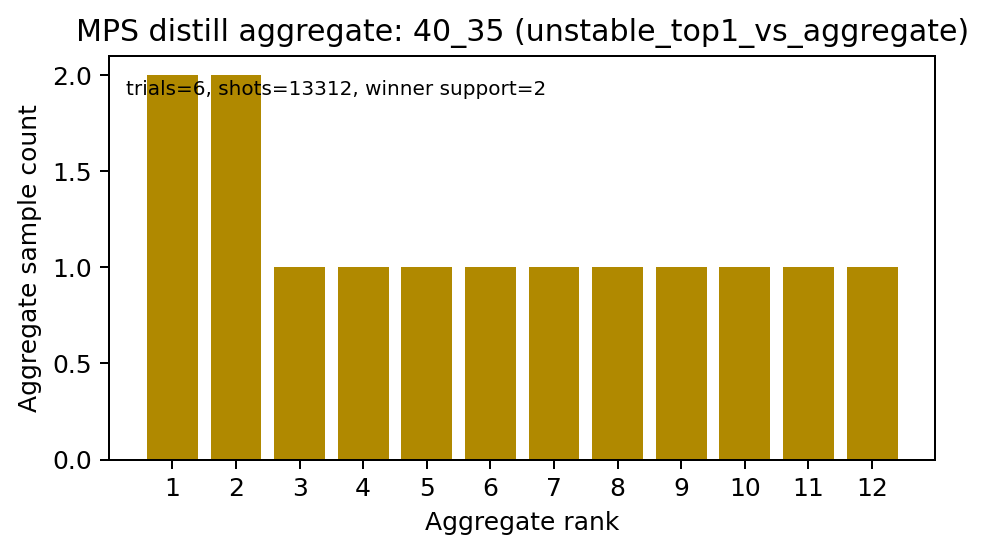
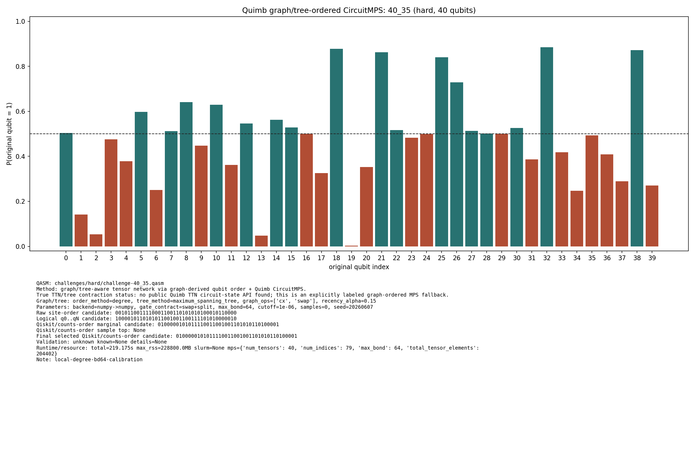

# Quantum Junction: QMill Quantum Peak Challenge

We built a multi-model cracking pipeline for obfuscated peaked quantum circuits.
Instead of brute-forcing every `.qasm` file with the same simulator, our
`quantum_peak_method_selector.py` inspects each circuit first and routes it to
the cheapest method likely to work.

**Unique selling point:** Quantum Peak turns the challenge from "run bigger
simulations" into "choose the right simulator before spending compute." This
saved substantial runtime by avoiding blind runs across all algorithms, while
still using several complementary methods when the circuit structure demanded it.

## Judge Pitch

The challenge circuits hide a high-probability secret bitstring inside
obfuscated quantum circuits. A naive solution keeps increasing simulator size
until it runs out of memory or time. Our solution does the opposite: it reads the
QASM structure, detects the circuit family, and selects the most efficient attack
path.

That gave us a practical, generalizable pipeline:

- Exact Qiskit statevector for small circuits.
- Qiskit Aer MPS sampling for larger but still manageable circuits.
- Low-bond MPS plus bitstring distillation for unstable sampled peaks.
- Tensor Network Operator midpoint contraction for structured hard circuits.
- MPO cancellation and unswapping for hidden inverse blocks and permutations.
- Graph/tree-ordered Quimb tensor networks when plain 1D MPS ordering failed.
- MPO sweep plus subspace reduction for the hardest circuits.

The result was a compute-aware solver, not a single hard-coded trick.

## Visual Evidence

We use graphs to decide whether a bitstring is trustworthy. Flat support means a
naive MPS run is not enough; graph/tree-ordered marginals show which qubit values
cross the decision threshold and become the candidate bitstring.

<p align="center">
  
</p>

<p align="center">
  
</p>

## Result Snapshot

Latest normalized session:

- `41/49` challenge circuits selected.
- `10` exact statevector answers.
- `31` MPS or tensor-network-derived candidates.
- `64_40` selected from weak MPO-unswapping evidence.
- Remaining very-hard circuits needed more compute than the hackathon window
  allowed: `48_42`, `56_43`, `64_44`, `72_45`, `80_46`, `88_47`, `96_48`,
  `104_49`.

Answer evidence:

- `research/tree_tensor_sim_session/results_index/selected_answers.tsv`
- `research/tree_tensor_sim_session/artifacts/collector/SUBMISSION_ANSWERS.md`
- `research/tree_tensor_sim_session/artifacts/collector/CANDIDATE_EVIDENCE.json`

All bitstrings use Qiskit/counts order: the right-most bit is qubit `0`.

## Quantum Peak Method Selector

`quantum_peak_method_selector.py` is the compute-saving router.

It parses QASM without Qiskit and measures:

- qubit count, operation count, and approximate depth
- `rx`, `rz`, `cx`, and `swap` counts
- entangling graph density
- repeated two-qubit interactions
- leading/trailing single-qubit dressing layers
- angle-grid clues such as rotations near fractions of `pi`
- hidden permutation and inverse-block signals

It then recommends the first serious method:

- exact statevector baseline
- low-bond MPS with bitstring distillation
- TNO midpoint contraction
- MPO cancellation with unswapping

This is the core efficiency gain: each circuit gets a targeted solver instead
of an expensive all-method sweep.

## Pipeline

**Small circuits:** exact statevector simulation produced reliable peaks and
calibrated bit order.

**Medium circuits:** Aer MPS used `4096` shots and bond dimensions around
`32-64`. Stable repeated winners were kept; flat or unstable distributions were
rejected as weak evidence.

**Hard circuits:** Kremer-Dupuis-style tensor-network methods exploited repeated
interactions, hidden inverse blocks, and cancellation structure.

**Hardest circuits:** graph/tree ordering and MPO sweeps searched for useful
insertion points rather than assuming one fixed circuit template. Agreement
across sweeps froze high-confidence bits and reduced later searches to uncertain
positions.

This makes the approach portable to other obfuscated circuits with repeated
motifs, hidden cancellations, inverse blocks, or non-random interaction graphs.

## Quick Start

Run the method selector on one circuit:

```bash
python3 quantum_peak_method_selector.py examples/tiny_peak.qasm
```

Generate the full method recommendation report:

```bash
python3 quantum_peak_method_selector.py challenges \
  --out reports/qmill_method_report.md \
  --detail-limit -1
```

Generate machine-readable reports:

```bash
python3 quantum_peak_method_selector.py challenges --format json --out reports/qmill_method_report.json
python3 quantum_peak_method_selector.py challenges --format csv --out reports/qmill_method_report.csv
```

Run a graph/tree-ordered tensor-network trial:

```bash
python3 jobs/quimb_tree_tensor_runner.py \
  --qasm challenges/easy/challenge-40_16.qasm \
  --out-dir outputs/tree_tensor_sim/quimb_pilot \
  --backend auto \
  --max-bond 512 \
  --samples 2048
```

Run an MPO-unswapping trial:

```bash
python3 jobs/peaked_mpo_unswap_runner.py \
  --qasm challenges/hard/challenge-64_40.qasm \
  --out-dir outputs/tree_tensor_sim/peaked_unswap_gpu \
  --backend auto \
  --max-bond 8192 \
  --samples 1000
```

## Repository Map

- `quantum_peak_method_selector.py`: compute-saving method selector.
- `challenges/`: challenge QASM files.
- `agent_work/exact_baseline/`: exact statevector baseline.
- `agent_work/mps_distill/`: Aer MPS sampling and bitstring distillation.
- `jobs/quimb_tree_tensor_runner.py`: graph/tree-ordered Quimb MPS runner.
- `jobs/peaked_mpo_unswap_runner.py`: MPO cancellation and unswapping runner.
- `jobs/collect_peak_candidates.py`: evidence collector.
- `research/tree_tensor_sim_session/`: final report, normalized results, and
  solution evidence.
- `peaked-circuit-simulation/`: adapted Kremer-Dupuis implementation.

## References

1. Qiskit Aer matrix product state simulation.
2. D. Kremer and E. Dupuis, "Efficient Classical Simulation of Heuristic Peaked
   Quantum Circuits", arXiv:2604.21908.
3. M. Rudolph and J. Tindall, "Simulating and Sampling from Quantum Circuits
   with 2D Tensor Networks", arXiv:2507.11424.
