# MPO Graph TNS Current Report

Generated: 2026-06-06T14:07:46+01:00

This report summarizes the current `peaked_mpo_graph_tns` outputs in the `klalee-graph` worktree. For completed runs, the bitstring distribution is the sampled `sampling.top` list from the selected record for that challenge. `qiskit_order` is derived as the reverse of `permuted_measurement_order`, matching `final_candidate_qiskit_order`. The overview table embeds a distribution image thumbnail for every challenge, and each challenge detail includes the full SVG. Challenges without sampled results include a placeholder image.

## Summary

- Usable coverage: 41 / 49
- Missing or only incorrect: 16_28, 24_29, 104_49, 64_44, 72_45, 80_46, 88_47, 96_48
- Known incorrect completed outputs present: 16_28, 24_29, 28_4
- Workload CPU running now: 33 tasks, 936 cores
- GPU array running now: 5 tasks
- Chosen-record status counts: {'ok': 43, 'started': 6}
- Chosen-record validation counts: {'correct': 8, 'unknown': 33, 'incorrect': 2, 'None': 6}
- Chosen-record source counts: {'all_gpu': 36, 'all_cpu': 11, 'vhard_fast_b': 2}
- Active extra retry jobs added after the first report pass: `34619634` -> `extra_cpu_d` for `16_28`; `34619647` -> throttled `extra_cpu_e` for `24_29,104_49,48_42,56_43,64_44,72_45,80_46,88_47,96_48`; `34619942` -> 8-core throttled `extra_cpu_f` for `16_28,24_29,104_49,48_42,56_43,64_44,72_45,80_46,88_47,96_48`; `34620754` -> 8-core throttled `extra_cpu_g` for the same unresolved set.
- Imported external fast very-hard retry outputs from `../hard-problems`: `34619926`, `34620010`, `34620567`.
- Current replacement dependency-gated jobs: `34621642` fallback array, `34621643` combined rollup.

## Source Output Counts

| source | jsons | status counts | validation counts |
|---|---:|---|---|
| `all_cpu` | 49 | `{'started': 24, 'ok': 25}` | `{'None': 24, 'correct': 8, 'incorrect': 1, 'unknown': 16}` |
| `all_gpu` | 49 | `{'started': 8, 'ok': 41}` | `{'None': 8, 'correct': 7, 'incorrect': 3, 'unknown': 31}` |
| `param_probe` | 2 | `{'started': 1, 'ok': 1}` | `{'None': 1, 'correct': 1}` |
| `missing_cpu` | 9 | `{'started': 7, 'ok': 2}` | `{'None': 7, 'incorrect': 2}` |
| `extra_cpu` | 10 | `{'started': 8, 'ok': 2}` | `{'None': 8, 'incorrect': 2}` |
| `extra_cpu_b` | 3 | `{'started': 3}` | `{'None': 3}` |
| `extra_cpu_c` | 1 | `{'started': 1}` | `{'None': 1}` |
| `extra_cpu_d` | 1 | `{'started': 1}` | `{'None': 1}` |
| `extra_cpu_e` | 2 | `{'started': 2}` | `{'None': 2}` |
| `extra_cpu_f` | 10 | `{'started': 9, 'ok': 1}` | `{'None': 9, 'incorrect': 1}` |
| `extra_cpu_g` | 5 | `{'started': 5}` | `{'None': 5}` |
| `vhard_fast` | 8 | `{'started': 5, 'preempted': 3}` | `{'None': 8}` |
| `vhard_fast_b` | 8 | `{'started': 6, 'ok': 2}` | `{'None': 6, 'unknown': 2}` |
| `combined` | 0 | `{}` | `{}` |

## Challenge Overview

| idx | challenge | difficulty | chosen source | status | validation | candidate qiskit order | top fraction | seconds | distribution thumbnail | json |
|---:|---|---|---|---|---|---|---:|---:|---|---|
| 0 | `16_12` | easy | all_gpu | ok | correct | `1111000101101011` | 0.269 | 244.7 | 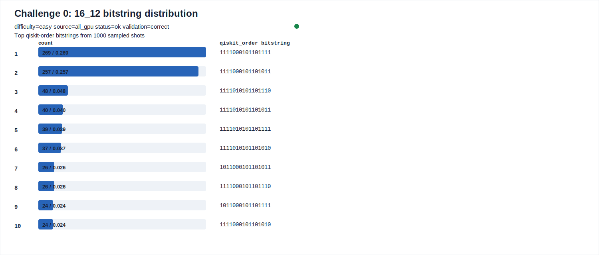 | `outputs/mpo_graph_tns_all/json/challenge-16_12.peaked_mpo_graph_tns.json` |
| 1 | `24_13` | easy | all_gpu | ok | correct | `111110011111001011010001` | 0.667 | 200.3 | 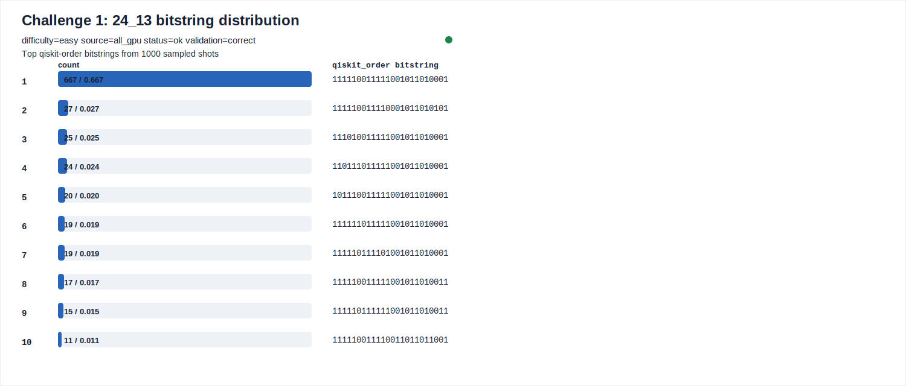 | `outputs/mpo_graph_tns_all/json/challenge-24_13.peaked_mpo_graph_tns.json` |
| 2 | `32_14` | easy | all_gpu | ok | unknown | `00000101001101000001011111101100` | 0.317 | 304.1 | 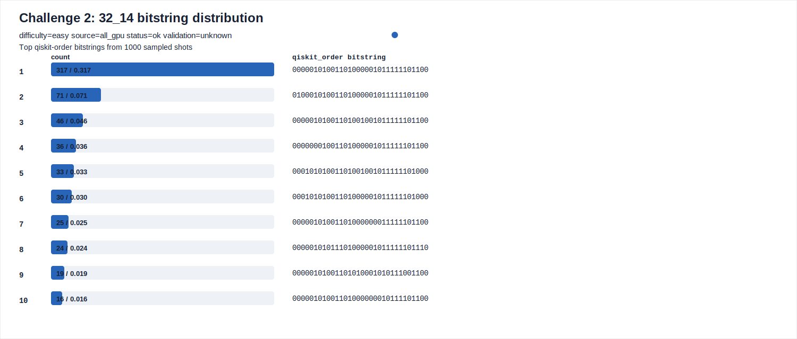 | `outputs/mpo_graph_tns_all/json/challenge-32_14.peaked_mpo_graph_tns.json` |
| 3 | `36_15` | easy | all_gpu | ok | unknown | `110110011011111111011001011110101111` | 0.038 | 414.9 | 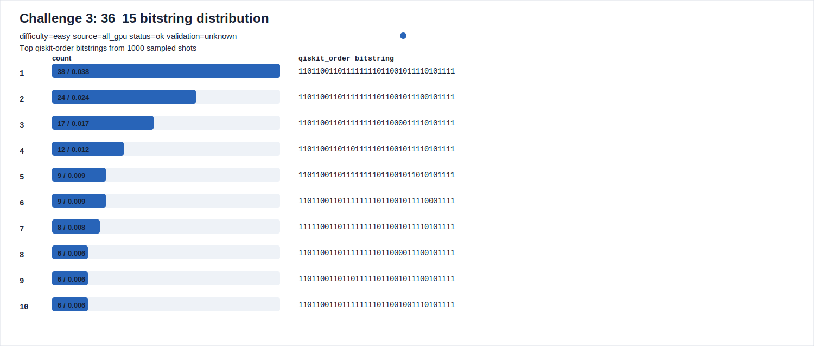 | `outputs/mpo_graph_tns_all/json/challenge-36_15.peaked_mpo_graph_tns.json` |
| 4 | `40_16` | easy | all_gpu | ok | unknown | `0101110101001110011000111011100110010110` | 0.348 | 564.1 | 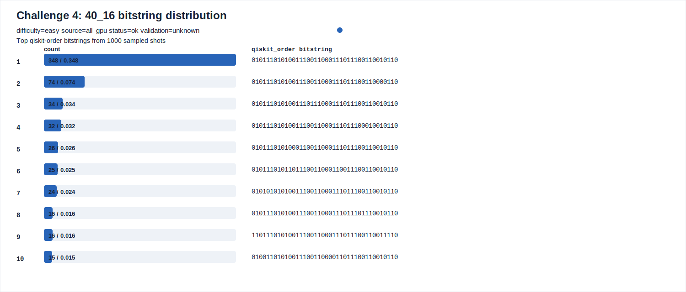 | `outputs/mpo_graph_tns_all/json/challenge-40_16.peaked_mpo_graph_tns.json` |
| 5 | `40_17` | easy | all_gpu | ok | unknown | `0010010101010111001001000010001000001001` | 0.452 | 316.8 | 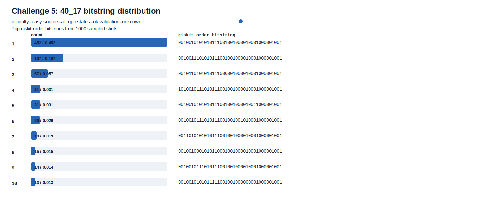 | `outputs/mpo_graph_tns_all/json/challenge-40_17.peaked_mpo_graph_tns.json` |
| 6 | `40_18` | easy | all_gpu | ok | unknown | `0100000110010010001101111000111111001110` | 0.149 | 503.2 | 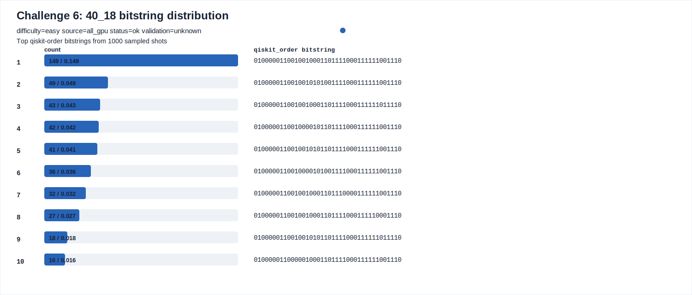 | `outputs/mpo_graph_tns_all/json/challenge-40_18.peaked_mpo_graph_tns.json` |
| 7 | `48_19` | easy | all_gpu | ok | unknown | `011001010111101100111110000001011101001110010000` | 0.738 | 270.4 | 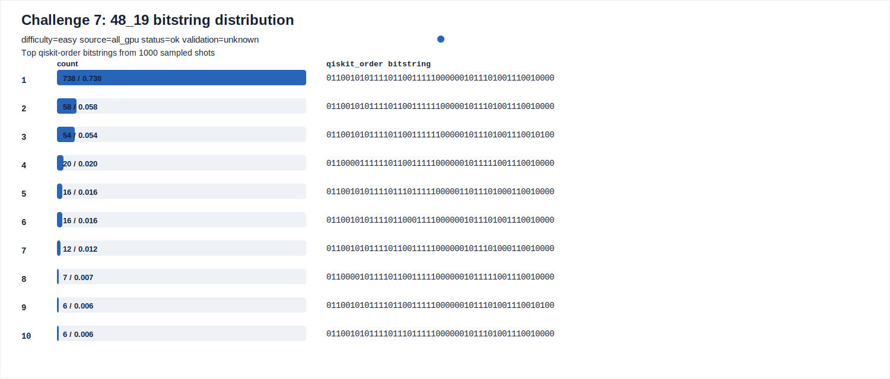 | `outputs/mpo_graph_tns_all/json/challenge-48_19.peaked_mpo_graph_tns.json` |
| 8 | `48_20` | easy | all_gpu | ok | unknown | `101010100101001010000110101000001011110010000000` | 0.582 | 295.1 | 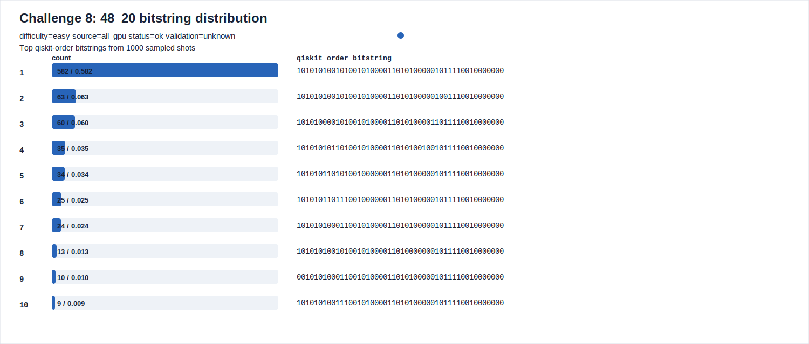 | `outputs/mpo_graph_tns_all/json/challenge-48_20.peaked_mpo_graph_tns.json` |
| 9 | `48_21` | easy | all_gpu | ok | unknown | `111010101110101011110101000001101000100000001001` | 0.364 | 360.4 | 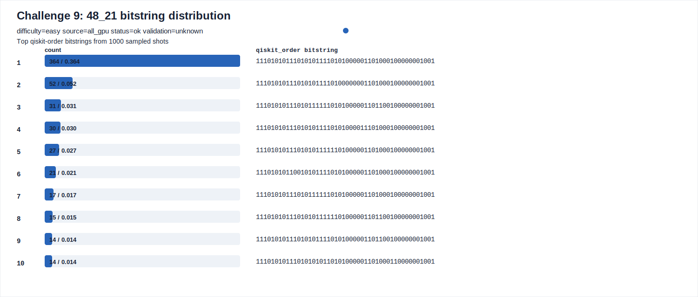 | `outputs/mpo_graph_tns_all/json/challenge-48_21.peaked_mpo_graph_tns.json` |
| 10 | `56_22` | easy | all_gpu | ok | unknown | `11100100100110010011110010110110011000000100010111111011` | 0.781 | 252.4 |  | `outputs/mpo_graph_tns_all/json/challenge-56_22.peaked_mpo_graph_tns.json` |
| 11 | `56_23` | easy | all_gpu | ok | unknown | `01001101001111111100000101001110111011100011111100001101` | 0.261 | 598.7 | 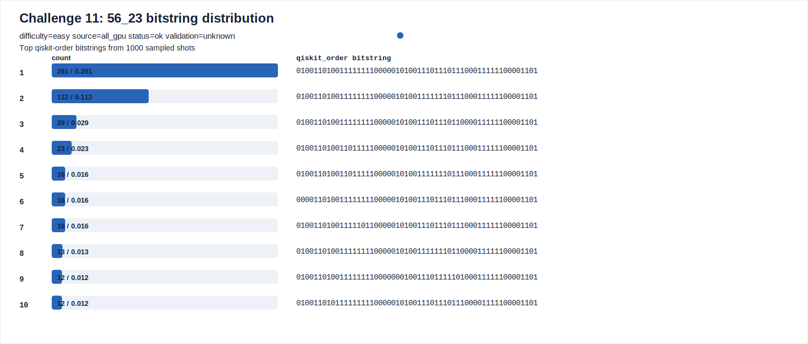 | `outputs/mpo_graph_tns_all/json/challenge-56_23.peaked_mpo_graph_tns.json` |
| 12 | `56_24` | easy | all_gpu | ok | unknown | `10011001001111101111111011101011101101010011001011110001` | 0.293 | 514.2 | 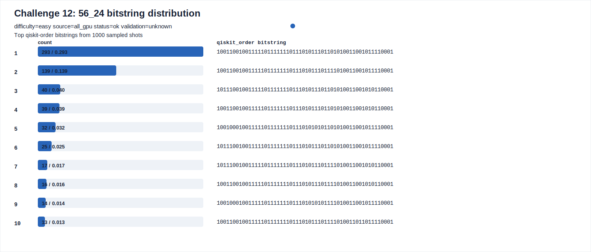 | `outputs/mpo_graph_tns_all/json/challenge-56_24.peaked_mpo_graph_tns.json` |
| 13 | `64_25` | easy | all_gpu | ok | unknown | `0011101111110000110110111101011000010000010100110111000001111011` | 0.501 | 655.9 | 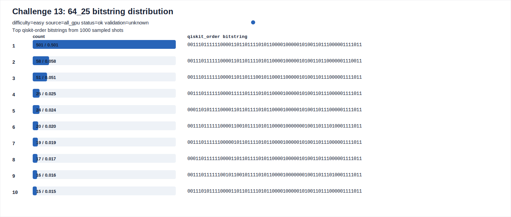 | `outputs/mpo_graph_tns_all/json/challenge-64_25.peaked_mpo_graph_tns.json` |
| 14 | `64_26` | easy | all_gpu | ok | unknown | `0110101010100011010111011000011100010110110110011100011001100110` | 0.228 | 638.3 | 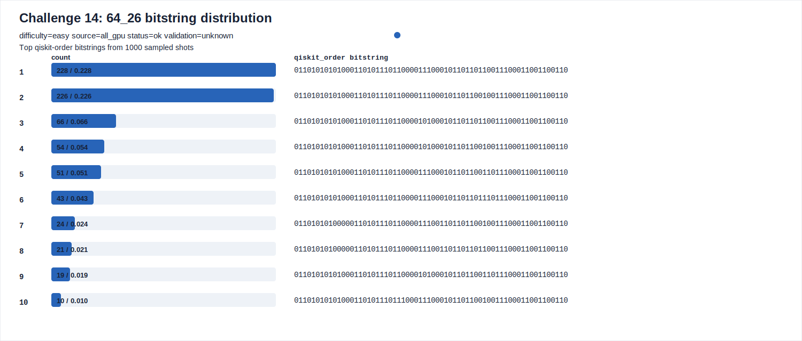 | `outputs/mpo_graph_tns_all/json/challenge-64_26.peaked_mpo_graph_tns.json` |
| 15 | `8_11` | easy | all_gpu | ok | correct | `01001110` | 0.564 | 8.032 | 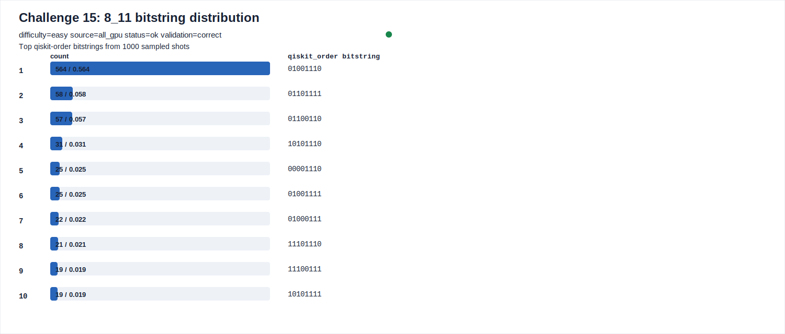 | `outputs/mpo_graph_tns_all/json/challenge-8_11.peaked_mpo_graph_tns.json` |
| 16 | `40_35` | hard | all_gpu | ok | unknown | `1101100110111110111000111101010111000001` | 0.001 | 1306.2 | 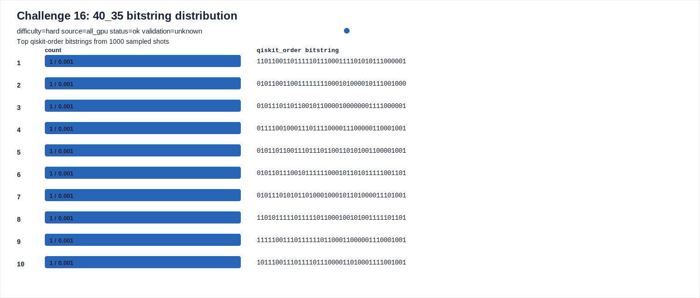 | `outputs/mpo_graph_tns_all/json/challenge-40_35.peaked_mpo_graph_tns.json` |
| 17 | `48_36` | hard | all_gpu | ok | unknown | `000111011011000100010011001000101001101010111000` | 0.002 | 890.0 | 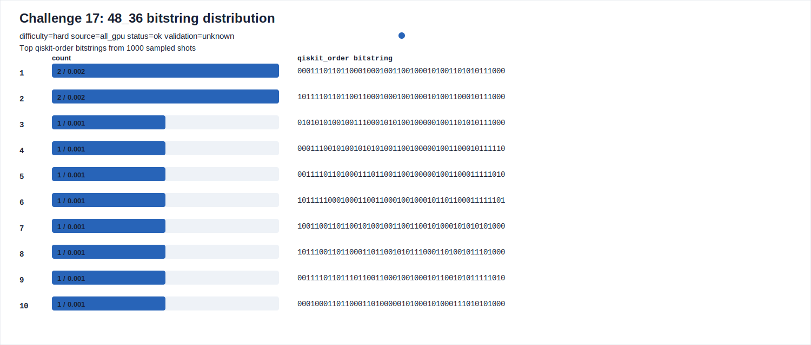 | `outputs/mpo_graph_tns_all/json/challenge-48_36.peaked_mpo_graph_tns.json` |
| 18 | `48_37` | hard | all_gpu | ok | unknown | `001000111110111100010110100100011000011100001000` | 0.001 | 1769.8 | 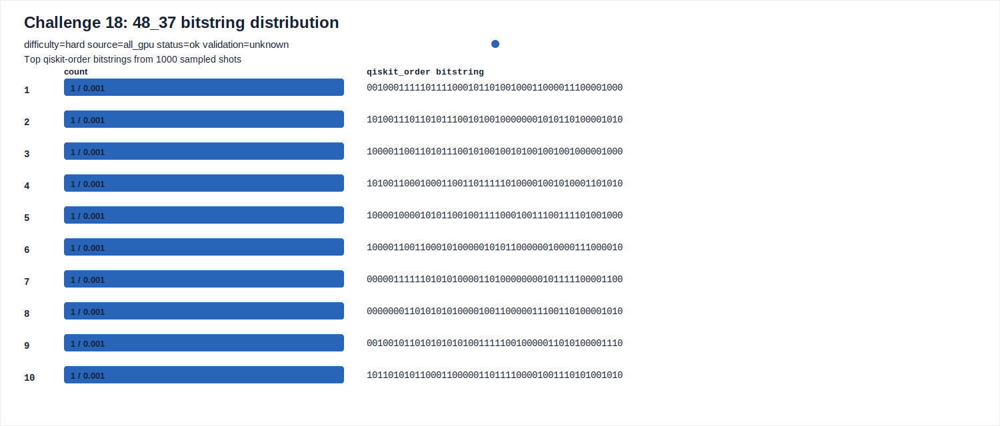 | `outputs/mpo_graph_tns_all/json/challenge-48_37.peaked_mpo_graph_tns.json` |
| 19 | `56_38` | hard | all_gpu | ok | unknown | `01010110010110000010000111010111010011110100100110011101` | 0.001 | 2815.0 |  | `outputs/mpo_graph_tns_all/json/challenge-56_38.peaked_mpo_graph_tns.json` |
| 20 | `56_39` | hard | all_gpu | ok | unknown | `10010111001101010101111111010110110100010000111001010000` | 0.004 | 687.3 | 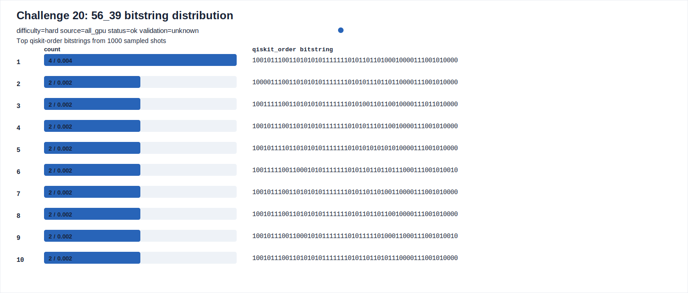 | `outputs/mpo_graph_tns_all/json/challenge-56_39.peaked_mpo_graph_tns.json` |
| 21 | `64_40` | hard | all_gpu | ok | unknown | `1010010110110110010100101100010010000000101110110101100101001010` | 0.001 | 1794.7 | 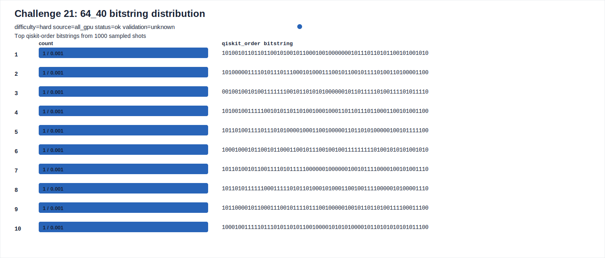 | `outputs/mpo_graph_tns_all/json/challenge-64_40.peaked_mpo_graph_tns.json` |
| 22 | `64_41` | hard | all_gpu | ok | unknown | `1111000100010010110100010011110011000000000011011001110011010011` | 0.001 | 1415.4 |  | `outputs/mpo_graph_tns_all/json/challenge-64_41.peaked_mpo_graph_tns.json` |
| 23 | `16_28` | moderate | all_gpu | ok | incorrect | `1111001011011100` | 0.015 | 541.8 | 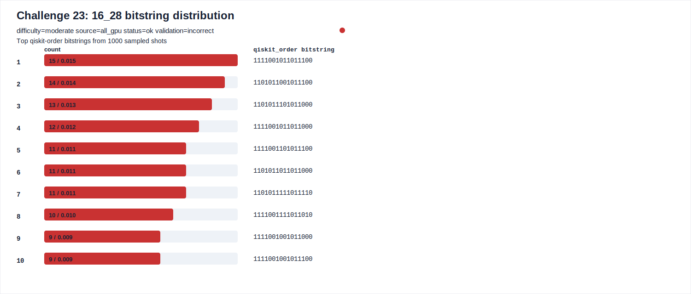 | `outputs/mpo_graph_tns_all/json/challenge-16_28.peaked_mpo_graph_tns.json` |
| 24 | `24_29` | moderate | all_gpu | ok | incorrect | `011100010111101001101011` | 0.003 | 608.0 | 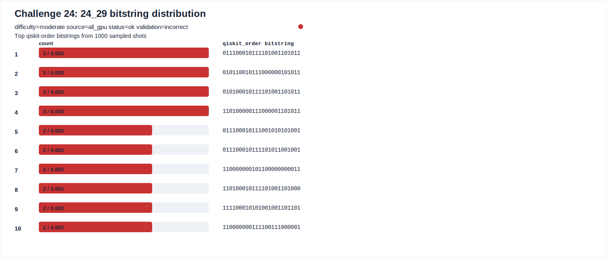 | `outputs/mpo_graph_tns_all/json/challenge-24_29.peaked_mpo_graph_tns.json` |
| 25 | `32_30` | moderate | all_gpu | ok | unknown | `10111000010011110111101110010110` | 0.003 | 900.0 | 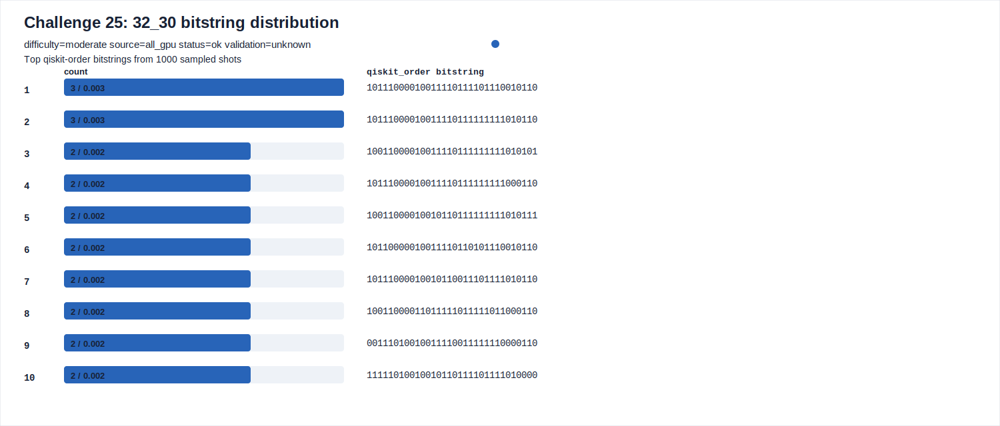 | `outputs/mpo_graph_tns_all/json/challenge-32_30.peaked_mpo_graph_tns.json` |
| 26 | `48_31` | moderate | all_gpu | ok | unknown | `101100111000101011111111101010111011011000110110` | 0.386 | 524.8 | 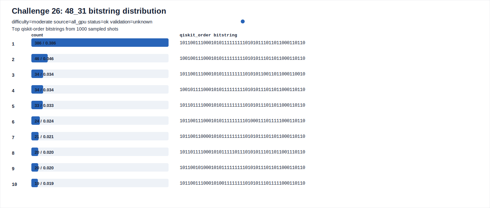 | `outputs/mpo_graph_tns_all/json/challenge-48_31.peaked_mpo_graph_tns.json` |
| 27 | `48_32` | moderate | all_gpu | ok | unknown | `011101010111011110001110010101010101101110001110` | 0.087 | 663.5 | 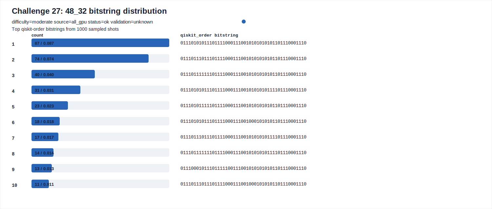 | `outputs/mpo_graph_tns_all/json/challenge-48_32.peaked_mpo_graph_tns.json` |
| 28 | `56_33` | moderate | all_gpu | ok | unknown | `11001001100100001111010100100010010101111111011101010000` | 0.098 | 788.6 | 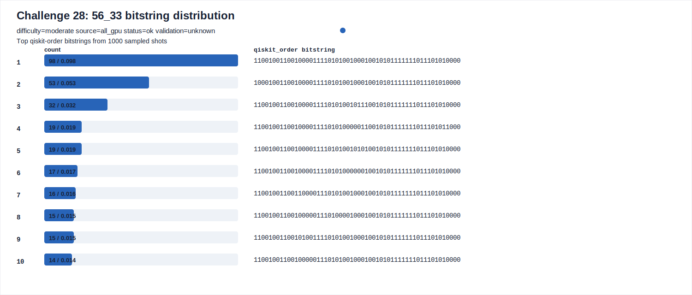 | `outputs/mpo_graph_tns_all/json/challenge-56_33.peaked_mpo_graph_tns.json` |
| 29 | `64_34` | moderate | all_gpu | ok | unknown | `0011010100010011001110101110100101101011001011011001111011100110` | 0.286 | 786.7 | 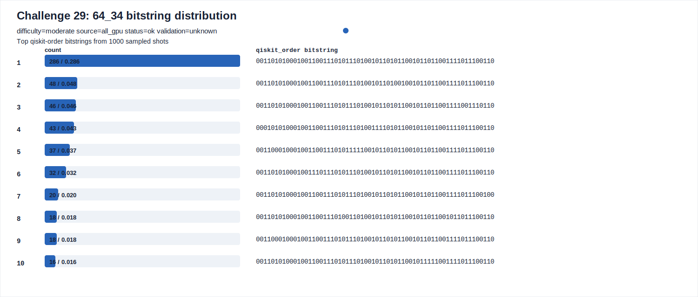 | `outputs/mpo_graph_tns_all/json/challenge-64_34.peaked_mpo_graph_tns.json` |
| 30 | `8_27` | moderate | all_gpu | ok | correct | `11001001` | 0.507 | 14.65 | 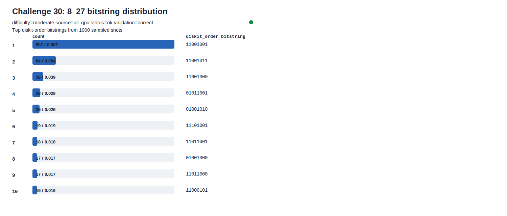 | `outputs/mpo_graph_tns_all/json/challenge-8_27.peaked_mpo_graph_tns.json` |
| 31 | `16_2` | very_easy | all_gpu | ok | correct | `1010101011001000` | 0.544 | 17.46 | 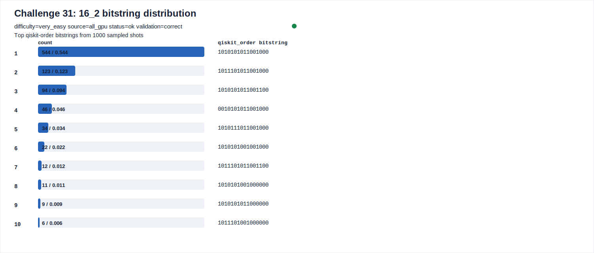 | `outputs/mpo_graph_tns_all/json/challenge-16_2.peaked_mpo_graph_tns.json` |
| 32 | `24_3` | very_easy | all_gpu | ok | correct | `011110010000101010001000` | 0.814 | 59.55 | 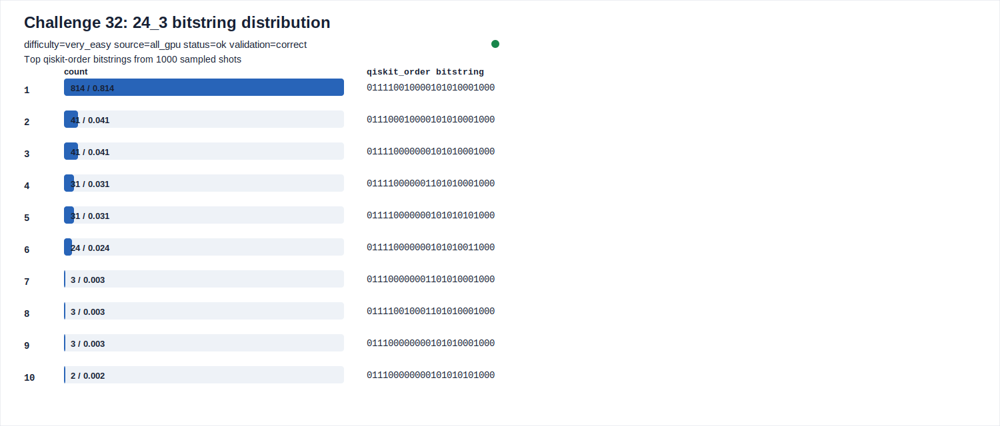 | `outputs/mpo_graph_tns_all/json/challenge-24_3.peaked_mpo_graph_tns.json` |
| 33 | `28_4` | very_easy | all_cpu | ok | correct | `1111111000101010110110011111` | 0.047 | 5384.3 | 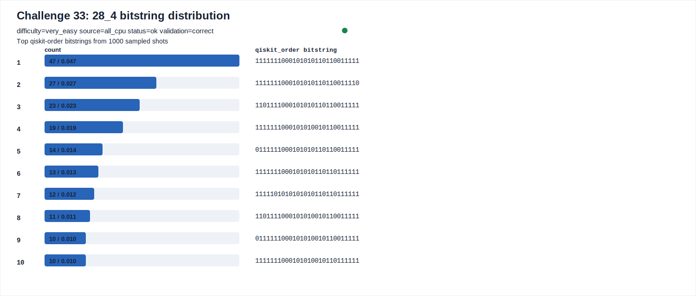 | `outputs/mpo_graph_tns_all_cpu/json/challenge-28_4.peaked_mpo_graph_tns.json` |
| 34 | `32_5` | very_easy | all_gpu | ok | unknown | `00111000101010100001000000010000` | 0.177 | 555.4 | 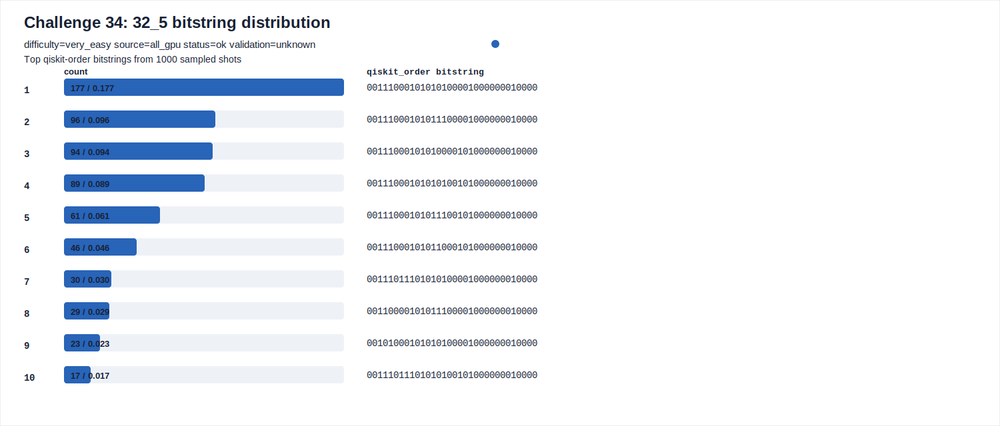 | `outputs/mpo_graph_tns_all/json/challenge-32_5.peaked_mpo_graph_tns.json` |
| 35 | `36_6` | very_easy | all_gpu | ok | unknown | `100110100111101001001101110011001000` | 0.781 | 131.5 | 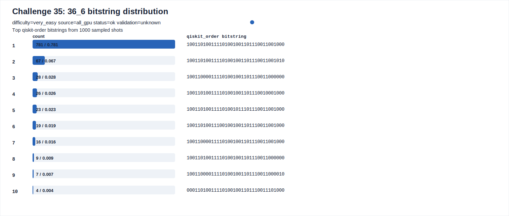 | `outputs/mpo_graph_tns_all/json/challenge-36_6.peaked_mpo_graph_tns.json` |
| 36 | `40_7` | very_easy | all_gpu | ok | unknown | `0110111011010001010011111110010011000111` | 0.886 | 28.68 | 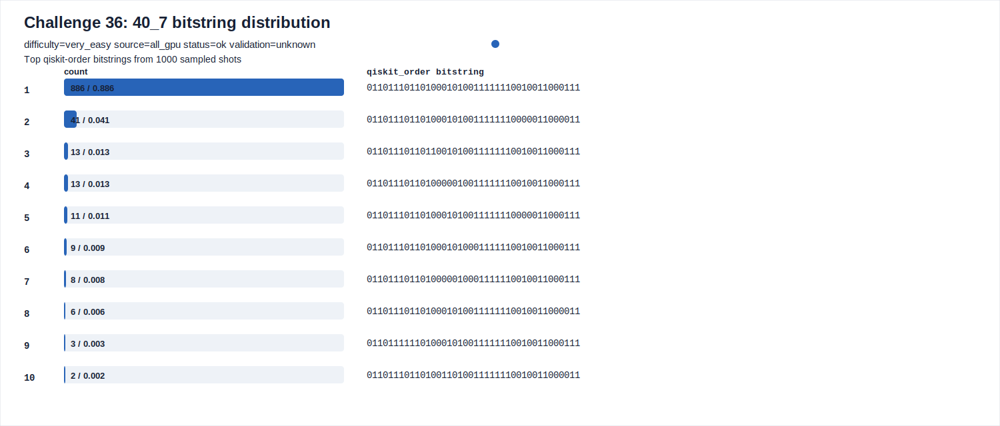 | `outputs/mpo_graph_tns_all/json/challenge-40_7.peaked_mpo_graph_tns.json` |
| 37 | `48_8` | very_easy | all_cpu | ok | unknown | `000100100110111001001111111100101011001110010100` | 0.717 | 28.65 | 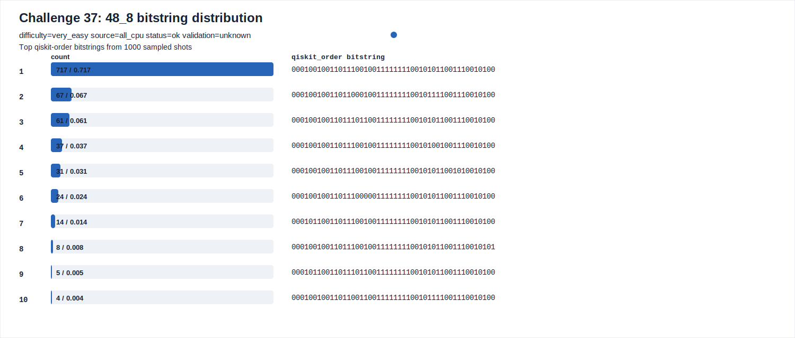 | `outputs/mpo_graph_tns_all_cpu/json/challenge-48_8.peaked_mpo_graph_tns.json` |
| 38 | `56_9` | very_easy | all_cpu | ok | unknown | `10010110101100101110100110010110011101100110001101010100` | 0.752 | 15.89 | 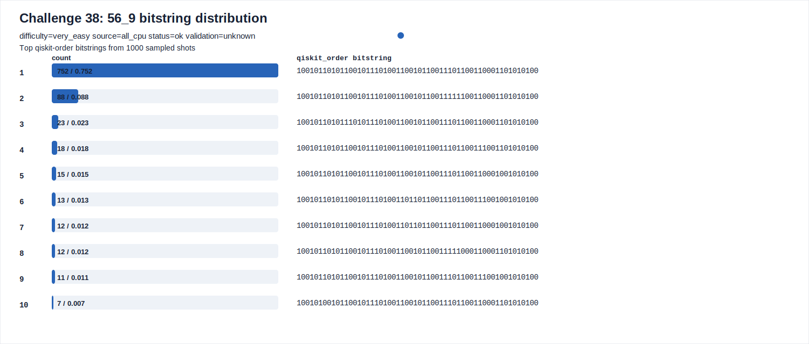 | `outputs/mpo_graph_tns_all_cpu/json/challenge-56_9.peaked_mpo_graph_tns.json` |
| 39 | `64_10` | very_easy | all_cpu | ok | unknown | `0011010010110001110010111001100100101100010111110110010100101011` | 0.774 | 40.03 | 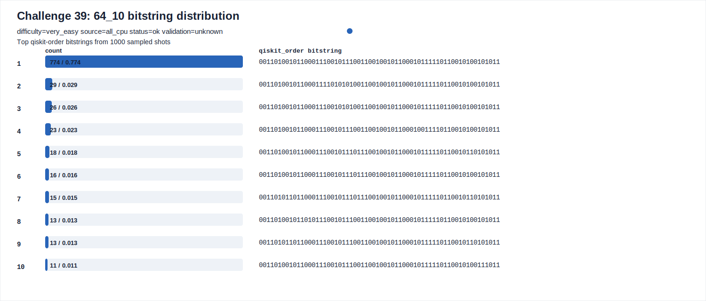 | `outputs/mpo_graph_tns_all_cpu/json/challenge-64_10.peaked_mpo_graph_tns.json` |
| 40 | `8_1` | very_easy | all_cpu | ok | correct | `10101101` | 0.927 | 5.591 | 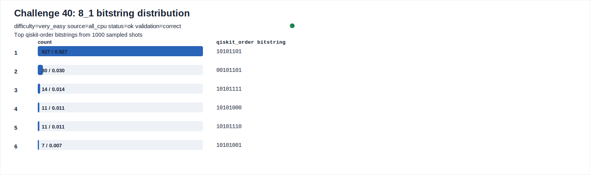 | `outputs/mpo_graph_tns_all_cpu/json/challenge-8_1.peaked_mpo_graph_tns.json` |
| 41 | `104_49` | very_hard | all_cpu | started |  |  |  |  | 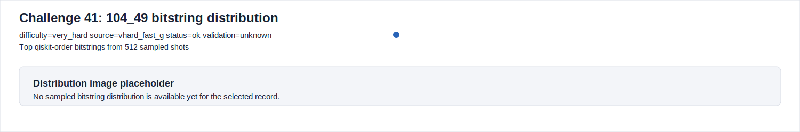 | `outputs/mpo_graph_tns_all_cpu/json/challenge-104_49.peaked_mpo_graph_tns.json` |
| 42 | `48_42` | very_hard | vhard_fast_b | ok | unknown | `101101000011000100111110110110110111010000010010` | 0.003 | 2543.6 | 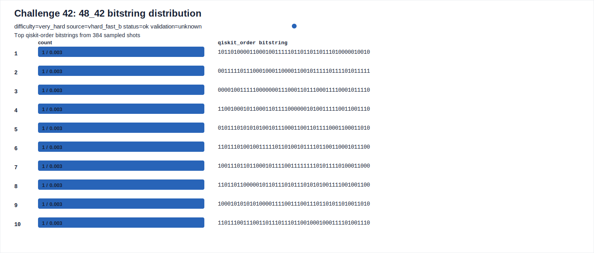 | `outputs/mpo_graph_tns_veryhard_fast_cpu_b/json/challenge-48_42.peaked_mpo_graph_tns.json` |
| 43 | `56_43` | very_hard | vhard_fast_b | ok | unknown | `01101110110101000111010100001001000110110101010010011000` | 0.003 | 2530.0 | 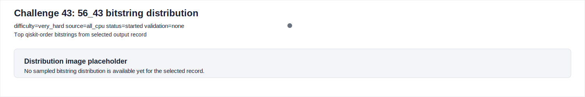 | `outputs/mpo_graph_tns_veryhard_fast_cpu_b/json/challenge-56_43.peaked_mpo_graph_tns.json` |
| 44 | `64_44` | very_hard | all_cpu | started |  |  |  |  |  | `outputs/mpo_graph_tns_all_cpu/json/challenge-64_44.peaked_mpo_graph_tns.json` |
| 45 | `72_45` | very_hard | all_cpu | started |  |  |  |  | 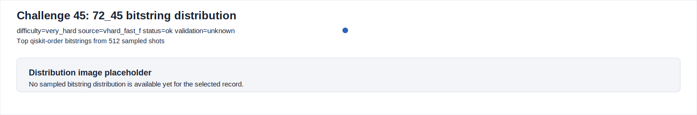 | `outputs/mpo_graph_tns_all_cpu/json/challenge-72_45.peaked_mpo_graph_tns.json` |
| 46 | `80_46` | very_hard | all_cpu | started |  |  |  |  |  | `outputs/mpo_graph_tns_all_cpu/json/challenge-80_46.peaked_mpo_graph_tns.json` |
| 47 | `88_47` | very_hard | all_cpu | started |  |  |  |  | 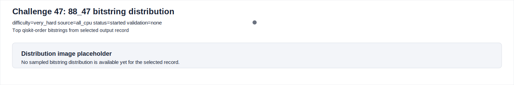 | `outputs/mpo_graph_tns_all_cpu/json/challenge-88_47.peaked_mpo_graph_tns.json` |
| 48 | `96_48` | very_hard | all_cpu | started |  |  |  |  | 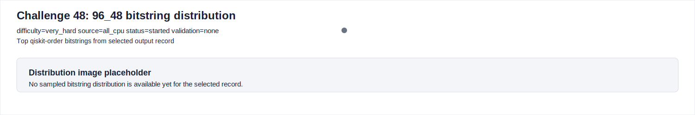 | `outputs/mpo_graph_tns_all_cpu/json/challenge-96_48.peaked_mpo_graph_tns.json` |

## Challenge Details

### 0. `16_12` (easy)

- QASM: `challenges/easy/challenge-16_12.qasm`
- Chosen source: `all_gpu`
- Status: `ok`; validation: `correct`
- Final candidate, Qiskit order: `1111000101101011`
- Known answer, Qiskit order: `1111000101101011`
- Runtime seconds: 244.7
- JSON: `outputs/mpo_graph_tns_all/json/challenge-16_12.peaked_mpo_graph_tns.json`
- Source records: all_cpu:ok/correct, all_gpu:ok/correct
- Marginal P(0) raw-site prefix: `0.047, 0.170, 0.500, 0.998, 0.000, 0.000, 0.000, 0.000, 0.135, 1.000, 1.000, 0.000, ...`

Bitstring distribution image:

Bitstring distribution, top 10 of 1000 samples:

| rank | qiskit_order | count | fraction | permuted_measurement_order | raw_site_order |
|---:|---|---:|---:|---|---|
| 1 | `1111000101101111` | 269 | 0.269 | `1111011010001111` | `1110111110011001` |
| 2 | `1111000101101011` | 257 | 0.257 | `1101011010001111` | `1100111110011001` |
| 3 | `1111010101101110` | 48 | 0.048 | `0111011010101111` | `1110111110010101` |
| 4 | `1111010101101011` | 40 | 0.040 | `1101011010101111` | `1100111110011101` |
| 5 | `1111010101101111` | 39 | 0.039 | `1111011010101111` | `1110111110011101` |
| 6 | `1111010101101010` | 37 | 0.037 | `0101011010101111` | `1100111110010101` |
| 7 | `1011000101101011` | 26 | 0.026 | `1101011010001101` | `1000111110011001` |
| 8 | `1111000101101110` | 26 | 0.026 | `0111011010001111` | `1110111110010001` |
| 9 | `1011000101101111` | 24 | 0.024 | `1111011010001101` | `1010111110011001` |
| 10 | `1111000101101010` | 24 | 0.024 | `0101011010001111` | `1100111110010001` |

### 1. `24_13` (easy)

- QASM: `challenges/easy/challenge-24_13.qasm`
- Chosen source: `all_gpu`
- Status: `ok`; validation: `correct`
- Final candidate, Qiskit order: `111110011111001011010001`
- Known answer, Qiskit order: `111110011111001011010001`
- Runtime seconds: 200.3
- JSON: `outputs/mpo_graph_tns_all/json/challenge-24_13.peaked_mpo_graph_tns.json`
- Source records: all_cpu:ok/correct, all_gpu:ok/correct
- Marginal P(0) raw-site prefix: `0.000, 0.936, 0.064, 0.916, 0.001, 0.034, 0.933, 0.033, 0.110, 0.003, 0.931, 0.000, ...`

Bitstring distribution image:

Bitstring distribution, top 10 of 1000 samples:

| rank | qiskit_order | count | fraction | permuted_measurement_order | raw_site_order |
|---:|---|---:|---:|---|---|
| 1 | `111110011111001011010001` | 667 | 0.667 | `100010110100111110011111` | `101011011101011111100010` |
| 2 | `111110011110001011010101` | 27 | 0.027 | `101010110100011110011111` | `101011010101111111100010` |
| 3 | `111010011111001011010001` | 25 | 0.025 | `100010110100111110010111` | `101011011101011101100010` |
| 4 | `110111011111001011010001` | 24 | 0.024 | `100010110100111110111011` | `101011011101011111110000` |
| 5 | `101110011111001011010001` | 20 | 0.020 | `100010110100111110011101` | `101011011101011111000010` |
| 6 | `111111011111001011010001` | 19 | 0.019 | `100010110100111110111111` | `101011011101011111110010` |
| 7 | `111110111101001011010001` | 19 | 0.019 | `100010110100101111011111` | `110011011101011111100010` |
| 8 | `111110011111001011010011` | 17 | 0.017 | `110010110100111110011111` | `101111011101011111100010` |
| 9 | `111110111111001011010011` | 15 | 0.015 | `110010110100111111011111` | `111111011101011111100010` |
| 10 | `111110011110011011011001` | 11 | 0.011 | `100110110110011110011111` | `101011110111011111100010` |

### 2. `32_14` (easy)

- QASM: `challenges/easy/challenge-32_14.qasm`
- Chosen source: `all_gpu`
- Status: `ok`; validation: `unknown`
- Final candidate, Qiskit order: `00000101001101000001011111101100`
- Runtime seconds: 304.1
- JSON: `outputs/mpo_graph_tns_all/json/challenge-32_14.peaked_mpo_graph_tns.json`
- Source records: all_cpu:ok/unknown, all_gpu:ok/unknown
- Marginal P(0) raw-site prefix: `0.807, 0.980, 0.116, 0.988, 1.000, 0.953, 0.050, 0.000, 1.000, 0.867, 0.000, 0.974, ...`

Bitstring distribution image:

Bitstring distribution, top 10 of 1000 samples:

| rank | qiskit_order | count | fraction | permuted_measurement_order | raw_site_order |
|---:|---|---:|---:|---|---|
| 1 | `00000101001101000001011111101100` | 317 | 0.317 | `00110111111010000010110010100000` | `00100011001001101100111101000010` |
| 2 | `01000101001101000001011111101100` | 71 | 0.071 | `00110111111010000010110010100010` | `10100011001001101100111101000010` |
| 3 | `00000101001101001001011111101100` | 46 | 0.046 | `00110111111010010010110010100000` | `00100011001001101110111101000010` |
| 4 | `00000001001101000001011111101100` | 36 | 0.036 | `00110111111010000010110010000000` | `00100011001001101100111101000000` |
| 5 | `00010101001101001001011111101000` | 33 | 0.033 | `00010111111010010010110010101000` | `00100011011000101110111101000010` |
| 6 | `00010101001101000001011111101000` | 30 | 0.030 | `00010111111010000010110010101000` | `00100011011000101100111101000010` |
| 7 | `00000101001101000000011111101100` | 25 | 0.025 | `00110111111000000010110010100000` | `00000011001001101100111101000010` |
| 8 | `00000101011101000001011111101110` | 24 | 0.024 | `01110111111010000010111010100000` | `00100011001001101100111111001010` |
| 9 | `00000101001101010001010111001100` | 19 | 0.019 | `00110011101010001010110010100000` | `00100011001001010100111101000010` |
| 10 | `00000101001101000000010111101100` | 16 | 0.016 | `00110111101000000010110010100000` | `00000011001001100100111101000010` |

### 3. `36_15` (easy)

- QASM: `challenges/easy/challenge-36_15.qasm`
- Chosen source: `all_gpu`
- Status: `ok`; validation: `unknown`
- Final candidate, Qiskit order: `110110011011111111011001011110101111`
- Runtime seconds: 414.9
- JSON: `outputs/mpo_graph_tns_all/json/challenge-36_15.peaked_mpo_graph_tns.json`
- Source records: all_cpu:started, all_gpu:ok/unknown
- Marginal P(0) raw-site prefix: `0.059, 0.033, 0.892, 0.120, 0.076, 0.152, 0.148, 0.112, 0.103, 0.893, 0.225, 0.169, ...`

Bitstring distribution image:

Bitstring distribution, top 10 of 1000 samples:

| rank | qiskit_order | count | fraction | permuted_measurement_order | raw_site_order |
|---:|---|---:|---:|---|---|
| 1 | `110110011011111111011001011110101111` | 38 | 0.038 | `111101011110100110111111110110011011` | `110111111011111111001011101011010101` |
| 2 | `110110011011111111011001011100101111` | 24 | 0.024 | `111101001110100110111111110110011011` | `110111111011111110001011101011010101` |
| 3 | `110110011011111111011000011110101111` | 17 | 0.017 | `111101011110000110111111110110011011` | `110111111011110111001011101011010101` |
| 4 | `110110011011011111011001011110101111` | 12 | 0.012 | `111101011110100110111110110110011011` | `110111111011111111001011100011010101` |
| 5 | `110110011011111111011001011010101111` | 9 | 0.009 | `111101010110100110111111110110011011` | `110111111011101111001011101011010101` |
| 6 | `110110011011111111011001011110001111` | 9 | 0.009 | `111100011110100110111111110110011011` | `110111111001111111001011101011010101` |
| 7 | `111110011011111111011001011110101111` | 8 | 0.008 | `111101011110100110111111110110011111` | `110111111011111111001111101011010101` |
| 8 | `110110011011111111011000011100101111` | 6 | 0.006 | `111101001110000110111111110110011011` | `110111111011110110001011101011010101` |
| 9 | `110110011011011111011001011100101111` | 6 | 0.006 | `111101001110100110111110110110011011` | `110111111011111110001011100011010101` |
| 10 | `110110011011111111011001001110101111` | 6 | 0.006 | `111101011100100110111111110110011011` | `110111101011111111001011101011010101` |

### 4. `40_16` (easy)

- QASM: `challenges/easy/challenge-40_16.qasm`
- Chosen source: `all_gpu`
- Status: `ok`; validation: `unknown`
- Final candidate, Qiskit order: `0101110101001110011000111011100110010110`
- Runtime seconds: 564.1
- JSON: `outputs/mpo_graph_tns_all/json/challenge-40_16.peaked_mpo_graph_tns.json`
- Source records: all_cpu:started, all_gpu:ok/unknown
- Marginal P(0) raw-site prefix: `0.001, 1.000, 0.000, 0.000, 0.078, 0.014, 1.000, 0.000, 0.028, 0.000, 0.999, 0.996, ...`

Bitstring distribution image:

Bitstring distribution, top 10 of 1000 samples:

| rank | qiskit_order | count | fraction | permuted_measurement_order | raw_site_order |
|---:|---|---:|---:|---|---|
| 1 | `0101110101001110011000111011100110010110` | 348 | 0.348 | `0110100110011101110001100111001010111010` | `1011110111001110001110111010000100010101` |
| 2 | `0101110101001110011000111011100110000110` | 74 | 0.074 | `0110000110011101110001100111001010111010` | `1011110111001010001110111010000100010101` |
| 3 | `0101110101001110111000111011100110010110` | 34 | 0.034 | `0110100110011101110001110111001010111010` | `1011110111001110011110111010000100010101` |
| 4 | `0101110101001110011000111011100010010110` | 32 | 0.032 | `0110100100011101110001100111001010111010` | `1011110111001110001110111010000000010101` |
| 5 | `0101110101000110011000111011100110010110` | 26 | 0.026 | `0110100110011101110001100110001010111010` | `1011110111001110001110011010000100010101` |
| 6 | `0101110101101110011000110011100110010110` | 25 | 0.025 | `0110100110011100110001100111011010111010` | `1011010111001110001111111010000100010101` |
| 7 | `0101010101001110011000111011100110010110` | 24 | 0.024 | `0110100110011101110001100111001010101010` | `1011110111001110001110111000000100010101` |
| 8 | `0101110101001110011000111011101110010110` | 16 | 0.016 | `0110100111011101110001100111001010111010` | `1011110111001110001110111110000100010101` |
| 9 | `1101110101001110011000111011100110011110` | 16 | 0.016 | `0111100110011101110001100111001010111011` | `1011110111001110001110111010110100010101` |
| 10 | `0100110101001110011000011011100110010110` | 15 | 0.015 | `0110100110011101100001100111001010110010` | `1011110111000100001110111010000100010101` |

### 5. `40_17` (easy)

- QASM: `challenges/easy/challenge-40_17.qasm`
- Chosen source: `all_gpu`
- Status: `ok`; validation: `unknown`
- Final candidate, Qiskit order: `0010010101010111001001000010001000001001`
- Runtime seconds: 316.8
- JSON: `outputs/mpo_graph_tns_all/json/challenge-40_17.peaked_mpo_graph_tns.json`
- Source records: all_cpu:ok/unknown, all_gpu:ok/unknown
- Marginal P(0) raw-site prefix: `0.000, 1.000, 1.000, 0.996, 0.052, 0.063, 1.000, 1.000, 1.000, 0.953, 1.000, 0.108, ...`

Bitstring distribution image:

Bitstring distribution, top 10 of 1000 samples:

| rank | qiskit_order | count | fraction | permuted_measurement_order | raw_site_order |
|---:|---|---:|---:|---|---|
| 1 | `0010010101010111001001000010001000001001` | 452 | 0.452 | `1001000001000100001001001110101010100100` | `1000110000011000000001001101001001011001` |
| 2 | `0010011101010111001001000010001000001001` | 107 | 0.107 | `1001000001000100001001001110101011100100` | `1000110000011000000001011101001001011001` |
| 3 | `0010110101010111000001000010001000001001` | 57 | 0.057 | `1001000001000100001000001110101010110100` | `1000110000001001000001001101001001011001` |
| 4 | `1010010111010111001001000010001000001001` | 31 | 0.031 | `1001000001000100001001001110101110100101` | `1000110000011100000001001101101001011001` |
| 5 | `0010010101010111001001000010011000001001` | 31 | 0.031 | `1001000001100100001001001110101010100100` | `1000110000011000000001001101001001011011` |
| 6 | `0010010111010111001001001010001000001001` | 29 | 0.029 | `1001000001000101001001001110101110100100` | `1000110000011100000101001101001001011001` |
| 7 | `0011010101010111001001000010001000001001` | 19 | 0.019 | `1001000001000100001001001110101010101100` | `1000110001011000000001001101001001011001` |
| 8 | `0010010001010110001001000010001000001001` | 15 | 0.015 | `1001000001000100001001000110101000100100` | `1000000000011000000001001101001001011001` |
| 9 | `0010010111010111001001000010001000001001` | 14 | 0.014 | `1001000001000100001001001110101110100100` | `1000110000011100000001001101001001011001` |
| 10 | `0010010101011111001001000000001000001001` | 13 | 0.013 | `1001000001000000001001001111101010100100` | `1000110000011000000001001011001001011001` |

### 6. `40_18` (easy)

- QASM: `challenges/easy/challenge-40_18.qasm`
- Chosen source: `all_gpu`
- Status: `ok`; validation: `unknown`
- Final candidate, Qiskit order: `0100000110010010001101111000111111001110`
- Runtime seconds: 503.2
- JSON: `outputs/mpo_graph_tns_all/json/challenge-40_18.peaked_mpo_graph_tns.json`
- Source records: all_cpu:started, all_gpu:ok/unknown
- Marginal P(0) raw-site prefix: `0.098, 0.913, 0.001, 0.933, 0.190, 0.002, 0.001, 1.000, 1.000, 1.000, 0.875, 0.999, ...`

Bitstring distribution image:

Bitstring distribution, top 10 of 1000 samples:

| rank | qiskit_order | count | fraction | permuted_measurement_order | raw_site_order |
|---:|---|---:|---:|---|---|
| 1 | `0100000110010010001101111000111111001110` | 149 | 0.149 | `0111001111110001111011000100100110000010` | `1010111000001101110101101001000001110011` |
| 2 | `0100000110010010101001111000111111001110` | 49 | 0.049 | `0111001111110001111001010100100110000010` | `1010111000001111100101101001000001110011` |
| 3 | `0100000110010010001101111000111111011110` | 43 | 0.043 | `0111101111110001111011000100100110000010` | `1010111000001101110101111001000001110011` |
| 4 | `0100000110010000101101111000111111001110` | 42 | 0.042 | `0111001111110001111011010000100110000010` | `1010111000001110110101101001000001110011` |
| 5 | `0100000110010010101101111000111111001110` | 41 | 0.041 | `0111001111110001111011010100100110000010` | `1010111000001111110101101001000001110011` |
| 6 | `0100000110010000101001111000111111001110` | 36 | 0.036 | `0111001111110001111001010000100110000010` | `1010111000001110100101101001000001110011` |
| 7 | `0100000110010010001101110000111111001110` | 32 | 0.032 | `0111001111110000111011000100100110000010` | `1010111000001101110101101001000001010011` |
| 8 | `0100000110010010001101111000111110001110` | 27 | 0.027 | `0111000111110001111011000100100110000010` | `1010011000001101110101101001000001110011` |
| 9 | `0100000110010010101101111000111111011110` | 18 | 0.018 | `0111101111110001111011010100100110000010` | `1010111000001111110101111001000001110011` |
| 10 | `0100000110000010001101111000111111001110` | 16 | 0.016 | `0111001111110001111011000100000110000010` | `1010111000001101110100101001000001110011` |

### 7. `48_19` (easy)

- QASM: `challenges/easy/challenge-48_19.qasm`
- Chosen source: `all_gpu`
- Status: `ok`; validation: `unknown`
- Final candidate, Qiskit order: `011001010111101100111110000001011101001110010000`
- Runtime seconds: 270.4
- JSON: `outputs/mpo_graph_tns_all/json/challenge-48_19.peaked_mpo_graph_tns.json`
- Source records: all_cpu:ok/unknown, all_gpu:ok/unknown
- Marginal P(0) raw-site prefix: `1.000, 1.000, 0.000, 0.000, 0.000, 0.032, 0.004, 0.000, 1.000, 0.003, 0.007, 1.000, ...`

Bitstring distribution image:

Bitstring distribution, top 10 of 1000 samples:

| rank | qiskit_order | count | fraction | permuted_measurement_order | raw_site_order |
|---:|---|---:|---:|---|---|
| 1 | `011001010111101100111110000001011101001110010000` | 738 | 0.738 | `000010011100101110100000011111001101111010100110` | `001111110110101110010001100101101000000110011010` |
| 2 | `011001010111101100111111000001011101001110010000` | 58 | 0.058 | `000010011100101110100000111111001101111010100110` | `001111110110101110010001110101101000000110011010` |
| 3 | `011001010111101100111111000001011101001110010100` | 54 | 0.054 | `001010011100101110100000111111001101111010100110` | `001111110110101110010001111101101000000110011010` |
| 4 | `011000011111101100111110000001011111001110010000` | 20 | 0.020 | `000010011100111110100000011111001101111110000110` | `001111110110101110010001100101110100000110011010` |
| 5 | `011001010111101110111110000011011101000110010000` | 16 | 0.016 | `000010011000101110110000011111011101111010100110` | `001110110110101110010001100101101000011110011010` |
| 6 | `011001010111101100011110000001011101001110010000` | 16 | 0.016 | `000010011100101110100000011110001101111010100110` | `001111110110101110010001100101001000000110011010` |
| 7 | `011001010111101100111110000001011101000110010000` | 12 | 0.012 | `000010011000101110100000011111001101111010100110` | `001110110110101110010001100101101000000110011010` |
| 8 | `011000010111101100111110000001011111001110010000` | 7 | 0.007 | `000010011100111110100000011111001101111010000110` | `001111110110101110010001100101110000000110011010` |
| 9 | `011001010111101100111110000001011101001110010100` | 6 | 0.006 | `001010011100101110100000011111001101111010100110` | `001111110110101110010001101101101000000110011010` |
| 10 | `011001010111101110111110000001011101001110010000` | 6 | 0.006 | `000010011100101110100000011111011101111010100110` | `001111110110101110010001100101101000001110011010` |

### 8. `48_20` (easy)

- QASM: `challenges/easy/challenge-48_20.qasm`
- Chosen source: `all_gpu`
- Status: `ok`; validation: `unknown`
- Final candidate, Qiskit order: `101010100101001010000110101000001011110010000000`
- Runtime seconds: 295.1
- JSON: `outputs/mpo_graph_tns_all/json/challenge-48_20.peaked_mpo_graph_tns.json`
- Source records: all_cpu:ok/unknown, all_gpu:ok/unknown
- Marginal P(0) raw-site prefix: `1.000, 0.997, 1.000, 1.000, 0.000, 0.008, 0.998, 0.939, 0.882, 0.933, 0.067, 0.002, ...`

Bitstring distribution image:

Bitstring distribution, top 10 of 1000 samples:

| rank | qiskit_order | count | fraction | permuted_measurement_order | raw_site_order |
|---:|---|---:|---:|---|---|
| 1 | `101010100101001010000110101000001011110010000000` | 582 | 0.582 | `000000010011110100000101011000010100101001010101` | `000011000011000000011011100100101110001010001001` |
| 2 | `101010100101001010000110101000001001110010000000` | 63 | 0.063 | `000000010011100100000101011000010100101001010101` | `000011000011000000011011100100100110001010001001` |
| 3 | `101010000101001010000110101000011011110010000000` | 60 | 0.060 | `000000010011110110000101011000010100101000010101` | `000011000011000000011011100100101101001010001001` |
| 4 | `101010101101001010000110101001001011110010000000` | 35 | 0.035 | `000000010011110100100101011000010100101101010101` | `000011010011000010011011100100101110001010001001` |
| 5 | `101010110101001000000110101000001011110010000000` | 34 | 0.034 | `000000010011110100000101011000000100101011010101` | `000011000101000000011011100100101110001010001001` |
| 6 | `101010110111001000000110101000001011110010000000` | 25 | 0.025 | `000000010011110100000101011000000100111011010101` | `000011001101000000011011100100101110001010001001` |
| 7 | `101010100011001010000110101000001011110010000000` | 24 | 0.024 | `000000010011110100000101011000010100110001010101` | `000011001011000000011010100100101110001010001001` |
| 8 | `101010100101001010000110100000001011110010000000` | 13 | 0.013 | `000000010011110100000001011000010100101001010101` | `000011000011000000011011100100001110001010001001` |
| 9 | `001010100011001010000110101000001011110010000000` | 10 | 0.010 | `000000010011110100000101011000010100110001010100` | `000011001011000000011000100100101110001010001001` |
| 10 | `101010100111001010000110101000001011110010000000` | 9 | 0.009 | `000000010011110100000101011000010100111001010101` | `000011001011000000011011100100101110001010001001` |

### 9. `48_21` (easy)

- QASM: `challenges/easy/challenge-48_21.qasm`
- Chosen source: `all_gpu`
- Status: `ok`; validation: `unknown`
- Final candidate, Qiskit order: `111010101110101011110101000001101000100000001001`
- Runtime seconds: 360.4
- JSON: `outputs/mpo_graph_tns_all/json/challenge-48_21.peaked_mpo_graph_tns.json`
- Source records: all_cpu:started, all_gpu:ok/unknown
- Marginal P(0) raw-site prefix: `0.000, 0.970, 0.000, 1.000, 0.000, 0.010, 0.030, 0.998, 0.000, 0.988, 1.000, 1.000, ...`

Bitstring distribution image:

Bitstring distribution, top 10 of 1000 samples:

| rank | qiskit_order | count | fraction | permuted_measurement_order | raw_site_order |
|---:|---|---:|---:|---|---|
| 1 | `111010101110101011110101000001101000100000001001` | 364 | 0.364 | `100100000001000101100000101011110101011101010111` | `101011101000001110101001101001010110100011000001` |
| 2 | `111010101110101011110100000001101000100000001001` | 52 | 0.052 | `100100000001000101100000001011110101011101010111` | `101011101000001110101001101001010110100001000001` |
| 3 | `111010101110101111110101000001101100100000001001` | 31 | 0.031 | `100100000001001101100000101011111101011101010111` | `101011101000001111111001101001010110100011000001` |
| 4 | `111010101110101011110101000011101000100000001001` | 30 | 0.030 | `100100000001000101110000101011110101011101010111` | `101011101000001110101001101001010110100011100001` |
| 5 | `111010101110101011111101000001101000100000001001` | 27 | 0.027 | `100100000001000101100000101111110101011101010111` | `101011101000001110101101101001010110100011000001` |
| 6 | `111010101100101011110101000001101000100000001001` | 21 | 0.021 | `100100000001000101100000101011110101001101010111` | `101011101000001110101001100001010110100011000001` |
| 7 | `111010101110101111110101000001101000100000001001` | 17 | 0.017 | `100100000001000101100000101011111101011101010111` | `101011101000001111101001101001010110100011000001` |
| 8 | `111010101110101011111101000001101100100000001001` | 15 | 0.015 | `100100000001001101100000101111110101011101010111` | `101011101000001110111101101001010110100011000001` |
| 9 | `111010101110101011110101000001101100100000001001` | 14 | 0.014 | `100100000001001101100000101011110101011101010111` | `101011101000001110111001101001010110100011000001` |
| 10 | `111010101110101010110101000001101000110000001001` | 14 | 0.014 | `100100000011000101100000101011010101011101010111` | `101011101000001110101001101011010100100011000001` |

### 10. `56_22` (easy)

- QASM: `challenges/easy/challenge-56_22.qasm`
- Chosen source: `all_gpu`
- Status: `ok`; validation: `unknown`
- Final candidate, Qiskit order: `11100100100110010011110010110110011000000100010111111011`
- Runtime seconds: 252.4
- JSON: `outputs/mpo_graph_tns_all/json/challenge-56_22.peaked_mpo_graph_tns.json`
- Source records: all_cpu:ok/unknown, all_gpu:ok/unknown
- Marginal P(0) raw-site prefix: `1.000, 0.999, 0.000, 1.000, 1.000, 0.000, 0.000, 1.000, 1.000, 0.004, 0.000, 0.006, ...`

Bitstring distribution image:

Bitstring distribution, top 10 of 1000 samples:

| rank | qiskit_order | count | fraction | permuted_measurement_order | raw_site_order |
|---:|---|---:|---:|---|---|
| 1 | `11100100100110010011110010110110011000000100010111111011` | 781 | 0.781 | `11011111101000100000011001101101001111001001100100100111` | `00100110011111110010010111000000010110100110110111101010` |
| 2 | `11100100100110010011110010110110011000000100010110111011` | 82 | 0.082 | `11011101101000100000011001101101001111001001100100100111` | `00100110011111110010010111000000010100100110110111101010` |
| 3 | `11100100100110010011111010110110011000000100010111111011` | 34 | 0.034 | `11011111101000100000011001101101011111001001100100100111` | `00100110011111110010011111000000010110100110110111101010` |
| 4 | `11100100100110010011110010110110011000001000010110111011` | 32 | 0.032 | `11011101101000010000011001101101001111001001100100100111` | `00100110011111110010010111000000010001100110110111101010` |
| 5 | `11100100100110010011110010110110011000000000010110111011` | 17 | 0.017 | `11011101101000000000011001101101001111001001100100100111` | `00100110011111110010010111000000010000100110110111101010` |
| 6 | `11100100100110010011110010110110011000001100010111111001` | 11 | 0.011 | `10011111101000110000011001101101001111001001100100100111` | `00100110011111110010010111000000010111000110110111101010` |
| 7 | `11100100100110010011111010110110011000000100010110111011` | 5 | 0.005 | `11011101101000100000011001101101011111001001100100100111` | `00100110011111110010011111000000010100100110110111101010` |
| 8 | `11100100100110010011110010110110011000001100010110111011` | 5 | 0.005 | `11011101101000110000011001101101001111001001100100100111` | `00100110011111110010010111000000010101100110110111101010` |
| 9 | `11100100100110010011110010010110011000000100010111111011` | 4 | 0.004 | `11011111101000100000011001101001001111001001100100100111` | `00100110001111110010010111000000010110100110110111101010` |
| 10 | `11100100100110010011110010110110011000000100010111011011` | 3 | 0.003 | `11011011101000100000011001101101001111001001100100100111` | `00100110011011110010010111000000010110100110110111101010` |

### 11. `56_23` (easy)

- QASM: `challenges/easy/challenge-56_23.qasm`
- Chosen source: `all_gpu`
- Status: `ok`; validation: `unknown`
- Final candidate, Qiskit order: `01001101001111111100000101001110111011100011111100001101`
- Runtime seconds: 598.7
- JSON: `outputs/mpo_graph_tns_all/json/challenge-56_23.peaked_mpo_graph_tns.json`
- Source records: all_cpu:ok/unknown, all_gpu:ok/unknown
- Marginal P(0) raw-site prefix: `1.000, 0.000, 0.002, 0.008, 1.000, 0.001, 0.000, 0.996, 0.000, 1.000, 0.022, 0.976, ...`

Bitstring distribution image:

Bitstring distribution, top 10 of 1000 samples:

| rank | qiskit_order | count | fraction | permuted_measurement_order | raw_site_order |
|---:|---|---:|---:|---|---|
| 1 | `01001101001111111100000101001110111011100011111100001101` | 261 | 0.261 | `10110000111111000111011101110010100000111111110010110010` | `01110110101001111100111000010101101010111001011111010001` |
| 2 | `01001101001111111100000101001111111011100011111100001101` | 112 | 0.112 | `10110000111111000111011111110010100000111111110010110010` | `01110110101001111100111000010101101110111001011111010001` |
| 3 | `01001101001111111100000101001110111011000011111100001101` | 29 | 0.029 | `10110000111111000011011101110010100000111111110010110010` | `01110110101001111100111000010101101000111001011111010001` |
| 4 | `01001101001101111100000101001110111011100011111100001101` | 23 | 0.023 | `10110000111111000111011101110010100000111110110010110010` | `01110110101001111000111000010101101010111001011111010001` |
| 5 | `01001101001101111100000101001111111011100011111100001101` | 16 | 0.016 | `10110000111111000111011111110010100000111110110010110010` | `01110110101001111000111000010101101110111001011111010001` |
| 6 | `00001101001111111100000101001110111011100011111100001101` | 16 | 0.016 | `10110000111111000111011101110010100000111111110010110000` | `01110110101001111100111000010101101010101001011111010001` |
| 7 | `01001101001111101100000101001110111011100011111100001101` | 16 | 0.016 | `10110000111111000111011101110010100000110111110010110010` | `01110110101001111100111000010101101010111001001111010001` |
| 8 | `01001101001111111100000101001111111011000011111100001101` | 13 | 0.013 | `10110000111111000011011111110010100000111111110010110010` | `01110110101001111100111000010101101100111001011111010001` |
| 9 | `01001101001111111100000001001110111110100011111100001101` | 12 | 0.012 | `10110000111111000101111101110010000000111111110010110010` | `01110110101001111100111000000011101010111001011111010001` |
| 10 | `01001101011111111100000101001110111011100001111100001101` | 12 | 0.012 | `10110000111110000111011101110010100000111111111010110010` | `01110110101010111100111000010101101010111001011111010001` |

### 12. `56_24` (easy)

- QASM: `challenges/easy/challenge-56_24.qasm`
- Chosen source: `all_gpu`
- Status: `ok`; validation: `unknown`
- Final candidate, Qiskit order: `10011001001111101111111011101011101101010011001011110001`
- Runtime seconds: 514.2
- JSON: `outputs/mpo_graph_tns_all/json/challenge-56_24.peaked_mpo_graph_tns.json`
- Source records: all_cpu:started, all_gpu:ok/unknown
- Marginal P(0) raw-site prefix: `0.977, 0.982, 0.031, 0.637, 0.000, 0.000, 0.000, 0.004, 0.990, 0.013, 0.977, 0.012, ...`

Bitstring distribution image:

Bitstring distribution, top 10 of 1000 samples:

| rank | qiskit_order | count | fraction | permuted_measurement_order | raw_site_order |
|---:|---|---:|---:|---|---|
| 1 | `10011001001111101111111011101011101101010011001011110001` | 293 | 0.293 | `10001111010011001010110111010111011111110111110010011001` | `00101111010111011000111000100011111011111100001111110111` |
| 2 | `10011001001111101111111011101011101111010011001011110001` | 139 | 0.139 | `10001111010011001011110111010111011111110111110010011001` | `00111111010111011000111000100011111011111100001111110111` |
| 3 | `10111001001111101111111011101011101101010011001010110001` | 40 | 0.040 | `10001101010011001010110111010111011111110111110010011101` | `00101111010111011000111000100011110111111100001111110111` |
| 4 | `10011001001111101111111011101011101101010011001010110001` | 39 | 0.039 | `10001101010011001010110111010111011111110111110010011001` | `00101111010111011000111000100011110011111100001111110111` |
| 5 | `10010001001111101111111011101010101101010011001011110001` | 32 | 0.032 | `10001111010011001010110101010111011111110111110010001001` | `00101111010111011000111000100011111010011100001111110111` |
| 6 | `10111001001111101111111011101011101101010011001011110001` | 25 | 0.025 | `10001111010011001010110111010111011111110111110010011101` | `00101111010111011000111000100011111111111100001111110111` |
| 7 | `10111001001111101111111011101011101111010011001010110001` | 17 | 0.017 | `10001101010011001011110111010111011111110111110010011101` | `00111111010111011000111000100011110111111100001111110111` |
| 8 | `10011001001111101111111011101011101111010011001010110001` | 16 | 0.016 | `10001101010011001011110111010111011111110111110010011001` | `00111111010111011000111000100011110011111100001111110111` |
| 9 | `10010001001111101111111011101010101111010011001011110001` | 14 | 0.014 | `10001111010011001011110101010111011111110111110010001001` | `00111111010111011000111000100011111010011100001111110111` |
| 10 | `10011001001111101111111011101011101111010011011011110001` | 13 | 0.013 | `10001111011011001011110111010111011111110111110010011001` | `00111111010111011000111000110011111011111100001111110111` |

### 13. `64_25` (easy)

- QASM: `challenges/easy/challenge-64_25.qasm`
- Chosen source: `all_gpu`
- Status: `ok`; validation: `unknown`
- Final candidate, Qiskit order: `0011101111110000110110111101011000010000010100110111000001111011`
- Runtime seconds: 655.9
- JSON: `outputs/mpo_graph_tns_all/json/challenge-64_25.peaked_mpo_graph_tns.json`
- Source records: all_cpu:ok/unknown, all_gpu:ok/unknown
- Marginal P(0) raw-site prefix: `0.001, 1.000, 0.977, 0.099, 0.071, 1.000, 0.072, 0.070, 0.988, 0.000, 0.000, 1.000, ...`

Bitstring distribution image:

Bitstring distribution, top 10 of 1000 samples:

| rank | qiskit_order | count | fraction | permuted_measurement_order | raw_site_order |
|---:|---|---:|---:|---|---|
| 1 | `0011101111110000110110111101011000010000010100110111000001111011` | 501 | 0.501 | `1101111000001110110010100000100001101011110110110000111111011100` | `1001101101101010010001110110110010011101110000001111111010011000` |
| 2 | `0011101111110000110110111101011000010000010100110110000001110011` | 58 | 0.058 | `1100111000000110110010100000100001101011110110110000111111011100` | `1001101101101000010001110110110000011101110000001111111010011000` |
| 3 | `0011101111110000110110111001011000110000010100110111000001111011` | 51 | 0.051 | `1101111000001110110010100000110001101001110110110000111111011100` | `1001101101101010010001110110101010011101110000001111111010011000` |
| 4 | `0011101111110000111110111101011000010000010100110111000001111011` | 25 | 0.025 | `1101111000001110110010100000100001101011110111110000111111011100` | `1001101101101010010001110110110010011101110000001111111010011100` |
| 5 | `0001101011110000110110111101011000010000010100110111000001111011` | 24 | 0.024 | `1101111000001110110010100000100001101011110110110000111101011000` | `1000001101101010010001110110110010011101110000001111111010011000` |
| 6 | `0011101111110000110010111101011000010000000100110111010001111011` | 20 | 0.020 | `1101111000101110110010000000100001101011110100110000111111011100` | `1001100001101011010001110110110010011101110000001111111010011000` |
| 7 | `0011101111110000010110111101011000010000010100110111000001111011` | 19 | 0.019 | `1101111000001110110010100000100001101011110110100000111111011100` | `1001101101101010010001110110110010010101110000001111111010011000` |
| 8 | `0001101111110000110110111101011000010000010100110111000001111011` | 17 | 0.017 | `1101111000001110110010100000100001101011110110110000111111011000` | `1000101101101010010001110110110010011101110000001111111010011000` |
| 9 | `0011101111110010110010111101011000010000000100110111010001111011` | 16 | 0.016 | `1101111000101110110010000000100001101011110100110100111111011100` | `1001100001101011110001110110110010011101110000001111111010011000` |
| 10 | `0011101011110000110110111101011000010000010100110111000001111011` | 15 | 0.015 | `1101111000001110110010100000100001101011110110110000111101011100` | `1001001101101010010001110110110010011101110000001111111010011000` |

### 14. `64_26` (easy)

- QASM: `challenges/easy/challenge-64_26.qasm`
- Chosen source: `all_gpu`
- Status: `ok`; validation: `unknown`
- Final candidate, Qiskit order: `0110101010100011010111011000011100010110110110011100011001100110`
- Runtime seconds: 638.3
- JSON: `outputs/mpo_graph_tns_all/json/challenge-64_26.peaked_mpo_graph_tns.json`
- Source records: all_cpu:started, all_gpu:ok/unknown
- Marginal P(0) raw-site prefix: `1.000, 1.000, 0.000, 1.000, 0.000, 0.915, 0.999, 0.024, 0.092, 0.986, 0.999, 0.989, ...`

Bitstring distribution image:

Bitstring distribution, top 10 of 1000 samples:

| rank | qiskit_order | count | fraction | permuted_measurement_order | raw_site_order |
|---:|---|---:|---:|---|---|
| 1 | `0110101010100011010111011000011100010110110110011100011001100110` | 228 | 0.228 | `0110011001100011100110110110100011100001101110101100010101010110` | `0010100110001110010000011001111101010011111100011100101010110101` |
| 2 | `0110101010100011010111011000011100010110110010011100011001100110` | 226 | 0.226 | `0110011001100011100100110110100011100001101110101100010101010110` | `0010100110001110010000011001111001010011111100011100101010110101` |
| 3 | `0110101010100011010111011000010100010110110110011100011001100110` | 66 | 0.066 | `0110011001100011100110110110100010100001101110101100010101010110` | `0010100110001110010000011001011101010011111100011100101010110101` |
| 4 | `0110101010100011010111011000010100010110110010011100011001100110` | 54 | 0.054 | `0110011001100011100100110110100010100001101110101100010101010110` | `0010100110001110010000011001011001010011111100011100101010110101` |
| 5 | `0110101010100011010111011000011100010110110011011100011001100110` | 51 | 0.051 | `0110011001100011101100110110100011100001101110101100010101010110` | `0010100110001110010000011001111001010011111100011100101110110101` |
| 6 | `0110101010100011010111011000011100010110110111011100011001100110` | 43 | 0.043 | `0110011001100011101110110110100011100001101110101100010101010110` | `0010100110001110010000011001111101010011111100011100101110110101` |
| 7 | `0110101010000011010111011000011100110110110010011100011001100110` | 24 | 0.024 | `0110011001100011100100110110110011100001101110101100000101010110` | `0010110100001110010000011001111001010011111100011100101010110101` |
| 8 | `0110101010000011010111011000011100110110110110011100011001100110` | 21 | 0.021 | `0110011001100011100110110110110011100001101110101100000101010110` | `0010110100001110010000011001111101010011111100011100101010110101` |
| 9 | `0110101010100011010111011000010100010110110011011100011001100110` | 19 | 0.019 | `0110011001100011101100110110100010100001101110101100010101010110` | `0010100110001110010000011001011001010011111100011100101110110101` |
| 10 | `0110101010100011010111011100011100010110110010011100011001100110` | 10 | 0.010 | `0110011001100011100100110110100011100011101110101100010101010110` | `0010100110001110010001011001111001010011111100011100101010110101` |

### 15. `8_11` (easy)

- QASM: `challenges/easy/challenge-8_11.qasm`
- Chosen source: `all_gpu`
- Status: `ok`; validation: `correct`
- Final candidate, Qiskit order: `01001110`
- Known answer, Qiskit order: `01001110`
- Runtime seconds: 8.032
- JSON: `outputs/mpo_graph_tns_all/json/challenge-8_11.peaked_mpo_graph_tns.json`
- Source records: all_cpu:ok/correct, all_gpu:ok/correct
- Marginal P(0) raw-site prefix: `0.000, 1.000, 0.769, 0.149, 0.720, 0.779, 0.176, 0.029`

Bitstring distribution image:

Bitstring distribution, top 10 of 1000 samples:

| rank | qiskit_order | count | fraction | permuted_measurement_order | raw_site_order |
|---:|---|---:|---:|---|---|
| 1 | `01001110` | 564 | 0.564 | `01110010` | `10010011` |
| 2 | `01101111` | 58 | 0.058 | `11110110` | `10111011` |
| 3 | `01100110` | 57 | 0.057 | `01100110` | `10001011` |
| 4 | `10101110` | 31 | 0.031 | `01110101` | `10011101` |
| 5 | `00001110` | 25 | 0.025 | `01110000` | `10010001` |
| 6 | `01001111` | 25 | 0.025 | `11110010` | `10110011` |
| 7 | `01000111` | 22 | 0.022 | `11100010` | `10100011` |
| 8 | `11101110` | 21 | 0.021 | `01110111` | `10011111` |
| 9 | `11100111` | 19 | 0.019 | `11100111` | `10101111` |
| 10 | `10101111` | 19 | 0.019 | `11110101` | `10111101` |

### 16. `40_35` (hard)

- QASM: `challenges/hard/challenge-40_35.qasm`
- Chosen source: `all_gpu`
- Status: `ok`; validation: `unknown`
- Final candidate, Qiskit order: `1101100110111110111000111101010111000001`
- Runtime seconds: 1306.2
- JSON: `outputs/mpo_graph_tns_all/json/challenge-40_35.peaked_mpo_graph_tns.json`
- Source records: all_cpu:started, all_gpu:ok/unknown
- Marginal P(0) raw-site prefix: `0.176, 0.287, 0.783, 0.501, 0.049, 0.233, 0.472, 0.496, 0.191, 0.506, 0.774, 0.938, ...`

Bitstring distribution image:

Bitstring distribution, top 10 of 1000 samples:

| rank | qiskit_order | count | fraction | permuted_measurement_order | raw_site_order |
|---:|---|---:|---:|---|---|
| 1 | `1101100110111110111000111101010111000001` | 1 | 0.001 | `1000001110101011110001110111110110011011` | `1011111000000101111111111110000101100011` |
| 2 | `0101100110011111111000101000010111001000` | 1 | 0.001 | `0001001110100001010001111111100110011010` | `1001010011000100101111111110000101100001` |
| 3 | `0101110110110010110000100000001111000001` | 1 | 0.001 | `1000001111000000010000110100110110111010` | `0101110000001100001011001110000101100011` |
| 4 | `0111100100011101111000011100000110001001` | 1 | 0.001 | `1001000110000011100001111011100010011110` | `1000100011100101010111111100000101100001` |
| 5 | `0101101100111011101100110101001100001001` | 1 | 0.001 | `1001000011001010110011011101110011011010` | `1101111011000001010011010101010101100011` |
| 6 | `0101101110010111111000101101011111001101` | 1 | 0.001 | `1011001111101011010001111110100111011010` | `1101111011000110111111101111000101100001` |
| 7 | `0101110101011010001000101101000011101001` | 1 | 0.001 | `1001011100001011010001000101101010111010` | `1001111110001000010011111110000001110000` |
| 8 | `1101011111011111011000100101001111101101` | 1 | 0.001 | `1011011111001010010001101111101111101011` | `1111111111001110011111011111000001010001` |
| 9 | `1111100111011111101100011000001110001001` | 1 | 0.001 | `1001000111000001100011011111101110011111` | `1110110111100001001111111100010101100001` |
| 10 | `1011100111011110111000011010001111001001` | 1 | 0.001 | `1001001111000101100001110111101110011101` | `1110110110100101001111111110000100101001` |

### 17. `48_36` (hard)

- QASM: `challenges/hard/challenge-48_36.qasm`
- Chosen source: `all_gpu`
- Status: `ok`; validation: `unknown`
- Final candidate, Qiskit order: `000111011011000100010011001000101001101010111000`
- Runtime seconds: 890.0
- JSON: `outputs/mpo_graph_tns_all/json/challenge-48_36.peaked_mpo_graph_tns.json`
- Source records: all_cpu:ok/unknown, all_gpu:ok/unknown
- Marginal P(0) raw-site prefix: `0.267, 0.517, 0.419, 0.996, 0.762, 0.925, 0.128, 0.500, 0.631, 1.000, 0.929, 0.003, ...`

Bitstring distribution image:

Bitstring distribution, top 10 of 1000 samples:

| rank | qiskit_order | count | fraction | permuted_measurement_order | raw_site_order |
|---:|---|---:|---:|---|---|
| 1 | `000111011011000100010011001000101001101010111000` | 2 | 0.002 | `000111010101100101000100110010001000110110111000` | `101000110001110100011010101100001001010000111010` |
| 2 | `101111011011001100010001001000101001100010111000` | 2 | 0.002 | `000111010001100101000100100010001100110110111101` | `111000110001110101011010000110001001010000111010` |
| 3 | `010101010010011100010101001000001001101010111000` | 1 | 0.001 | `000111010101100100000100101010001110010010101010` | `100000100001110100011011001110001000111000110010` |
| 4 | `000111001010010101010011001000001001100010111110` | 1 | 0.001 | `011111010001100100000100110010101010010100111000` | `100000100011100100111010100101001001110000111010` |
| 5 | `001111011010001110110011001000001001100011111010` | 1 | 0.001 | `010111110001100100000100110011011100010110111100` | `110000101011110100011110100110001001010010111010` |
| 6 | `101111100010001100110001001000101101100011111101` | 1 | 0.001 | `101111110001101101000100100011001100010001111101` | `110010111001100101111110010110001000010000111011` |
| 7 | `100110011011001010010011001100101000101010101000` | 1 | 0.001 | `000101010101000101001100110010010100110110011001` | `101000010001110101000000101110101001010010111010` |
| 8 | `101110011011000110110010101110001101001011101000` | 1 | 0.001 | `000101110100101100011101010011011000110110011101` | `011000101001111101000110101100101001010110011011` |
| 9 | `001111011011101100110001001000101100101011111010` | 1 | 0.001 | `010111110101001101000100100011001101110110111100` | `111000111011110110011100001110001001010000111011` |
| 10 | `000100011011000110100000101000101000111010101000` | 1 | 0.001 | `000101010111000101000101000001011000110110001000` | `001000110001110100000100001100001001000111110010` |

### 18. `48_37` (hard)

- QASM: `challenges/hard/challenge-48_37.qasm`
- Chosen source: `all_gpu`
- Status: `ok`; validation: `unknown`
- Final candidate, Qiskit order: `001000111110111100010110100100011000011100001000`
- Runtime seconds: 1769.8
- JSON: `outputs/mpo_graph_tns_all/json/challenge-48_37.peaked_mpo_graph_tns.json`
- Source records: all_cpu:started, all_gpu:ok/unknown
- Marginal P(0) raw-site prefix: `0.880, 0.488, 0.118, 0.974, 0.885, 0.813, 0.512, 0.104, 0.682, 0.580, 0.991, 0.115, ...`

Bitstring distribution image:

Bitstring distribution, top 10 of 1000 samples:

| rank | qiskit_order | count | fraction | permuted_measurement_order | raw_site_order |
|---:|---|---:|---:|---|---|
| 1 | `001000111110111100010110100100011000011100001000` | 1 | 0.001 | `000100001110000110001001011010001111011111000100` | `010010110001101001010010011101001010001100010110` |
| 2 | `101001110110101110010100100000001010110100001010` | 1 | 0.001 | `010100001011010100000001001010011101011011100101` | `001000110101101101011000011100101001001100000110` |
| 3 | `100001100110101110010100100101001001001000001000` | 1 | 0.001 | `000100000100100100101001001010011101011001100001` | `001000000000101101010010111101100100001100000110` |
| 4 | `101001100010001100110111110100001001010001101010` | 1 | 0.001 | `010101100010100100001011111011001100010001100101` | `001000101101110011110000111101100000001100010101` |
| 5 | `100001000010101100100111100010011100111101001000` | 1 | 0.001 | `000100101111001110010001111001001101010000100001` | `111000000001111011010011001100101001001000010101` |
| 6 | `100001100110001010000010101100000010000111000010` | 1 | 0.001 | `010000111000010000001101010000010100011001100001` | `001000000100110100011000000011111000000100010110` |
| 7 | `000001111110101010000110100000000101111100001100` | 1 | 0.001 | `001100001111101000000001011000010101011111100000` | `101000010001101100010010101100001011000101010110` |
| 8 | `000000011010101010000100110000011100110100001010` | 1 | 0.001 | `010100001011001110000011001000010101010110000000` | `110000011101101101010000001100001011000000000100` |
| 9 | `001001011010101010100111110010000011010100001110` | 1 | 0.001 | `011100001010110000010011111001010101010110100100` | `001000111101101110011001101100001010000001010101` |
| 10 | `101101010110001100000110111100001001110101001010` | 1 | 0.001 | `010100101011100100001111011000001100011010101101` | `001000111101110001010100101111101001001000010110` |

### 19. `56_38` (hard)

- QASM: `challenges/hard/challenge-56_38.qasm`
- Chosen source: `all_gpu`
- Status: `ok`; validation: `unknown`
- Final candidate, Qiskit order: `01010110010110000010000111010111010011110100100110011101`
- Runtime seconds: 2815.0
- JSON: `outputs/mpo_graph_tns_all/json/challenge-56_38.peaked_mpo_graph_tns.json`
- Source records: all_cpu:started, all_gpu:ok/unknown, param_probe:started
- Marginal P(0) raw-site prefix: `0.500, 0.500, 0.500, 0.855, 0.500, 0.704, 0.748, 0.700, 0.619, 0.494, 0.266, 0.500, ...`

Bitstring distribution image:

Bitstring distribution, top 10 of 1000 samples:

| rank | qiskit_order | count | fraction | permuted_measurement_order | raw_site_order |
|---:|---|---:|---:|---|---|
| 1 | `01010110010110000010000111010111010011110100100110011101` | 1 | 0.001 | `10111001100100101111001011101011100001000001101001101010` | `01100001100101100101100110010010110100011101001010111101` |
| 2 | `01101111110110010010010101010001111011000010111111111101` | 1 | 0.001 | `10111111111101000011011110001010101001001001101111110110` | `01001001111011001101100111111000010100101111011111011101` |
| 3 | `11011111110010110000011101010000100011010011000110000101` | 1 | 0.001 | `10100001100011001011000100001010111000001101001111111011` | `00100000001001001010101111111011010110001101011001010101` |
| 4 | `01010100011100110000110111000110010011100100101110010111` | 1 | 0.001 | `11101001110100100111001001100011101100001100111000101010` | `01100000101101100100010110010100100110011101011110110110` |
| 5 | `00111111100010011001010001010100101010110000001110010101` | 1 | 0.001 | `10101001110000001101010100101010001010011001000111111100` | `10100000011111100000100011101010011100000001011111010101` |
| 6 | `10101100110000001000111001000110111111001010000011100101` | 1 | 0.001 | `10100111000001010011111101100010011100010000001100110101` | `00001100011111001110001011110000101101000111000001010110` |
| 7 | `00010101110101010001110101010001100011110110100110010111` | 1 | 0.001 | `11101001100101101111000110001010101110001010101110101000` | `11110001101001101000010010111010000100001101011011110111` |
| 8 | `11010010010101101001100101010100101010000000000111010101` | 1 | 0.001 | `10101011100000000001010100101010100110010110101001001011` | `10110000110100000000101110100000001110001111001010010111` |
| 9 | `00110011111000110010110110011000011011001000100111100101` | 1 | 0.001 | `10100111100100010011011000011001101101001100011111001100` | `01101010011010000101100000011100000111011111011001010111` |
| 10 | `01111010100011111000010110010001001111000001100111111111` | 1 | 0.001 | `11111111100110000011110010001001101000011111000101011110` | `01111101011010000000110101010001011110011011011011011101` |

### 20. `56_39` (hard)

- QASM: `challenges/hard/challenge-56_39.qasm`
- Chosen source: `all_gpu`
- Status: `ok`; validation: `unknown`
- Final candidate, Qiskit order: `10010111001101010101111111010110110100010000111001010000`
- Runtime seconds: 687.3
- JSON: `outputs/mpo_graph_tns_all/json/challenge-56_39.peaked_mpo_graph_tns.json`
- Source records: all_cpu:ok/unknown, all_gpu:ok/unknown
- Marginal P(0) raw-site prefix: `0.974, 0.007, 0.017, 0.000, 0.656, 0.022, 0.964, 0.810, 0.025, 0.094, 0.995, 0.725, ...`

Bitstring distribution image:

Bitstring distribution, top 10 of 1000 samples:

| rank | qiskit_order | count | fraction | permuted_measurement_order | raw_site_order |
|---:|---|---:|---:|---|---|
| 1 | `10010111001101010101111111010110110100010000111001010000` | 4 | 0.004 | `00001010011100001000101101101011111110101010110011101001` | `01110100110001100111101011101100011100000110101010011100` |
| 2 | `10000111001101010101111111010101110110110000111001010000` | 2 | 0.002 | `00001010011100001101101110101011111110101010110011100001` | `01110100110001100111110011101110011110000010101010011100` |
| 3 | `10011111001101010101111111010100110110010000111011010000` | 2 | 0.002 | `00001011011100001001101100101011111110101010110011111001` | `01110100110101100111111011111100011100000010101010011100` |
| 4 | `10010111001101010101111111010101110110010000111001010000` | 2 | 0.002 | `00001010011100001001101110101011111110101010110011101001` | `01110100110001100111111011101100011110000010101010011100` |
| 5 | `10010111101101010101111111010101010101010000111001010000` | 2 | 0.002 | `00001010011100001010101010101011111110101010110111101001` | `01111100110001100110101011101100011110000011101010011100` |
| 6 | `10011111001100010101111111010110110110111000111001010010` | 2 | 0.002 | `01001010011100011101101101101011111110101000110011111001` | `01110100110101100111111011101110001101100110101010011100` |
| 7 | `10010111001101010101111111010110110100110000111001010000` | 2 | 0.002 | `00001010011100001100101101101011111110101010110011101001` | `01110100110001100111101011101110011100000110101010011100` |
| 8 | `10010111001101010101111111010110110110010000111001010000` | 2 | 0.002 | `00001010011100001001101101101011111110101010110011101001` | `01110100110001100111111011101100011100000110101010011100` |
| 9 | `10010111001100010101111111010111110100011000111001010010` | 2 | 0.002 | `01001010011100011000101111101011111110101000110011101001` | `01110100110001100111101011101100001111100110101010011100` |
| 10 | `10010111001101010101111111010110110101110000111001010000` | 2 | 0.002 | `00001010011100001110101101101011111110101010110011101001` | `01111100110001100111101011101110011100000110101010011100` |

### 21. `64_40` (hard)

- QASM: `challenges/hard/challenge-64_40.qasm`
- Chosen source: `all_gpu`
- Status: `ok`; validation: `unknown`
- Final candidate, Qiskit order: `1010010110110110010100101100010010000000101110110101100101001010`
- Runtime seconds: 1794.7
- JSON: `outputs/mpo_graph_tns_all/json/challenge-64_40.peaked_mpo_graph_tns.json`
- Source records: all_cpu:started, all_gpu:ok/unknown
- Marginal P(0) raw-site prefix: `0.804, 0.997, 0.991, 0.498, 0.070, 0.902, 0.527, 0.439, 0.502, 0.635, 0.511, 0.151, ...`

Bitstring distribution image:

Bitstring distribution, top 10 of 1000 samples:

| rank | qiskit_order | count | fraction | permuted_measurement_order | raw_site_order |
|---:|---|---:|---:|---|---|
| 1 | `1010010110110110010100101100010010000000101110110101100101001010` | 1 | 0.001 | `0101001010011010110111010000000100100011010010100110110110100101` | `0000100010110001000011001010111001101110001100010100111101011100` |
| 2 | `1010000011110101110111000101000111001011001011110100110100001100` | 1 | 0.001 | `0011000010110010111101001101001110001010001110111010111100000101` | `0001101100011110010011110010011101111111010001000000111001001100` |
| 3 | `0010010010100111111100101101010100000010110111110100111101011110` | 1 | 0.001 | `0111101011110010111110110100000010101011010011111110010100100100` | `1001101010110001011011111010110101100000011101001110111001011100` |
| 4 | `1010010011111001010110110100100010001101101110110001100101001100` | 1 | 0.001 | `0011001010011000110111011011000100010010110110101001111100100101` | `0000100101111110010011011010111001001110001100100000111100001111` |
| 5 | `1011010011110111010100001000110010000011011010100000100101111100` | 1 | 0.001 | `0011111010010000010101101100000100110001000010101110111100101101` | `0000100000001101011011111010011001001110000100101101110011011100` |
| 6 | `1000100010110010110001100101110010010011111111101001010101001010` | 1 | 0.001 | `0101001010101001011111111100100100111010011000110100110100010001` | `0001011010101001001011100110111101011110001101100000111100110000` |
| 7 | `1011010010110011110101111100000010000001001011110000100101001110` | 1 | 0.001 | `0111001010010000111101001000000100000011111010111100110100101101` | `0001100010011001010011011010011101011110001100000100111010001101` |
| 8 | `1011010111111000111110101101000101000110010011110000010100001110` | 1 | 0.001 | `0111000010100000111100100110001010001011010111110001111110101101` | `0001001111010100011011101010011101000101011001010110111010001110` |
| 9 | `1011000010110001110010111101110010000010010110110100111100011100` | 1 | 0.001 | `0011100011110010110110100100000100111011110100111000110100001101` | `1000101100110000011011110010011101100110001001101100111010011001` |
| 10 | `1000100111110111010110101100100001010101000010110101010101011100` | 1 | 0.001 | `0011101010101010110100001010101000010011010110101110111110010001` | `0000010101011101010011010110011001100101001101111100111101000100` |

### 22. `64_41` (hard)

- QASM: `challenges/hard/challenge-64_41.qasm`
- Chosen source: `all_gpu`
- Status: `ok`; validation: `unknown`
- Final candidate, Qiskit order: `1111000100010010110100010011110011000000000011011001110011010011`
- Runtime seconds: 1415.4
- JSON: `outputs/mpo_graph_tns_all/json/challenge-64_41.peaked_mpo_graph_tns.json`
- Source records: all_cpu:started, all_gpu:ok/unknown
- Marginal P(0) raw-site prefix: `0.106, 0.034, 0.629, 0.013, 0.997, 0.992, 0.773, 0.065, 0.096, 0.950, 0.932, 0.431, ...`

Bitstring distribution image:

Bitstring distribution, top 10 of 1000 samples:

| rank | qiskit_order | count | fraction | permuted_measurement_order | raw_site_order |
|---:|---|---:|---:|---|---|
| 1 | `1111000100010010110100010011110011000000000011011001110011010011` | 1 | 0.001 | `1100101100111001101100000000001100111100100010110100100010001111` | `1101001100011010010000100001111100111100110101000010001001110100` |
| 2 | `0101100100010010101101000001110100001000000111000011001011110010` | 1 | 0.001 | `0100111101001100001110000001000010111000001011010100100010011010` | `1111001110101001111000100100001000111000010100000001001001011000` |
| 3 | `0111001100000010101101000011110111010000010011010101000011110010` | 1 | 0.001 | `0100111100001010101100100000101110111100001011010100000011001110` | `1101001110001100011100100000011001111100010101100001001001101100` |
| 4 | `0111001100010001001100010001110111000000000011010001000011110010` | 1 | 0.001 | `0100111100001000101100000000001110111000100011001000100011001110` | `1101000110011000010110100000000000111100010101000001001001111100` |
| 5 | `0111011100010011000100010011010111000000000111011101100011110011` | 1 | 0.001 | `1100111100011011101110000000001110101100100010001100100011101110` | `1101000110011110110110000001011000111100010101000010001101111100` |
| 6 | `1111110100010011000101000001110101000000100111000011100010110010` | 1 | 0.001 | `0100110100011100001110010000001010111000001010001100100010111111` | `1111000110101010111010100000001100111100010101000000100101011000` |
| 7 | `0011100100010001001101000010110110000000000111011011110011110010` | 1 | 0.001 | `0100111100111101101110000000000110110100001011001000100010011100` | `1111000110101010111010100000110000010100010100000011001001111100` |
| 8 | `0010001100010011001101010001110111011000000011011011000011110010` | 1 | 0.001 | `0100111100001101101100000001101110111000101011001100100011000100` | `0111000110011000011110100100001000011100010101100011001001111100` |
| 9 | `1011011100010010000110010011010111000010000011011011100011110000` | 1 | 0.001 | `0000111100011101101100000100001110101100100110000100100011101101` | `1111000110010010010101000000011100011100010101000010001111111100` |
| 10 | `1011011100010000000101001001110101000000000011000101000011110010` | 1 | 0.001 | `0100111100001010001100000000001010111001001010000000100011101101` | `1101000110001100011100100000000110011100010101000000001101011000` |

### 23. `16_28` (moderate)

- QASM: `challenges/moderate/challenge-16_28.qasm`
- Chosen source: `all_gpu`
- Status: `ok`; validation: `incorrect`
- Final candidate, Qiskit order: `1111001011011100`
- Known answer, Qiskit order: `1101001111011100`
- Runtime seconds: 541.8
- JSON: `outputs/mpo_graph_tns_all/json/challenge-16_28.peaked_mpo_graph_tns.json`
- Source records: all_cpu:started, all_gpu:ok/incorrect, missing_cpu:ok/incorrect, extra_cpu:ok/incorrect, extra_cpu_d:started, extra_cpu_f:started, extra_cpu_g:started
- Marginal P(0) raw-site prefix: `0.515, 0.320, 0.518, 0.500, 0.145, 0.147, 0.940, 0.500, 0.269, 0.254, 0.500, 0.990, ...`

Bitstring distribution image:

Bitstring distribution, top 10 of 1000 samples:

| rank | qiskit_order | count | fraction | permuted_measurement_order | raw_site_order |
|---:|---|---:|---:|---|---|
| 1 | `1111001011011100` | 15 | 0.015 | `0011101101001111` | `1101110111000110` |
| 2 | `1101011001011100` | 14 | 0.014 | `0011101001101011` | `0110110111000110` |
| 3 | `1101011101011000` | 13 | 0.013 | `0001101011101011` | `0110110011100110` |
| 4 | `1111001011011000` | 12 | 0.012 | `0001101101001111` | `1101110011000110` |
| 5 | `1111001101011100` | 11 | 0.011 | `0011101011001111` | `1100110111100110` |
| 6 | `1101011011011000` | 11 | 0.011 | `0001101101101011` | `0111110011000110` |
| 7 | `1101011111011110` | 11 | 0.011 | `0111101111101011` | `0111110111101110` |
| 8 | `1111001111011010` | 10 | 0.010 | `0101101111001111` | `1101110011101110` |
| 9 | `1111001001011000` | 9 | 0.009 | `0001101001001111` | `1100110011000110` |
| 10 | `1111001001011100` | 9 | 0.009 | `0011101001001111` | `1100110111000110` |

### 24. `24_29` (moderate)

- QASM: `challenges/moderate/challenge-24_29.qasm`
- Chosen source: `all_gpu`
- Status: `ok`; validation: `incorrect`
- Final candidate, Qiskit order: `011100010111101001101011`
- Known answer, Qiskit order: `110100010111100001001001`
- Runtime seconds: 608.0
- JSON: `outputs/mpo_graph_tns_all/json/challenge-24_29.peaked_mpo_graph_tns.json`
- Source records: all_cpu:ok/incorrect, all_gpu:ok/incorrect, missing_cpu:ok/incorrect, extra_cpu:ok/incorrect, extra_cpu_b:started, extra_cpu_c:started, extra_cpu_e:started, extra_cpu_f:ok/incorrect, extra_cpu_g:started
- Marginal P(0) raw-site prefix: `0.756, 0.385, 0.057, 0.779, 0.354, 0.343, 0.723, 0.500, 0.500, 0.500, 0.500, 0.026, ...`

Bitstring distribution image:

Bitstring distribution, top 10 of 1000 samples:

| rank | qiskit_order | count | fraction | permuted_measurement_order | raw_site_order |
|---:|---|---:|---:|---|---|
| 1 | `011100010111101001101011` | 3 | 0.003 | `110101100101111010001110` | `011011011111000101100110` |
| 2 | `010110010111000000101011` | 3 | 0.003 | `110101000000111010011010` | `111011010101000001100010` |
| 3 | `010100010111101001101011` | 3 | 0.003 | `110101100101111010001010` | `011011011111000001100110` |
| 4 | `110100000111000001101011` | 3 | 0.003 | `110101100000111000001011` | `011011001101010001100010` |
| 5 | `011100010111001010101001` | 2 | 0.002 | `100101010100111010001110` | `011011010111000110100010` |
| 6 | `011100010111101011001001` | 2 | 0.002 | `100100110101111010001110` | `011011011011000110100110` |
| 7 | `110000000101100000000011` | 2 | 0.002 | `110000000001101000000011` | `001000000001010001100110` |
| 8 | `110100010111101001101000` | 2 | 0.002 | `000101100101111010001011` | `011011011111010000000110` |
| 9 | `111100010101001001101101` | 2 | 0.002 | `101101100100101010001111` | `011001111111010100100010` |
| 10 | `110000000111100111000001` | 2 | 0.002 | `100000111001111000000011` | `001110001001010010100110` |

### 25. `32_30` (moderate)

- QASM: `challenges/moderate/challenge-32_30.qasm`
- Chosen source: `all_gpu`
- Status: `ok`; validation: `unknown`
- Final candidate, Qiskit order: `10111000010011110111101110010110`
- Runtime seconds: 900.0
- JSON: `outputs/mpo_graph_tns_all/json/challenge-32_30.peaked_mpo_graph_tns.json`
- Source records: all_cpu:started, all_gpu:ok/unknown
- Marginal P(0) raw-site prefix: `0.542, 0.019, 0.074, 0.056, 0.978, 0.430, 0.232, 0.355, 0.071, 0.048, 0.677, 0.963, ...`

Bitstring distribution image:

Bitstring distribution, top 10 of 1000 samples:

| rank | qiskit_order | count | fraction | permuted_measurement_order | raw_site_order |
|---:|---|---:|---:|---|---|
| 1 | `10111000010011110111101110010110` | 3 | 0.003 | `01101001110111101111001000011101` | `11110111110001111001100100101001` |
| 2 | `10111000010011110111111111010110` | 3 | 0.003 | `01101011111111101111001000011101` | `11110111110001111001110100111001` |
| 3 | `10011000010011110111111111010101` | 2 | 0.002 | `10101011111111101111001000011001` | `01110101110001111001110100111011` |
| 4 | `10111000010011110111111111000110` | 2 | 0.002 | `01100011111111101111001000011101` | `11110111110000111001110100111001` |
| 5 | `10011000010010110111111111010111` | 2 | 0.002 | `11101011111111101101001000011001` | `01110111110001111000110100111011` |
| 6 | `10110000010011110110101110010110` | 2 | 0.002 | `01101001110101101111001000001101` | `11110111110001100001100100101001` |
| 7 | `10111000010010110011101111010110` | 2 | 0.002 | `01101011110111001101001000011101` | `11110011110001111000100100111001` |
| 8 | `10011000011011111011111011000110` | 2 | 0.002 | `01100011011111011111011000011001` | `01110011110000111101110010111001` |
| 9 | `00111010010011110011111110000110` | 2 | 0.002 | `01100001111111001111001001011100` | `11110010111000111001110100101001` |
| 10 | `11111010010010110111101111010000` | 2 | 0.002 | `00001011110111101101001001011111` | `11110101111001011000101100111001` |

### 26. `48_31` (moderate)

- QASM: `challenges/moderate/challenge-48_31.qasm`
- Chosen source: `all_gpu`
- Status: `ok`; validation: `unknown`
- Final candidate, Qiskit order: `101100111000101011111111101010111011011000110110`
- Runtime seconds: 524.8
- JSON: `outputs/mpo_graph_tns_all/json/challenge-48_31.peaked_mpo_graph_tns.json`
- Source records: all_cpu:ok/unknown, all_gpu:ok/unknown
- Marginal P(0) raw-site prefix: `0.000, 0.977, 0.003, 0.989, 0.000, 1.000, 0.000, 1.000, 0.000, 0.819, 0.916, 0.077, ...`

Bitstring distribution image:

Bitstring distribution, top 10 of 1000 samples:

| rank | qiskit_order | count | fraction | permuted_measurement_order | raw_site_order |
|---:|---|---:|---:|---|---|
| 1 | `101100111000101011111111101010111011011000110110` | 386 | 0.386 | `011011000110110111010101111111110101000111001101` | `101010101001001111111110111001001111011110110010` |
| 2 | `100100111000101011111111101010111011011000110110` | 46 | 0.046 | `011011000110110111010101111111110101000111001001` | `101010101001001111111110011001001111011110110010` |
| 3 | `101100111000101011111111101010110011011000110010` | 34 | 0.034 | `010011000110110011010101111111110101000111001101` | `101010101001001111110100111001001111011110110010` |
| 4 | `100101111000101011111111101010111011011000110110` | 34 | 0.034 | `011011000110110111010101111111110101000111101001` | `101010101101001111111110011001001111011110110010` |
| 5 | `101101111000101011111111101010111011011000110110` | 33 | 0.033 | `011011000110110111010101111111110101000111101101` | `101010101101001111111110111001001111011110110010` |
| 6 | `101100111000101011111111101000111011111000110110` | 24 | 0.024 | `011011000111110111000101111111110101000111001101` | `101010101001101101111110111001001111011110110010` |
| 7 | `101100110000101011111111101010111011011000110110` | 21 | 0.021 | `011011000110110111010101111111110101000011001101` | `101010101001001111101110111001001111011110110010` |
| 8 | `101101111000101011111011101010111011011001110110` | 20 | 0.020 | `011011100110110111010101110111110101000111101101` | `101010101111000111111110111001001111011110110010` |
| 9 | `101100101000101011111111101010111011011000110110` | 20 | 0.020 | `011011000110110111010101111111110101000101001101` | `101010101001001111011110111001001111011110110010` |
| 10 | `101100111000101001111111101010111011111000110110` | 19 | 0.019 | `011011000111110111010101111111100101000111001101` | `101010101000101111111110111001001111011110110010` |

### 27. `48_32` (moderate)

- QASM: `challenges/moderate/challenge-48_32.qasm`
- Chosen source: `all_gpu`
- Status: `ok`; validation: `unknown`
- Final candidate, Qiskit order: `011101010111011110001110010101010101101110001110`
- Runtime seconds: 663.5
- JSON: `outputs/mpo_graph_tns_all/json/challenge-48_32.peaked_mpo_graph_tns.json`
- Source records: all_cpu:ok/unknown, all_gpu:ok/unknown
- Marginal P(0) raw-site prefix: `1.000, 0.003, 0.992, 0.002, 0.000, 0.000, 1.000, 0.080, 1.000, 1.000, 0.000, 0.918, ...`

Bitstring distribution image:

Bitstring distribution, top 10 of 1000 samples:

| rank | qiskit_order | count | fraction | permuted_measurement_order | raw_site_order |
|---:|---|---:|---:|---|---|
| 1 | `011101010111011110001110010101010101101110001110` | 87 | 0.087 | `011100011101101010101010011100011110111010101110` | `010111010010111001011001111101001010110011110110` |
| 2 | `011101110111011110001110010101010101101110001110` | 74 | 0.074 | `011100011101101010101010011100011110111011101110` | `010111010010111001011101111101001010110011110110` |
| 3 | `011101111111011110001110010101010101101110001110` | 40 | 0.040 | `011100011101101010101010011100011110111111101110` | `010111010010111001011111111101001010110011110110` |
| 4 | `011101010111011110001110010101010111101110001110` | 31 | 0.031 | `011100011101111010101010011100011110111010101110` | `010111010010111001011001111101001010111011110110` |
| 5 | `011101011111011110001110010101010101101110001110` | 23 | 0.023 | `011100011101101010101010011100011110111110101110` | `010111010010111001011011111101001010110011110110` |
| 6 | `011101010111011110001110010001010101101110001110` | 18 | 0.018 | `011100011101101010100010011100011110111010101110` | `010111010010111000011001111101001010110011110110` |
| 7 | `011101110111011110001110010101010111101110001110` | 17 | 0.017 | `011100011101111010101010011100011110111011101110` | `010111010010111001011101111101001010111011110110` |
| 8 | `011101111111011110001110010101010111101110001110` | 14 | 0.014 | `011100011101111010101010011100011110111111101110` | `010111010010111001011111111101001010111011110110` |
| 9 | `011100010111011111001110010101010101101110001110` | 13 | 0.013 | `011100011101101010101010011100111110111010001110` | `010111010010111001011001111101001010110011111100` |
| 10 | `011101110111011110001110010001010101101110001110` | 11 | 0.011 | `011100011101101010100010011100011110111011101110` | `010111010010111000011101111101001010110011110110` |

### 28. `56_33` (moderate)

- QASM: `challenges/moderate/challenge-56_33.qasm`
- Chosen source: `all_gpu`
- Status: `ok`; validation: `unknown`
- Final candidate, Qiskit order: `11001001100100001111010100100010010101111111011101010000`
- Runtime seconds: 788.6
- JSON: `outputs/mpo_graph_tns_all/json/challenge-56_33.peaked_mpo_graph_tns.json`
- Source records: all_cpu:started, all_gpu:ok/unknown
- Marginal P(0) raw-site prefix: `1.000, 0.734, 0.266, 0.774, 0.271, 0.986, 0.004, 0.856, 0.011, 1.000, 1.000, 1.000, ...`

Bitstring distribution image:

Bitstring distribution, top 10 of 1000 samples:

| rank | qiskit_order | count | fraction | permuted_measurement_order | raw_site_order |
|---:|---|---:|---:|---|---|
| 1 | `11001001100100001111010100100010010101111111011101010000` | 98 | 0.098 | `00001010111011111110101001000100101011110000100110010011` | `00101010100001011000111000011101001101101100011110011110` |
| 2 | `10001001100100001111010100100010010101111111011101010000` | 53 | 0.053 | `00001010111011111110101001000100101011110000100110010001` | `00101010100001011000111000011101001101101100001110011110` |
| 3 | `11001001100100001111010100101110010101111111011101010000` | 32 | 0.032 | `00001010111011111110101001110100101011110000100110010011` | `00101010100001011000111000011101001101101100011111111110` |
| 4 | `11001001100100001111010100000110010101111111011101011000` | 19 | 0.019 | `00011010111011111110101001100000101011110000100110010011` | `00101010100001111000111000011101001101101100011010111110` |
| 5 | `11001001100100001111010100101010010101111111011101010000` | 19 | 0.019 | `00001010111011111110101001010100101011110000100110010011` | `00101010100001011000111000011101001101101100011111011110` |
| 6 | `11001001100100001111010100000010010101111111011101010000` | 17 | 0.017 | `00001010111011111110101001000000101011110000100110010011` | `00101010100001011000111000011101001101101100011010011110` |
| 7 | `11001001100110000111010100100010010101111111011101010000` | 16 | 0.016 | `00001010111011111110101001000100101011100001100110010011` | `00101010100001011000111000011101001101011100011110011110` |
| 8 | `11001001100100000111010000100010010101111111011101010000` | 15 | 0.015 | `00001010111011111110101001000100001011100000100110010011` | `00101010100001011000111000011101001100001100011110011110` |
| 9 | `11001001100101001111010100100010010101111111011101010000` | 15 | 0.015 | `00001010111011111110101001000100101011110010100110010011` | `00101010100001011000111000011101001101101110011110011110` |
| 10 | `11001001100100000111010100100010010101111111011101010000` | 14 | 0.014 | `00001010111011111110101001000100101011100000100110010011` | `00101010100001011000111000011101001101001100011110011110` |

### 29. `64_34` (moderate)

- QASM: `challenges/moderate/challenge-64_34.qasm`
- Chosen source: `all_gpu`
- Status: `ok`; validation: `unknown`
- Final candidate, Qiskit order: `0011010100010011001110101110100101101011001011011001111011100110`
- Runtime seconds: 786.7
- JSON: `outputs/mpo_graph_tns_all/json/challenge-64_34.peaked_mpo_graph_tns.json`
- Source records: all_cpu:started, all_gpu:ok/unknown
- Marginal P(0) raw-site prefix: `0.074, 0.056, 1.000, 0.001, 0.006, 0.001, 0.892, 0.000, 0.005, 0.001, 0.056, 0.999, ...`

Bitstring distribution image:

Bitstring distribution, top 10 of 1000 samples:

| rank | qiskit_order | count | fraction | permuted_measurement_order | raw_site_order |
|---:|---|---:|---:|---|---|
| 1 | `0011010100010011001110101110100101101011001011011001111011100110` | 286 | 0.286 | `0110011101111001101101001101011010010111010111001100100010101100` | `1101110111101010100100100011110010111110000100100010011011001111` |
| 2 | `0011010100010011001110101110100101101001001011011001111011100110` | 48 | 0.048 | `0110011101111001101101001001011010010111010111001100100010101100` | `1101110111100010100100100011110010111110000100100010011011001111` |
| 3 | `0011010100010011001110101110100101101011001011011001111001110110` | 46 | 0.046 | `0110111001111001101101001101011010010111010111001100100010101100` | `1101110111101010100100100011110010111110000100100000111011001111` |
| 4 | `0001010100010011001110101110100111101011001011011001111011100110` | 43 | 0.043 | `0110011101111001101101001101011110010111010111001100100010101000` | `1101110111101010100100100011110010111110001000100010011011001111` |
| 5 | `0011000100010011001110101111100101101011001011011001111011100110` | 37 | 0.037 | `0110011101111001101101001101011010011111010111001100100010001100` | `1101110111101010100010100011110010111110000100100010011011001111` |
| 6 | `0011010100010011101110101110100101101011001011011001111011100110` | 32 | 0.032 | `0110011101111001101101001101011010010111010111011100100010101100` | `1101111111101010100100100011110010111110000100100010011011001111` |
| 7 | `0011010100010011001110101110100101101011001011011001111011100100` | 20 | 0.020 | `0010011101111001101101001101011010010111010111001100100010101100` | `1101110111001010100100100011110010111110000100100010011011001111` |
| 8 | `0011010100010011001110100110100101101011001011011001011011100110` | 18 | 0.018 | `0110011101101001101101001101011010010110010111001100100010101100` | `0001110111101010100100100011110010111110000100100010011011001111` |
| 9 | `0011000100010011001110101110100101101011001011011001111011100110` | 18 | 0.018 | `0110011101111001101101001101011010010111010111001100100010001100` | `1101110111101010100000100011110010111110000100100010011011001111` |
| 10 | `0011010100010011001110101110100101101011001011111001111011100110` | 16 | 0.016 | `0110011101111001111101001101011010010111010111001100100010101100` | `1101110111101010100100100011110010111110000110100010011011001111` |

### 30. `8_27` (moderate)

- QASM: `challenges/moderate/challenge-8_27.qasm`
- Chosen source: `all_gpu`
- Status: `ok`; validation: `correct`
- Final candidate, Qiskit order: `11001001`
- Known answer, Qiskit order: `11001001`
- Runtime seconds: 14.65
- JSON: `outputs/mpo_graph_tns_all/json/challenge-8_27.peaked_mpo_graph_tns.json`
- Source records: all_cpu:ok/correct, all_gpu:ok/correct, param_probe:ok/correct
- Marginal P(0) raw-site prefix: `0.105, 0.943, 0.083, 0.871, 0.176, 0.854, 0.178, 0.762`

Bitstring distribution image:

Bitstring distribution, top 10 of 1000 samples:

| rank | qiskit_order | count | fraction | permuted_measurement_order | raw_site_order |
|---:|---|---:|---:|---|---|
| 1 | `11001001` | 507 | 0.507 | `10010011` | `10101010` |
| 2 | `11001011` | 84 | 0.084 | `11010011` | `10101011` |
| 3 | `11001000` | 39 | 0.039 | `00010011` | `10100010` |
| 4 | `01011001` | 28 | 0.028 | `10011010` | `10101100` |
| 5 | `01001010` | 26 | 0.026 | `01010010` | `10100001` |
| 6 | `11101001` | 19 | 0.019 | `10010111` | `11101010` |
| 7 | `11011001` | 18 | 0.018 | `10011011` | `10101110` |
| 8 | `01001000` | 17 | 0.017 | `00010010` | `10100000` |
| 9 | `11011000` | 17 | 0.017 | `00011011` | `10100110` |
| 10 | `11000101` | 16 | 0.016 | `10100011` | `00111010` |

### 31. `16_2` (very_easy)

- QASM: `challenges/very easy/challenge-16_2.qasm`
- Chosen source: `all_gpu`
- Status: `ok`; validation: `correct`
- Final candidate, Qiskit order: `1010101011001000`
- Known answer, Qiskit order: `1010101011001000`
- Runtime seconds: 17.46
- JSON: `outputs/mpo_graph_tns_all/json/challenge-16_2.peaked_mpo_graph_tns.json`
- Source records: all_cpu:ok/correct, all_gpu:ok/correct
- Marginal P(0) raw-site prefix: `0.000, 0.045, 0.057, 0.998, 0.878, 0.074, 0.955, 0.021, 1.000, 0.997, 0.843, 0.022, ...`

Bitstring distribution image:

Bitstring distribution, top 10 of 1000 samples:

| rank | qiskit_order | count | fraction | permuted_measurement_order | raw_site_order |
|---:|---|---:|---:|---|---|
| 1 | `1010101011001000` | 544 | 0.544 | `0001001101010101` | `1110010100010010` |
| 2 | `1011101011001000` | 123 | 0.123 | `0001001101011101` | `1110010100110010` |
| 3 | `1010101011001100` | 94 | 0.094 | `0011001101010101` | `1110110100010010` |
| 4 | `0010101011001000` | 46 | 0.046 | `0001001101010100` | `1110000100010010` |
| 5 | `1010111011001000` | 34 | 0.034 | `0001001101110101` | `1110011100010010` |
| 6 | `1010101001001000` | 22 | 0.022 | `0001001001010101` | `1100010100010010` |
| 7 | `1011101011001100` | 12 | 0.012 | `0011001101011101` | `1110110100110010` |
| 8 | `1010101001000000` | 11 | 0.011 | `0000001001010101` | `1000010100010010` |
| 9 | `1010101011000000` | 9 | 0.009 | `0000001101010101` | `1010010100010010` |
| 10 | `1011101001000000` | 6 | 0.006 | `0000001001011101` | `1000010100110010` |

### 32. `24_3` (very_easy)

- QASM: `challenges/very easy/challenge-24_3.qasm`
- Chosen source: `all_gpu`
- Status: `ok`; validation: `correct`
- Final candidate, Qiskit order: `011110010000101010001000`
- Known answer, Qiskit order: `011110010000101010001000`
- Runtime seconds: 59.55
- JSON: `outputs/mpo_graph_tns_all/json/challenge-24_3.peaked_mpo_graph_tns.json`
- Source records: all_cpu:ok/correct, all_gpu:ok/correct
- Marginal P(0) raw-site prefix: `0.001, 1.000, 0.998, 1.000, 1.000, 0.000, 0.001, 0.000, 0.000, 1.000, 0.002, 0.972, ...`

Bitstring distribution image:

Bitstring distribution, top 10 of 1000 samples:

| rank | qiskit_order | count | fraction | permuted_measurement_order | raw_site_order |
|---:|---|---:|---:|---|---|
| 1 | `011110010000101010001000` | 814 | 0.814 | `000100010101000010011110` | `100001111010100000000011` |
| 2 | `011100010000101010001000` | 41 | 0.041 | `000100010101000010001110` | `100001111010100000000010` |
| 3 | `011110000000101010001000` | 41 | 0.041 | `000100010101000000011110` | `100001111010000000000011` |
| 4 | `011110000001101010001000` | 31 | 0.031 | `000100010101100000011110` | `100001111010000000000111` |
| 5 | `011110000000101010101000` | 31 | 0.031 | `000101010101000000011110` | `100001111010010000000011` |
| 6 | `011110000000101010011000` | 24 | 0.024 | `000110010101000000011110` | `100001111011000000000011` |
| 7 | `011100000001101010001000` | 3 | 0.003 | `000100010101100000001110` | `100001111010000000000110` |
| 8 | `011110010001101010001000` | 3 | 0.003 | `000100010101100010011110` | `100001111010100000000111` |
| 9 | `011100000000101010001000` | 3 | 0.003 | `000100010101000000001110` | `100001111010000000000010` |
| 10 | `011100000000101010101000` | 2 | 0.002 | `000101010101000000001110` | `100001111010010000000010` |

### 33. `28_4` (very_easy)

- QASM: `challenges/very easy/challenge-28_4.qasm`
- Chosen source: `all_cpu`
- Status: `ok`; validation: `correct`
- Final candidate, Qiskit order: `1111111000101010110110011111`
- Known answer, Qiskit order: `1111111000101010110110011111`
- Runtime seconds: 5384.3
- JSON: `outputs/mpo_graph_tns_all_cpu/json/challenge-28_4.peaked_mpo_graph_tns.json`
- Source records: all_cpu:ok/correct, all_gpu:ok/incorrect, missing_cpu:started
- Marginal P(0) raw-site prefix: `0.995, 0.960, 0.096, 0.000, 0.728, 0.054, 0.302, 0.058, 0.269, 0.289, 0.010, 0.259, ...`

Bitstring distribution image:

Bitstring distribution, top 10 of 1000 samples:

| rank | qiskit_order | count | fraction | permuted_measurement_order | raw_site_order |
|---:|---|---:|---:|---|---|
| 1 | `1111111000101010110110011111` | 47 | 0.047 | `1111100110110101010001111111` | `0011011111111011111011010010` |
| 2 | `1111111000101010110110011110` | 27 | 0.027 | `0111100110110101010001111111` | `0011011111101011111011010010` |
| 3 | `1101111000101010110110011111` | 23 | 0.023 | `1111100110110101010001111011` | `0011010111111011111011010010` |
| 4 | `1111111000101010010110011111` | 19 | 0.019 | `1111100110100101010001111111` | `0011011111111011111011000010` |
| 5 | `0111111000101010110110011111` | 14 | 0.014 | `1111100110110101010001111110` | `0011011101111011111011010010` |
| 6 | `1111111000101010110110111111` | 13 | 0.013 | `1111110110110101010001111111` | `0011011111111111111011010010` |
| 7 | `1111101010101010110110111111` | 12 | 0.012 | `1111110110110101010101011111` | `0011111110111111111011010010` |
| 8 | `1101111000101010010110011111` | 11 | 0.011 | `1111100110100101010001111011` | `0011010111111011111011000010` |
| 9 | `0111111000101010010110011111` | 10 | 0.010 | `1111100110100101010001111110` | `0011011101111011111011000010` |
| 10 | `1111111000101010010110111111` | 10 | 0.010 | `1111110110100101010001111111` | `0011011111111111111011000010` |

### 34. `32_5` (very_easy)

- QASM: `challenges/very easy/challenge-32_5.qasm`
- Chosen source: `all_gpu`
- Status: `ok`; validation: `unknown`
- Final candidate, Qiskit order: `00111000101010100001000000010000`
- Runtime seconds: 555.4
- JSON: `outputs/mpo_graph_tns_all/json/challenge-32_5.peaked_mpo_graph_tns.json`
- Source records: all_cpu:started, all_gpu:ok/unknown
- Marginal P(0) raw-site prefix: `0.997, 0.004, 0.246, 1.000, 0.997, 0.001, 0.992, 0.012, 0.998, 0.961, 1.000, 0.997, ...`

Bitstring distribution image:

Bitstring distribution, top 10 of 1000 samples:

| rank | qiskit_order | count | fraction | permuted_measurement_order | raw_site_order |
|---:|---|---:|---:|---|---|
| 1 | `00111000101010100001000000010000` | 177 | 0.177 | `00001000000010000101010100011100` | `01100101000010010010000011000000` |
| 2 | `00111000101011100001000000010000` | 96 | 0.096 | `00001000000010000111010100011100` | `01100101000010010010000011010000` |
| 3 | `00111000101010000101000000010000` | 94 | 0.094 | `00001000000010100001010100011100` | `01000101000010010011000011000000` |
| 4 | `00111000101010100101000000010000` | 89 | 0.089 | `00001000000010100101010100011100` | `01100101000010010011000011000000` |
| 5 | `00111000101011100101000000010000` | 61 | 0.061 | `00001000000010100111010100011100` | `01100101000010010011000011010000` |
| 6 | `00111000101011000101000000010000` | 46 | 0.046 | `00001000000010100011010100011100` | `01000101000010010011000011010000` |
| 7 | `00111011101010100001000000010000` | 30 | 0.030 | `00001000000010000101010111011100` | `01100101000010111010000011000000` |
| 8 | `00110000101011100001000000010000` | 29 | 0.029 | `00001000000010000111010100001100` | `01100101000010000010000011010000` |
| 9 | `00101000101010100001000000010000` | 23 | 0.023 | `00001000000010000101010100010100` | `01100101000000010010000011000000` |
| 10 | `00111011101010100101000000010000` | 17 | 0.017 | `00001000000010100101010111011100` | `01100101000010111011000011000000` |

### 35. `36_6` (very_easy)

- QASM: `challenges/very easy/challenge-36_6.qasm`
- Chosen source: `all_gpu`
- Status: `ok`; validation: `unknown`
- Final candidate, Qiskit order: `100110100111101001001101110011001000`
- Runtime seconds: 131.5
- JSON: `outputs/mpo_graph_tns_all/json/challenge-36_6.peaked_mpo_graph_tns.json`
- Source records: all_cpu:ok/unknown, all_gpu:ok/unknown
- Marginal P(0) raw-site prefix: `1.000, 0.009, 0.000, 1.000, 0.999, 0.912, 0.996, 1.000, 1.000, 0.986, 0.001, 0.000, ...`

Bitstring distribution image:

Bitstring distribution, top 10 of 1000 samples:

| rank | qiskit_order | count | fraction | permuted_measurement_order | raw_site_order |
|---:|---|---:|---:|---|---|
| 1 | `100110100111101001001101110011001000` | 781 | 0.781 | `000100110011101100100101111001011001` | `011000000011110111011111100000101010` |
| 2 | `100110100111101001001101110011001010` | 67 | 0.067 | `010100110011101100100101111001011001` | `011001000011110111011111100000101010` |
| 3 | `100110000111101001001101110011000000` | 28 | 0.028 | `000000110011101100100101111000011001` | `011000000011110111011100100000101010` |
| 4 | `100110100111101001001101110010001000` | 26 | 0.026 | `000100010011101100100101111001011001` | `011000000011100111011111100000101010` |
| 5 | `100110100111101001011101110011001000` | 23 | 0.023 | `000100110011101110100101111001011001` | `011000000011110111011111100010101010` |
| 6 | `100110100111001001001101110011001000` | 19 | 0.019 | `000100110011101100100100111001011001` | `011000000011110111011011100000101010` |
| 7 | `100110000111101001001101110011001000` | 16 | 0.016 | `000100110011101100100101111000011001` | `011000000011110111011110100000101010` |
| 8 | `100110100111101001001101110011000000` | 9 | 0.009 | `000000110011101100100101111001011001` | `011000000011110111011101100000101010` |
| 9 | `100110000111101001001101110011000010` | 7 | 0.007 | `010000110011101100100101111000011001` | `011001000011110111011100100000101010` |
| 10 | `000110100111101001001101110011101000` | 4 | 0.004 | `000101110011101100100101111001011000` | `001000000111110111011111100000101010` |

### 36. `40_7` (very_easy)

- QASM: `challenges/very easy/challenge-40_7.qasm`
- Chosen source: `all_gpu`
- Status: `ok`; validation: `unknown`
- Final candidate, Qiskit order: `0110111011010001010011111110010011000111`
- Runtime seconds: 28.68
- JSON: `outputs/mpo_graph_tns_all/json/challenge-40_7.peaked_mpo_graph_tns.json`
- Source records: all_cpu:ok/unknown, all_gpu:ok/unknown
- Marginal P(0) raw-site prefix: `0.000, 0.998, 1.000, 0.000, 0.998, 0.001, 0.000, 0.000, 0.000, 1.000, 0.062, 0.999, ...`

Bitstring distribution image:

Bitstring distribution, top 10 of 1000 samples:

| rank | qiskit_order | count | fraction | permuted_measurement_order | raw_site_order |
|---:|---|---:|---:|---|---|
| 1 | `0110111011010001010011111110010011000111` | 886 | 0.886 | `1110001100100111111100101000101101110110` | `1001011110101001111011001110000110101110` |
| 2 | `0110111011010001010011111110000011000011` | 41 | 0.041 | `1100001100000111111100101000101101110110` | `1001011110000001111011001110000110101110` |
| 3 | `0110111011011001010011111110010011000111` | 13 | 0.013 | `1110001100100111111100101001101101110110` | `1001011110101001111111001110000110101110` |
| 4 | `0110111011010000010011111110010011000111` | 13 | 0.013 | `1110001100100111111100100000101101110110` | `1001011110101001101011001110000110101110` |
| 5 | `0110111011010001010011111110000011000111` | 11 | 0.011 | `1110001100000111111100101000101101110110` | `1001011110001001111011001110000110101110` |
| 6 | `0110111011010001010001111110010011000111` | 9 | 0.009 | `1110001100100111111000101000101101110110` | `1001011110101001011011001110000110101110` |
| 7 | `0110111011010000010001111110010011000111` | 8 | 0.008 | `1110001100100111111000100000101101110110` | `1001011110101001001011001110000110101110` |
| 8 | `0110111011010001010011111110010011000011` | 6 | 0.006 | `1100001100100111111100101000101101110110` | `1001011110100001111011001110000110101110` |
| 9 | `0110111111010001010011111110010011000111` | 3 | 0.003 | `1110001100100111111100101000101111110110` | `1001011110101001111011001110000110111110` |
| 10 | `0110111011010011010011111110010011000011` | 2 | 0.002 | `1100001100100111111100101100101101110110` | `1001011110110001111011001110000110101110` |

### 37. `48_8` (very_easy)

- QASM: `challenges/very easy/challenge-48_8.qasm`
- Chosen source: `all_cpu`
- Status: `ok`; validation: `unknown`
- Final candidate, Qiskit order: `000100100110111001001111111100101011001110010100`
- Runtime seconds: 28.65
- JSON: `outputs/mpo_graph_tns_all_cpu/json/challenge-48_8.peaked_mpo_graph_tns.json`
- Source records: all_cpu:ok/unknown, all_gpu:ok/unknown
- Marginal P(0) raw-site prefix: `0.038, 0.003, 0.000, 1.000, 0.002, 1.000, 0.929, 0.000, 0.980, 1.000, 1.000, 1.000, ...`

Bitstring distribution image:

Bitstring distribution, top 10 of 1000 samples:

| rank | qiskit_order | count | fraction | permuted_measurement_order | raw_site_order |
|---:|---|---:|---:|---|---|
| 1 | `000100100110111001001111111100101011001110010100` | 717 | 0.717 | `001010011100110101001111111100100111011001001000` | `111010010000001010001110011000111100101111111100` |
| 2 | `000100100110110001001111111100101111001110010100` | 67 | 0.067 | `001010011100111101001111111100100011011001001000` | `111010010000001100001110011000111100101111111100` |
| 3 | `000100100110111011001111111100101011001110010100` | 61 | 0.061 | `001010011100110101001111111100110111011001001000` | `111010110000001010001110011000111100101111111100` |
| 4 | `000100100110111001001111111100101001001110010100` | 37 | 0.037 | `001010011100100101001111111100100111011001001000` | `111010010000001010000110011000111100101111111100` |
| 5 | `000100100110111001001111111100101011001010010100` | 31 | 0.031 | `001010010100110101001111111100100111011001001000` | `011010010000001010001110011000111100101111111100` |
| 6 | `000100100110111000001111111100101011001110010100` | 24 | 0.024 | `001010011100110101001111111100000111011001001000` | `111010010000001010001110011000111100101111011100` |
| 7 | `000101100110111001001111111100101011001110010100` | 14 | 0.014 | `001010011100110101001111111100100111011001101000` | `111010011000001010001110011000111100101111111100` |
| 8 | `000100100110111001001111111100101011001110010101` | 8 | 0.008 | `101010011100110101001111111100100111011001001000` | `111010010000001010101110011000111100101111111100` |
| 9 | `000101100110111011001111111100101011001110010100` | 5 | 0.005 | `001010011100110101001111111100110111011001101000` | `111010111000001010001110011000111100101111111100` |
| 10 | `000100100110110011001111111100101111001110010100` | 4 | 0.004 | `001010011100111101001111111100110011011001001000` | `111010110000001100001110011000111100101111111100` |

### 38. `56_9` (very_easy)

- QASM: `challenges/very easy/challenge-56_9.qasm`
- Chosen source: `all_cpu`
- Status: `ok`; validation: `unknown`
- Final candidate, Qiskit order: `10010110101100101110100110010110011101100110001101010100`
- Runtime seconds: 15.89
- JSON: `outputs/mpo_graph_tns_all_cpu/json/challenge-56_9.peaked_mpo_graph_tns.json`
- Source records: all_cpu:ok/unknown, all_gpu:ok/unknown
- Marginal P(0) raw-site prefix: `0.061, 0.969, 0.957, 0.997, 1.000, 1.000, 0.000, 0.001, 1.000, 0.000, 1.000, 0.000, ...`

Bitstring distribution image:

Bitstring distribution, top 10 of 1000 samples:

| rank | qiskit_order | count | fraction | permuted_measurement_order | raw_site_order |
|---:|---|---:|---:|---|---|
| 1 | `10010110101100101110100110010110011101100110001101010100` | 752 | 0.752 | `00101010110001100110111001101001100101110100110101101001` | `10000011010110000101001011100010101111111001110110010011` |
| 2 | `10010110101100101110100110010110011111100110001101010100` | 88 | 0.088 | `00101010110001100111111001101001100101110100110101101001` | `10000011010110000111001011100010101111111001110110010011` |
| 3 | `10010110101110101110100110010110011101100110001101010100` | 23 | 0.023 | `00101010110001100110111001101001100101110101110101101001` | `10000011010110000101001011100010101111111001110110110011` |
| 4 | `10010110101100101110100110010110011101100111001101010100` | 18 | 0.018 | `00101010110011100110111001101001100101110100110101101001` | `10100011010110000101001011100010101111111001110110010011` |
| 5 | `10010110101100101110100110010110011101100110001001010100` | 15 | 0.015 | `00101010010001100110111001101001100101110100110101101001` | `00000011010110000101001011100010101111111001110110010011` |
| 6 | `10010110101100101110100110110110011101100111001001010100` | 13 | 0.013 | `00101010010011100110111001101101100101110100110101101001` | `01100011010110000101001011100010101111111001110110010011` |
| 7 | `10010110101100101110100110110110011101100110001001010100` | 12 | 0.012 | `00101010010001100110111001101101100101110100110101101001` | `01000011010110000101001011100010101111111001110110010011` |
| 8 | `10010110101100101110100110010110011111000110001101010100` | 12 | 0.012 | `00101010110001100011111001101001100101110100110101101001` | `10000011010100000111001011100010101111111001110110010011` |
| 9 | `10010110101100101110100110010110011101100111001001010100` | 11 | 0.011 | `00101010010011100110111001101001100101110100110101101001` | `00100011010110000101001011100010101111111001110110010011` |
| 10 | `10010100101100101110100110010110011101100110001101010100` | 7 | 0.007 | `00101010110001100110111001101001100101110100110100101001` | `10000011010110000101001011000010101111111001110110010011` |

### 39. `64_10` (very_easy)

- QASM: `challenges/very easy/challenge-64_10.qasm`
- Chosen source: `all_cpu`
- Status: `ok`; validation: `unknown`
- Final candidate, Qiskit order: `0011010010110001110010111001100100101100010111110110010100101011`
- Runtime seconds: 40.03
- JSON: `outputs/mpo_graph_tns_all_cpu/json/challenge-64_10.peaked_mpo_graph_tns.json`
- Source records: all_cpu:ok/unknown, all_gpu:ok/unknown
- Marginal P(0) raw-site prefix: `1.000, 1.000, 0.000, 0.001, 0.005, 0.992, 0.000, 0.975, 0.994, 1.000, 0.002, 0.000, ...`

Bitstring distribution image:

Bitstring distribution, top 10 of 1000 samples:

| rank | qiskit_order | count | fraction | permuted_measurement_order | raw_site_order |
|---:|---|---:|---:|---|---|
| 1 | `0011010010110001110010111001100100101100010111110110010100101011` | 774 | 0.774 | `1101010010100110111110100011010010011001110100111000110100101100` | `0011101000110100100011010110011011111000111010000101101101101010` |
| 2 | `0011010010110001111010101001100100101100010111110110010100101011` | 29 | 0.029 | `1101010010100110111110100011010010011001010101111000110100101100` | `0011101000110100100011010110011110111000111010000101101101101010` |
| 3 | `0011010010110001110010101001100100101100010111110110010100101011` | 26 | 0.026 | `1101010010100110111110100011010010011001010100111000110100101100` | `0011101000110100100011010110011010111000111010000101101101101010` |
| 4 | `0011010010110001110010111001100100101100010011110110010100101011` | 23 | 0.023 | `1101010010100110111100100011010010011001110100111000110100101100` | `0011101000110100100011010110011011111000111000000101101101101010` |
| 5 | `0011010010110001110010111011100100101100010111110110010110101011` | 18 | 0.018 | `1101010110100110111110100011010010011101110100111000110100101100` | `0011101000110100110111010110011011111000111010000101101101101010` |
| 6 | `0011010010110001110010111011100100101100010111110110010100101011` | 16 | 0.016 | `1101010010100110111110100011010010011101110100111000110100101100` | `0011101000110100110011010110011011111000111010000101101101101010` |
| 7 | `0011010110110001110010111011100100101100010111110110010110101011` | 15 | 0.015 | `1101010110100110111110100011010010011101110100111000110110101100` | `0011101000110100111111010110011011111000111010000101101101101010` |
| 8 | `0011010010110101110010111001100100101100010111110110010100101011` | 13 | 0.013 | `1101010010100110111110100011010010011001110100111010110100101100` | `0011101000110100100011010110011011111000111110000101101101101010` |
| 9 | `0011010110110001110010111001100100101100010111110110010110101011` | 13 | 0.013 | `1101010110100110111110100011010010011001110100111000110110101100` | `0011101000110100101111010110011011111000111010000101101101101010` |
| 10 | `0011010010110001110010111001100100101100010111110110010100111011` | 11 | 0.011 | `1101110010100110111110100011010010011001110100111000110100101100` | `0011101100110100100011010110011011111000111010000101101101101010` |

### 40. `8_1` (very_easy)

- QASM: `challenges/very easy/challenge-8_1.qasm`
- Chosen source: `all_cpu`
- Status: `ok`; validation: `correct`
- Final candidate, Qiskit order: `10101101`
- Known answer, Qiskit order: `10101101`
- Runtime seconds: 5.591
- JSON: `outputs/mpo_graph_tns_all_cpu/json/challenge-8_1.peaked_mpo_graph_tns.json`
- Source records: all_cpu:ok/correct, all_gpu:ok/correct
- Marginal P(0) raw-site prefix: `0.025, 0.000, 0.975, 0.025, 0.000, 0.040, 1.000, 1.000`

Bitstring distribution image:

Bitstring distribution, top 6 of 1000 samples:

| rank | qiskit_order | count | fraction | permuted_measurement_order | raw_site_order |
|---:|---|---:|---:|---|---|
| 1 | `10101101` | 927 | 0.927 | `10110101` | `11011100` |
| 2 | `00101101` | 30 | 0.030 | `10110100` | `11011000` |
| 3 | `10101111` | 14 | 0.014 | `11110101` | `11111100` |
| 4 | `10101000` | 11 | 0.011 | `00010101` | `01001100` |
| 5 | `10101110` | 11 | 0.011 | `01110101` | `01111100` |
| 6 | `10101001` | 7 | 0.007 | `10010101` | `11001100` |

### 41. `104_49` (very_hard)

- QASM: `challenges/very_hard/challenge-104_49.qasm`
- Chosen source: `all_cpu`
- Status: `started`; validation: `none`
- JSON: `outputs/mpo_graph_tns_all_cpu/json/challenge-104_49.peaked_mpo_graph_tns.json`
- Source records: all_cpu:started, all_gpu:started, missing_cpu:started, extra_cpu:started, extra_cpu_e:started, extra_cpu_f:started, extra_cpu_g:started, vhard_fast:started, vhard_fast_b:started

Bitstring distribution image:

Bitstring distribution: not available yet; the selected attempt is still running and has not written sampled results.

### 42. `48_42` (very_hard)

- QASM: `challenges/very_hard/challenge-48_42.qasm`
- Chosen source: `vhard_fast_b`
- Status: `ok`; validation: `unknown`
- Final candidate, Qiskit order: `101101000011000100111110110110110111010000010010`
- Runtime seconds: 2543.6
- JSON: `outputs/mpo_graph_tns_veryhard_fast_cpu_b/json/challenge-48_42.peaked_mpo_graph_tns.json`
- Source records: all_cpu:started, all_gpu:started, missing_cpu:started, extra_cpu:started, extra_cpu_f:started, extra_cpu_g:started, vhard_fast:started, vhard_fast_b:ok/unknown
- Marginal P(0) raw-site prefix: `0.634, 0.390, 0.444, 0.014, 0.617, 0.687, 0.634, 0.503, 0.508, 0.865, 0.520, 0.114, ...`

Bitstring distribution image:

Bitstring distribution, top 10 of 384 samples:

| rank | qiskit_order | count | fraction | permuted_measurement_order | raw_site_order |
|---:|---|---:|---:|---|---|
| 1 | `101101000011000100111110110110110111010000010010` | 1 | 0.003 | `010010000010111011011011011111001000110000101101` | `110100011011010110011000111101001001100100010110` |
| 2 | `001111101110001000110000110010111110111101011111` | 1 | 0.003 | `111110101111011111010011000011000100011101111100` | `011101111111100001011111011001001110101010010110` |
| 3 | `000010011111000000011100011011100011110001011110` | 1 | 0.003 | `011110100011110001110110001110000000111110010000` | `101100000001110010011110010001111100101111010000` |
| 4 | `110010001011000110111100000010100111110011001110` | 1 | 0.003 | `011100110011111001010000001111011000110100010011` | `101110000011110110001010100001001100101110011011` |
| 5 | `010111010101010010111000110011011110001100011010` | 1 | 0.003 | `010110001100011110110011000111010010101010111010` | `010100111010010011011111011000011100000001111011` |
| 6 | `110111010010011111011010010111101100110001011100` | 1 | 0.003 | `001110100011001101111010010110111110010010111011` | `000101011011110101010010110101011101111011101001` |
| 7 | `100111011011000101111001111111101011110100011000` | 1 | 0.003 | `000110001011110101111111100111101000110110111001` | `011100111001010111110010110001111101110111010010` |
| 8 | `110110110000010110111010111010101001111001001100` | 1 | 0.003 | `001100100111100101010111010111011010000011011011` | `010100001001110101000011110101101110001111101011` |
| 9 | `100010101010100001111001110011101101011010011010` | 1 | 0.003 | `010110010110101101110011100111100001010101010001` | `011110000011011101111011010001011110110100000010` |
| 10 | `110111001110011011101110110010001000111101001110` | 1 | 0.003 | `011100101111000100010011011101110110011100111011` | `111101111000110101001111010101000100111010101011` |

### 43. `56_43` (very_hard)

- QASM: `challenges/very_hard/challenge-56_43.qasm`
- Chosen source: `vhard_fast_b`
- Status: `ok`; validation: `unknown`
- Final candidate, Qiskit order: `01101110110101000111010100001001000110110101010010011000`
- Runtime seconds: 2530.0
- JSON: `outputs/mpo_graph_tns_veryhard_fast_cpu_b/json/challenge-56_43.peaked_mpo_graph_tns.json`
- Source records: all_cpu:started, all_gpu:started, missing_cpu:started, extra_cpu:started, extra_cpu_f:started, extra_cpu_g:started, vhard_fast:started, vhard_fast_b:ok/unknown
- Marginal P(0) raw-site prefix: `0.574, 0.348, 0.442, 0.913, 0.313, 0.721, 0.634, 0.423, 0.894, 0.429, 0.771, 0.592, ...`

Bitstring distribution image:

Bitstring distribution, top 10 of 384 samples:

| rank | qiskit_order | count | fraction | permuted_measurement_order | raw_site_order |
|---:|---|---:|---:|---|---|
| 1 | `01101110110101000111010100001001000110110101010010011000` | 1 | 0.003 | `00011001001010101101100010010000101011100010101101110110` | `11001101010010011000111011001010000000000011111011100011` |
| 2 | `00000011110101001000000111100100000010100001010110010001` | 1 | 0.003 | `10001001101010000101000000100111100000010010101111000000` | `11001011000010010101001100101011000011000000101000000001` |
| 3 | `10001000110000110110000100100001011010111100011111010100` | 1 | 0.003 | `00101011111000111101011010000100100001101100001100010001` | `11100101000100111011001010100110001000010001111000011010` |
| 4 | `01010001011100110011011110010101011111111111111110011000` | 1 | 0.003 | `00011001111111111111111010101001111011001100111010001010` | `11110111111111111010101100111000011010010111101001100010` |
| 5 | `11010000011000111000001101110100101011000100011110010101` | 1 | 0.003 | `10101001111000100011010100101110110000011100011000001011` | `01110001011001110111001100100001011001000100101000011110` |
| 6 | `01001111110000111101111101100111101111010100001100010001` | 1 | 0.003 | `10001000110000101011110111100110111110111100001111110010` | `01101000010001111111101110100011001011100101011111100110` |
| 7 | `11000011010100010010011100111011000100011101100111010000` | 1 | 0.003 | `00001011100110111000100011011100111001001000101011000011` | `01001101011110011001010000111100001010100101001001110010` |
| 8 | `10000110010100101000011111111001101010010001001111110101` | 1 | 0.003 | `10101111110010001001010110011111111000010100101001100001` | `01101011001010111111011000101101000101000101001011011100` |
| 9 | `00000010110111011101110000100101011011010101110110110000` | 1 | 0.003 | `00001101101110101011011010100100001110111011101101000000` | `00001001000011011011101110111010001101011001101101000011` |
| 10 | `10001010110101010101011001100011100011000001110111011110` | 1 | 0.003 | `01111011101110000011000111000110011010101010101101010001` | `00001001000011010101101010111110101000100111111001011101` |

### 44. `64_44` (very_hard)

- QASM: `challenges/very_hard/challenge-64_44.qasm`
- Chosen source: `all_cpu`
- Status: `started`; validation: `none`
- JSON: `outputs/mpo_graph_tns_all_cpu/json/challenge-64_44.peaked_mpo_graph_tns.json`
- Source records: all_cpu:started, all_gpu:started, missing_cpu:started, extra_cpu:started, extra_cpu_f:started, vhard_fast:preempted, vhard_fast_b:started

Bitstring distribution image:

Bitstring distribution: not available yet; the selected attempt is still running and has not written sampled results.

### 45. `72_45` (very_hard)

- QASM: `challenges/very_hard/challenge-72_45.qasm`
- Chosen source: `all_cpu`
- Status: `started`; validation: `none`
- JSON: `outputs/mpo_graph_tns_all_cpu/json/challenge-72_45.peaked_mpo_graph_tns.json`
- Source records: all_cpu:started, all_gpu:started, missing_cpu:started, extra_cpu:started, extra_cpu_f:started, vhard_fast:preempted, vhard_fast_b:started

Bitstring distribution image:

Bitstring distribution: not available yet; the selected attempt is still running and has not written sampled results.

### 46. `80_46` (very_hard)

- QASM: `challenges/very_hard/challenge-80_46.qasm`
- Chosen source: `all_cpu`
- Status: `started`; validation: `none`
- JSON: `outputs/mpo_graph_tns_all_cpu/json/challenge-80_46.peaked_mpo_graph_tns.json`
- Source records: all_cpu:started, all_gpu:started, extra_cpu:started, extra_cpu_b:started, extra_cpu_f:started, vhard_fast:preempted, vhard_fast_b:started

Bitstring distribution image:

Bitstring distribution: not available yet; the selected attempt is still running and has not written sampled results.

### 47. `88_47` (very_hard)

- QASM: `challenges/very_hard/challenge-88_47.qasm`
- Chosen source: `all_cpu`
- Status: `started`; validation: `none`
- JSON: `outputs/mpo_graph_tns_all_cpu/json/challenge-88_47.peaked_mpo_graph_tns.json`
- Source records: all_cpu:started, all_gpu:started, missing_cpu:started, extra_cpu:started, extra_cpu_f:started, vhard_fast:started, vhard_fast_b:started

Bitstring distribution image:

Bitstring distribution: not available yet; the selected attempt is still running and has not written sampled results.

### 48. `96_48` (very_hard)

- QASM: `challenges/very_hard/challenge-96_48.qasm`
- Chosen source: `all_cpu`
- Status: `started`; validation: `none`
- JSON: `outputs/mpo_graph_tns_all_cpu/json/challenge-96_48.peaked_mpo_graph_tns.json`
- Source records: all_cpu:started, all_gpu:started, extra_cpu:started, extra_cpu_b:started, extra_cpu_f:started, vhard_fast:started, vhard_fast_b:started

Bitstring distribution image:

Bitstring distribution: not available yet; the selected attempt is still running and has not written sampled results.
