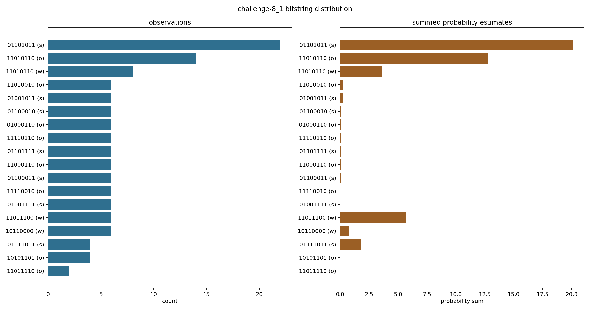
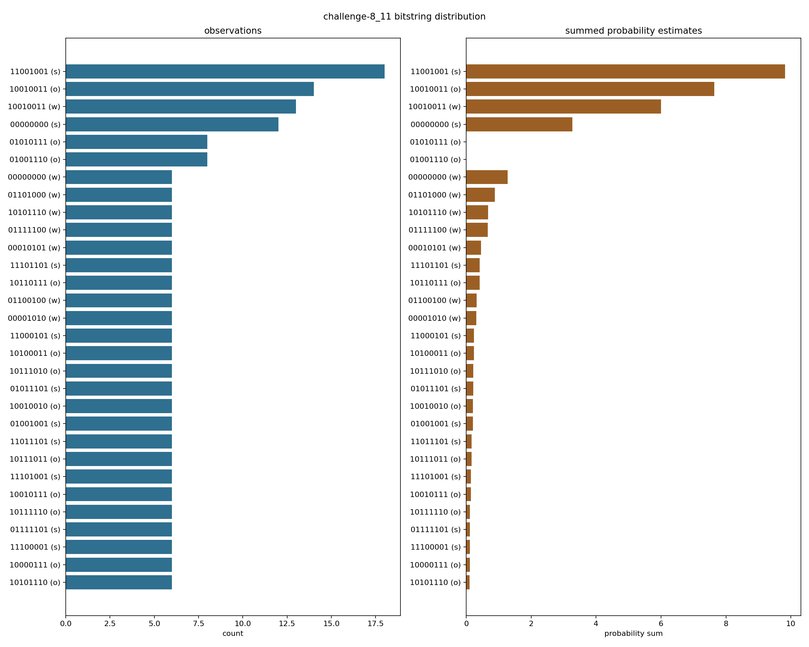
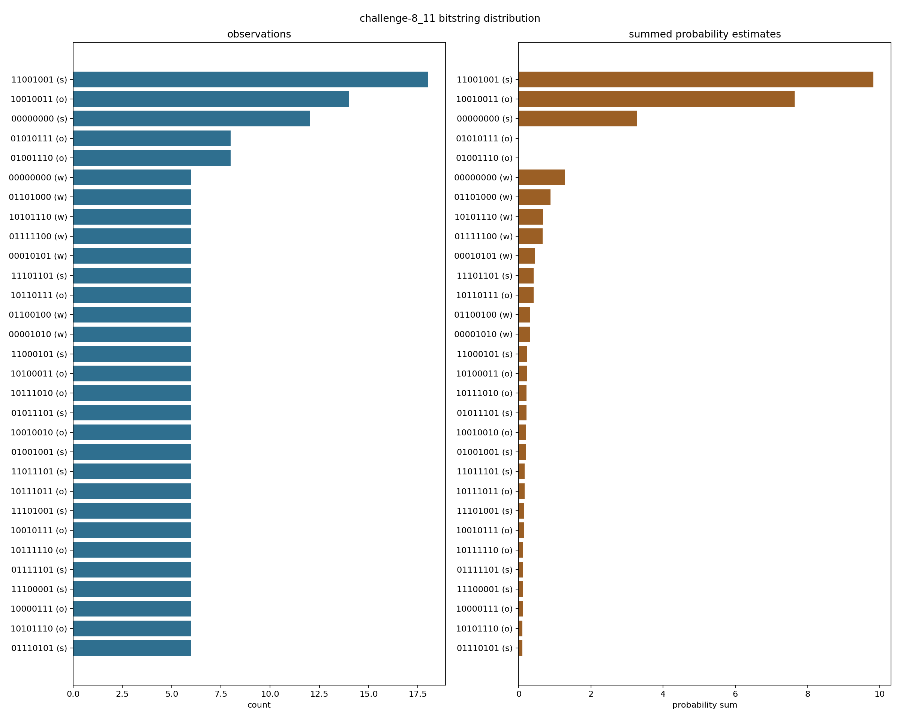
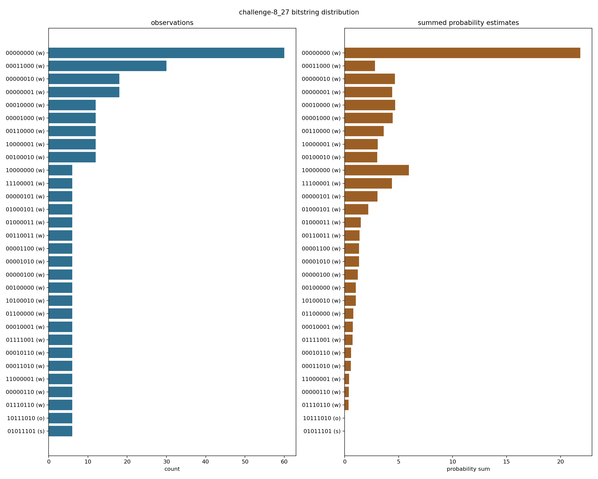
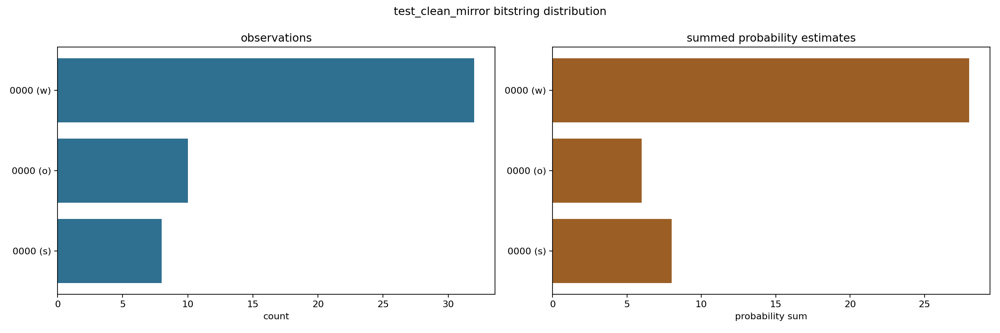

# Total Spacetime Bitstring Distributions

Compiled from completed `outputs/total_spacetime/**/*.json` files.
Bars count reported bitstring observations from temporal and spacetime peak extraction fields; probability bars sum any probability estimates attached to those observations.

| source | label | qubits | observations | unique | most common | original-order top | final original | plot |
|---|---|---:|---:|---:|---|---|---|---|
| `challenge-8_1_b256_fast.json` | challenge-8_1 | 8 | 126 | 18 | `01101011` (site, 22) | `11010110` (14) | `10101101` | [png](plots/small_rocm__challenge-8_1_b256_fast.top_bitstrings.png) |
| `easy_challenge-8_11_cpu.json` | challenge-8_11 | 8 | 3160 | 521 | `11001001` (site, 18) | `10010011` (14) | `01001110` | [png](plots/easy_challenge-8_11_cpu.top_bitstrings.png) |
| `easy_challenge-8_11_method_cpu.json` | challenge-8_11 | 8 | 3152 | 521 | `11001001` (site, 18) | `10010011` (14) | `01001110` | [png](plots/easy_challenge-8_11_method_cpu.top_bitstrings.png) |
| `challenge-8_11_b256_fast.json` | challenge-8_11 | 8 | 3152 | 521 | `11001001` (site, 18) | `10010011` (14) | `01001110` | [png](plots/small_rocm__challenge-8_11_b256_fast.top_bitstrings.png) |
| `easy_challenge-8_11_b128.json` | challenge-8_11 | 8 | 3152 | 521 | `11001001` (site, 18) | `10010011` (14) | `01001110` | [png](plots/validation_rocm__easy_challenge-8_11_b128.top_bitstrings.png) |
| `moderate_challenge-8_27_b64_light.json` | challenge-8_27 | 8 | 1346 | 543 | `00000000` (working, 60) | `10111010` (6) | `10011101` | [png](plots/validation_rocm__moderate_challenge-8_27_b64_light.top_bitstrings.png) |
| `smoke_clean_mirror.json` | test_clean_mirror | 4 | 50 | 3 | `0000` (working, 32) | `0000` (10) | `0000` | [png](plots/smoke_clean_mirror.top_bitstrings.png) |
| `smoke_clean_mirror_cuda.json` | test_clean_mirror | 4 | 50 | 3 | `0000` (working, 32) | `0000` (10) | `0000` | [png](plots/smoke_clean_mirror_cuda.top_bitstrings.png) |

## challenge-8_1

Most common: `01101011` (site)

## challenge-8_11

Most common: `11001001` (site)

## challenge-8_11

Most common: `11001001` (site)

## challenge-8_11

Most common: `11001001` (site)

## challenge-8_11

Most common: `11001001` (site)

## challenge-8_27

Most common: `00000000` (working)

## test_clean_mirror

Most common: `0000` (working)

## test_clean_mirror

Most common: `0000` (working)

