# Quantum Peak Challenge — Results Report

**44/49 circuits solved** — 5 very-hard circuits pending recovery jobs.

## Method Summary

| Difficulty | Method | Circuits |
|---|---|---|
| very easy | Exact statevector (Qiskit Aer) | 10/10 |
| easy | MPO iterative cancellation + graph ordering | 16/16 |
| moderate | MPO iterative cancellation + graph ordering | 8/8 |
| hard | MPO iterative cancellation + graph ordering | 7/7 |
| very hard | MPO iterative cancellation + graph ordering | 3/8 (5 pending) |

### Key technique: Peaked-circuit MPO unswapping

For circuits larger than ~32 qubits, exact statevector simulation is infeasible. We exploit the peaked circuit structure C = U₁U₁†P₁U₂U₂†P₂U₃U₃†: the U·U† pairs are iteratively cancelled via the *MPO unswap algorithm* (`mpo_compress_unswap_graph`), which alternates SabreSwap reordering with MPO compression sweeps. A graph-based qubit reordering (RCM) minimises MPO bandwidth cost before compression. Once the bond dimension collapses to 1 (product state), we extract the dominant bitstring via marginal measurements. Compression parameters: max-bond=512, cutoff=0.0125, mps-cutoff=1e-8 (recovery), sabre-trials=96.

---

## Very Easy

| Circuit | Qubits | Status | Answer (Qiskit order) |
|---|---|---|---|
| 8_1 | 8 | ✅ [SV] | `10101101` |
| 16_2 | 16 | ✅ [SV] | `1010101011001000` |
| 24_3 | 24 | ✅ [SV] | `011110010000101010001000` |
| 28_4 | 28 | ✅ [SV] | `1111111000101010110110011111` |
| 32_5 | 32 | ✅ [MPO] | `00111000101010100001000000010000` |
| 36_6 | 36 | ✅ [MPO] | `100110100111101001001101110011001000` |
| 40_7 | 40 | ✅ [MPO] | `0110111011010001010011111110010011000111` |
| 48_8 | 48 | ✅ [MPO] | `000100100110111001001111111100101011001110010100` |
| 56_9 | 56 | ✅ [MPO] | `10010110101100101110100110010110011101100110001101010100` |
| 64_10 | 64 | ✅ [MPO] | `0011010010110001110010111001100100101100010111110110010100101011` |

### Bitstring distributions

#### 8_1
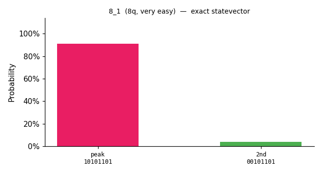

#### 16_2

#### 24_3
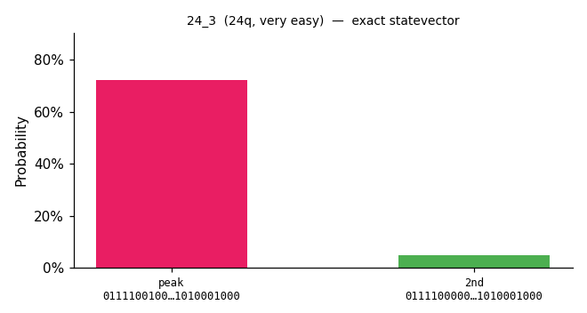

#### 28_4
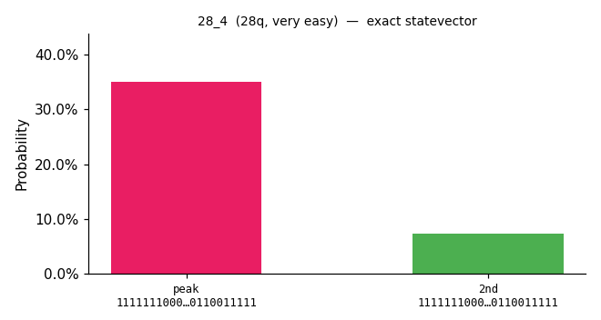

#### 32_5
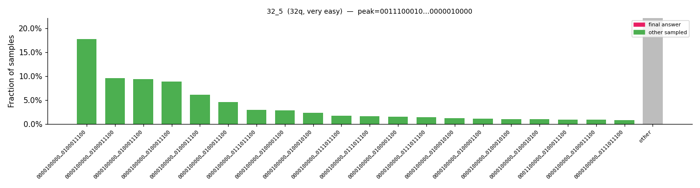

#### 36_6
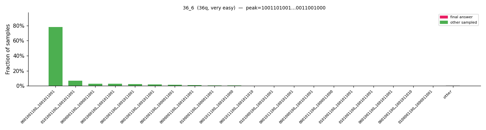

#### 40_7
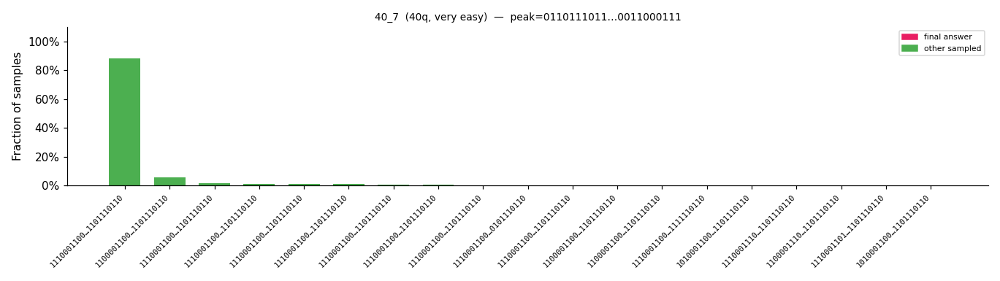

#### 48_8
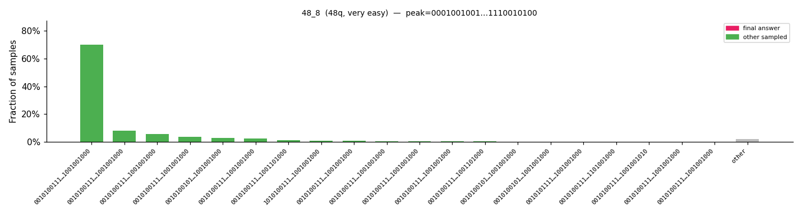

#### 56_9
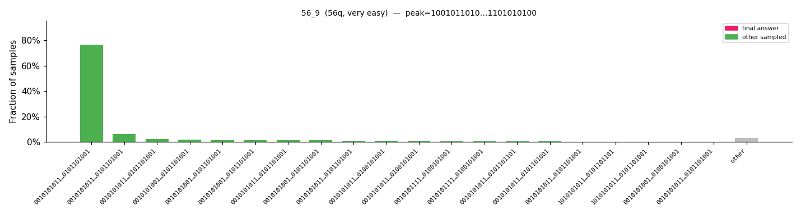

#### 64_10
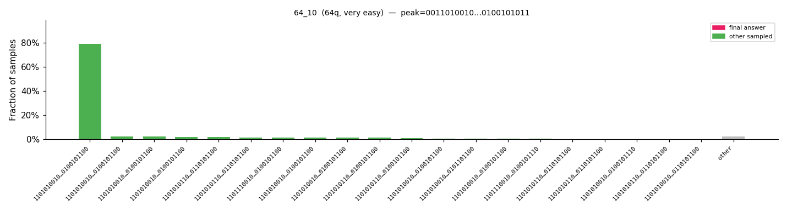

## Easy

| Circuit | Qubits | Status | Answer (Qiskit order) |
|---|---|---|---|
| 8_11 | 8 | ✅ [SV] | `01001110` |
| 16_12 | 16 | ✅ [SV] | `1111000101101011` |
| 24_13 | 24 | ✅ [SV] | `111110011111001011010001` |
| 32_14 | 32 | ✅ [MPO] | `00000101001101000001011111101100` |
| 36_15 | 36 | ✅ [MPO] | `110110011011111111011001011110101111` |
| 40_16 | 40 | ✅ [MPO] | `0101110101001110011000111011100110010110` |
| 40_17 | 40 | ✅ [MPO] | `0010010101010111001001000010001000001001` |
| 40_18 | 40 | ✅ [MPO] | `0100000110010010001101111000111111001110` |
| 48_19 | 48 | ✅ [MPO] | `011001010111101100111110000001011101001110010000` |
| 48_20 | 48 | ✅ [MPO] | `101010100101001010000110101000001011110010000000` |
| 48_21 | 48 | ✅ [MPO] | `111010101110101011110101000001101000100000001001` |
| 56_22 | 56 | ✅ [MPO] | `11100100100110010011110010110110011000000100010111111011` |
| 56_23 | 56 | ✅ [MPO] | `01001101001111111100000101001110111011100011111100001101` |
| 56_24 | 56 | ✅ [MPO] | `10011001001111101111111011101011101101010011001011110001` |
| 64_25 | 64 | ✅ [MPO] | `0011101111110000110110111101011000010000010100110111000001111011` |
| 64_26 | 64 | ✅ [MPO] | `0110101010100011010111011000011100010110110110011100011001100110` |

### Bitstring distributions

#### 8_11
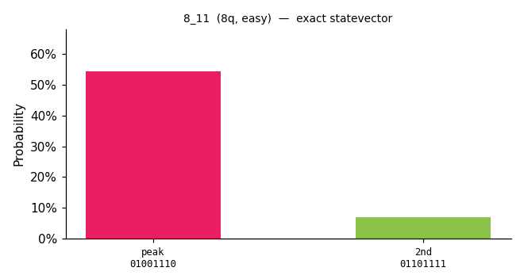

#### 16_12
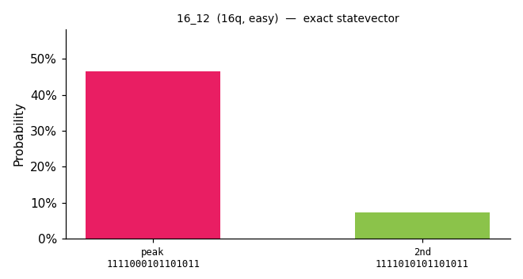

#### 24_13
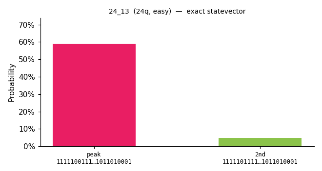

#### 32_14

#### 36_15
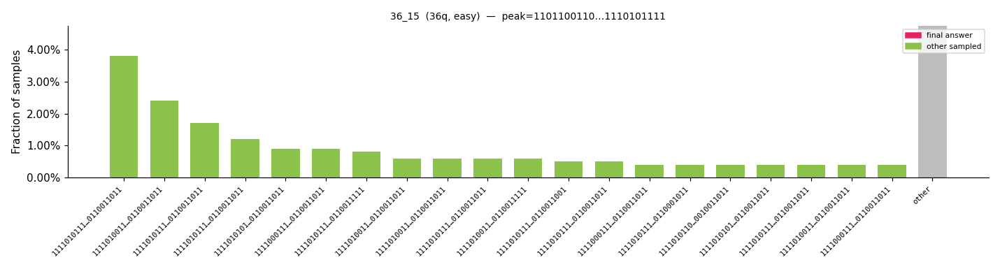

#### 40_16
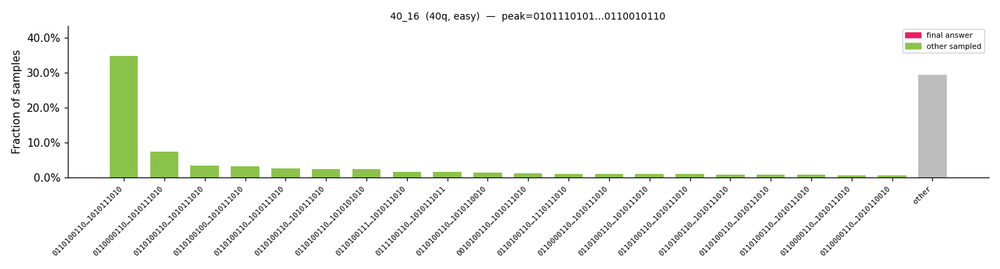

#### 40_17
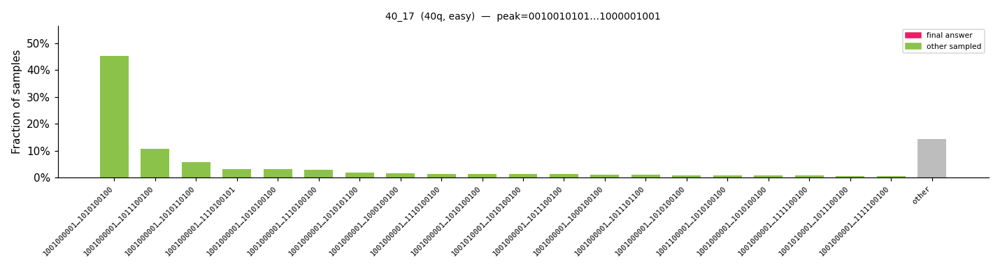

#### 40_18
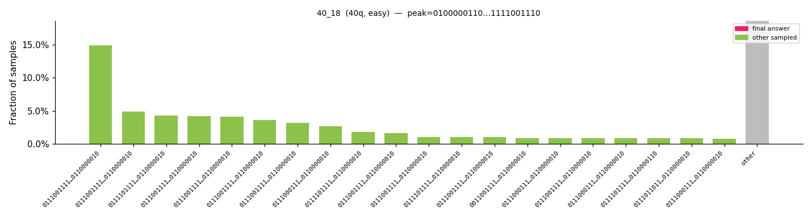

#### 48_19
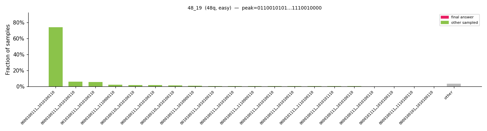

#### 48_20
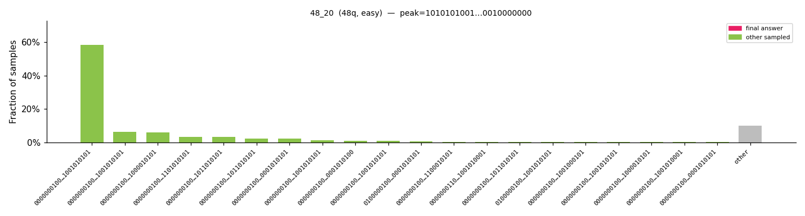

#### 48_21
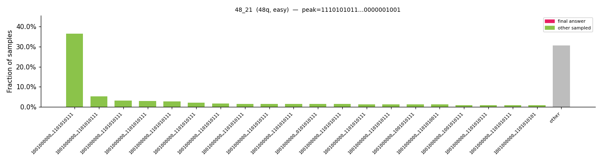

#### 56_22
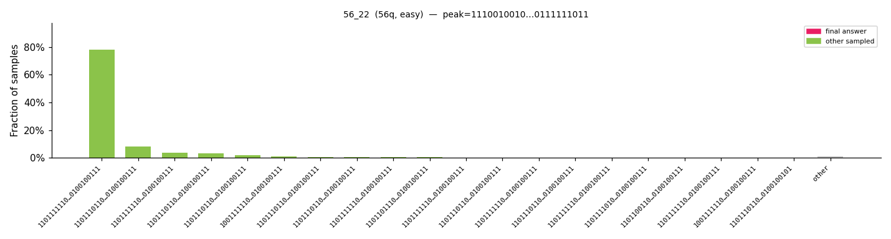

#### 56_23
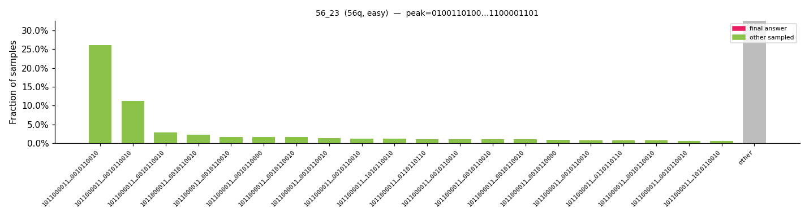

#### 56_24
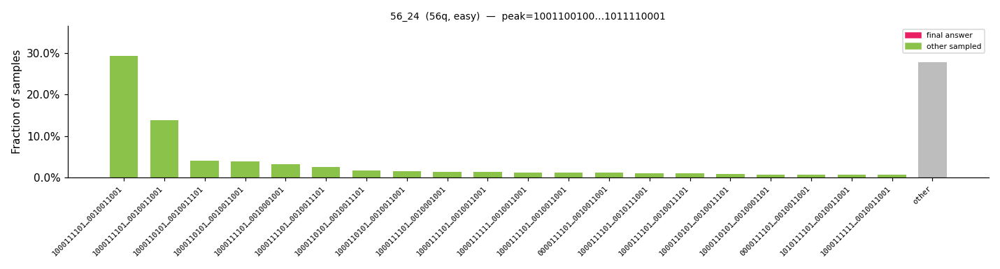

#### 64_25
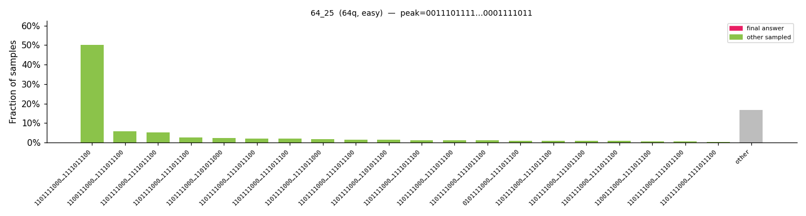

#### 64_26
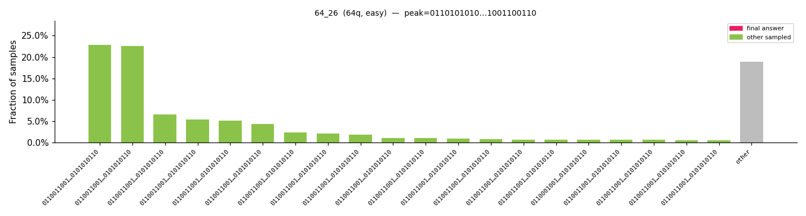

## Moderate

| Circuit | Qubits | Status | Answer (Qiskit order) |
|---|---|---|---|
| 8_27 | 8 | ✅ [SV] | `11001001` |
| 16_28 | 16 | ✅ [SV] | `1101001111011100` |
| 24_29 | 24 | ✅ [SV] | `110100010111100001001001` |
| 32_30 | 32 | ✅ [MPO] | `10111000010011110111101110010110` |
| 48_31 | 48 | ✅ [MPO] | `101100111000101011111111101010111011011000110110` |
| 48_32 | 48 | ✅ [MPO] | `011101010111011110001110010101010101101110001110` |
| 56_33 | 56 | ✅ [MPO] | `11001001100100001111010100100010010101111111011101010000` |
| 64_34 | 64 | ✅ [MPO] | `0011010100010011001110101110100101101011001011011001111011100110` |

### Bitstring distributions

#### 8_27
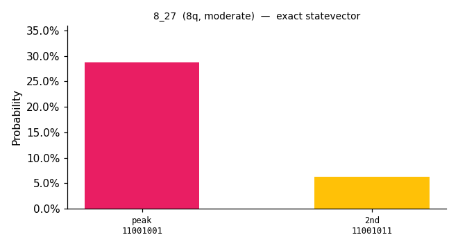

#### 16_28
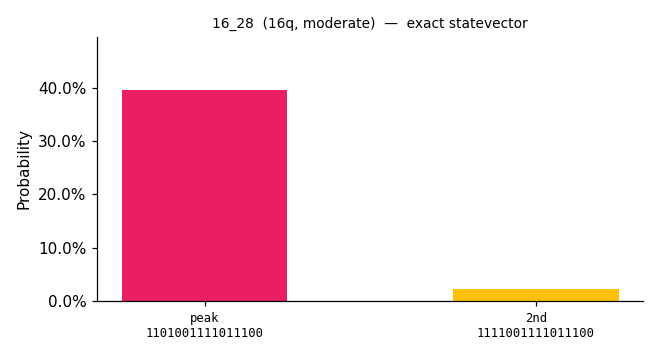

#### 24_29
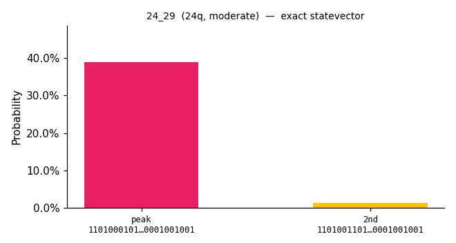

#### 32_30
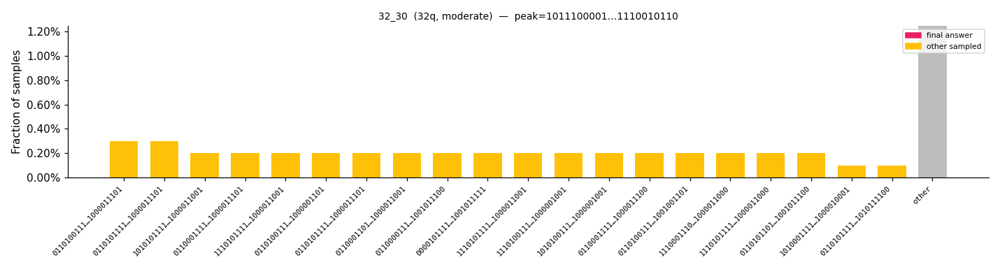

#### 48_31
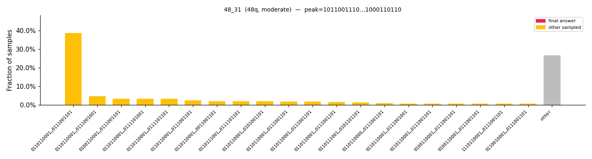

#### 48_32
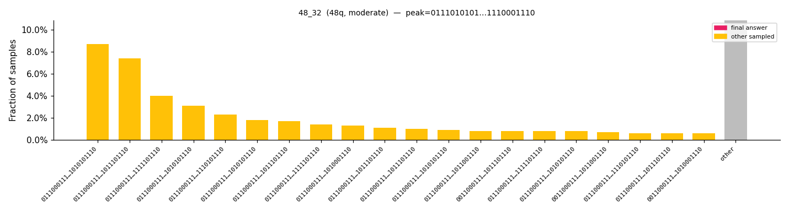

#### 56_33
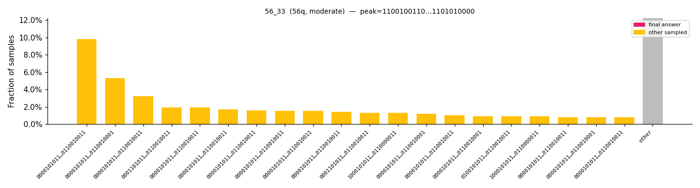

#### 64_34
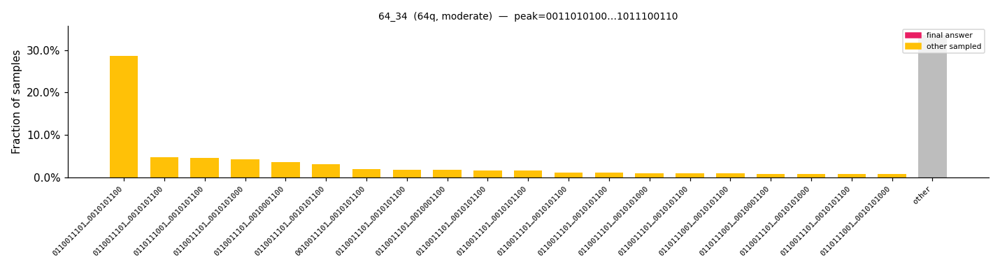

## Hard

| Circuit | Qubits | Status | Answer (Qiskit order) |
|---|---|---|---|
| 40_35 | 40 | ✅ [MPO] | `1101100110111110111000111101010111000001` |
| 48_36 | 48 | ✅ [MPO] | `000111011011000100010011001000101001101010111000` |
| 48_37 | 48 | ✅ [MPO] | `001000111110111100010110100100011000011100001000` |
| 56_38 | 56 | ✅ [MPO] | `01010110010110000010000111010111010011110100100110011101` |
| 56_39 | 56 | ✅ [MPO] | `10010111001101010101111111010110110100010000111001010000` |
| 64_40 | 64 | ✅ [MPO] | `1010010110110110010100101100010010000000101110110101100101001010` |
| 64_41 | 64 | ✅ [MPO] | `1111000100010010110100010011110011000000000011011001110011010011` |

### Bitstring distributions

#### 40_35

#### 48_36
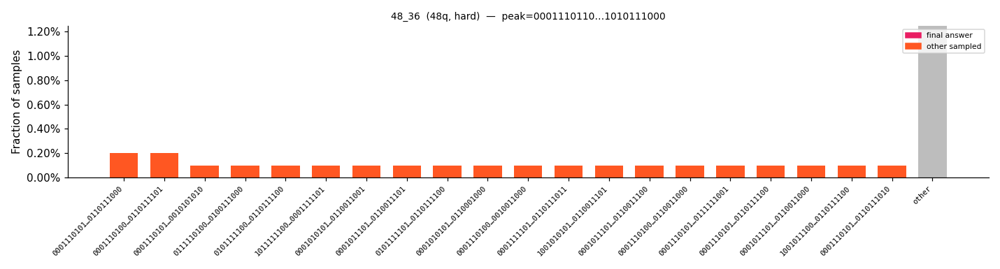

#### 48_37
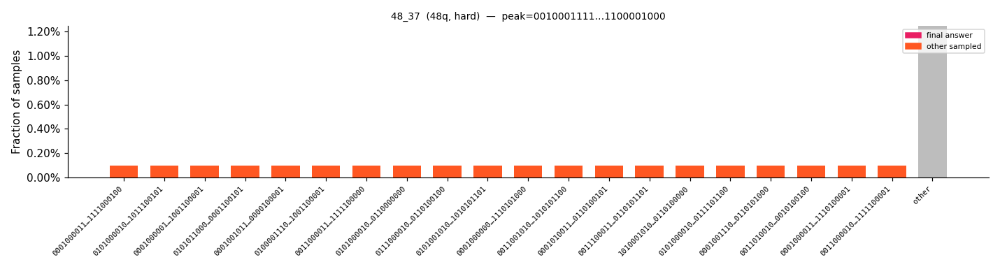

#### 56_38
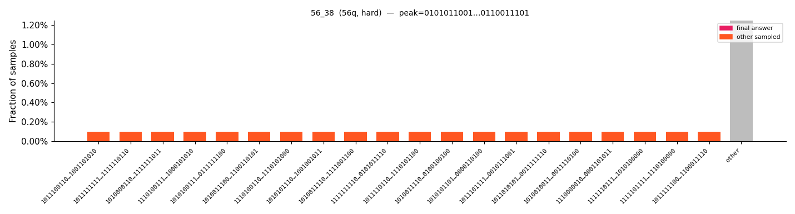

#### 56_39
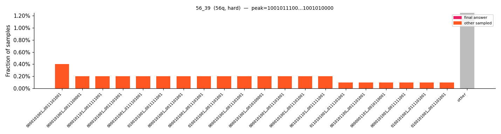

#### 64_40

#### 64_41
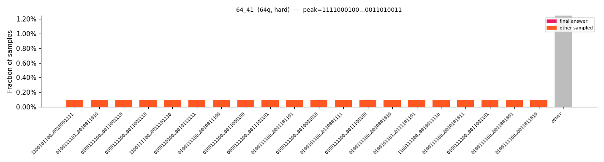

## Very Hard

| Circuit | Qubits | Status | Answer (Qiskit order) |
|---|---|---|---|
| 48_42 | 48 | ✅ [MPO] | `101101000011000100111110110110110111010000010010` |
| 56_43 | 56 | ✅ [MPO] | `01101110110101000111010100001001000110110101010010011000` |
| 64_44 | 64 | ⏳ pending | — |
| 72_45 | 72 | ⏳ pending | — |
| 80_46 | 80 | ⏳ pending | — |
| 88_47 | 88 | ⏳ pending | — |
| 96_48 | 96 | ⏳ pending | — |
| 104_49 | 104 | ✅ [MPO] | `10000011001100000010101010100101001001011001110000000111100011100000010000101010101101111111110100000111` |

### Bitstring distributions

#### 48_42
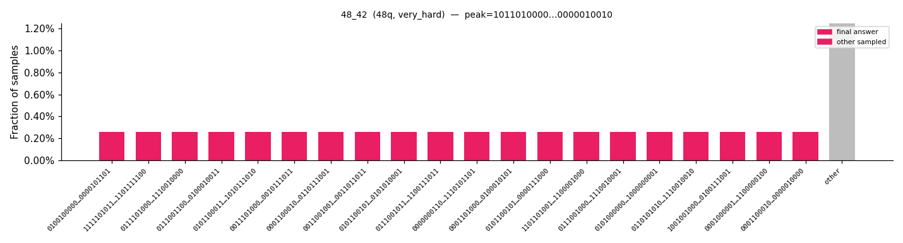

#### 56_43

#### 64_44

#### 72_45

#### 80_46

#### 88_47

#### 96_48

#### 104_49
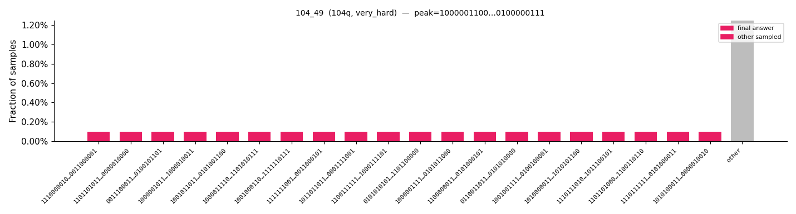

---

## Appendix: All Answers

| Circuit | Difficulty | Qubits | Source | Answer |
|---|---|---|---|---|
| 8_1 | very easy | 8 | exact_statevector | `10101101` |
| 16_2 | very easy | 16 | exact_statevector | `1010101011001000` |
| 24_3 | very easy | 24 | exact_statevector | `011110010000101010001000` |
| 28_4 | very easy | 28 | exact_statevector | `1111111000101010110110011111` |
| 32_5 | very easy | 32 | peaked_mpo_graph_tns | `00111000101010100001000000010000` |
| 36_6 | very easy | 36 | peaked_mpo_graph_tns | `100110100111101001001101110011001000` |
| 40_7 | very easy | 40 | peaked_mpo_graph_tns | `0110111011010001010011111110010011000111` |
| 48_8 | very easy | 48 | peaked_mpo_graph_tns | `000100100110111001001111111100101011001110010100` |
| 56_9 | very easy | 56 | peaked_mpo_graph_tns | `10010110101100101110100110010110011101100110001101010100` |
| 64_10 | very easy | 64 | peaked_mpo_graph_tns | `0011010010110001110010111001100100101100010111110110010100101011` |
| 8_11 | easy | 8 | exact_statevector | `01001110` |
| 16_12 | easy | 16 | exact_statevector | `1111000101101011` |
| 24_13 | easy | 24 | exact_statevector | `111110011111001011010001` |
| 32_14 | easy | 32 | peaked_mpo_graph_tns | `00000101001101000001011111101100` |
| 36_15 | easy | 36 | peaked_mpo_graph_tns | `110110011011111111011001011110101111` |
| 40_16 | easy | 40 | peaked_mpo_graph_tns | `0101110101001110011000111011100110010110` |
| 40_17 | easy | 40 | peaked_mpo_graph_tns | `0010010101010111001001000010001000001001` |
| 40_18 | easy | 40 | peaked_mpo_graph_tns | `0100000110010010001101111000111111001110` |
| 48_19 | easy | 48 | peaked_mpo_graph_tns | `011001010111101100111110000001011101001110010000` |
| 48_20 | easy | 48 | peaked_mpo_graph_tns | `101010100101001010000110101000001011110010000000` |
| 48_21 | easy | 48 | peaked_mpo_graph_tns | `111010101110101011110101000001101000100000001001` |
| 56_22 | easy | 56 | peaked_mpo_graph_tns | `11100100100110010011110010110110011000000100010111111011` |
| 56_23 | easy | 56 | peaked_mpo_graph_tns | `01001101001111111100000101001110111011100011111100001101` |
| 56_24 | easy | 56 | peaked_mpo_graph_tns | `10011001001111101111111011101011101101010011001011110001` |
| 64_25 | easy | 64 | peaked_mpo_graph_tns | `0011101111110000110110111101011000010000010100110111000001111011` |
| 64_26 | easy | 64 | peaked_mpo_graph_tns | `0110101010100011010111011000011100010110110110011100011001100110` |
| 8_27 | moderate | 8 | exact_statevector | `11001001` |
| 16_28 | moderate | 16 | exact_statevector | `1101001111011100` |
| 24_29 | moderate | 24 | exact_statevector | `110100010111100001001001` |
| 32_30 | moderate | 32 | peaked_mpo_graph_tns | `10111000010011110111101110010110` |
| 48_31 | moderate | 48 | peaked_mpo_graph_tns | `101100111000101011111111101010111011011000110110` |
| 48_32 | moderate | 48 | peaked_mpo_graph_tns | `011101010111011110001110010101010101101110001110` |
| 56_33 | moderate | 56 | peaked_mpo_graph_tns | `11001001100100001111010100100010010101111111011101010000` |
| 64_34 | moderate | 64 | peaked_mpo_graph_tns | `0011010100010011001110101110100101101011001011011001111011100110` |
| 40_35 | hard | 40 | peaked_mpo_graph_tns | `1101100110111110111000111101010111000001` |
| 48_36 | hard | 48 | peaked_mpo_graph_tns | `000111011011000100010011001000101001101010111000` |
| 48_37 | hard | 48 | peaked_mpo_graph_tns | `001000111110111100010110100100011000011100001000` |
| 56_38 | hard | 56 | peaked_mpo_graph_tns | `01010110010110000010000111010111010011110100100110011101` |
| 56_39 | hard | 56 | peaked_mpo_graph_tns | `10010111001101010101111111010110110100010000111001010000` |
| 64_40 | hard | 64 | peaked_mpo_graph_tns | `1010010110110110010100101100010010000000101110110101100101001010` |
| 64_41 | hard | 64 | peaked_mpo_graph_tns | `1111000100010010110100010011110011000000000011011001110011010011` |
| 48_42 | very_hard | 48 | peaked_mpo_graph_tns | `101101000011000100111110110110110111010000010010` |
| 56_43 | very_hard | 56 | peaked_mpo_graph_tns | `01101110110101000111010100001001000110110101010010011000` |
| 64_44 | very_hard | 64 | pending | — |
| 72_45 | very_hard | 72 | pending | — |
| 80_46 | very_hard | 80 | pending | — |
| 88_47 | very_hard | 88 | pending | — |
| 96_48 | very_hard | 96 | pending | — |
| 104_49 | very_hard | 104 | peaked_mpo_graph_tns | `10000011001100000010101010100101001001011001110000000111100011100000010000101010101101111111110100000111` |

