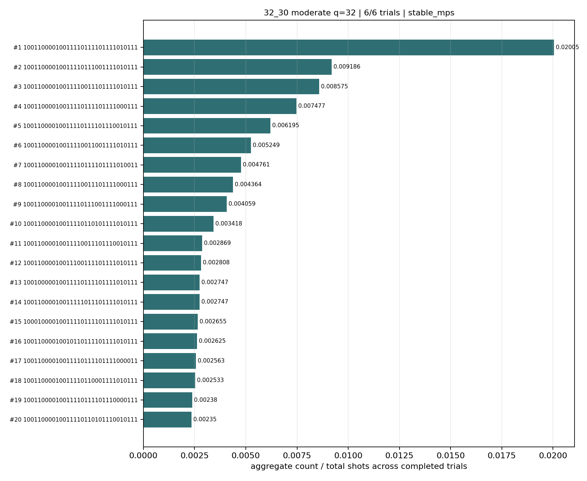
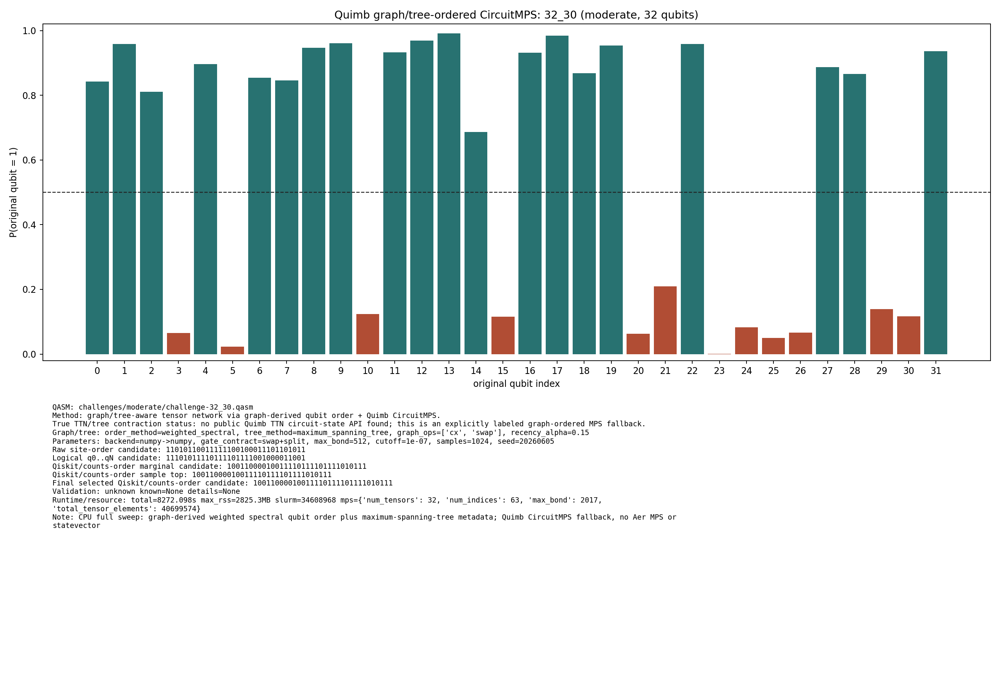
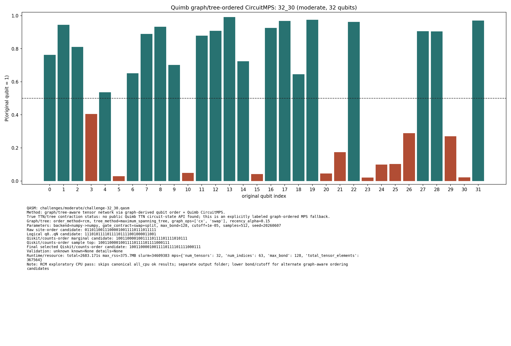

# Challenge 32_30

- Difficulty: moderate
- Qubits: 32
- QASM: `challenges/moderate/challenge-32_30.qasm`
- Central selected answer: `10011000010011110111101111010111`
- Selected method: `quimb_cpu_all`
- Selected review: none
- Candidate rows: 115
- Method runs: 15
- Distribution figures: 3

## Selected Answer Sources

| source | selected answer | method | validation | status | evidence |
|---|---|---|---|---|---:|
| tree_tensor_sim_session | `10011000010011110111101111010111` | quimb_cpu_all | unknown | selected | 2 |
| quantum_peak_session | `10011000010011110111101111010111` | quimb_cpu_all | unknown | selected | 2 |

## Method Summary

| method | family | runs | statuses | best or marked candidate | rank_type | score | fraction | review | sources |
|---|---|---:|---|---|---|---:|---:|---|---|
| aer_mps_adaptive_sweep | mps | 1 | ok | `10011000010011110111101111010111` | aggregate_candidate | 0.041036852 | 0.020050049 |  | mps_adaptive_sweep |
| aer_tree_mps_all | mps | 3 | ok | `10011000010011110111101111010111` | sample_top | 0.0015869140625 | 0.0015869140625 |  | tree_tensor_sim_session |
| algebraic_simplify_cxswap | heuristic | 1 | static_analysis | `00010000000000000000000010100110` | static_heuristic |  |  |  | algebraic_simplify |
| algebraic_simplify_swaponly | heuristic | 1 | static_analysis | `00010001000000000000000100000010` | static_heuristic |  |  |  | algebraic_simplify |
| collector_snapshot | collector | 2 | unknown | `10011000010011110111101111010111` | collector_selected | 0.1357421875 | 0.1357421875 |  | quantum_peak_session,tree_tensor_sim_session |
| quimb_cpu_all | quimb | 2 | ok,unknown | `10011000010011110111101111010111` | final_candidate | 0.1862237290356541 |  |  | quantum_peak_session,tree_tensor_sim_session |
| quimb_fast_cpu | quimb | 1 | started |  |  |  |  |  | tree_tensor_sim_session |
| quimb_gpu_all | quimb | 1 | started |  |  |  |  |  | tree_tensor_sim_session |
| quimb_rcm_cpu | quimb | 2 | ok,unknown | `10011000010011110111101111010111` | marginal_candidate | 0.03688009921490032 |  |  | quantum_peak_session,tree_tensor_sim_session |
| tno_contract_core_cpu | tno | 1 | started |  |  |  |  |  | tno_contract_core_cpu |

## Method Selector

| first action | best method | best score | MPS | TNO | MPO-unswap |
|---|---|---:|---:|---:|---:|
| Low-bond MPS with bitstring distillation | Low-bond MPS with bitstring distillation | 58 | 58 | 38 | 57 |

## Distribution Figures

### Adaptive Aer MPS distribution: challenge-32_30.png

### Quimb graph-ordered MPS distribution: challenge-32_30.quimb_tree_graph_mps.png

### Quimb graph-ordered MPS distribution: challenge-32_30.quimb_tree_graph_mps.png

## Candidate Rows

| review | selected | method | rank_type | rank | bitstring | score | count | support | fraction | validation | status | sources | source path | notes |
|---|---:|---|---|---:|---|---:|---:|---:|---:|---|---|---|---|---|
|  | 1 | collector_snapshot | collector_selected | 1 | `10011000010011110111101111010111` | 0.1357421875 |  |  | 0.1357421875 | unknown | unknown | tree_tensor_sim_session | `research/tree_tensor_sim_session/artifacts/collector/CANDIDATES.tsv` | quimb_cpu_all |
|  | 1 | collector_snapshot | collector_selected | 1 | `10011000010011110111101111010111` | 0.1357421875 |  |  | 0.1357421875 | unknown | unknown | quantum_peak_session | `research/quantum_peak_session/results/current_candidates/CANDIDATES.tsv` | quimb_cpu_all |
|  | 1 | quimb_cpu_all | final_candidate | 1 | `10011000010011110111101111010111` | 0.1862237290356541 |  |  |  | {"known_answer_qiskit_order":null,"status":"unknown"} | ok | tree_tensor_sim_session | `../quantum-junction-tree-tensor/outputs/tree_tensor_sim/all_cpu/json/challenge-32_30.quimb_tree_graph_mps.json` | - |
|  | 1 | aer_mps_adaptive_sweep | aggregate_candidate | 1 | `10011000010011110111101111010111` | 0.041036852 |  | 1 | 0.020050049 | stable_mps | ok | mps_adaptive_sweep | `agent_work/mps_adaptive_sweep/report/tables/mps_adaptive_summary.tsv` | aggregate_gap=2.18272; exact_match=False |
|  | 1 | quimb_cpu_all | marginal_candidate | 1 | `10011000010011110111101111010111` | 0.1862237290356541 |  |  |  | {"known_answer_qiskit_order":null,"status":"unknown"} | ok | tree_tensor_sim_session | `../quantum-junction-tree-tensor/outputs/tree_tensor_sim/all_cpu/json/challenge-32_30.quimb_tree_graph_mps.json` | - |
|  | 1 | quimb_rcm_cpu | marginal_candidate | 1 | `10011000010011110111101111010111` | 0.03688009921490032 |  |  |  | {"known_answer_qiskit_order":null,"status":"unknown"} | ok | tree_tensor_sim_session | `../quantum-junction-tree-tensor/outputs/tree_tensor_sim/rcm_cpu/json/challenge-32_30.quimb_tree_graph_mps.json` | - |
|  | 1 | quimb_cpu_all | sample_top | 1 | `10011000010011110111101111010111` | 0.1357421875 | 139 |  | 0.1357421875 | {"known_answer_qiskit_order":null,"status":"unknown"} | ok | tree_tensor_sim_session | `../quantum-junction-tree-tensor/outputs/tree_tensor_sim/all_cpu/json/challenge-32_30.quimb_tree_graph_mps.json` | - |
|  | 1 | quimb_rcm_cpu | sample_top | 2 | `10011000010011110111101111010111` | 0.009765625 | 5 |  | 0.009765625 | {"known_answer_qiskit_order":null,"status":"unknown"} | ok | tree_tensor_sim_session | `../quantum-junction-tree-tensor/outputs/tree_tensor_sim/rcm_cpu/json/challenge-32_30.quimb_tree_graph_mps.json` | - |
|  | 1 | aer_tree_mps_all | sample_top | 6 | `10011000010011110111101111010111` | 0.0015869140625 | 13 |  | 0.0015869140625 |  | ok | tree_tensor_sim_session | `../quantum-junction-tree-tensor/outputs/tree_tensor_sim/all/json/challenge-32_30.tree_tensor_mps.json` | - |
|  | 1 | aer_tree_mps_all | sample_top | 12 | `10011000010011110111101111010111` | 0.004150390625 | 34 |  | 0.004150390625 |  | ok | tree_tensor_sim_session | `../quantum-junction-tree-tensor/outputs/tree_tensor_sim/all/json/challenge-32_30.tree_tensor_mps.json` | - |
|  | 1 | aer_tree_mps_all | sample_top | 13 | `10011000010011110111101111010111` | 0.01953125 | 160 |  | 0.01953125 |  | ok | tree_tensor_sim_session | `../quantum-junction-tree-tensor/outputs/tree_tensor_sim/all/json/challenge-32_30.tree_tensor_mps.json` | - |
|  | 1 | aer_mps_adaptive_sweep | aggregate_top_counts | 1 | `10011000010011110111101111010111` | 0.041036852 | 657 |  | 0.020050049 |  | ok | mps_adaptive_sweep | `agent_work/mps_adaptive_sweep/report/tables/mps_adaptive_top_counts.tsv` |  |
|  | 1 | quimb_cpu_all | collector_evidence | 1 | `10011000010011110111101111010111` | 0.1357421875 |  |  | 0.1357421875 | unknown | unknown | quantum_peak_session,tree_tensor_sim_session | `outputs/tree_tensor_sim/all_cpu/json/challenge-32_30.quimb_tree_graph_mps.json` | collector priority 80 |
|  | 0 | quimb_rcm_cpu | final_candidate | 1 | `10011000010011110111101111000111` | 0.03688009921490032 |  |  |  | {"known_answer_qiskit_order":null,"status":"unknown"} | ok | tree_tensor_sim_session | `../quantum-junction-tree-tensor/outputs/tree_tensor_sim/rcm_cpu/json/challenge-32_30.quimb_tree_graph_mps.json` | - |
|  | 0 | aer_tree_mps_all | sample_top | 1 | `10001000010010110110101111010111` | 0.0010986328125 | 9 |  | 0.0010986328125 |  | ok | tree_tensor_sim_session | `../quantum-junction-tree-tensor/outputs/tree_tensor_sim/all/json/challenge-32_30.tree_tensor_mps.json` | - |
|  | 0 | aer_tree_mps_all | sample_top | 1 | `10011000000011110011101111010011` | 0.00146484375 | 12 |  | 0.00146484375 |  | ok | tree_tensor_sim_session | `../quantum-junction-tree-tensor/outputs/tree_tensor_sim/all/json/challenge-32_30.tree_tensor_mps.json` | - |
|  | 0 | aer_tree_mps_all | sample_top | 1 | `10011000010011100110101111010111` | 0.0028076171875 | 23 |  | 0.0028076171875 |  | ok | tree_tensor_sim_session | `../quantum-junction-tree-tensor/outputs/tree_tensor_sim/all/json/challenge-32_30.tree_tensor_mps.json` | - |
|  | 0 | quimb_rcm_cpu | sample_top | 1 | `10011000010011110111101111000111` | 0.01171875 | 6 |  | 0.01171875 | {"known_answer_qiskit_order":null,"status":"unknown"} | ok | tree_tensor_sim_session | `../quantum-junction-tree-tensor/outputs/tree_tensor_sim/rcm_cpu/json/challenge-32_30.quimb_tree_graph_mps.json` | - |
|  | 0 | aer_tree_mps_all | sample_top | 2 | `10001000010010110111101110010111` | 0.000732421875 | 6 |  | 0.000732421875 |  | ok | tree_tensor_sim_session | `../quantum-junction-tree-tensor/outputs/tree_tensor_sim/all/json/challenge-32_30.tree_tensor_mps.json` | - |
|  | 0 | aer_tree_mps_all | sample_top | 2 | `10011000000011110111101111010001` | 0.0015869140625 | 13 |  | 0.0015869140625 |  | ok | tree_tensor_sim_session | `../quantum-junction-tree-tensor/outputs/tree_tensor_sim/all/json/challenge-32_30.tree_tensor_mps.json` | - |
|  | 0 | aer_tree_mps_all | sample_top | 2 | `10011000010011100111101110010111` | 0.0025634765625 | 21 |  | 0.0025634765625 |  | ok | tree_tensor_sim_session | `../quantum-junction-tree-tensor/outputs/tree_tensor_sim/all/json/challenge-32_30.tree_tensor_mps.json` | - |
|  | 0 | quimb_cpu_all | sample_top | 2 | `10011000010011110111101111010011` | 0.0302734375 | 31 |  | 0.0302734375 | {"known_answer_qiskit_order":null,"status":"unknown"} | ok | tree_tensor_sim_session | `../quantum-junction-tree-tensor/outputs/tree_tensor_sim/all_cpu/json/challenge-32_30.quimb_tree_graph_mps.json` | - |
|  | 0 | aer_tree_mps_all | sample_top | 3 | `10001000010011110110101111010111` | 0.000732421875 | 6 |  | 0.000732421875 |  | ok | tree_tensor_sim_session | `../quantum-junction-tree-tensor/outputs/tree_tensor_sim/all/json/challenge-32_30.tree_tensor_mps.json` | - |
|  | 0 | aer_tree_mps_all | sample_top | 3 | `10011000000011110111101111010011` | 0.00146484375 | 12 |  | 0.00146484375 |  | ok | tree_tensor_sim_session | `../quantum-junction-tree-tensor/outputs/tree_tensor_sim/all/json/challenge-32_30.tree_tensor_mps.json` | - |
|  | 0 | aer_tree_mps_all | sample_top | 3 | `10011000010011100111101111000111` | 0.0025634765625 | 21 |  | 0.0025634765625 |  | ok | tree_tensor_sim_session | `../quantum-junction-tree-tensor/outputs/tree_tensor_sim/all/json/challenge-32_30.tree_tensor_mps.json` | - |
|  | 0 | quimb_cpu_all | sample_top | 3 | `10011000011011110011101111010111` | 0.0283203125 | 29 |  | 0.0283203125 | {"known_answer_qiskit_order":null,"status":"unknown"} | ok | tree_tensor_sim_session | `../quantum-junction-tree-tensor/outputs/tree_tensor_sim/all_cpu/json/challenge-32_30.quimb_tree_graph_mps.json` | - |
|  | 0 | quimb_rcm_cpu | sample_top | 3 | `10011000010011110111101110011111` | 0.0078125 | 4 |  | 0.0078125 | {"known_answer_qiskit_order":null,"status":"unknown"} | ok | tree_tensor_sim_session | `../quantum-junction-tree-tensor/outputs/tree_tensor_sim/rcm_cpu/json/challenge-32_30.quimb_tree_graph_mps.json` | - |
|  | 0 | aer_tree_mps_all | sample_top | 4 | `10001100010010110111111111010111` | 0.0009765625 | 8 |  | 0.0009765625 |  | ok | tree_tensor_sim_session | `../quantum-junction-tree-tensor/outputs/tree_tensor_sim/all/json/challenge-32_30.tree_tensor_mps.json` | - |
|  | 0 | aer_tree_mps_all | sample_top | 4 | `10011000000011110111101111010101` | 0.0025634765625 | 21 |  | 0.0025634765625 |  | ok | tree_tensor_sim_session | `../quantum-junction-tree-tensor/outputs/tree_tensor_sim/all/json/challenge-32_30.tree_tensor_mps.json` | - |
|  | 0 | aer_tree_mps_all | sample_top | 4 | `10011000010011100111101111010111` | 0.00830078125 | 68 |  | 0.00830078125 |  | ok | tree_tensor_sim_session | `../quantum-junction-tree-tensor/outputs/tree_tensor_sim/all/json/challenge-32_30.tree_tensor_mps.json` | - |
|  | 0 | quimb_cpu_all | sample_top | 4 | `11011000010011110111101111010111` | 0.0205078125 | 21 |  | 0.0205078125 | {"known_answer_qiskit_order":null,"status":"unknown"} | ok | tree_tensor_sim_session | `../quantum-junction-tree-tensor/outputs/tree_tensor_sim/all_cpu/json/challenge-32_30.quimb_tree_graph_mps.json` | - |
|  | 0 | quimb_rcm_cpu | sample_top | 4 | `10011000010011110111101111001111` | 0.0078125 | 4 |  | 0.0078125 | {"known_answer_qiskit_order":null,"status":"unknown"} | ok | tree_tensor_sim_session | `../quantum-junction-tree-tensor/outputs/tree_tensor_sim/rcm_cpu/json/challenge-32_30.quimb_tree_graph_mps.json` | - |
|  | 0 | aer_tree_mps_all | sample_top | 5 | `10011000000011110111101111010111` | 0.0032958984375 | 27 |  | 0.0032958984375 |  | ok | tree_tensor_sim_session | `../quantum-junction-tree-tensor/outputs/tree_tensor_sim/all/json/challenge-32_30.tree_tensor_mps.json` | - |
|  | 0 | aer_tree_mps_all | sample_top | 5 | `10011000010010110111100111010111` | 0.0013427734375 | 11 |  | 0.0013427734375 |  | ok | tree_tensor_sim_session | `../quantum-junction-tree-tensor/outputs/tree_tensor_sim/all/json/challenge-32_30.tree_tensor_mps.json` | - |
|  | 0 | aer_tree_mps_all | sample_top | 5 | `10011000010011110011101110010111` | 0.00341796875 | 28 |  | 0.00341796875 |  | ok | tree_tensor_sim_session | `../quantum-junction-tree-tensor/outputs/tree_tensor_sim/all/json/challenge-32_30.tree_tensor_mps.json` | - |
|  | 0 | quimb_cpu_all | sample_top | 5 | `10011000011011110011101101010111` | 0.01953125 | 20 |  | 0.01953125 | {"known_answer_qiskit_order":null,"status":"unknown"} | ok | tree_tensor_sim_session | `../quantum-junction-tree-tensor/outputs/tree_tensor_sim/all_cpu/json/challenge-32_30.quimb_tree_graph_mps.json` | - |
|  | 0 | quimb_rcm_cpu | sample_top | 5 | `10011100010011110111101111010111` | 0.0078125 | 4 |  | 0.0078125 | {"known_answer_qiskit_order":null,"status":"unknown"} | ok | tree_tensor_sim_session | `../quantum-junction-tree-tensor/outputs/tree_tensor_sim/rcm_cpu/json/challenge-32_30.quimb_tree_graph_mps.json` | - |
|  | 0 | aer_tree_mps_all | sample_top | 6 | `10011000010011100111101111010011` | 0.0015869140625 | 13 |  | 0.0015869140625 |  | ok | tree_tensor_sim_session | `../quantum-junction-tree-tensor/outputs/tree_tensor_sim/all/json/challenge-32_30.tree_tensor_mps.json` | - |
|  | 0 | aer_tree_mps_all | sample_top | 6 | `10011000010011110011101111010101` | 0.0029296875 | 24 |  | 0.0029296875 |  | ok | tree_tensor_sim_session | `../quantum-junction-tree-tensor/outputs/tree_tensor_sim/all/json/challenge-32_30.tree_tensor_mps.json` | - |
|  | 0 | quimb_cpu_all | sample_top | 6 | `10011000010011110111111111010011` | 0.013671875 | 14 |  | 0.013671875 | {"known_answer_qiskit_order":null,"status":"unknown"} | ok | tree_tensor_sim_session | `../quantum-junction-tree-tensor/outputs/tree_tensor_sim/all_cpu/json/challenge-32_30.quimb_tree_graph_mps.json` | - |
|  | 0 | quimb_rcm_cpu | sample_top | 6 | `10011000010011110011101111001111` | 0.0078125 | 4 |  | 0.0078125 | {"known_answer_qiskit_order":null,"status":"unknown"} | ok | tree_tensor_sim_session | `../quantum-junction-tree-tensor/outputs/tree_tensor_sim/rcm_cpu/json/challenge-32_30.quimb_tree_graph_mps.json` | - |
|  | 0 | aer_tree_mps_all | sample_top | 7 | `10011000010011110011101111010011` | 0.0015869140625 | 13 |  | 0.0015869140625 |  | ok | tree_tensor_sim_session | `../quantum-junction-tree-tensor/outputs/tree_tensor_sim/all/json/challenge-32_30.tree_tensor_mps.json` | - |
|  | 0 | aer_tree_mps_all | sample_top | 7 | `10011000010011110011101111010111` | 0.008544921875 | 70 |  | 0.008544921875 |  | ok | tree_tensor_sim_session | `../quantum-junction-tree-tensor/outputs/tree_tensor_sim/all/json/challenge-32_30.tree_tensor_mps.json` | - |
|  | 0 | aer_tree_mps_all | sample_top | 7 | `10011100010010110111111111010111` | 0.0015869140625 | 13 |  | 0.0015869140625 |  | ok | tree_tensor_sim_session | `../quantum-junction-tree-tensor/outputs/tree_tensor_sim/all/json/challenge-32_30.tree_tensor_mps.json` | - |
|  | 0 | quimb_cpu_all | sample_top | 7 | `10001000010011110111101111010111` | 0.0126953125 | 13 |  | 0.0126953125 | {"known_answer_qiskit_order":null,"status":"unknown"} | ok | tree_tensor_sim_session | `../quantum-junction-tree-tensor/outputs/tree_tensor_sim/all_cpu/json/challenge-32_30.quimb_tree_graph_mps.json` | - |
|  | 0 | quimb_rcm_cpu | sample_top | 7 | `10011000010011110111001111011111` | 0.005859375 | 3 |  | 0.005859375 | {"known_answer_qiskit_order":null,"status":"unknown"} | ok | tree_tensor_sim_session | `../quantum-junction-tree-tensor/outputs/tree_tensor_sim/rcm_cpu/json/challenge-32_30.quimb_tree_graph_mps.json` | - |
|  | 0 | aer_tree_mps_all | sample_top | 8 | `10011000010011110011101111010101` | 0.0015869140625 | 13 |  | 0.0015869140625 |  | ok | tree_tensor_sim_session | `../quantum-junction-tree-tensor/outputs/tree_tensor_sim/all/json/challenge-32_30.tree_tensor_mps.json` | - |
|  | 0 | aer_tree_mps_all | sample_top | 8 | `10011000010011110011111111010111` | 0.0025634765625 | 21 |  | 0.0025634765625 |  | ok | tree_tensor_sim_session | `../quantum-junction-tree-tensor/outputs/tree_tensor_sim/all/json/challenge-32_30.tree_tensor_mps.json` | - |
|  | 0 | aer_tree_mps_all | sample_top | 8 | `10011100010011110111011111010111` | 0.0008544921875 | 7 |  | 0.0008544921875 |  | ok | tree_tensor_sim_session | `../quantum-junction-tree-tensor/outputs/tree_tensor_sim/all/json/challenge-32_30.tree_tensor_mps.json` | - |
|  | 0 | quimb_cpu_all | sample_top | 8 | `10111000010011110111101111010111` | 0.0107421875 | 11 |  | 0.0107421875 | {"known_answer_qiskit_order":null,"status":"unknown"} | ok | tree_tensor_sim_session | `../quantum-junction-tree-tensor/outputs/tree_tensor_sim/all_cpu/json/challenge-32_30.quimb_tree_graph_mps.json` | - |
|  | 0 | quimb_rcm_cpu | sample_top | 8 | `10111000010011110111101111000110` | 0.005859375 | 3 |  | 0.005859375 | {"known_answer_qiskit_order":null,"status":"unknown"} | ok | tree_tensor_sim_session | `../quantum-junction-tree-tensor/outputs/tree_tensor_sim/rcm_cpu/json/challenge-32_30.quimb_tree_graph_mps.json` | - |
|  | 0 | aer_tree_mps_all | sample_top | 9 | `10011000010011110110101111010111` | 0.002685546875 | 22 |  | 0.002685546875 |  | ok | tree_tensor_sim_session | `../quantum-junction-tree-tensor/outputs/tree_tensor_sim/all/json/challenge-32_30.tree_tensor_mps.json` | - |
|  | 0 | aer_tree_mps_all | sample_top | 9 | `10011000010011110111101111010001` | 0.0029296875 | 24 |  | 0.0029296875 |  | ok | tree_tensor_sim_session | `../quantum-junction-tree-tensor/outputs/tree_tensor_sim/all/json/challenge-32_30.tree_tensor_mps.json` | - |
|  | 0 | aer_tree_mps_all | sample_top | 9 | `10011100010011110111111111010111` | 0.00146484375 | 12 |  | 0.00146484375 |  | ok | tree_tensor_sim_session | `../quantum-junction-tree-tensor/outputs/tree_tensor_sim/all/json/challenge-32_30.tree_tensor_mps.json` | - |
|  | 0 | quimb_cpu_all | sample_top | 9 | `10011000010011110111101110010111` | 0.0087890625 | 9 |  | 0.0087890625 | {"known_answer_qiskit_order":null,"status":"unknown"} | ok | tree_tensor_sim_session | `../quantum-junction-tree-tensor/outputs/tree_tensor_sim/all_cpu/json/challenge-32_30.quimb_tree_graph_mps.json` | - |
|  | 0 | quimb_rcm_cpu | sample_top | 9 | `10011000011011110111101111000111` | 0.005859375 | 3 |  | 0.005859375 | {"known_answer_qiskit_order":null,"status":"unknown"} | ok | tree_tensor_sim_session | `../quantum-junction-tree-tensor/outputs/tree_tensor_sim/rcm_cpu/json/challenge-32_30.quimb_tree_graph_mps.json` | - |
|  | 0 | aer_tree_mps_all | sample_top | 10 | `10011000010011110111101110010111` | 0.0096435546875 | 79 |  | 0.0096435546875 |  | ok | tree_tensor_sim_session | `../quantum-junction-tree-tensor/outputs/tree_tensor_sim/all/json/challenge-32_30.tree_tensor_mps.json` | - |
|  | 0 | aer_tree_mps_all | sample_top | 10 | `10011000010011110111101111010011` | 0.0040283203125 | 33 |  | 0.0040283203125 |  | ok | tree_tensor_sim_session | `../quantum-junction-tree-tensor/outputs/tree_tensor_sim/all/json/challenge-32_30.tree_tensor_mps.json` | - |
|  | 0 | aer_tree_mps_all | sample_top | 10 | `10011101010011110111110111010111` | 0.000732421875 | 6 |  | 0.000732421875 |  | ok | tree_tensor_sim_session | `../quantum-junction-tree-tensor/outputs/tree_tensor_sim/all/json/challenge-32_30.tree_tensor_mps.json` | - |
|  | 0 | quimb_cpu_all | sample_top | 10 | `10011000010111110111001110010111` | 0.0087890625 | 9 |  | 0.0087890625 | {"known_answer_qiskit_order":null,"status":"unknown"} | ok | tree_tensor_sim_session | `../quantum-junction-tree-tensor/outputs/tree_tensor_sim/all_cpu/json/challenge-32_30.quimb_tree_graph_mps.json` | - |
|  | 0 | quimb_rcm_cpu | sample_top | 10 | `10011100010011110111101111011111` | 0.005859375 | 3 |  | 0.005859375 | {"known_answer_qiskit_order":null,"status":"unknown"} | ok | tree_tensor_sim_session | `../quantum-junction-tree-tensor/outputs/tree_tensor_sim/rcm_cpu/json/challenge-32_30.quimb_tree_graph_mps.json` | - |
|  | 0 | aer_tree_mps_all | sample_top | 11 | `10011000010011110111101111000111` | 0.0048828125 | 40 |  | 0.0048828125 |  | ok | tree_tensor_sim_session | `../quantum-junction-tree-tensor/outputs/tree_tensor_sim/all/json/challenge-32_30.tree_tensor_mps.json` | - |
|  | 0 | aer_tree_mps_all | sample_top | 11 | `10011000010011110111101111010101` | 0.0052490234375 | 43 |  | 0.0052490234375 |  | ok | tree_tensor_sim_session | `../quantum-junction-tree-tensor/outputs/tree_tensor_sim/all/json/challenge-32_30.tree_tensor_mps.json` | - |
|  | 0 | aer_tree_mps_all | sample_top | 11 | `10101100010011110111111111010111` | 0.00146484375 | 12 |  | 0.00146484375 |  | ok | tree_tensor_sim_session | `../quantum-junction-tree-tensor/outputs/tree_tensor_sim/all/json/challenge-32_30.tree_tensor_mps.json` | - |
|  | 0 | quimb_cpu_all | sample_top | 11 | `10011000010011110111101111010110` | 0.0087890625 | 9 |  | 0.0087890625 | {"known_answer_qiskit_order":null,"status":"unknown"} | ok | tree_tensor_sim_session | `../quantum-junction-tree-tensor/outputs/tree_tensor_sim/all_cpu/json/challenge-32_30.quimb_tree_graph_mps.json` | - |
|  | 0 | quimb_rcm_cpu | sample_top | 11 | `10011000010010110111100111000111` | 0.005859375 | 3 |  | 0.005859375 | {"known_answer_qiskit_order":null,"status":"unknown"} | ok | tree_tensor_sim_session | `../quantum-junction-tree-tensor/outputs/tree_tensor_sim/rcm_cpu/json/challenge-32_30.quimb_tree_graph_mps.json` | - |
|  | 0 | aer_tree_mps_all | sample_top | 12 | `10011000010011110111101111010101` | 0.003662109375 | 30 |  | 0.003662109375 |  | ok | tree_tensor_sim_session | `../quantum-junction-tree-tensor/outputs/tree_tensor_sim/all/json/challenge-32_30.tree_tensor_mps.json` | - |
|  | 0 | aer_tree_mps_all | sample_top | 12 | `10111000010010110111100111010111` | 0.0008544921875 | 7 |  | 0.0008544921875 |  | ok | tree_tensor_sim_session | `../quantum-junction-tree-tensor/outputs/tree_tensor_sim/all/json/challenge-32_30.tree_tensor_mps.json` | - |
|  | 0 | quimb_cpu_all | sample_top | 12 | `10011000010011111011101111010111` | 0.0087890625 | 9 |  | 0.0087890625 | {"known_answer_qiskit_order":null,"status":"unknown"} | ok | tree_tensor_sim_session | `../quantum-junction-tree-tensor/outputs/tree_tensor_sim/all_cpu/json/challenge-32_30.quimb_tree_graph_mps.json` | - |
|  | 0 | quimb_rcm_cpu | sample_top | 12 | `10011000010011110011101110011111` | 0.005859375 | 3 |  | 0.005859375 | {"known_answer_qiskit_order":null,"status":"unknown"} | ok | tree_tensor_sim_session | `../quantum-junction-tree-tensor/outputs/tree_tensor_sim/rcm_cpu/json/challenge-32_30.quimb_tree_graph_mps.json` | - |
|  | 0 | aer_tree_mps_all | sample_top | 13 | `10111000000011110111101111010011` | 0.002197265625 | 18 |  | 0.002197265625 |  | ok | tree_tensor_sim_session | `../quantum-junction-tree-tensor/outputs/tree_tensor_sim/all/json/challenge-32_30.tree_tensor_mps.json` | - |
|  | 0 | aer_tree_mps_all | sample_top | 13 | `10111000010010110111101111010111` | 0.0008544921875 | 7 |  | 0.0008544921875 |  | ok | tree_tensor_sim_session | `../quantum-junction-tree-tensor/outputs/tree_tensor_sim/all/json/challenge-32_30.tree_tensor_mps.json` | - |
|  | 0 | aer_tree_mps_all | sample_top | 14 | `10011000010011110111101111011111` | 0.0025634765625 | 21 |  | 0.0025634765625 |  | ok | tree_tensor_sim_session | `../quantum-junction-tree-tensor/outputs/tree_tensor_sim/all/json/challenge-32_30.tree_tensor_mps.json` | - |
|  | 0 | aer_tree_mps_all | sample_top | 14 | `10111000000011110111101111010101` | 0.001953125 | 16 |  | 0.001953125 |  | ok | tree_tensor_sim_session | `../quantum-junction-tree-tensor/outputs/tree_tensor_sim/all/json/challenge-32_30.tree_tensor_mps.json` | - |
|  | 0 | aer_tree_mps_all | sample_top | 14 | `10111000010011110111101110010111` | 0.000732421875 | 6 |  | 0.000732421875 |  | ok | tree_tensor_sim_session | `../quantum-junction-tree-tensor/outputs/tree_tensor_sim/all/json/challenge-32_30.tree_tensor_mps.json` | - |
|  | 0 | aer_tree_mps_all | sample_top | 15 | `10011000010011110111111110010111` | 0.0025634765625 | 21 |  | 0.0025634765625 |  | ok | tree_tensor_sim_session | `../quantum-junction-tree-tensor/outputs/tree_tensor_sim/all/json/challenge-32_30.tree_tensor_mps.json` | - |
|  | 0 | aer_tree_mps_all | sample_top | 15 | `10111000010011110011101111010001` | 0.001953125 | 16 |  | 0.001953125 |  | ok | tree_tensor_sim_session | `../quantum-junction-tree-tensor/outputs/tree_tensor_sim/all/json/challenge-32_30.tree_tensor_mps.json` | - |
|  | 0 | aer_tree_mps_all | sample_top | 15 | `10111000010011110111101111010111` | 0.0018310546875 | 15 |  | 0.0018310546875 |  | ok | tree_tensor_sim_session | `../quantum-junction-tree-tensor/outputs/tree_tensor_sim/all/json/challenge-32_30.tree_tensor_mps.json` | - |
|  | 0 | aer_tree_mps_all | sample_top | 16 | `10011000010011110111111111010111` | 0.006591796875 | 54 |  | 0.006591796875 |  | ok | tree_tensor_sim_session | `../quantum-junction-tree-tensor/outputs/tree_tensor_sim/all/json/challenge-32_30.tree_tensor_mps.json` | - |
|  | 0 | aer_tree_mps_all | sample_top | 16 | `10111000010011110011101111010101` | 0.0018310546875 | 15 |  | 0.0018310546875 |  | ok | tree_tensor_sim_session | `../quantum-junction-tree-tensor/outputs/tree_tensor_sim/all/json/challenge-32_30.tree_tensor_mps.json` | - |
|  | 0 | aer_tree_mps_all | sample_top | 16 | `10111100010010110111111110010111` | 0.0009765625 | 8 |  | 0.0009765625 |  | ok | tree_tensor_sim_session | `../quantum-junction-tree-tensor/outputs/tree_tensor_sim/all/json/challenge-32_30.tree_tensor_mps.json` | - |
|  | 0 | aer_tree_mps_all | sample_top | 17 | `10011000011011110011101111010111` | 0.0028076171875 | 23 |  | 0.0028076171875 |  | ok | tree_tensor_sim_session | `../quantum-junction-tree-tensor/outputs/tree_tensor_sim/all/json/challenge-32_30.tree_tensor_mps.json` | - |
|  | 0 | aer_tree_mps_all | sample_top | 17 | `10111000010011110111101111010001` | 0.003173828125 | 26 |  | 0.003173828125 |  | ok | tree_tensor_sim_session | `../quantum-junction-tree-tensor/outputs/tree_tensor_sim/all/json/challenge-32_30.tree_tensor_mps.json` | - |
|  | 0 | aer_tree_mps_all | sample_top | 17 | `10111100010011110111011111010111` | 0.0009765625 | 8 |  | 0.0009765625 |  | ok | tree_tensor_sim_session | `../quantum-junction-tree-tensor/outputs/tree_tensor_sim/all/json/challenge-32_30.tree_tensor_mps.json` | - |
|  | 0 | aer_tree_mps_all | sample_top | 18 | `10111000010011110111101111010011` | 0.0028076171875 | 23 |  | 0.0028076171875 |  | ok | tree_tensor_sim_session | `../quantum-junction-tree-tensor/outputs/tree_tensor_sim/all/json/challenge-32_30.tree_tensor_mps.json` | - |
|  | 0 | aer_tree_mps_all | sample_top | 18 | `10111000010011110111101111010101` | 0.003173828125 | 26 |  | 0.003173828125 |  | ok | tree_tensor_sim_session | `../quantum-junction-tree-tensor/outputs/tree_tensor_sim/all/json/challenge-32_30.tree_tensor_mps.json` | - |
|  | 0 | aer_tree_mps_all | sample_top | 18 | `10111100010011110111111110010111` | 0.001220703125 | 10 |  | 0.001220703125 |  | ok | tree_tensor_sim_session | `../quantum-junction-tree-tensor/outputs/tree_tensor_sim/all/json/challenge-32_30.tree_tensor_mps.json` | - |
|  | 0 | aer_tree_mps_all | sample_top | 19 | `10111000010011110111101111010101` | 0.00439453125 | 36 |  | 0.00439453125 |  | ok | tree_tensor_sim_session | `../quantum-junction-tree-tensor/outputs/tree_tensor_sim/all/json/challenge-32_30.tree_tensor_mps.json` | - |
|  | 0 | aer_tree_mps_all | sample_top | 19 | `10111100010011110111111111010111` | 0.0018310546875 | 15 |  | 0.0018310546875 |  | ok | tree_tensor_sim_session | `../quantum-junction-tree-tensor/outputs/tree_tensor_sim/all/json/challenge-32_30.tree_tensor_mps.json` | - |
|  | 0 | aer_tree_mps_all | sample_top | 19 | `11011000010011110011101111010111` | 0.0023193359375 | 19 |  | 0.0023193359375 |  | ok | tree_tensor_sim_session | `../quantum-junction-tree-tensor/outputs/tree_tensor_sim/all/json/challenge-32_30.tree_tensor_mps.json` | - |
|  | 0 | aer_tree_mps_all | sample_top | 20 | `10111000010011110111101111010111` | 0.0037841796875 | 31 |  | 0.0037841796875 |  | ok | tree_tensor_sim_session | `../quantum-junction-tree-tensor/outputs/tree_tensor_sim/all/json/challenge-32_30.tree_tensor_mps.json` | - |
|  | 0 | aer_tree_mps_all | sample_top | 20 | `10111101010011110111110111010111` | 0.0008544921875 | 7 |  | 0.0008544921875 |  | ok | tree_tensor_sim_session | `../quantum-junction-tree-tensor/outputs/tree_tensor_sim/all/json/challenge-32_30.tree_tensor_mps.json` | - |
|  | 0 | aer_tree_mps_all | sample_top | 20 | `11011000010011110111101111010111` | 0.006103515625 | 50 |  | 0.006103515625 |  | ok | tree_tensor_sim_session | `../quantum-junction-tree-tensor/outputs/tree_tensor_sim/all/json/challenge-32_30.tree_tensor_mps.json` | - |
|  | 0 | aer_mps_adaptive_sweep | aggregate_top_counts | 2 | `10011000010011110111001111010111` | 0.01880075 | 301 |  | 0.009185791 |  | ok | mps_adaptive_sweep | `agent_work/mps_adaptive_sweep/report/tables/mps_adaptive_top_counts.tsv` |  |
|  | 0 | aer_mps_adaptive_sweep | aggregate_top_counts | 3 | `10011000010011110011101111010111` | 0.01755153 | 281 |  | 0.0085754395 |  | ok | mps_adaptive_sweep | `agent_work/mps_adaptive_sweep/report/tables/mps_adaptive_top_counts.tsv` |  |
|  | 0 | aer_mps_adaptive_sweep | aggregate_top_counts | 4 | `10011000010011110111101111000111` | 0.015302936 | 245 |  | 0.0074768066 |  | ok | mps_adaptive_sweep | `agent_work/mps_adaptive_sweep/report/tables/mps_adaptive_top_counts.tsv` |  |
|  | 0 | aer_mps_adaptive_sweep | aggregate_top_counts | 5 | `10011000010011110111101110010111` | 0.012679575 | 203 |  | 0.0061950684 |  | ok | mps_adaptive_sweep | `agent_work/mps_adaptive_sweep/report/tables/mps_adaptive_top_counts.tsv` |  |
|  | 0 | aer_mps_adaptive_sweep | aggregate_top_counts | 6 | `10011000010011110011001111010111` | 0.010743285 | 172 |  | 0.0052490234 |  | ok | mps_adaptive_sweep | `agent_work/mps_adaptive_sweep/report/tables/mps_adaptive_top_counts.tsv` |  |
|  | 0 | aer_mps_adaptive_sweep | aggregate_top_counts | 7 | `10011000010011110111101111010011` | 0.0097439101 | 156 |  | 0.0047607422 |  | ok | mps_adaptive_sweep | `agent_work/mps_adaptive_sweep/report/tables/mps_adaptive_top_counts.tsv` |  |
|  | 0 | aer_mps_adaptive_sweep | aggregate_top_counts | 8 | `10011000010011110011101111000111` | 0.0089319176 | 143 |  | 0.0043640137 |  | ok | mps_adaptive_sweep | `agent_work/mps_adaptive_sweep/report/tables/mps_adaptive_top_counts.tsv` |  |
|  | 0 | aer_mps_adaptive_sweep | aggregate_top_counts | 9 | `10011000010011110111001111000111` | 0.0083073079 | 133 |  | 0.0040588379 |  | ok | mps_adaptive_sweep | `agent_work/mps_adaptive_sweep/report/tables/mps_adaptive_top_counts.tsv` |  |
|  | 0 | aer_mps_adaptive_sweep | aggregate_top_counts | 10 | `10011000010011110110101111010111` | 0.0069956277 | 112 |  | 0.0034179688 |  | ok | mps_adaptive_sweep | `agent_work/mps_adaptive_sweep/report/tables/mps_adaptive_top_counts.tsv` |  |
|  | 0 | aer_mps_adaptive_sweep | aggregate_top_counts | 11 | `10011000010011110011101110010111` | 0.0058713304 | 94 |  | 0.0028686523 |  | ok | mps_adaptive_sweep | `agent_work/mps_adaptive_sweep/report/tables/mps_adaptive_top_counts.tsv` |  |
|  | 0 | aer_mps_adaptive_sweep | aggregate_top_counts | 12 | `10011000010011100111101111010111` | 0.0057464085 | 92 |  | 0.0028076172 |  | ok | mps_adaptive_sweep | `agent_work/mps_adaptive_sweep/report/tables/mps_adaptive_top_counts.tsv` |  |
|  | 0 | aer_mps_adaptive_sweep | aggregate_top_counts | 13 | `10010000010011110111101111010111` | 0.0056214866 | 90 |  | 0.002746582 |  | ok | mps_adaptive_sweep | `agent_work/mps_adaptive_sweep/report/tables/mps_adaptive_top_counts.tsv` |  |
|  | 0 | aer_mps_adaptive_sweep | aggregate_top_counts | 14 | `10011000010011111011101111010111` | 0.0056214866 | 90 |  | 0.002746582 |  | ok | mps_adaptive_sweep | `agent_work/mps_adaptive_sweep/report/tables/mps_adaptive_top_counts.tsv` |  |
|  | 0 | aer_mps_adaptive_sweep | aggregate_top_counts | 15 | `10001000010011110111101111010111` | 0.0054341037 | 87 |  | 0.0026550293 |  | ok | mps_adaptive_sweep | `agent_work/mps_adaptive_sweep/report/tables/mps_adaptive_top_counts.tsv` |  |
|  | 0 | aer_mps_adaptive_sweep | aggregate_top_counts | 16 | `10011000010010110111101111010111` | 0.0053716427 | 86 |  | 0.0026245117 |  | ok | mps_adaptive_sweep | `agent_work/mps_adaptive_sweep/report/tables/mps_adaptive_top_counts.tsv` |  |
|  | 0 | aer_mps_adaptive_sweep | aggregate_top_counts | 17 | `10011000010011110111101111000011` | 0.0052467208 | 84 |  | 0.0025634766 |  | ok | mps_adaptive_sweep | `agent_work/mps_adaptive_sweep/report/tables/mps_adaptive_top_counts.tsv` |  |
|  | 0 | aer_mps_adaptive_sweep | aggregate_top_counts | 18 | `10011000010011110110001111010111` | 0.0051842598 | 83 |  | 0.002532959 |  | ok | mps_adaptive_sweep | `agent_work/mps_adaptive_sweep/report/tables/mps_adaptive_top_counts.tsv` |  |
|  | 0 | aer_mps_adaptive_sweep | aggregate_top_counts | 19 | `10011000010011110111101110000111` | 0.004871955 | 78 |  | 0.0023803711 |  | ok | mps_adaptive_sweep | `agent_work/mps_adaptive_sweep/report/tables/mps_adaptive_top_counts.tsv` |  |
|  | 0 | aer_mps_adaptive_sweep | aggregate_top_counts | 20 | `10011000010011110110101110010111` | 0.0048094941 | 77 |  | 0.0023498535 |  | ok | mps_adaptive_sweep | `agent_work/mps_adaptive_sweep/report/tables/mps_adaptive_top_counts.tsv` |  |
|  | 0 | algebraic_simplify_cxswap | static_heuristic | 1 | `00010000000000000000000010100110` |  |  |  |  | heuristic_only | heuristic | algebraic_simplify | `agent_work/algebraic_simplify/summary.csv` | exact_available_match= |
|  | 0 | algebraic_simplify_swaponly | static_heuristic | 1 | `00010001000000000000000100000010` |  |  |  |  | heuristic_only | heuristic | algebraic_simplify | `agent_work/algebraic_simplify/summary.csv` | exact_available_match= |
|  | 0 | quimb_rcm_cpu | collector_evidence | 2 | `10011000010011110111101111000111` | 0.01171875 |  |  | 0.01171875 | unknown | unknown | quantum_peak_session,tree_tensor_sim_session | `outputs/tree_tensor_sim/rcm_cpu/json/challenge-32_30.quimb_tree_graph_mps.json` | collector priority 55 |

## Method Runs

| method | run_id | status | backend | shots | max_bond | seconds | source path | notes |
|---|---|---|---|---:|---:|---:|---|---|
| aer_mps_adaptive_sweep | adaptive_sweep_aggregate | ok |  | 32768 | 128 |  | `agent_work/mps_adaptive_sweep/report/tables/mps_adaptive_summary.tsv` | classification=stable_mps; completed=6/6; exact_match=False; matches_previous=True; settings=baseline:4096/bd64x2; bond_probe:4096/bd128x2; more_shots:8192/bd64x2 |
| aer_tree_mps_all | challenge-32_30.tree_tensor_mps:trial1:rcm:bd64:seed20260605 | ok |  | 8192 | 64 | 38.307188184931874 | `../quantum-junction-tree-tensor/outputs/tree_tensor_sim/all/json/challenge-32_30.tree_tensor_mps.json` | graph_ordered_mps_fallback |
| aer_tree_mps_all | challenge-32_30.tree_tensor_mps:trial2:rcm:bd128:seed20260606 | ok |  | 8192 | 128 | 426.10418425127864 | `../quantum-junction-tree-tensor/outputs/tree_tensor_sim/all/json/challenge-32_30.tree_tensor_mps.json` | graph_ordered_mps_fallback |
| aer_tree_mps_all | challenge-32_30.tree_tensor_mps:trial3:spectral:bd64:seed20260607 | ok |  | 8192 | 64 | 34.15823638578877 | `../quantum-junction-tree-tensor/outputs/tree_tensor_sim/all/json/challenge-32_30.tree_tensor_mps.json` | graph_ordered_mps_fallback |
| algebraic_simplify_cxswap | static_summary | static_analysis |  |  |  |  | `agent_work/algebraic_simplify/summary.csv` | linear_windows=564; snapped=742 |
| algebraic_simplify_swaponly | static_summary | static_analysis |  |  |  |  | `agent_work/algebraic_simplify/summary.csv` | linear_windows=564; snapped=742 |
| collector_snapshot | collector_selected:32_30 | unknown |  |  |  |  | `research/quantum_peak_session/results/current_candidates/CANDIDATES.tsv` | selected from quimb_cpu_all |
| collector_snapshot | collector_selected:32_30 | unknown |  |  |  |  | `research/tree_tensor_sim_session/artifacts/collector/CANDIDATES.tsv` | selected from quimb_cpu_all |
| quimb_cpu_all | challenge-32_30.quimb_tree_graph_mps | ok | numpy | 1024 | 512 | 8272.098411094164 | `../quantum-junction-tree-tensor/outputs/tree_tensor_sim/all_cpu/json/challenge-32_30.quimb_tree_graph_mps.json` | graph_ordered_mps_fallback |
| quimb_cpu_all | collector_evidence:32_30:1 | unknown |  |  | 2017 | 8272.098411094164 | `outputs/tree_tensor_sim/all_cpu/json/challenge-32_30.quimb_tree_graph_mps.json` | collector priority 80 |
| quimb_fast_cpu | challenge-32_30.quimb_tree_graph_mps | started |  | 512 | 128 |  | `../quantum-junction-tree-tensor/outputs/tree_tensor_sim/fast_cpu/json/challenge-32_30.quimb_tree_graph_mps.json` | graph_ordered_mps_fallback |
| quimb_gpu_all | challenge-32_30.quimb_tree_graph_mps | started |  | 1024 | 512 |  | `../quantum-junction-tree-tensor/outputs/tree_tensor_sim/all/json/challenge-32_30.quimb_tree_graph_mps.json` | graph_ordered_mps_fallback |
| quimb_rcm_cpu | challenge-32_30.quimb_tree_graph_mps | ok | numpy | 512 | 128 | 2683.171219384996 | `../quantum-junction-tree-tensor/outputs/tree_tensor_sim/rcm_cpu/json/challenge-32_30.quimb_tree_graph_mps.json` | graph_ordered_mps_fallback |
| quimb_rcm_cpu | collector_evidence:32_30:2 | unknown |  |  | 128 | 2683.171219384996 | `outputs/tree_tensor_sim/rcm_cpu/json/challenge-32_30.quimb_tree_graph_mps.json` | collector priority 55 |
| tno_contract_core_cpu | challenge-32_30.tno | started | numpy |  | 32 |  | `outputs/tno_sim_cpu/json/challenge-32_30.tno.json` | local-late |
