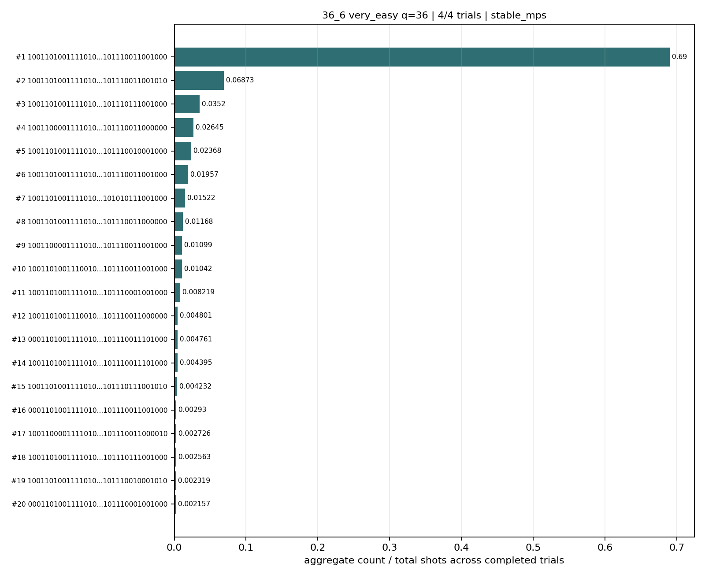
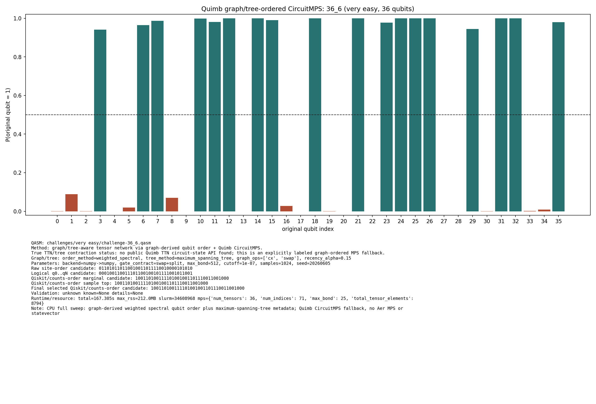

# Challenge 36_6

- Difficulty: very easy
- Qubits: 36
- QASM: `challenges/very easy/challenge-36_6.qasm`
- Central selected answer: `100110100111101001001101110011001000`
- Selected method: `quimb_cpu_all`
- Selected review: none
- Candidate rows: 40
- Method runs: 7
- Distribution figures: 2

## Selected Answer Sources

| source | selected answer | method | validation | status | evidence |
|---|---|---|---|---|---:|
| tree_tensor_sim_session | `100110100111101001001101110011001000` | quimb_cpu_all | unknown | selected | 1 |
| quantum_peak_session | `100110100111101001001101110011001000` | quimb_cpu_all | unknown | selected | 1 |

## Method Summary

| method | family | runs | statuses | best or marked candidate | rank_type | score | fraction | review | sources |
|---|---|---:|---|---|---|---:|---:|---|---|
| aer_mps_adaptive_sweep | mps | 1 | ok | `100110100111101001001101110011001000` | aggregate_candidate | 0.69002279 | 0.69002279 |  | mps_adaptive_sweep |
| algebraic_simplify_cxswap | heuristic | 1 | static_analysis | `000000000000000001000001000000001000` | static_heuristic |  |  |  | algebraic_simplify |
| algebraic_simplify_swaponly | heuristic | 1 | static_analysis | `000000000000000001000001000000001000` | static_heuristic |  |  |  | algebraic_simplify |
| collector_snapshot | collector | 2 | unknown | `100110100111101001001101110011001000` | collector_selected | 0.6884765625 | 0.6884765625 |  | quantum_peak_session,tree_tensor_sim_session |
| quimb_cpu_all | quimb | 2 | ok,unknown | `100110100111101001001101110011001000` | final_candidate | 0.4113534722678004 |  |  | quantum_peak_session,tree_tensor_sim_session |

## Method Selector

| first action | best method | best score | MPS | TNO | MPO-unswap |
|---|---|---:|---:|---:|---:|
| Low-bond MPS with bitstring distillation | Low-bond MPS with bitstring distillation | 90 | 90 | 65 | 45 |

## Distribution Figures

### Adaptive Aer MPS distribution: challenge-36_6.png

### Quimb graph-ordered MPS distribution: challenge-36_6.quimb_tree_graph_mps.png

## Candidate Rows

| review | selected | method | rank_type | rank | bitstring | score | count | support | fraction | validation | status | sources | source path | notes |
|---|---:|---|---|---:|---|---:|---:|---:|---:|---|---|---|---|---|
|  | 1 | collector_snapshot | collector_selected | 1 | `100110100111101001001101110011001000` | 0.6884765625 |  |  | 0.6884765625 | unknown | unknown | tree_tensor_sim_session | `research/tree_tensor_sim_session/artifacts/collector/CANDIDATES.tsv` | quimb_cpu_all |
|  | 1 | collector_snapshot | collector_selected | 1 | `100110100111101001001101110011001000` | 0.6884765625 |  |  | 0.6884765625 | unknown | unknown | quantum_peak_session | `research/quantum_peak_session/results/current_candidates/CANDIDATES.tsv` | quimb_cpu_all |
|  | 1 | quimb_cpu_all | final_candidate | 1 | `100110100111101001001101110011001000` | 0.4113534722678004 |  |  |  | {"known_answer_qiskit_order":null,"status":"unknown"} | ok | tree_tensor_sim_session | `../quantum-junction-tree-tensor/outputs/tree_tensor_sim/all_cpu/json/challenge-36_6.quimb_tree_graph_mps.json` | - |
|  | 1 | aer_mps_adaptive_sweep | aggregate_candidate | 1 | `100110100111101001001101110011001000` | 0.69002279 |  | 1 | 0.69002279 | stable_mps | ok | mps_adaptive_sweep | `agent_work/mps_adaptive_sweep/report/tables/mps_adaptive_summary.tsv` | aggregate_gap=10.0403; exact_match=False |
|  | 1 | quimb_cpu_all | marginal_candidate | 1 | `100110100111101001001101110011001000` | 0.4113534722678004 |  |  |  | {"known_answer_qiskit_order":null,"status":"unknown"} | ok | tree_tensor_sim_session | `../quantum-junction-tree-tensor/outputs/tree_tensor_sim/all_cpu/json/challenge-36_6.quimb_tree_graph_mps.json` | - |
|  | 1 | quimb_cpu_all | sample_top | 1 | `100110100111101001001101110011001000` | 0.6884765625 | 705 |  | 0.6884765625 | {"known_answer_qiskit_order":null,"status":"unknown"} | ok | tree_tensor_sim_session | `../quantum-junction-tree-tensor/outputs/tree_tensor_sim/all_cpu/json/challenge-36_6.quimb_tree_graph_mps.json` | - |
|  | 1 | aer_mps_adaptive_sweep | aggregate_top_counts | 1 | `100110100111101001001101110011001000` | 0.69002279 | 16958 |  | 0.69002279 |  | ok | mps_adaptive_sweep | `agent_work/mps_adaptive_sweep/report/tables/mps_adaptive_top_counts.tsv` |  |
|  | 1 | quimb_cpu_all | collector_evidence | 1 | `100110100111101001001101110011001000` | 0.6884765625 |  |  | 0.6884765625 | unknown | unknown | quantum_peak_session,tree_tensor_sim_session | `outputs/tree_tensor_sim/all_cpu/json/challenge-36_6.quimb_tree_graph_mps.json` | collector priority 80 |
|  | 0 | quimb_cpu_all | sample_top | 2 | `100110100111101001001101110011001010` | 0.0830078125 | 85 |  | 0.0830078125 | {"known_answer_qiskit_order":null,"status":"unknown"} | ok | tree_tensor_sim_session | `../quantum-junction-tree-tensor/outputs/tree_tensor_sim/all_cpu/json/challenge-36_6.quimb_tree_graph_mps.json` | - |
|  | 0 | quimb_cpu_all | sample_top | 3 | `100110100111101001001101110010001000` | 0.0322265625 | 33 |  | 0.0322265625 | {"known_answer_qiskit_order":null,"status":"unknown"} | ok | tree_tensor_sim_session | `../quantum-junction-tree-tensor/outputs/tree_tensor_sim/all_cpu/json/challenge-36_6.quimb_tree_graph_mps.json` | - |
|  | 0 | quimb_cpu_all | sample_top | 4 | `100110100111101001001101110111001000` | 0.029296875 | 30 |  | 0.029296875 | {"known_answer_qiskit_order":null,"status":"unknown"} | ok | tree_tensor_sim_session | `../quantum-junction-tree-tensor/outputs/tree_tensor_sim/all_cpu/json/challenge-36_6.quimb_tree_graph_mps.json` | - |
|  | 0 | quimb_cpu_all | sample_top | 5 | `100110000111101001001101110011000000` | 0.0283203125 | 29 |  | 0.0283203125 | {"known_answer_qiskit_order":null,"status":"unknown"} | ok | tree_tensor_sim_session | `../quantum-junction-tree-tensor/outputs/tree_tensor_sim/all_cpu/json/challenge-36_6.quimb_tree_graph_mps.json` | - |
|  | 0 | quimb_cpu_all | sample_top | 6 | `100110100111101001011101110011001000` | 0.0205078125 | 21 |  | 0.0205078125 | {"known_answer_qiskit_order":null,"status":"unknown"} | ok | tree_tensor_sim_session | `../quantum-junction-tree-tensor/outputs/tree_tensor_sim/all_cpu/json/challenge-36_6.quimb_tree_graph_mps.json` | - |
|  | 0 | quimb_cpu_all | sample_top | 7 | `100110100111101001001101010111001000` | 0.0126953125 | 13 |  | 0.0126953125 | {"known_answer_qiskit_order":null,"status":"unknown"} | ok | tree_tensor_sim_session | `../quantum-junction-tree-tensor/outputs/tree_tensor_sim/all_cpu/json/challenge-36_6.quimb_tree_graph_mps.json` | - |
|  | 0 | quimb_cpu_all | sample_top | 8 | `100110100111101001001101110011000000` | 0.0126953125 | 13 |  | 0.0126953125 | {"known_answer_qiskit_order":null,"status":"unknown"} | ok | tree_tensor_sim_session | `../quantum-junction-tree-tensor/outputs/tree_tensor_sim/all_cpu/json/challenge-36_6.quimb_tree_graph_mps.json` | - |
|  | 0 | quimb_cpu_all | sample_top | 9 | `100110000111101001001101110011001000` | 0.009765625 | 10 |  | 0.009765625 | {"known_answer_qiskit_order":null,"status":"unknown"} | ok | tree_tensor_sim_session | `../quantum-junction-tree-tensor/outputs/tree_tensor_sim/all_cpu/json/challenge-36_6.quimb_tree_graph_mps.json` | - |
|  | 0 | quimb_cpu_all | sample_top | 10 | `000110100111101001001101110011101000` | 0.0087890625 | 9 |  | 0.0087890625 | {"known_answer_qiskit_order":null,"status":"unknown"} | ok | tree_tensor_sim_session | `../quantum-junction-tree-tensor/outputs/tree_tensor_sim/all_cpu/json/challenge-36_6.quimb_tree_graph_mps.json` | - |
|  | 0 | quimb_cpu_all | sample_top | 11 | `100110100111001001001101110011001000` | 0.0078125 | 8 |  | 0.0078125 | {"known_answer_qiskit_order":null,"status":"unknown"} | ok | tree_tensor_sim_session | `../quantum-junction-tree-tensor/outputs/tree_tensor_sim/all_cpu/json/challenge-36_6.quimb_tree_graph_mps.json` | - |
|  | 0 | quimb_cpu_all | sample_top | 12 | `100110100111101001001101110011101000` | 0.0068359375 | 7 |  | 0.0068359375 | {"known_answer_qiskit_order":null,"status":"unknown"} | ok | tree_tensor_sim_session | `../quantum-junction-tree-tensor/outputs/tree_tensor_sim/all_cpu/json/challenge-36_6.quimb_tree_graph_mps.json` | - |
|  | 0 | aer_mps_adaptive_sweep | aggregate_top_counts | 2 | `100110100111101001001101110011001010` | 0.068725586 | 1689 |  | 0.068725586 |  | ok | mps_adaptive_sweep | `agent_work/mps_adaptive_sweep/report/tables/mps_adaptive_top_counts.tsv` |  |
|  | 0 | aer_mps_adaptive_sweep | aggregate_top_counts | 3 | `100110100111101001001101110111001000` | 0.03519694 | 865 |  | 0.03519694 |  | ok | mps_adaptive_sweep | `agent_work/mps_adaptive_sweep/report/tables/mps_adaptive_top_counts.tsv` |  |
|  | 0 | aer_mps_adaptive_sweep | aggregate_top_counts | 4 | `100110000111101001001101110011000000` | 0.026448568 | 650 |  | 0.026448568 |  | ok | mps_adaptive_sweep | `agent_work/mps_adaptive_sweep/report/tables/mps_adaptive_top_counts.tsv` |  |
|  | 0 | aer_mps_adaptive_sweep | aggregate_top_counts | 5 | `100110100111101001001101110010001000` | 0.023681641 | 582 |  | 0.023681641 |  | ok | mps_adaptive_sweep | `agent_work/mps_adaptive_sweep/report/tables/mps_adaptive_top_counts.tsv` |  |
|  | 0 | aer_mps_adaptive_sweep | aggregate_top_counts | 6 | `100110100111101001011101110011001000` | 0.01957194 | 481 |  | 0.01957194 |  | ok | mps_adaptive_sweep | `agent_work/mps_adaptive_sweep/report/tables/mps_adaptive_top_counts.tsv` |  |
|  | 0 | aer_mps_adaptive_sweep | aggregate_top_counts | 7 | `100110100111101001001101010111001000` | 0.015218099 | 374 |  | 0.015218099 |  | ok | mps_adaptive_sweep | `agent_work/mps_adaptive_sweep/report/tables/mps_adaptive_top_counts.tsv` |  |
|  | 0 | aer_mps_adaptive_sweep | aggregate_top_counts | 8 | `100110100111101001001101110011000000` | 0.01167806 | 287 |  | 0.01167806 |  | ok | mps_adaptive_sweep | `agent_work/mps_adaptive_sweep/report/tables/mps_adaptive_top_counts.tsv` |  |
|  | 0 | aer_mps_adaptive_sweep | aggregate_top_counts | 9 | `100110000111101001001101110011001000` | 0.010986328 | 270 |  | 0.010986328 |  | ok | mps_adaptive_sweep | `agent_work/mps_adaptive_sweep/report/tables/mps_adaptive_top_counts.tsv` |  |
|  | 0 | aer_mps_adaptive_sweep | aggregate_top_counts | 10 | `100110100111001001001101110011001000` | 0.010416667 | 256 |  | 0.010416667 |  | ok | mps_adaptive_sweep | `agent_work/mps_adaptive_sweep/report/tables/mps_adaptive_top_counts.tsv` |  |
|  | 0 | aer_mps_adaptive_sweep | aggregate_top_counts | 11 | `100110100111101001001101110001001000` | 0.008219401 | 202 |  | 0.008219401 |  | ok | mps_adaptive_sweep | `agent_work/mps_adaptive_sweep/report/tables/mps_adaptive_top_counts.tsv` |  |
|  | 0 | aer_mps_adaptive_sweep | aggregate_top_counts | 12 | `100110100111001001001101110011000000` | 0.0048014323 | 118 |  | 0.0048014323 |  | ok | mps_adaptive_sweep | `agent_work/mps_adaptive_sweep/report/tables/mps_adaptive_top_counts.tsv` |  |
|  | 0 | aer_mps_adaptive_sweep | aggregate_top_counts | 13 | `000110100111101001001101110011101000` | 0.0047607422 | 117 |  | 0.0047607422 |  | ok | mps_adaptive_sweep | `agent_work/mps_adaptive_sweep/report/tables/mps_adaptive_top_counts.tsv` |  |
|  | 0 | aer_mps_adaptive_sweep | aggregate_top_counts | 14 | `100110100111101001001101110011101000` | 0.0043945312 | 108 |  | 0.0043945312 |  | ok | mps_adaptive_sweep | `agent_work/mps_adaptive_sweep/report/tables/mps_adaptive_top_counts.tsv` |  |
|  | 0 | aer_mps_adaptive_sweep | aggregate_top_counts | 15 | `100110100111101001001101110111001010` | 0.0042317708 | 104 |  | 0.0042317708 |  | ok | mps_adaptive_sweep | `agent_work/mps_adaptive_sweep/report/tables/mps_adaptive_top_counts.tsv` |  |
|  | 0 | aer_mps_adaptive_sweep | aggregate_top_counts | 16 | `000110100111101001001101110011001000` | 0.0029296875 | 72 |  | 0.0029296875 |  | ok | mps_adaptive_sweep | `agent_work/mps_adaptive_sweep/report/tables/mps_adaptive_top_counts.tsv` |  |
|  | 0 | aer_mps_adaptive_sweep | aggregate_top_counts | 17 | `100110000111101001001101110011000010` | 0.002726237 | 67 |  | 0.002726237 |  | ok | mps_adaptive_sweep | `agent_work/mps_adaptive_sweep/report/tables/mps_adaptive_top_counts.tsv` |  |
|  | 0 | aer_mps_adaptive_sweep | aggregate_top_counts | 18 | `100110100111101001000101110111001000` | 0.0025634766 | 63 |  | 0.0025634766 |  | ok | mps_adaptive_sweep | `agent_work/mps_adaptive_sweep/report/tables/mps_adaptive_top_counts.tsv` |  |
|  | 0 | aer_mps_adaptive_sweep | aggregate_top_counts | 19 | `100110100111101001001101110010001010` | 0.0023193359 | 57 |  | 0.0023193359 |  | ok | mps_adaptive_sweep | `agent_work/mps_adaptive_sweep/report/tables/mps_adaptive_top_counts.tsv` |  |
|  | 0 | aer_mps_adaptive_sweep | aggregate_top_counts | 20 | `000110100111101001001101110001001000` | 0.0021565755 | 53 |  | 0.0021565755 |  | ok | mps_adaptive_sweep | `agent_work/mps_adaptive_sweep/report/tables/mps_adaptive_top_counts.tsv` |  |
|  | 0 | algebraic_simplify_cxswap | static_heuristic | 1 | `000000000000000001000001000000001000` |  |  |  |  | heuristic_only | heuristic | algebraic_simplify | `agent_work/algebraic_simplify/summary.csv` | exact_available_match= |
|  | 0 | algebraic_simplify_swaponly | static_heuristic | 1 | `000000000000000001000001000000001000` |  |  |  |  | heuristic_only | heuristic | algebraic_simplify | `agent_work/algebraic_simplify/summary.csv` | exact_available_match= |

## Method Runs

| method | run_id | status | backend | shots | max_bond | seconds | source path | notes |
|---|---|---|---|---:|---:|---:|---|---|
| aer_mps_adaptive_sweep | adaptive_sweep_aggregate | ok |  | 24576 | 64 |  | `agent_work/mps_adaptive_sweep/report/tables/mps_adaptive_summary.tsv` | classification=stable_mps; completed=4/4; exact_match=False; matches_previous=True; settings=cheap_check:4096/bd32x2; confirm:8192/bd64x2 |
| algebraic_simplify_cxswap | static_summary | static_analysis |  |  |  |  | `agent_work/algebraic_simplify/summary.csv` | linear_windows=71; snapped=35 |
| algebraic_simplify_swaponly | static_summary | static_analysis |  |  |  |  | `agent_work/algebraic_simplify/summary.csv` | linear_windows=71; snapped=35 |
| collector_snapshot | collector_selected:36_6 | unknown |  |  |  |  | `research/quantum_peak_session/results/current_candidates/CANDIDATES.tsv` | selected from quimb_cpu_all |
| collector_snapshot | collector_selected:36_6 | unknown |  |  |  |  | `research/tree_tensor_sim_session/artifacts/collector/CANDIDATES.tsv` | selected from quimb_cpu_all |
| quimb_cpu_all | challenge-36_6.quimb_tree_graph_mps | ok | numpy | 1024 | 512 | 167.304611640051 | `../quantum-junction-tree-tensor/outputs/tree_tensor_sim/all_cpu/json/challenge-36_6.quimb_tree_graph_mps.json` | graph_ordered_mps_fallback |
| quimb_cpu_all | collector_evidence:36_6:1 | unknown |  |  | 25 | 167.304611640051 | `outputs/tree_tensor_sim/all_cpu/json/challenge-36_6.quimb_tree_graph_mps.json` | collector priority 80 |
