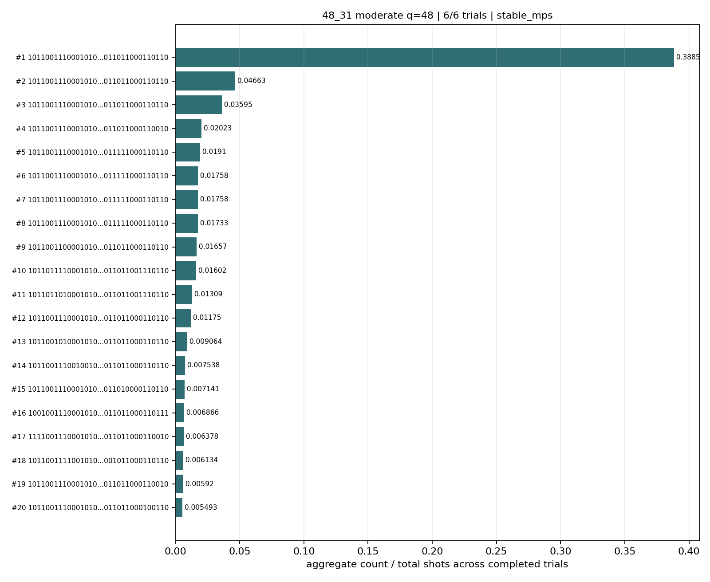
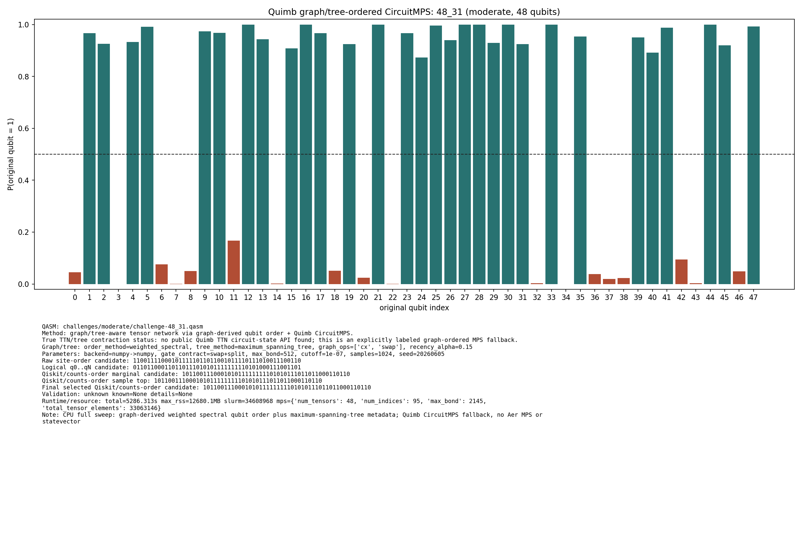
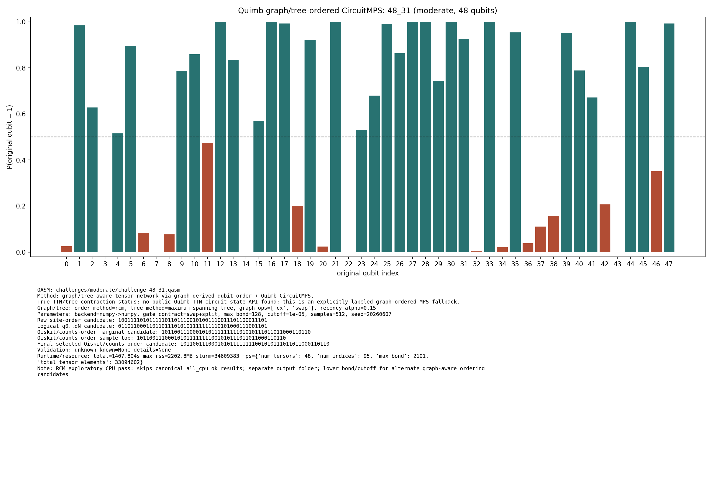

# Challenge 48_31

- Difficulty: moderate
- Qubits: 48
- QASM: `challenges/moderate/challenge-48_31.qasm`
- Central selected answer: `101100111000101011111111101010111011011000110110`
- Selected method: `quimb_cpu_all`
- Selected review: none
- Candidate rows: 115
- Method runs: 15
- Distribution figures: 3

## Selected Answer Sources

| source | selected answer | method | validation | status | evidence |
|---|---|---|---|---|---:|
| tree_tensor_sim_session | `101100111000101011111111101010111011011000110110` | quimb_cpu_all | unknown | selected | 2 |
| quantum_peak_session | `101100111000101011111111101010111011011000110110` | quimb_cpu_all | unknown | selected | 2 |

## Method Summary

| method | family | runs | statuses | best or marked candidate | rank_type | score | fraction | review | sources |
|---|---|---:|---|---|---|---:|---:|---|---|
| aer_mps_adaptive_sweep | mps | 1 | ok | `101100111000101011111111101010111011011000110110` | aggregate_candidate | 0.39159054 | 0.38851929 |  | mps_adaptive_sweep |
| aer_tree_mps_all | mps | 3 | ok | `101100111000101011111111101010111011011000110110` | sample_top | 0.3916015625 | 0.3916015625 |  | tree_tensor_sim_session |
| algebraic_simplify_cxswap | heuristic | 1 | static_analysis | `010110010001010001001000000010000000000001000000` | static_heuristic |  |  |  | algebraic_simplify |
| algebraic_simplify_swaponly | heuristic | 1 | static_analysis | `000110010001010001001000000000001000000001000100` | static_heuristic |  |  |  | algebraic_simplify |
| collector_snapshot | collector | 2 | unknown | `101100111000101011111111101010111011011000110110` | collector_selected | 0.4208984375 | 0.4208984375 |  | quantum_peak_session,tree_tensor_sim_session |
| quimb_cpu_all | quimb | 2 | ok,unknown | `101100111000101011111111101010111011011000110110` | final_candidate | 0.33241772808762493 |  |  | quantum_peak_session,tree_tensor_sim_session |
| quimb_fast_cpu | quimb | 1 | started |  |  |  |  |  | tree_tensor_sim_session |
| quimb_mst_cpu | quimb | 1 | started |  |  |  |  |  | tree_tensor_sim_session |
| quimb_rcm_cpu | quimb | 2 | ok,unknown | `101100111000101011111111101010111011011000110110` | marginal_candidate | 0.015306548549479326 |  |  | quantum_peak_session,tree_tensor_sim_session |
| tno_contract_core_cpu | tno | 1 | started |  |  |  |  |  | tno_contract_core_cpu |

## Method Selector

| first action | best method | best score | MPS | TNO | MPO-unswap |
|---|---|---:|---:|---:|---:|
| Low-bond MPS with bitstring distillation | Low-bond MPS with bitstring distillation | 86 | 86 | 53 | 35 |

## Distribution Figures

### Adaptive Aer MPS distribution: challenge-48_31.png

### Quimb graph-ordered MPS distribution: challenge-48_31.quimb_tree_graph_mps.png

### Quimb graph-ordered MPS distribution: challenge-48_31.quimb_tree_graph_mps.png

## Candidate Rows

| review | selected | method | rank_type | rank | bitstring | score | count | support | fraction | validation | status | sources | source path | notes |
|---|---:|---|---|---:|---|---:|---:|---:|---:|---|---|---|---|---|
|  | 1 | collector_snapshot | collector_selected | 1 | `101100111000101011111111101010111011011000110110` | 0.4208984375 |  |  | 0.4208984375 | unknown | unknown | tree_tensor_sim_session | `research/tree_tensor_sim_session/artifacts/collector/CANDIDATES.tsv` | quimb_cpu_all |
|  | 1 | collector_snapshot | collector_selected | 1 | `101100111000101011111111101010111011011000110110` | 0.4208984375 |  |  | 0.4208984375 | unknown | unknown | quantum_peak_session | `research/quantum_peak_session/results/current_candidates/CANDIDATES.tsv` | quimb_cpu_all |
|  | 1 | quimb_cpu_all | final_candidate | 1 | `101100111000101011111111101010111011011000110110` | 0.33241772808762493 |  |  |  | {"known_answer_qiskit_order":null,"status":"unknown"} | ok | tree_tensor_sim_session | `../quantum-junction-tree-tensor/outputs/tree_tensor_sim/all_cpu/json/challenge-48_31.quimb_tree_graph_mps.json` | - |
|  | 1 | aer_mps_adaptive_sweep | aggregate_candidate | 1 | `101100111000101011111111101010111011011000110110` | 0.39159054 |  | 1 | 0.38851929 | stable_mps | ok | mps_adaptive_sweep | `agent_work/mps_adaptive_sweep/report/tables/mps_adaptive_summary.tsv` | aggregate_gap=8.33181; exact_match=False |
|  | 1 | quimb_cpu_all | marginal_candidate | 1 | `101100111000101011111111101010111011011000110110` | 0.33241772808762493 |  |  |  | {"known_answer_qiskit_order":null,"status":"unknown"} | ok | tree_tensor_sim_session | `../quantum-junction-tree-tensor/outputs/tree_tensor_sim/all_cpu/json/challenge-48_31.quimb_tree_graph_mps.json` | - |
|  | 1 | quimb_rcm_cpu | marginal_candidate | 1 | `101100111000101011111111101010111011011000110110` | 0.015306548549479326 |  |  |  | {"known_answer_qiskit_order":null,"status":"unknown"} | ok | tree_tensor_sim_session | `../quantum-junction-tree-tensor/outputs/tree_tensor_sim/rcm_cpu/json/challenge-48_31.quimb_tree_graph_mps.json` | - |
|  | 1 | quimb_cpu_all | sample_top | 1 | `101100111000101011111111101010111011011000110110` | 0.4208984375 | 431 |  | 0.4208984375 | {"known_answer_qiskit_order":null,"status":"unknown"} | ok | tree_tensor_sim_session | `../quantum-junction-tree-tensor/outputs/tree_tensor_sim/all_cpu/json/challenge-48_31.quimb_tree_graph_mps.json` | - |
|  | 1 | quimb_rcm_cpu | sample_top | 4 | `101100111000101011111111101010111011011000110110` | 0.0078125 | 4 |  | 0.0078125 | {"known_answer_qiskit_order":null,"status":"unknown"} | ok | tree_tensor_sim_session | `../quantum-junction-tree-tensor/outputs/tree_tensor_sim/rcm_cpu/json/challenge-48_31.quimb_tree_graph_mps.json` | - |
|  | 1 | aer_tree_mps_all | sample_top | 12 | `101100111000101011111111101010111011011000110110` | 0.3916015625 | 3208 |  | 0.3916015625 |  | ok | tree_tensor_sim_session | `../quantum-junction-tree-tensor/outputs/tree_tensor_sim/all/json/challenge-48_31.tree_tensor_mps.json` | - |
|  | 1 | aer_tree_mps_all | sample_top | 14 | `101100111000101011111111101010111011011000110110` | 0.4466552734375 | 3659 |  | 0.4466552734375 |  | ok | tree_tensor_sim_session | `../quantum-junction-tree-tensor/outputs/tree_tensor_sim/all/json/challenge-48_31.tree_tensor_mps.json` | - |
|  | 1 | aer_tree_mps_all | sample_top | 16 | `101100111000101011111111101010111011011000110110` | 0.4720458984375 | 3867 |  | 0.4720458984375 |  | ok | tree_tensor_sim_session | `../quantum-junction-tree-tensor/outputs/tree_tensor_sim/all/json/challenge-48_31.tree_tensor_mps.json` | - |
|  | 1 | aer_mps_adaptive_sweep | aggregate_top_counts | 1 | `101100111000101011111111101010111011011000110110` | 0.39159054 | 12731 |  | 0.38851929 |  | ok | mps_adaptive_sweep | `agent_work/mps_adaptive_sweep/report/tables/mps_adaptive_top_counts.tsv` |  |
|  | 1 | quimb_cpu_all | collector_evidence | 1 | `101100111000101011111111101010111011011000110110` | 0.4208984375 |  |  | 0.4208984375 | unknown | unknown | quantum_peak_session,tree_tensor_sim_session | `outputs/tree_tensor_sim/all_cpu/json/challenge-48_31.quimb_tree_graph_mps.json` | collector priority 80 |
|  | 0 | quimb_rcm_cpu | final_candidate | 1 | `101100111000101011111111001010111011011000110110` | 0.015306548549479326 |  |  |  | {"known_answer_qiskit_order":null,"status":"unknown"} | ok | tree_tensor_sim_session | `../quantum-junction-tree-tensor/outputs/tree_tensor_sim/rcm_cpu/json/challenge-48_31.quimb_tree_graph_mps.json` | - |
|  | 0 | aer_tree_mps_all | sample_top | 1 | `100100111000101011111110101010011011011000110110` | 0.00634765625 | 52 |  | 0.00634765625 |  | ok | tree_tensor_sim_session | `../quantum-junction-tree-tensor/outputs/tree_tensor_sim/all/json/challenge-48_31.tree_tensor_mps.json` | - |
|  | 0 | aer_tree_mps_all | sample_top | 1 | `100100111000101011111111101010111011011000110100` | 0.0048828125 | 40 |  | 0.0048828125 |  | ok | tree_tensor_sim_session | `../quantum-junction-tree-tensor/outputs/tree_tensor_sim/all/json/challenge-48_31.tree_tensor_mps.json` | - |
|  | 0 | aer_tree_mps_all | sample_top | 1 | `101100110000101011111111101010111011011000110110` | 0.0140380859375 | 115 |  | 0.0140380859375 |  | ok | tree_tensor_sim_session | `../quantum-junction-tree-tensor/outputs/tree_tensor_sim/all/json/challenge-48_31.tree_tensor_mps.json` | - |
|  | 0 | quimb_rcm_cpu | sample_top | 1 | `101100111000101011111111001010111011011000110110` | 0.01171875 | 6 |  | 0.01171875 | {"known_answer_qiskit_order":null,"status":"unknown"} | ok | tree_tensor_sim_session | `../quantum-junction-tree-tensor/outputs/tree_tensor_sim/rcm_cpu/json/challenge-48_31.quimb_tree_graph_mps.json` | - |
|  | 0 | aer_tree_mps_all | sample_top | 2 | `100100111000101011111110101010111011011000110110` | 0.00634765625 | 52 |  | 0.00634765625 |  | ok | tree_tensor_sim_session | `../quantum-junction-tree-tensor/outputs/tree_tensor_sim/all/json/challenge-48_31.tree_tensor_mps.json` | - |
|  | 0 | aer_tree_mps_all | sample_top | 2 | `100100111000101011111111101010111011011000110111` | 0.006103515625 | 50 |  | 0.006103515625 |  | ok | tree_tensor_sim_session | `../quantum-junction-tree-tensor/outputs/tree_tensor_sim/all/json/challenge-48_31.tree_tensor_mps.json` | - |
|  | 0 | aer_tree_mps_all | sample_top | 2 | `101100111000101001111111101000111011111000110110` | 0.0164794921875 | 135 |  | 0.0164794921875 |  | ok | tree_tensor_sim_session | `../quantum-junction-tree-tensor/outputs/tree_tensor_sim/all/json/challenge-48_31.tree_tensor_mps.json` | - |
|  | 0 | quimb_cpu_all | sample_top | 2 | `101100111000101011111111101010110011011000110010` | 0.0244140625 | 25 |  | 0.0244140625 | {"known_answer_qiskit_order":null,"status":"unknown"} | ok | tree_tensor_sim_session | `../quantum-junction-tree-tensor/outputs/tree_tensor_sim/all_cpu/json/challenge-48_31.quimb_tree_graph_mps.json` | - |
|  | 0 | quimb_rcm_cpu | sample_top | 2 | `101100111000101011111111001010111011111000110110` | 0.0078125 | 4 |  | 0.0078125 | {"known_answer_qiskit_order":null,"status":"unknown"} | ok | tree_tensor_sim_session | `../quantum-junction-tree-tensor/outputs/tree_tensor_sim/rcm_cpu/json/challenge-48_31.quimb_tree_graph_mps.json` | - |
|  | 0 | aer_tree_mps_all | sample_top | 3 | `100100111000101011111111101010011011011000110100` | 0.0069580078125 | 57 |  | 0.0069580078125 |  | ok | tree_tensor_sim_session | `../quantum-junction-tree-tensor/outputs/tree_tensor_sim/all/json/challenge-48_31.tree_tensor_mps.json` | - |
|  | 0 | aer_tree_mps_all | sample_top | 3 | `101100101000101011111110101010111011011000110110` | 0.0064697265625 | 53 |  | 0.0064697265625 |  | ok | tree_tensor_sim_session | `../quantum-junction-tree-tensor/outputs/tree_tensor_sim/all/json/challenge-48_31.tree_tensor_mps.json` | - |
|  | 0 | aer_tree_mps_all | sample_top | 3 | `101100111000101001111111101010111011111000110110` | 0.0196533203125 | 161 |  | 0.0196533203125 |  | ok | tree_tensor_sim_session | `../quantum-junction-tree-tensor/outputs/tree_tensor_sim/all/json/challenge-48_31.tree_tensor_mps.json` | - |
|  | 0 | quimb_cpu_all | sample_top | 3 | `101100111000101011111111101000111011111000110110` | 0.021484375 | 22 |  | 0.021484375 | {"known_answer_qiskit_order":null,"status":"unknown"} | ok | tree_tensor_sim_session | `../quantum-junction-tree-tensor/outputs/tree_tensor_sim/all_cpu/json/challenge-48_31.quimb_tree_graph_mps.json` | - |
|  | 0 | quimb_rcm_cpu | sample_top | 3 | `101100111000101011111111101010111011111000110110` | 0.0078125 | 4 |  | 0.0078125 | {"known_answer_qiskit_order":null,"status":"unknown"} | ok | tree_tensor_sim_session | `../quantum-junction-tree-tensor/outputs/tree_tensor_sim/rcm_cpu/json/challenge-48_31.quimb_tree_graph_mps.json` | - |
|  | 0 | aer_tree_mps_all | sample_top | 4 | `100100111000101011111111101010111011011000110100` | 0.0064697265625 | 53 |  | 0.0064697265625 |  | ok | tree_tensor_sim_session | `../quantum-junction-tree-tensor/outputs/tree_tensor_sim/all/json/challenge-48_31.tree_tensor_mps.json` | - |
|  | 0 | aer_tree_mps_all | sample_top | 4 | `101100101000101011111111101010111011011000110110` | 0.0089111328125 | 73 |  | 0.0089111328125 |  | ok | tree_tensor_sim_session | `../quantum-junction-tree-tensor/outputs/tree_tensor_sim/all/json/challenge-48_31.tree_tensor_mps.json` | - |
|  | 0 | aer_tree_mps_all | sample_top | 4 | `101100111000101011011111101010111011011000110110` | 0.00634765625 | 52 |  | 0.00634765625 |  | ok | tree_tensor_sim_session | `../quantum-junction-tree-tensor/outputs/tree_tensor_sim/all/json/challenge-48_31.tree_tensor_mps.json` | - |
|  | 0 | quimb_cpu_all | sample_top | 4 | `101101111000101011111011101010111011011001110110` | 0.0205078125 | 21 |  | 0.0205078125 | {"known_answer_qiskit_order":null,"status":"unknown"} | ok | tree_tensor_sim_session | `../quantum-junction-tree-tensor/outputs/tree_tensor_sim/all_cpu/json/challenge-48_31.quimb_tree_graph_mps.json` | - |
|  | 0 | aer_tree_mps_all | sample_top | 5 | `100100111000101011111111101010111011011000110111` | 0.0079345703125 | 65 |  | 0.0079345703125 |  | ok | tree_tensor_sim_session | `../quantum-junction-tree-tensor/outputs/tree_tensor_sim/all/json/challenge-48_31.tree_tensor_mps.json` | - |
|  | 0 | aer_tree_mps_all | sample_top | 5 | `101100110000101011111111101010111011011000110110` | 0.01611328125 | 132 |  | 0.01611328125 |  | ok | tree_tensor_sim_session | `../quantum-junction-tree-tensor/outputs/tree_tensor_sim/all/json/challenge-48_31.tree_tensor_mps.json` | - |
|  | 0 | aer_tree_mps_all | sample_top | 5 | `101100111000101011111011101010111011011000110110` | 0.0084228515625 | 69 |  | 0.0084228515625 |  | ok | tree_tensor_sim_session | `../quantum-junction-tree-tensor/outputs/tree_tensor_sim/all/json/challenge-48_31.tree_tensor_mps.json` | - |
|  | 0 | quimb_cpu_all | sample_top | 5 | `101100111000101001111111101010111011111000110110` | 0.01953125 | 20 |  | 0.01953125 | {"known_answer_qiskit_order":null,"status":"unknown"} | ok | tree_tensor_sim_session | `../quantum-junction-tree-tensor/outputs/tree_tensor_sim/all_cpu/json/challenge-48_31.quimb_tree_graph_mps.json` | - |
|  | 0 | quimb_rcm_cpu | sample_top | 5 | `110100111000101011111111101010110011111000100110` | 0.005859375 | 3 |  | 0.005859375 | {"known_answer_qiskit_order":null,"status":"unknown"} | ok | tree_tensor_sim_session | `../quantum-junction-tree-tensor/outputs/tree_tensor_sim/rcm_cpu/json/challenge-48_31.quimb_tree_graph_mps.json` | - |
|  | 0 | aer_tree_mps_all | sample_top | 6 | `101100101000101011111111101010111011011000110110` | 0.0101318359375 | 83 |  | 0.0101318359375 |  | ok | tree_tensor_sim_session | `../quantum-junction-tree-tensor/outputs/tree_tensor_sim/all/json/challenge-48_31.tree_tensor_mps.json` | - |
|  | 0 | aer_tree_mps_all | sample_top | 6 | `101100111000101001111111101000111011111000110110` | 0.0208740234375 | 171 |  | 0.0208740234375 |  | ok | tree_tensor_sim_session | `../quantum-junction-tree-tensor/outputs/tree_tensor_sim/all/json/challenge-48_31.tree_tensor_mps.json` | - |
|  | 0 | aer_tree_mps_all | sample_top | 6 | `101100111000101011111110101010111011011000110110` | 0.034912109375 | 286 |  | 0.034912109375 |  | ok | tree_tensor_sim_session | `../quantum-junction-tree-tensor/outputs/tree_tensor_sim/all/json/challenge-48_31.tree_tensor_mps.json` | - |
|  | 0 | quimb_cpu_all | sample_top | 6 | `101100111000101001111111101000111011111000110110` | 0.017578125 | 18 |  | 0.017578125 | {"known_answer_qiskit_order":null,"status":"unknown"} | ok | tree_tensor_sim_session | `../quantum-junction-tree-tensor/outputs/tree_tensor_sim/all_cpu/json/challenge-48_31.quimb_tree_graph_mps.json` | - |
|  | 0 | quimb_rcm_cpu | sample_top | 6 | `101100111000101011111111001010110011011000110010` | 0.005859375 | 3 |  | 0.005859375 | {"known_answer_qiskit_order":null,"status":"unknown"} | ok | tree_tensor_sim_session | `../quantum-junction-tree-tensor/outputs/tree_tensor_sim/rcm_cpu/json/challenge-48_31.quimb_tree_graph_mps.json` | - |
|  | 0 | aer_tree_mps_all | sample_top | 7 | `101100110000101011111111101010111011011000110110` | 0.0172119140625 | 141 |  | 0.0172119140625 |  | ok | tree_tensor_sim_session | `../quantum-junction-tree-tensor/outputs/tree_tensor_sim/all/json/challenge-48_31.tree_tensor_mps.json` | - |
|  | 0 | aer_tree_mps_all | sample_top | 7 | `101100111000101001111111101010111011111000110110` | 0.02099609375 | 172 |  | 0.02099609375 |  | ok | tree_tensor_sim_session | `../quantum-junction-tree-tensor/outputs/tree_tensor_sim/all/json/challenge-48_31.tree_tensor_mps.json` | - |
|  | 0 | aer_tree_mps_all | sample_top | 7 | `101100111000101011111111001010111011011000110110` | 0.0062255859375 | 51 |  | 0.0062255859375 |  | ok | tree_tensor_sim_session | `../quantum-junction-tree-tensor/outputs/tree_tensor_sim/all/json/challenge-48_31.tree_tensor_mps.json` | - |
|  | 0 | quimb_cpu_all | sample_top | 7 | `101101101000101011111111101010111011011001110110` | 0.015625 | 16 |  | 0.015625 | {"known_answer_qiskit_order":null,"status":"unknown"} | ok | tree_tensor_sim_session | `../quantum-junction-tree-tensor/outputs/tree_tensor_sim/all_cpu/json/challenge-48_31.quimb_tree_graph_mps.json` | - |
|  | 0 | quimb_rcm_cpu | sample_top | 7 | `101100011000101011111111001010110011110000100110` | 0.005859375 | 3 |  | 0.005859375 | {"known_answer_qiskit_order":null,"status":"unknown"} | ok | tree_tensor_sim_session | `../quantum-junction-tree-tensor/outputs/tree_tensor_sim/rcm_cpu/json/challenge-48_31.quimb_tree_graph_mps.json` | - |
|  | 0 | aer_tree_mps_all | sample_top | 8 | `101100111000101001111111101000111011111000110110` | 0.022216796875 | 182 |  | 0.022216796875 |  | ok | tree_tensor_sim_session | `../quantum-junction-tree-tensor/outputs/tree_tensor_sim/all/json/challenge-48_31.tree_tensor_mps.json` | - |
|  | 0 | aer_tree_mps_all | sample_top | 8 | `101100111000101011111011101010111011011000110110` | 0.0115966796875 | 95 |  | 0.0115966796875 |  | ok | tree_tensor_sim_session | `../quantum-junction-tree-tensor/outputs/tree_tensor_sim/all/json/challenge-48_31.tree_tensor_mps.json` | - |
|  | 0 | aer_tree_mps_all | sample_top | 8 | `101100111000101011111111101000111011111000110110` | 0.01513671875 | 124 |  | 0.01513671875 |  | ok | tree_tensor_sim_session | `../quantum-junction-tree-tensor/outputs/tree_tensor_sim/all/json/challenge-48_31.tree_tensor_mps.json` | - |
|  | 0 | quimb_cpu_all | sample_top | 8 | `101100111000101011111110101010111011011000110110` | 0.015625 | 16 |  | 0.015625 | {"known_answer_qiskit_order":null,"status":"unknown"} | ok | tree_tensor_sim_session | `../quantum-junction-tree-tensor/outputs/tree_tensor_sim/all_cpu/json/challenge-48_31.quimb_tree_graph_mps.json` | - |
|  | 0 | quimb_rcm_cpu | sample_top | 8 | `101100111000101011111111101010111011011000100110` | 0.005859375 | 3 |  | 0.005859375 | {"known_answer_qiskit_order":null,"status":"unknown"} | ok | tree_tensor_sim_session | `../quantum-junction-tree-tensor/outputs/tree_tensor_sim/rcm_cpu/json/challenge-48_31.quimb_tree_graph_mps.json` | - |
|  | 0 | aer_tree_mps_all | sample_top | 9 | `101100111000101001111111101010111011111000110110` | 0.0179443359375 | 147 |  | 0.0179443359375 |  | ok | tree_tensor_sim_session | `../quantum-junction-tree-tensor/outputs/tree_tensor_sim/all/json/challenge-48_31.tree_tensor_mps.json` | - |
|  | 0 | aer_tree_mps_all | sample_top | 9 | `101100111000101011111110101010111011011000110110` | 0.055908203125 | 458 |  | 0.055908203125 |  | ok | tree_tensor_sim_session | `../quantum-junction-tree-tensor/outputs/tree_tensor_sim/all/json/challenge-48_31.tree_tensor_mps.json` | - |
|  | 0 | aer_tree_mps_all | sample_top | 9 | `101100111000101011111111101010110011011000110010` | 0.014404296875 | 118 |  | 0.014404296875 |  | ok | tree_tensor_sim_session | `../quantum-junction-tree-tensor/outputs/tree_tensor_sim/all/json/challenge-48_31.tree_tensor_mps.json` | - |
|  | 0 | quimb_cpu_all | sample_top | 9 | `101100111000101011111111101010111011111000110110` | 0.015625 | 16 |  | 0.015625 | {"known_answer_qiskit_order":null,"status":"unknown"} | ok | tree_tensor_sim_session | `../quantum-junction-tree-tensor/outputs/tree_tensor_sim/all_cpu/json/challenge-48_31.quimb_tree_graph_mps.json` | - |
|  | 0 | quimb_rcm_cpu | sample_top | 9 | `110101011000101011111111101010110011011000110110` | 0.00390625 | 2 |  | 0.00390625 | {"known_answer_qiskit_order":null,"status":"unknown"} | ok | tree_tensor_sim_session | `../quantum-junction-tree-tensor/outputs/tree_tensor_sim/rcm_cpu/json/challenge-48_31.quimb_tree_graph_mps.json` | - |
|  | 0 | aer_tree_mps_all | sample_top | 10 | `101100111000101011111011101010111011011000110110` | 0.0120849609375 | 99 |  | 0.0120849609375 |  | ok | tree_tensor_sim_session | `../quantum-junction-tree-tensor/outputs/tree_tensor_sim/all/json/challenge-48_31.tree_tensor_mps.json` | - |
|  | 0 | aer_tree_mps_all | sample_top | 10 | `101100111000101011111111001010111011011000110110` | 0.0133056640625 | 109 |  | 0.0133056640625 |  | ok | tree_tensor_sim_session | `../quantum-junction-tree-tensor/outputs/tree_tensor_sim/all/json/challenge-48_31.tree_tensor_mps.json` | - |
|  | 0 | aer_tree_mps_all | sample_top | 10 | `101100111000101011111111101010111011011000100110` | 0.0078125 | 64 |  | 0.0078125 |  | ok | tree_tensor_sim_session | `../quantum-junction-tree-tensor/outputs/tree_tensor_sim/all/json/challenge-48_31.tree_tensor_mps.json` | - |
|  | 0 | quimb_cpu_all | sample_top | 10 | `101100111000101011111111101010111011011100110110` | 0.0126953125 | 13 |  | 0.0126953125 | {"known_answer_qiskit_order":null,"status":"unknown"} | ok | tree_tensor_sim_session | `../quantum-junction-tree-tensor/outputs/tree_tensor_sim/all_cpu/json/challenge-48_31.quimb_tree_graph_mps.json` | - |
|  | 0 | quimb_rcm_cpu | sample_top | 10 | `111100111000101011111111101010111011011000110110` | 0.00390625 | 2 |  | 0.00390625 | {"known_answer_qiskit_order":null,"status":"unknown"} | ok | tree_tensor_sim_session | `../quantum-junction-tree-tensor/outputs/tree_tensor_sim/rcm_cpu/json/challenge-48_31.quimb_tree_graph_mps.json` | - |
|  | 0 | aer_tree_mps_all | sample_top | 11 | `101100111000101011111110101010111011001000110110` | 0.0068359375 | 56 |  | 0.0068359375 |  | ok | tree_tensor_sim_session | `../quantum-junction-tree-tensor/outputs/tree_tensor_sim/all/json/challenge-48_31.tree_tensor_mps.json` | - |
|  | 0 | aer_tree_mps_all | sample_top | 11 | `101100111000101011111111101000111011111000110110` | 0.0179443359375 | 147 |  | 0.0179443359375 |  | ok | tree_tensor_sim_session | `../quantum-junction-tree-tensor/outputs/tree_tensor_sim/all/json/challenge-48_31.tree_tensor_mps.json` | - |
|  | 0 | aer_tree_mps_all | sample_top | 11 | `101100111000101011111111101010111011011000110010` | 0.0084228515625 | 69 |  | 0.0084228515625 |  | ok | tree_tensor_sim_session | `../quantum-junction-tree-tensor/outputs/tree_tensor_sim/all/json/challenge-48_31.tree_tensor_mps.json` | - |
|  | 0 | quimb_cpu_all | sample_top | 11 | `101100111001001011111111101110111011011000110110` | 0.01171875 | 12 |  | 0.01171875 | {"known_answer_qiskit_order":null,"status":"unknown"} | ok | tree_tensor_sim_session | `../quantum-junction-tree-tensor/outputs/tree_tensor_sim/all_cpu/json/challenge-48_31.quimb_tree_graph_mps.json` | - |
|  | 0 | quimb_rcm_cpu | sample_top | 11 | `111100111000101011111111101010111011011000110010` | 0.00390625 | 2 |  | 0.00390625 | {"known_answer_qiskit_order":null,"status":"unknown"} | ok | tree_tensor_sim_session | `../quantum-junction-tree-tensor/outputs/tree_tensor_sim/rcm_cpu/json/challenge-48_31.quimb_tree_graph_mps.json` | - |
|  | 0 | aer_tree_mps_all | sample_top | 12 | `101100111000101011111110101010111011011000110110` | 0.016357421875 | 134 |  | 0.016357421875 |  | ok | tree_tensor_sim_session | `../quantum-junction-tree-tensor/outputs/tree_tensor_sim/all/json/challenge-48_31.tree_tensor_mps.json` | - |
|  | 0 | aer_tree_mps_all | sample_top | 12 | `101100111000101011111111101010110011011000110010` | 0.0240478515625 | 197 |  | 0.0240478515625 |  | ok | tree_tensor_sim_session | `../quantum-junction-tree-tensor/outputs/tree_tensor_sim/all/json/challenge-48_31.tree_tensor_mps.json` | - |
|  | 0 | quimb_cpu_all | sample_top | 12 | `101100111000101011111011101010111011011000110110` | 0.0107421875 | 11 |  | 0.0107421875 | {"known_answer_qiskit_order":null,"status":"unknown"} | ok | tree_tensor_sim_session | `../quantum-junction-tree-tensor/outputs/tree_tensor_sim/all_cpu/json/challenge-48_31.quimb_tree_graph_mps.json` | - |
|  | 0 | quimb_rcm_cpu | sample_top | 12 | `101101111010101011111111101010110011111000110010` | 0.00390625 | 2 |  | 0.00390625 | {"known_answer_qiskit_order":null,"status":"unknown"} | ok | tree_tensor_sim_session | `../quantum-junction-tree-tensor/outputs/tree_tensor_sim/rcm_cpu/json/challenge-48_31.quimb_tree_graph_mps.json` | - |
|  | 0 | aer_tree_mps_all | sample_top | 13 | `101100111000101011111110101011111011011000110110` | 0.00732421875 | 60 |  | 0.00732421875 |  | ok | tree_tensor_sim_session | `../quantum-junction-tree-tensor/outputs/tree_tensor_sim/all/json/challenge-48_31.tree_tensor_mps.json` | - |
|  | 0 | aer_tree_mps_all | sample_top | 13 | `101100111000101011111111101010111011011000100110` | 0.005615234375 | 46 |  | 0.005615234375 |  | ok | tree_tensor_sim_session | `../quantum-junction-tree-tensor/outputs/tree_tensor_sim/all/json/challenge-48_31.tree_tensor_mps.json` | - |
|  | 0 | aer_tree_mps_all | sample_top | 13 | `101100111000101011111111101010111011111000110110` | 0.017578125 | 144 |  | 0.017578125 |  | ok | tree_tensor_sim_session | `../quantum-junction-tree-tensor/outputs/tree_tensor_sim/all/json/challenge-48_31.tree_tensor_mps.json` | - |
|  | 0 | aer_tree_mps_all | sample_top | 14 | `101100111000101011111111101000111011111000110110` | 0.020263671875 | 166 |  | 0.020263671875 |  | ok | tree_tensor_sim_session | `../quantum-junction-tree-tensor/outputs/tree_tensor_sim/all/json/challenge-48_31.tree_tensor_mps.json` | - |
|  | 0 | aer_tree_mps_all | sample_top | 14 | `101100111001001011111111101010111011011000110110` | 0.008544921875 | 70 |  | 0.008544921875 |  | ok | tree_tensor_sim_session | `../quantum-junction-tree-tensor/outputs/tree_tensor_sim/all/json/challenge-48_31.tree_tensor_mps.json` | - |
|  | 0 | aer_tree_mps_all | sample_top | 15 | `101100111000101011111111101010110011011000110010` | 0.0224609375 | 184 |  | 0.0224609375 |  | ok | tree_tensor_sim_session | `../quantum-junction-tree-tensor/outputs/tree_tensor_sim/all/json/challenge-48_31.tree_tensor_mps.json` | - |
|  | 0 | aer_tree_mps_all | sample_top | 15 | `101100111000101011111111101010111011111000110110` | 0.013916015625 | 114 |  | 0.013916015625 |  | ok | tree_tensor_sim_session | `../quantum-junction-tree-tensor/outputs/tree_tensor_sim/all/json/challenge-48_31.tree_tensor_mps.json` | - |
|  | 0 | aer_tree_mps_all | sample_top | 15 | `101100111100101011111111101010111001011000110110` | 0.0068359375 | 56 |  | 0.0068359375 |  | ok | tree_tensor_sim_session | `../quantum-junction-tree-tensor/outputs/tree_tensor_sim/all/json/challenge-48_31.tree_tensor_mps.json` | - |
|  | 0 | aer_tree_mps_all | sample_top | 16 | `101100111001001011111111101010111011011000110110` | 0.0067138671875 | 55 |  | 0.0067138671875 |  | ok | tree_tensor_sim_session | `../quantum-junction-tree-tensor/outputs/tree_tensor_sim/all/json/challenge-48_31.tree_tensor_mps.json` | - |
|  | 0 | aer_tree_mps_all | sample_top | 16 | `101101011000101011111111101010111011011000110110` | 0.014404296875 | 118 |  | 0.014404296875 |  | ok | tree_tensor_sim_session | `../quantum-junction-tree-tensor/outputs/tree_tensor_sim/all/json/challenge-48_31.tree_tensor_mps.json` | - |
|  | 0 | aer_tree_mps_all | sample_top | 17 | `101100111000101011111111101010111011111000110110` | 0.0184326171875 | 151 |  | 0.0184326171875 |  | ok | tree_tensor_sim_session | `../quantum-junction-tree-tensor/outputs/tree_tensor_sim/all/json/challenge-48_31.tree_tensor_mps.json` | - |
|  | 0 | aer_tree_mps_all | sample_top | 17 | `101101011000101011111111101010111011011000110110` | 0.00830078125 | 68 |  | 0.00830078125 |  | ok | tree_tensor_sim_session | `../quantum-junction-tree-tensor/outputs/tree_tensor_sim/all/json/challenge-48_31.tree_tensor_mps.json` | - |
|  | 0 | aer_tree_mps_all | sample_top | 17 | `101101101000101011111111101010111011011001110110` | 0.0120849609375 | 99 |  | 0.0120849609375 |  | ok | tree_tensor_sim_session | `../quantum-junction-tree-tensor/outputs/tree_tensor_sim/all/json/challenge-48_31.tree_tensor_mps.json` | - |
|  | 0 | aer_tree_mps_all | sample_top | 18 | `101100111001001011111111101010111011011000110110` | 0.00927734375 | 76 |  | 0.00927734375 |  | ok | tree_tensor_sim_session | `../quantum-junction-tree-tensor/outputs/tree_tensor_sim/all/json/challenge-48_31.tree_tensor_mps.json` | - |
|  | 0 | aer_tree_mps_all | sample_top | 18 | `101101101000101011111111101010111011011001110110` | 0.013916015625 | 114 |  | 0.013916015625 |  | ok | tree_tensor_sim_session | `../quantum-junction-tree-tensor/outputs/tree_tensor_sim/all/json/challenge-48_31.tree_tensor_mps.json` | - |
|  | 0 | aer_tree_mps_all | sample_top | 18 | `101101111000101011111011101010111011011001110110` | 0.01318359375 | 108 |  | 0.01318359375 |  | ok | tree_tensor_sim_session | `../quantum-junction-tree-tensor/outputs/tree_tensor_sim/all/json/challenge-48_31.tree_tensor_mps.json` | - |
|  | 0 | aer_tree_mps_all | sample_top | 19 | `101101101000101011111111101010111011011001110110` | 0.014892578125 | 122 |  | 0.014892578125 |  | ok | tree_tensor_sim_session | `../quantum-junction-tree-tensor/outputs/tree_tensor_sim/all/json/challenge-48_31.tree_tensor_mps.json` | - |
|  | 0 | aer_tree_mps_all | sample_top | 19 | `101101111000101011111011101010111011011001110110` | 0.01708984375 | 140 |  | 0.01708984375 |  | ok | tree_tensor_sim_session | `../quantum-junction-tree-tensor/outputs/tree_tensor_sim/all/json/challenge-48_31.tree_tensor_mps.json` | - |
|  | 0 | aer_tree_mps_all | sample_top | 19 | `111100111000101011111111101010111011011000110010` | 0.010986328125 | 90 |  | 0.010986328125 |  | ok | tree_tensor_sim_session | `../quantum-junction-tree-tensor/outputs/tree_tensor_sim/all/json/challenge-48_31.tree_tensor_mps.json` | - |
|  | 0 | aer_tree_mps_all | sample_top | 20 | `101101111000101011111011101010111011011001110110` | 0.020263671875 | 166 |  | 0.020263671875 |  | ok | tree_tensor_sim_session | `../quantum-junction-tree-tensor/outputs/tree_tensor_sim/all/json/challenge-48_31.tree_tensor_mps.json` | - |
|  | 0 | aer_tree_mps_all | sample_top | 20 | `111100111000101011111111101010111011011000110010` | 0.0087890625 | 72 |  | 0.0087890625 |  | ok | tree_tensor_sim_session | `../quantum-junction-tree-tensor/outputs/tree_tensor_sim/all/json/challenge-48_31.tree_tensor_mps.json` | - |
|  | 0 | aer_tree_mps_all | sample_top | 20 | `111100111000101011111111101010111011011000110110` | 0.0057373046875 | 47 |  | 0.0057373046875 |  | ok | tree_tensor_sim_session | `../quantum-junction-tree-tensor/outputs/tree_tensor_sim/all/json/challenge-48_31.tree_tensor_mps.json` | - |
|  | 0 | aer_mps_adaptive_sweep | aggregate_top_counts | 2 | `101100111000101011111110101010111011011000110110` | 0.046999477 | 1528 |  | 0.046630859 |  | ok | mps_adaptive_sweep | `agent_work/mps_adaptive_sweep/report/tables/mps_adaptive_top_counts.tsv` |  |
|  | 0 | aer_mps_adaptive_sweep | aggregate_top_counts | 3 | `101100111000101011111111101110111011011000110110` | 0.03623389 | 1178 |  | 0.035949707 |  | ok | mps_adaptive_sweep | `agent_work/mps_adaptive_sweep/report/tables/mps_adaptive_top_counts.tsv` |  |
|  | 0 | aer_mps_adaptive_sweep | aggregate_top_counts | 4 | `101100111000101011111111101010110011011000110010` | 0.020393098 | 663 |  | 0.020233154 |  | ok | mps_adaptive_sweep | `agent_work/mps_adaptive_sweep/report/tables/mps_adaptive_top_counts.tsv` |  |
|  | 0 | aer_mps_adaptive_sweep | aggregate_top_counts | 5 | `101100111000101001111111101000111011111000110110` | 0.019255021 | 626 |  | 0.019104004 |  | ok | mps_adaptive_sweep | `agent_work/mps_adaptive_sweep/report/tables/mps_adaptive_top_counts.tsv` |  |
|  | 0 | aer_mps_adaptive_sweep | aggregate_top_counts | 6 | `101100111000101001111111101010111011111000110110` | 0.01771708 | 576 |  | 0.017578125 |  | ok | mps_adaptive_sweep | `agent_work/mps_adaptive_sweep/report/tables/mps_adaptive_top_counts.tsv` |  |
|  | 0 | aer_mps_adaptive_sweep | aggregate_top_counts | 7 | `101100111000101011111111101010111011111000110110` | 0.01771708 | 576 |  | 0.017578125 |  | ok | mps_adaptive_sweep | `agent_work/mps_adaptive_sweep/report/tables/mps_adaptive_top_counts.tsv` |  |
|  | 0 | aer_mps_adaptive_sweep | aggregate_top_counts | 8 | `101100111000101011111111101000111011111000110110` | 0.01747101 | 568 |  | 0.017333984 |  | ok | mps_adaptive_sweep | `agent_work/mps_adaptive_sweep/report/tables/mps_adaptive_top_counts.tsv` |  |
|  | 0 | aer_mps_adaptive_sweep | aggregate_top_counts | 9 | `101100110000101011111111101010111011011000110110` | 0.016702039 | 543 |  | 0.016571045 |  | ok | mps_adaptive_sweep | `agent_work/mps_adaptive_sweep/report/tables/mps_adaptive_top_counts.tsv` |  |
|  | 0 | aer_mps_adaptive_sweep | aggregate_top_counts | 10 | `101101111000101011111011101010111011011001110110` | 0.016148381 | 525 |  | 0.016021729 |  | ok | mps_adaptive_sweep | `agent_work/mps_adaptive_sweep/report/tables/mps_adaptive_top_counts.tsv` |  |
|  | 0 | aer_mps_adaptive_sweep | aggregate_top_counts | 11 | `101101101000101011111111101010111011011001110110` | 0.013195534 | 429 |  | 0.013092041 |  | ok | mps_adaptive_sweep | `agent_work/mps_adaptive_sweep/report/tables/mps_adaptive_top_counts.tsv` |  |
|  | 0 | aer_mps_adaptive_sweep | aggregate_top_counts | 12 | `101100111000101011111011101010111011011000110110` | 0.011842146 | 385 |  | 0.011749268 |  | ok | mps_adaptive_sweep | `agent_work/mps_adaptive_sweep/report/tables/mps_adaptive_top_counts.tsv` |  |
|  | 0 | aer_mps_adaptive_sweep | aggregate_top_counts | 13 | `101100101000101011111111101010111011011000110110` | 0.0091353696 | 297 |  | 0.0090637207 |  | ok | mps_adaptive_sweep | `agent_work/mps_adaptive_sweep/report/tables/mps_adaptive_top_counts.tsv` |  |
|  | 0 | aer_mps_adaptive_sweep | aggregate_top_counts | 14 | `101100111001001011111111101010111011011000110110` | 0.0075974286 | 247 |  | 0.0075378418 |  | ok | mps_adaptive_sweep | `agent_work/mps_adaptive_sweep/report/tables/mps_adaptive_top_counts.tsv` |  |
|  | 0 | aer_mps_adaptive_sweep | aggregate_top_counts | 15 | `101100111000101011111111101010111011010000110110` | 0.0071975639 | 234 |  | 0.0071411133 |  | ok | mps_adaptive_sweep | `agent_work/mps_adaptive_sweep/report/tables/mps_adaptive_top_counts.tsv` |  |
|  | 0 | aer_mps_adaptive_sweep | aggregate_top_counts | 16 | `100100111000101011111111101010111011011000110111` | 0.0069207345 | 225 |  | 0.0068664551 |  | ok | mps_adaptive_sweep | `agent_work/mps_adaptive_sweep/report/tables/mps_adaptive_top_counts.tsv` |  |
|  | 0 | aer_mps_adaptive_sweep | aggregate_top_counts | 17 | `111100111000101011111111101010111011011000110010` | 0.0064285934 | 209 |  | 0.0063781738 |  | ok | mps_adaptive_sweep | `agent_work/mps_adaptive_sweep/report/tables/mps_adaptive_top_counts.tsv` |  |
|  | 0 | aer_mps_adaptive_sweep | aggregate_top_counts | 18 | `101100111100101011111111101010111001011000110110` | 0.0061825228 | 201 |  | 0.0061340332 |  | ok | mps_adaptive_sweep | `agent_work/mps_adaptive_sweep/report/tables/mps_adaptive_top_counts.tsv` |  |
|  | 0 | aer_mps_adaptive_sweep | aggregate_top_counts | 19 | `101100111000101011111111101010111011011000110010` | 0.0059672111 | 194 |  | 0.0059204102 |  | ok | mps_adaptive_sweep | `agent_work/mps_adaptive_sweep/report/tables/mps_adaptive_top_counts.tsv` |  |
|  | 0 | aer_mps_adaptive_sweep | aggregate_top_counts | 20 | `101100111000101011111111101010111011011000100110` | 0.0055365876 | 180 |  | 0.0054931641 |  | ok | mps_adaptive_sweep | `agent_work/mps_adaptive_sweep/report/tables/mps_adaptive_top_counts.tsv` |  |
|  | 0 | algebraic_simplify_cxswap | static_heuristic | 1 | `010110010001010001001000000010000000000001000000` |  |  |  |  | heuristic_only | heuristic | algebraic_simplify | `agent_work/algebraic_simplify/summary.csv` | exact_available_match= |
|  | 0 | algebraic_simplify_swaponly | static_heuristic | 1 | `000110010001010001001000000000001000000001000100` |  |  |  |  | heuristic_only | heuristic | algebraic_simplify | `agent_work/algebraic_simplify/summary.csv` | exact_available_match= |
|  | 0 | quimb_rcm_cpu | collector_evidence | 2 | `101100111000101011111111001010111011011000110110` | 0.01171875 |  |  | 0.01171875 | unknown | unknown | quantum_peak_session,tree_tensor_sim_session | `outputs/tree_tensor_sim/rcm_cpu/json/challenge-48_31.quimb_tree_graph_mps.json` | collector priority 55 |

## Method Runs

| method | run_id | status | backend | shots | max_bond | seconds | source path | notes |
|---|---|---|---|---:|---:|---:|---|---|
| aer_mps_adaptive_sweep | adaptive_sweep_aggregate | ok |  | 32768 | 128 |  | `agent_work/mps_adaptive_sweep/report/tables/mps_adaptive_summary.tsv` | classification=stable_mps; completed=6/6; exact_match=False; matches_previous=True; settings=baseline:4096/bd64x2; bond_probe:4096/bd128x2; more_shots:8192/bd64x2 |
| aer_tree_mps_all | challenge-48_31.tree_tensor_mps:trial1:rcm:bd64:seed20260605 | ok |  | 8192 | 64 | 30.237410165020265 | `../quantum-junction-tree-tensor/outputs/tree_tensor_sim/all/json/challenge-48_31.tree_tensor_mps.json` | graph_ordered_mps_fallback |
| aer_tree_mps_all | challenge-48_31.tree_tensor_mps:trial2:rcm:bd128:seed20260606 | ok |  | 8192 | 128 | 274.81069784099236 | `../quantum-junction-tree-tensor/outputs/tree_tensor_sim/all/json/challenge-48_31.tree_tensor_mps.json` | graph_ordered_mps_fallback |
| aer_tree_mps_all | challenge-48_31.tree_tensor_mps:trial3:spectral:bd64:seed20260607 | ok |  | 8192 | 64 | 29.300966795999557 | `../quantum-junction-tree-tensor/outputs/tree_tensor_sim/all/json/challenge-48_31.tree_tensor_mps.json` | graph_ordered_mps_fallback |
| algebraic_simplify_cxswap | static_summary | static_analysis |  |  |  |  | `agent_work/algebraic_simplify/summary.csv` | linear_windows=338; snapped=591 |
| algebraic_simplify_swaponly | static_summary | static_analysis |  |  |  |  | `agent_work/algebraic_simplify/summary.csv` | linear_windows=338; snapped=591 |
| collector_snapshot | collector_selected:48_31 | unknown |  |  |  |  | `research/quantum_peak_session/results/current_candidates/CANDIDATES.tsv` | selected from quimb_cpu_all |
| collector_snapshot | collector_selected:48_31 | unknown |  |  |  |  | `research/tree_tensor_sim_session/artifacts/collector/CANDIDATES.tsv` | selected from quimb_cpu_all |
| quimb_cpu_all | challenge-48_31.quimb_tree_graph_mps | ok | numpy | 1024 | 512 | 5286.312591393944 | `../quantum-junction-tree-tensor/outputs/tree_tensor_sim/all_cpu/json/challenge-48_31.quimb_tree_graph_mps.json` | graph_ordered_mps_fallback |
| quimb_cpu_all | collector_evidence:48_31:1 | unknown |  |  | 2145 | 5286.312591393944 | `outputs/tree_tensor_sim/all_cpu/json/challenge-48_31.quimb_tree_graph_mps.json` | collector priority 80 |
| quimb_fast_cpu | challenge-48_31.quimb_tree_graph_mps | started |  | 512 | 128 |  | `../quantum-junction-tree-tensor/outputs/tree_tensor_sim/fast_cpu/json/challenge-48_31.quimb_tree_graph_mps.json` | graph_ordered_mps_fallback |
| quimb_mst_cpu | challenge-48_31.quimb_tree_graph_mps | started |  | 512 | 128 |  | `../quantum-junction-tree-tensor/outputs/tree_tensor_sim/mst_cpu/json/challenge-48_31.quimb_tree_graph_mps.json` | graph_ordered_mps_fallback |
| quimb_rcm_cpu | challenge-48_31.quimb_tree_graph_mps | ok | numpy | 512 | 128 | 1407.8044407148845 | `../quantum-junction-tree-tensor/outputs/tree_tensor_sim/rcm_cpu/json/challenge-48_31.quimb_tree_graph_mps.json` | graph_ordered_mps_fallback |
| quimb_rcm_cpu | collector_evidence:48_31:2 | unknown |  |  | 2101 | 1407.8044407148845 | `outputs/tree_tensor_sim/rcm_cpu/json/challenge-48_31.quimb_tree_graph_mps.json` | collector priority 55 |
| tno_contract_core_cpu | challenge-48_31.tno | started | numpy |  | 32 |  | `outputs/tno_sim_cpu/json/challenge-48_31.tno.json` | local-late |
