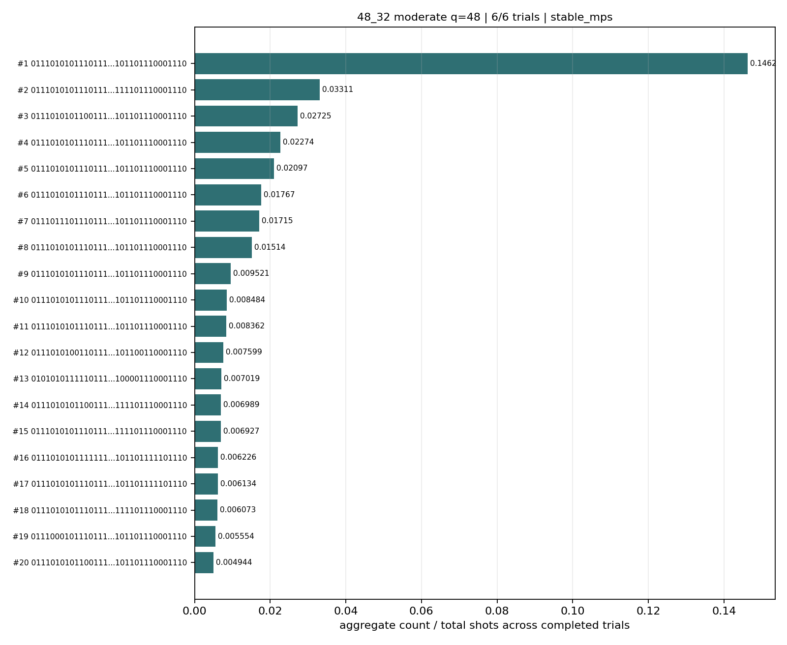
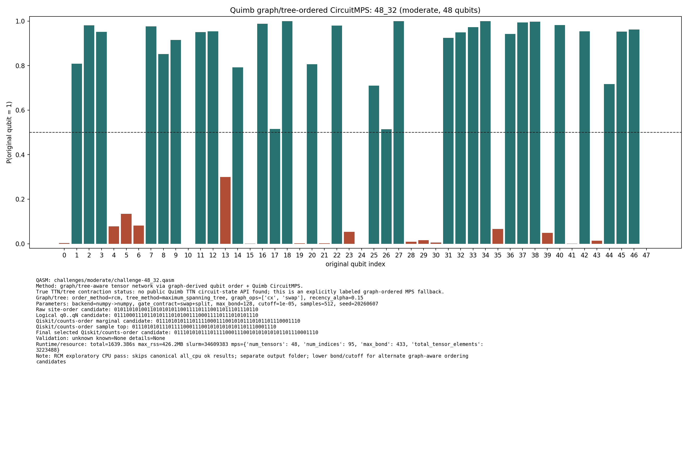

# Challenge 48_32

- Difficulty: moderate
- Qubits: 48
- QASM: `challenges/moderate/challenge-48_32.qasm`
- Central selected answer: `011101010111011110001110010101010101101110001110`
- Selected method: `quimb_cpu_all`
- Selected review: none
- Candidate rows: 75
- Method runs: 12
- Distribution figures: 3

## Selected Answer Sources

| source | selected answer | method | validation | status | evidence |
|---|---|---|---|---|---:|
| tree_tensor_sim_session | `011101010111011110001110010101010101101110001110` | quimb_cpu_all | unknown | selected | 2 |
| quantum_peak_session | `011101010111011110001110010101010101101110001110` | quimb_cpu_all | unknown | selected | 2 |

## Method Summary

| method | family | runs | statuses | best or marked candidate | rank_type | score | fraction | review | sources |
|---|---|---:|---|---|---|---:|---:|---|---|
| aer_mps_adaptive_sweep | mps | 1 | ok | `011101010111011110001110010101010101101110001110` | aggregate_candidate | 0.17178706 | 0.14624023 |  | mps_adaptive_sweep |
| aer_tree_mps_all | mps | 1 | ok | `011101010111011110001110010101010101101110001110` | sample_top | 0.0325927734375 | 0.0325927734375 |  | tree_tensor_sim_session |
| algebraic_simplify_cxswap | heuristic | 1 | static_analysis | `010000000000000000000001000000000101011000000000` | static_heuristic |  |  |  | algebraic_simplify |
| algebraic_simplify_swaponly | heuristic | 1 | static_analysis | `000001000000000000000001000000000001010000000000` | static_heuristic |  |  |  | algebraic_simplify |
| collector_snapshot | collector | 2 | unknown | `011101010111011110001110010101010101101110001110` | collector_selected | 0.265625 | 0.265625 |  | quantum_peak_session,tree_tensor_sim_session |
| quimb_cpu_all | quimb | 2 | ok,unknown | `011101010111011110001110010101010101101110001110` | final_candidate | 0.3136779677207837 |  |  | quantum_peak_session,tree_tensor_sim_session |
| quimb_fast_cpu | quimb | 1 | started |  |  |  |  |  | tree_tensor_sim_session |
| quimb_mst_cpu | quimb | 1 | started |  |  |  |  |  | tree_tensor_sim_session |
| quimb_rcm_cpu | quimb | 2 | ok,unknown | `011101010111011110001110010101010101101110001110` | final_candidate | 0.01430077475291991 |  |  | quantum_peak_session,tree_tensor_sim_session |

## Method Selector

| first action | best method | best score | MPS | TNO | MPO-unswap |
|---|---|---:|---:|---:|---:|
| Low-bond MPS with bitstring distillation | Low-bond MPS with bitstring distillation | 86 | 86 | 72 | 47 |

## Distribution Figures

### Adaptive Aer MPS distribution: challenge-48_32.png

### Quimb graph-ordered MPS distribution: challenge-48_32.quimb_tree_graph_mps.png

### Quimb graph-ordered MPS distribution: challenge-48_32.quimb_tree_graph_mps.png

## Candidate Rows

| review | selected | method | rank_type | rank | bitstring | score | count | support | fraction | validation | status | sources | source path | notes |
|---|---:|---|---|---:|---|---:|---:|---:|---:|---|---|---|---|---|
|  | 1 | collector_snapshot | collector_selected | 1 | `011101010111011110001110010101010101101110001110` | 0.265625 |  |  | 0.265625 | unknown | unknown | tree_tensor_sim_session | `research/tree_tensor_sim_session/artifacts/collector/CANDIDATES.tsv` | quimb_cpu_all |
|  | 1 | collector_snapshot | collector_selected | 1 | `011101010111011110001110010101010101101110001110` | 0.265625 |  |  | 0.265625 | unknown | unknown | quantum_peak_session | `research/quantum_peak_session/results/current_candidates/CANDIDATES.tsv` | quimb_cpu_all |
|  | 1 | quimb_cpu_all | final_candidate | 1 | `011101010111011110001110010101010101101110001110` | 0.3136779677207837 |  |  |  | {"known_answer_qiskit_order":null,"status":"unknown"} | ok | tree_tensor_sim_session | `../quantum-junction-tree-tensor/outputs/tree_tensor_sim/all_cpu/json/challenge-48_32.quimb_tree_graph_mps.json` | - |
|  | 1 | quimb_rcm_cpu | final_candidate | 1 | `011101010111011110001110010101010101101110001110` | 0.01430077475291991 |  |  |  | {"known_answer_qiskit_order":null,"status":"unknown"} | ok | tree_tensor_sim_session | `../quantum-junction-tree-tensor/outputs/tree_tensor_sim/rcm_cpu/json/challenge-48_32.quimb_tree_graph_mps.json` | - |
|  | 1 | aer_mps_adaptive_sweep | aggregate_candidate | 1 | `011101010111011110001110010101010101101110001110` | 0.17178706 |  | 1 | 0.14624023 | stable_mps | ok | mps_adaptive_sweep | `agent_work/mps_adaptive_sweep/report/tables/mps_adaptive_summary.tsv` | aggregate_gap=4.41659; exact_match=False |
|  | 1 | quimb_cpu_all | marginal_candidate | 1 | `011101010111011110001110010101010101101110001110` | 0.3136779677207837 |  |  |  | {"known_answer_qiskit_order":null,"status":"unknown"} | ok | tree_tensor_sim_session | `../quantum-junction-tree-tensor/outputs/tree_tensor_sim/all_cpu/json/challenge-48_32.quimb_tree_graph_mps.json` | - |
|  | 1 | quimb_cpu_all | sample_top | 1 | `011101010111011110001110010101010101101110001110` | 0.265625 | 272 |  | 0.265625 | {"known_answer_qiskit_order":null,"status":"unknown"} | ok | tree_tensor_sim_session | `../quantum-junction-tree-tensor/outputs/tree_tensor_sim/all_cpu/json/challenge-48_32.quimb_tree_graph_mps.json` | - |
|  | 1 | quimb_rcm_cpu | sample_top | 1 | `011101010111011110001110010101010101101110001110` | 0.0234375 | 12 |  | 0.0234375 | {"known_answer_qiskit_order":null,"status":"unknown"} | ok | tree_tensor_sim_session | `../quantum-junction-tree-tensor/outputs/tree_tensor_sim/rcm_cpu/json/challenge-48_32.quimb_tree_graph_mps.json` | - |
|  | 1 | aer_tree_mps_all | sample_top | 10 | `011101010111011110001110010101010101101110001110` | 0.0325927734375 | 267 |  | 0.0325927734375 |  | ok | tree_tensor_sim_session | `../quantum-junction-tree-tensor/outputs/tree_tensor_sim/all/json/challenge-48_32.tree_tensor_mps.json` | - |
|  | 1 | aer_mps_adaptive_sweep | aggregate_top_counts | 1 | `011101010111011110001110010101010101101110001110` | 0.17178706 | 4792 |  | 0.14624023 |  | ok | mps_adaptive_sweep | `agent_work/mps_adaptive_sweep/report/tables/mps_adaptive_top_counts.tsv` |  |
|  | 1 | quimb_cpu_all | collector_evidence | 1 | `011101010111011110001110010101010101101110001110` | 0.265625 |  |  | 0.265625 | unknown | unknown | quantum_peak_session,tree_tensor_sim_session | `outputs/tree_tensor_sim/all_cpu/json/challenge-48_32.quimb_tree_graph_mps.json` | collector priority 80 |
|  | 1 | quimb_rcm_cpu | collector_evidence | 2 | `011101010111011110001110010101010101101110001110` | 0.0234375 |  |  | 0.0234375 | unknown | unknown | quantum_peak_session,tree_tensor_sim_session | `outputs/tree_tensor_sim/rcm_cpu/json/challenge-48_32.quimb_tree_graph_mps.json` | collector priority 55 |
|  | 0 | quimb_rcm_cpu | marginal_candidate | 1 | `011101010111011110001110010101110101101110001110` | 0.01430077475291991 |  |  |  | {"known_answer_qiskit_order":null,"status":"unknown"} | ok | tree_tensor_sim_session | `../quantum-junction-tree-tensor/outputs/tree_tensor_sim/rcm_cpu/json/challenge-48_32.quimb_tree_graph_mps.json` | - |
|  | 0 | aer_tree_mps_all | sample_top | 1 | `011001010111011110001110010101010001101110001110` | 0.006103515625 | 50 |  | 0.006103515625 |  | ok | tree_tensor_sim_session | `../quantum-junction-tree-tensor/outputs/tree_tensor_sim/all/json/challenge-48_32.tree_tensor_mps.json` | - |
|  | 0 | aer_tree_mps_all | sample_top | 2 | `011001010111011110001110010101010101101110001110` | 0.0089111328125 | 73 |  | 0.0089111328125 |  | ok | tree_tensor_sim_session | `../quantum-junction-tree-tensor/outputs/tree_tensor_sim/all/json/challenge-48_32.tree_tensor_mps.json` | - |
|  | 0 | quimb_cpu_all | sample_top | 2 | `011101010111011110001110010101110001101110001110` | 0.0546875 | 56 |  | 0.0546875 | {"known_answer_qiskit_order":null,"status":"unknown"} | ok | tree_tensor_sim_session | `../quantum-junction-tree-tensor/outputs/tree_tensor_sim/all_cpu/json/challenge-48_32.quimb_tree_graph_mps.json` | - |
|  | 0 | quimb_rcm_cpu | sample_top | 2 | `011101010111011110001110010101110101101110001110` | 0.0234375 | 12 |  | 0.0234375 | {"known_answer_qiskit_order":null,"status":"unknown"} | ok | tree_tensor_sim_session | `../quantum-junction-tree-tensor/outputs/tree_tensor_sim/rcm_cpu/json/challenge-48_32.quimb_tree_graph_mps.json` | - |
|  | 0 | aer_tree_mps_all | sample_top | 3 | `011001010111011110001110010101110001101110001110` | 0.006103515625 | 50 |  | 0.006103515625 |  | ok | tree_tensor_sim_session | `../quantum-junction-tree-tensor/outputs/tree_tensor_sim/all/json/challenge-48_32.tree_tensor_mps.json` | - |
|  | 0 | quimb_cpu_all | sample_top | 3 | `011101110111011110001110010101010101101110001110` | 0.041015625 | 42 |  | 0.041015625 | {"known_answer_qiskit_order":null,"status":"unknown"} | ok | tree_tensor_sim_session | `../quantum-junction-tree-tensor/outputs/tree_tensor_sim/all_cpu/json/challenge-48_32.quimb_tree_graph_mps.json` | - |
|  | 0 | quimb_rcm_cpu | sample_top | 3 | `011001010111011110001110010101110101101110001110` | 0.015625 | 8 |  | 0.015625 | {"known_answer_qiskit_order":null,"status":"unknown"} | ok | tree_tensor_sim_session | `../quantum-junction-tree-tensor/outputs/tree_tensor_sim/rcm_cpu/json/challenge-48_32.quimb_tree_graph_mps.json` | - |
|  | 0 | aer_tree_mps_all | sample_top | 4 | `011001010111011110001110010101110101101110001110` | 0.01171875 | 96 |  | 0.01171875 |  | ok | tree_tensor_sim_session | `../quantum-junction-tree-tensor/outputs/tree_tensor_sim/all/json/challenge-48_32.tree_tensor_mps.json` | - |
|  | 0 | quimb_cpu_all | sample_top | 4 | `011101010111011110001110010001010101101110001110` | 0.01953125 | 20 |  | 0.01953125 | {"known_answer_qiskit_order":null,"status":"unknown"} | ok | tree_tensor_sim_session | `../quantum-junction-tree-tensor/outputs/tree_tensor_sim/all_cpu/json/challenge-48_32.quimb_tree_graph_mps.json` | - |
|  | 0 | quimb_rcm_cpu | sample_top | 4 | `011101010111011110001010010101010111101110001110` | 0.01171875 | 6 |  | 0.01171875 | {"known_answer_qiskit_order":null,"status":"unknown"} | ok | tree_tensor_sim_session | `../quantum-junction-tree-tensor/outputs/tree_tensor_sim/rcm_cpu/json/challenge-48_32.quimb_tree_graph_mps.json` | - |
|  | 0 | aer_tree_mps_all | sample_top | 5 | `011101010110011110001110010101010101101110001110` | 0.006591796875 | 54 |  | 0.006591796875 |  | ok | tree_tensor_sim_session | `../quantum-junction-tree-tensor/outputs/tree_tensor_sim/all/json/challenge-48_32.tree_tensor_mps.json` | - |
|  | 0 | quimb_cpu_all | sample_top | 5 | `011101010111111110001110010101010101101111101110` | 0.0185546875 | 19 |  | 0.0185546875 | {"known_answer_qiskit_order":null,"status":"unknown"} | ok | tree_tensor_sim_session | `../quantum-junction-tree-tensor/outputs/tree_tensor_sim/all_cpu/json/challenge-48_32.quimb_tree_graph_mps.json` | - |
|  | 0 | quimb_rcm_cpu | sample_top | 5 | `011101010111011110001010010101110101101110001110` | 0.01171875 | 6 |  | 0.01171875 | {"known_answer_qiskit_order":null,"status":"unknown"} | ok | tree_tensor_sim_session | `../quantum-junction-tree-tensor/outputs/tree_tensor_sim/rcm_cpu/json/challenge-48_32.quimb_tree_graph_mps.json` | - |
|  | 0 | aer_tree_mps_all | sample_top | 6 | `011101010110011110001110010101110101101110001110` | 0.0048828125 | 40 |  | 0.0048828125 |  | ok | tree_tensor_sim_session | `../quantum-junction-tree-tensor/outputs/tree_tensor_sim/all/json/challenge-48_32.tree_tensor_mps.json` | - |
|  | 0 | quimb_cpu_all | sample_top | 6 | `010101011111011110001110010101010100001110001110` | 0.0126953125 | 13 |  | 0.0126953125 | {"known_answer_qiskit_order":null,"status":"unknown"} | ok | tree_tensor_sim_session | `../quantum-junction-tree-tensor/outputs/tree_tensor_sim/all_cpu/json/challenge-48_32.quimb_tree_graph_mps.json` | - |
|  | 0 | quimb_rcm_cpu | sample_top | 6 | `011101010111011110001000010101010101101110001110` | 0.01171875 | 6 |  | 0.01171875 | {"known_answer_qiskit_order":null,"status":"unknown"} | ok | tree_tensor_sim_session | `../quantum-junction-tree-tensor/outputs/tree_tensor_sim/rcm_cpu/json/challenge-48_32.quimb_tree_graph_mps.json` | - |
|  | 0 | aer_tree_mps_all | sample_top | 7 | `011101010111011110001110010101010001101110001110` | 0.0169677734375 | 139 |  | 0.0169677734375 |  | ok | tree_tensor_sim_session | `../quantum-junction-tree-tensor/outputs/tree_tensor_sim/all/json/challenge-48_32.tree_tensor_mps.json` | - |
|  | 0 | quimb_cpu_all | sample_top | 7 | `011101010110011100101110010101010101101110001110` | 0.0126953125 | 13 |  | 0.0126953125 | {"known_answer_qiskit_order":null,"status":"unknown"} | ok | tree_tensor_sim_session | `../quantum-junction-tree-tensor/outputs/tree_tensor_sim/all_cpu/json/challenge-48_32.quimb_tree_graph_mps.json` | - |
|  | 0 | quimb_rcm_cpu | sample_top | 7 | `011001010111011110001110010101010101101110001110` | 0.01171875 | 6 |  | 0.01171875 | {"known_answer_qiskit_order":null,"status":"unknown"} | ok | tree_tensor_sim_session | `../quantum-junction-tree-tensor/outputs/tree_tensor_sim/rcm_cpu/json/challenge-48_32.quimb_tree_graph_mps.json` | - |
|  | 0 | aer_tree_mps_all | sample_top | 8 | `011101010111011110001110010101010011101110001110` | 0.0062255859375 | 51 |  | 0.0062255859375 |  | ok | tree_tensor_sim_session | `../quantum-junction-tree-tensor/outputs/tree_tensor_sim/all/json/challenge-48_32.tree_tensor_mps.json` | - |
|  | 0 | quimb_cpu_all | sample_top | 8 | `011101010110011110101110010101010101101110001110` | 0.0126953125 | 13 |  | 0.0126953125 | {"known_answer_qiskit_order":null,"status":"unknown"} | ok | tree_tensor_sim_session | `../quantum-junction-tree-tensor/outputs/tree_tensor_sim/all_cpu/json/challenge-48_32.quimb_tree_graph_mps.json` | - |
|  | 0 | quimb_rcm_cpu | sample_top | 8 | `011101010111011110001010010101010101101110001110` | 0.01171875 | 6 |  | 0.01171875 | {"known_answer_qiskit_order":null,"status":"unknown"} | ok | tree_tensor_sim_session | `../quantum-junction-tree-tensor/outputs/tree_tensor_sim/rcm_cpu/json/challenge-48_32.quimb_tree_graph_mps.json` | - |
|  | 0 | aer_tree_mps_all | sample_top | 9 | `011101010111011110001110010101010101101010001110` | 0.0064697265625 | 53 |  | 0.0064697265625 |  | ok | tree_tensor_sim_session | `../quantum-junction-tree-tensor/outputs/tree_tensor_sim/all/json/challenge-48_32.tree_tensor_mps.json` | - |
|  | 0 | quimb_cpu_all | sample_top | 9 | `011001010111011110001110010101010101101110001110` | 0.01171875 | 12 |  | 0.01171875 | {"known_answer_qiskit_order":null,"status":"unknown"} | ok | tree_tensor_sim_session | `../quantum-junction-tree-tensor/outputs/tree_tensor_sim/all_cpu/json/challenge-48_32.quimb_tree_graph_mps.json` | - |
|  | 0 | quimb_rcm_cpu | sample_top | 9 | `011101010111011110001000010101110101101110001110` | 0.01171875 | 6 |  | 0.01171875 | {"known_answer_qiskit_order":null,"status":"unknown"} | ok | tree_tensor_sim_session | `../quantum-junction-tree-tensor/outputs/tree_tensor_sim/rcm_cpu/json/challenge-48_32.quimb_tree_graph_mps.json` | - |
|  | 0 | quimb_cpu_all | sample_top | 10 | `011100010111001110001110010101010101101110001110` | 0.01171875 | 12 |  | 0.01171875 | {"known_answer_qiskit_order":null,"status":"unknown"} | ok | tree_tensor_sim_session | `../quantum-junction-tree-tensor/outputs/tree_tensor_sim/all_cpu/json/challenge-48_32.quimb_tree_graph_mps.json` | - |
|  | 0 | quimb_rcm_cpu | sample_top | 10 | `011101010111011110001110010101010111101110001110` | 0.009765625 | 5 |  | 0.009765625 | {"known_answer_qiskit_order":null,"status":"unknown"} | ok | tree_tensor_sim_session | `../quantum-junction-tree-tensor/outputs/tree_tensor_sim/rcm_cpu/json/challenge-48_32.quimb_tree_graph_mps.json` | - |
|  | 0 | aer_tree_mps_all | sample_top | 11 | `011101010111011110001110010101010111101110001110` | 0.012451171875 | 102 |  | 0.012451171875 |  | ok | tree_tensor_sim_session | `../quantum-junction-tree-tensor/outputs/tree_tensor_sim/all/json/challenge-48_32.tree_tensor_mps.json` | - |
|  | 0 | quimb_cpu_all | sample_top | 11 | `011100010111011110001110010101010101101110001110` | 0.01171875 | 12 |  | 0.01171875 | {"known_answer_qiskit_order":null,"status":"unknown"} | ok | tree_tensor_sim_session | `../quantum-junction-tree-tensor/outputs/tree_tensor_sim/all_cpu/json/challenge-48_32.quimb_tree_graph_mps.json` | - |
|  | 0 | quimb_rcm_cpu | sample_top | 11 | `011101010111011110001110010101110001101110001110` | 0.009765625 | 5 |  | 0.009765625 | {"known_answer_qiskit_order":null,"status":"unknown"} | ok | tree_tensor_sim_session | `../quantum-junction-tree-tensor/outputs/tree_tensor_sim/rcm_cpu/json/challenge-48_32.quimb_tree_graph_mps.json` | - |
|  | 0 | aer_tree_mps_all | sample_top | 12 | `011101010111011110001110010101011101101110001110` | 0.009521484375 | 78 |  | 0.009521484375 |  | ok | tree_tensor_sim_session | `../quantum-junction-tree-tensor/outputs/tree_tensor_sim/all/json/challenge-48_32.tree_tensor_mps.json` | - |
|  | 0 | quimb_cpu_all | sample_top | 12 | `001101010111010110001110010101010001101110001110` | 0.009765625 | 10 |  | 0.009765625 | {"known_answer_qiskit_order":null,"status":"unknown"} | ok | tree_tensor_sim_session | `../quantum-junction-tree-tensor/outputs/tree_tensor_sim/all_cpu/json/challenge-48_32.quimb_tree_graph_mps.json` | - |
|  | 0 | quimb_rcm_cpu | sample_top | 12 | `011101010111011110001010010101110101101110001100` | 0.009765625 | 5 |  | 0.009765625 | {"known_answer_qiskit_order":null,"status":"unknown"} | ok | tree_tensor_sim_session | `../quantum-junction-tree-tensor/outputs/tree_tensor_sim/rcm_cpu/json/challenge-48_32.quimb_tree_graph_mps.json` | - |
|  | 0 | aer_tree_mps_all | sample_top | 13 | `011101010111011110001110010101110001101110001110` | 0.0159912109375 | 131 |  | 0.0159912109375 |  | ok | tree_tensor_sim_session | `../quantum-junction-tree-tensor/outputs/tree_tensor_sim/all/json/challenge-48_32.tree_tensor_mps.json` | - |
|  | 0 | aer_tree_mps_all | sample_top | 14 | `011101010111011110001110010101110101101010001110` | 0.0064697265625 | 53 |  | 0.0064697265625 |  | ok | tree_tensor_sim_session | `../quantum-junction-tree-tensor/outputs/tree_tensor_sim/all/json/challenge-48_32.tree_tensor_mps.json` | - |
|  | 0 | aer_tree_mps_all | sample_top | 15 | `011101010111011110001110010101110101101110001110` | 0.0306396484375 | 251 |  | 0.0306396484375 |  | ok | tree_tensor_sim_session | `../quantum-junction-tree-tensor/outputs/tree_tensor_sim/all/json/challenge-48_32.tree_tensor_mps.json` | - |
|  | 0 | aer_tree_mps_all | sample_top | 16 | `011101010111011110001110010101110111101110001110` | 0.00830078125 | 68 |  | 0.00830078125 |  | ok | tree_tensor_sim_session | `../quantum-junction-tree-tensor/outputs/tree_tensor_sim/all/json/challenge-48_32.tree_tensor_mps.json` | - |
|  | 0 | aer_tree_mps_all | sample_top | 17 | `011101010111011110001110010101111001101110001110` | 0.0054931640625 | 45 |  | 0.0054931640625 |  | ok | tree_tensor_sim_session | `../quantum-junction-tree-tensor/outputs/tree_tensor_sim/all/json/challenge-48_32.tree_tensor_mps.json` | - |
|  | 0 | aer_tree_mps_all | sample_top | 18 | `011101010111011110001110010101111101101110001110` | 0.0078125 | 64 |  | 0.0078125 |  | ok | tree_tensor_sim_session | `../quantum-junction-tree-tensor/outputs/tree_tensor_sim/all/json/challenge-48_32.tree_tensor_mps.json` | - |
|  | 0 | aer_tree_mps_all | sample_top | 19 | `011101110111011110001110010101010101101110001110` | 0.0068359375 | 56 |  | 0.0068359375 |  | ok | tree_tensor_sim_session | `../quantum-junction-tree-tensor/outputs/tree_tensor_sim/all/json/challenge-48_32.tree_tensor_mps.json` | - |
|  | 0 | aer_tree_mps_all | sample_top | 20 | `011101110111011110001110010101110101101110001110` | 0.004638671875 | 38 |  | 0.004638671875 |  | ok | tree_tensor_sim_session | `../quantum-junction-tree-tensor/outputs/tree_tensor_sim/all/json/challenge-48_32.tree_tensor_mps.json` | - |
|  | 0 | aer_mps_adaptive_sweep | aggregate_top_counts | 2 | `011101010111011110001110010101010111101110001110` | 0.038895859 | 1085 |  | 0.033111572 |  | ok | mps_adaptive_sweep | `agent_work/mps_adaptive_sweep/report/tables/mps_adaptive_top_counts.tsv` |  |
|  | 0 | aer_mps_adaptive_sweep | aggregate_top_counts | 3 | `011101010110011110001110010101010101101110001110` | 0.032012906 | 893 |  | 0.027252197 |  | ok | mps_adaptive_sweep | `agent_work/mps_adaptive_sweep/report/tables/mps_adaptive_top_counts.tsv` |  |
|  | 0 | aer_mps_adaptive_sweep | aggregate_top_counts | 4 | `011101010111011110001110010111010101101110001110` | 0.026707295 | 745 |  | 0.022735596 |  | ok | mps_adaptive_sweep | `agent_work/mps_adaptive_sweep/report/tables/mps_adaptive_top_counts.tsv` |  |
|  | 0 | aer_mps_adaptive_sweep | aggregate_top_counts | 5 | `011101010111011110001110010101110101101110001110` | 0.02462807 | 687 |  | 0.020965576 |  | ok | mps_adaptive_sweep | `agent_work/mps_adaptive_sweep/report/tables/mps_adaptive_top_counts.tsv` |  |
|  | 0 | aer_mps_adaptive_sweep | aggregate_top_counts | 6 | `011101010111011110001100010101010101101110001110` | 0.020756408 | 579 |  | 0.017669678 |  | ok | mps_adaptive_sweep | `agent_work/mps_adaptive_sweep/report/tables/mps_adaptive_top_counts.tsv` |  |
|  | 0 | aer_mps_adaptive_sweep | aggregate_top_counts | 7 | `011101110111011110001110010101010101101110001110` | 0.02014698 | 562 |  | 0.017150879 |  | ok | mps_adaptive_sweep | `agent_work/mps_adaptive_sweep/report/tables/mps_adaptive_top_counts.tsv` |  |
|  | 0 | aer_mps_adaptive_sweep | aggregate_top_counts | 8 | `011101010111011110001110010001010101101110001110` | 0.017780964 | 496 |  | 0.015136719 |  | ok | mps_adaptive_sweep | `agent_work/mps_adaptive_sweep/report/tables/mps_adaptive_top_counts.tsv` |  |
|  | 0 | aer_mps_adaptive_sweep | aggregate_top_counts | 9 | `011101010111011110001010010101010101101110001110` | 0.0111848 | 312 |  | 0.0095214844 |  | ok | mps_adaptive_sweep | `agent_work/mps_adaptive_sweep/report/tables/mps_adaptive_top_counts.tsv` |  |
|  | 0 | aer_mps_adaptive_sweep | aggregate_top_counts | 10 | `011101010111011100001110010101010101101110001110` | 0.0099659437 | 278 |  | 0.0084838867 |  | ok | mps_adaptive_sweep | `agent_work/mps_adaptive_sweep/report/tables/mps_adaptive_top_counts.tsv` |  |
|  | 0 | aer_mps_adaptive_sweep | aggregate_top_counts | 11 | `011101010111011110001110110101010101101110001110` | 0.0098225488 | 274 |  | 0.0083618164 |  | ok | mps_adaptive_sweep | `agent_work/mps_adaptive_sweep/report/tables/mps_adaptive_top_counts.tsv` |  |
|  | 0 | aer_mps_adaptive_sweep | aggregate_top_counts | 12 | `011101010011011110001110010101010101100110001110` | 0.0089263309 | 249 |  | 0.007598877 |  | ok | mps_adaptive_sweep | `agent_work/mps_adaptive_sweep/report/tables/mps_adaptive_top_counts.tsv` |  |
|  | 0 | aer_mps_adaptive_sweep | aggregate_top_counts | 13 | `010101011111011110001110010101010100001110001110` | 0.0082452052 | 230 |  | 0.007019043 |  | ok | mps_adaptive_sweep | `agent_work/mps_adaptive_sweep/report/tables/mps_adaptive_top_counts.tsv` |  |
|  | 0 | aer_mps_adaptive_sweep | aggregate_top_counts | 14 | `011101010110011110001110010101010111101110001110` | 0.0082093565 | 229 |  | 0.0069885254 |  | ok | mps_adaptive_sweep | `agent_work/mps_adaptive_sweep/report/tables/mps_adaptive_top_counts.tsv` |  |
|  | 0 | aer_mps_adaptive_sweep | aggregate_top_counts | 15 | `011101010111011110001100010101010111101110001110` | 0.0081376591 | 227 |  | 0.0069274902 |  | ok | mps_adaptive_sweep | `agent_work/mps_adaptive_sweep/report/tables/mps_adaptive_top_counts.tsv` |  |
|  | 0 | aer_mps_adaptive_sweep | aggregate_top_counts | 16 | `011101010111111110001110010101010101101111101110` | 0.0073131386 | 204 |  | 0.0062255859 |  | ok | mps_adaptive_sweep | `agent_work/mps_adaptive_sweep/report/tables/mps_adaptive_top_counts.tsv` |  |
|  | 0 | aer_mps_adaptive_sweep | aggregate_top_counts | 17 | `011101010111011110001110010101010101101111101110` | 0.0072055924 | 201 |  | 0.0061340332 |  | ok | mps_adaptive_sweep | `agent_work/mps_adaptive_sweep/report/tables/mps_adaptive_top_counts.tsv` |  |
|  | 0 | aer_mps_adaptive_sweep | aggregate_top_counts | 18 | `011101010111011110001110010111010111101110001110` | 0.007133895 | 199 |  | 0.006072998 |  | ok | mps_adaptive_sweep | `agent_work/mps_adaptive_sweep/report/tables/mps_adaptive_top_counts.tsv` |  |
|  | 0 | aer_mps_adaptive_sweep | aggregate_top_counts | 19 | `011100010111011110001110010101010101101110001110` | 0.0065244668 | 182 |  | 0.0055541992 |  | ok | mps_adaptive_sweep | `agent_work/mps_adaptive_sweep/report/tables/mps_adaptive_top_counts.tsv` |  |
|  | 0 | aer_mps_adaptive_sweep | aggregate_top_counts | 20 | `011101010110011110001110010101110101101110001110` | 0.0058074924 | 162 |  | 0.0049438477 |  | ok | mps_adaptive_sweep | `agent_work/mps_adaptive_sweep/report/tables/mps_adaptive_top_counts.tsv` |  |
|  | 0 | algebraic_simplify_cxswap | static_heuristic | 1 | `010000000000000000000001000000000101011000000000` |  |  |  |  | heuristic_only | heuristic | algebraic_simplify | `agent_work/algebraic_simplify/summary.csv` | exact_available_match= |
|  | 0 | algebraic_simplify_swaponly | static_heuristic | 1 | `000001000000000000000001000000000001010000000000` |  |  |  |  | heuristic_only | heuristic | algebraic_simplify | `agent_work/algebraic_simplify/summary.csv` | exact_available_match= |

## Method Runs

| method | run_id | status | backend | shots | max_bond | seconds | source path | notes |
|---|---|---|---|---:|---:|---:|---|---|
| aer_mps_adaptive_sweep | adaptive_sweep_aggregate | ok |  | 32768 | 128 |  | `agent_work/mps_adaptive_sweep/report/tables/mps_adaptive_summary.tsv` | classification=stable_mps; completed=6/6; exact_match=False; matches_previous=True; settings=baseline:4096/bd64x2; bond_probe:4096/bd128x2; more_shots:8192/bd64x2 |
| aer_tree_mps_all | challenge-48_32.tree_tensor_mps:trial1:rcm:bd64:seed20260605 | ok |  | 8192 | 64 | 59.38541361899115 | `../quantum-junction-tree-tensor/outputs/tree_tensor_sim/all/json/challenge-48_32.tree_tensor_mps.json` | graph_ordered_mps_fallback |
| algebraic_simplify_cxswap | static_summary | static_analysis |  |  |  |  | `agent_work/algebraic_simplify/summary.csv` | linear_windows=451; snapped=815 |
| algebraic_simplify_swaponly | static_summary | static_analysis |  |  |  |  | `agent_work/algebraic_simplify/summary.csv` | linear_windows=451; snapped=815 |
| collector_snapshot | collector_selected:48_32 | unknown |  |  |  |  | `research/quantum_peak_session/results/current_candidates/CANDIDATES.tsv` | selected from quimb_cpu_all |
| collector_snapshot | collector_selected:48_32 | unknown |  |  |  |  | `research/tree_tensor_sim_session/artifacts/collector/CANDIDATES.tsv` | selected from quimb_cpu_all |
| quimb_cpu_all | challenge-48_32.quimb_tree_graph_mps | ok | numpy | 1024 | 512 | 6627.036273923935 | `../quantum-junction-tree-tensor/outputs/tree_tensor_sim/all_cpu/json/challenge-48_32.quimb_tree_graph_mps.json` | graph_ordered_mps_fallback |
| quimb_cpu_all | collector_evidence:48_32:1 | unknown |  |  | 1742 | 6627.036273923935 | `outputs/tree_tensor_sim/all_cpu/json/challenge-48_32.quimb_tree_graph_mps.json` | collector priority 80 |
| quimb_fast_cpu | challenge-48_32.quimb_tree_graph_mps | started |  | 512 | 128 |  | `../quantum-junction-tree-tensor/outputs/tree_tensor_sim/fast_cpu/json/challenge-48_32.quimb_tree_graph_mps.json` | graph_ordered_mps_fallback |
| quimb_mst_cpu | challenge-48_32.quimb_tree_graph_mps | started |  | 512 | 128 |  | `../quantum-junction-tree-tensor/outputs/tree_tensor_sim/mst_cpu/json/challenge-48_32.quimb_tree_graph_mps.json` | graph_ordered_mps_fallback |
| quimb_rcm_cpu | challenge-48_32.quimb_tree_graph_mps | ok | numpy | 512 | 128 | 1639.386163600022 | `../quantum-junction-tree-tensor/outputs/tree_tensor_sim/rcm_cpu/json/challenge-48_32.quimb_tree_graph_mps.json` | graph_ordered_mps_fallback |
| quimb_rcm_cpu | collector_evidence:48_32:2 | unknown |  |  | 433 | 1639.386163600022 | `outputs/tree_tensor_sim/rcm_cpu/json/challenge-48_32.quimb_tree_graph_mps.json` | collector priority 55 |
