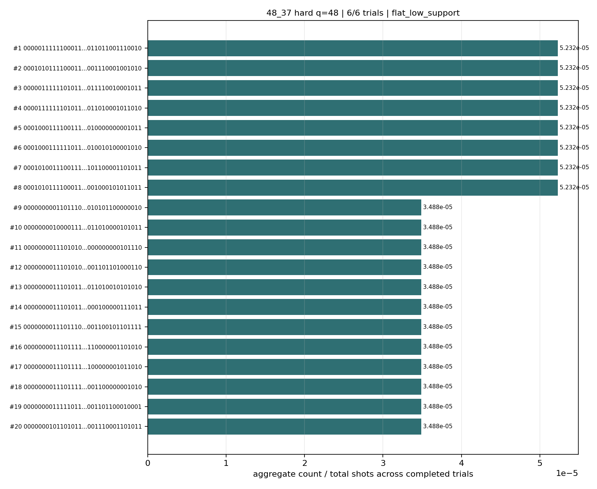
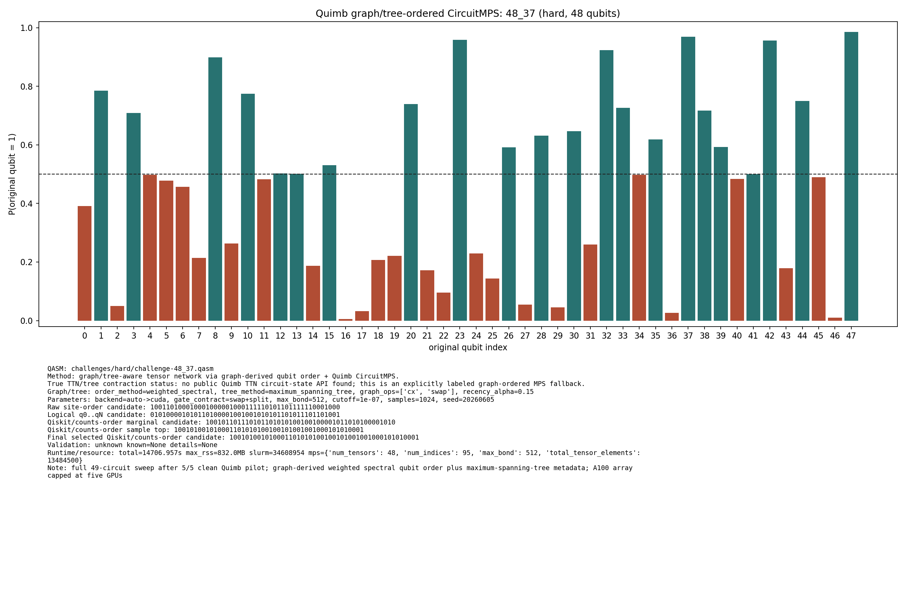
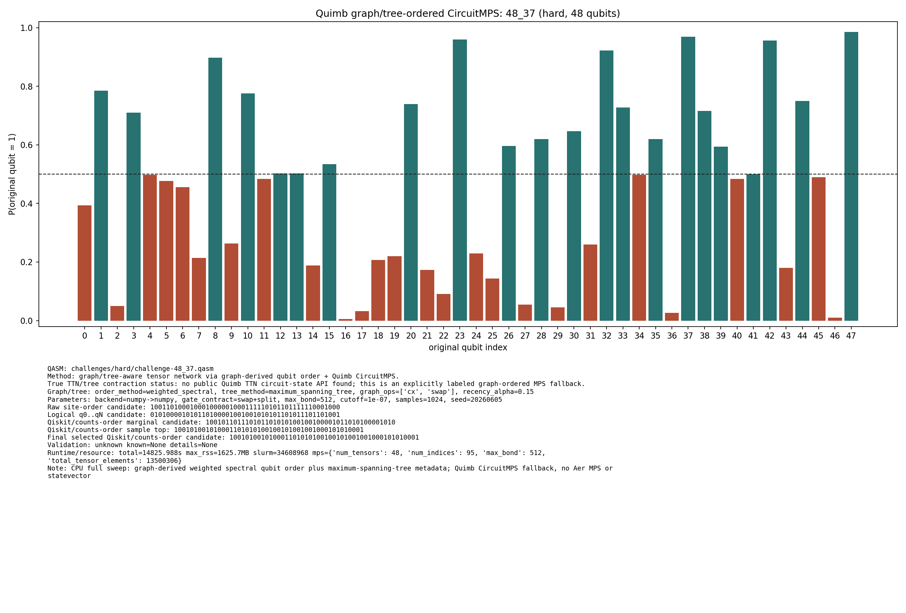

# Challenge 48_37

- Difficulty: hard
- Qubits: 48
- QASM: `challenges/hard/challenge-48_37.qasm`
- Central selected answer: `100101001010001101010100100101001001000101010001`
- Selected method: `quimb_gpu_all`
- Selected review: none
- Candidate rows: 90
- Method runs: 17
- Distribution figures: 4

## Selected Answer Sources

| source | selected answer | method | validation | status | evidence |
|---|---|---|---|---|---:|
| tree_tensor_sim_session | `100101001010001101010100100101001001000101010001` | quimb_gpu_all | unknown | selected | 3 |
| quantum_peak_session | `100101001010001101010100100101001001000101010001` | quimb_gpu_all | unknown | selected | 3 |

## Method Summary

| method | family | runs | statuses | best or marked candidate | rank_type | score | fraction | review | sources |
|---|---|---:|---|---|---|---:|---:|---|---|
| aer_mps_adaptive_sweep | mps | 1 | ok | `000001111110001100000000100100001011011001110010` | aggregate_candidate | 0.00025 | 5.2315848e-05 |  | mps_adaptive_sweep |
| aer_tree_mps_all | mps | 1 | ok | `000000111000111001010000110100100001111100000010` | sample_top | 0.0001220703125 | 0.0001220703125 |  | tree_tensor_sim_session |
| algebraic_simplify_cxswap | heuristic | 1 | static_analysis | `111000011000011001010111100111011100010101111001` | static_heuristic |  |  |  | algebraic_simplify |
| algebraic_simplify_swaponly | heuristic | 1 | static_analysis | `000000000000100000000000000000000001010010000001` | static_heuristic |  |  |  | algebraic_simplify |
| collector_snapshot | collector | 2 | unknown | `100101001010001101010100100101001001000101010001` | collector_selected | 0.0009765625 | 0.0009765625 |  | quantum_peak_session,tree_tensor_sim_session |
| peaked_mpo_mps | mpo | 2 | started |  |  |  |  |  | quantum_peak_session,tree_tensor_sim_session |
| quimb_cpu_all | quimb | 2 | ok,unknown | `100101001010001101010100100101001001000101010001` | final_candidate | 4.567438495306497e-05 |  |  | quantum_peak_session,tree_tensor_sim_session |
| quimb_fast_cpu | quimb | 1 | started |  |  |  |  |  | tree_tensor_sim_session |
| quimb_gpu_all | quimb | 2 | ok,unknown | `100101001010001101010100100101001001000101010001` | final_candidate | 4.265557269866882e-05 |  |  | quantum_peak_session,tree_tensor_sim_session |
| quimb_mst_cpu | quimb | 1 | started |  |  |  |  |  | tree_tensor_sim_session |
| quimb_rcm_cpu | quimb | 2 | ok,unknown | `001110010010111100111010100101011000100000001000` | final_candidate | 2.220446049250313e-16 |  |  | quantum_peak_session,tree_tensor_sim_session |
| tno_contract_core_cpu | tno | 1 | started |  |  |  |  |  | tno_contract_core_cpu |

## Method Selector

| first action | best method | best score | MPS | TNO | MPO-unswap |
|---|---|---:|---:|---:|---:|
| Tensor Network Operator midpoint contraction | Tensor Network Operator midpoint contraction | 74 | 72 | 74 | 65 |

## Distribution Figures

### Adaptive Aer MPS distribution: challenge-48_37.png

### Quimb graph-ordered MPS distribution: challenge-48_37.quimb_tree_graph_mps.png

### Quimb graph-ordered MPS distribution: challenge-48_37.quimb_tree_graph_mps.png

### Quimb graph-ordered MPS distribution: challenge-48_37.quimb_tree_graph_mps.png

## Candidate Rows

| review | selected | method | rank_type | rank | bitstring | score | count | support | fraction | validation | status | sources | source path | notes |
|---|---:|---|---|---:|---|---:|---:|---:|---:|---|---|---|---|---|
|  | 1 | collector_snapshot | collector_selected | 1 | `100101001010001101010100100101001001000101010001` | 0.0009765625 |  |  | 0.0009765625 | unknown | unknown | tree_tensor_sim_session | `research/tree_tensor_sim_session/artifacts/collector/CANDIDATES.tsv` | quimb_gpu_all |
|  | 1 | collector_snapshot | collector_selected | 1 | `100101001010001101010100100101001001000101010001` | 0.0009765625 |  |  | 0.0009765625 | unknown | unknown | quantum_peak_session | `research/quantum_peak_session/results/current_candidates/CANDIDATES.tsv` | quimb_gpu_all |
|  | 1 | quimb_cpu_all | final_candidate | 1 | `100101001010001101010100100101001001000101010001` | 4.567438495306497e-05 |  |  |  | {"known_answer_qiskit_order":null,"status":"unknown"} | ok | tree_tensor_sim_session | `../quantum-junction-tree-tensor/outputs/tree_tensor_sim/all_cpu/json/challenge-48_37.quimb_tree_graph_mps.json` | - |
|  | 1 | quimb_gpu_all | final_candidate | 1 | `100101001010001101010100100101001001000101010001` | 4.265557269866882e-05 |  |  |  | {"known_answer_qiskit_order":null,"status":"unknown"} | ok | tree_tensor_sim_session | `../quantum-junction-tree-tensor/outputs/tree_tensor_sim/all/json/challenge-48_37.quimb_tree_graph_mps.json` | - |
|  | 1 | quimb_cpu_all | sample_top | 1 | `100101001010001101010100100101001001000101010001` | 0.0009765625 | 1 |  | 0.0009765625 | {"known_answer_qiskit_order":null,"status":"unknown"} | ok | tree_tensor_sim_session | `../quantum-junction-tree-tensor/outputs/tree_tensor_sim/all_cpu/json/challenge-48_37.quimb_tree_graph_mps.json` | - |
|  | 1 | quimb_gpu_all | sample_top | 1 | `100101001010001101010100100101001001000101010001` | 0.0009765625 | 1 |  | 0.0009765625 | {"known_answer_qiskit_order":null,"status":"unknown"} | ok | tree_tensor_sim_session | `../quantum-junction-tree-tensor/outputs/tree_tensor_sim/all/json/challenge-48_37.quimb_tree_graph_mps.json` | - |
|  | 1 | quimb_gpu_all | collector_evidence | 1 | `100101001010001101010100100101001001000101010001` | 0.0009765625 |  |  | 0.0009765625 | unknown | unknown | quantum_peak_session,tree_tensor_sim_session | `outputs/tree_tensor_sim/all/json/challenge-48_37.quimb_tree_graph_mps.json` | collector priority 90 |
|  | 1 | quimb_cpu_all | collector_evidence | 2 | `100101001010001101010100100101001001000101010001` | 0.0009765625 |  |  | 0.0009765625 | unknown | unknown | quantum_peak_session,tree_tensor_sim_session | `outputs/tree_tensor_sim/all_cpu/json/challenge-48_37.quimb_tree_graph_mps.json` | collector priority 80 |
|  | 0 | quimb_rcm_cpu | final_candidate | 1 | `001110010010111100111010100101011000100000001000` | 2.220446049250313e-16 |  |  |  | {"known_answer_qiskit_order":null,"status":"unknown"} | ok | tree_tensor_sim_session | `../quantum-junction-tree-tensor/outputs/tree_tensor_sim/rcm_cpu/json/challenge-48_37.quimb_tree_graph_mps.json` | - |
|  | 0 | aer_mps_adaptive_sweep | aggregate_candidate | 1 | `000001111110001100000000100100001011011001110010` | 0.00025 |  | 0.16666667 | 5.2315848e-05 | flat_low_support | ok | mps_adaptive_sweep | `agent_work/mps_adaptive_sweep/report/tables/mps_adaptive_summary.tsv` | aggregate_gap=1; exact_match=False |
|  | 0 | quimb_cpu_all | marginal_candidate | 1 | `100101101110101101010100100100001011010100001010` | 4.567438495306497e-05 |  |  |  | {"known_answer_qiskit_order":null,"status":"unknown"} | ok | tree_tensor_sim_session | `../quantum-junction-tree-tensor/outputs/tree_tensor_sim/all_cpu/json/challenge-48_37.quimb_tree_graph_mps.json` | - |
|  | 0 | quimb_gpu_all | marginal_candidate | 1 | `100101101110101101010100100100001011010100001010` | 4.265557269866882e-05 |  |  |  | {"known_answer_qiskit_order":null,"status":"unknown"} | ok | tree_tensor_sim_session | `../quantum-junction-tree-tensor/outputs/tree_tensor_sim/all/json/challenge-48_37.quimb_tree_graph_mps.json` | - |
|  | 0 | quimb_rcm_cpu | marginal_candidate | 1 | `101101111110101100011100110100001001110110011010` | 2.220446049250313e-16 |  |  |  | {"known_answer_qiskit_order":null,"status":"unknown"} | ok | tree_tensor_sim_session | `../quantum-junction-tree-tensor/outputs/tree_tensor_sim/rcm_cpu/json/challenge-48_37.quimb_tree_graph_mps.json` | - |
|  | 0 | aer_tree_mps_all | sample_top | 1 | `000000111000111001010000110100100001111100000010` | 0.0001220703125 | 1 |  | 0.0001220703125 |  | ok | tree_tensor_sim_session | `../quantum-junction-tree-tensor/outputs/tree_tensor_sim/all/json/challenge-48_37.tree_tensor_mps.json` | - |
|  | 0 | quimb_rcm_cpu | sample_top | 1 | `001110010010111100111010100101011000100000001000` | 0.001953125 | 1 |  | 0.001953125 | {"known_answer_qiskit_order":null,"status":"unknown"} | ok | tree_tensor_sim_session | `../quantum-junction-tree-tensor/outputs/tree_tensor_sim/rcm_cpu/json/challenge-48_37.quimb_tree_graph_mps.json` | - |
|  | 0 | aer_tree_mps_all | sample_top | 2 | `000001110000001101110010110110000011110101010010` | 0.0001220703125 | 1 |  | 0.0001220703125 |  | ok | tree_tensor_sim_session | `../quantum-junction-tree-tensor/outputs/tree_tensor_sim/all/json/challenge-48_37.tree_tensor_mps.json` | - |
|  | 0 | quimb_cpu_all | sample_top | 2 | `100111111110011111000110101100000001000101001011` | 0.0009765625 | 1 |  | 0.0009765625 | {"known_answer_qiskit_order":null,"status":"unknown"} | ok | tree_tensor_sim_session | `../quantum-junction-tree-tensor/outputs/tree_tensor_sim/all_cpu/json/challenge-48_37.quimb_tree_graph_mps.json` | - |
|  | 0 | quimb_gpu_all | sample_top | 2 | `100111111110011111000110101100000001000101001011` | 0.0009765625 | 1 |  | 0.0009765625 | {"known_answer_qiskit_order":null,"status":"unknown"} | ok | tree_tensor_sim_session | `../quantum-junction-tree-tensor/outputs/tree_tensor_sim/all/json/challenge-48_37.quimb_tree_graph_mps.json` | - |
|  | 0 | quimb_rcm_cpu | sample_top | 2 | `111111111110000101110000010100100001110111101010` | 0.001953125 | 1 |  | 0.001953125 | {"known_answer_qiskit_order":null,"status":"unknown"} | ok | tree_tensor_sim_session | `../quantum-junction-tree-tensor/outputs/tree_tensor_sim/rcm_cpu/json/challenge-48_37.quimb_tree_graph_mps.json` | - |
|  | 0 | aer_tree_mps_all | sample_top | 3 | `000101011010101101000000100110010011111100000010` | 0.0001220703125 | 1 |  | 0.0001220703125 |  | ok | tree_tensor_sim_session | `../quantum-junction-tree-tensor/outputs/tree_tensor_sim/all/json/challenge-48_37.tree_tensor_mps.json` | - |
|  | 0 | quimb_cpu_all | sample_top | 3 | `101101001010100101011000100100001000000100011001` | 0.0009765625 | 1 |  | 0.0009765625 | {"known_answer_qiskit_order":null,"status":"unknown"} | ok | tree_tensor_sim_session | `../quantum-junction-tree-tensor/outputs/tree_tensor_sim/all_cpu/json/challenge-48_37.quimb_tree_graph_mps.json` | - |
|  | 0 | quimb_gpu_all | sample_top | 3 | `101101001010100101011000100100001000000100011001` | 0.0009765625 | 1 |  | 0.0009765625 | {"known_answer_qiskit_order":null,"status":"unknown"} | ok | tree_tensor_sim_session | `../quantum-junction-tree-tensor/outputs/tree_tensor_sim/all/json/challenge-48_37.quimb_tree_graph_mps.json` | - |
|  | 0 | quimb_rcm_cpu | sample_top | 3 | `001100001110100101010000100100100001110000111110` | 0.001953125 | 1 |  | 0.001953125 | {"known_answer_qiskit_order":null,"status":"unknown"} | ok | tree_tensor_sim_session | `../quantum-junction-tree-tensor/outputs/tree_tensor_sim/rcm_cpu/json/challenge-48_37.quimb_tree_graph_mps.json` | - |
|  | 0 | aer_tree_mps_all | sample_top | 4 | `001001110101101100010000110000110111111010011010` | 0.0001220703125 | 1 |  | 0.0001220703125 |  | ok | tree_tensor_sim_session | `../quantum-junction-tree-tensor/outputs/tree_tensor_sim/all/json/challenge-48_37.tree_tensor_mps.json` | - |
|  | 0 | quimb_cpu_all | sample_top | 4 | `100101001110111111010100100000000000010100101010` | 0.0009765625 | 1 |  | 0.0009765625 | {"known_answer_qiskit_order":null,"status":"unknown"} | ok | tree_tensor_sim_session | `../quantum-junction-tree-tensor/outputs/tree_tensor_sim/all_cpu/json/challenge-48_37.quimb_tree_graph_mps.json` | - |
|  | 0 | quimb_gpu_all | sample_top | 4 | `100101001110111111010100100000000000010100101010` | 0.0009765625 | 1 |  | 0.0009765625 | {"known_answer_qiskit_order":null,"status":"unknown"} | ok | tree_tensor_sim_session | `../quantum-junction-tree-tensor/outputs/tree_tensor_sim/all/json/challenge-48_37.quimb_tree_graph_mps.json` | - |
|  | 0 | quimb_rcm_cpu | sample_top | 4 | `001011111010010101010110010000101000111010101010` | 0.001953125 | 1 |  | 0.001953125 | {"known_answer_qiskit_order":null,"status":"unknown"} | ok | tree_tensor_sim_session | `../quantum-junction-tree-tensor/outputs/tree_tensor_sim/rcm_cpu/json/challenge-48_37.quimb_tree_graph_mps.json` | - |
|  | 0 | aer_tree_mps_all | sample_top | 5 | `001101110110001100100010101110111011110100000010` | 0.0001220703125 | 1 |  | 0.0001220703125 |  | ok | tree_tensor_sim_session | `../quantum-junction-tree-tensor/outputs/tree_tensor_sim/all/json/challenge-48_37.tree_tensor_mps.json` | - |
|  | 0 | quimb_cpu_all | sample_top | 5 | `101001110010000111000100100000001111011111001010` | 0.0009765625 | 1 |  | 0.0009765625 | {"known_answer_qiskit_order":null,"status":"unknown"} | ok | tree_tensor_sim_session | `../quantum-junction-tree-tensor/outputs/tree_tensor_sim/all_cpu/json/challenge-48_37.quimb_tree_graph_mps.json` | - |
|  | 0 | quimb_gpu_all | sample_top | 5 | `101001110010000111010100100000000111011101001010` | 0.0009765625 | 1 |  | 0.0009765625 | {"known_answer_qiskit_order":null,"status":"unknown"} | ok | tree_tensor_sim_session | `../quantum-junction-tree-tensor/outputs/tree_tensor_sim/all/json/challenge-48_37.quimb_tree_graph_mps.json` | - |
|  | 0 | quimb_rcm_cpu | sample_top | 5 | `111100110010111110010110100100000111110110011010` | 0.001953125 | 1 |  | 0.001953125 | {"known_answer_qiskit_order":null,"status":"unknown"} | ok | tree_tensor_sim_session | `../quantum-junction-tree-tensor/outputs/tree_tensor_sim/rcm_cpu/json/challenge-48_37.quimb_tree_graph_mps.json` | - |
|  | 0 | aer_tree_mps_all | sample_top | 6 | `001101110111001101000100110111000011111000111011` | 0.0001220703125 | 1 |  | 0.0001220703125 |  | ok | tree_tensor_sim_session | `../quantum-junction-tree-tensor/outputs/tree_tensor_sim/all/json/challenge-48_37.tree_tensor_mps.json` | - |
|  | 0 | quimb_cpu_all | sample_top | 6 | `100101111110111101010001100100000010111100110000` | 0.0009765625 | 1 |  | 0.0009765625 | {"known_answer_qiskit_order":null,"status":"unknown"} | ok | tree_tensor_sim_session | `../quantum-junction-tree-tensor/outputs/tree_tensor_sim/all_cpu/json/challenge-48_37.quimb_tree_graph_mps.json` | - |
|  | 0 | quimb_gpu_all | sample_top | 6 | `100101111110111101010001100100000010111100110000` | 0.0009765625 | 1 |  | 0.0009765625 | {"known_answer_qiskit_order":null,"status":"unknown"} | ok | tree_tensor_sim_session | `../quantum-junction-tree-tensor/outputs/tree_tensor_sim/all/json/challenge-48_37.quimb_tree_graph_mps.json` | - |
|  | 0 | quimb_rcm_cpu | sample_top | 6 | `000111111110101100010110110001111000110100110010` | 0.001953125 | 1 |  | 0.001953125 | {"known_answer_qiskit_order":null,"status":"unknown"} | ok | tree_tensor_sim_session | `../quantum-junction-tree-tensor/outputs/tree_tensor_sim/rcm_cpu/json/challenge-48_37.quimb_tree_graph_mps.json` | - |
|  | 0 | aer_tree_mps_all | sample_top | 7 | `100000010111111101010000101000011000011100110010` | 0.0001220703125 | 1 |  | 0.0001220703125 |  | ok | tree_tensor_sim_session | `../quantum-junction-tree-tensor/outputs/tree_tensor_sim/all/json/challenge-48_37.tree_tensor_mps.json` | - |
|  | 0 | quimb_cpu_all | sample_top | 7 | `101101110110111110010100100110000011110100101010` | 0.0009765625 | 1 |  | 0.0009765625 | {"known_answer_qiskit_order":null,"status":"unknown"} | ok | tree_tensor_sim_session | `../quantum-junction-tree-tensor/outputs/tree_tensor_sim/all_cpu/json/challenge-48_37.quimb_tree_graph_mps.json` | - |
|  | 0 | quimb_gpu_all | sample_top | 7 | `101101110110111110010100100110000011110100101010` | 0.0009765625 | 1 |  | 0.0009765625 | {"known_answer_qiskit_order":null,"status":"unknown"} | ok | tree_tensor_sim_session | `../quantum-junction-tree-tensor/outputs/tree_tensor_sim/all/json/challenge-48_37.quimb_tree_graph_mps.json` | - |
|  | 0 | quimb_rcm_cpu | sample_top | 7 | `100100000111111110101001000011001001101010110010` | 0.001953125 | 1 |  | 0.001953125 | {"known_answer_qiskit_order":null,"status":"unknown"} | ok | tree_tensor_sim_session | `../quantum-junction-tree-tensor/outputs/tree_tensor_sim/rcm_cpu/json/challenge-48_37.quimb_tree_graph_mps.json` | - |
|  | 0 | aer_tree_mps_all | sample_top | 8 | `100101100110101101001100110110000001111100111010` | 0.0001220703125 | 1 |  | 0.0001220703125 |  | ok | tree_tensor_sim_session | `../quantum-junction-tree-tensor/outputs/tree_tensor_sim/all/json/challenge-48_37.tree_tensor_mps.json` | - |
|  | 0 | quimb_cpu_all | sample_top | 8 | `100001011110011110000100100110001011011101001011` | 0.0009765625 | 1 |  | 0.0009765625 | {"known_answer_qiskit_order":null,"status":"unknown"} | ok | tree_tensor_sim_session | `../quantum-junction-tree-tensor/outputs/tree_tensor_sim/all_cpu/json/challenge-48_37.quimb_tree_graph_mps.json` | - |
|  | 0 | quimb_gpu_all | sample_top | 8 | `100001011110011110000100100110001011011101001011` | 0.0009765625 | 1 |  | 0.0009765625 | {"known_answer_qiskit_order":null,"status":"unknown"} | ok | tree_tensor_sim_session | `../quantum-junction-tree-tensor/outputs/tree_tensor_sim/all/json/challenge-48_37.quimb_tree_graph_mps.json` | - |
|  | 0 | quimb_rcm_cpu | sample_top | 8 | `010101000110101101010010000000011101110110001010` | 0.001953125 | 1 |  | 0.001953125 | {"known_answer_qiskit_order":null,"status":"unknown"} | ok | tree_tensor_sim_session | `../quantum-junction-tree-tensor/outputs/tree_tensor_sim/rcm_cpu/json/challenge-48_37.quimb_tree_graph_mps.json` | - |
|  | 0 | aer_tree_mps_all | sample_top | 9 | `100101111110001101000010100100010011010000100010` | 0.0001220703125 | 1 |  | 0.0001220703125 |  | ok | tree_tensor_sim_session | `../quantum-junction-tree-tensor/outputs/tree_tensor_sim/all/json/challenge-48_37.tree_tensor_mps.json` | - |
|  | 0 | quimb_cpu_all | sample_top | 9 | `101101011110110001010100100111001010000000111010` | 0.0009765625 | 1 |  | 0.0009765625 | {"known_answer_qiskit_order":null,"status":"unknown"} | ok | tree_tensor_sim_session | `../quantum-junction-tree-tensor/outputs/tree_tensor_sim/all_cpu/json/challenge-48_37.quimb_tree_graph_mps.json` | - |
|  | 0 | quimb_gpu_all | sample_top | 9 | `101101011110110001010100100111001010000000111010` | 0.0009765625 | 1 |  | 0.0009765625 | {"known_answer_qiskit_order":null,"status":"unknown"} | ok | tree_tensor_sim_session | `../quantum-junction-tree-tensor/outputs/tree_tensor_sim/all/json/challenge-48_37.quimb_tree_graph_mps.json` | - |
|  | 0 | quimb_rcm_cpu | sample_top | 9 | `000100101110101111011100000001000001100110011011` | 0.001953125 | 1 |  | 0.001953125 | {"known_answer_qiskit_order":null,"status":"unknown"} | ok | tree_tensor_sim_session | `../quantum-junction-tree-tensor/outputs/tree_tensor_sim/rcm_cpu/json/challenge-48_37.quimb_tree_graph_mps.json` | - |
|  | 0 | aer_tree_mps_all | sample_top | 10 | `101001011100011100000110110011011101111000111010` | 0.0001220703125 | 1 |  | 0.0001220703125 |  | ok | tree_tensor_sim_session | `../quantum-junction-tree-tensor/outputs/tree_tensor_sim/all/json/challenge-48_37.tree_tensor_mps.json` | - |
|  | 0 | quimb_cpu_all | sample_top | 10 | `100101000110110100010000101110000111010100101001` | 0.0009765625 | 1 |  | 0.0009765625 | {"known_answer_qiskit_order":null,"status":"unknown"} | ok | tree_tensor_sim_session | `../quantum-junction-tree-tensor/outputs/tree_tensor_sim/all_cpu/json/challenge-48_37.quimb_tree_graph_mps.json` | - |
|  | 0 | quimb_gpu_all | sample_top | 10 | `100101000110110100010000101110000111010100101001` | 0.0009765625 | 1 |  | 0.0009765625 | {"known_answer_qiskit_order":null,"status":"unknown"} | ok | tree_tensor_sim_session | `../quantum-junction-tree-tensor/outputs/tree_tensor_sim/all/json/challenge-48_37.quimb_tree_graph_mps.json` | - |
|  | 0 | quimb_rcm_cpu | sample_top | 10 | `110011101110111000110100110100011011111100111011` | 0.001953125 | 1 |  | 0.001953125 | {"known_answer_qiskit_order":null,"status":"unknown"} | ok | tree_tensor_sim_session | `../quantum-junction-tree-tensor/outputs/tree_tensor_sim/rcm_cpu/json/challenge-48_37.quimb_tree_graph_mps.json` | - |
|  | 0 | aer_tree_mps_all | sample_top | 11 | `101001110010011101100110110110010111110100001011` | 0.0001220703125 | 1 |  | 0.0001220703125 |  | ok | tree_tensor_sim_session | `../quantum-junction-tree-tensor/outputs/tree_tensor_sim/all/json/challenge-48_37.tree_tensor_mps.json` | - |
|  | 0 | quimb_cpu_all | sample_top | 11 | `101101101110100100010100100000000101000110111011` | 0.0009765625 | 1 |  | 0.0009765625 | {"known_answer_qiskit_order":null,"status":"unknown"} | ok | tree_tensor_sim_session | `../quantum-junction-tree-tensor/outputs/tree_tensor_sim/all_cpu/json/challenge-48_37.quimb_tree_graph_mps.json` | - |
|  | 0 | quimb_gpu_all | sample_top | 11 | `101101101110100100010100100000000101000110111011` | 0.0009765625 | 1 |  | 0.0009765625 | {"known_answer_qiskit_order":null,"status":"unknown"} | ok | tree_tensor_sim_session | `../quantum-junction-tree-tensor/outputs/tree_tensor_sim/all/json/challenge-48_37.quimb_tree_graph_mps.json` | - |
|  | 0 | quimb_rcm_cpu | sample_top | 11 | `000010111110100100111110010000010001100000011010` | 0.001953125 | 1 |  | 0.001953125 | {"known_answer_qiskit_order":null,"status":"unknown"} | ok | tree_tensor_sim_session | `../quantum-junction-tree-tensor/outputs/tree_tensor_sim/rcm_cpu/json/challenge-48_37.quimb_tree_graph_mps.json` | - |
|  | 0 | aer_tree_mps_all | sample_top | 12 | `101001110110011101100100110000010111111100001011` | 0.0001220703125 | 1 |  | 0.0001220703125 |  | ok | tree_tensor_sim_session | `../quantum-junction-tree-tensor/outputs/tree_tensor_sim/all/json/challenge-48_37.tree_tensor_mps.json` | - |
|  | 0 | quimb_cpu_all | sample_top | 12 | `100101011110001111000001100110001000010111011001` | 0.0009765625 | 1 |  | 0.0009765625 | {"known_answer_qiskit_order":null,"status":"unknown"} | ok | tree_tensor_sim_session | `../quantum-junction-tree-tensor/outputs/tree_tensor_sim/all_cpu/json/challenge-48_37.quimb_tree_graph_mps.json` | - |
|  | 0 | quimb_gpu_all | sample_top | 12 | `100101011110001111000001100110001000010111011001` | 0.0009765625 | 1 |  | 0.0009765625 | {"known_answer_qiskit_order":null,"status":"unknown"} | ok | tree_tensor_sim_session | `../quantum-junction-tree-tensor/outputs/tree_tensor_sim/all/json/challenge-48_37.quimb_tree_graph_mps.json` | - |
|  | 0 | quimb_rcm_cpu | sample_top | 12 | `100111111110101110101011000000010011110110011010` | 0.001953125 | 1 |  | 0.001953125 | {"known_answer_qiskit_order":null,"status":"unknown"} | ok | tree_tensor_sim_session | `../quantum-junction-tree-tensor/outputs/tree_tensor_sim/rcm_cpu/json/challenge-48_37.quimb_tree_graph_mps.json` | - |
|  | 0 | aer_tree_mps_all | sample_top | 13 | `101001111011110101100110110111100011011010000010` | 0.0001220703125 | 1 |  | 0.0001220703125 |  | ok | tree_tensor_sim_session | `../quantum-junction-tree-tensor/outputs/tree_tensor_sim/all/json/challenge-48_37.tree_tensor_mps.json` | - |
|  | 0 | aer_tree_mps_all | sample_top | 14 | `101001111110000101010100100110001011000000111010` | 0.0001220703125 | 1 |  | 0.0001220703125 |  | ok | tree_tensor_sim_session | `../quantum-junction-tree-tensor/outputs/tree_tensor_sim/all/json/challenge-48_37.tree_tensor_mps.json` | - |
|  | 0 | aer_tree_mps_all | sample_top | 15 | `101100110111101100010010100110010001000100011001` | 0.0001220703125 | 1 |  | 0.0001220703125 |  | ok | tree_tensor_sim_session | `../quantum-junction-tree-tensor/outputs/tree_tensor_sim/all/json/challenge-48_37.tree_tensor_mps.json` | - |
|  | 0 | aer_tree_mps_all | sample_top | 16 | `101101010110011101010100110100111001101100011011` | 0.0001220703125 | 1 |  | 0.0001220703125 |  | ok | tree_tensor_sim_session | `../quantum-junction-tree-tensor/outputs/tree_tensor_sim/all/json/challenge-48_37.tree_tensor_mps.json` | - |
|  | 0 | aer_tree_mps_all | sample_top | 17 | `101101100110101100000000110010101001110100010010` | 0.0001220703125 | 1 |  | 0.0001220703125 |  | ok | tree_tensor_sim_session | `../quantum-junction-tree-tensor/outputs/tree_tensor_sim/all/json/challenge-48_37.tree_tensor_mps.json` | - |
|  | 0 | aer_tree_mps_all | sample_top | 18 | `110001110010101111100011100010101001110000010010` | 0.0001220703125 | 1 |  | 0.0001220703125 |  | ok | tree_tensor_sim_session | `../quantum-junction-tree-tensor/outputs/tree_tensor_sim/all/json/challenge-48_37.tree_tensor_mps.json` | - |
|  | 0 | aer_tree_mps_all | sample_top | 19 | `111000110110011001000110100101000011110000000011` | 0.0001220703125 | 1 |  | 0.0001220703125 |  | ok | tree_tensor_sim_session | `../quantum-junction-tree-tensor/outputs/tree_tensor_sim/all/json/challenge-48_37.tree_tensor_mps.json` | - |
|  | 0 | aer_tree_mps_all | sample_top | 20 | `111101011010011101100100110100100010000100011011` | 0.0001220703125 | 1 |  | 0.0001220703125 |  | ok | tree_tensor_sim_session | `../quantum-junction-tree-tensor/outputs/tree_tensor_sim/all/json/challenge-48_37.tree_tensor_mps.json` | - |
|  | 0 | aer_mps_adaptive_sweep | aggregate_top_counts | 1 | `000001111110001100000000100100001011011001110010` | 0.00025 | 3 |  | 5.2315848e-05 |  | ok | mps_adaptive_sweep | `agent_work/mps_adaptive_sweep/report/tables/mps_adaptive_top_counts.tsv` |  |
|  | 0 | aer_mps_adaptive_sweep | aggregate_top_counts | 2 | `000101011110001100011110110110000001110001001010` | 0.00025 | 3 |  | 5.2315848e-05 |  | ok | mps_adaptive_sweep | `agent_work/mps_adaptive_sweep/report/tables/mps_adaptive_top_counts.tsv` |  |
|  | 0 | aer_mps_adaptive_sweep | aggregate_top_counts | 3 | `000001111110101111011111100100000011110010001011` | 0.00025 | 3 |  | 5.2315848e-05 |  | ok | mps_adaptive_sweep | `agent_work/mps_adaptive_sweep/report/tables/mps_adaptive_top_counts.tsv` |  |
|  | 0 | aer_mps_adaptive_sweep | aggregate_top_counts | 4 | `000011111110101100011100110110000011010001011010` | 0.00025 | 3 |  | 5.2315848e-05 |  | ok | mps_adaptive_sweep | `agent_work/mps_adaptive_sweep/report/tables/mps_adaptive_top_counts.tsv` |  |
|  | 0 | aer_mps_adaptive_sweep | aggregate_top_counts | 5 | `000100011110011111011110100110011010000000001011` | 0.00025 | 3 |  | 5.2315848e-05 |  | ok | mps_adaptive_sweep | `agent_work/mps_adaptive_sweep/report/tables/mps_adaptive_top_counts.tsv` |  |
|  | 0 | aer_mps_adaptive_sweep | aggregate_top_counts | 6 | `000100011111101101010101111100000010010100001010` | 0.00025 | 3 |  | 5.2315848e-05 |  | ok | mps_adaptive_sweep | `agent_work/mps_adaptive_sweep/report/tables/mps_adaptive_top_counts.tsv` |  |
|  | 0 | aer_mps_adaptive_sweep | aggregate_top_counts | 7 | `000101001110011101011110100010001101100001101011` | 0.00025 | 3 |  | 5.2315848e-05 |  | ok | mps_adaptive_sweep | `agent_work/mps_adaptive_sweep/report/tables/mps_adaptive_top_counts.tsv` |  |
|  | 0 | aer_mps_adaptive_sweep | aggregate_top_counts | 8 | `000101011110001101011110100100001001000101011011` | 0.00025 | 3 |  | 5.2315848e-05 |  | ok | mps_adaptive_sweep | `agent_work/mps_adaptive_sweep/report/tables/mps_adaptive_top_counts.tsv` |  |
|  | 0 | aer_mps_adaptive_sweep | aggregate_top_counts | 9 | `000000000110111011011000111110001010101100000010` | 0.00016666667 | 2 |  | 3.4877232e-05 |  | ok | mps_adaptive_sweep | `agent_work/mps_adaptive_sweep/report/tables/mps_adaptive_top_counts.tsv` |  |
|  | 0 | aer_mps_adaptive_sweep | aggregate_top_counts | 10 | `000000001000011101101100101110101011010000101011` | 0.00016666667 | 2 |  | 3.4877232e-05 |  | ok | mps_adaptive_sweep | `agent_work/mps_adaptive_sweep/report/tables/mps_adaptive_top_counts.tsv` |  |
|  | 0 | aer_mps_adaptive_sweep | aggregate_top_counts | 11 | `000000001110101010010100101111001000000000101110` | 0.00016666667 | 2 |  | 3.4877232e-05 |  | ok | mps_adaptive_sweep | `agent_work/mps_adaptive_sweep/report/tables/mps_adaptive_top_counts.tsv` |  |
|  | 0 | aer_mps_adaptive_sweep | aggregate_top_counts | 12 | `000000001110101011011000100100001001101101000110` | 0.00016666667 | 2 |  | 3.4877232e-05 |  | ok | mps_adaptive_sweep | `agent_work/mps_adaptive_sweep/report/tables/mps_adaptive_top_counts.tsv` |  |
|  | 0 | aer_mps_adaptive_sweep | aggregate_top_counts | 13 | `000000001110101101001101100110110011010010101010` | 0.00016666667 | 2 |  | 3.4877232e-05 |  | ok | mps_adaptive_sweep | `agent_work/mps_adaptive_sweep/report/tables/mps_adaptive_top_counts.tsv` |  |
|  | 0 | aer_mps_adaptive_sweep | aggregate_top_counts | 14 | `000000001110101101010110101010000000100000111011` | 0.00016666667 | 2 |  | 3.4877232e-05 |  | ok | mps_adaptive_sweep | `agent_work/mps_adaptive_sweep/report/tables/mps_adaptive_top_counts.tsv` |  |
|  | 0 | aer_mps_adaptive_sweep | aggregate_top_counts | 15 | `000000001110111011000110110010000001100101101111` | 0.00016666667 | 2 |  | 3.4877232e-05 |  | ok | mps_adaptive_sweep | `agent_work/mps_adaptive_sweep/report/tables/mps_adaptive_top_counts.tsv` |  |
|  | 0 | aer_mps_adaptive_sweep | aggregate_top_counts | 16 | `000000001110111101001110111110101110000001101010` | 0.00016666667 | 2 |  | 3.4877232e-05 |  | ok | mps_adaptive_sweep | `agent_work/mps_adaptive_sweep/report/tables/mps_adaptive_top_counts.tsv` |  |
|  | 0 | aer_mps_adaptive_sweep | aggregate_top_counts | 17 | `000000001110111101010100110100000100000001011010` | 0.00016666667 | 2 |  | 3.4877232e-05 |  | ok | mps_adaptive_sweep | `agent_work/mps_adaptive_sweep/report/tables/mps_adaptive_top_counts.tsv` |  |
|  | 0 | aer_mps_adaptive_sweep | aggregate_top_counts | 18 | `000000001110111111011010110100001001100000001010` | 0.00016666667 | 2 |  | 3.4877232e-05 |  | ok | mps_adaptive_sweep | `agent_work/mps_adaptive_sweep/report/tables/mps_adaptive_top_counts.tsv` |  |
|  | 0 | aer_mps_adaptive_sweep | aggregate_top_counts | 19 | `000000001111101101000000111110001001101100010001` | 0.00016666667 | 2 |  | 3.4877232e-05 |  | ok | mps_adaptive_sweep | `agent_work/mps_adaptive_sweep/report/tables/mps_adaptive_top_counts.tsv` |  |
|  | 0 | aer_mps_adaptive_sweep | aggregate_top_counts | 20 | `000000010110101101111100111100001001110001101011` | 0.00016666667 | 2 |  | 3.4877232e-05 |  | ok | mps_adaptive_sweep | `agent_work/mps_adaptive_sweep/report/tables/mps_adaptive_top_counts.tsv` |  |
|  | 0 | algebraic_simplify_cxswap | static_heuristic | 1 | `111000011000011001010111100111011100010101111001` |  |  |  |  | heuristic_only | heuristic | algebraic_simplify | `agent_work/algebraic_simplify/summary.csv` | exact_available_match= |
|  | 0 | algebraic_simplify_swaponly | static_heuristic | 1 | `000000000000100000000000000000000001010010000001` |  |  |  |  | heuristic_only | heuristic | algebraic_simplify | `agent_work/algebraic_simplify/summary.csv` | exact_available_match= |
|  | 0 | quimb_rcm_cpu | collector_evidence | 3 | `001110010010111100111010100101011000100000001000` | 0.001953125 |  |  | 0.001953125 | unknown | unknown | quantum_peak_session,tree_tensor_sim_session | `outputs/tree_tensor_sim/rcm_cpu/json/challenge-48_37.quimb_tree_graph_mps.json` | collector priority 55 |

## Method Runs

| method | run_id | status | backend | shots | max_bond | seconds | source path | notes |
|---|---|---|---|---:|---:|---:|---|---|
| aer_mps_adaptive_sweep | adaptive_sweep_aggregate | ok |  | 57344 | 128 |  | `agent_work/mps_adaptive_sweep/report/tables/mps_adaptive_summary.tsv` | classification=flat_low_support; completed=6/6; exact_match=False; matches_previous=False; settings=baseline:4096/bd64x2; bond_probe:8192/bd128x2; more_shots:16384/bd64x2 |
| aer_tree_mps_all | challenge-48_37.tree_tensor_mps:trial1:rcm:bd64:seed20260605 | ok |  | 8192 | 64 | 125.10986560489982 | `../quantum-junction-tree-tensor/outputs/tree_tensor_sim/all/json/challenge-48_37.tree_tensor_mps.json` | graph_ordered_mps_fallback |
| algebraic_simplify_cxswap | static_summary | static_analysis |  |  |  |  | `agent_work/algebraic_simplify/summary.csv` | linear_windows=931; snapped=1492 |
| algebraic_simplify_swaponly | static_summary | static_analysis |  |  |  |  | `agent_work/algebraic_simplify/summary.csv` | linear_windows=931; snapped=1492 |
| collector_snapshot | collector_selected:48_37 | unknown |  |  |  |  | `research/quantum_peak_session/results/current_candidates/CANDIDATES.tsv` | selected from quimb_gpu_all |
| collector_snapshot | collector_selected:48_37 | unknown |  |  |  |  | `research/tree_tensor_sim_session/artifacts/collector/CANDIDATES.tsv` | selected from quimb_gpu_all |
| peaked_mpo_mps | challenge-48_37.peaked_mpo_mps | started |  |  | 512 |  | `../quantum-junction-tree-tensor/outputs/peaked_circuit_sim_all/json/challenge-48_37.peaked_mpo_mps.json` | peaked circuit MPO/MPS marginal candidate |
| peaked_mpo_mps | challenge-48_37.peaked_mpo_mps | started |  |  | 512 |  | `outputs/peaked_circuit_sim_all/json/challenge-48_37.peaked_mpo_mps.json` | peaked circuit MPO/MPS marginal candidate |
| quimb_cpu_all | challenge-48_37.quimb_tree_graph_mps | ok | numpy | 1024 | 512 | 14825.98766003875 | `../quantum-junction-tree-tensor/outputs/tree_tensor_sim/all_cpu/json/challenge-48_37.quimb_tree_graph_mps.json` | graph_ordered_mps_fallback |
| quimb_cpu_all | collector_evidence:48_37:2 | unknown |  |  | 512 | 14825.98766003875 | `outputs/tree_tensor_sim/all_cpu/json/challenge-48_37.quimb_tree_graph_mps.json` | collector priority 80 |
| quimb_fast_cpu | challenge-48_37.quimb_tree_graph_mps | started |  | 512 | 128 |  | `../quantum-junction-tree-tensor/outputs/tree_tensor_sim/fast_cpu/json/challenge-48_37.quimb_tree_graph_mps.json` | graph_ordered_mps_fallback |
| quimb_gpu_all | challenge-48_37.quimb_tree_graph_mps | ok | cuda | 1024 | 512 | 14706.956619238947 | `../quantum-junction-tree-tensor/outputs/tree_tensor_sim/all/json/challenge-48_37.quimb_tree_graph_mps.json` | graph_ordered_mps_fallback |
| quimb_gpu_all | collector_evidence:48_37:1 | unknown |  |  | 512 | 14706.956619238947 | `outputs/tree_tensor_sim/all/json/challenge-48_37.quimb_tree_graph_mps.json` | collector priority 90 |
| quimb_mst_cpu | challenge-48_37.quimb_tree_graph_mps | started |  | 512 | 128 |  | `../quantum-junction-tree-tensor/outputs/tree_tensor_sim/mst_cpu/json/challenge-48_37.quimb_tree_graph_mps.json` | graph_ordered_mps_fallback |
| quimb_rcm_cpu | challenge-48_37.quimb_tree_graph_mps | ok | numpy | 512 | 128 | 7707.789425185183 | `../quantum-junction-tree-tensor/outputs/tree_tensor_sim/rcm_cpu/json/challenge-48_37.quimb_tree_graph_mps.json` | graph_ordered_mps_fallback |
| quimb_rcm_cpu | collector_evidence:48_37:3 | unknown |  |  | 128 | 7707.789425185183 | `outputs/tree_tensor_sim/rcm_cpu/json/challenge-48_37.quimb_tree_graph_mps.json` | collector priority 55 |
| tno_contract_core_cpu | challenge-48_37.tno | started | numpy |  | 32 |  | `outputs/tno_sim_cpu/json/challenge-48_37.tno.json` | local-late |
