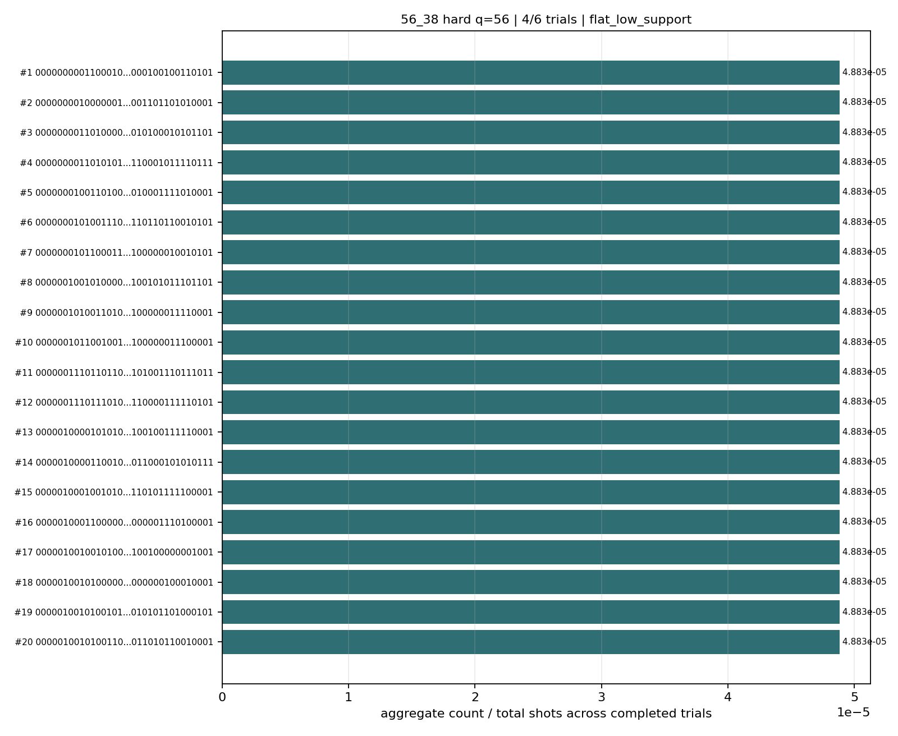
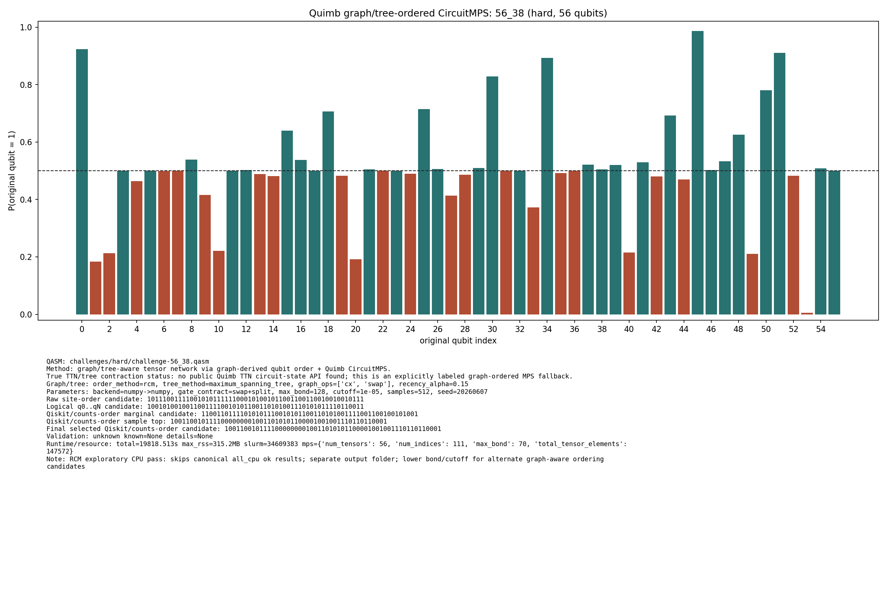

# Challenge 56_38

- Difficulty: hard
- Qubits: 56
- QASM: `challenges/hard/challenge-56_38.qasm`
- Central selected answer: `10011001011110000000010011010101100001001001110110110001`
- Selected method: `quimb_rcm_cpu`
- Selected review: none
- Candidate rows: 60
- Method runs: 18
- Distribution figures: 2

## Selected Answer Sources

| source | selected answer | method | validation | status | evidence |
|---|---|---|---|---|---:|
| tree_tensor_sim_session | `10011001011110000000010011010101100001001001110110110001` | quimb_rcm_cpu | unknown | selected | 1 |
| quantum_peak_session | `10011001011110000000010011010101100001001001110110110001` | quimb_rcm_cpu | unknown | selected | 1 |

## Method Summary

| method | family | runs | statuses | best or marked candidate | rank_type | score | fraction | review | sources |
|---|---|---:|---|---|---|---:|---:|---|---|
| aer_mps_adaptive_sweep | mps | 1 | ok | `00000000011000100110010011101100010000010000100100110101` | aggregate_candidate | 0.00025 | 4.8828125e-05 |  | mps_adaptive_sweep |
| aer_tree_mps_all | mps | 1 | ok | `01000001111100100000011111000001010111101111001000010101` | sample_top | 0.0001220703125 | 0.0001220703125 |  | tree_tensor_sim_session |
| algebraic_simplify_cxswap | heuristic | 1 | static_analysis | `01110111000010010011000100100100000001000111110000000000` | static_heuristic |  |  |  | algebraic_simplify |
| algebraic_simplify_swaponly | heuristic | 1 | static_analysis | `00000100000100010010000000000000001000000000000000000000` | static_heuristic |  |  |  | algebraic_simplify |
| collector_snapshot | collector | 2 | unknown | `10011001011110000000010011010101100001001001110110110001` | collector_selected | 0.001953125 | 0.001953125 |  | quantum_peak_session,tree_tensor_sim_session |
| peaked_mpo_mps | mpo | 2 | started |  |  |  |  |  | quantum_peak_session,tree_tensor_sim_session |
| quimb_cpu_all | quimb | 1 | started |  |  |  |  |  | tree_tensor_sim_session |
| quimb_degree_cpu | quimb | 1 | started |  |  |  |  |  | tree_tensor_sim_session |
| quimb_fast_cpu | quimb | 1 | started |  |  |  |  |  | tree_tensor_sim_session |
| quimb_gpu_all | quimb | 1 | started |  |  |  |  |  | tree_tensor_sim_session |
| quimb_identity_cpu | quimb | 1 | started |  |  |  |  |  | tree_tensor_sim_session |
| quimb_mid_cpu | quimb | 1 | started |  |  |  |  |  | tree_tensor_sim_session |
| quimb_mst_cpu | quimb | 1 | started |  |  |  |  |  | tree_tensor_sim_session |
| quimb_rcm_cpu | quimb | 2 | ok,unknown | `10011001011110000000010011010101100001001001110110110001` | final_candidate | 3.3306690738754696e-16 |  |  | quantum_peak_session,tree_tensor_sim_session |
| tno_contract_core_cpu | tno | 1 | started |  |  |  |  |  | tno_contract_core_cpu |

## Method Selector

| first action | best method | best score | MPS | TNO | MPO-unswap |
|---|---|---:|---:|---:|---:|
| MPO iterative cancellation with unswapping | MPO iterative cancellation with unswapping | 83 | 44 | 75 | 83 |

## Distribution Figures

### Adaptive Aer MPS distribution: challenge-56_38.png

### Quimb graph-ordered MPS distribution: challenge-56_38.quimb_tree_graph_mps.png

## Candidate Rows

| review | selected | method | rank_type | rank | bitstring | score | count | support | fraction | validation | status | sources | source path | notes |
|---|---:|---|---|---:|---|---:|---:|---:|---:|---|---|---|---|---|
|  | 1 | collector_snapshot | collector_selected | 1 | `10011001011110000000010011010101100001001001110110110001` | 0.001953125 |  |  | 0.001953125 | unknown | unknown | tree_tensor_sim_session | `research/tree_tensor_sim_session/artifacts/collector/CANDIDATES.tsv` | quimb_rcm_cpu |
|  | 1 | collector_snapshot | collector_selected | 1 | `10011001011110000000010011010101100001001001110110110001` | 0.001953125 |  |  | 0.001953125 | unknown | unknown | quantum_peak_session | `research/quantum_peak_session/results/current_candidates/CANDIDATES.tsv` | quimb_rcm_cpu |
|  | 1 | quimb_rcm_cpu | final_candidate | 1 | `10011001011110000000010011010101100001001001110110110001` | 3.3306690738754696e-16 |  |  |  | {"known_answer_qiskit_order":null,"status":"unknown"} | ok | tree_tensor_sim_session | `../quantum-junction-tree-tensor/outputs/tree_tensor_sim/rcm_cpu/json/challenge-56_38.quimb_tree_graph_mps.json` | - |
|  | 1 | quimb_rcm_cpu | sample_top | 1 | `10011001011110000000010011010101100001001001110110110001` | 0.001953125 | 1 |  | 0.001953125 | {"known_answer_qiskit_order":null,"status":"unknown"} | ok | tree_tensor_sim_session | `../quantum-junction-tree-tensor/outputs/tree_tensor_sim/rcm_cpu/json/challenge-56_38.quimb_tree_graph_mps.json` | - |
|  | 1 | quimb_rcm_cpu | collector_evidence | 1 | `10011001011110000000010011010101100001001001110110110001` | 0.001953125 |  |  | 0.001953125 | unknown | unknown | quantum_peak_session,tree_tensor_sim_session | `outputs/tree_tensor_sim/rcm_cpu/json/challenge-56_38.quimb_tree_graph_mps.json` | collector priority 55 |
|  | 0 | aer_mps_adaptive_sweep | aggregate_candidate | 1 | `00000000011000100110010011101100010000010000100100110101` | 0.00025 |  | 0.25 | 4.8828125e-05 | flat_low_support | ok | mps_adaptive_sweep | `agent_work/mps_adaptive_sweep/report/tables/mps_adaptive_summary.tsv` | aggregate_gap=1; exact_match=False |
|  | 0 | quimb_rcm_cpu | marginal_candidate | 1 | `11001101111010101110010101100110101001111001100100101001` | 3.3306690738754696e-16 |  |  |  | {"known_answer_qiskit_order":null,"status":"unknown"} | ok | tree_tensor_sim_session | `../quantum-junction-tree-tensor/outputs/tree_tensor_sim/rcm_cpu/json/challenge-56_38.quimb_tree_graph_mps.json` | - |
|  | 0 | aer_tree_mps_all | sample_top | 1 | `01000001111100100000011111000001010111101111001000010101` | 0.0001220703125 | 1 |  | 0.0001220703125 |  | ok | tree_tensor_sim_session | `../quantum-junction-tree-tensor/outputs/tree_tensor_sim/all/json/challenge-56_38.tree_tensor_mps.json` | - |
|  | 0 | aer_tree_mps_all | sample_top | 2 | `01000100100001101111011001101000110011110110000110101101` | 0.0001220703125 | 1 |  | 0.0001220703125 |  | ok | tree_tensor_sim_session | `../quantum-junction-tree-tensor/outputs/tree_tensor_sim/all/json/challenge-56_38.tree_tensor_mps.json` | - |
|  | 0 | quimb_rcm_cpu | sample_top | 2 | `11001100111010101110010011011000100111000001000001001111` | 0.001953125 | 1 |  | 0.001953125 | {"known_answer_qiskit_order":null,"status":"unknown"} | ok | tree_tensor_sim_session | `../quantum-junction-tree-tensor/outputs/tree_tensor_sim/rcm_cpu/json/challenge-56_38.quimb_tree_graph_mps.json` | - |
|  | 0 | aer_tree_mps_all | sample_top | 3 | `01000100111001101001110001000011000101111101000100000001` | 0.0001220703125 | 1 |  | 0.0001220703125 |  | ok | tree_tensor_sim_session | `../quantum-junction-tree-tensor/outputs/tree_tensor_sim/all/json/challenge-56_38.tree_tensor_mps.json` | - |
|  | 0 | quimb_rcm_cpu | sample_top | 3 | `11001111111110010100110011010110011011101010001010111111` | 0.001953125 | 1 |  | 0.001953125 | {"known_answer_qiskit_order":null,"status":"unknown"} | ok | tree_tensor_sim_session | `../quantum-junction-tree-tensor/outputs/tree_tensor_sim/rcm_cpu/json/challenge-56_38.quimb_tree_graph_mps.json` | - |
|  | 0 | aer_tree_mps_all | sample_top | 4 | `01000101011000110000011011111101111011011000100110100101` | 0.0001220703125 | 1 |  | 0.0001220703125 |  | ok | tree_tensor_sim_session | `../quantum-junction-tree-tensor/outputs/tree_tensor_sim/all/json/challenge-56_38.tree_tensor_mps.json` | - |
|  | 0 | quimb_rcm_cpu | sample_top | 4 | `11011100101111000001111111100110100011000101010001001011` | 0.001953125 | 1 |  | 0.001953125 | {"known_answer_qiskit_order":null,"status":"unknown"} | ok | tree_tensor_sim_session | `../quantum-junction-tree-tensor/outputs/tree_tensor_sim/rcm_cpu/json/challenge-56_38.quimb_tree_graph_mps.json` | - |
|  | 0 | aer_tree_mps_all | sample_top | 5 | `01000101100000100000011011100010101001101100100111100101` | 0.0001220703125 | 1 |  | 0.0001220703125 |  | ok | tree_tensor_sim_session | `../quantum-junction-tree-tensor/outputs/tree_tensor_sim/all/json/challenge-56_38.tree_tensor_mps.json` | - |
|  | 0 | quimb_rcm_cpu | sample_top | 5 | `10001110101100100011110101101001010111011011000110111001` | 0.001953125 | 1 |  | 0.001953125 | {"known_answer_qiskit_order":null,"status":"unknown"} | ok | tree_tensor_sim_session | `../quantum-junction-tree-tensor/outputs/tree_tensor_sim/rcm_cpu/json/challenge-56_38.quimb_tree_graph_mps.json` | - |
|  | 0 | aer_tree_mps_all | sample_top | 6 | `01001000000110001111110010100110011011110010100100110101` | 0.0001220703125 | 1 |  | 0.0001220703125 |  | ok | tree_tensor_sim_session | `../quantum-junction-tree-tensor/outputs/tree_tensor_sim/all/json/challenge-56_38.tree_tensor_mps.json` | - |
|  | 0 | quimb_rcm_cpu | sample_top | 6 | `10011010101001001100111111000000010101111000001000100001` | 0.001953125 | 1 |  | 0.001953125 | {"known_answer_qiskit_order":null,"status":"unknown"} | ok | tree_tensor_sim_session | `../quantum-junction-tree-tensor/outputs/tree_tensor_sim/rcm_cpu/json/challenge-56_38.quimb_tree_graph_mps.json` | - |
|  | 0 | aer_tree_mps_all | sample_top | 7 | `01001100001010101101111011110110111000110110100100010101` | 0.0001220703125 | 1 |  | 0.0001220703125 |  | ok | tree_tensor_sim_session | `../quantum-junction-tree-tensor/outputs/tree_tensor_sim/all/json/challenge-56_38.tree_tensor_mps.json` | - |
|  | 0 | quimb_rcm_cpu | sample_top | 7 | `00011101011110101001011010001001000010100101000010000000` | 0.001953125 | 1 |  | 0.001953125 | {"known_answer_qiskit_order":null,"status":"unknown"} | ok | tree_tensor_sim_session | `../quantum-junction-tree-tensor/outputs/tree_tensor_sim/rcm_cpu/json/challenge-56_38.quimb_tree_graph_mps.json` | - |
|  | 0 | aer_tree_mps_all | sample_top | 8 | `01001100100110101011011101110011100011101110000101000101` | 0.0001220703125 | 1 |  | 0.0001220703125 |  | ok | tree_tensor_sim_session | `../quantum-junction-tree-tensor/outputs/tree_tensor_sim/all/json/challenge-56_38.tree_tensor_mps.json` | - |
|  | 0 | quimb_rcm_cpu | sample_top | 8 | `10000100111110000001010001101110010011110010011110001001` | 0.001953125 | 1 |  | 0.001953125 | {"known_answer_qiskit_order":null,"status":"unknown"} | ok | tree_tensor_sim_session | `../quantum-junction-tree-tensor/outputs/tree_tensor_sim/rcm_cpu/json/challenge-56_38.quimb_tree_graph_mps.json` | - |
|  | 0 | aer_tree_mps_all | sample_top | 9 | `01010000001010110001111101101010001001110001011001100101` | 0.0001220703125 | 1 |  | 0.0001220703125 |  | ok | tree_tensor_sim_session | `../quantum-junction-tree-tensor/outputs/tree_tensor_sim/all/json/challenge-56_38.tree_tensor_mps.json` | - |
|  | 0 | quimb_rcm_cpu | sample_top | 9 | `01001000101010001110111110100000111011101101101011010100` | 0.001953125 | 1 |  | 0.001953125 | {"known_answer_qiskit_order":null,"status":"unknown"} | ok | tree_tensor_sim_session | `../quantum-junction-tree-tensor/outputs/tree_tensor_sim/rcm_cpu/json/challenge-56_38.quimb_tree_graph_mps.json` | - |
|  | 0 | aer_tree_mps_all | sample_top | 10 | `01010100001110001101011101000101101101101111110101110101` | 0.0001220703125 | 1 |  | 0.0001220703125 |  | ok | tree_tensor_sim_session | `../quantum-junction-tree-tensor/outputs/tree_tensor_sim/all/json/challenge-56_38.tree_tensor_mps.json` | - |
|  | 0 | quimb_rcm_cpu | sample_top | 10 | `11001111111011110000011010011010000101010000011101000001` | 0.001953125 | 1 |  | 0.001953125 | {"known_answer_qiskit_order":null,"status":"unknown"} | ok | tree_tensor_sim_session | `../quantum-junction-tree-tensor/outputs/tree_tensor_sim/rcm_cpu/json/challenge-56_38.quimb_tree_graph_mps.json` | - |
|  | 0 | aer_tree_mps_all | sample_top | 11 | `01010101001011001101001111101111011001111100110111101111` | 0.0001220703125 | 1 |  | 0.0001220703125 |  | ok | tree_tensor_sim_session | `../quantum-junction-tree-tensor/outputs/tree_tensor_sim/all/json/challenge-56_38.tree_tensor_mps.json` | - |
|  | 0 | quimb_rcm_cpu | sample_top | 11 | `00001001101010010011010101010011011001001101001110101111` | 0.001953125 | 1 |  | 0.001953125 | {"known_answer_qiskit_order":null,"status":"unknown"} | ok | tree_tensor_sim_session | `../quantum-junction-tree-tensor/outputs/tree_tensor_sim/rcm_cpu/json/challenge-56_38.quimb_tree_graph_mps.json` | - |
|  | 0 | aer_tree_mps_all | sample_top | 12 | `01010101001110100010110101101011000101011000000110100001` | 0.0001220703125 | 1 |  | 0.0001220703125 |  | ok | tree_tensor_sim_session | `../quantum-junction-tree-tensor/outputs/tree_tensor_sim/all/json/challenge-56_38.tree_tensor_mps.json` | - |
|  | 0 | quimb_rcm_cpu | sample_top | 12 | `11011101111010100111011101000111110000011001000111000001` | 0.001953125 | 1 |  | 0.001953125 | {"known_answer_qiskit_order":null,"status":"unknown"} | ok | tree_tensor_sim_session | `../quantum-junction-tree-tensor/outputs/tree_tensor_sim/rcm_cpu/json/challenge-56_38.quimb_tree_graph_mps.json` | - |
|  | 0 | aer_tree_mps_all | sample_top | 13 | `01110101001011011100111101011010111111011110000111000101` | 0.0001220703125 | 1 |  | 0.0001220703125 |  | ok | tree_tensor_sim_session | `../quantum-junction-tree-tensor/outputs/tree_tensor_sim/all/json/challenge-56_38.tree_tensor_mps.json` | - |
|  | 0 | aer_tree_mps_all | sample_top | 14 | `11000101001001110001111110111110000011011010001100100101` | 0.0001220703125 | 1 |  | 0.0001220703125 |  | ok | tree_tensor_sim_session | `../quantum-junction-tree-tensor/outputs/tree_tensor_sim/all/json/challenge-56_38.tree_tensor_mps.json` | - |
|  | 0 | aer_tree_mps_all | sample_top | 15 | `11000101110101101111001111111001100011010011011101000100` | 0.0001220703125 | 1 |  | 0.0001220703125 |  | ok | tree_tensor_sim_session | `../quantum-junction-tree-tensor/outputs/tree_tensor_sim/all/json/challenge-56_38.tree_tensor_mps.json` | - |
|  | 0 | aer_tree_mps_all | sample_top | 16 | `11001101001111011111011001001100000101000001100110110101` | 0.0001220703125 | 1 |  | 0.0001220703125 |  | ok | tree_tensor_sim_session | `../quantum-junction-tree-tensor/outputs/tree_tensor_sim/all/json/challenge-56_38.tree_tensor_mps.json` | - |
|  | 0 | aer_tree_mps_all | sample_top | 17 | `11010001101100101010111111100101110010011000001010010100` | 0.0001220703125 | 1 |  | 0.0001220703125 |  | ok | tree_tensor_sim_session | `../quantum-junction-tree-tensor/outputs/tree_tensor_sim/all/json/challenge-56_38.tree_tensor_mps.json` | - |
|  | 0 | aer_tree_mps_all | sample_top | 18 | `11010111011010101110011111001001000001001001101111001101` | 0.0001220703125 | 1 |  | 0.0001220703125 |  | ok | tree_tensor_sim_session | `../quantum-junction-tree-tensor/outputs/tree_tensor_sim/all/json/challenge-56_38.tree_tensor_mps.json` | - |
|  | 0 | aer_tree_mps_all | sample_top | 19 | `11110100101100100000010101000100111011011100100111010100` | 0.0001220703125 | 1 |  | 0.0001220703125 |  | ok | tree_tensor_sim_session | `../quantum-junction-tree-tensor/outputs/tree_tensor_sim/all/json/challenge-56_38.tree_tensor_mps.json` | - |
|  | 0 | aer_tree_mps_all | sample_top | 20 | `11110101101110000010111101111010011001011101001110110001` | 0.0001220703125 | 1 |  | 0.0001220703125 |  | ok | tree_tensor_sim_session | `../quantum-junction-tree-tensor/outputs/tree_tensor_sim/all/json/challenge-56_38.tree_tensor_mps.json` | - |
|  | 0 | aer_mps_adaptive_sweep | aggregate_top_counts | 1 | `00000000011000100110010011101100010000010000100100110101` | 0.00025 | 2 |  | 4.8828125e-05 |  | ok | mps_adaptive_sweep | `agent_work/mps_adaptive_sweep/report/tables/mps_adaptive_top_counts.tsv` |  |
|  | 0 | aer_mps_adaptive_sweep | aggregate_top_counts | 2 | `00000000100000010110100011100000000000111001101101010001` | 0.00025 | 2 |  | 4.8828125e-05 |  | ok | mps_adaptive_sweep | `agent_work/mps_adaptive_sweep/report/tables/mps_adaptive_top_counts.tsv` |  |
|  | 0 | aer_mps_adaptive_sweep | aggregate_top_counts | 3 | `00000000110100000001011001100100000011110010100010101101` | 0.00025 | 2 |  | 4.8828125e-05 |  | ok | mps_adaptive_sweep | `agent_work/mps_adaptive_sweep/report/tables/mps_adaptive_top_counts.tsv` |  |
|  | 0 | aer_mps_adaptive_sweep | aggregate_top_counts | 4 | `00000000110101010110101011011100000001110110001011110111` | 0.00025 | 2 |  | 4.8828125e-05 |  | ok | mps_adaptive_sweep | `agent_work/mps_adaptive_sweep/report/tables/mps_adaptive_top_counts.tsv` |  |
|  | 0 | aer_mps_adaptive_sweep | aggregate_top_counts | 5 | `00000001001101000110100011110000000001010010001111010001` | 0.00025 | 2 |  | 4.8828125e-05 |  | ok | mps_adaptive_sweep | `agent_work/mps_adaptive_sweep/report/tables/mps_adaptive_top_counts.tsv` |  |
|  | 0 | aer_mps_adaptive_sweep | aggregate_top_counts | 6 | `00000001010011101100011111010111100101110110110110010101` | 0.00025 | 2 |  | 4.8828125e-05 |  | ok | mps_adaptive_sweep | `agent_work/mps_adaptive_sweep/report/tables/mps_adaptive_top_counts.tsv` |  |
|  | 0 | aer_mps_adaptive_sweep | aggregate_top_counts | 7 | `00000001011000111011110001101000001101101100000010010101` | 0.00025 | 2 |  | 4.8828125e-05 |  | ok | mps_adaptive_sweep | `agent_work/mps_adaptive_sweep/report/tables/mps_adaptive_top_counts.tsv` |  |
|  | 0 | aer_mps_adaptive_sweep | aggregate_top_counts | 8 | `00000010010100000011011101101010000011000100101011101101` | 0.00025 | 2 |  | 4.8828125e-05 |  | ok | mps_adaptive_sweep | `agent_work/mps_adaptive_sweep/report/tables/mps_adaptive_top_counts.tsv` |  |
|  | 0 | aer_mps_adaptive_sweep | aggregate_top_counts | 9 | `00000010100110101001110001100111000000111100000011110001` | 0.00025 | 2 |  | 4.8828125e-05 |  | ok | mps_adaptive_sweep | `agent_work/mps_adaptive_sweep/report/tables/mps_adaptive_top_counts.tsv` |  |
|  | 0 | aer_mps_adaptive_sweep | aggregate_top_counts | 10 | `00000010110010011100110011010110000000110100000011100001` | 0.00025 | 2 |  | 4.8828125e-05 |  | ok | mps_adaptive_sweep | `agent_work/mps_adaptive_sweep/report/tables/mps_adaptive_top_counts.tsv` |  |
|  | 0 | aer_mps_adaptive_sweep | aggregate_top_counts | 11 | `00000011101101100011010011110110000110111101001110111011` | 0.00025 | 2 |  | 4.8828125e-05 |  | ok | mps_adaptive_sweep | `agent_work/mps_adaptive_sweep/report/tables/mps_adaptive_top_counts.tsv` |  |
|  | 0 | aer_mps_adaptive_sweep | aggregate_top_counts | 12 | `00000011101110101100101011111000001100111110000111110101` | 0.00025 | 2 |  | 4.8828125e-05 |  | ok | mps_adaptive_sweep | `agent_work/mps_adaptive_sweep/report/tables/mps_adaptive_top_counts.tsv` |  |
|  | 0 | aer_mps_adaptive_sweep | aggregate_top_counts | 13 | `00000100001010100101000010101010001001011100100111110001` | 0.00025 | 2 |  | 4.8828125e-05 |  | ok | mps_adaptive_sweep | `agent_work/mps_adaptive_sweep/report/tables/mps_adaptive_top_counts.tsv` |  |
|  | 0 | aer_mps_adaptive_sweep | aggregate_top_counts | 14 | `00000100001100101101111011111100010101111011000101010111` | 0.00025 | 2 |  | 4.8828125e-05 |  | ok | mps_adaptive_sweep | `agent_work/mps_adaptive_sweep/report/tables/mps_adaptive_top_counts.tsv` |  |
|  | 0 | aer_mps_adaptive_sweep | aggregate_top_counts | 15 | `00000100010010100000110101100010110001011110101111100001` | 0.00025 | 2 |  | 4.8828125e-05 |  | ok | mps_adaptive_sweep | `agent_work/mps_adaptive_sweep/report/tables/mps_adaptive_top_counts.tsv` |  |
|  | 0 | aer_mps_adaptive_sweep | aggregate_top_counts | 16 | `00000100011000000000001101010010001001110000001110100001` | 0.00025 | 2 |  | 4.8828125e-05 |  | ok | mps_adaptive_sweep | `agent_work/mps_adaptive_sweep/report/tables/mps_adaptive_top_counts.tsv` |  |
|  | 0 | aer_mps_adaptive_sweep | aggregate_top_counts | 17 | `00000100100101000011001101110101001111001100100000001001` | 0.00025 | 2 |  | 4.8828125e-05 |  | ok | mps_adaptive_sweep | `agent_work/mps_adaptive_sweep/report/tables/mps_adaptive_top_counts.tsv` |  |
|  | 0 | aer_mps_adaptive_sweep | aggregate_top_counts | 18 | `00000100101000000011110001101010000111101000000100010001` | 0.00025 | 2 |  | 4.8828125e-05 |  | ok | mps_adaptive_sweep | `agent_work/mps_adaptive_sweep/report/tables/mps_adaptive_top_counts.tsv` |  |
|  | 0 | aer_mps_adaptive_sweep | aggregate_top_counts | 19 | `00000100101001010110100010111001010001010010101101000101` | 0.00025 | 2 |  | 4.8828125e-05 |  | ok | mps_adaptive_sweep | `agent_work/mps_adaptive_sweep/report/tables/mps_adaptive_top_counts.tsv` |  |
|  | 0 | aer_mps_adaptive_sweep | aggregate_top_counts | 20 | `00000100101001100011010101010111010101011011010110010001` | 0.00025 | 2 |  | 4.8828125e-05 |  | ok | mps_adaptive_sweep | `agent_work/mps_adaptive_sweep/report/tables/mps_adaptive_top_counts.tsv` |  |
|  | 0 | algebraic_simplify_cxswap | static_heuristic | 1 | `01110111000010010011000100100100000001000111110000000000` |  |  |  |  | heuristic_only | heuristic | algebraic_simplify | `agent_work/algebraic_simplify/summary.csv` | exact_available_match= |
|  | 0 | algebraic_simplify_swaponly | static_heuristic | 1 | `00000100000100010010000000000000001000000000000000000000` |  |  |  |  | heuristic_only | heuristic | algebraic_simplify | `agent_work/algebraic_simplify/summary.csv` | exact_available_match= |

## Method Runs

| method | run_id | status | backend | shots | max_bond | seconds | source path | notes |
|---|---|---|---|---:|---:|---:|---|---|
| aer_mps_adaptive_sweep | adaptive_sweep_aggregate | ok |  | 40960 | 64 |  | `agent_work/mps_adaptive_sweep/report/tables/mps_adaptive_summary.tsv` | classification=flat_low_support; completed=4/6; exact_match=False; matches_previous=False; settings=baseline:4096/bd64x2; more_shots:16384/bd64x2 |
| aer_tree_mps_all | challenge-56_38.tree_tensor_mps:trial1:rcm:bd64:seed20260605 | ok |  | 8192 | 64 | 267.5161918369122 | `../quantum-junction-tree-tensor/outputs/tree_tensor_sim/all/json/challenge-56_38.tree_tensor_mps.json` | graph_ordered_mps_fallback |
| algebraic_simplify_cxswap | static_summary | static_analysis |  |  |  |  | `agent_work/algebraic_simplify/summary.csv` | linear_windows=1626; snapped=2533 |
| algebraic_simplify_swaponly | static_summary | static_analysis |  |  |  |  | `agent_work/algebraic_simplify/summary.csv` | linear_windows=1626; snapped=2533 |
| collector_snapshot | collector_selected:56_38 | unknown |  |  |  |  | `research/quantum_peak_session/results/current_candidates/CANDIDATES.tsv` | selected from quimb_rcm_cpu |
| collector_snapshot | collector_selected:56_38 | unknown |  |  |  |  | `research/tree_tensor_sim_session/artifacts/collector/CANDIDATES.tsv` | selected from quimb_rcm_cpu |
| peaked_mpo_mps | challenge-56_38.peaked_mpo_mps | started |  |  | 512 |  | `../quantum-junction-tree-tensor/outputs/peaked_circuit_sim_all/json/challenge-56_38.peaked_mpo_mps.json` | peaked circuit MPO/MPS marginal candidate |
| peaked_mpo_mps | challenge-56_38.peaked_mpo_mps | started |  |  | 512 |  | `outputs/peaked_circuit_sim_all/json/challenge-56_38.peaked_mpo_mps.json` | peaked circuit MPO/MPS marginal candidate |
| quimb_cpu_all | challenge-56_38.quimb_tree_graph_mps | started |  | 1024 | 512 |  | `../quantum-junction-tree-tensor/outputs/tree_tensor_sim/all_cpu/json/challenge-56_38.quimb_tree_graph_mps.json` | graph_ordered_mps_fallback |
| quimb_degree_cpu | challenge-56_38.quimb_tree_graph_mps | started |  | 512 | 128 |  | `../quantum-junction-tree-tensor/outputs/tree_tensor_sim/degree_cpu/json/challenge-56_38.quimb_tree_graph_mps.json` | graph_ordered_mps_fallback |
| quimb_fast_cpu | challenge-56_38.quimb_tree_graph_mps | started |  | 512 | 128 |  | `../quantum-junction-tree-tensor/outputs/tree_tensor_sim/fast_cpu/json/challenge-56_38.quimb_tree_graph_mps.json` | graph_ordered_mps_fallback |
| quimb_gpu_all | challenge-56_38.quimb_tree_graph_mps | started |  | 1024 | 512 |  | `../quantum-junction-tree-tensor/outputs/tree_tensor_sim/all/json/challenge-56_38.quimb_tree_graph_mps.json` | graph_ordered_mps_fallback |
| quimb_identity_cpu | challenge-56_38.quimb_tree_graph_mps | started |  | 512 | 128 |  | `../quantum-junction-tree-tensor/outputs/tree_tensor_sim/identity_cpu/json/challenge-56_38.quimb_tree_graph_mps.json` | graph_ordered_mps_fallback |
| quimb_mid_cpu | challenge-56_38.quimb_tree_graph_mps | started |  | 1024 | 256 |  | `../quantum-junction-tree-tensor/outputs/tree_tensor_sim/mid_cpu/json/challenge-56_38.quimb_tree_graph_mps.json` | graph_ordered_mps_fallback |
| quimb_mst_cpu | challenge-56_38.quimb_tree_graph_mps | started |  | 512 | 128 |  | `../quantum-junction-tree-tensor/outputs/tree_tensor_sim/mst_cpu/json/challenge-56_38.quimb_tree_graph_mps.json` | graph_ordered_mps_fallback |
| quimb_rcm_cpu | challenge-56_38.quimb_tree_graph_mps | ok | numpy | 512 | 128 | 19818.51346176816 | `../quantum-junction-tree-tensor/outputs/tree_tensor_sim/rcm_cpu/json/challenge-56_38.quimb_tree_graph_mps.json` | graph_ordered_mps_fallback |
| quimb_rcm_cpu | collector_evidence:56_38:1 | unknown |  |  | 70 | 19818.51346176816 | `outputs/tree_tensor_sim/rcm_cpu/json/challenge-56_38.quimb_tree_graph_mps.json` | collector priority 55 |
| tno_contract_core_cpu | challenge-56_38.tno | started | numpy |  | 32 |  | `outputs/tno_sim_cpu/json/challenge-56_38.tno.json` | local-late |
