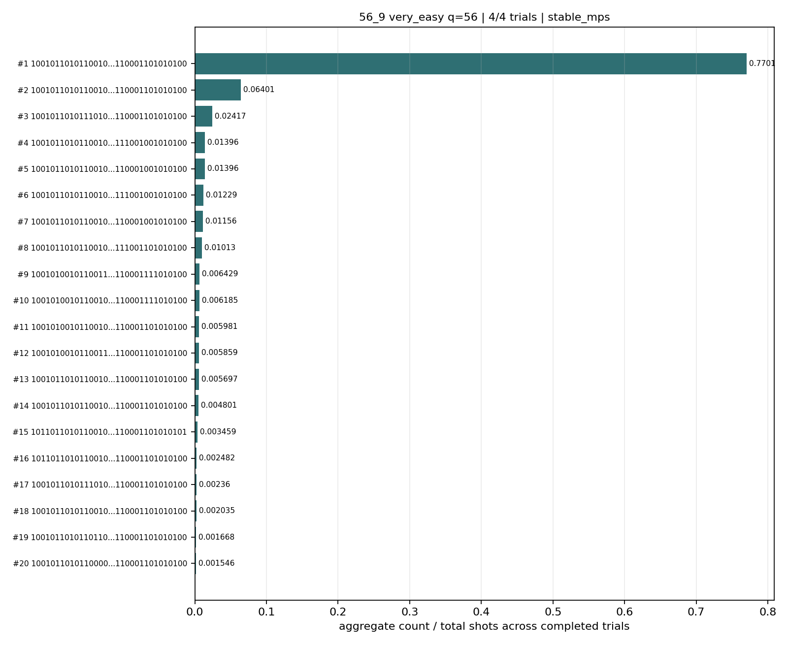

# Challenge 56_9

- Difficulty: very easy
- Qubits: 56
- QASM: `challenges/very easy/challenge-56_9.qasm`
- Central selected answer: `10010110101100101110100110010110011101100110001101010100`
- Selected method: `quimb_cpu_all`
- Selected review: none
- Candidate rows: 40
- Method runs: 7
- Distribution figures: 2

## Selected Answer Sources

| source | selected answer | method | validation | status | evidence |
|---|---|---|---|---|---:|
| tree_tensor_sim_session | `10010110101100101110100110010110011101100110001101010100` | quimb_cpu_all | unknown | selected | 1 |
| quantum_peak_session | `10010110101100101110100110010110011101100110001101010100` | quimb_cpu_all | unknown | selected | 1 |

## Method Summary

| method | family | runs | statuses | best or marked candidate | rank_type | score | fraction | review | sources |
|---|---|---:|---|---|---|---:|---:|---|---|
| aer_mps_adaptive_sweep | mps | 1 | ok | `10010110101100101110100110010110011101100110001101010100` | aggregate_candidate | 0.77010091 | 0.77010091 |  | mps_adaptive_sweep |
| algebraic_simplify_cxswap | heuristic | 1 | static_analysis | `00010100100100101110100010010010011101110100011111010110` | static_heuristic |  |  |  | algebraic_simplify |
| algebraic_simplify_swaponly | heuristic | 1 | static_analysis | `11010110000100101010100010010010011100000101011001010110` | static_heuristic |  |  |  | algebraic_simplify |
| collector_snapshot | collector | 2 | unknown | `10010110101100101110100110010110011101100110001101010100` | collector_selected | 0.78125 | 0.78125 |  | quantum_peak_session,tree_tensor_sim_session |
| quimb_cpu_all | quimb | 2 | ok,unknown | `10010110101100101110100110010110011101100110001101010100` | final_candidate | 0.4172918184722778 |  |  | quantum_peak_session,tree_tensor_sim_session |

## Method Selector

| first action | best method | best score | MPS | TNO | MPO-unswap |
|---|---|---:|---:|---:|---:|
| Low-bond MPS with bitstring distillation | Low-bond MPS with bitstring distillation | 86 | 86 | 67 | 27 |

## Distribution Figures

### Adaptive Aer MPS distribution: challenge-56_9.png

### Quimb graph-ordered MPS distribution: challenge-56_9.quimb_tree_graph_mps.png

## Candidate Rows

| review | selected | method | rank_type | rank | bitstring | score | count | support | fraction | validation | status | sources | source path | notes |
|---|---:|---|---|---:|---|---:|---:|---:|---:|---|---|---|---|---|
|  | 1 | collector_snapshot | collector_selected | 1 | `10010110101100101110100110010110011101100110001101010100` | 0.78125 |  |  | 0.78125 | unknown | unknown | tree_tensor_sim_session | `research/tree_tensor_sim_session/artifacts/collector/CANDIDATES.tsv` | quimb_cpu_all |
|  | 1 | collector_snapshot | collector_selected | 1 | `10010110101100101110100110010110011101100110001101010100` | 0.78125 |  |  | 0.78125 | unknown | unknown | quantum_peak_session | `research/quantum_peak_session/results/current_candidates/CANDIDATES.tsv` | quimb_cpu_all |
|  | 1 | quimb_cpu_all | final_candidate | 1 | `10010110101100101110100110010110011101100110001101010100` | 0.4172918184722778 |  |  |  | {"known_answer_qiskit_order":null,"status":"unknown"} | ok | tree_tensor_sim_session | `../quantum-junction-tree-tensor/outputs/tree_tensor_sim/all_cpu/json/challenge-56_9.quimb_tree_graph_mps.json` | - |
|  | 1 | aer_mps_adaptive_sweep | aggregate_candidate | 1 | `10010110101100101110100110010110011101100110001101010100` | 0.77010091 |  | 1 | 0.77010091 | stable_mps | ok | mps_adaptive_sweep | `agent_work/mps_adaptive_sweep/report/tables/mps_adaptive_summary.tsv` | aggregate_gap=12.0318; exact_match=False |
|  | 1 | quimb_cpu_all | marginal_candidate | 1 | `10010110101100101110100110010110011101100110001101010100` | 0.4172918184722778 |  |  |  | {"known_answer_qiskit_order":null,"status":"unknown"} | ok | tree_tensor_sim_session | `../quantum-junction-tree-tensor/outputs/tree_tensor_sim/all_cpu/json/challenge-56_9.quimb_tree_graph_mps.json` | - |
|  | 1 | quimb_cpu_all | sample_top | 1 | `10010110101100101110100110010110011101100110001101010100` | 0.78125 | 800 |  | 0.78125 | {"known_answer_qiskit_order":null,"status":"unknown"} | ok | tree_tensor_sim_session | `../quantum-junction-tree-tensor/outputs/tree_tensor_sim/all_cpu/json/challenge-56_9.quimb_tree_graph_mps.json` | - |
|  | 1 | aer_mps_adaptive_sweep | aggregate_top_counts | 1 | `10010110101100101110100110010110011101100110001101010100` | 0.77010091 | 18926 |  | 0.77010091 |  | ok | mps_adaptive_sweep | `agent_work/mps_adaptive_sweep/report/tables/mps_adaptive_top_counts.tsv` |  |
|  | 1 | quimb_cpu_all | collector_evidence | 1 | `10010110101100101110100110010110011101100110001101010100` | 0.78125 |  |  | 0.78125 | unknown | unknown | quantum_peak_session,tree_tensor_sim_session | `outputs/tree_tensor_sim/all_cpu/json/challenge-56_9.quimb_tree_graph_mps.json` | collector priority 80 |
|  | 0 | quimb_cpu_all | sample_top | 2 | `10010110101100101110100110010110011111100110001101010100` | 0.0712890625 | 73 |  | 0.0712890625 | {"known_answer_qiskit_order":null,"status":"unknown"} | ok | tree_tensor_sim_session | `../quantum-junction-tree-tensor/outputs/tree_tensor_sim/all_cpu/json/challenge-56_9.quimb_tree_graph_mps.json` | - |
|  | 0 | quimb_cpu_all | sample_top | 3 | `10010110101110101110100110010110011101100110001101010100` | 0.0234375 | 24 |  | 0.0234375 | {"known_answer_qiskit_order":null,"status":"unknown"} | ok | tree_tensor_sim_session | `../quantum-junction-tree-tensor/outputs/tree_tensor_sim/all_cpu/json/challenge-56_9.quimb_tree_graph_mps.json` | - |
|  | 0 | quimb_cpu_all | sample_top | 4 | `10010110101100101110100110110110011101100111001001010100` | 0.0126953125 | 13 |  | 0.0126953125 | {"known_answer_qiskit_order":null,"status":"unknown"} | ok | tree_tensor_sim_session | `../quantum-junction-tree-tensor/outputs/tree_tensor_sim/all_cpu/json/challenge-56_9.quimb_tree_graph_mps.json` | - |
|  | 0 | quimb_cpu_all | sample_top | 5 | `10010110101100101110100110110110011101100110001001010100` | 0.0126953125 | 13 |  | 0.0126953125 | {"known_answer_qiskit_order":null,"status":"unknown"} | ok | tree_tensor_sim_session | `../quantum-junction-tree-tensor/outputs/tree_tensor_sim/all_cpu/json/challenge-56_9.quimb_tree_graph_mps.json` | - |
|  | 0 | quimb_cpu_all | sample_top | 6 | `10010110101100101110100110010110011101100111001001010100` | 0.0126953125 | 13 |  | 0.0126953125 | {"known_answer_qiskit_order":null,"status":"unknown"} | ok | tree_tensor_sim_session | `../quantum-junction-tree-tensor/outputs/tree_tensor_sim/all_cpu/json/challenge-56_9.quimb_tree_graph_mps.json` | - |
|  | 0 | quimb_cpu_all | sample_top | 7 | `10010110101100101110100110010110011101100110001001010100` | 0.01171875 | 12 |  | 0.01171875 | {"known_answer_qiskit_order":null,"status":"unknown"} | ok | tree_tensor_sim_session | `../quantum-junction-tree-tensor/outputs/tree_tensor_sim/all_cpu/json/challenge-56_9.quimb_tree_graph_mps.json` | - |
|  | 0 | quimb_cpu_all | sample_top | 8 | `10010100101100111110100110010110011101100110001111010100` | 0.005859375 | 6 |  | 0.005859375 | {"known_answer_qiskit_order":null,"status":"unknown"} | ok | tree_tensor_sim_session | `../quantum-junction-tree-tensor/outputs/tree_tensor_sim/all_cpu/json/challenge-56_9.quimb_tree_graph_mps.json` | - |
|  | 0 | quimb_cpu_all | sample_top | 9 | `10010110101100101110100110010110011111000110001101010100` | 0.005859375 | 6 |  | 0.005859375 | {"known_answer_qiskit_order":null,"status":"unknown"} | ok | tree_tensor_sim_session | `../quantum-junction-tree-tensor/outputs/tree_tensor_sim/all_cpu/json/challenge-56_9.quimb_tree_graph_mps.json` | - |
|  | 0 | quimb_cpu_all | sample_top | 10 | `10010110101100101110100110010110011101100111001101010100` | 0.0048828125 | 5 |  | 0.0048828125 | {"known_answer_qiskit_order":null,"status":"unknown"} | ok | tree_tensor_sim_session | `../quantum-junction-tree-tensor/outputs/tree_tensor_sim/all_cpu/json/challenge-56_9.quimb_tree_graph_mps.json` | - |
|  | 0 | quimb_cpu_all | sample_top | 11 | `10010110101100101110100110010110011100100110001101010100` | 0.0048828125 | 5 |  | 0.0048828125 | {"known_answer_qiskit_order":null,"status":"unknown"} | ok | tree_tensor_sim_session | `../quantum-junction-tree-tensor/outputs/tree_tensor_sim/all_cpu/json/challenge-56_9.quimb_tree_graph_mps.json` | - |
|  | 0 | quimb_cpu_all | sample_top | 12 | `10010100101100111110100110010110011101100110001101010100` | 0.0048828125 | 5 |  | 0.0048828125 | {"known_answer_qiskit_order":null,"status":"unknown"} | ok | tree_tensor_sim_session | `../quantum-junction-tree-tensor/outputs/tree_tensor_sim/all_cpu/json/challenge-56_9.quimb_tree_graph_mps.json` | - |
|  | 0 | aer_mps_adaptive_sweep | aggregate_top_counts | 2 | `10010110101100101110100110010110011111100110001101010100` | 0.064005534 | 1573 |  | 0.064005534 |  | ok | mps_adaptive_sweep | `agent_work/mps_adaptive_sweep/report/tables/mps_adaptive_top_counts.tsv` |  |
|  | 0 | aer_mps_adaptive_sweep | aggregate_top_counts | 3 | `10010110101110101110100110010110011101100110001101010100` | 0.024169922 | 594 |  | 0.024169922 |  | ok | mps_adaptive_sweep | `agent_work/mps_adaptive_sweep/report/tables/mps_adaptive_top_counts.tsv` |  |
|  | 0 | aer_mps_adaptive_sweep | aggregate_top_counts | 4 | `10010110101100101110100110010110011101100111001001010100` | 0.013956706 | 343 |  | 0.013956706 |  | ok | mps_adaptive_sweep | `agent_work/mps_adaptive_sweep/report/tables/mps_adaptive_top_counts.tsv` |  |
|  | 0 | aer_mps_adaptive_sweep | aggregate_top_counts | 5 | `10010110101100101110100110010110011101100110001001010100` | 0.013956706 | 343 |  | 0.013956706 |  | ok | mps_adaptive_sweep | `agent_work/mps_adaptive_sweep/report/tables/mps_adaptive_top_counts.tsv` |  |
|  | 0 | aer_mps_adaptive_sweep | aggregate_top_counts | 6 | `10010110101100101110100110110110011101100111001001010100` | 0.012288411 | 302 |  | 0.012288411 |  | ok | mps_adaptive_sweep | `agent_work/mps_adaptive_sweep/report/tables/mps_adaptive_top_counts.tsv` |  |
|  | 0 | aer_mps_adaptive_sweep | aggregate_top_counts | 7 | `10010110101100101110100110110110011101100110001001010100` | 0.01155599 | 284 |  | 0.01155599 |  | ok | mps_adaptive_sweep | `agent_work/mps_adaptive_sweep/report/tables/mps_adaptive_top_counts.tsv` |  |
|  | 0 | aer_mps_adaptive_sweep | aggregate_top_counts | 8 | `10010110101100101110100110010110011101100111001101010100` | 0.010131836 | 249 |  | 0.010131836 |  | ok | mps_adaptive_sweep | `agent_work/mps_adaptive_sweep/report/tables/mps_adaptive_top_counts.tsv` |  |
|  | 0 | aer_mps_adaptive_sweep | aggregate_top_counts | 9 | `10010100101100111110100110010110011101100110001111010100` | 0.0064290365 | 158 |  | 0.0064290365 |  | ok | mps_adaptive_sweep | `agent_work/mps_adaptive_sweep/report/tables/mps_adaptive_top_counts.tsv` |  |
|  | 0 | aer_mps_adaptive_sweep | aggregate_top_counts | 10 | `10010100101100101110100110010110011101100110001111010100` | 0.0061848958 | 152 |  | 0.0061848958 |  | ok | mps_adaptive_sweep | `agent_work/mps_adaptive_sweep/report/tables/mps_adaptive_top_counts.tsv` |  |
|  | 0 | aer_mps_adaptive_sweep | aggregate_top_counts | 11 | `10010100101100101110100110010110011101100110001101010100` | 0.0059814453 | 147 |  | 0.0059814453 |  | ok | mps_adaptive_sweep | `agent_work/mps_adaptive_sweep/report/tables/mps_adaptive_top_counts.tsv` |  |
|  | 0 | aer_mps_adaptive_sweep | aggregate_top_counts | 12 | `10010100101100111110100110010110011101100110001101010100` | 0.005859375 | 144 |  | 0.005859375 |  | ok | mps_adaptive_sweep | `agent_work/mps_adaptive_sweep/report/tables/mps_adaptive_top_counts.tsv` |  |
|  | 0 | aer_mps_adaptive_sweep | aggregate_top_counts | 13 | `10010110101100101110100110010110011111000110001101010100` | 0.0056966146 | 140 |  | 0.0056966146 |  | ok | mps_adaptive_sweep | `agent_work/mps_adaptive_sweep/report/tables/mps_adaptive_top_counts.tsv` |  |
|  | 0 | aer_mps_adaptive_sweep | aggregate_top_counts | 14 | `10010110101100101110100110010110011100100110001101010100` | 0.0048014323 | 118 |  | 0.0048014323 |  | ok | mps_adaptive_sweep | `agent_work/mps_adaptive_sweep/report/tables/mps_adaptive_top_counts.tsv` |  |
|  | 0 | aer_mps_adaptive_sweep | aggregate_top_counts | 15 | `10110110101100101110100110010110011101100110001101010101` | 0.0034586589 | 85 |  | 0.0034586589 |  | ok | mps_adaptive_sweep | `agent_work/mps_adaptive_sweep/report/tables/mps_adaptive_top_counts.tsv` |  |
|  | 0 | aer_mps_adaptive_sweep | aggregate_top_counts | 16 | `10110110101100101110100110010110011101100110001101010100` | 0.0024820964 | 61 |  | 0.0024820964 |  | ok | mps_adaptive_sweep | `agent_work/mps_adaptive_sweep/report/tables/mps_adaptive_top_counts.tsv` |  |
|  | 0 | aer_mps_adaptive_sweep | aggregate_top_counts | 17 | `10010110101110101110100110010110011111100110001101010100` | 0.002360026 | 58 |  | 0.002360026 |  | ok | mps_adaptive_sweep | `agent_work/mps_adaptive_sweep/report/tables/mps_adaptive_top_counts.tsv` |  |
|  | 0 | aer_mps_adaptive_sweep | aggregate_top_counts | 18 | `10010110101100101110100010010110011101100110001101010100` | 0.0020345052 | 50 |  | 0.0020345052 |  | ok | mps_adaptive_sweep | `agent_work/mps_adaptive_sweep/report/tables/mps_adaptive_top_counts.tsv` |  |
|  | 0 | aer_mps_adaptive_sweep | aggregate_top_counts | 19 | `10010110101101101110100110010110011101100110001101010100` | 0.0016682943 | 41 |  | 0.0016682943 |  | ok | mps_adaptive_sweep | `agent_work/mps_adaptive_sweep/report/tables/mps_adaptive_top_counts.tsv` |  |
|  | 0 | aer_mps_adaptive_sweep | aggregate_top_counts | 20 | `10010110101100001110100110000110011101100110001101010100` | 0.001546224 | 38 |  | 0.001546224 |  | ok | mps_adaptive_sweep | `agent_work/mps_adaptive_sweep/report/tables/mps_adaptive_top_counts.tsv` |  |
|  | 0 | algebraic_simplify_cxswap | static_heuristic | 1 | `00010100100100101110100010010010011101110100011111010110` |  |  |  |  | heuristic_only | heuristic | algebraic_simplify | `agent_work/algebraic_simplify/summary.csv` | exact_available_match= |
|  | 0 | algebraic_simplify_swaponly | static_heuristic | 1 | `11010110000100101010100010010010011100000101011001010110` |  |  |  |  | heuristic_only | heuristic | algebraic_simplify | `agent_work/algebraic_simplify/summary.csv` | exact_available_match= |

## Method Runs

| method | run_id | status | backend | shots | max_bond | seconds | source path | notes |
|---|---|---|---|---:|---:|---:|---|---|
| aer_mps_adaptive_sweep | adaptive_sweep_aggregate | ok |  | 24576 | 64 |  | `agent_work/mps_adaptive_sweep/report/tables/mps_adaptive_summary.tsv` | classification=stable_mps; completed=4/4; exact_match=False; matches_previous=True; settings=cheap_check:4096/bd32x2; confirm:8192/bd64x2 |
| algebraic_simplify_cxswap | static_summary | static_analysis |  |  |  |  | `agent_work/algebraic_simplify/summary.csv` | linear_windows=82; snapped=144 |
| algebraic_simplify_swaponly | static_summary | static_analysis |  |  |  |  | `agent_work/algebraic_simplify/summary.csv` | linear_windows=82; snapped=144 |
| collector_snapshot | collector_selected:56_9 | unknown |  |  |  |  | `research/quantum_peak_session/results/current_candidates/CANDIDATES.tsv` | selected from quimb_cpu_all |
| collector_snapshot | collector_selected:56_9 | unknown |  |  |  |  | `research/tree_tensor_sim_session/artifacts/collector/CANDIDATES.tsv` | selected from quimb_cpu_all |
| quimb_cpu_all | challenge-56_9.quimb_tree_graph_mps | ok | numpy | 1024 | 512 | 19.62739471020177 | `../quantum-junction-tree-tensor/outputs/tree_tensor_sim/all_cpu/json/challenge-56_9.quimb_tree_graph_mps.json` | graph_ordered_mps_fallback |
| quimb_cpu_all | collector_evidence:56_9:1 | unknown |  |  | 10 | 19.62739471020177 | `outputs/tree_tensor_sim/all_cpu/json/challenge-56_9.quimb_tree_graph_mps.json` | collector priority 80 |
