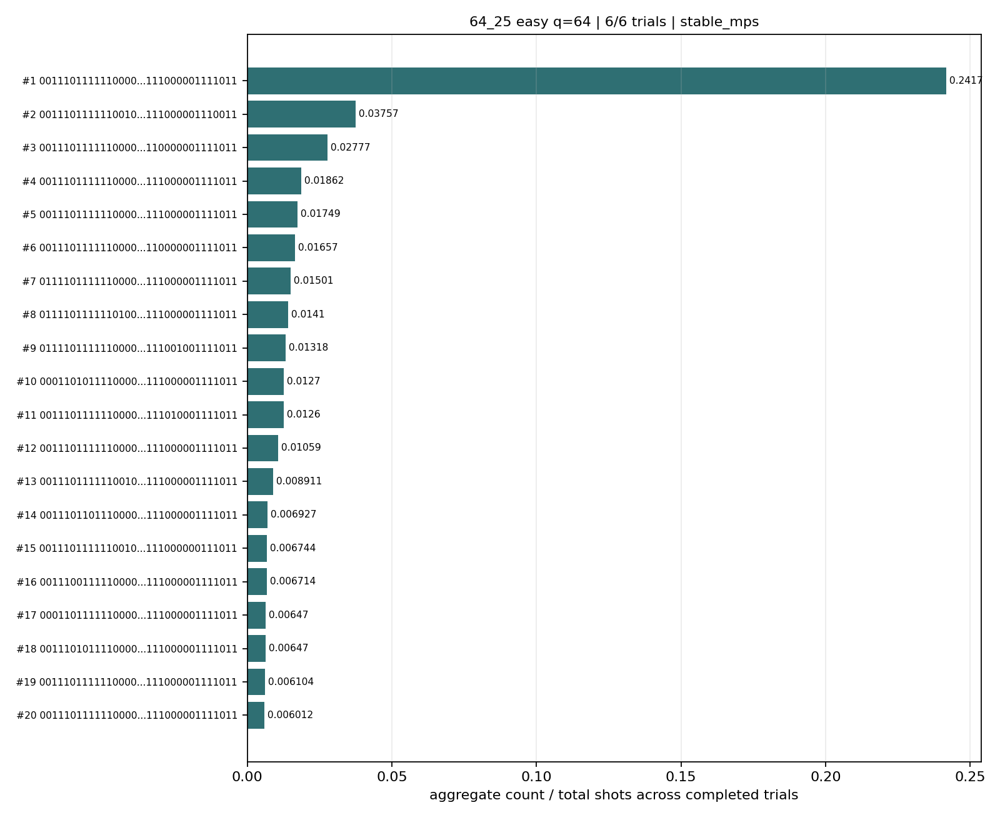
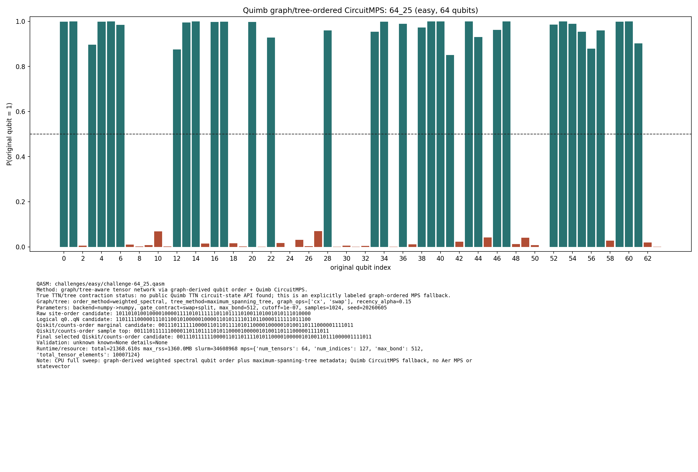
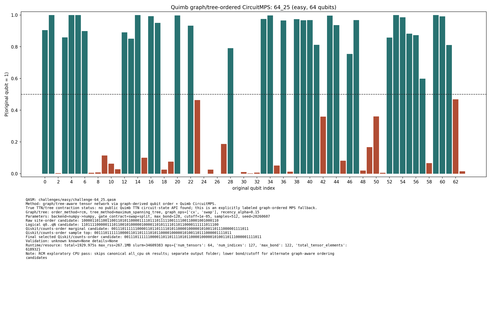

# Challenge 64_25

- Difficulty: easy
- Qubits: 64
- QASM: `challenges/easy/challenge-64_25.qasm`
- Central selected answer: `0011101111110000110110111101011000010000010100110111000001111011`
- Selected method: `quimb_gpu_all`
- Selected review: none
- Candidate rows: 99
- Method runs: 19
- Distribution figures: 4

## Selected Answer Sources

| source | selected answer | method | validation | status | evidence |
|---|---|---|---|---|---:|
| tree_tensor_sim_session | `0011101111110000110110111101011000010000010100110111000001111011` | quimb_gpu_all | unknown | selected | 4 |
| quantum_peak_session | `0011101111110000110110111101011000010000010100110111000001111011` | quimb_gpu_all | unknown | selected | 3 |

## Method Summary

| method | family | runs | statuses | best or marked candidate | rank_type | score | fraction | review | sources |
|---|---|---:|---|---|---|---:|---:|---|---|
| aer_mps_adaptive_sweep | mps | 1 | ok | `0011101111110000110110111101011000010000010100110111000001111011` | aggregate_candidate | 0.26804089 | 0.2416687 |  | mps_adaptive_sweep |
| aer_tree_mps_all | mps | 1 | ok | `0011101111110000110110111101011000010000010100110111000001111011` | sample_top | 0.1251220703125 | 0.1251220703125 |  | tree_tensor_sim_session |
| algebraic_simplify_cxswap | heuristic | 1 | static_analysis | `0000100000000000000000000000000000000000000001000000001000001000` | static_heuristic |  |  |  | algebraic_simplify |
| algebraic_simplify_swaponly | heuristic | 1 | static_analysis | `0000000000100000000000000000000000000000000001000000000000001000` | static_heuristic |  |  |  | algebraic_simplify |
| collector_snapshot | collector | 2 | unknown | `0011101111110000110110111101011000010000010100110111000001111011` | collector_selected | 0.396484375 | 0.396484375 |  | quantum_peak_session,tree_tensor_sim_session |
| peaked_mpo_mps | mpo | 2 | started |  |  |  |  |  | quantum_peak_session,tree_tensor_sim_session |
| quimb_cpu_all | quimb | 2 | ok,unknown | `0011101111110000110110111101011000010000010100110111000001111011` | final_candidate | 0.3502945693135563 |  |  | quantum_peak_session,tree_tensor_sim_session |
| quimb_fast_cpu | quimb | 1 | started |  |  |  |  |  | tree_tensor_sim_session |
| quimb_gpu_all | quimb | 2 | ok,unknown | `0011101111110000110110111101011000010000010100110111000001111011` | final_candidate | 0.3503063138947825 |  |  | quantum_peak_session,tree_tensor_sim_session |
| quimb_mst_cpu | quimb | 1 | started |  |  |  |  |  | tree_tensor_sim_session |
| quimb_rcm_cpu | quimb | 2 | ok,unknown | `0011101111110000110110111101011000010000010100110111000001111011` | final_candidate | 0.031492312195338656 |  |  | quantum_peak_session,tree_tensor_sim_session |
| sparse_beam | other | 2 | ok,unknown | `0111011001100010011000001100001010000011110010010111100000101110` | sparse_beam | 5.3908281701184984e-48 |  |  | tree_tensor_sim_session |
| tno_contract_core_cpu | tno | 1 | started |  |  |  |  |  | tno_contract_core_cpu |

## Method Selector

| first action | best method | best score | MPS | TNO | MPO-unswap |
|---|---|---:|---:|---:|---:|
| Low-bond MPS with bitstring distillation | Low-bond MPS with bitstring distillation | 90 | 90 | 82 | 43 |

## Distribution Figures

### Adaptive Aer MPS distribution: challenge-64_25.png

### Quimb graph-ordered MPS distribution: challenge-64_25.quimb_tree_graph_mps.png

### Quimb graph-ordered MPS distribution: challenge-64_25.quimb_tree_graph_mps.png

### Quimb graph-ordered MPS distribution: challenge-64_25.quimb_tree_graph_mps.png

## Candidate Rows

| review | selected | method | rank_type | rank | bitstring | score | count | support | fraction | validation | status | sources | source path | notes |
|---|---:|---|---|---:|---|---:|---:|---:|---:|---|---|---|---|---|
|  | 1 | collector_snapshot | collector_selected | 1 | `0011101111110000110110111101011000010000010100110111000001111011` | 0.396484375 |  |  | 0.396484375 | unknown | unknown | tree_tensor_sim_session | `research/tree_tensor_sim_session/artifacts/collector/CANDIDATES.tsv` | quimb_gpu_all |
|  | 1 | collector_snapshot | collector_selected | 1 | `0011101111110000110110111101011000010000010100110111000001111011` | 0.396484375 |  |  | 0.396484375 | unknown | unknown | quantum_peak_session | `research/quantum_peak_session/results/current_candidates/CANDIDATES.tsv` | quimb_gpu_all |
|  | 1 | quimb_cpu_all | final_candidate | 1 | `0011101111110000110110111101011000010000010100110111000001111011` | 0.3502945693135563 |  |  |  | {"known_answer_qiskit_order":null,"status":"unknown"} | ok | tree_tensor_sim_session | `../quantum-junction-tree-tensor/outputs/tree_tensor_sim/all_cpu/json/challenge-64_25.quimb_tree_graph_mps.json` | - |
|  | 1 | quimb_gpu_all | final_candidate | 1 | `0011101111110000110110111101011000010000010100110111000001111011` | 0.3503063138947825 |  |  |  | {"known_answer_qiskit_order":null,"status":"unknown"} | ok | tree_tensor_sim_session | `../quantum-junction-tree-tensor/outputs/tree_tensor_sim/all/json/challenge-64_25.quimb_tree_graph_mps.json` | - |
|  | 1 | quimb_rcm_cpu | final_candidate | 1 | `0011101111110000110110111101011000010000010100110111000001111011` | 0.031492312195338656 |  |  |  | {"known_answer_qiskit_order":null,"status":"unknown"} | ok | tree_tensor_sim_session | `../quantum-junction-tree-tensor/outputs/tree_tensor_sim/rcm_cpu/json/challenge-64_25.quimb_tree_graph_mps.json` | - |
|  | 1 | aer_mps_adaptive_sweep | aggregate_candidate | 1 | `0011101111110000110110111101011000010000010100110111000001111011` | 0.26804089 |  | 1 | 0.2416687 | stable_mps | ok | mps_adaptive_sweep | `agent_work/mps_adaptive_sweep/report/tables/mps_adaptive_summary.tsv` | aggregate_gap=6.43298; exact_match=False |
|  | 1 | quimb_cpu_all | marginal_candidate | 1 | `0011101111110000110110111101011000010000010100110111000001111011` | 0.3502945693135563 |  |  |  | {"known_answer_qiskit_order":null,"status":"unknown"} | ok | tree_tensor_sim_session | `../quantum-junction-tree-tensor/outputs/tree_tensor_sim/all_cpu/json/challenge-64_25.quimb_tree_graph_mps.json` | - |
|  | 1 | quimb_gpu_all | marginal_candidate | 1 | `0011101111110000110110111101011000010000010100110111000001111011` | 0.3503063138947825 |  |  |  | {"known_answer_qiskit_order":null,"status":"unknown"} | ok | tree_tensor_sim_session | `../quantum-junction-tree-tensor/outputs/tree_tensor_sim/all/json/challenge-64_25.quimb_tree_graph_mps.json` | - |
|  | 1 | quimb_rcm_cpu | marginal_candidate | 1 | `0011101111110000110110111101011000010000010100110111000001111011` | 0.031492312195338656 |  |  |  | {"known_answer_qiskit_order":null,"status":"unknown"} | ok | tree_tensor_sim_session | `../quantum-junction-tree-tensor/outputs/tree_tensor_sim/rcm_cpu/json/challenge-64_25.quimb_tree_graph_mps.json` | - |
|  | 1 | quimb_cpu_all | sample_top | 1 | `0011101111110000110110111101011000010000010100110111000001111011` | 0.396484375 | 406 |  | 0.396484375 | {"known_answer_qiskit_order":null,"status":"unknown"} | ok | tree_tensor_sim_session | `../quantum-junction-tree-tensor/outputs/tree_tensor_sim/all_cpu/json/challenge-64_25.quimb_tree_graph_mps.json` | - |
|  | 1 | quimb_gpu_all | sample_top | 1 | `0011101111110000110110111101011000010000010100110111000001111011` | 0.396484375 | 406 |  | 0.396484375 | {"known_answer_qiskit_order":null,"status":"unknown"} | ok | tree_tensor_sim_session | `../quantum-junction-tree-tensor/outputs/tree_tensor_sim/all/json/challenge-64_25.quimb_tree_graph_mps.json` | - |
|  | 1 | quimb_rcm_cpu | sample_top | 1 | `0011101111110000110110111101011000010000010100110111000001111011` | 0.01171875 | 6 |  | 0.01171875 | {"known_answer_qiskit_order":null,"status":"unknown"} | ok | tree_tensor_sim_session | `../quantum-junction-tree-tensor/outputs/tree_tensor_sim/rcm_cpu/json/challenge-64_25.quimb_tree_graph_mps.json` | - |
|  | 1 | aer_tree_mps_all | sample_top | 9 | `0011101111110000110110111101011000010000010100110111000001111011` | 0.1251220703125 | 1025 |  | 0.1251220703125 |  | ok | tree_tensor_sim_session | `../quantum-junction-tree-tensor/outputs/tree_tensor_sim/all/json/challenge-64_25.tree_tensor_mps.json` | - |
|  | 1 | aer_mps_adaptive_sweep | aggregate_top_counts | 1 | `0011101111110000110110111101011000010000010100110111000001111011` | 0.26804089 | 7919 |  | 0.2416687 |  | ok | mps_adaptive_sweep | `agent_work/mps_adaptive_sweep/report/tables/mps_adaptive_top_counts.tsv` |  |
|  | 1 | quimb_gpu_all | collector_evidence | 1 | `0011101111110000110110111101011000010000010100110111000001111011` | 0.396484375 |  |  | 0.396484375 | unknown | unknown | quantum_peak_session,tree_tensor_sim_session | `outputs/tree_tensor_sim/all/json/challenge-64_25.quimb_tree_graph_mps.json` | collector priority 90 |
|  | 1 | quimb_cpu_all | collector_evidence | 2 | `0011101111110000110110111101011000010000010100110111000001111011` | 0.396484375 |  |  | 0.396484375 | unknown | unknown | quantum_peak_session,tree_tensor_sim_session | `outputs/tree_tensor_sim/all_cpu/json/challenge-64_25.quimb_tree_graph_mps.json` | collector priority 80 |
|  | 1 | quimb_rcm_cpu | collector_evidence | 3 | `0011101111110000110110111101011000010000010100110111000001111011` | 0.01171875 |  |  | 0.01171875 | unknown | unknown | quantum_peak_session,tree_tensor_sim_session | `outputs/tree_tensor_sim/rcm_cpu/json/challenge-64_25.quimb_tree_graph_mps.json` | collector priority 55 |
|  | 0 | aer_tree_mps_all | sample_top | 1 | `0001101011110000110110111101011000010000010100110111000001111011` | 0.005859375 | 48 |  | 0.005859375 |  | ok | tree_tensor_sim_session | `../quantum-junction-tree-tensor/outputs/tree_tensor_sim/all/json/challenge-64_25.tree_tensor_mps.json` | - |
|  | 0 | aer_tree_mps_all | sample_top | 2 | `0001101111110000110110111101011000010000010100110111000001111011` | 0.0054931640625 | 45 |  | 0.0054931640625 |  | ok | tree_tensor_sim_session | `../quantum-junction-tree-tensor/outputs/tree_tensor_sim/all/json/challenge-64_25.tree_tensor_mps.json` | - |
|  | 0 | quimb_cpu_all | sample_top | 2 | `0011101111110000110110011101011000010000010100110111000001111011` | 0.0703125 | 72 |  | 0.0703125 | {"known_answer_qiskit_order":null,"status":"unknown"} | ok | tree_tensor_sim_session | `../quantum-junction-tree-tensor/outputs/tree_tensor_sim/all_cpu/json/challenge-64_25.quimb_tree_graph_mps.json` | - |
|  | 0 | quimb_gpu_all | sample_top | 2 | `0011101111110000110110011101011000010000010100110111000001111011` | 0.0703125 | 72 |  | 0.0703125 | {"known_answer_qiskit_order":null,"status":"unknown"} | ok | tree_tensor_sim_session | `../quantum-junction-tree-tensor/outputs/tree_tensor_sim/all/json/challenge-64_25.quimb_tree_graph_mps.json` | - |
|  | 0 | quimb_rcm_cpu | sample_top | 2 | `0111100111110000110111111101011000010000110100110111000001111011` | 0.0078125 | 4 |  | 0.0078125 | {"known_answer_qiskit_order":null,"status":"unknown"} | ok | tree_tensor_sim_session | `../quantum-junction-tree-tensor/outputs/tree_tensor_sim/rcm_cpu/json/challenge-64_25.quimb_tree_graph_mps.json` | - |
|  | 0 | aer_tree_mps_all | sample_top | 3 | `0011101101110000110110111101011000010000010100110111000001111011` | 0.0040283203125 | 33 |  | 0.0040283203125 |  | ok | tree_tensor_sim_session | `../quantum-junction-tree-tensor/outputs/tree_tensor_sim/all/json/challenge-64_25.tree_tensor_mps.json` | - |
|  | 0 | quimb_cpu_all | sample_top | 3 | `0011101111110000110110111101011000010000010100110110000001110011` | 0.0478515625 | 49 |  | 0.0478515625 | {"known_answer_qiskit_order":null,"status":"unknown"} | ok | tree_tensor_sim_session | `../quantum-junction-tree-tensor/outputs/tree_tensor_sim/all_cpu/json/challenge-64_25.quimb_tree_graph_mps.json` | - |
|  | 0 | quimb_gpu_all | sample_top | 3 | `0011101111110000110110111101011000010000010100110110000001110011` | 0.0478515625 | 49 |  | 0.0478515625 | {"known_answer_qiskit_order":null,"status":"unknown"} | ok | tree_tensor_sim_session | `../quantum-junction-tree-tensor/outputs/tree_tensor_sim/all/json/challenge-64_25.quimb_tree_graph_mps.json` | - |
|  | 0 | quimb_rcm_cpu | sample_top | 3 | `0011101111110100110110111101011000010000110100110111000001111011` | 0.0078125 | 4 |  | 0.0078125 | {"known_answer_qiskit_order":null,"status":"unknown"} | ok | tree_tensor_sim_session | `../quantum-junction-tree-tensor/outputs/tree_tensor_sim/rcm_cpu/json/challenge-64_25.quimb_tree_graph_mps.json` | - |
|  | 0 | aer_tree_mps_all | sample_top | 4 | `0011101111110000110110011101011000010000010100110111000001111011` | 0.0205078125 | 168 |  | 0.0205078125 |  | ok | tree_tensor_sim_session | `../quantum-junction-tree-tensor/outputs/tree_tensor_sim/all/json/challenge-64_25.tree_tensor_mps.json` | - |
|  | 0 | quimb_cpu_all | sample_top | 4 | `0001101011110000110110111101011000010000010100110111000001111011` | 0.01953125 | 20 |  | 0.01953125 | {"known_answer_qiskit_order":null,"status":"unknown"} | ok | tree_tensor_sim_session | `../quantum-junction-tree-tensor/outputs/tree_tensor_sim/all_cpu/json/challenge-64_25.quimb_tree_graph_mps.json` | - |
|  | 0 | quimb_gpu_all | sample_top | 4 | `0001101011110000110110111101011000010000010100110111000001111011` | 0.01953125 | 20 |  | 0.01953125 | {"known_answer_qiskit_order":null,"status":"unknown"} | ok | tree_tensor_sim_session | `../quantum-junction-tree-tensor/outputs/tree_tensor_sim/all/json/challenge-64_25.quimb_tree_graph_mps.json` | - |
|  | 0 | quimb_rcm_cpu | sample_top | 4 | `0111100111110100110111111101011000010000010100110111000001111011` | 0.005859375 | 3 |  | 0.005859375 | {"known_answer_qiskit_order":null,"status":"unknown"} | ok | tree_tensor_sim_session | `../quantum-junction-tree-tensor/outputs/tree_tensor_sim/rcm_cpu/json/challenge-64_25.quimb_tree_graph_mps.json` | - |
|  | 0 | aer_tree_mps_all | sample_top | 5 | `0011101111110000110110101101011000010000010100110111000001111011` | 0.00634765625 | 52 |  | 0.00634765625 |  | ok | tree_tensor_sim_session | `../quantum-junction-tree-tensor/outputs/tree_tensor_sim/all/json/challenge-64_25.tree_tensor_mps.json` | - |
|  | 0 | quimb_cpu_all | sample_top | 5 | `0011101111110000111110111101011000010000010100110111000001111011` | 0.01953125 | 20 |  | 0.01953125 | {"known_answer_qiskit_order":null,"status":"unknown"} | ok | tree_tensor_sim_session | `../quantum-junction-tree-tensor/outputs/tree_tensor_sim/all_cpu/json/challenge-64_25.quimb_tree_graph_mps.json` | - |
|  | 0 | quimb_gpu_all | sample_top | 5 | `0011101111110000111110111101011000010000010100110111000001111011` | 0.01953125 | 20 |  | 0.01953125 | {"known_answer_qiskit_order":null,"status":"unknown"} | ok | tree_tensor_sim_session | `../quantum-junction-tree-tensor/outputs/tree_tensor_sim/all/json/challenge-64_25.quimb_tree_graph_mps.json` | - |
|  | 0 | quimb_rcm_cpu | sample_top | 5 | `0111101111110100110110111101011000010000010100110111000001111011` | 0.005859375 | 3 |  | 0.005859375 | {"known_answer_qiskit_order":null,"status":"unknown"} | ok | tree_tensor_sim_session | `../quantum-junction-tree-tensor/outputs/tree_tensor_sim/rcm_cpu/json/challenge-64_25.quimb_tree_graph_mps.json` | - |
|  | 0 | aer_tree_mps_all | sample_top | 6 | `0011101111110000110110111001011000010000010100110111000001111011` | 0.010498046875 | 86 |  | 0.010498046875 |  | ok | tree_tensor_sim_session | `../quantum-junction-tree-tensor/outputs/tree_tensor_sim/all/json/challenge-64_25.tree_tensor_mps.json` | - |
|  | 0 | quimb_cpu_all | sample_top | 6 | `0011101111110000110110111101011000011000010100110111000001111011` | 0.0185546875 | 19 |  | 0.0185546875 | {"known_answer_qiskit_order":null,"status":"unknown"} | ok | tree_tensor_sim_session | `../quantum-junction-tree-tensor/outputs/tree_tensor_sim/all_cpu/json/challenge-64_25.quimb_tree_graph_mps.json` | - |
|  | 0 | quimb_gpu_all | sample_top | 6 | `0011101111110000110110111101011000011000010100110111000001111011` | 0.0185546875 | 19 |  | 0.0185546875 | {"known_answer_qiskit_order":null,"status":"unknown"} | ok | tree_tensor_sim_session | `../quantum-junction-tree-tensor/outputs/tree_tensor_sim/all/json/challenge-64_25.quimb_tree_graph_mps.json` | - |
|  | 0 | quimb_rcm_cpu | sample_top | 6 | `0011101111110100110110111101011000010000010100110111000001111011` | 0.005859375 | 3 |  | 0.005859375 | {"known_answer_qiskit_order":null,"status":"unknown"} | ok | tree_tensor_sim_session | `../quantum-junction-tree-tensor/outputs/tree_tensor_sim/rcm_cpu/json/challenge-64_25.quimb_tree_graph_mps.json` | - |
|  | 0 | aer_tree_mps_all | sample_top | 7 | `0011101111110000110110111001011000110000010100110111000001111011` | 0.0137939453125 | 113 |  | 0.0137939453125 |  | ok | tree_tensor_sim_session | `../quantum-junction-tree-tensor/outputs/tree_tensor_sim/all/json/challenge-64_25.tree_tensor_mps.json` | - |
|  | 0 | quimb_cpu_all | sample_top | 7 | `0011101111110010110010111101011000010000000100110111010001111011` | 0.017578125 | 18 |  | 0.017578125 | {"known_answer_qiskit_order":null,"status":"unknown"} | ok | tree_tensor_sim_session | `../quantum-junction-tree-tensor/outputs/tree_tensor_sim/all_cpu/json/challenge-64_25.quimb_tree_graph_mps.json` | - |
|  | 0 | quimb_gpu_all | sample_top | 7 | `0011101111110010110010111101011000010000000100110111010001111011` | 0.017578125 | 18 |  | 0.017578125 | {"known_answer_qiskit_order":null,"status":"unknown"} | ok | tree_tensor_sim_session | `../quantum-junction-tree-tensor/outputs/tree_tensor_sim/all/json/challenge-64_25.quimb_tree_graph_mps.json` | - |
|  | 0 | quimb_rcm_cpu | sample_top | 7 | `0111101111110100110110111101011000010000110100110111000001111011` | 0.005859375 | 3 |  | 0.005859375 | {"known_answer_qiskit_order":null,"status":"unknown"} | ok | tree_tensor_sim_session | `../quantum-junction-tree-tensor/outputs/tree_tensor_sim/rcm_cpu/json/challenge-64_25.quimb_tree_graph_mps.json` | - |
|  | 0 | aer_tree_mps_all | sample_top | 8 | `0011101111110000110110111101011000010000010100110101000001111011` | 0.008544921875 | 70 |  | 0.008544921875 |  | ok | tree_tensor_sim_session | `../quantum-junction-tree-tensor/outputs/tree_tensor_sim/all/json/challenge-64_25.tree_tensor_mps.json` | - |
|  | 0 | quimb_cpu_all | sample_top | 8 | `0011101011110000110110111101011000010000010100110111000001111011` | 0.0166015625 | 17 |  | 0.0166015625 | {"known_answer_qiskit_order":null,"status":"unknown"} | ok | tree_tensor_sim_session | `../quantum-junction-tree-tensor/outputs/tree_tensor_sim/all_cpu/json/challenge-64_25.quimb_tree_graph_mps.json` | - |
|  | 0 | quimb_gpu_all | sample_top | 8 | `0011101011110000110110111101011000010000010100110111000001111011` | 0.0166015625 | 17 |  | 0.0166015625 | {"known_answer_qiskit_order":null,"status":"unknown"} | ok | tree_tensor_sim_session | `../quantum-junction-tree-tensor/outputs/tree_tensor_sim/all/json/challenge-64_25.quimb_tree_graph_mps.json` | - |
|  | 0 | quimb_rcm_cpu | sample_top | 8 | `0111101111110000110110111101011000010000110100110111000001111011` | 0.005859375 | 3 |  | 0.005859375 | {"known_answer_qiskit_order":null,"status":"unknown"} | ok | tree_tensor_sim_session | `../quantum-junction-tree-tensor/outputs/tree_tensor_sim/rcm_cpu/json/challenge-64_25.quimb_tree_graph_mps.json` | - |
|  | 0 | quimb_cpu_all | sample_top | 9 | `0011101111110000110110111101010000010000010100110111000001111011` | 0.015625 | 16 |  | 0.015625 | {"known_answer_qiskit_order":null,"status":"unknown"} | ok | tree_tensor_sim_session | `../quantum-junction-tree-tensor/outputs/tree_tensor_sim/all_cpu/json/challenge-64_25.quimb_tree_graph_mps.json` | - |
|  | 0 | quimb_gpu_all | sample_top | 9 | `0011101111110000110110111101010000010000010100110111000001111011` | 0.015625 | 16 |  | 0.015625 | {"known_answer_qiskit_order":null,"status":"unknown"} | ok | tree_tensor_sim_session | `../quantum-junction-tree-tensor/outputs/tree_tensor_sim/all/json/challenge-64_25.quimb_tree_graph_mps.json` | - |
|  | 0 | quimb_rcm_cpu | sample_top | 9 | `0011100111110100110111111101011000010000010100110111000001111011` | 0.005859375 | 3 |  | 0.005859375 | {"known_answer_qiskit_order":null,"status":"unknown"} | ok | tree_tensor_sim_session | `../quantum-junction-tree-tensor/outputs/tree_tensor_sim/rcm_cpu/json/challenge-64_25.quimb_tree_graph_mps.json` | - |
|  | 0 | aer_tree_mps_all | sample_top | 10 | `0011101111110000110110111101011000010010010100110111110001111011` | 0.00830078125 | 68 |  | 0.00830078125 |  | ok | tree_tensor_sim_session | `../quantum-junction-tree-tensor/outputs/tree_tensor_sim/all/json/challenge-64_25.tree_tensor_mps.json` | - |
|  | 0 | quimb_cpu_all | sample_top | 10 | `0011101111110000110010111101011000010000000100110111010001111011` | 0.013671875 | 14 |  | 0.013671875 | {"known_answer_qiskit_order":null,"status":"unknown"} | ok | tree_tensor_sim_session | `../quantum-junction-tree-tensor/outputs/tree_tensor_sim/all_cpu/json/challenge-64_25.quimb_tree_graph_mps.json` | - |
|  | 0 | quimb_gpu_all | sample_top | 10 | `0011101111110000110010111101011000010000000100110111010001111011` | 0.013671875 | 14 |  | 0.013671875 | {"known_answer_qiskit_order":null,"status":"unknown"} | ok | tree_tensor_sim_session | `../quantum-junction-tree-tensor/outputs/tree_tensor_sim/all/json/challenge-64_25.quimb_tree_graph_mps.json` | - |
|  | 0 | quimb_rcm_cpu | sample_top | 10 | `0011101111110000110110111101011000010000010100110110000001111011` | 0.00390625 | 2 |  | 0.00390625 | {"known_answer_qiskit_order":null,"status":"unknown"} | ok | tree_tensor_sim_session | `../quantum-junction-tree-tensor/outputs/tree_tensor_sim/rcm_cpu/json/challenge-64_25.quimb_tree_graph_mps.json` | - |
|  | 0 | aer_tree_mps_all | sample_top | 11 | `0011101111110000111110111101011000010000010100110111000001111011` | 0.0072021484375 | 59 |  | 0.0072021484375 |  | ok | tree_tensor_sim_session | `../quantum-junction-tree-tensor/outputs/tree_tensor_sim/all/json/challenge-64_25.tree_tensor_mps.json` | - |
|  | 0 | quimb_cpu_all | sample_top | 11 | `0011101111110000110110111001011000010000010100110111000001111011` | 0.01171875 | 12 |  | 0.01171875 | {"known_answer_qiskit_order":null,"status":"unknown"} | ok | tree_tensor_sim_session | `../quantum-junction-tree-tensor/outputs/tree_tensor_sim/all_cpu/json/challenge-64_25.quimb_tree_graph_mps.json` | - |
|  | 0 | quimb_gpu_all | sample_top | 11 | `0011101111110000110110111001011000010000010100110111000001111011` | 0.01171875 | 12 |  | 0.01171875 | {"known_answer_qiskit_order":null,"status":"unknown"} | ok | tree_tensor_sim_session | `../quantum-junction-tree-tensor/outputs/tree_tensor_sim/all/json/challenge-64_25.quimb_tree_graph_mps.json` | - |
|  | 0 | quimb_rcm_cpu | sample_top | 11 | `0011101111110100110110011101011000010000110100110110000001111011` | 0.00390625 | 2 |  | 0.00390625 | {"known_answer_qiskit_order":null,"status":"unknown"} | ok | tree_tensor_sim_session | `../quantum-junction-tree-tensor/outputs/tree_tensor_sim/rcm_cpu/json/challenge-64_25.quimb_tree_graph_mps.json` | - |
|  | 0 | aer_tree_mps_all | sample_top | 12 | `0011101111110010110010111101011000010000000100110111010001111011` | 0.00390625 | 32 |  | 0.00390625 |  | ok | tree_tensor_sim_session | `../quantum-junction-tree-tensor/outputs/tree_tensor_sim/all/json/challenge-64_25.tree_tensor_mps.json` | - |
|  | 0 | quimb_cpu_all | sample_top | 12 | `0001101011110000110110111101011000010010010100110111000001111011` | 0.0107421875 | 11 |  | 0.0107421875 | {"known_answer_qiskit_order":null,"status":"unknown"} | ok | tree_tensor_sim_session | `../quantum-junction-tree-tensor/outputs/tree_tensor_sim/all_cpu/json/challenge-64_25.quimb_tree_graph_mps.json` | - |
|  | 0 | quimb_gpu_all | sample_top | 12 | `0001101011110000110110111101011000010010010100110111000001111011` | 0.0107421875 | 11 |  | 0.0107421875 | {"known_answer_qiskit_order":null,"status":"unknown"} | ok | tree_tensor_sim_session | `../quantum-junction-tree-tensor/outputs/tree_tensor_sim/all/json/challenge-64_25.quimb_tree_graph_mps.json` | - |
|  | 0 | quimb_rcm_cpu | sample_top | 12 | `0011100111110000100111111101011000010000110100110111000001111011` | 0.00390625 | 2 |  | 0.00390625 | {"known_answer_qiskit_order":null,"status":"unknown"} | ok | tree_tensor_sim_session | `../quantum-junction-tree-tensor/outputs/tree_tensor_sim/rcm_cpu/json/challenge-64_25.quimb_tree_graph_mps.json` | - |
|  | 0 | aer_tree_mps_all | sample_top | 13 | `0011101111110100110110111101011000010000010100110111000001111011` | 0.0179443359375 | 147 |  | 0.0179443359375 |  | ok | tree_tensor_sim_session | `../quantum-junction-tree-tensor/outputs/tree_tensor_sim/all/json/challenge-64_25.tree_tensor_mps.json` | - |
|  | 0 | aer_tree_mps_all | sample_top | 14 | `0011110111110000100110111101011000000000010100110111000001111011` | 0.0054931640625 | 45 |  | 0.0054931640625 |  | ok | tree_tensor_sim_session | `../quantum-junction-tree-tensor/outputs/tree_tensor_sim/all/json/challenge-64_25.tree_tensor_mps.json` | - |
|  | 0 | aer_tree_mps_all | sample_top | 15 | `0011111111110000100110111101011000010000010100110111000001111011` | 0.005859375 | 48 |  | 0.005859375 |  | ok | tree_tensor_sim_session | `../quantum-junction-tree-tensor/outputs/tree_tensor_sim/all/json/challenge-64_25.tree_tensor_mps.json` | - |
|  | 0 | aer_tree_mps_all | sample_top | 16 | `0111101111110000110110111101011000010000010100110111000001111011` | 0.0284423828125 | 233 |  | 0.0284423828125 |  | ok | tree_tensor_sim_session | `../quantum-junction-tree-tensor/outputs/tree_tensor_sim/all/json/challenge-64_25.tree_tensor_mps.json` | - |
|  | 0 | aer_tree_mps_all | sample_top | 17 | `0111101111110000110110111101011000010000010100110111001001111011` | 0.00537109375 | 44 |  | 0.00537109375 |  | ok | tree_tensor_sim_session | `../quantum-junction-tree-tensor/outputs/tree_tensor_sim/all/json/challenge-64_25.tree_tensor_mps.json` | - |
|  | 0 | aer_tree_mps_all | sample_top | 18 | `1011101111110000110110011101011000010000010100110111000001111011` | 0.00537109375 | 44 |  | 0.00537109375 |  | ok | tree_tensor_sim_session | `../quantum-junction-tree-tensor/outputs/tree_tensor_sim/all/json/challenge-64_25.tree_tensor_mps.json` | - |
|  | 0 | aer_tree_mps_all | sample_top | 19 | `1011101111110000110110111101011000010000010100110111000001111011` | 0.038330078125 | 314 |  | 0.038330078125 |  | ok | tree_tensor_sim_session | `../quantum-junction-tree-tensor/outputs/tree_tensor_sim/all/json/challenge-64_25.tree_tensor_mps.json` | - |
|  | 0 | aer_tree_mps_all | sample_top | 20 | `1011101111110100110110111101011000010000010100110111000001111011` | 0.0069580078125 | 57 |  | 0.0069580078125 |  | ok | tree_tensor_sim_session | `../quantum-junction-tree-tensor/outputs/tree_tensor_sim/all/json/challenge-64_25.tree_tensor_mps.json` | - |
|  | 0 | aer_mps_adaptive_sweep | aggregate_top_counts | 2 | `0011101111110010110110111101011000010000010100110111000001110011` | 0.041666667 | 1231 |  | 0.037567139 |  | ok | mps_adaptive_sweep | `agent_work/mps_adaptive_sweep/report/tables/mps_adaptive_top_counts.tsv` |  |
|  | 0 | aer_mps_adaptive_sweep | aggregate_top_counts | 3 | `0011101111110000110110111101011000010000010100110110000001111011` | 0.030801516 | 910 |  | 0.027770996 |  | ok | mps_adaptive_sweep | `agent_work/mps_adaptive_sweep/report/tables/mps_adaptive_top_counts.tsv` |  |
|  | 0 | aer_mps_adaptive_sweep | aggregate_top_counts | 4 | `0011101111110000110110011101011000010000010100110111000001111011` | 0.02064717 | 610 |  | 0.018615723 |  | ok | mps_adaptive_sweep | `agent_work/mps_adaptive_sweep/report/tables/mps_adaptive_top_counts.tsv` |  |
|  | 0 | aer_mps_adaptive_sweep | aggregate_top_counts | 5 | `0011101111110000110110111001011000110000010100110111000001111011` | 0.019394801 | 573 |  | 0.017486572 |  | ok | mps_adaptive_sweep | `agent_work/mps_adaptive_sweep/report/tables/mps_adaptive_top_counts.tsv` |  |
|  | 0 | aer_mps_adaptive_sweep | aggregate_top_counts | 6 | `0011101111110000110110011101011000010000010100110110000001111011` | 0.018379366 | 543 |  | 0.016571045 |  | ok | mps_adaptive_sweep | `agent_work/mps_adaptive_sweep/report/tables/mps_adaptive_top_counts.tsv` |  |
|  | 0 | aer_mps_adaptive_sweep | aggregate_top_counts | 7 | `0111101111110000110110111101011000010000010100110111000001111011` | 0.016653128 | 492 |  | 0.015014648 |  | ok | mps_adaptive_sweep | `agent_work/mps_adaptive_sweep/report/tables/mps_adaptive_top_counts.tsv` |  |
|  | 0 | aer_mps_adaptive_sweep | aggregate_top_counts | 8 | `0111101111110100110110111101011000010000010100110111000001111011` | 0.015637693 | 462 |  | 0.014099121 |  | ok | mps_adaptive_sweep | `agent_work/mps_adaptive_sweep/report/tables/mps_adaptive_top_counts.tsv` |  |
|  | 0 | aer_mps_adaptive_sweep | aggregate_top_counts | 9 | `0111101111110000110110111101011000010000010100110111001001111011` | 0.014622258 | 432 |  | 0.013183594 |  | ok | mps_adaptive_sweep | `agent_work/mps_adaptive_sweep/report/tables/mps_adaptive_top_counts.tsv` |  |
|  | 0 | aer_mps_adaptive_sweep | aggregate_top_counts | 10 | `0001101011110000110110111101011000010000010100110111000001111011` | 0.014080693 | 416 |  | 0.012695312 |  | ok | mps_adaptive_sweep | `agent_work/mps_adaptive_sweep/report/tables/mps_adaptive_top_counts.tsv` |  |
|  | 0 | aer_mps_adaptive_sweep | aggregate_top_counts | 11 | `0011101111110000110010111101011000010000000100110111010001111011` | 0.01397915 | 413 |  | 0.01260376 |  | ok | mps_adaptive_sweep | `agent_work/mps_adaptive_sweep/report/tables/mps_adaptive_top_counts.tsv` |  |
|  | 0 | aer_mps_adaptive_sweep | aggregate_top_counts | 12 | `0011101111110000111110111101011000010000010100110111000001111011` | 0.011745194 | 347 |  | 0.0105896 |  | ok | mps_adaptive_sweep | `agent_work/mps_adaptive_sweep/report/tables/mps_adaptive_top_counts.tsv` |  |
|  | 0 | aer_mps_adaptive_sweep | aggregate_top_counts | 13 | `0011101111110010110110111101011000010000010100110111000001111011` | 0.0098835635 | 292 |  | 0.0089111328 |  | ok | mps_adaptive_sweep | `agent_work/mps_adaptive_sweep/report/tables/mps_adaptive_top_counts.tsv` |  |
|  | 0 | aer_mps_adaptive_sweep | aggregate_top_counts | 14 | `0011101101110000110110111101011000010000010100110111000001111011` | 0.0076834552 | 227 |  | 0.0069274902 |  | ok | mps_adaptive_sweep | `agent_work/mps_adaptive_sweep/report/tables/mps_adaptive_top_counts.tsv` |  |
|  | 0 | aer_mps_adaptive_sweep | aggregate_top_counts | 15 | `0011101111110010110110111101011000010000010100110111000000111011` | 0.0074803683 | 221 |  | 0.0067443848 |  | ok | mps_adaptive_sweep | `agent_work/mps_adaptive_sweep/report/tables/mps_adaptive_top_counts.tsv` |  |
|  | 0 | aer_mps_adaptive_sweep | aggregate_top_counts | 16 | `0011100111110000110111111101011000010000010100110111000001111011` | 0.0074465204 | 220 |  | 0.0067138672 |  | ok | mps_adaptive_sweep | `agent_work/mps_adaptive_sweep/report/tables/mps_adaptive_top_counts.tsv` |  |
|  | 0 | aer_mps_adaptive_sweep | aggregate_top_counts | 17 | `0001101111110000110110111101011000010000010100110111000001111011` | 0.0071757379 | 212 |  | 0.0064697266 |  | ok | mps_adaptive_sweep | `agent_work/mps_adaptive_sweep/report/tables/mps_adaptive_top_counts.tsv` |  |
|  | 0 | aer_mps_adaptive_sweep | aggregate_top_counts | 18 | `0011101011110000110110111101011000010000010100110111000001111011` | 0.0071757379 | 212 |  | 0.0064697266 |  | ok | mps_adaptive_sweep | `agent_work/mps_adaptive_sweep/report/tables/mps_adaptive_top_counts.tsv` |  |
|  | 0 | aer_mps_adaptive_sweep | aggregate_top_counts | 19 | `0011101111110000110110111001011000010000010100110111000001111011` | 0.006769564 | 200 |  | 0.0061035156 |  | ok | mps_adaptive_sweep | `agent_work/mps_adaptive_sweep/report/tables/mps_adaptive_top_counts.tsv` |  |
|  | 0 | aer_mps_adaptive_sweep | aggregate_top_counts | 20 | `0011101111110000110110111101011000010000010100000111000001111011` | 0.0066680206 | 197 |  | 0.0060119629 |  | ok | mps_adaptive_sweep | `agent_work/mps_adaptive_sweep/report/tables/mps_adaptive_top_counts.tsv` |  |
|  | 0 | algebraic_simplify_cxswap | static_heuristic | 1 | `0000100000000000000000000000000000000000000001000000001000001000` |  |  |  |  | heuristic_only | heuristic | algebraic_simplify | `agent_work/algebraic_simplify/summary.csv` | exact_available_match= |
|  | 0 | algebraic_simplify_swaponly | static_heuristic | 1 | `0000000000100000000000000000000000000000000001000000000000001000` |  |  |  |  | heuristic_only | heuristic | algebraic_simplify | `agent_work/algebraic_simplify/summary.csv` | exact_available_match= |
|  | 0 | sparse_beam | sparse_beam | 1 | `0111011001100010011000001100001010000011110010010111100000101110` | 5.3908281701184984e-48 |  |  |  |  | ok | tree_tensor_sim_session | `../quantum-junction-tree-tensor/outputs/tree_tensor_sim/sparse_beam/json/challenge-64_25.beam20000.json` | - |
|  | 0 | sparse_beam | sparse_beam | 2 | `1111011001100010011000001100001010000011110010010111100000101110` | 5.3908281701184966e-48 |  |  |  |  | ok | tree_tensor_sim_session | `../quantum-junction-tree-tensor/outputs/tree_tensor_sim/sparse_beam/json/challenge-64_25.beam20000.json` | - |
|  | 0 | sparse_beam | sparse_beam | 3 | `0011011001001000011010001100001010000011111000010101100001101110` | 5.390828170118496e-48 |  |  |  |  | ok | tree_tensor_sim_session | `../quantum-junction-tree-tensor/outputs/tree_tensor_sim/sparse_beam/json/challenge-64_25.beam20000.json` | - |
|  | 0 | sparse_beam | collector_evidence | 4 | `0111011001100010011000001100001010000011110010010111100000101110` | 8.904297254540808e-05 |  |  | 8.904297254540808e-05 | unknown | unknown | tree_tensor_sim_session | `outputs/tree_tensor_sim/sparse_beam/json/challenge-64_25.beam20000.json` | collector priority 45 |
|  | 0 | sparse_beam | sparse_beam | 4 | `0011011001000010111010011100001010000011110000010101100001101110` | 5.390828170118496e-48 |  |  |  |  | ok | tree_tensor_sim_session | `../quantum-junction-tree-tensor/outputs/tree_tensor_sim/sparse_beam/json/challenge-64_25.beam20000.json` | - |
|  | 0 | sparse_beam | sparse_beam | 5 | `0011011001000000111010011100001010000011110000010101100001101110` | 5.390828170118496e-48 |  |  |  |  | ok | tree_tensor_sim_session | `../quantum-junction-tree-tensor/outputs/tree_tensor_sim/sparse_beam/json/challenge-64_25.beam20000.json` | - |
|  | 0 | sparse_beam | sparse_beam | 6 | `0011011000001110011010001100001010000011111000010111101001101110` | 5.390828170118496e-48 |  |  |  |  | ok | tree_tensor_sim_session | `../quantum-junction-tree-tensor/outputs/tree_tensor_sim/sparse_beam/json/challenge-64_25.beam20000.json` | - |
|  | 0 | sparse_beam | sparse_beam | 7 | `0011011000001010011010001100001010000011111000010101100001101110` | 5.390828170118496e-48 |  |  |  |  | ok | tree_tensor_sim_session | `../quantum-junction-tree-tensor/outputs/tree_tensor_sim/sparse_beam/json/challenge-64_25.beam20000.json` | - |
|  | 0 | sparse_beam | sparse_beam | 8 | `0111111001100010011000001100001010000011110010010111100000101110` | 5.3908281701184954e-48 |  |  |  |  | ok | tree_tensor_sim_session | `../quantum-junction-tree-tensor/outputs/tree_tensor_sim/sparse_beam/json/challenge-64_25.beam20000.json` | - |

## Method Runs

| method | run_id | status | backend | shots | max_bond | seconds | source path | notes |
|---|---|---|---|---:|---:|---:|---|---|
| aer_mps_adaptive_sweep | adaptive_sweep_aggregate | ok |  | 32768 | 128 |  | `agent_work/mps_adaptive_sweep/report/tables/mps_adaptive_summary.tsv` | classification=stable_mps; completed=6/6; exact_match=False; matches_previous=True; settings=baseline:4096/bd64x2; bond_probe:4096/bd128x2; more_shots:8192/bd64x2 |
| aer_tree_mps_all | challenge-64_25.tree_tensor_mps:trial1:rcm:bd64:seed20260605 | ok |  | 8192 | 64 | 47.842773812823 | `../quantum-junction-tree-tensor/outputs/tree_tensor_sim/all/json/challenge-64_25.tree_tensor_mps.json` | graph_ordered_mps_fallback |
| algebraic_simplify_cxswap | static_summary | static_analysis |  |  |  |  | `agent_work/algebraic_simplify/summary.csv` | linear_windows=452; snapped=610 |
| algebraic_simplify_swaponly | static_summary | static_analysis |  |  |  |  | `agent_work/algebraic_simplify/summary.csv` | linear_windows=452; snapped=610 |
| collector_snapshot | collector_selected:64_25 | unknown |  |  |  |  | `research/quantum_peak_session/results/current_candidates/CANDIDATES.tsv` | selected from quimb_gpu_all |
| collector_snapshot | collector_selected:64_25 | unknown |  |  |  |  | `research/tree_tensor_sim_session/artifacts/collector/CANDIDATES.tsv` | selected from quimb_gpu_all |
| peaked_mpo_mps | challenge-64_25.peaked_mpo_mps | started |  |  | 512 |  | `../quantum-junction-tree-tensor/outputs/peaked_circuit_sim_all/json/challenge-64_25.peaked_mpo_mps.json` | peaked circuit MPO/MPS marginal candidate |
| peaked_mpo_mps | challenge-64_25.peaked_mpo_mps | started |  |  | 512 |  | `outputs/peaked_circuit_sim_all/json/challenge-64_25.peaked_mpo_mps.json` | peaked circuit MPO/MPS marginal candidate |
| quimb_cpu_all | challenge-64_25.quimb_tree_graph_mps | ok | numpy | 1024 | 512 | 21368.61016953783 | `../quantum-junction-tree-tensor/outputs/tree_tensor_sim/all_cpu/json/challenge-64_25.quimb_tree_graph_mps.json` | graph_ordered_mps_fallback |
| quimb_cpu_all | collector_evidence:64_25:2 | unknown |  |  | 512 | 21368.61016953783 | `outputs/tree_tensor_sim/all_cpu/json/challenge-64_25.quimb_tree_graph_mps.json` | collector priority 80 |
| quimb_fast_cpu | challenge-64_25.quimb_tree_graph_mps | started |  | 512 | 128 |  | `../quantum-junction-tree-tensor/outputs/tree_tensor_sim/fast_cpu/json/challenge-64_25.quimb_tree_graph_mps.json` | graph_ordered_mps_fallback |
| quimb_gpu_all | challenge-64_25.quimb_tree_graph_mps | ok | cuda | 1024 | 512 | 3087.5471233739518 | `../quantum-junction-tree-tensor/outputs/tree_tensor_sim/all/json/challenge-64_25.quimb_tree_graph_mps.json` | graph_ordered_mps_fallback |
| quimb_gpu_all | collector_evidence:64_25:1 | unknown |  |  | 512 | 3087.5471233739518 | `outputs/tree_tensor_sim/all/json/challenge-64_25.quimb_tree_graph_mps.json` | collector priority 90 |
| quimb_mst_cpu | challenge-64_25.quimb_tree_graph_mps | started |  | 512 | 128 |  | `../quantum-junction-tree-tensor/outputs/tree_tensor_sim/mst_cpu/json/challenge-64_25.quimb_tree_graph_mps.json` | graph_ordered_mps_fallback |
| quimb_rcm_cpu | challenge-64_25.quimb_tree_graph_mps | ok | numpy | 512 | 128 | 1929.9747508540167 | `../quantum-junction-tree-tensor/outputs/tree_tensor_sim/rcm_cpu/json/challenge-64_25.quimb_tree_graph_mps.json` | graph_ordered_mps_fallback |
| quimb_rcm_cpu | collector_evidence:64_25:3 | unknown |  |  | 122 | 1929.9747508540167 | `outputs/tree_tensor_sim/rcm_cpu/json/challenge-64_25.quimb_tree_graph_mps.json` | collector priority 55 |
| sparse_beam | challenge-64_25.beam20000 | ok |  |  |  | 0.967055 | `../quantum-junction-tree-tensor/outputs/tree_tensor_sim/sparse_beam/json/challenge-64_25.beam20000.json` | - |
| sparse_beam | collector_evidence:64_25:4 | unknown |  |  | 20000 | 0.967055 | `outputs/tree_tensor_sim/sparse_beam/json/challenge-64_25.beam20000.json` | collector priority 45 |
| tno_contract_core_cpu | challenge-64_25.tno | started | numpy |  | 32 |  | `outputs/tno_sim_cpu/json/challenge-64_25.tno.json` | local-late |
