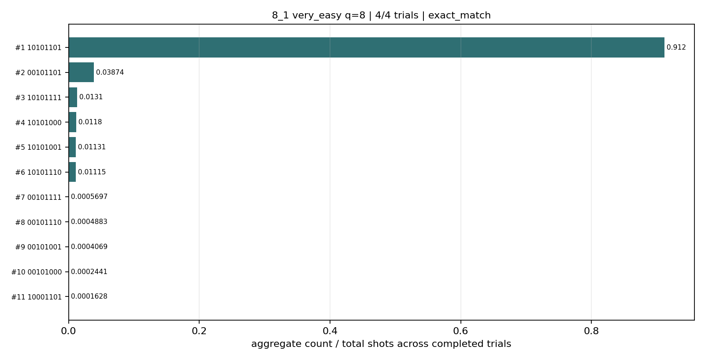
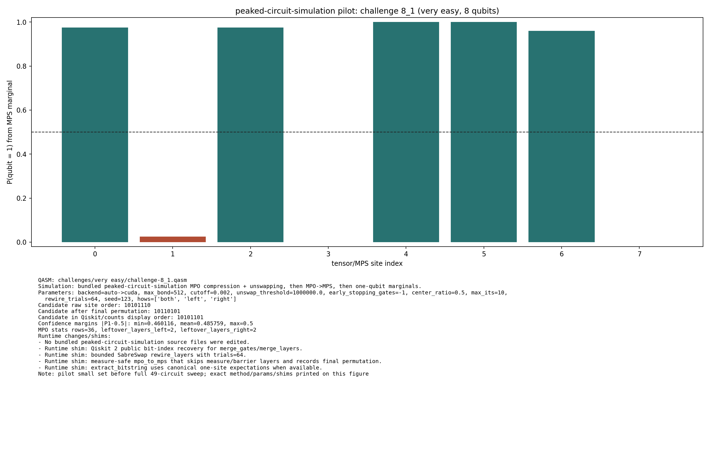
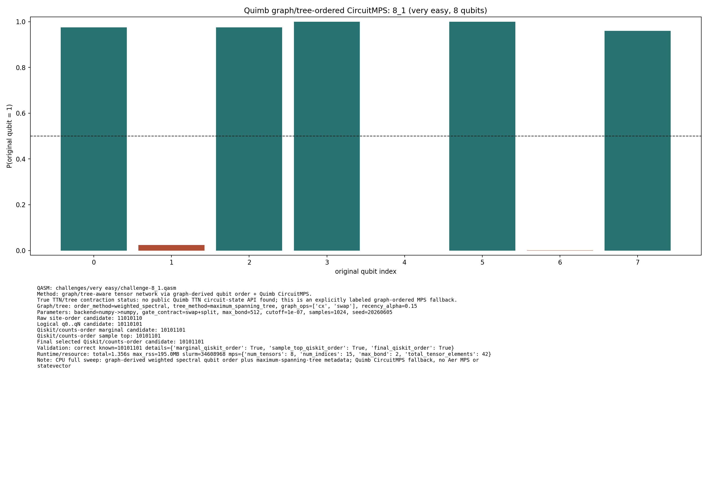
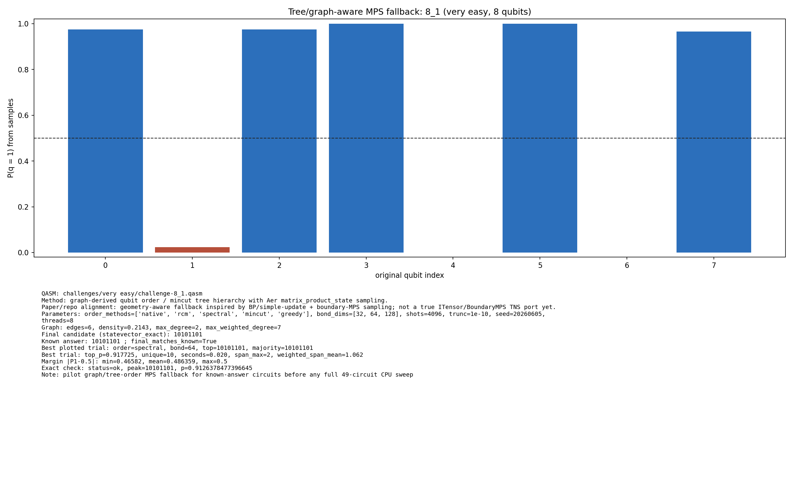

# Challenge 8_1

- Difficulty: very easy
- Qubits: 8
- QASM: `challenges/very easy/challenge-8_1.qasm`
- Central selected answer: `10101101`
- Selected method: `exact_statevector`
- Selected review: none
- Candidate rows: 181
- Method runs: 26
- Distribution figures: 5

## Selected Answer Sources

| source | selected answer | method | validation | status | evidence |
|---|---|---|---|---|---:|
| tree_tensor_sim_session | `10101101` | exact_statevector | exact | selected | 2 |
| quantum_peak_session | `10101101` | exact_statevector | exact | selected | 2 |

## Method Summary

| method | family | runs | statuses | best or marked candidate | rank_type | score | fraction | review | sources |
|---|---|---:|---|---|---|---:|---:|---|---|
| aer_mps_adaptive_sweep | mps | 1 | ok | `10101101` | aggregate_candidate | 0.91202799 | 0.91202799 |  | mps_adaptive_sweep |
| aer_tree_mps_pilot | mps | 12 | ok | `10101101` | final_candidate | 0.9126378477396645 | 0.9126378477396645 |  | tree_tensor_sim_session |
| algebraic_simplify_cxswap | heuristic | 1 | static_analysis | `00000011` | static_heuristic |  |  |  | algebraic_simplify |
| algebraic_simplify_swaponly | heuristic | 1 | static_analysis | `00100010` | static_heuristic |  |  |  | algebraic_simplify |
| collector_snapshot | collector | 2 | exact | `10101101` | collector_selected | 0.9126378477396644 | 0.9126378477396644 |  | quantum_peak_session,tree_tensor_sim_session |
| exact_statevector | exact | 3 | exact,ok | `10101101` | exact_top | 0.9126378477396644 | 0.9126378477396644 |  | quantum_peak_session,tree_tensor_sim_session |
| peaked_mpo_mps | mps | 2 | ok | `10101101` | marginal_candidate | 0.46011586774681057 |  |  | quantum_peak_session,tree_tensor_sim_session |
| quimb_cpu_all | quimb | 2 | correct,ok | `10101101` | final_candidate | 0.4600556389768693 |  |  | quantum_peak_session,tree_tensor_sim_session |
| quimb_pilot | quimb | 1 | ok | `10101101` | final_candidate | 0.4600556389768694 |  |  | tree_tensor_sim_session |
| tno_contract_core_sample | tno | 1 | ok | `10101101` | marginal_candidate | 0.4601158663020227 |  |  | tno_contract_core_sample |

## Method Selector

| first action | best method | best score | MPS | TNO | MPO-unswap |
|---|---|---:|---:|---:|---:|
| Exact statevector baseline | Low-bond MPS with bitstring distillation | 76 | 76 | 64 | 0 |

## Distribution Figures

### Adaptive Aer MPS distribution: challenge-8_1.png

### Peaked MPO/MPS distribution: challenge-8_1.peaked_mpo_mps.png

### Quimb graph-ordered MPS distribution: challenge-8_1.quimb_tree_graph_mps.png

### Quimb graph-ordered MPS distribution: challenge-8_1.quimb_tree_graph_mps.png

### Tree/order MPS distribution: challenge-8_1.tree_tensor_mps.png

## Candidate Rows

| review | selected | method | rank_type | rank | bitstring | score | count | support | fraction | validation | status | sources | source path | notes |
|---|---:|---|---|---:|---|---:|---:|---:|---:|---|---|---|---|---|
|  | 1 | collector_snapshot | collector_selected | 1 | `10101101` | 0.9126378477396644 |  |  | 0.9126378477396644 | exact | exact | tree_tensor_sim_session | `research/tree_tensor_sim_session/artifacts/collector/CANDIDATES.tsv` | exact_statevector |
|  | 1 | collector_snapshot | collector_selected | 1 | `10101101` | 0.9126378477396644 |  |  | 0.9126378477396644 | exact | exact | quantum_peak_session | `research/quantum_peak_session/results/current_candidates/CANDIDATES.tsv` | exact_statevector |
|  | 1 | aer_tree_mps_pilot | final_candidate | 1 | `10101101` | 0.9126378477396645 |  |  | 0.9126378477396645 | {"bit_order_note":"Right-most bit is qubit 0.","final_matches_known":true,"known_answer":"10101101","known_answers_are_qiskit_counts_order":true} | ok | tree_tensor_sim_session | `../quantum-junction-tree-tensor/outputs/tree_tensor_sim/pilot/json/challenge-8_1.tree_tensor_mps.json` | statevector_exact |
|  | 1 | quimb_cpu_all | final_candidate | 1 | `10101101` | 0.4600556389768693 |  |  |  | {"candidate_results":{"final_qiskit_order":true,"marginal_qiskit_order":true,"sample_top_qiskit_order":true},"known_answer_qiskit_order":"10101101","status":"correct"} | ok | tree_tensor_sim_session | `../quantum-junction-tree-tensor/outputs/tree_tensor_sim/all_cpu/json/challenge-8_1.quimb_tree_graph_mps.json` | - |
|  | 1 | quimb_pilot | final_candidate | 1 | `10101101` | 0.4600556389768694 |  |  |  | {"candidate_results":{"final_qiskit_order":true,"marginal_qiskit_order":true,"sample_top_qiskit_order":true},"known_answer_qiskit_order":"10101101","status":"correct"} | ok | tree_tensor_sim_session | `../quantum-junction-tree-tensor/outputs/tree_tensor_sim/quimb_pilot/json/challenge-8_1.quimb_tree_graph_mps.json` | - |
|  | 1 | aer_mps_adaptive_sweep | aggregate_candidate | 1 | `10101101` | 0.91202799 |  | 1 | 0.91202799 | exact_match | ok | mps_adaptive_sweep | `agent_work/mps_adaptive_sweep/report/tables/mps_adaptive_summary.tsv` | aggregate_gap=23.5441; exact_match=True |
|  | 1 | peaked_mpo_mps | marginal_candidate | 1 | `10101101` | 0.46011586774681057 |  |  |  |  | ok | tree_tensor_sim_session | `../quantum-junction-tree-tensor/outputs/peaked_circuit_sim_pilot/json/challenge-8_1.peaked_mpo_mps.json` | - |
|  | 1 | peaked_mpo_mps | marginal_candidate | 1 | `10101101` | 0.46011586774681057 |  |  |  |  | ok | quantum_peak_session | `outputs/peaked_circuit_sim_pilot/json/challenge-8_1.peaked_mpo_mps.json` | - |
|  | 1 | quimb_cpu_all | marginal_candidate | 1 | `10101101` | 0.4600556389768693 |  |  |  | {"candidate_results":{"final_qiskit_order":true,"marginal_qiskit_order":true,"sample_top_qiskit_order":true},"known_answer_qiskit_order":"10101101","status":"correct"} | ok | tree_tensor_sim_session | `../quantum-junction-tree-tensor/outputs/tree_tensor_sim/all_cpu/json/challenge-8_1.quimb_tree_graph_mps.json` | - |
|  | 1 | quimb_pilot | marginal_candidate | 1 | `10101101` | 0.4600556389768694 |  |  |  | {"candidate_results":{"final_qiskit_order":true,"marginal_qiskit_order":true,"sample_top_qiskit_order":true},"known_answer_qiskit_order":"10101101","status":"correct"} | ok | tree_tensor_sim_session | `../quantum-junction-tree-tensor/outputs/tree_tensor_sim/quimb_pilot/json/challenge-8_1.quimb_tree_graph_mps.json` | - |
|  | 1 | tno_contract_core_sample | marginal_candidate | 1 | `10101101` | 0.4601158663020227 |  |  |  |  | ok | tno_contract_core_sample | `outputs/tno_sim_sample/json/challenge-8_1.tno.json` |  |
|  | 1 | exact_statevector | exact_top | 1 | `10101101` | 0.9126378477396644 |  |  | 0.9126378477396644 | exact | ok | tree_tensor_sim_session | `../quantum-junction-tree-tensor/agent_work/exact_baseline/peaks_exact.jsonl` | - |
|  | 1 | exact_statevector | exact_top | 1 | `10101101` | 0.9126378477396644 |  |  | 0.9126378477396644 | exact | ok | quantum_peak_session | `agent_work/exact_baseline/peaks_exact.jsonl` | - |
|  | 1 | quimb_cpu_all | sample_top | 1 | `10101101` | 0.9013671875 | 923 |  | 0.9013671875 | {"candidate_results":{"final_qiskit_order":true,"marginal_qiskit_order":true,"sample_top_qiskit_order":true},"known_answer_qiskit_order":"10101101","status":"correct"} | ok | tree_tensor_sim_session | `../quantum-junction-tree-tensor/outputs/tree_tensor_sim/all_cpu/json/challenge-8_1.quimb_tree_graph_mps.json` | - |
|  | 1 | quimb_pilot | sample_top | 1 | `10101101` | 0.9052734375 | 1854 |  | 0.9052734375 | {"candidate_results":{"final_qiskit_order":true,"marginal_qiskit_order":true,"sample_top_qiskit_order":true},"known_answer_qiskit_order":"10101101","status":"correct"} | ok | tree_tensor_sim_session | `../quantum-junction-tree-tensor/outputs/tree_tensor_sim/quimb_pilot/json/challenge-8_1.quimb_tree_graph_mps.json` | - |
|  | 1 | aer_tree_mps_pilot | sample_top | 8 | `10101101` | 0.908447265625 | 3721 |  | 0.908447265625 | {"bit_order_note":"Right-most bit is qubit 0.","final_matches_known":true,"known_answer":"10101101","known_answers_are_qiskit_counts_order":true} | ok | tree_tensor_sim_session | `../quantum-junction-tree-tensor/outputs/tree_tensor_sim/pilot/json/challenge-8_1.tree_tensor_mps.json` | - |
|  | 1 | aer_tree_mps_pilot | sample_top | 8 | `10101101` | 0.90771484375 | 3718 |  | 0.90771484375 | {"bit_order_note":"Right-most bit is qubit 0.","final_matches_known":true,"known_answer":"10101101","known_answers_are_qiskit_counts_order":true} | ok | tree_tensor_sim_session | `../quantum-junction-tree-tensor/outputs/tree_tensor_sim/pilot/json/challenge-8_1.tree_tensor_mps.json` | - |
|  | 1 | aer_tree_mps_pilot | sample_top | 8 | `10101101` | 0.908447265625 | 3721 |  | 0.908447265625 | {"bit_order_note":"Right-most bit is qubit 0.","final_matches_known":true,"known_answer":"10101101","known_answers_are_qiskit_counts_order":true} | ok | tree_tensor_sim_session | `../quantum-junction-tree-tensor/outputs/tree_tensor_sim/pilot/json/challenge-8_1.tree_tensor_mps.json` | - |
|  | 1 | aer_tree_mps_pilot | sample_top | 8 | `10101101` | 0.9140625 | 3744 |  | 0.9140625 | {"bit_order_note":"Right-most bit is qubit 0.","final_matches_known":true,"known_answer":"10101101","known_answers_are_qiskit_counts_order":true} | ok | tree_tensor_sim_session | `../quantum-junction-tree-tensor/outputs/tree_tensor_sim/pilot/json/challenge-8_1.tree_tensor_mps.json` | - |
|  | 1 | aer_tree_mps_pilot | sample_top | 8 | `10101101` | 0.914306640625 | 3745 |  | 0.914306640625 | {"bit_order_note":"Right-most bit is qubit 0.","final_matches_known":true,"known_answer":"10101101","known_answers_are_qiskit_counts_order":true} | ok | tree_tensor_sim_session | `../quantum-junction-tree-tensor/outputs/tree_tensor_sim/pilot/json/challenge-8_1.tree_tensor_mps.json` | - |
|  | 1 | aer_tree_mps_pilot | sample_top | 8 | `10101101` | 0.91015625 | 3728 |  | 0.91015625 | {"bit_order_note":"Right-most bit is qubit 0.","final_matches_known":true,"known_answer":"10101101","known_answers_are_qiskit_counts_order":true} | ok | tree_tensor_sim_session | `../quantum-junction-tree-tensor/outputs/tree_tensor_sim/pilot/json/challenge-8_1.tree_tensor_mps.json` | - |
|  | 1 | aer_tree_mps_pilot | sample_top | 8 | `10101101` | 0.9072265625 | 3716 |  | 0.9072265625 | {"bit_order_note":"Right-most bit is qubit 0.","final_matches_known":true,"known_answer":"10101101","known_answers_are_qiskit_counts_order":true} | ok | tree_tensor_sim_session | `../quantum-junction-tree-tensor/outputs/tree_tensor_sim/pilot/json/challenge-8_1.tree_tensor_mps.json` | - |
|  | 1 | aer_tree_mps_pilot | sample_top | 8 | `10101101` | 0.90966796875 | 3726 |  | 0.90966796875 | {"bit_order_note":"Right-most bit is qubit 0.","final_matches_known":true,"known_answer":"10101101","known_answers_are_qiskit_counts_order":true} | ok | tree_tensor_sim_session | `../quantum-junction-tree-tensor/outputs/tree_tensor_sim/pilot/json/challenge-8_1.tree_tensor_mps.json` | - |
|  | 1 | aer_tree_mps_pilot | sample_top | 8 | `10101101` | 0.910888671875 | 3731 |  | 0.910888671875 | {"bit_order_note":"Right-most bit is qubit 0.","final_matches_known":true,"known_answer":"10101101","known_answers_are_qiskit_counts_order":true} | ok | tree_tensor_sim_session | `../quantum-junction-tree-tensor/outputs/tree_tensor_sim/pilot/json/challenge-8_1.tree_tensor_mps.json` | - |
|  | 1 | aer_tree_mps_pilot | sample_top | 8 | `10101101` | 0.917724609375 | 3759 |  | 0.917724609375 | {"bit_order_note":"Right-most bit is qubit 0.","final_matches_known":true,"known_answer":"10101101","known_answers_are_qiskit_counts_order":true} | ok | tree_tensor_sim_session | `../quantum-junction-tree-tensor/outputs/tree_tensor_sim/pilot/json/challenge-8_1.tree_tensor_mps.json` | - |
|  | 1 | aer_tree_mps_pilot | sample_top | 8 | `10101101` | 0.908935546875 | 3723 |  | 0.908935546875 | {"bit_order_note":"Right-most bit is qubit 0.","final_matches_known":true,"known_answer":"10101101","known_answers_are_qiskit_counts_order":true} | ok | tree_tensor_sim_session | `../quantum-junction-tree-tensor/outputs/tree_tensor_sim/pilot/json/challenge-8_1.tree_tensor_mps.json` | - |
|  | 1 | aer_tree_mps_pilot | sample_top | 9 | `10101101` | 0.915283203125 | 3749 |  | 0.915283203125 | {"bit_order_note":"Right-most bit is qubit 0.","final_matches_known":true,"known_answer":"10101101","known_answers_are_qiskit_counts_order":true} | ok | tree_tensor_sim_session | `../quantum-junction-tree-tensor/outputs/tree_tensor_sim/pilot/json/challenge-8_1.tree_tensor_mps.json` | - |
|  | 1 | aer_mps_adaptive_sweep | aggregate_top_counts | 1 | `10101101` | 0.91202799 | 11207 |  | 0.91202799 |  | ok | mps_adaptive_sweep | `agent_work/mps_adaptive_sweep/report/tables/mps_adaptive_top_counts.tsv` |  |
|  | 1 | exact_statevector | collector_evidence | 1 | `10101101` | 0.9126378477396644 |  |  | 0.9126378477396644 | exact | exact | quantum_peak_session,tree_tensor_sim_session | `agent_work/exact_baseline/peaks_exact.csv` | collector priority 100 |
|  | 1 | quimb_cpu_all | collector_evidence | 2 | `10101101` | 0.9013671875 |  |  | 0.9013671875 | correct | correct | quantum_peak_session,tree_tensor_sim_session | `outputs/tree_tensor_sim/all_cpu/json/challenge-8_1.quimb_tree_graph_mps.json` | collector priority 80 |
|  | 0 | exact_statevector | exact_top | 2 | `00101101` | 0.03791185128794029 |  |  | 0.03791185128794029 | exact | ok | tree_tensor_sim_session | `../quantum-junction-tree-tensor/agent_work/exact_baseline/peaks_exact.jsonl` | - |
|  | 0 | exact_statevector | exact_top | 2 | `00101101` | 0.03791185128794029 |  |  | 0.03791185128794029 | exact | ok | quantum_peak_session | `agent_work/exact_baseline/peaks_exact.jsonl` | - |
|  | 0 | exact_statevector | exact_top | 3 | `10101001` | 0.01183411950021498 |  |  | 0.01183411950021498 | exact | ok | tree_tensor_sim_session | `../quantum-junction-tree-tensor/agent_work/exact_baseline/peaks_exact.jsonl` | - |
|  | 0 | exact_statevector | exact_top | 3 | `10101001` | 0.01183411950021498 |  |  | 0.01183411950021498 | exact | ok | quantum_peak_session | `agent_work/exact_baseline/peaks_exact.jsonl` | - |
|  | 0 | exact_statevector | exact_top | 4 | `10101111` | 0.011834069610118906 |  |  | 0.011834069610118906 | exact | ok | tree_tensor_sim_session | `../quantum-junction-tree-tensor/agent_work/exact_baseline/peaks_exact.jsonl` | - |
|  | 0 | exact_statevector | exact_top | 4 | `10101111` | 0.011834069610118906 |  |  | 0.011834069610118906 | exact | ok | quantum_peak_session | `agent_work/exact_baseline/peaks_exact.jsonl` | - |
|  | 0 | exact_statevector | exact_top | 5 | `10101110` | 0.011833411773848073 |  |  | 0.011833411773848073 | exact | ok | tree_tensor_sim_session | `../quantum-junction-tree-tensor/agent_work/exact_baseline/peaks_exact.jsonl` | - |
|  | 0 | exact_statevector | exact_top | 5 | `10101110` | 0.011833411773848073 |  |  | 0.011833411773848073 | exact | ok | quantum_peak_session | `agent_work/exact_baseline/peaks_exact.jsonl` | - |
|  | 0 | exact_statevector | exact_top | 6 | `10101000` | 0.011833361888252496 |  |  | 0.011833361888252496 | exact | ok | tree_tensor_sim_session | `../quantum-junction-tree-tensor/agent_work/exact_baseline/peaks_exact.jsonl` | - |
|  | 0 | exact_statevector | exact_top | 6 | `10101000` | 0.011833361888252496 |  |  | 0.011833361888252496 | exact | ok | quantum_peak_session | `agent_work/exact_baseline/peaks_exact.jsonl` | - |
|  | 0 | exact_statevector | exact_top | 7 | `00101001` | 0.0004916006713145274 |  |  | 0.0004916006713145274 | exact | ok | tree_tensor_sim_session | `../quantum-junction-tree-tensor/agent_work/exact_baseline/peaks_exact.jsonl` | - |
|  | 0 | exact_statevector | exact_top | 7 | `00101001` | 0.0004916006713145274 |  |  | 0.0004916006713145274 | exact | ok | quantum_peak_session | `agent_work/exact_baseline/peaks_exact.jsonl` | - |
|  | 0 | exact_statevector | exact_top | 8 | `00101111` | 0.0004915985988320991 |  |  | 0.0004915985988320991 | exact | ok | tree_tensor_sim_session | `../quantum-junction-tree-tensor/agent_work/exact_baseline/peaks_exact.jsonl` | - |
|  | 0 | exact_statevector | exact_top | 8 | `00101111` | 0.0004915985988320991 |  |  | 0.0004915985988320991 | exact | ok | quantum_peak_session | `agent_work/exact_baseline/peaks_exact.jsonl` | - |
|  | 0 | aer_tree_mps_pilot | sample_top | 1 | `00101000` | 0.00048828125 | 2 |  | 0.00048828125 | {"bit_order_note":"Right-most bit is qubit 0.","final_matches_known":true,"known_answer":"10101101","known_answers_are_qiskit_counts_order":true} | ok | tree_tensor_sim_session | `../quantum-junction-tree-tensor/outputs/tree_tensor_sim/pilot/json/challenge-8_1.tree_tensor_mps.json` | - |
|  | 0 | aer_tree_mps_pilot | sample_top | 1 | `00101000` | 0.000244140625 | 1 |  | 0.000244140625 | {"bit_order_note":"Right-most bit is qubit 0.","final_matches_known":true,"known_answer":"10101101","known_answers_are_qiskit_counts_order":true} | ok | tree_tensor_sim_session | `../quantum-junction-tree-tensor/outputs/tree_tensor_sim/pilot/json/challenge-8_1.tree_tensor_mps.json` | - |
|  | 0 | aer_tree_mps_pilot | sample_top | 1 | `00101000` | 0.000244140625 | 1 |  | 0.000244140625 | {"bit_order_note":"Right-most bit is qubit 0.","final_matches_known":true,"known_answer":"10101101","known_answers_are_qiskit_counts_order":true} | ok | tree_tensor_sim_session | `../quantum-junction-tree-tensor/outputs/tree_tensor_sim/pilot/json/challenge-8_1.tree_tensor_mps.json` | - |
|  | 0 | aer_tree_mps_pilot | sample_top | 1 | `00101000` | 0.00048828125 | 2 |  | 0.00048828125 | {"bit_order_note":"Right-most bit is qubit 0.","final_matches_known":true,"known_answer":"10101101","known_answers_are_qiskit_counts_order":true} | ok | tree_tensor_sim_session | `../quantum-junction-tree-tensor/outputs/tree_tensor_sim/pilot/json/challenge-8_1.tree_tensor_mps.json` | - |
|  | 0 | aer_tree_mps_pilot | sample_top | 1 | `00101000` | 0.00146484375 | 6 |  | 0.00146484375 | {"bit_order_note":"Right-most bit is qubit 0.","final_matches_known":true,"known_answer":"10101101","known_answers_are_qiskit_counts_order":true} | ok | tree_tensor_sim_session | `../quantum-junction-tree-tensor/outputs/tree_tensor_sim/pilot/json/challenge-8_1.tree_tensor_mps.json` | - |
|  | 0 | aer_tree_mps_pilot | sample_top | 1 | `00101000` | 0.000244140625 | 1 |  | 0.000244140625 | {"bit_order_note":"Right-most bit is qubit 0.","final_matches_known":true,"known_answer":"10101101","known_answers_are_qiskit_counts_order":true} | ok | tree_tensor_sim_session | `../quantum-junction-tree-tensor/outputs/tree_tensor_sim/pilot/json/challenge-8_1.tree_tensor_mps.json` | - |
|  | 0 | aer_tree_mps_pilot | sample_top | 1 | `00101000` | 0.000244140625 | 1 |  | 0.000244140625 | {"bit_order_note":"Right-most bit is qubit 0.","final_matches_known":true,"known_answer":"10101101","known_answers_are_qiskit_counts_order":true} | ok | tree_tensor_sim_session | `../quantum-junction-tree-tensor/outputs/tree_tensor_sim/pilot/json/challenge-8_1.tree_tensor_mps.json` | - |
|  | 0 | aer_tree_mps_pilot | sample_top | 1 | `00101000` | 0.00048828125 | 2 |  | 0.00048828125 | {"bit_order_note":"Right-most bit is qubit 0.","final_matches_known":true,"known_answer":"10101101","known_answers_are_qiskit_counts_order":true} | ok | tree_tensor_sim_session | `../quantum-junction-tree-tensor/outputs/tree_tensor_sim/pilot/json/challenge-8_1.tree_tensor_mps.json` | - |
|  | 0 | aer_tree_mps_pilot | sample_top | 1 | `00101000` | 0.00048828125 | 2 |  | 0.00048828125 | {"bit_order_note":"Right-most bit is qubit 0.","final_matches_known":true,"known_answer":"10101101","known_answers_are_qiskit_counts_order":true} | ok | tree_tensor_sim_session | `../quantum-junction-tree-tensor/outputs/tree_tensor_sim/pilot/json/challenge-8_1.tree_tensor_mps.json` | - |
|  | 0 | aer_tree_mps_pilot | sample_top | 1 | `00101000` | 0.000732421875 | 3 |  | 0.000732421875 | {"bit_order_note":"Right-most bit is qubit 0.","final_matches_known":true,"known_answer":"10101101","known_answers_are_qiskit_counts_order":true} | ok | tree_tensor_sim_session | `../quantum-junction-tree-tensor/outputs/tree_tensor_sim/pilot/json/challenge-8_1.tree_tensor_mps.json` | - |
|  | 0 | aer_tree_mps_pilot | sample_top | 1 | `00101000` | 0.00048828125 | 2 |  | 0.00048828125 | {"bit_order_note":"Right-most bit is qubit 0.","final_matches_known":true,"known_answer":"10101101","known_answers_are_qiskit_counts_order":true} | ok | tree_tensor_sim_session | `../quantum-junction-tree-tensor/outputs/tree_tensor_sim/pilot/json/challenge-8_1.tree_tensor_mps.json` | - |
|  | 0 | aer_tree_mps_pilot | sample_top | 1 | `00101001` | 0.000244140625 | 1 |  | 0.000244140625 | {"bit_order_note":"Right-most bit is qubit 0.","final_matches_known":true,"known_answer":"10101101","known_answers_are_qiskit_counts_order":true} | ok | tree_tensor_sim_session | `../quantum-junction-tree-tensor/outputs/tree_tensor_sim/pilot/json/challenge-8_1.tree_tensor_mps.json` | - |
|  | 0 | aer_tree_mps_pilot | sample_top | 2 | `00101001` | 0.0009765625 | 4 |  | 0.0009765625 | {"bit_order_note":"Right-most bit is qubit 0.","final_matches_known":true,"known_answer":"10101101","known_answers_are_qiskit_counts_order":true} | ok | tree_tensor_sim_session | `../quantum-junction-tree-tensor/outputs/tree_tensor_sim/pilot/json/challenge-8_1.tree_tensor_mps.json` | - |
|  | 0 | aer_tree_mps_pilot | sample_top | 2 | `00101001` | 0.000244140625 | 1 |  | 0.000244140625 | {"bit_order_note":"Right-most bit is qubit 0.","final_matches_known":true,"known_answer":"10101101","known_answers_are_qiskit_counts_order":true} | ok | tree_tensor_sim_session | `../quantum-junction-tree-tensor/outputs/tree_tensor_sim/pilot/json/challenge-8_1.tree_tensor_mps.json` | - |
|  | 0 | aer_tree_mps_pilot | sample_top | 2 | `00101001` | 0.000732421875 | 3 |  | 0.000732421875 | {"bit_order_note":"Right-most bit is qubit 0.","final_matches_known":true,"known_answer":"10101101","known_answers_are_qiskit_counts_order":true} | ok | tree_tensor_sim_session | `../quantum-junction-tree-tensor/outputs/tree_tensor_sim/pilot/json/challenge-8_1.tree_tensor_mps.json` | - |
|  | 0 | aer_tree_mps_pilot | sample_top | 2 | `00101001` | 0.0009765625 | 4 |  | 0.0009765625 | {"bit_order_note":"Right-most bit is qubit 0.","final_matches_known":true,"known_answer":"10101101","known_answers_are_qiskit_counts_order":true} | ok | tree_tensor_sim_session | `../quantum-junction-tree-tensor/outputs/tree_tensor_sim/pilot/json/challenge-8_1.tree_tensor_mps.json` | - |
|  | 0 | aer_tree_mps_pilot | sample_top | 2 | `00101001` | 0.000732421875 | 3 |  | 0.000732421875 | {"bit_order_note":"Right-most bit is qubit 0.","final_matches_known":true,"known_answer":"10101101","known_answers_are_qiskit_counts_order":true} | ok | tree_tensor_sim_session | `../quantum-junction-tree-tensor/outputs/tree_tensor_sim/pilot/json/challenge-8_1.tree_tensor_mps.json` | - |
|  | 0 | aer_tree_mps_pilot | sample_top | 2 | `00101001` | 0.000732421875 | 3 |  | 0.000732421875 | {"bit_order_note":"Right-most bit is qubit 0.","final_matches_known":true,"known_answer":"10101101","known_answers_are_qiskit_counts_order":true} | ok | tree_tensor_sim_session | `../quantum-junction-tree-tensor/outputs/tree_tensor_sim/pilot/json/challenge-8_1.tree_tensor_mps.json` | - |
|  | 0 | aer_tree_mps_pilot | sample_top | 2 | `00101001` | 0.000244140625 | 1 |  | 0.000244140625 | {"bit_order_note":"Right-most bit is qubit 0.","final_matches_known":true,"known_answer":"10101101","known_answers_are_qiskit_counts_order":true} | ok | tree_tensor_sim_session | `../quantum-junction-tree-tensor/outputs/tree_tensor_sim/pilot/json/challenge-8_1.tree_tensor_mps.json` | - |
|  | 0 | aer_tree_mps_pilot | sample_top | 2 | `00101001` | 0.0009765625 | 4 |  | 0.0009765625 | {"bit_order_note":"Right-most bit is qubit 0.","final_matches_known":true,"known_answer":"10101101","known_answers_are_qiskit_counts_order":true} | ok | tree_tensor_sim_session | `../quantum-junction-tree-tensor/outputs/tree_tensor_sim/pilot/json/challenge-8_1.tree_tensor_mps.json` | - |
|  | 0 | aer_tree_mps_pilot | sample_top | 2 | `00101001` | 0.00048828125 | 2 |  | 0.00048828125 | {"bit_order_note":"Right-most bit is qubit 0.","final_matches_known":true,"known_answer":"10101101","known_answers_are_qiskit_counts_order":true} | ok | tree_tensor_sim_session | `../quantum-junction-tree-tensor/outputs/tree_tensor_sim/pilot/json/challenge-8_1.tree_tensor_mps.json` | - |
|  | 0 | aer_tree_mps_pilot | sample_top | 2 | `00101101` | 0.03662109375 | 150 |  | 0.03662109375 | {"bit_order_note":"Right-most bit is qubit 0.","final_matches_known":true,"known_answer":"10101101","known_answers_are_qiskit_counts_order":true} | ok | tree_tensor_sim_session | `../quantum-junction-tree-tensor/outputs/tree_tensor_sim/pilot/json/challenge-8_1.tree_tensor_mps.json` | - |
|  | 0 | aer_tree_mps_pilot | sample_top | 2 | `00101101` | 0.0390625 | 160 |  | 0.0390625 | {"bit_order_note":"Right-most bit is qubit 0.","final_matches_known":true,"known_answer":"10101101","known_answers_are_qiskit_counts_order":true} | ok | tree_tensor_sim_session | `../quantum-junction-tree-tensor/outputs/tree_tensor_sim/pilot/json/challenge-8_1.tree_tensor_mps.json` | - |
|  | 0 | aer_tree_mps_pilot | sample_top | 2 | `00101101` | 0.032470703125 | 133 |  | 0.032470703125 | {"bit_order_note":"Right-most bit is qubit 0.","final_matches_known":true,"known_answer":"10101101","known_answers_are_qiskit_counts_order":true} | ok | tree_tensor_sim_session | `../quantum-junction-tree-tensor/outputs/tree_tensor_sim/pilot/json/challenge-8_1.tree_tensor_mps.json` | - |
|  | 0 | quimb_cpu_all | sample_top | 2 | `00101101` | 0.04296875 | 44 |  | 0.04296875 | {"candidate_results":{"final_qiskit_order":true,"marginal_qiskit_order":true,"sample_top_qiskit_order":true},"known_answer_qiskit_order":"10101101","status":"correct"} | ok | tree_tensor_sim_session | `../quantum-junction-tree-tensor/outputs/tree_tensor_sim/all_cpu/json/challenge-8_1.quimb_tree_graph_mps.json` | - |
|  | 0 | quimb_pilot | sample_top | 2 | `00101101` | 0.0439453125 | 90 |  | 0.0439453125 | {"candidate_results":{"final_qiskit_order":true,"marginal_qiskit_order":true,"sample_top_qiskit_order":true},"known_answer_qiskit_order":"10101101","status":"correct"} | ok | tree_tensor_sim_session | `../quantum-junction-tree-tensor/outputs/tree_tensor_sim/quimb_pilot/json/challenge-8_1.quimb_tree_graph_mps.json` | - |
|  | 0 | aer_tree_mps_pilot | sample_top | 3 | `00101101` | 0.04248046875 | 174 |  | 0.04248046875 | {"bit_order_note":"Right-most bit is qubit 0.","final_matches_known":true,"known_answer":"10101101","known_answers_are_qiskit_counts_order":true} | ok | tree_tensor_sim_session | `../quantum-junction-tree-tensor/outputs/tree_tensor_sim/pilot/json/challenge-8_1.tree_tensor_mps.json` | - |
|  | 0 | aer_tree_mps_pilot | sample_top | 3 | `00101101` | 0.03955078125 | 162 |  | 0.03955078125 | {"bit_order_note":"Right-most bit is qubit 0.","final_matches_known":true,"known_answer":"10101101","known_answers_are_qiskit_counts_order":true} | ok | tree_tensor_sim_session | `../quantum-junction-tree-tensor/outputs/tree_tensor_sim/pilot/json/challenge-8_1.tree_tensor_mps.json` | - |
|  | 0 | aer_tree_mps_pilot | sample_top | 3 | `00101101` | 0.039306640625 | 161 |  | 0.039306640625 | {"bit_order_note":"Right-most bit is qubit 0.","final_matches_known":true,"known_answer":"10101101","known_answers_are_qiskit_counts_order":true} | ok | tree_tensor_sim_session | `../quantum-junction-tree-tensor/outputs/tree_tensor_sim/pilot/json/challenge-8_1.tree_tensor_mps.json` | - |
|  | 0 | aer_tree_mps_pilot | sample_top | 3 | `00101101` | 0.033935546875 | 139 |  | 0.033935546875 | {"bit_order_note":"Right-most bit is qubit 0.","final_matches_known":true,"known_answer":"10101101","known_answers_are_qiskit_counts_order":true} | ok | tree_tensor_sim_session | `../quantum-junction-tree-tensor/outputs/tree_tensor_sim/pilot/json/challenge-8_1.tree_tensor_mps.json` | - |
|  | 0 | aer_tree_mps_pilot | sample_top | 3 | `00101101` | 0.037109375 | 152 |  | 0.037109375 | {"bit_order_note":"Right-most bit is qubit 0.","final_matches_known":true,"known_answer":"10101101","known_answers_are_qiskit_counts_order":true} | ok | tree_tensor_sim_session | `../quantum-junction-tree-tensor/outputs/tree_tensor_sim/pilot/json/challenge-8_1.tree_tensor_mps.json` | - |
|  | 0 | aer_tree_mps_pilot | sample_top | 3 | `00101101` | 0.0419921875 | 172 |  | 0.0419921875 | {"bit_order_note":"Right-most bit is qubit 0.","final_matches_known":true,"known_answer":"10101101","known_answers_are_qiskit_counts_order":true} | ok | tree_tensor_sim_session | `../quantum-junction-tree-tensor/outputs/tree_tensor_sim/pilot/json/challenge-8_1.tree_tensor_mps.json` | - |
|  | 0 | aer_tree_mps_pilot | sample_top | 3 | `00101101` | 0.039306640625 | 161 |  | 0.039306640625 | {"bit_order_note":"Right-most bit is qubit 0.","final_matches_known":true,"known_answer":"10101101","known_answers_are_qiskit_counts_order":true} | ok | tree_tensor_sim_session | `../quantum-junction-tree-tensor/outputs/tree_tensor_sim/pilot/json/challenge-8_1.tree_tensor_mps.json` | - |
|  | 0 | aer_tree_mps_pilot | sample_top | 3 | `00101101` | 0.04052734375 | 166 |  | 0.04052734375 | {"bit_order_note":"Right-most bit is qubit 0.","final_matches_known":true,"known_answer":"10101101","known_answers_are_qiskit_counts_order":true} | ok | tree_tensor_sim_session | `../quantum-junction-tree-tensor/outputs/tree_tensor_sim/pilot/json/challenge-8_1.tree_tensor_mps.json` | - |
|  | 0 | aer_tree_mps_pilot | sample_top | 3 | `00101101` | 0.039306640625 | 161 |  | 0.039306640625 | {"bit_order_note":"Right-most bit is qubit 0.","final_matches_known":true,"known_answer":"10101101","known_answers_are_qiskit_counts_order":true} | ok | tree_tensor_sim_session | `../quantum-junction-tree-tensor/outputs/tree_tensor_sim/pilot/json/challenge-8_1.tree_tensor_mps.json` | - |
|  | 0 | aer_tree_mps_pilot | sample_top | 3 | `00101110` | 0.000244140625 | 1 |  | 0.000244140625 | {"bit_order_note":"Right-most bit is qubit 0.","final_matches_known":true,"known_answer":"10101101","known_answers_are_qiskit_counts_order":true} | ok | tree_tensor_sim_session | `../quantum-junction-tree-tensor/outputs/tree_tensor_sim/pilot/json/challenge-8_1.tree_tensor_mps.json` | - |
|  | 0 | aer_tree_mps_pilot | sample_top | 3 | `00101110` | 0.00048828125 | 2 |  | 0.00048828125 | {"bit_order_note":"Right-most bit is qubit 0.","final_matches_known":true,"known_answer":"10101101","known_answers_are_qiskit_counts_order":true} | ok | tree_tensor_sim_session | `../quantum-junction-tree-tensor/outputs/tree_tensor_sim/pilot/json/challenge-8_1.tree_tensor_mps.json` | - |
|  | 0 | aer_tree_mps_pilot | sample_top | 3 | `00101110` | 0.00048828125 | 2 |  | 0.00048828125 | {"bit_order_note":"Right-most bit is qubit 0.","final_matches_known":true,"known_answer":"10101101","known_answers_are_qiskit_counts_order":true} | ok | tree_tensor_sim_session | `../quantum-junction-tree-tensor/outputs/tree_tensor_sim/pilot/json/challenge-8_1.tree_tensor_mps.json` | - |
|  | 0 | quimb_cpu_all | sample_top | 3 | `10101001` | 0.0185546875 | 19 |  | 0.0185546875 | {"candidate_results":{"final_qiskit_order":true,"marginal_qiskit_order":true,"sample_top_qiskit_order":true},"known_answer_qiskit_order":"10101101","status":"correct"} | ok | tree_tensor_sim_session | `../quantum-junction-tree-tensor/outputs/tree_tensor_sim/all_cpu/json/challenge-8_1.quimb_tree_graph_mps.json` | - |
|  | 0 | quimb_pilot | sample_top | 3 | `10101001` | 0.01513671875 | 31 |  | 0.01513671875 | {"candidate_results":{"final_qiskit_order":true,"marginal_qiskit_order":true,"sample_top_qiskit_order":true},"known_answer_qiskit_order":"10101101","status":"correct"} | ok | tree_tensor_sim_session | `../quantum-junction-tree-tensor/outputs/tree_tensor_sim/quimb_pilot/json/challenge-8_1.quimb_tree_graph_mps.json` | - |
|  | 0 | aer_tree_mps_pilot | sample_top | 4 | `00101110` | 0.000244140625 | 1 |  | 0.000244140625 | {"bit_order_note":"Right-most bit is qubit 0.","final_matches_known":true,"known_answer":"10101101","known_answers_are_qiskit_counts_order":true} | ok | tree_tensor_sim_session | `../quantum-junction-tree-tensor/outputs/tree_tensor_sim/pilot/json/challenge-8_1.tree_tensor_mps.json` | - |
|  | 0 | aer_tree_mps_pilot | sample_top | 4 | `00101110` | 0.000732421875 | 3 |  | 0.000732421875 | {"bit_order_note":"Right-most bit is qubit 0.","final_matches_known":true,"known_answer":"10101101","known_answers_are_qiskit_counts_order":true} | ok | tree_tensor_sim_session | `../quantum-junction-tree-tensor/outputs/tree_tensor_sim/pilot/json/challenge-8_1.tree_tensor_mps.json` | - |
|  | 0 | aer_tree_mps_pilot | sample_top | 4 | `00101110` | 0.000244140625 | 1 |  | 0.000244140625 | {"bit_order_note":"Right-most bit is qubit 0.","final_matches_known":true,"known_answer":"10101101","known_answers_are_qiskit_counts_order":true} | ok | tree_tensor_sim_session | `../quantum-junction-tree-tensor/outputs/tree_tensor_sim/pilot/json/challenge-8_1.tree_tensor_mps.json` | - |
|  | 0 | aer_tree_mps_pilot | sample_top | 4 | `00101110` | 0.00048828125 | 2 |  | 0.00048828125 | {"bit_order_note":"Right-most bit is qubit 0.","final_matches_known":true,"known_answer":"10101101","known_answers_are_qiskit_counts_order":true} | ok | tree_tensor_sim_session | `../quantum-junction-tree-tensor/outputs/tree_tensor_sim/pilot/json/challenge-8_1.tree_tensor_mps.json` | - |
|  | 0 | aer_tree_mps_pilot | sample_top | 4 | `00101110` | 0.000244140625 | 1 |  | 0.000244140625 | {"bit_order_note":"Right-most bit is qubit 0.","final_matches_known":true,"known_answer":"10101101","known_answers_are_qiskit_counts_order":true} | ok | tree_tensor_sim_session | `../quantum-junction-tree-tensor/outputs/tree_tensor_sim/pilot/json/challenge-8_1.tree_tensor_mps.json` | - |
|  | 0 | aer_tree_mps_pilot | sample_top | 4 | `00101110` | 0.00048828125 | 2 |  | 0.00048828125 | {"bit_order_note":"Right-most bit is qubit 0.","final_matches_known":true,"known_answer":"10101101","known_answers_are_qiskit_counts_order":true} | ok | tree_tensor_sim_session | `../quantum-junction-tree-tensor/outputs/tree_tensor_sim/pilot/json/challenge-8_1.tree_tensor_mps.json` | - |
|  | 0 | aer_tree_mps_pilot | sample_top | 4 | `00101110` | 0.0009765625 | 4 |  | 0.0009765625 | {"bit_order_note":"Right-most bit is qubit 0.","final_matches_known":true,"known_answer":"10101101","known_answers_are_qiskit_counts_order":true} | ok | tree_tensor_sim_session | `../quantum-junction-tree-tensor/outputs/tree_tensor_sim/pilot/json/challenge-8_1.tree_tensor_mps.json` | - |
|  | 0 | aer_tree_mps_pilot | sample_top | 4 | `00101110` | 0.000732421875 | 3 |  | 0.000732421875 | {"bit_order_note":"Right-most bit is qubit 0.","final_matches_known":true,"known_answer":"10101101","known_answers_are_qiskit_counts_order":true} | ok | tree_tensor_sim_session | `../quantum-junction-tree-tensor/outputs/tree_tensor_sim/pilot/json/challenge-8_1.tree_tensor_mps.json` | - |
|  | 0 | aer_tree_mps_pilot | sample_top | 4 | `00101110` | 0.00048828125 | 2 |  | 0.00048828125 | {"bit_order_note":"Right-most bit is qubit 0.","final_matches_known":true,"known_answer":"10101101","known_answers_are_qiskit_counts_order":true} | ok | tree_tensor_sim_session | `../quantum-junction-tree-tensor/outputs/tree_tensor_sim/pilot/json/challenge-8_1.tree_tensor_mps.json` | - |
|  | 0 | aer_tree_mps_pilot | sample_top | 4 | `00101111` | 0.0009765625 | 4 |  | 0.0009765625 | {"bit_order_note":"Right-most bit is qubit 0.","final_matches_known":true,"known_answer":"10101101","known_answers_are_qiskit_counts_order":true} | ok | tree_tensor_sim_session | `../quantum-junction-tree-tensor/outputs/tree_tensor_sim/pilot/json/challenge-8_1.tree_tensor_mps.json` | - |
|  | 0 | aer_tree_mps_pilot | sample_top | 4 | `00101111` | 0.000244140625 | 1 |  | 0.000244140625 | {"bit_order_note":"Right-most bit is qubit 0.","final_matches_known":true,"known_answer":"10101101","known_answers_are_qiskit_counts_order":true} | ok | tree_tensor_sim_session | `../quantum-junction-tree-tensor/outputs/tree_tensor_sim/pilot/json/challenge-8_1.tree_tensor_mps.json` | - |
|  | 0 | aer_tree_mps_pilot | sample_top | 4 | `00101111` | 0.000244140625 | 1 |  | 0.000244140625 | {"bit_order_note":"Right-most bit is qubit 0.","final_matches_known":true,"known_answer":"10101101","known_answers_are_qiskit_counts_order":true} | ok | tree_tensor_sim_session | `../quantum-junction-tree-tensor/outputs/tree_tensor_sim/pilot/json/challenge-8_1.tree_tensor_mps.json` | - |
|  | 0 | quimb_cpu_all | sample_top | 4 | `10101000` | 0.013671875 | 14 |  | 0.013671875 | {"candidate_results":{"final_qiskit_order":true,"marginal_qiskit_order":true,"sample_top_qiskit_order":true},"known_answer_qiskit_order":"10101101","status":"correct"} | ok | tree_tensor_sim_session | `../quantum-junction-tree-tensor/outputs/tree_tensor_sim/all_cpu/json/challenge-8_1.quimb_tree_graph_mps.json` | - |
|  | 0 | quimb_pilot | sample_top | 4 | `10101111` | 0.0126953125 | 26 |  | 0.0126953125 | {"candidate_results":{"final_qiskit_order":true,"marginal_qiskit_order":true,"sample_top_qiskit_order":true},"known_answer_qiskit_order":"10101101","status":"correct"} | ok | tree_tensor_sim_session | `../quantum-junction-tree-tensor/outputs/tree_tensor_sim/quimb_pilot/json/challenge-8_1.quimb_tree_graph_mps.json` | - |
|  | 0 | aer_tree_mps_pilot | sample_top | 5 | `00101111` | 0.00048828125 | 2 |  | 0.00048828125 | {"bit_order_note":"Right-most bit is qubit 0.","final_matches_known":true,"known_answer":"10101101","known_answers_are_qiskit_counts_order":true} | ok | tree_tensor_sim_session | `../quantum-junction-tree-tensor/outputs/tree_tensor_sim/pilot/json/challenge-8_1.tree_tensor_mps.json` | - |
|  | 0 | aer_tree_mps_pilot | sample_top | 5 | `00101111` | 0.000244140625 | 1 |  | 0.000244140625 | {"bit_order_note":"Right-most bit is qubit 0.","final_matches_known":true,"known_answer":"10101101","known_answers_are_qiskit_counts_order":true} | ok | tree_tensor_sim_session | `../quantum-junction-tree-tensor/outputs/tree_tensor_sim/pilot/json/challenge-8_1.tree_tensor_mps.json` | - |
|  | 0 | aer_tree_mps_pilot | sample_top | 5 | `00101111` | 0.000244140625 | 1 |  | 0.000244140625 | {"bit_order_note":"Right-most bit is qubit 0.","final_matches_known":true,"known_answer":"10101101","known_answers_are_qiskit_counts_order":true} | ok | tree_tensor_sim_session | `../quantum-junction-tree-tensor/outputs/tree_tensor_sim/pilot/json/challenge-8_1.tree_tensor_mps.json` | - |
|  | 0 | aer_tree_mps_pilot | sample_top | 5 | `00101111` | 0.000732421875 | 3 |  | 0.000732421875 | {"bit_order_note":"Right-most bit is qubit 0.","final_matches_known":true,"known_answer":"10101101","known_answers_are_qiskit_counts_order":true} | ok | tree_tensor_sim_session | `../quantum-junction-tree-tensor/outputs/tree_tensor_sim/pilot/json/challenge-8_1.tree_tensor_mps.json` | - |
|  | 0 | aer_tree_mps_pilot | sample_top | 5 | `00101111` | 0.0009765625 | 4 |  | 0.0009765625 | {"bit_order_note":"Right-most bit is qubit 0.","final_matches_known":true,"known_answer":"10101101","known_answers_are_qiskit_counts_order":true} | ok | tree_tensor_sim_session | `../quantum-junction-tree-tensor/outputs/tree_tensor_sim/pilot/json/challenge-8_1.tree_tensor_mps.json` | - |
|  | 0 | aer_tree_mps_pilot | sample_top | 5 | `00101111` | 0.000244140625 | 1 |  | 0.000244140625 | {"bit_order_note":"Right-most bit is qubit 0.","final_matches_known":true,"known_answer":"10101101","known_answers_are_qiskit_counts_order":true} | ok | tree_tensor_sim_session | `../quantum-junction-tree-tensor/outputs/tree_tensor_sim/pilot/json/challenge-8_1.tree_tensor_mps.json` | - |
|  | 0 | aer_tree_mps_pilot | sample_top | 5 | `00101111` | 0.000732421875 | 3 |  | 0.000732421875 | {"bit_order_note":"Right-most bit is qubit 0.","final_matches_known":true,"known_answer":"10101101","known_answers_are_qiskit_counts_order":true} | ok | tree_tensor_sim_session | `../quantum-junction-tree-tensor/outputs/tree_tensor_sim/pilot/json/challenge-8_1.tree_tensor_mps.json` | - |
|  | 0 | aer_tree_mps_pilot | sample_top | 5 | `00101111` | 0.000244140625 | 1 |  | 0.000244140625 | {"bit_order_note":"Right-most bit is qubit 0.","final_matches_known":true,"known_answer":"10101101","known_answers_are_qiskit_counts_order":true} | ok | tree_tensor_sim_session | `../quantum-junction-tree-tensor/outputs/tree_tensor_sim/pilot/json/challenge-8_1.tree_tensor_mps.json` | - |
|  | 0 | aer_tree_mps_pilot | sample_top | 5 | `01100101` | 0.000244140625 | 1 |  | 0.000244140625 | {"bit_order_note":"Right-most bit is qubit 0.","final_matches_known":true,"known_answer":"10101101","known_answers_are_qiskit_counts_order":true} | ok | tree_tensor_sim_session | `../quantum-junction-tree-tensor/outputs/tree_tensor_sim/pilot/json/challenge-8_1.tree_tensor_mps.json` | - |
|  | 0 | aer_tree_mps_pilot | sample_top | 5 | `01100101` | 0.000244140625 | 1 |  | 0.000244140625 | {"bit_order_note":"Right-most bit is qubit 0.","final_matches_known":true,"known_answer":"10101101","known_answers_are_qiskit_counts_order":true} | ok | tree_tensor_sim_session | `../quantum-junction-tree-tensor/outputs/tree_tensor_sim/pilot/json/challenge-8_1.tree_tensor_mps.json` | - |
|  | 0 | aer_tree_mps_pilot | sample_top | 5 | `01101101` | 0.000244140625 | 1 |  | 0.000244140625 | {"bit_order_note":"Right-most bit is qubit 0.","final_matches_known":true,"known_answer":"10101101","known_answers_are_qiskit_counts_order":true} | ok | tree_tensor_sim_session | `../quantum-junction-tree-tensor/outputs/tree_tensor_sim/pilot/json/challenge-8_1.tree_tensor_mps.json` | - |
|  | 0 | aer_tree_mps_pilot | sample_top | 5 | `01101101` | 0.000244140625 | 1 |  | 0.000244140625 | {"bit_order_note":"Right-most bit is qubit 0.","final_matches_known":true,"known_answer":"10101101","known_answers_are_qiskit_counts_order":true} | ok | tree_tensor_sim_session | `../quantum-junction-tree-tensor/outputs/tree_tensor_sim/pilot/json/challenge-8_1.tree_tensor_mps.json` | - |
|  | 0 | quimb_cpu_all | sample_top | 5 | `10101110` | 0.0126953125 | 13 |  | 0.0126953125 | {"candidate_results":{"final_qiskit_order":true,"marginal_qiskit_order":true,"sample_top_qiskit_order":true},"known_answer_qiskit_order":"10101101","status":"correct"} | ok | tree_tensor_sim_session | `../quantum-junction-tree-tensor/outputs/tree_tensor_sim/all_cpu/json/challenge-8_1.quimb_tree_graph_mps.json` | - |
|  | 0 | quimb_pilot | sample_top | 5 | `10101000` | 0.01171875 | 24 |  | 0.01171875 | {"candidate_results":{"final_qiskit_order":true,"marginal_qiskit_order":true,"sample_top_qiskit_order":true},"known_answer_qiskit_order":"10101101","status":"correct"} | ok | tree_tensor_sim_session | `../quantum-junction-tree-tensor/outputs/tree_tensor_sim/quimb_pilot/json/challenge-8_1.quimb_tree_graph_mps.json` | - |
|  | 0 | aer_tree_mps_pilot | sample_top | 6 | `01100101` | 0.000244140625 | 1 |  | 0.000244140625 | {"bit_order_note":"Right-most bit is qubit 0.","final_matches_known":true,"known_answer":"10101101","known_answers_are_qiskit_counts_order":true} | ok | tree_tensor_sim_session | `../quantum-junction-tree-tensor/outputs/tree_tensor_sim/pilot/json/challenge-8_1.tree_tensor_mps.json` | - |
|  | 0 | aer_tree_mps_pilot | sample_top | 6 | `10101000` | 0.010498046875 | 43 |  | 0.010498046875 | {"bit_order_note":"Right-most bit is qubit 0.","final_matches_known":true,"known_answer":"10101101","known_answers_are_qiskit_counts_order":true} | ok | tree_tensor_sim_session | `../quantum-junction-tree-tensor/outputs/tree_tensor_sim/pilot/json/challenge-8_1.tree_tensor_mps.json` | - |
|  | 0 | aer_tree_mps_pilot | sample_top | 6 | `10101000` | 0.01025390625 | 42 |  | 0.01025390625 | {"bit_order_note":"Right-most bit is qubit 0.","final_matches_known":true,"known_answer":"10101101","known_answers_are_qiskit_counts_order":true} | ok | tree_tensor_sim_session | `../quantum-junction-tree-tensor/outputs/tree_tensor_sim/pilot/json/challenge-8_1.tree_tensor_mps.json` | - |
|  | 0 | aer_tree_mps_pilot | sample_top | 6 | `10101000` | 0.013671875 | 56 |  | 0.013671875 | {"bit_order_note":"Right-most bit is qubit 0.","final_matches_known":true,"known_answer":"10101101","known_answers_are_qiskit_counts_order":true} | ok | tree_tensor_sim_session | `../quantum-junction-tree-tensor/outputs/tree_tensor_sim/pilot/json/challenge-8_1.tree_tensor_mps.json` | - |
|  | 0 | aer_tree_mps_pilot | sample_top | 6 | `10101000` | 0.013427734375 | 55 |  | 0.013427734375 | {"bit_order_note":"Right-most bit is qubit 0.","final_matches_known":true,"known_answer":"10101101","known_answers_are_qiskit_counts_order":true} | ok | tree_tensor_sim_session | `../quantum-junction-tree-tensor/outputs/tree_tensor_sim/pilot/json/challenge-8_1.tree_tensor_mps.json` | - |
|  | 0 | aer_tree_mps_pilot | sample_top | 6 | `10101000` | 0.01220703125 | 50 |  | 0.01220703125 | {"bit_order_note":"Right-most bit is qubit 0.","final_matches_known":true,"known_answer":"10101101","known_answers_are_qiskit_counts_order":true} | ok | tree_tensor_sim_session | `../quantum-junction-tree-tensor/outputs/tree_tensor_sim/pilot/json/challenge-8_1.tree_tensor_mps.json` | - |
|  | 0 | aer_tree_mps_pilot | sample_top | 6 | `10101000` | 0.0126953125 | 52 |  | 0.0126953125 | {"bit_order_note":"Right-most bit is qubit 0.","final_matches_known":true,"known_answer":"10101101","known_answers_are_qiskit_counts_order":true} | ok | tree_tensor_sim_session | `../quantum-junction-tree-tensor/outputs/tree_tensor_sim/pilot/json/challenge-8_1.tree_tensor_mps.json` | - |
|  | 0 | aer_tree_mps_pilot | sample_top | 6 | `10101000` | 0.012451171875 | 51 |  | 0.012451171875 | {"bit_order_note":"Right-most bit is qubit 0.","final_matches_known":true,"known_answer":"10101101","known_answers_are_qiskit_counts_order":true} | ok | tree_tensor_sim_session | `../quantum-junction-tree-tensor/outputs/tree_tensor_sim/pilot/json/challenge-8_1.tree_tensor_mps.json` | - |
|  | 0 | aer_tree_mps_pilot | sample_top | 6 | `10101000` | 0.012939453125 | 53 |  | 0.012939453125 | {"bit_order_note":"Right-most bit is qubit 0.","final_matches_known":true,"known_answer":"10101101","known_answers_are_qiskit_counts_order":true} | ok | tree_tensor_sim_session | `../quantum-junction-tree-tensor/outputs/tree_tensor_sim/pilot/json/challenge-8_1.tree_tensor_mps.json` | - |
|  | 0 | aer_tree_mps_pilot | sample_top | 6 | `10101000` | 0.0107421875 | 44 |  | 0.0107421875 | {"bit_order_note":"Right-most bit is qubit 0.","final_matches_known":true,"known_answer":"10101101","known_answers_are_qiskit_counts_order":true} | ok | tree_tensor_sim_session | `../quantum-junction-tree-tensor/outputs/tree_tensor_sim/pilot/json/challenge-8_1.tree_tensor_mps.json` | - |
|  | 0 | aer_tree_mps_pilot | sample_top | 6 | `10101000` | 0.013427734375 | 55 |  | 0.013427734375 | {"bit_order_note":"Right-most bit is qubit 0.","final_matches_known":true,"known_answer":"10101101","known_answers_are_qiskit_counts_order":true} | ok | tree_tensor_sim_session | `../quantum-junction-tree-tensor/outputs/tree_tensor_sim/pilot/json/challenge-8_1.tree_tensor_mps.json` | - |
|  | 0 | aer_tree_mps_pilot | sample_top | 6 | `10101000` | 0.01220703125 | 50 |  | 0.01220703125 | {"bit_order_note":"Right-most bit is qubit 0.","final_matches_known":true,"known_answer":"10101101","known_answers_are_qiskit_counts_order":true} | ok | tree_tensor_sim_session | `../quantum-junction-tree-tensor/outputs/tree_tensor_sim/pilot/json/challenge-8_1.tree_tensor_mps.json` | - |
|  | 0 | quimb_cpu_all | sample_top | 6 | `10101111` | 0.009765625 | 10 |  | 0.009765625 | {"candidate_results":{"final_qiskit_order":true,"marginal_qiskit_order":true,"sample_top_qiskit_order":true},"known_answer_qiskit_order":"10101101","status":"correct"} | ok | tree_tensor_sim_session | `../quantum-junction-tree-tensor/outputs/tree_tensor_sim/all_cpu/json/challenge-8_1.quimb_tree_graph_mps.json` | - |
|  | 0 | quimb_pilot | sample_top | 6 | `10101110` | 0.01025390625 | 21 |  | 0.01025390625 | {"candidate_results":{"final_qiskit_order":true,"marginal_qiskit_order":true,"sample_top_qiskit_order":true},"known_answer_qiskit_order":"10101101","status":"correct"} | ok | tree_tensor_sim_session | `../quantum-junction-tree-tensor/outputs/tree_tensor_sim/quimb_pilot/json/challenge-8_1.quimb_tree_graph_mps.json` | - |
|  | 0 | aer_tree_mps_pilot | sample_top | 7 | `10101000` | 0.010498046875 | 43 |  | 0.010498046875 | {"bit_order_note":"Right-most bit is qubit 0.","final_matches_known":true,"known_answer":"10101101","known_answers_are_qiskit_counts_order":true} | ok | tree_tensor_sim_session | `../quantum-junction-tree-tensor/outputs/tree_tensor_sim/pilot/json/challenge-8_1.tree_tensor_mps.json` | - |
|  | 0 | aer_tree_mps_pilot | sample_top | 7 | `10101001` | 0.0126953125 | 52 |  | 0.0126953125 | {"bit_order_note":"Right-most bit is qubit 0.","final_matches_known":true,"known_answer":"10101101","known_answers_are_qiskit_counts_order":true} | ok | tree_tensor_sim_session | `../quantum-junction-tree-tensor/outputs/tree_tensor_sim/pilot/json/challenge-8_1.tree_tensor_mps.json` | - |
|  | 0 | aer_tree_mps_pilot | sample_top | 7 | `10101001` | 0.013427734375 | 55 |  | 0.013427734375 | {"bit_order_note":"Right-most bit is qubit 0.","final_matches_known":true,"known_answer":"10101101","known_answers_are_qiskit_counts_order":true} | ok | tree_tensor_sim_session | `../quantum-junction-tree-tensor/outputs/tree_tensor_sim/pilot/json/challenge-8_1.tree_tensor_mps.json` | - |
|  | 0 | aer_tree_mps_pilot | sample_top | 7 | `10101001` | 0.015625 | 64 |  | 0.015625 | {"bit_order_note":"Right-most bit is qubit 0.","final_matches_known":true,"known_answer":"10101101","known_answers_are_qiskit_counts_order":true} | ok | tree_tensor_sim_session | `../quantum-junction-tree-tensor/outputs/tree_tensor_sim/pilot/json/challenge-8_1.tree_tensor_mps.json` | - |
|  | 0 | aer_tree_mps_pilot | sample_top | 7 | `10101001` | 0.0126953125 | 52 |  | 0.0126953125 | {"bit_order_note":"Right-most bit is qubit 0.","final_matches_known":true,"known_answer":"10101101","known_answers_are_qiskit_counts_order":true} | ok | tree_tensor_sim_session | `../quantum-junction-tree-tensor/outputs/tree_tensor_sim/pilot/json/challenge-8_1.tree_tensor_mps.json` | - |
|  | 0 | aer_tree_mps_pilot | sample_top | 7 | `10101001` | 0.01025390625 | 42 |  | 0.01025390625 | {"bit_order_note":"Right-most bit is qubit 0.","final_matches_known":true,"known_answer":"10101101","known_answers_are_qiskit_counts_order":true} | ok | tree_tensor_sim_session | `../quantum-junction-tree-tensor/outputs/tree_tensor_sim/pilot/json/challenge-8_1.tree_tensor_mps.json` | - |
|  | 0 | aer_tree_mps_pilot | sample_top | 7 | `10101001` | 0.013427734375 | 55 |  | 0.013427734375 | {"bit_order_note":"Right-most bit is qubit 0.","final_matches_known":true,"known_answer":"10101101","known_answers_are_qiskit_counts_order":true} | ok | tree_tensor_sim_session | `../quantum-junction-tree-tensor/outputs/tree_tensor_sim/pilot/json/challenge-8_1.tree_tensor_mps.json` | - |
|  | 0 | aer_tree_mps_pilot | sample_top | 7 | `10101001` | 0.011474609375 | 47 |  | 0.011474609375 | {"bit_order_note":"Right-most bit is qubit 0.","final_matches_known":true,"known_answer":"10101101","known_answers_are_qiskit_counts_order":true} | ok | tree_tensor_sim_session | `../quantum-junction-tree-tensor/outputs/tree_tensor_sim/pilot/json/challenge-8_1.tree_tensor_mps.json` | - |
|  | 0 | aer_tree_mps_pilot | sample_top | 7 | `10101001` | 0.01220703125 | 50 |  | 0.01220703125 | {"bit_order_note":"Right-most bit is qubit 0.","final_matches_known":true,"known_answer":"10101101","known_answers_are_qiskit_counts_order":true} | ok | tree_tensor_sim_session | `../quantum-junction-tree-tensor/outputs/tree_tensor_sim/pilot/json/challenge-8_1.tree_tensor_mps.json` | - |
|  | 0 | aer_tree_mps_pilot | sample_top | 7 | `10101001` | 0.013671875 | 56 |  | 0.013671875 | {"bit_order_note":"Right-most bit is qubit 0.","final_matches_known":true,"known_answer":"10101101","known_answers_are_qiskit_counts_order":true} | ok | tree_tensor_sim_session | `../quantum-junction-tree-tensor/outputs/tree_tensor_sim/pilot/json/challenge-8_1.tree_tensor_mps.json` | - |
|  | 0 | aer_tree_mps_pilot | sample_top | 7 | `10101001` | 0.011474609375 | 47 |  | 0.011474609375 | {"bit_order_note":"Right-most bit is qubit 0.","final_matches_known":true,"known_answer":"10101101","known_answers_are_qiskit_counts_order":true} | ok | tree_tensor_sim_session | `../quantum-junction-tree-tensor/outputs/tree_tensor_sim/pilot/json/challenge-8_1.tree_tensor_mps.json` | - |
|  | 0 | aer_tree_mps_pilot | sample_top | 7 | `10101001` | 0.01171875 | 48 |  | 0.01171875 | {"bit_order_note":"Right-most bit is qubit 0.","final_matches_known":true,"known_answer":"10101101","known_answers_are_qiskit_counts_order":true} | ok | tree_tensor_sim_session | `../quantum-junction-tree-tensor/outputs/tree_tensor_sim/pilot/json/challenge-8_1.tree_tensor_mps.json` | - |
|  | 0 | quimb_cpu_all | sample_top | 7 | `00101001` | 0.0009765625 | 1 |  | 0.0009765625 | {"candidate_results":{"final_qiskit_order":true,"marginal_qiskit_order":true,"sample_top_qiskit_order":true},"known_answer_qiskit_order":"10101101","status":"correct"} | ok | tree_tensor_sim_session | `../quantum-junction-tree-tensor/outputs/tree_tensor_sim/all_cpu/json/challenge-8_1.quimb_tree_graph_mps.json` | - |
|  | 0 | quimb_pilot | sample_top | 7 | `00101001` | 0.00048828125 | 1 |  | 0.00048828125 | {"candidate_results":{"final_qiskit_order":true,"marginal_qiskit_order":true,"sample_top_qiskit_order":true},"known_answer_qiskit_order":"10101101","status":"correct"} | ok | tree_tensor_sim_session | `../quantum-junction-tree-tensor/outputs/tree_tensor_sim/quimb_pilot/json/challenge-8_1.quimb_tree_graph_mps.json` | - |
|  | 0 | aer_tree_mps_pilot | sample_top | 8 | `10101001` | 0.0107421875 | 44 |  | 0.0107421875 | {"bit_order_note":"Right-most bit is qubit 0.","final_matches_known":true,"known_answer":"10101101","known_answers_are_qiskit_counts_order":true} | ok | tree_tensor_sim_session | `../quantum-junction-tree-tensor/outputs/tree_tensor_sim/pilot/json/challenge-8_1.tree_tensor_mps.json` | - |
|  | 0 | quimb_pilot | sample_top | 8 | `00101111` | 0.00048828125 | 1 |  | 0.00048828125 | {"candidate_results":{"final_qiskit_order":true,"marginal_qiskit_order":true,"sample_top_qiskit_order":true},"known_answer_qiskit_order":"10101101","status":"correct"} | ok | tree_tensor_sim_session | `../quantum-junction-tree-tensor/outputs/tree_tensor_sim/quimb_pilot/json/challenge-8_1.quimb_tree_graph_mps.json` | - |
|  | 0 | aer_tree_mps_pilot | sample_top | 9 | `10101110` | 0.014892578125 | 61 |  | 0.014892578125 | {"bit_order_note":"Right-most bit is qubit 0.","final_matches_known":true,"known_answer":"10101101","known_answers_are_qiskit_counts_order":true} | ok | tree_tensor_sim_session | `../quantum-junction-tree-tensor/outputs/tree_tensor_sim/pilot/json/challenge-8_1.tree_tensor_mps.json` | - |
|  | 0 | aer_tree_mps_pilot | sample_top | 9 | `10101110` | 0.015869140625 | 65 |  | 0.015869140625 | {"bit_order_note":"Right-most bit is qubit 0.","final_matches_known":true,"known_answer":"10101101","known_answers_are_qiskit_counts_order":true} | ok | tree_tensor_sim_session | `../quantum-junction-tree-tensor/outputs/tree_tensor_sim/pilot/json/challenge-8_1.tree_tensor_mps.json` | - |
|  | 0 | aer_tree_mps_pilot | sample_top | 9 | `10101110` | 0.009765625 | 40 |  | 0.009765625 | {"bit_order_note":"Right-most bit is qubit 0.","final_matches_known":true,"known_answer":"10101101","known_answers_are_qiskit_counts_order":true} | ok | tree_tensor_sim_session | `../quantum-junction-tree-tensor/outputs/tree_tensor_sim/pilot/json/challenge-8_1.tree_tensor_mps.json` | - |
|  | 0 | aer_tree_mps_pilot | sample_top | 9 | `10101110` | 0.01025390625 | 42 |  | 0.01025390625 | {"bit_order_note":"Right-most bit is qubit 0.","final_matches_known":true,"known_answer":"10101101","known_answers_are_qiskit_counts_order":true} | ok | tree_tensor_sim_session | `../quantum-junction-tree-tensor/outputs/tree_tensor_sim/pilot/json/challenge-8_1.tree_tensor_mps.json` | - |
|  | 0 | aer_tree_mps_pilot | sample_top | 9 | `10101110` | 0.01416015625 | 58 |  | 0.01416015625 | {"bit_order_note":"Right-most bit is qubit 0.","final_matches_known":true,"known_answer":"10101101","known_answers_are_qiskit_counts_order":true} | ok | tree_tensor_sim_session | `../quantum-junction-tree-tensor/outputs/tree_tensor_sim/pilot/json/challenge-8_1.tree_tensor_mps.json` | - |
|  | 0 | aer_tree_mps_pilot | sample_top | 9 | `10101110` | 0.0126953125 | 52 |  | 0.0126953125 | {"bit_order_note":"Right-most bit is qubit 0.","final_matches_known":true,"known_answer":"10101101","known_answers_are_qiskit_counts_order":true} | ok | tree_tensor_sim_session | `../quantum-junction-tree-tensor/outputs/tree_tensor_sim/pilot/json/challenge-8_1.tree_tensor_mps.json` | - |
|  | 0 | aer_tree_mps_pilot | sample_top | 9 | `10101110` | 0.0126953125 | 52 |  | 0.0126953125 | {"bit_order_note":"Right-most bit is qubit 0.","final_matches_known":true,"known_answer":"10101101","known_answers_are_qiskit_counts_order":true} | ok | tree_tensor_sim_session | `../quantum-junction-tree-tensor/outputs/tree_tensor_sim/pilot/json/challenge-8_1.tree_tensor_mps.json` | - |
|  | 0 | aer_tree_mps_pilot | sample_top | 9 | `10101110` | 0.01318359375 | 54 |  | 0.01318359375 | {"bit_order_note":"Right-most bit is qubit 0.","final_matches_known":true,"known_answer":"10101101","known_answers_are_qiskit_counts_order":true} | ok | tree_tensor_sim_session | `../quantum-junction-tree-tensor/outputs/tree_tensor_sim/pilot/json/challenge-8_1.tree_tensor_mps.json` | - |
|  | 0 | aer_tree_mps_pilot | sample_top | 9 | `10101110` | 0.01025390625 | 42 |  | 0.01025390625 | {"bit_order_note":"Right-most bit is qubit 0.","final_matches_known":true,"known_answer":"10101101","known_answers_are_qiskit_counts_order":true} | ok | tree_tensor_sim_session | `../quantum-junction-tree-tensor/outputs/tree_tensor_sim/pilot/json/challenge-8_1.tree_tensor_mps.json` | - |
|  | 0 | aer_tree_mps_pilot | sample_top | 9 | `10101110` | 0.010498046875 | 43 |  | 0.010498046875 | {"bit_order_note":"Right-most bit is qubit 0.","final_matches_known":true,"known_answer":"10101101","known_answers_are_qiskit_counts_order":true} | ok | tree_tensor_sim_session | `../quantum-junction-tree-tensor/outputs/tree_tensor_sim/pilot/json/challenge-8_1.tree_tensor_mps.json` | - |
|  | 0 | aer_tree_mps_pilot | sample_top | 9 | `10101110` | 0.01123046875 | 46 |  | 0.01123046875 | {"bit_order_note":"Right-most bit is qubit 0.","final_matches_known":true,"known_answer":"10101101","known_answers_are_qiskit_counts_order":true} | ok | tree_tensor_sim_session | `../quantum-junction-tree-tensor/outputs/tree_tensor_sim/pilot/json/challenge-8_1.tree_tensor_mps.json` | - |
|  | 0 | aer_tree_mps_pilot | sample_top | 10 | `10101110` | 0.011474609375 | 47 |  | 0.011474609375 | {"bit_order_note":"Right-most bit is qubit 0.","final_matches_known":true,"known_answer":"10101101","known_answers_are_qiskit_counts_order":true} | ok | tree_tensor_sim_session | `../quantum-junction-tree-tensor/outputs/tree_tensor_sim/pilot/json/challenge-8_1.tree_tensor_mps.json` | - |
|  | 0 | aer_tree_mps_pilot | sample_top | 10 | `10101111` | 0.0087890625 | 36 |  | 0.0087890625 | {"bit_order_note":"Right-most bit is qubit 0.","final_matches_known":true,"known_answer":"10101101","known_answers_are_qiskit_counts_order":true} | ok | tree_tensor_sim_session | `../quantum-junction-tree-tensor/outputs/tree_tensor_sim/pilot/json/challenge-8_1.tree_tensor_mps.json` | - |
|  | 0 | aer_tree_mps_pilot | sample_top | 10 | `10101111` | 0.014404296875 | 59 |  | 0.014404296875 | {"bit_order_note":"Right-most bit is qubit 0.","final_matches_known":true,"known_answer":"10101101","known_answers_are_qiskit_counts_order":true} | ok | tree_tensor_sim_session | `../quantum-junction-tree-tensor/outputs/tree_tensor_sim/pilot/json/challenge-8_1.tree_tensor_mps.json` | - |
|  | 0 | aer_tree_mps_pilot | sample_top | 10 | `10101111` | 0.011474609375 | 47 |  | 0.011474609375 | {"bit_order_note":"Right-most bit is qubit 0.","final_matches_known":true,"known_answer":"10101101","known_answers_are_qiskit_counts_order":true} | ok | tree_tensor_sim_session | `../quantum-junction-tree-tensor/outputs/tree_tensor_sim/pilot/json/challenge-8_1.tree_tensor_mps.json` | - |
|  | 0 | aer_tree_mps_pilot | sample_top | 10 | `10101111` | 0.011962890625 | 49 |  | 0.011962890625 | {"bit_order_note":"Right-most bit is qubit 0.","final_matches_known":true,"known_answer":"10101101","known_answers_are_qiskit_counts_order":true} | ok | tree_tensor_sim_session | `../quantum-junction-tree-tensor/outputs/tree_tensor_sim/pilot/json/challenge-8_1.tree_tensor_mps.json` | - |
|  | 0 | aer_tree_mps_pilot | sample_top | 10 | `10101111` | 0.01025390625 | 42 |  | 0.01025390625 | {"bit_order_note":"Right-most bit is qubit 0.","final_matches_known":true,"known_answer":"10101101","known_answers_are_qiskit_counts_order":true} | ok | tree_tensor_sim_session | `../quantum-junction-tree-tensor/outputs/tree_tensor_sim/pilot/json/challenge-8_1.tree_tensor_mps.json` | - |
|  | 0 | aer_tree_mps_pilot | sample_top | 10 | `10101111` | 0.010498046875 | 43 |  | 0.010498046875 | {"bit_order_note":"Right-most bit is qubit 0.","final_matches_known":true,"known_answer":"10101101","known_answers_are_qiskit_counts_order":true} | ok | tree_tensor_sim_session | `../quantum-junction-tree-tensor/outputs/tree_tensor_sim/pilot/json/challenge-8_1.tree_tensor_mps.json` | - |
|  | 0 | aer_tree_mps_pilot | sample_top | 10 | `10101111` | 0.01171875 | 48 |  | 0.01171875 | {"bit_order_note":"Right-most bit is qubit 0.","final_matches_known":true,"known_answer":"10101101","known_answers_are_qiskit_counts_order":true} | ok | tree_tensor_sim_session | `../quantum-junction-tree-tensor/outputs/tree_tensor_sim/pilot/json/challenge-8_1.tree_tensor_mps.json` | - |
|  | 0 | aer_tree_mps_pilot | sample_top | 10 | `10101111` | 0.0107421875 | 44 |  | 0.0107421875 | {"bit_order_note":"Right-most bit is qubit 0.","final_matches_known":true,"known_answer":"10101101","known_answers_are_qiskit_counts_order":true} | ok | tree_tensor_sim_session | `../quantum-junction-tree-tensor/outputs/tree_tensor_sim/pilot/json/challenge-8_1.tree_tensor_mps.json` | - |
|  | 0 | aer_tree_mps_pilot | sample_top | 10 | `10101111` | 0.010986328125 | 45 |  | 0.010986328125 | {"bit_order_note":"Right-most bit is qubit 0.","final_matches_known":true,"known_answer":"10101101","known_answers_are_qiskit_counts_order":true} | ok | tree_tensor_sim_session | `../quantum-junction-tree-tensor/outputs/tree_tensor_sim/pilot/json/challenge-8_1.tree_tensor_mps.json` | - |
|  | 0 | aer_tree_mps_pilot | sample_top | 10 | `10101111` | 0.0126953125 | 52 |  | 0.0126953125 | {"bit_order_note":"Right-most bit is qubit 0.","final_matches_known":true,"known_answer":"10101101","known_answers_are_qiskit_counts_order":true} | ok | tree_tensor_sim_session | `../quantum-junction-tree-tensor/outputs/tree_tensor_sim/pilot/json/challenge-8_1.tree_tensor_mps.json` | - |
|  | 0 | aer_tree_mps_pilot | sample_top | 10 | `10101111` | 0.0146484375 | 60 |  | 0.0146484375 | {"bit_order_note":"Right-most bit is qubit 0.","final_matches_known":true,"known_answer":"10101101","known_answers_are_qiskit_counts_order":true} | ok | tree_tensor_sim_session | `../quantum-junction-tree-tensor/outputs/tree_tensor_sim/pilot/json/challenge-8_1.tree_tensor_mps.json` | - |
|  | 0 | aer_tree_mps_pilot | sample_top | 11 | `10101111` | 0.0107421875 | 44 |  | 0.0107421875 | {"bit_order_note":"Right-most bit is qubit 0.","final_matches_known":true,"known_answer":"10101101","known_answers_are_qiskit_counts_order":true} | ok | tree_tensor_sim_session | `../quantum-junction-tree-tensor/outputs/tree_tensor_sim/pilot/json/challenge-8_1.tree_tensor_mps.json` | - |
|  | 0 | aer_tree_mps_pilot | sample_top | 11 | `11101101` | 0.000244140625 | 1 |  | 0.000244140625 | {"bit_order_note":"Right-most bit is qubit 0.","final_matches_known":true,"known_answer":"10101101","known_answers_are_qiskit_counts_order":true} | ok | tree_tensor_sim_session | `../quantum-junction-tree-tensor/outputs/tree_tensor_sim/pilot/json/challenge-8_1.tree_tensor_mps.json` | - |
|  | 0 | aer_tree_mps_pilot | sample_top | 11 | `11101101` | 0.000244140625 | 1 |  | 0.000244140625 | {"bit_order_note":"Right-most bit is qubit 0.","final_matches_known":true,"known_answer":"10101101","known_answers_are_qiskit_counts_order":true} | ok | tree_tensor_sim_session | `../quantum-junction-tree-tensor/outputs/tree_tensor_sim/pilot/json/challenge-8_1.tree_tensor_mps.json` | - |
|  | 0 | aer_tree_mps_pilot | sample_top | 11 | `11101110` | 0.000244140625 | 1 |  | 0.000244140625 | {"bit_order_note":"Right-most bit is qubit 0.","final_matches_known":true,"known_answer":"10101101","known_answers_are_qiskit_counts_order":true} | ok | tree_tensor_sim_session | `../quantum-junction-tree-tensor/outputs/tree_tensor_sim/pilot/json/challenge-8_1.tree_tensor_mps.json` | - |
|  | 0 | aer_mps_adaptive_sweep | aggregate_top_counts | 2 | `00101101` | 0.038736979 | 476 |  | 0.038736979 |  | ok | mps_adaptive_sweep | `agent_work/mps_adaptive_sweep/report/tables/mps_adaptive_top_counts.tsv` |  |
|  | 0 | aer_mps_adaptive_sweep | aggregate_top_counts | 3 | `10101111` | 0.013102214 | 161 |  | 0.013102214 |  | ok | mps_adaptive_sweep | `agent_work/mps_adaptive_sweep/report/tables/mps_adaptive_top_counts.tsv` |  |
|  | 0 | aer_mps_adaptive_sweep | aggregate_top_counts | 4 | `10101000` | 0.01180013 | 145 |  | 0.01180013 |  | ok | mps_adaptive_sweep | `agent_work/mps_adaptive_sweep/report/tables/mps_adaptive_top_counts.tsv` |  |
|  | 0 | aer_mps_adaptive_sweep | aggregate_top_counts | 5 | `10101001` | 0.011311849 | 139 |  | 0.011311849 |  | ok | mps_adaptive_sweep | `agent_work/mps_adaptive_sweep/report/tables/mps_adaptive_top_counts.tsv` |  |
|  | 0 | aer_mps_adaptive_sweep | aggregate_top_counts | 6 | `10101110` | 0.011149089 | 137 |  | 0.011149089 |  | ok | mps_adaptive_sweep | `agent_work/mps_adaptive_sweep/report/tables/mps_adaptive_top_counts.tsv` |  |
|  | 0 | aer_mps_adaptive_sweep | aggregate_top_counts | 7 | `00101111` | 0.00056966146 | 7 |  | 0.00056966146 |  | ok | mps_adaptive_sweep | `agent_work/mps_adaptive_sweep/report/tables/mps_adaptive_top_counts.tsv` |  |
|  | 0 | aer_mps_adaptive_sweep | aggregate_top_counts | 8 | `00101110` | 0.00048828125 | 6 |  | 0.00048828125 |  | ok | mps_adaptive_sweep | `agent_work/mps_adaptive_sweep/report/tables/mps_adaptive_top_counts.tsv` |  |
|  | 0 | aer_mps_adaptive_sweep | aggregate_top_counts | 9 | `00101001` | 0.00040690104 | 5 |  | 0.00040690104 |  | ok | mps_adaptive_sweep | `agent_work/mps_adaptive_sweep/report/tables/mps_adaptive_top_counts.tsv` |  |
|  | 0 | aer_mps_adaptive_sweep | aggregate_top_counts | 10 | `00101000` | 0.00024414062 | 3 |  | 0.00024414062 |  | ok | mps_adaptive_sweep | `agent_work/mps_adaptive_sweep/report/tables/mps_adaptive_top_counts.tsv` |  |
|  | 0 | aer_mps_adaptive_sweep | aggregate_top_counts | 11 | `10001101` | 0.00016276042 | 2 |  | 0.00016276042 |  | ok | mps_adaptive_sweep | `agent_work/mps_adaptive_sweep/report/tables/mps_adaptive_top_counts.tsv` |  |
|  | 0 | algebraic_simplify_cxswap | static_heuristic | 1 | `00000011` |  |  |  |  | heuristic_only | heuristic | algebraic_simplify | `agent_work/algebraic_simplify/summary.csv` | exact_available_match=False |
|  | 0 | algebraic_simplify_swaponly | static_heuristic | 1 | `00100010` |  |  |  |  | heuristic_only | heuristic | algebraic_simplify | `agent_work/algebraic_simplify/summary.csv` | exact_available_match=False |

## Method Runs

| method | run_id | status | backend | shots | max_bond | seconds | source path | notes |
|---|---|---|---|---:|---:|---:|---|---|
| aer_mps_adaptive_sweep | adaptive_sweep_aggregate | ok |  | 12288 | 64 |  | `agent_work/mps_adaptive_sweep/report/tables/mps_adaptive_summary.tsv` | classification=exact_match; completed=4/4; exact_match=True; matches_previous=True; settings=cheap_check:2048/bd32x2; confirm:4096/bd64x2 |
| aer_tree_mps_pilot | challenge-8_1.tree_tensor_mps:trial10:greedy:bd32:seed20260614 | ok |  | 4096 | 32 | 0.01994010992348194 | `../quantum-junction-tree-tensor/outputs/tree_tensor_sim/pilot/json/challenge-8_1.tree_tensor_mps.json` | graph_ordered_mps_fallback |
| aer_tree_mps_pilot | challenge-8_1.tree_tensor_mps:trial11:greedy:bd64:seed20260615 | ok |  | 4096 | 64 | 0.01986033096909523 | `../quantum-junction-tree-tensor/outputs/tree_tensor_sim/pilot/json/challenge-8_1.tree_tensor_mps.json` | graph_ordered_mps_fallback |
| aer_tree_mps_pilot | challenge-8_1.tree_tensor_mps:trial12:greedy:bd128:seed20260616 | ok |  | 4096 | 128 | 0.0204784891102463 | `../quantum-junction-tree-tensor/outputs/tree_tensor_sim/pilot/json/challenge-8_1.tree_tensor_mps.json` | graph_ordered_mps_fallback |
| aer_tree_mps_pilot | challenge-8_1.tree_tensor_mps:trial1:native:bd32:seed20260605 | ok |  | 4096 | 32 | 0.02037573605775833 | `../quantum-junction-tree-tensor/outputs/tree_tensor_sim/pilot/json/challenge-8_1.tree_tensor_mps.json` | graph_ordered_mps_fallback |
| aer_tree_mps_pilot | challenge-8_1.tree_tensor_mps:trial2:native:bd64:seed20260606 | ok |  | 4096 | 64 | 0.01971915806643665 | `../quantum-junction-tree-tensor/outputs/tree_tensor_sim/pilot/json/challenge-8_1.tree_tensor_mps.json` | graph_ordered_mps_fallback |
| aer_tree_mps_pilot | challenge-8_1.tree_tensor_mps:trial3:native:bd128:seed20260607 | ok |  | 4096 | 128 | 0.019961379934102297 | `../quantum-junction-tree-tensor/outputs/tree_tensor_sim/pilot/json/challenge-8_1.tree_tensor_mps.json` | graph_ordered_mps_fallback |
| aer_tree_mps_pilot | challenge-8_1.tree_tensor_mps:trial4:rcm:bd32:seed20260608 | ok |  | 4096 | 32 | 0.019703658996149898 | `../quantum-junction-tree-tensor/outputs/tree_tensor_sim/pilot/json/challenge-8_1.tree_tensor_mps.json` | graph_ordered_mps_fallback |
| aer_tree_mps_pilot | challenge-8_1.tree_tensor_mps:trial5:rcm:bd64:seed20260609 | ok |  | 4096 | 64 | 0.019807863049209118 | `../quantum-junction-tree-tensor/outputs/tree_tensor_sim/pilot/json/challenge-8_1.tree_tensor_mps.json` | graph_ordered_mps_fallback |
| aer_tree_mps_pilot | challenge-8_1.tree_tensor_mps:trial6:rcm:bd128:seed20260610 | ok |  | 4096 | 128 | 0.019766817102208734 | `../quantum-junction-tree-tensor/outputs/tree_tensor_sim/pilot/json/challenge-8_1.tree_tensor_mps.json` | graph_ordered_mps_fallback |
| aer_tree_mps_pilot | challenge-8_1.tree_tensor_mps:trial7:spectral:bd32:seed20260611 | ok |  | 4096 | 32 | 0.019705610815435648 | `../quantum-junction-tree-tensor/outputs/tree_tensor_sim/pilot/json/challenge-8_1.tree_tensor_mps.json` | graph_ordered_mps_fallback |
| aer_tree_mps_pilot | challenge-8_1.tree_tensor_mps:trial8:spectral:bd64:seed20260612 | ok |  | 4096 | 64 | 0.02014289004728198 | `../quantum-junction-tree-tensor/outputs/tree_tensor_sim/pilot/json/challenge-8_1.tree_tensor_mps.json` | graph_ordered_mps_fallback |
| aer_tree_mps_pilot | challenge-8_1.tree_tensor_mps:trial9:spectral:bd128:seed20260613 | ok |  | 4096 | 128 | 0.019753901986405253 | `../quantum-junction-tree-tensor/outputs/tree_tensor_sim/pilot/json/challenge-8_1.tree_tensor_mps.json` | graph_ordered_mps_fallback |
| algebraic_simplify_cxswap | static_summary | static_analysis |  |  |  |  | `agent_work/algebraic_simplify/summary.csv` | linear_windows=14; snapped=22 |
| algebraic_simplify_swaponly | static_summary | static_analysis |  |  |  |  | `agent_work/algebraic_simplify/summary.csv` | linear_windows=14; snapped=22 |
| collector_snapshot | collector_selected:8_1 | exact |  |  |  |  | `research/quantum_peak_session/results/current_candidates/CANDIDATES.tsv` | selected from exact_statevector |
| collector_snapshot | collector_selected:8_1 | exact |  |  |  |  | `research/tree_tensor_sim_session/artifacts/collector/CANDIDATES.tsv` | selected from exact_statevector |
| exact_statevector | collector_evidence:8_1:1 | exact |  |  |  |  | `agent_work/exact_baseline/peaks_exact.csv` | collector priority 100 |
| exact_statevector | exact_statevector | ok | qiskit-aer-statevector |  |  | 0.002705266000702977 | `../quantum-junction-tree-tensor/agent_work/exact_baseline/peaks_exact.jsonl` | exact statevector top list |
| exact_statevector | exact_statevector | ok | qiskit-aer-statevector |  |  | 0.002705266000702977 | `agent_work/exact_baseline/peaks_exact.jsonl` | exact statevector top list |
| peaked_mpo_mps | challenge-8_1.peaked_mpo_mps | ok | cuda |  | 512 | 71.84728003299097 | `../quantum-junction-tree-tensor/outputs/peaked_circuit_sim_pilot/json/challenge-8_1.peaked_mpo_mps.json` | peaked circuit MPO/MPS marginal candidate |
| peaked_mpo_mps | challenge-8_1.peaked_mpo_mps | ok | cuda |  | 512 | 71.84728003299097 | `outputs/peaked_circuit_sim_pilot/json/challenge-8_1.peaked_mpo_mps.json` | peaked circuit MPO/MPS marginal candidate |
| quimb_cpu_all | challenge-8_1.quimb_tree_graph_mps | ok | numpy | 1024 | 512 | 1.3561234130174853 | `../quantum-junction-tree-tensor/outputs/tree_tensor_sim/all_cpu/json/challenge-8_1.quimb_tree_graph_mps.json` | graph_ordered_mps_fallback |
| quimb_cpu_all | collector_evidence:8_1:2 | correct |  |  | 2 | 1.3561234130174853 | `outputs/tree_tensor_sim/all_cpu/json/challenge-8_1.quimb_tree_graph_mps.json` | collector priority 80 |
| quimb_pilot | challenge-8_1.quimb_tree_graph_mps | ok | cuda | 2048 | 512 | 42.75344394799322 | `../quantum-junction-tree-tensor/outputs/tree_tensor_sim/quimb_pilot/json/challenge-8_1.quimb_tree_graph_mps.json` | graph_ordered_mps_fallback |
| tno_contract_core_sample | challenge-8_1.tno | ok | numpy |  | 32 | 61.238040877040476 | `outputs/tno_sim_sample/json/challenge-8_1.tno.json` | local-late |
