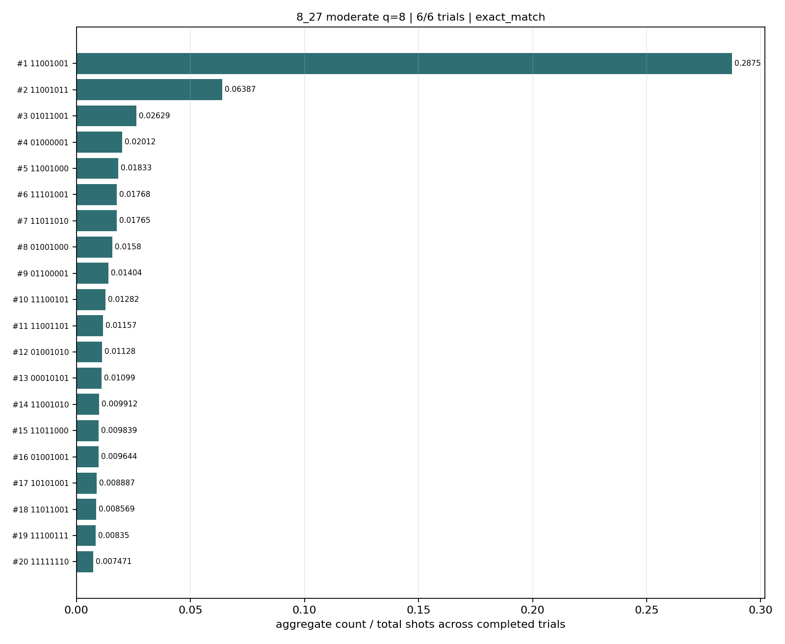
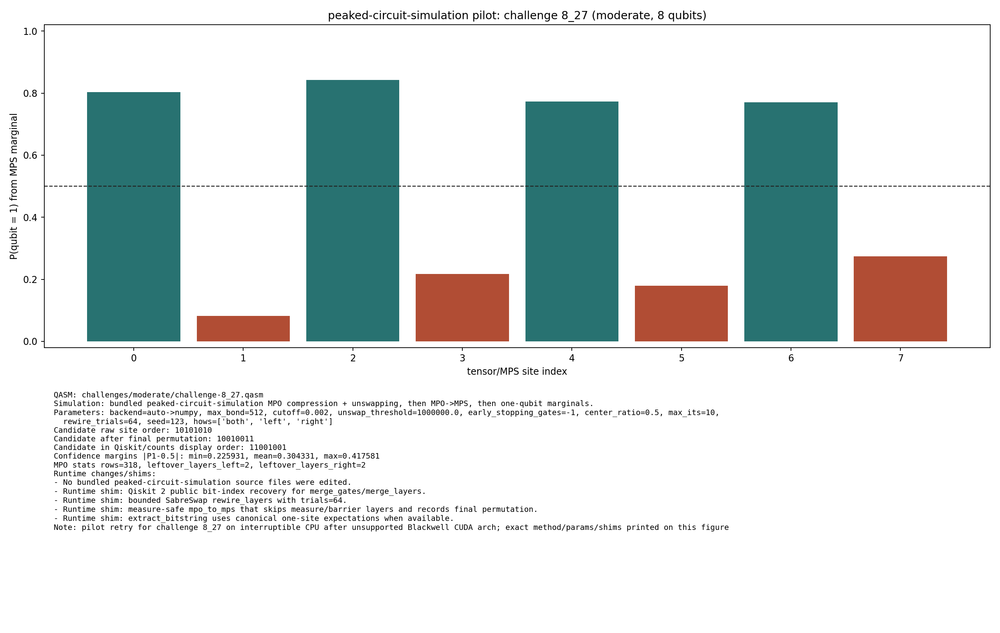
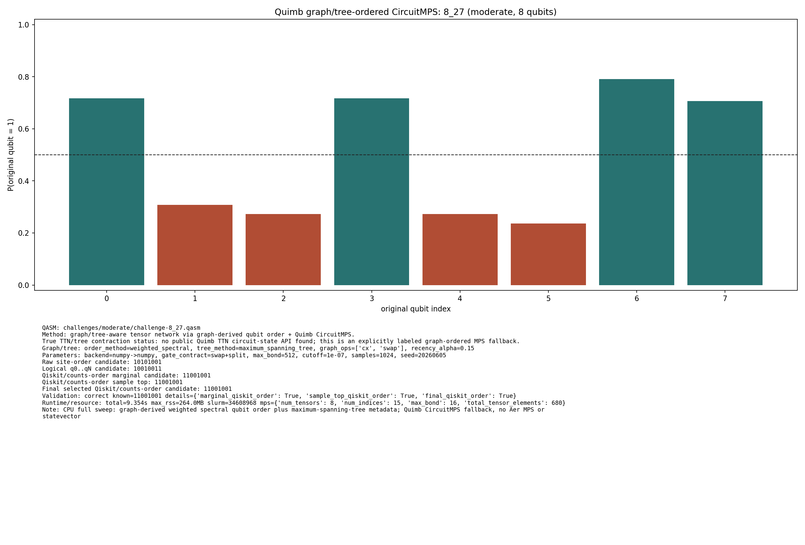
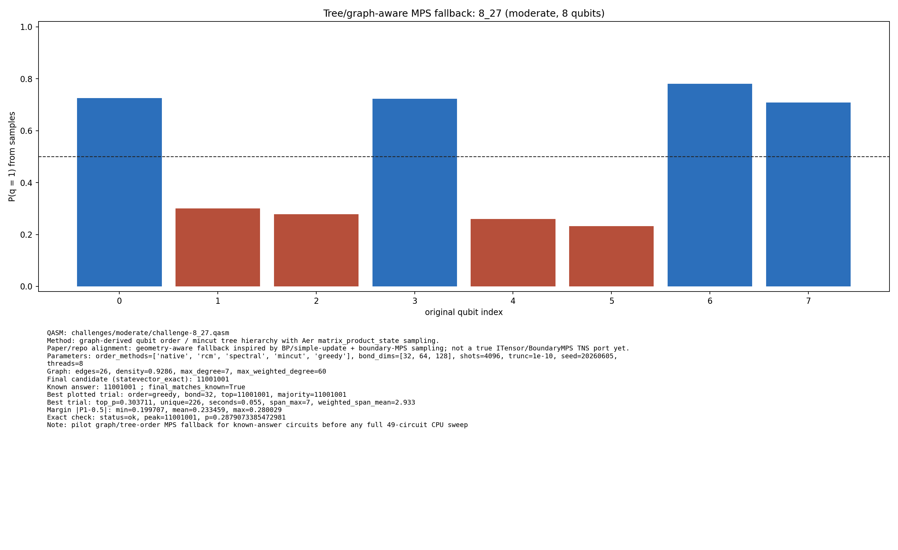

# Challenge 8_27

- Difficulty: moderate
- Qubits: 8
- QASM: `challenges/moderate/challenge-8_27.qasm`
- Central selected answer: `11001001`
- Selected method: `exact_statevector`
- Selected review: none
- Candidate rows: 535
- Method runs: 36
- Distribution figures: 6

## Selected Answer Sources

| source | selected answer | method | validation | status | evidence |
|---|---|---|---|---|---:|
| tree_tensor_sim_session | `11001001` | exact_statevector | exact | selected | 2 |
| quantum_peak_session | `11001001` | exact_statevector | exact | selected | 2 |

## Method Summary

| method | family | runs | statuses | best or marked candidate | rank_type | score | fraction | review | sources |
|---|---|---:|---|---|---|---:|---:|---|---|
| aer_mps_adaptive_sweep | mps | 1 | ok | `11001001` | aggregate_candidate | 0.28747559 | 0.28747559 |  | mps_adaptive_sweep |
| aer_tree_mps_all | mps | 8 | ok | `11001001` | final_candidate | 0.2879073385472981 | 0.2879073385472981 |  | tree_tensor_sim_session |
| aer_tree_mps_pilot | mps | 15 | ok | `11001001` | final_candidate | 0.2879073385472981 | 0.2879073385472981 |  | tree_tensor_sim_session |
| algebraic_simplify_cxswap | heuristic | 1 | static_analysis | `00011000` | static_heuristic |  |  |  | algebraic_simplify |
| algebraic_simplify_swaponly | heuristic | 1 | static_analysis | `00001010` | static_heuristic |  |  |  | algebraic_simplify |
| collector_snapshot | collector | 2 | exact | `11001001` | collector_selected | 0.2879073385472982 | 0.2879073385472982 |  | quantum_peak_session,tree_tensor_sim_session |
| exact_statevector | exact | 3 | exact,ok | `11001001` | exact_top | 0.2879073385472982 | 0.2879073385472982 |  | quantum_peak_session,tree_tensor_sim_session |
| peaked_mpo_mps | mps | 2 | ok | `11001001` | marginal_candidate | 0.2259314960027733 |  |  | quantum_peak_session,tree_tensor_sim_session |
| quimb_cpu_all | quimb | 2 | correct,ok | `11001001` | final_candidate | 0.1924601153895934 |  |  | quantum_peak_session,tree_tensor_sim_session |
| quimb_pilot | quimb | 1 | ok | `11001001` | final_candidate | 0.19246011538961683 |  |  | tree_tensor_sim_session |

## Method Selector

| first action | best method | best score | MPS | TNO | MPO-unswap |
|---|---|---:|---:|---:|---:|
| Exact statevector baseline | Low-bond MPS with bitstring distillation | 48 | 48 | 3 | 45 |

## Distribution Figures

### Adaptive Aer MPS distribution: challenge-8_27.png

### Peaked MPO/MPS distribution: challenge-8_27.peaked_mpo_mps.png

### Quimb graph-ordered MPS distribution: challenge-8_27.quimb_tree_graph_mps.png

### Quimb graph-ordered MPS distribution: challenge-8_27.quimb_tree_graph_mps.png

### Tree/order MPS distribution: challenge-8_27.tree_tensor_mps.png

### Tree/order MPS distribution: challenge-8_27.tree_tensor_mps.png

## Candidate Rows

| review | selected | method | rank_type | rank | bitstring | score | count | support | fraction | validation | status | sources | source path | notes |
|---|---:|---|---|---:|---|---:|---:|---:|---:|---|---|---|---|---|
|  | 1 | collector_snapshot | collector_selected | 1 | `11001001` | 0.2879073385472982 |  |  | 0.2879073385472982 | exact | exact | tree_tensor_sim_session | `research/tree_tensor_sim_session/artifacts/collector/CANDIDATES.tsv` | exact_statevector |
|  | 1 | collector_snapshot | collector_selected | 1 | `11001001` | 0.2879073385472982 |  |  | 0.2879073385472982 | exact | exact | quantum_peak_session | `research/quantum_peak_session/results/current_candidates/CANDIDATES.tsv` | exact_statevector |
|  | 1 | aer_tree_mps_all | final_candidate | 1 | `11001001` | 0.2879073385472981 |  |  | 0.2879073385472981 | {"bit_order_note":"Right-most bit is qubit 0.","final_matches_known":true,"known_answer":"11001001","known_answers_are_qiskit_counts_order":true} | ok | tree_tensor_sim_session | `../quantum-junction-tree-tensor/outputs/tree_tensor_sim/all/json/challenge-8_27.tree_tensor_mps.json` | statevector_exact |
|  | 1 | aer_tree_mps_pilot | final_candidate | 1 | `11001001` | 0.2879073385472981 |  |  | 0.2879073385472981 | {"bit_order_note":"Right-most bit is qubit 0.","final_matches_known":true,"known_answer":"11001001","known_answers_are_qiskit_counts_order":true} | ok | tree_tensor_sim_session | `../quantum-junction-tree-tensor/outputs/tree_tensor_sim/pilot/json/challenge-8_27.tree_tensor_mps.json` | statevector_exact |
|  | 1 | quimb_cpu_all | final_candidate | 1 | `11001001` | 0.1924601153895934 |  |  |  | {"candidate_results":{"final_qiskit_order":true,"marginal_qiskit_order":true,"sample_top_qiskit_order":true},"known_answer_qiskit_order":"11001001","status":"correct"} | ok | tree_tensor_sim_session | `../quantum-junction-tree-tensor/outputs/tree_tensor_sim/all_cpu/json/challenge-8_27.quimb_tree_graph_mps.json` | - |
|  | 1 | quimb_pilot | final_candidate | 1 | `11001001` | 0.19246011538961683 |  |  |  | {"candidate_results":{"final_qiskit_order":true,"marginal_qiskit_order":true,"sample_top_qiskit_order":true},"known_answer_qiskit_order":"11001001","status":"correct"} | ok | tree_tensor_sim_session | `../quantum-junction-tree-tensor/outputs/tree_tensor_sim/quimb_pilot/json/challenge-8_27.quimb_tree_graph_mps.json` | - |
|  | 1 | aer_mps_adaptive_sweep | aggregate_candidate | 1 | `11001001` | 0.28747559 |  | 1 | 0.28747559 | exact_match | ok | mps_adaptive_sweep | `agent_work/mps_adaptive_sweep/report/tables/mps_adaptive_summary.tsv` | aggregate_gap=4.50115; exact_match=True |
|  | 1 | peaked_mpo_mps | marginal_candidate | 1 | `11001001` | 0.2259314960027733 |  |  |  |  | ok | tree_tensor_sim_session | `../quantum-junction-tree-tensor/outputs/peaked_circuit_sim_pilot/json/challenge-8_27.peaked_mpo_mps.json` | - |
|  | 1 | peaked_mpo_mps | marginal_candidate | 1 | `11001001` | 0.2259314960027733 |  |  |  |  | ok | quantum_peak_session | `outputs/peaked_circuit_sim_pilot/json/challenge-8_27.peaked_mpo_mps.json` | - |
|  | 1 | quimb_cpu_all | marginal_candidate | 1 | `11001001` | 0.1924601153895934 |  |  |  | {"candidate_results":{"final_qiskit_order":true,"marginal_qiskit_order":true,"sample_top_qiskit_order":true},"known_answer_qiskit_order":"11001001","status":"correct"} | ok | tree_tensor_sim_session | `../quantum-junction-tree-tensor/outputs/tree_tensor_sim/all_cpu/json/challenge-8_27.quimb_tree_graph_mps.json` | - |
|  | 1 | quimb_pilot | marginal_candidate | 1 | `11001001` | 0.19246011538961683 |  |  |  | {"candidate_results":{"final_qiskit_order":true,"marginal_qiskit_order":true,"sample_top_qiskit_order":true},"known_answer_qiskit_order":"11001001","status":"correct"} | ok | tree_tensor_sim_session | `../quantum-junction-tree-tensor/outputs/tree_tensor_sim/quimb_pilot/json/challenge-8_27.quimb_tree_graph_mps.json` | - |
|  | 1 | exact_statevector | exact_top | 1 | `11001001` | 0.2879073385472982 |  |  | 0.2879073385472982 | exact | ok | tree_tensor_sim_session | `../quantum-junction-tree-tensor/agent_work/exact_baseline/peaks_exact.jsonl` | - |
|  | 1 | exact_statevector | exact_top | 1 | `11001001` | 0.2879073385472982 |  |  | 0.2879073385472982 | exact | ok | quantum_peak_session | `agent_work/exact_baseline/peaks_exact.jsonl` | - |
|  | 1 | quimb_cpu_all | sample_top | 1 | `11001001` | 0.2705078125 | 277 |  | 0.2705078125 | {"candidate_results":{"final_qiskit_order":true,"marginal_qiskit_order":true,"sample_top_qiskit_order":true},"known_answer_qiskit_order":"11001001","status":"correct"} | ok | tree_tensor_sim_session | `../quantum-junction-tree-tensor/outputs/tree_tensor_sim/all_cpu/json/challenge-8_27.quimb_tree_graph_mps.json` | - |
|  | 1 | quimb_pilot | sample_top | 1 | `11001001` | 0.28369140625 | 581 |  | 0.28369140625 | {"candidate_results":{"final_qiskit_order":true,"marginal_qiskit_order":true,"sample_top_qiskit_order":true},"known_answer_qiskit_order":"11001001","status":"correct"} | ok | tree_tensor_sim_session | `../quantum-junction-tree-tensor/outputs/tree_tensor_sim/quimb_pilot/json/challenge-8_27.quimb_tree_graph_mps.json` | - |
|  | 1 | aer_tree_mps_all | sample_top | 10 | `11001001` | 0.2913818359375 | 2387 |  | 0.2913818359375 | {"bit_order_note":"Right-most bit is qubit 0.","final_matches_known":true,"known_answer":"11001001","known_answers_are_qiskit_counts_order":true} | ok | tree_tensor_sim_session | `../quantum-junction-tree-tensor/outputs/tree_tensor_sim/all/json/challenge-8_27.tree_tensor_mps.json` | - |
|  | 1 | aer_tree_mps_all | sample_top | 10 | `11001001` | 0.2864990234375 | 2347 |  | 0.2864990234375 | {"bit_order_note":"Right-most bit is qubit 0.","final_matches_known":true,"known_answer":"11001001","known_answers_are_qiskit_counts_order":true} | ok | tree_tensor_sim_session | `../quantum-junction-tree-tensor/outputs/tree_tensor_sim/all/json/challenge-8_27.tree_tensor_mps.json` | - |
|  | 1 | aer_tree_mps_pilot | sample_top | 10 | `11001001` | 0.2841796875 | 1164 |  | 0.2841796875 | {"bit_order_note":"Right-most bit is qubit 0.","final_matches_known":true,"known_answer":"11001001","known_answers_are_qiskit_counts_order":true} | ok | tree_tensor_sim_session | `../quantum-junction-tree-tensor/outputs/tree_tensor_sim/pilot/json/challenge-8_27.tree_tensor_mps.json` | - |
|  | 1 | aer_tree_mps_pilot | sample_top | 10 | `11001001` | 0.288818359375 | 1183 |  | 0.288818359375 | {"bit_order_note":"Right-most bit is qubit 0.","final_matches_known":true,"known_answer":"11001001","known_answers_are_qiskit_counts_order":true} | ok | tree_tensor_sim_session | `../quantum-junction-tree-tensor/outputs/tree_tensor_sim/pilot/json/challenge-8_27.tree_tensor_mps.json` | - |
|  | 1 | aer_tree_mps_pilot | sample_top | 10 | `11001001` | 0.285400390625 | 1169 |  | 0.285400390625 | {"bit_order_note":"Right-most bit is qubit 0.","final_matches_known":true,"known_answer":"11001001","known_answers_are_qiskit_counts_order":true} | ok | tree_tensor_sim_session | `../quantum-junction-tree-tensor/outputs/tree_tensor_sim/pilot/json/challenge-8_27.tree_tensor_mps.json` | - |
|  | 1 | aer_tree_mps_pilot | sample_top | 10 | `11001001` | 0.285400390625 | 1169 |  | 0.285400390625 | {"bit_order_note":"Right-most bit is qubit 0.","final_matches_known":true,"known_answer":"11001001","known_answers_are_qiskit_counts_order":true} | ok | tree_tensor_sim_session | `../quantum-junction-tree-tensor/outputs/tree_tensor_sim/pilot/json/challenge-8_27.tree_tensor_mps.json` | - |
|  | 1 | aer_tree_mps_pilot | sample_top | 10 | `11001001` | 0.290771484375 | 1191 |  | 0.290771484375 | {"bit_order_note":"Right-most bit is qubit 0.","final_matches_known":true,"known_answer":"11001001","known_answers_are_qiskit_counts_order":true} | ok | tree_tensor_sim_session | `../quantum-junction-tree-tensor/outputs/tree_tensor_sim/pilot/json/challenge-8_27.tree_tensor_mps.json` | - |
|  | 1 | aer_tree_mps_all | sample_top | 11 | `11001001` | 0.2857666015625 | 2341 |  | 0.2857666015625 | {"bit_order_note":"Right-most bit is qubit 0.","final_matches_known":true,"known_answer":"11001001","known_answers_are_qiskit_counts_order":true} | ok | tree_tensor_sim_session | `../quantum-junction-tree-tensor/outputs/tree_tensor_sim/all/json/challenge-8_27.tree_tensor_mps.json` | - |
|  | 1 | aer_tree_mps_all | sample_top | 11 | `11001001` | 0.291015625 | 2384 |  | 0.291015625 | {"bit_order_note":"Right-most bit is qubit 0.","final_matches_known":true,"known_answer":"11001001","known_answers_are_qiskit_counts_order":true} | ok | tree_tensor_sim_session | `../quantum-junction-tree-tensor/outputs/tree_tensor_sim/all/json/challenge-8_27.tree_tensor_mps.json` | - |
|  | 1 | aer_tree_mps_all | sample_top | 11 | `11001001` | 0.28271484375 | 2316 |  | 0.28271484375 | {"bit_order_note":"Right-most bit is qubit 0.","final_matches_known":true,"known_answer":"11001001","known_answers_are_qiskit_counts_order":true} | ok | tree_tensor_sim_session | `../quantum-junction-tree-tensor/outputs/tree_tensor_sim/all/json/challenge-8_27.tree_tensor_mps.json` | - |
|  | 1 | aer_tree_mps_pilot | sample_top | 11 | `11001001` | 0.290771484375 | 1191 |  | 0.290771484375 | {"bit_order_note":"Right-most bit is qubit 0.","final_matches_known":true,"known_answer":"11001001","known_answers_are_qiskit_counts_order":true} | ok | tree_tensor_sim_session | `../quantum-junction-tree-tensor/outputs/tree_tensor_sim/pilot/json/challenge-8_27.tree_tensor_mps.json` | - |
|  | 1 | aer_tree_mps_pilot | sample_top | 11 | `11001001` | 0.282958984375 | 1159 |  | 0.282958984375 | {"bit_order_note":"Right-most bit is qubit 0.","final_matches_known":true,"known_answer":"11001001","known_answers_are_qiskit_counts_order":true} | ok | tree_tensor_sim_session | `../quantum-junction-tree-tensor/outputs/tree_tensor_sim/pilot/json/challenge-8_27.tree_tensor_mps.json` | - |
|  | 1 | aer_tree_mps_pilot | sample_top | 11 | `11001001` | 0.29345703125 | 1202 |  | 0.29345703125 | {"bit_order_note":"Right-most bit is qubit 0.","final_matches_known":true,"known_answer":"11001001","known_answers_are_qiskit_counts_order":true} | ok | tree_tensor_sim_session | `../quantum-junction-tree-tensor/outputs/tree_tensor_sim/pilot/json/challenge-8_27.tree_tensor_mps.json` | - |
|  | 1 | aer_tree_mps_pilot | sample_top | 11 | `11001001` | 0.29541015625 | 1210 |  | 0.29541015625 | {"bit_order_note":"Right-most bit is qubit 0.","final_matches_known":true,"known_answer":"11001001","known_answers_are_qiskit_counts_order":true} | ok | tree_tensor_sim_session | `../quantum-junction-tree-tensor/outputs/tree_tensor_sim/pilot/json/challenge-8_27.tree_tensor_mps.json` | - |
|  | 1 | aer_tree_mps_pilot | sample_top | 11 | `11001001` | 0.28759765625 | 1178 |  | 0.28759765625 | {"bit_order_note":"Right-most bit is qubit 0.","final_matches_known":true,"known_answer":"11001001","known_answers_are_qiskit_counts_order":true} | ok | tree_tensor_sim_session | `../quantum-junction-tree-tensor/outputs/tree_tensor_sim/pilot/json/challenge-8_27.tree_tensor_mps.json` | - |
|  | 1 | aer_tree_mps_pilot | sample_top | 11 | `11001001` | 0.27978515625 | 1146 |  | 0.27978515625 | {"bit_order_note":"Right-most bit is qubit 0.","final_matches_known":true,"known_answer":"11001001","known_answers_are_qiskit_counts_order":true} | ok | tree_tensor_sim_session | `../quantum-junction-tree-tensor/outputs/tree_tensor_sim/pilot/json/challenge-8_27.tree_tensor_mps.json` | - |
|  | 1 | aer_tree_mps_all | sample_top | 12 | `11001001` | 0.29296875 | 2400 |  | 0.29296875 | {"bit_order_note":"Right-most bit is qubit 0.","final_matches_known":true,"known_answer":"11001001","known_answers_are_qiskit_counts_order":true} | ok | tree_tensor_sim_session | `../quantum-junction-tree-tensor/outputs/tree_tensor_sim/all/json/challenge-8_27.tree_tensor_mps.json` | - |
|  | 1 | aer_tree_mps_all | sample_top | 12 | `11001001` | 0.28662109375 | 2348 |  | 0.28662109375 | {"bit_order_note":"Right-most bit is qubit 0.","final_matches_known":true,"known_answer":"11001001","known_answers_are_qiskit_counts_order":true} | ok | tree_tensor_sim_session | `../quantum-junction-tree-tensor/outputs/tree_tensor_sim/all/json/challenge-8_27.tree_tensor_mps.json` | - |
|  | 1 | aer_tree_mps_all | sample_top | 12 | `11001001` | 0.2833251953125 | 2321 |  | 0.2833251953125 | {"bit_order_note":"Right-most bit is qubit 0.","final_matches_known":true,"known_answer":"11001001","known_answers_are_qiskit_counts_order":true} | ok | tree_tensor_sim_session | `../quantum-junction-tree-tensor/outputs/tree_tensor_sim/all/json/challenge-8_27.tree_tensor_mps.json` | - |
|  | 1 | aer_tree_mps_pilot | sample_top | 12 | `11001001` | 0.28515625 | 1168 |  | 0.28515625 | {"bit_order_note":"Right-most bit is qubit 0.","final_matches_known":true,"known_answer":"11001001","known_answers_are_qiskit_counts_order":true} | ok | tree_tensor_sim_session | `../quantum-junction-tree-tensor/outputs/tree_tensor_sim/pilot/json/challenge-8_27.tree_tensor_mps.json` | - |
|  | 1 | aer_tree_mps_pilot | sample_top | 12 | `11001001` | 0.3037109375 | 1244 |  | 0.3037109375 | {"bit_order_note":"Right-most bit is qubit 0.","final_matches_known":true,"known_answer":"11001001","known_answers_are_qiskit_counts_order":true} | ok | tree_tensor_sim_session | `../quantum-junction-tree-tensor/outputs/tree_tensor_sim/pilot/json/challenge-8_27.tree_tensor_mps.json` | - |
|  | 1 | aer_tree_mps_pilot | sample_top | 12 | `11001001` | 0.28369140625 | 1162 |  | 0.28369140625 | {"bit_order_note":"Right-most bit is qubit 0.","final_matches_known":true,"known_answer":"11001001","known_answers_are_qiskit_counts_order":true} | ok | tree_tensor_sim_session | `../quantum-junction-tree-tensor/outputs/tree_tensor_sim/pilot/json/challenge-8_27.tree_tensor_mps.json` | - |
|  | 1 | aer_tree_mps_pilot | sample_top | 12 | `11001001` | 0.289306640625 | 1185 |  | 0.289306640625 | {"bit_order_note":"Right-most bit is qubit 0.","final_matches_known":true,"known_answer":"11001001","known_answers_are_qiskit_counts_order":true} | ok | tree_tensor_sim_session | `../quantum-junction-tree-tensor/outputs/tree_tensor_sim/pilot/json/challenge-8_27.tree_tensor_mps.json` | - |
|  | 1 | aer_mps_adaptive_sweep | aggregate_top_counts | 1 | `11001001` | 0.28747559 | 11775 |  | 0.28747559 |  | ok | mps_adaptive_sweep | `agent_work/mps_adaptive_sweep/report/tables/mps_adaptive_top_counts.tsv` |  |
|  | 1 | exact_statevector | collector_evidence | 1 | `11001001` | 0.2879073385472982 |  |  | 0.2879073385472982 | exact | exact | quantum_peak_session,tree_tensor_sim_session | `agent_work/exact_baseline/peaks_exact.csv` | collector priority 100 |
|  | 1 | quimb_cpu_all | collector_evidence | 2 | `11001001` | 0.2705078125 |  |  | 0.2705078125 | correct | correct | quantum_peak_session,tree_tensor_sim_session | `outputs/tree_tensor_sim/all_cpu/json/challenge-8_27.quimb_tree_graph_mps.json` | collector priority 80 |
|  | 0 | exact_statevector | exact_top | 2 | `11001011` | 0.0626945711035967 |  |  | 0.0626945711035967 | exact | ok | tree_tensor_sim_session | `../quantum-junction-tree-tensor/agent_work/exact_baseline/peaks_exact.jsonl` | - |
|  | 0 | exact_statevector | exact_top | 2 | `11001011` | 0.0626945711035967 |  |  | 0.0626945711035967 | exact | ok | quantum_peak_session | `agent_work/exact_baseline/peaks_exact.jsonl` | - |
|  | 0 | exact_statevector | exact_top | 3 | `01011001` | 0.028597653301806223 |  |  | 0.028597653301806223 | exact | ok | tree_tensor_sim_session | `../quantum-junction-tree-tensor/agent_work/exact_baseline/peaks_exact.jsonl` | - |
|  | 0 | exact_statevector | exact_top | 3 | `01011001` | 0.028597653301806223 |  |  | 0.028597653301806223 | exact | ok | quantum_peak_session | `agent_work/exact_baseline/peaks_exact.jsonl` | - |
|  | 0 | exact_statevector | exact_top | 4 | `01000001` | 0.020380977695414255 |  |  | 0.020380977695414255 | exact | ok | tree_tensor_sim_session | `../quantum-junction-tree-tensor/agent_work/exact_baseline/peaks_exact.jsonl` | - |
|  | 0 | exact_statevector | exact_top | 4 | `01000001` | 0.020380977695414255 |  |  | 0.020380977695414255 | exact | ok | quantum_peak_session | `agent_work/exact_baseline/peaks_exact.jsonl` | - |
|  | 0 | exact_statevector | exact_top | 5 | `11101001` | 0.01873819703408229 |  |  | 0.01873819703408229 | exact | ok | tree_tensor_sim_session | `../quantum-junction-tree-tensor/agent_work/exact_baseline/peaks_exact.jsonl` | - |
|  | 0 | exact_statevector | exact_top | 5 | `11101001` | 0.01873819703408229 |  |  | 0.01873819703408229 | exact | ok | quantum_peak_session | `agent_work/exact_baseline/peaks_exact.jsonl` | - |
|  | 0 | exact_statevector | exact_top | 6 | `11001000` | 0.017180788625629755 |  |  | 0.017180788625629755 | exact | ok | tree_tensor_sim_session | `../quantum-junction-tree-tensor/agent_work/exact_baseline/peaks_exact.jsonl` | - |
|  | 0 | exact_statevector | exact_top | 6 | `11001000` | 0.017180788625629755 |  |  | 0.017180788625629755 | exact | ok | quantum_peak_session | `agent_work/exact_baseline/peaks_exact.jsonl` | - |
|  | 0 | exact_statevector | exact_top | 7 | `11011010` | 0.017136661484415314 |  |  | 0.017136661484415314 | exact | ok | tree_tensor_sim_session | `../quantum-junction-tree-tensor/agent_work/exact_baseline/peaks_exact.jsonl` | - |
|  | 0 | exact_statevector | exact_top | 7 | `11011010` | 0.017136661484415314 |  |  | 0.017136661484415314 | exact | ok | quantum_peak_session | `agent_work/exact_baseline/peaks_exact.jsonl` | - |
|  | 0 | exact_statevector | exact_top | 8 | `01001000` | 0.01466935440348336 |  |  | 0.01466935440348336 | exact | ok | tree_tensor_sim_session | `../quantum-junction-tree-tensor/agent_work/exact_baseline/peaks_exact.jsonl` | - |
|  | 0 | exact_statevector | exact_top | 8 | `01001000` | 0.01466935440348336 |  |  | 0.01466935440348336 | exact | ok | quantum_peak_session | `agent_work/exact_baseline/peaks_exact.jsonl` | - |
|  | 0 | aer_tree_mps_all | sample_top | 1 | `00010100` | 0.008056640625 | 66 |  | 0.008056640625 | {"bit_order_note":"Right-most bit is qubit 0.","final_matches_known":true,"known_answer":"11001001","known_answers_are_qiskit_counts_order":true} | ok | tree_tensor_sim_session | `../quantum-junction-tree-tensor/outputs/tree_tensor_sim/all/json/challenge-8_27.tree_tensor_mps.json` | - |
|  | 0 | aer_tree_mps_all | sample_top | 1 | `00010101` | 0.0106201171875 | 87 |  | 0.0106201171875 | {"bit_order_note":"Right-most bit is qubit 0.","final_matches_known":true,"known_answer":"11001001","known_answers_are_qiskit_counts_order":true} | ok | tree_tensor_sim_session | `../quantum-junction-tree-tensor/outputs/tree_tensor_sim/all/json/challenge-8_27.tree_tensor_mps.json` | - |
|  | 0 | aer_tree_mps_all | sample_top | 1 | `00010101` | 0.0098876953125 | 81 |  | 0.0098876953125 | {"bit_order_note":"Right-most bit is qubit 0.","final_matches_known":true,"known_answer":"11001001","known_answers_are_qiskit_counts_order":true} | ok | tree_tensor_sim_session | `../quantum-junction-tree-tensor/outputs/tree_tensor_sim/all/json/challenge-8_27.tree_tensor_mps.json` | - |
|  | 0 | aer_tree_mps_all | sample_top | 1 | `00010101` | 0.0115966796875 | 95 |  | 0.0115966796875 | {"bit_order_note":"Right-most bit is qubit 0.","final_matches_known":true,"known_answer":"11001001","known_answers_are_qiskit_counts_order":true} | ok | tree_tensor_sim_session | `../quantum-junction-tree-tensor/outputs/tree_tensor_sim/all/json/challenge-8_27.tree_tensor_mps.json` | - |
|  | 0 | aer_tree_mps_all | sample_top | 1 | `00010101` | 0.0103759765625 | 85 |  | 0.0103759765625 | {"bit_order_note":"Right-most bit is qubit 0.","final_matches_known":true,"known_answer":"11001001","known_answers_are_qiskit_counts_order":true} | ok | tree_tensor_sim_session | `../quantum-junction-tree-tensor/outputs/tree_tensor_sim/all/json/challenge-8_27.tree_tensor_mps.json` | - |
|  | 0 | aer_tree_mps_all | sample_top | 1 | `00010101` | 0.01171875 | 96 |  | 0.01171875 | {"bit_order_note":"Right-most bit is qubit 0.","final_matches_known":true,"known_answer":"11001001","known_answers_are_qiskit_counts_order":true} | ok | tree_tensor_sim_session | `../quantum-junction-tree-tensor/outputs/tree_tensor_sim/all/json/challenge-8_27.tree_tensor_mps.json` | - |
|  | 0 | aer_tree_mps_all | sample_top | 1 | `00010101` | 0.0103759765625 | 85 |  | 0.0103759765625 | {"bit_order_note":"Right-most bit is qubit 0.","final_matches_known":true,"known_answer":"11001001","known_answers_are_qiskit_counts_order":true} | ok | tree_tensor_sim_session | `../quantum-junction-tree-tensor/outputs/tree_tensor_sim/all/json/challenge-8_27.tree_tensor_mps.json` | - |
|  | 0 | aer_tree_mps_all | sample_top | 1 | `00010101` | 0.012939453125 | 106 |  | 0.012939453125 | {"bit_order_note":"Right-most bit is qubit 0.","final_matches_known":true,"known_answer":"11001001","known_answers_are_qiskit_counts_order":true} | ok | tree_tensor_sim_session | `../quantum-junction-tree-tensor/outputs/tree_tensor_sim/all/json/challenge-8_27.tree_tensor_mps.json` | - |
|  | 0 | aer_tree_mps_pilot | sample_top | 1 | `00010100` | 0.01025390625 | 42 |  | 0.01025390625 | {"bit_order_note":"Right-most bit is qubit 0.","final_matches_known":true,"known_answer":"11001001","known_answers_are_qiskit_counts_order":true} | ok | tree_tensor_sim_session | `../quantum-junction-tree-tensor/outputs/tree_tensor_sim/pilot/json/challenge-8_27.tree_tensor_mps.json` | - |
|  | 0 | aer_tree_mps_pilot | sample_top | 1 | `00010100` | 0.007568359375 | 31 |  | 0.007568359375 | {"bit_order_note":"Right-most bit is qubit 0.","final_matches_known":true,"known_answer":"11001001","known_answers_are_qiskit_counts_order":true} | ok | tree_tensor_sim_session | `../quantum-junction-tree-tensor/outputs/tree_tensor_sim/pilot/json/challenge-8_27.tree_tensor_mps.json` | - |
|  | 0 | aer_tree_mps_pilot | sample_top | 1 | `00010101` | 0.012451171875 | 51 |  | 0.012451171875 | {"bit_order_note":"Right-most bit is qubit 0.","final_matches_known":true,"known_answer":"11001001","known_answers_are_qiskit_counts_order":true} | ok | tree_tensor_sim_session | `../quantum-junction-tree-tensor/outputs/tree_tensor_sim/pilot/json/challenge-8_27.tree_tensor_mps.json` | - |
|  | 0 | aer_tree_mps_pilot | sample_top | 1 | `00010101` | 0.013671875 | 56 |  | 0.013671875 | {"bit_order_note":"Right-most bit is qubit 0.","final_matches_known":true,"known_answer":"11001001","known_answers_are_qiskit_counts_order":true} | ok | tree_tensor_sim_session | `../quantum-junction-tree-tensor/outputs/tree_tensor_sim/pilot/json/challenge-8_27.tree_tensor_mps.json` | - |
|  | 0 | aer_tree_mps_pilot | sample_top | 1 | `00010101` | 0.01171875 | 48 |  | 0.01171875 | {"bit_order_note":"Right-most bit is qubit 0.","final_matches_known":true,"known_answer":"11001001","known_answers_are_qiskit_counts_order":true} | ok | tree_tensor_sim_session | `../quantum-junction-tree-tensor/outputs/tree_tensor_sim/pilot/json/challenge-8_27.tree_tensor_mps.json` | - |
|  | 0 | aer_tree_mps_pilot | sample_top | 1 | `00010101` | 0.010986328125 | 45 |  | 0.010986328125 | {"bit_order_note":"Right-most bit is qubit 0.","final_matches_known":true,"known_answer":"11001001","known_answers_are_qiskit_counts_order":true} | ok | tree_tensor_sim_session | `../quantum-junction-tree-tensor/outputs/tree_tensor_sim/pilot/json/challenge-8_27.tree_tensor_mps.json` | - |
|  | 0 | aer_tree_mps_pilot | sample_top | 1 | `00010101` | 0.011474609375 | 47 |  | 0.011474609375 | {"bit_order_note":"Right-most bit is qubit 0.","final_matches_known":true,"known_answer":"11001001","known_answers_are_qiskit_counts_order":true} | ok | tree_tensor_sim_session | `../quantum-junction-tree-tensor/outputs/tree_tensor_sim/pilot/json/challenge-8_27.tree_tensor_mps.json` | - |
|  | 0 | aer_tree_mps_pilot | sample_top | 1 | `00010101` | 0.01416015625 | 58 |  | 0.01416015625 | {"bit_order_note":"Right-most bit is qubit 0.","final_matches_known":true,"known_answer":"11001001","known_answers_are_qiskit_counts_order":true} | ok | tree_tensor_sim_session | `../quantum-junction-tree-tensor/outputs/tree_tensor_sim/pilot/json/challenge-8_27.tree_tensor_mps.json` | - |
|  | 0 | aer_tree_mps_pilot | sample_top | 1 | `00010101` | 0.01171875 | 48 |  | 0.01171875 | {"bit_order_note":"Right-most bit is qubit 0.","final_matches_known":true,"known_answer":"11001001","known_answers_are_qiskit_counts_order":true} | ok | tree_tensor_sim_session | `../quantum-junction-tree-tensor/outputs/tree_tensor_sim/pilot/json/challenge-8_27.tree_tensor_mps.json` | - |
|  | 0 | aer_tree_mps_pilot | sample_top | 1 | `00010101` | 0.012451171875 | 51 |  | 0.012451171875 | {"bit_order_note":"Right-most bit is qubit 0.","final_matches_known":true,"known_answer":"11001001","known_answers_are_qiskit_counts_order":true} | ok | tree_tensor_sim_session | `../quantum-junction-tree-tensor/outputs/tree_tensor_sim/pilot/json/challenge-8_27.tree_tensor_mps.json` | - |
|  | 0 | aer_tree_mps_pilot | sample_top | 1 | `00010101` | 0.013671875 | 56 |  | 0.013671875 | {"bit_order_note":"Right-most bit is qubit 0.","final_matches_known":true,"known_answer":"11001001","known_answers_are_qiskit_counts_order":true} | ok | tree_tensor_sim_session | `../quantum-junction-tree-tensor/outputs/tree_tensor_sim/pilot/json/challenge-8_27.tree_tensor_mps.json` | - |
|  | 0 | aer_tree_mps_pilot | sample_top | 1 | `00010101` | 0.01220703125 | 50 |  | 0.01220703125 | {"bit_order_note":"Right-most bit is qubit 0.","final_matches_known":true,"known_answer":"11001001","known_answers_are_qiskit_counts_order":true} | ok | tree_tensor_sim_session | `../quantum-junction-tree-tensor/outputs/tree_tensor_sim/pilot/json/challenge-8_27.tree_tensor_mps.json` | - |
|  | 0 | aer_tree_mps_pilot | sample_top | 1 | `00010101` | 0.010986328125 | 45 |  | 0.010986328125 | {"bit_order_note":"Right-most bit is qubit 0.","final_matches_known":true,"known_answer":"11001001","known_answers_are_qiskit_counts_order":true} | ok | tree_tensor_sim_session | `../quantum-junction-tree-tensor/outputs/tree_tensor_sim/pilot/json/challenge-8_27.tree_tensor_mps.json` | - |
|  | 0 | aer_tree_mps_pilot | sample_top | 1 | `00010101` | 0.010498046875 | 43 |  | 0.010498046875 | {"bit_order_note":"Right-most bit is qubit 0.","final_matches_known":true,"known_answer":"11001001","known_answers_are_qiskit_counts_order":true} | ok | tree_tensor_sim_session | `../quantum-junction-tree-tensor/outputs/tree_tensor_sim/pilot/json/challenge-8_27.tree_tensor_mps.json` | - |
|  | 0 | aer_tree_mps_pilot | sample_top | 1 | `00010101` | 0.012939453125 | 53 |  | 0.012939453125 | {"bit_order_note":"Right-most bit is qubit 0.","final_matches_known":true,"known_answer":"11001001","known_answers_are_qiskit_counts_order":true} | ok | tree_tensor_sim_session | `../quantum-junction-tree-tensor/outputs/tree_tensor_sim/pilot/json/challenge-8_27.tree_tensor_mps.json` | - |
|  | 0 | aer_tree_mps_all | sample_top | 2 | `00010101` | 0.010986328125 | 90 |  | 0.010986328125 | {"bit_order_note":"Right-most bit is qubit 0.","final_matches_known":true,"known_answer":"11001001","known_answers_are_qiskit_counts_order":true} | ok | tree_tensor_sim_session | `../quantum-junction-tree-tensor/outputs/tree_tensor_sim/all/json/challenge-8_27.tree_tensor_mps.json` | - |
|  | 0 | aer_tree_mps_all | sample_top | 2 | `00011111` | 0.0079345703125 | 65 |  | 0.0079345703125 | {"bit_order_note":"Right-most bit is qubit 0.","final_matches_known":true,"known_answer":"11001001","known_answers_are_qiskit_counts_order":true} | ok | tree_tensor_sim_session | `../quantum-junction-tree-tensor/outputs/tree_tensor_sim/all/json/challenge-8_27.tree_tensor_mps.json` | - |
|  | 0 | aer_tree_mps_all | sample_top | 2 | `01000001` | 0.01904296875 | 156 |  | 0.01904296875 | {"bit_order_note":"Right-most bit is qubit 0.","final_matches_known":true,"known_answer":"11001001","known_answers_are_qiskit_counts_order":true} | ok | tree_tensor_sim_session | `../quantum-junction-tree-tensor/outputs/tree_tensor_sim/all/json/challenge-8_27.tree_tensor_mps.json` | - |
|  | 0 | aer_tree_mps_all | sample_top | 2 | `01000001` | 0.0218505859375 | 179 |  | 0.0218505859375 | {"bit_order_note":"Right-most bit is qubit 0.","final_matches_known":true,"known_answer":"11001001","known_answers_are_qiskit_counts_order":true} | ok | tree_tensor_sim_session | `../quantum-junction-tree-tensor/outputs/tree_tensor_sim/all/json/challenge-8_27.tree_tensor_mps.json` | - |
|  | 0 | aer_tree_mps_all | sample_top | 2 | `01000001` | 0.023681640625 | 194 |  | 0.023681640625 | {"bit_order_note":"Right-most bit is qubit 0.","final_matches_known":true,"known_answer":"11001001","known_answers_are_qiskit_counts_order":true} | ok | tree_tensor_sim_session | `../quantum-junction-tree-tensor/outputs/tree_tensor_sim/all/json/challenge-8_27.tree_tensor_mps.json` | - |
|  | 0 | aer_tree_mps_all | sample_top | 2 | `01000001` | 0.020751953125 | 170 |  | 0.020751953125 | {"bit_order_note":"Right-most bit is qubit 0.","final_matches_known":true,"known_answer":"11001001","known_answers_are_qiskit_counts_order":true} | ok | tree_tensor_sim_session | `../quantum-junction-tree-tensor/outputs/tree_tensor_sim/all/json/challenge-8_27.tree_tensor_mps.json` | - |
|  | 0 | aer_tree_mps_all | sample_top | 2 | `01000001` | 0.018310546875 | 150 |  | 0.018310546875 | {"bit_order_note":"Right-most bit is qubit 0.","final_matches_known":true,"known_answer":"11001001","known_answers_are_qiskit_counts_order":true} | ok | tree_tensor_sim_session | `../quantum-junction-tree-tensor/outputs/tree_tensor_sim/all/json/challenge-8_27.tree_tensor_mps.json` | - |
|  | 0 | aer_tree_mps_all | sample_top | 2 | `01000001` | 0.0203857421875 | 167 |  | 0.0203857421875 | {"bit_order_note":"Right-most bit is qubit 0.","final_matches_known":true,"known_answer":"11001001","known_answers_are_qiskit_counts_order":true} | ok | tree_tensor_sim_session | `../quantum-junction-tree-tensor/outputs/tree_tensor_sim/all/json/challenge-8_27.tree_tensor_mps.json` | - |
|  | 0 | aer_tree_mps_pilot | sample_top | 2 | `00010101` | 0.010986328125 | 45 |  | 0.010986328125 | {"bit_order_note":"Right-most bit is qubit 0.","final_matches_known":true,"known_answer":"11001001","known_answers_are_qiskit_counts_order":true} | ok | tree_tensor_sim_session | `../quantum-junction-tree-tensor/outputs/tree_tensor_sim/pilot/json/challenge-8_27.tree_tensor_mps.json` | - |
|  | 0 | aer_tree_mps_pilot | sample_top | 2 | `00010101` | 0.00830078125 | 34 |  | 0.00830078125 | {"bit_order_note":"Right-most bit is qubit 0.","final_matches_known":true,"known_answer":"11001001","known_answers_are_qiskit_counts_order":true} | ok | tree_tensor_sim_session | `../quantum-junction-tree-tensor/outputs/tree_tensor_sim/pilot/json/challenge-8_27.tree_tensor_mps.json` | - |
|  | 0 | aer_tree_mps_pilot | sample_top | 2 | `00011111` | 0.00927734375 | 38 |  | 0.00927734375 | {"bit_order_note":"Right-most bit is qubit 0.","final_matches_known":true,"known_answer":"11001001","known_answers_are_qiskit_counts_order":true} | ok | tree_tensor_sim_session | `../quantum-junction-tree-tensor/outputs/tree_tensor_sim/pilot/json/challenge-8_27.tree_tensor_mps.json` | - |
|  | 0 | aer_tree_mps_pilot | sample_top | 2 | `00011111` | 0.0087890625 | 36 |  | 0.0087890625 | {"bit_order_note":"Right-most bit is qubit 0.","final_matches_known":true,"known_answer":"11001001","known_answers_are_qiskit_counts_order":true} | ok | tree_tensor_sim_session | `../quantum-junction-tree-tensor/outputs/tree_tensor_sim/pilot/json/challenge-8_27.tree_tensor_mps.json` | - |
|  | 0 | aer_tree_mps_pilot | sample_top | 2 | `01000001` | 0.021728515625 | 89 |  | 0.021728515625 | {"bit_order_note":"Right-most bit is qubit 0.","final_matches_known":true,"known_answer":"11001001","known_answers_are_qiskit_counts_order":true} | ok | tree_tensor_sim_session | `../quantum-junction-tree-tensor/outputs/tree_tensor_sim/pilot/json/challenge-8_27.tree_tensor_mps.json` | - |
|  | 0 | aer_tree_mps_pilot | sample_top | 2 | `01000001` | 0.022216796875 | 91 |  | 0.022216796875 | {"bit_order_note":"Right-most bit is qubit 0.","final_matches_known":true,"known_answer":"11001001","known_answers_are_qiskit_counts_order":true} | ok | tree_tensor_sim_session | `../quantum-junction-tree-tensor/outputs/tree_tensor_sim/pilot/json/challenge-8_27.tree_tensor_mps.json` | - |
|  | 0 | aer_tree_mps_pilot | sample_top | 2 | `01000001` | 0.01611328125 | 66 |  | 0.01611328125 | {"bit_order_note":"Right-most bit is qubit 0.","final_matches_known":true,"known_answer":"11001001","known_answers_are_qiskit_counts_order":true} | ok | tree_tensor_sim_session | `../quantum-junction-tree-tensor/outputs/tree_tensor_sim/pilot/json/challenge-8_27.tree_tensor_mps.json` | - |
|  | 0 | aer_tree_mps_pilot | sample_top | 2 | `01000001` | 0.02001953125 | 82 |  | 0.02001953125 | {"bit_order_note":"Right-most bit is qubit 0.","final_matches_known":true,"known_answer":"11001001","known_answers_are_qiskit_counts_order":true} | ok | tree_tensor_sim_session | `../quantum-junction-tree-tensor/outputs/tree_tensor_sim/pilot/json/challenge-8_27.tree_tensor_mps.json` | - |
|  | 0 | aer_tree_mps_pilot | sample_top | 2 | `01000001` | 0.01953125 | 80 |  | 0.01953125 | {"bit_order_note":"Right-most bit is qubit 0.","final_matches_known":true,"known_answer":"11001001","known_answers_are_qiskit_counts_order":true} | ok | tree_tensor_sim_session | `../quantum-junction-tree-tensor/outputs/tree_tensor_sim/pilot/json/challenge-8_27.tree_tensor_mps.json` | - |
|  | 0 | aer_tree_mps_pilot | sample_top | 2 | `01000001` | 0.02294921875 | 94 |  | 0.02294921875 | {"bit_order_note":"Right-most bit is qubit 0.","final_matches_known":true,"known_answer":"11001001","known_answers_are_qiskit_counts_order":true} | ok | tree_tensor_sim_session | `../quantum-junction-tree-tensor/outputs/tree_tensor_sim/pilot/json/challenge-8_27.tree_tensor_mps.json` | - |
|  | 0 | aer_tree_mps_pilot | sample_top | 2 | `01000001` | 0.01806640625 | 74 |  | 0.01806640625 | {"bit_order_note":"Right-most bit is qubit 0.","final_matches_known":true,"known_answer":"11001001","known_answers_are_qiskit_counts_order":true} | ok | tree_tensor_sim_session | `../quantum-junction-tree-tensor/outputs/tree_tensor_sim/pilot/json/challenge-8_27.tree_tensor_mps.json` | - |
|  | 0 | aer_tree_mps_pilot | sample_top | 2 | `01000001` | 0.019287109375 | 79 |  | 0.019287109375 | {"bit_order_note":"Right-most bit is qubit 0.","final_matches_known":true,"known_answer":"11001001","known_answers_are_qiskit_counts_order":true} | ok | tree_tensor_sim_session | `../quantum-junction-tree-tensor/outputs/tree_tensor_sim/pilot/json/challenge-8_27.tree_tensor_mps.json` | - |
|  | 0 | aer_tree_mps_pilot | sample_top | 2 | `01000001` | 0.0205078125 | 84 |  | 0.0205078125 | {"bit_order_note":"Right-most bit is qubit 0.","final_matches_known":true,"known_answer":"11001001","known_answers_are_qiskit_counts_order":true} | ok | tree_tensor_sim_session | `../quantum-junction-tree-tensor/outputs/tree_tensor_sim/pilot/json/challenge-8_27.tree_tensor_mps.json` | - |
|  | 0 | aer_tree_mps_pilot | sample_top | 2 | `01000001` | 0.02392578125 | 98 |  | 0.02392578125 | {"bit_order_note":"Right-most bit is qubit 0.","final_matches_known":true,"known_answer":"11001001","known_answers_are_qiskit_counts_order":true} | ok | tree_tensor_sim_session | `../quantum-junction-tree-tensor/outputs/tree_tensor_sim/pilot/json/challenge-8_27.tree_tensor_mps.json` | - |
|  | 0 | aer_tree_mps_pilot | sample_top | 2 | `01000001` | 0.019287109375 | 79 |  | 0.019287109375 | {"bit_order_note":"Right-most bit is qubit 0.","final_matches_known":true,"known_answer":"11001001","known_answers_are_qiskit_counts_order":true} | ok | tree_tensor_sim_session | `../quantum-junction-tree-tensor/outputs/tree_tensor_sim/pilot/json/challenge-8_27.tree_tensor_mps.json` | - |
|  | 0 | quimb_cpu_all | sample_top | 2 | `11001011` | 0.0595703125 | 61 |  | 0.0595703125 | {"candidate_results":{"final_qiskit_order":true,"marginal_qiskit_order":true,"sample_top_qiskit_order":true},"known_answer_qiskit_order":"11001001","status":"correct"} | ok | tree_tensor_sim_session | `../quantum-junction-tree-tensor/outputs/tree_tensor_sim/all_cpu/json/challenge-8_27.quimb_tree_graph_mps.json` | - |
|  | 0 | quimb_pilot | sample_top | 2 | `11001011` | 0.056640625 | 116 |  | 0.056640625 | {"candidate_results":{"final_qiskit_order":true,"marginal_qiskit_order":true,"sample_top_qiskit_order":true},"known_answer_qiskit_order":"11001001","status":"correct"} | ok | tree_tensor_sim_session | `../quantum-junction-tree-tensor/outputs/tree_tensor_sim/quimb_pilot/json/challenge-8_27.quimb_tree_graph_mps.json` | - |
|  | 0 | aer_tree_mps_all | sample_top | 3 | `01000001` | 0.0205078125 | 168 |  | 0.0205078125 | {"bit_order_note":"Right-most bit is qubit 0.","final_matches_known":true,"known_answer":"11001001","known_answers_are_qiskit_counts_order":true} | ok | tree_tensor_sim_session | `../quantum-junction-tree-tensor/outputs/tree_tensor_sim/all/json/challenge-8_27.tree_tensor_mps.json` | - |
|  | 0 | aer_tree_mps_all | sample_top | 3 | `01000001` | 0.0240478515625 | 197 |  | 0.0240478515625 | {"bit_order_note":"Right-most bit is qubit 0.","final_matches_known":true,"known_answer":"11001001","known_answers_are_qiskit_counts_order":true} | ok | tree_tensor_sim_session | `../quantum-junction-tree-tensor/outputs/tree_tensor_sim/all/json/challenge-8_27.tree_tensor_mps.json` | - |
|  | 0 | aer_tree_mps_all | sample_top | 3 | `01001000` | 0.0159912109375 | 131 |  | 0.0159912109375 | {"bit_order_note":"Right-most bit is qubit 0.","final_matches_known":true,"known_answer":"11001001","known_answers_are_qiskit_counts_order":true} | ok | tree_tensor_sim_session | `../quantum-junction-tree-tensor/outputs/tree_tensor_sim/all/json/challenge-8_27.tree_tensor_mps.json` | - |
|  | 0 | aer_tree_mps_all | sample_top | 3 | `01001000` | 0.014892578125 | 122 |  | 0.014892578125 | {"bit_order_note":"Right-most bit is qubit 0.","final_matches_known":true,"known_answer":"11001001","known_answers_are_qiskit_counts_order":true} | ok | tree_tensor_sim_session | `../quantum-junction-tree-tensor/outputs/tree_tensor_sim/all/json/challenge-8_27.tree_tensor_mps.json` | - |
|  | 0 | aer_tree_mps_all | sample_top | 3 | `01001000` | 0.0142822265625 | 117 |  | 0.0142822265625 | {"bit_order_note":"Right-most bit is qubit 0.","final_matches_known":true,"known_answer":"11001001","known_answers_are_qiskit_counts_order":true} | ok | tree_tensor_sim_session | `../quantum-junction-tree-tensor/outputs/tree_tensor_sim/all/json/challenge-8_27.tree_tensor_mps.json` | - |
|  | 0 | aer_tree_mps_all | sample_top | 3 | `01001000` | 0.013671875 | 112 |  | 0.013671875 | {"bit_order_note":"Right-most bit is qubit 0.","final_matches_known":true,"known_answer":"11001001","known_answers_are_qiskit_counts_order":true} | ok | tree_tensor_sim_session | `../quantum-junction-tree-tensor/outputs/tree_tensor_sim/all/json/challenge-8_27.tree_tensor_mps.json` | - |
|  | 0 | aer_tree_mps_all | sample_top | 3 | `01001000` | 0.0147705078125 | 121 |  | 0.0147705078125 | {"bit_order_note":"Right-most bit is qubit 0.","final_matches_known":true,"known_answer":"11001001","known_answers_are_qiskit_counts_order":true} | ok | tree_tensor_sim_session | `../quantum-junction-tree-tensor/outputs/tree_tensor_sim/all/json/challenge-8_27.tree_tensor_mps.json` | - |
|  | 0 | aer_tree_mps_all | sample_top | 3 | `01001000` | 0.01416015625 | 116 |  | 0.01416015625 | {"bit_order_note":"Right-most bit is qubit 0.","final_matches_known":true,"known_answer":"11001001","known_answers_are_qiskit_counts_order":true} | ok | tree_tensor_sim_session | `../quantum-junction-tree-tensor/outputs/tree_tensor_sim/all/json/challenge-8_27.tree_tensor_mps.json` | - |
|  | 0 | aer_tree_mps_pilot | sample_top | 3 | `01000001` | 0.0205078125 | 84 |  | 0.0205078125 | {"bit_order_note":"Right-most bit is qubit 0.","final_matches_known":true,"known_answer":"11001001","known_answers_are_qiskit_counts_order":true} | ok | tree_tensor_sim_session | `../quantum-junction-tree-tensor/outputs/tree_tensor_sim/pilot/json/challenge-8_27.tree_tensor_mps.json` | - |
|  | 0 | aer_tree_mps_pilot | sample_top | 3 | `01000001` | 0.02392578125 | 98 |  | 0.02392578125 | {"bit_order_note":"Right-most bit is qubit 0.","final_matches_known":true,"known_answer":"11001001","known_answers_are_qiskit_counts_order":true} | ok | tree_tensor_sim_session | `../quantum-junction-tree-tensor/outputs/tree_tensor_sim/pilot/json/challenge-8_27.tree_tensor_mps.json` | - |
|  | 0 | aer_tree_mps_pilot | sample_top | 3 | `01000001` | 0.023681640625 | 97 |  | 0.023681640625 | {"bit_order_note":"Right-most bit is qubit 0.","final_matches_known":true,"known_answer":"11001001","known_answers_are_qiskit_counts_order":true} | ok | tree_tensor_sim_session | `../quantum-junction-tree-tensor/outputs/tree_tensor_sim/pilot/json/challenge-8_27.tree_tensor_mps.json` | - |
|  | 0 | aer_tree_mps_pilot | sample_top | 3 | `01000001` | 0.017333984375 | 71 |  | 0.017333984375 | {"bit_order_note":"Right-most bit is qubit 0.","final_matches_known":true,"known_answer":"11001001","known_answers_are_qiskit_counts_order":true} | ok | tree_tensor_sim_session | `../quantum-junction-tree-tensor/outputs/tree_tensor_sim/pilot/json/challenge-8_27.tree_tensor_mps.json` | - |
|  | 0 | aer_tree_mps_pilot | sample_top | 3 | `01001000` | 0.0146484375 | 60 |  | 0.0146484375 | {"bit_order_note":"Right-most bit is qubit 0.","final_matches_known":true,"known_answer":"11001001","known_answers_are_qiskit_counts_order":true} | ok | tree_tensor_sim_session | `../quantum-junction-tree-tensor/outputs/tree_tensor_sim/pilot/json/challenge-8_27.tree_tensor_mps.json` | - |
|  | 0 | aer_tree_mps_pilot | sample_top | 3 | `01001000` | 0.016357421875 | 67 |  | 0.016357421875 | {"bit_order_note":"Right-most bit is qubit 0.","final_matches_known":true,"known_answer":"11001001","known_answers_are_qiskit_counts_order":true} | ok | tree_tensor_sim_session | `../quantum-junction-tree-tensor/outputs/tree_tensor_sim/pilot/json/challenge-8_27.tree_tensor_mps.json` | - |
|  | 0 | aer_tree_mps_pilot | sample_top | 3 | `01001000` | 0.0146484375 | 60 |  | 0.0146484375 | {"bit_order_note":"Right-most bit is qubit 0.","final_matches_known":true,"known_answer":"11001001","known_answers_are_qiskit_counts_order":true} | ok | tree_tensor_sim_session | `../quantum-junction-tree-tensor/outputs/tree_tensor_sim/pilot/json/challenge-8_27.tree_tensor_mps.json` | - |
|  | 0 | aer_tree_mps_pilot | sample_top | 3 | `01001000` | 0.013427734375 | 55 |  | 0.013427734375 | {"bit_order_note":"Right-most bit is qubit 0.","final_matches_known":true,"known_answer":"11001001","known_answers_are_qiskit_counts_order":true} | ok | tree_tensor_sim_session | `../quantum-junction-tree-tensor/outputs/tree_tensor_sim/pilot/json/challenge-8_27.tree_tensor_mps.json` | - |
|  | 0 | aer_tree_mps_pilot | sample_top | 3 | `01001000` | 0.014892578125 | 61 |  | 0.014892578125 | {"bit_order_note":"Right-most bit is qubit 0.","final_matches_known":true,"known_answer":"11001001","known_answers_are_qiskit_counts_order":true} | ok | tree_tensor_sim_session | `../quantum-junction-tree-tensor/outputs/tree_tensor_sim/pilot/json/challenge-8_27.tree_tensor_mps.json` | - |
|  | 0 | aer_tree_mps_pilot | sample_top | 3 | `01001000` | 0.016845703125 | 69 |  | 0.016845703125 | {"bit_order_note":"Right-most bit is qubit 0.","final_matches_known":true,"known_answer":"11001001","known_answers_are_qiskit_counts_order":true} | ok | tree_tensor_sim_session | `../quantum-junction-tree-tensor/outputs/tree_tensor_sim/pilot/json/challenge-8_27.tree_tensor_mps.json` | - |
|  | 0 | aer_tree_mps_pilot | sample_top | 3 | `01001000` | 0.015869140625 | 65 |  | 0.015869140625 | {"bit_order_note":"Right-most bit is qubit 0.","final_matches_known":true,"known_answer":"11001001","known_answers_are_qiskit_counts_order":true} | ok | tree_tensor_sim_session | `../quantum-junction-tree-tensor/outputs/tree_tensor_sim/pilot/json/challenge-8_27.tree_tensor_mps.json` | - |
|  | 0 | aer_tree_mps_pilot | sample_top | 3 | `01001000` | 0.011962890625 | 49 |  | 0.011962890625 | {"bit_order_note":"Right-most bit is qubit 0.","final_matches_known":true,"known_answer":"11001001","known_answers_are_qiskit_counts_order":true} | ok | tree_tensor_sim_session | `../quantum-junction-tree-tensor/outputs/tree_tensor_sim/pilot/json/challenge-8_27.tree_tensor_mps.json` | - |
|  | 0 | aer_tree_mps_pilot | sample_top | 3 | `01001000` | 0.014892578125 | 61 |  | 0.014892578125 | {"bit_order_note":"Right-most bit is qubit 0.","final_matches_known":true,"known_answer":"11001001","known_answers_are_qiskit_counts_order":true} | ok | tree_tensor_sim_session | `../quantum-junction-tree-tensor/outputs/tree_tensor_sim/pilot/json/challenge-8_27.tree_tensor_mps.json` | - |
|  | 0 | aer_tree_mps_pilot | sample_top | 3 | `01001000` | 0.01416015625 | 58 |  | 0.01416015625 | {"bit_order_note":"Right-most bit is qubit 0.","final_matches_known":true,"known_answer":"11001001","known_answers_are_qiskit_counts_order":true} | ok | tree_tensor_sim_session | `../quantum-junction-tree-tensor/outputs/tree_tensor_sim/pilot/json/challenge-8_27.tree_tensor_mps.json` | - |
|  | 0 | aer_tree_mps_pilot | sample_top | 3 | `01001000` | 0.014892578125 | 61 |  | 0.014892578125 | {"bit_order_note":"Right-most bit is qubit 0.","final_matches_known":true,"known_answer":"11001001","known_answers_are_qiskit_counts_order":true} | ok | tree_tensor_sim_session | `../quantum-junction-tree-tensor/outputs/tree_tensor_sim/pilot/json/challenge-8_27.tree_tensor_mps.json` | - |
|  | 0 | quimb_cpu_all | sample_top | 3 | `01011001` | 0.02734375 | 28 |  | 0.02734375 | {"candidate_results":{"final_qiskit_order":true,"marginal_qiskit_order":true,"sample_top_qiskit_order":true},"known_answer_qiskit_order":"11001001","status":"correct"} | ok | tree_tensor_sim_session | `../quantum-junction-tree-tensor/outputs/tree_tensor_sim/all_cpu/json/challenge-8_27.quimb_tree_graph_mps.json` | - |
|  | 0 | quimb_pilot | sample_top | 3 | `01011001` | 0.025390625 | 52 |  | 0.025390625 | {"candidate_results":{"final_qiskit_order":true,"marginal_qiskit_order":true,"sample_top_qiskit_order":true},"known_answer_qiskit_order":"11001001","status":"correct"} | ok | tree_tensor_sim_session | `../quantum-junction-tree-tensor/outputs/tree_tensor_sim/quimb_pilot/json/challenge-8_27.quimb_tree_graph_mps.json` | - |
|  | 0 | aer_tree_mps_all | sample_top | 4 | `01001000` | 0.013671875 | 112 |  | 0.013671875 | {"bit_order_note":"Right-most bit is qubit 0.","final_matches_known":true,"known_answer":"11001001","known_answers_are_qiskit_counts_order":true} | ok | tree_tensor_sim_session | `../quantum-junction-tree-tensor/outputs/tree_tensor_sim/all/json/challenge-8_27.tree_tensor_mps.json` | - |
|  | 0 | aer_tree_mps_all | sample_top | 4 | `01001000` | 0.013916015625 | 114 |  | 0.013916015625 | {"bit_order_note":"Right-most bit is qubit 0.","final_matches_known":true,"known_answer":"11001001","known_answers_are_qiskit_counts_order":true} | ok | tree_tensor_sim_session | `../quantum-junction-tree-tensor/outputs/tree_tensor_sim/all/json/challenge-8_27.tree_tensor_mps.json` | - |
|  | 0 | aer_tree_mps_all | sample_top | 4 | `01001001` | 0.0106201171875 | 87 |  | 0.0106201171875 | {"bit_order_note":"Right-most bit is qubit 0.","final_matches_known":true,"known_answer":"11001001","known_answers_are_qiskit_counts_order":true} | ok | tree_tensor_sim_session | `../quantum-junction-tree-tensor/outputs/tree_tensor_sim/all/json/challenge-8_27.tree_tensor_mps.json` | - |
|  | 0 | aer_tree_mps_all | sample_top | 4 | `01001001` | 0.009033203125 | 74 |  | 0.009033203125 | {"bit_order_note":"Right-most bit is qubit 0.","final_matches_known":true,"known_answer":"11001001","known_answers_are_qiskit_counts_order":true} | ok | tree_tensor_sim_session | `../quantum-junction-tree-tensor/outputs/tree_tensor_sim/all/json/challenge-8_27.tree_tensor_mps.json` | - |
|  | 0 | aer_tree_mps_all | sample_top | 4 | `01001001` | 0.010009765625 | 82 |  | 0.010009765625 | {"bit_order_note":"Right-most bit is qubit 0.","final_matches_known":true,"known_answer":"11001001","known_answers_are_qiskit_counts_order":true} | ok | tree_tensor_sim_session | `../quantum-junction-tree-tensor/outputs/tree_tensor_sim/all/json/challenge-8_27.tree_tensor_mps.json` | - |
|  | 0 | aer_tree_mps_all | sample_top | 4 | `01001001` | 0.0086669921875 | 71 |  | 0.0086669921875 | {"bit_order_note":"Right-most bit is qubit 0.","final_matches_known":true,"known_answer":"11001001","known_answers_are_qiskit_counts_order":true} | ok | tree_tensor_sim_session | `../quantum-junction-tree-tensor/outputs/tree_tensor_sim/all/json/challenge-8_27.tree_tensor_mps.json` | - |
|  | 0 | aer_tree_mps_all | sample_top | 4 | `01001001` | 0.0101318359375 | 83 |  | 0.0101318359375 | {"bit_order_note":"Right-most bit is qubit 0.","final_matches_known":true,"known_answer":"11001001","known_answers_are_qiskit_counts_order":true} | ok | tree_tensor_sim_session | `../quantum-junction-tree-tensor/outputs/tree_tensor_sim/all/json/challenge-8_27.tree_tensor_mps.json` | - |
|  | 0 | aer_tree_mps_all | sample_top | 4 | `01001001` | 0.009033203125 | 74 |  | 0.009033203125 | {"bit_order_note":"Right-most bit is qubit 0.","final_matches_known":true,"known_answer":"11001001","known_answers_are_qiskit_counts_order":true} | ok | tree_tensor_sim_session | `../quantum-junction-tree-tensor/outputs/tree_tensor_sim/all/json/challenge-8_27.tree_tensor_mps.json` | - |
|  | 0 | aer_tree_mps_pilot | sample_top | 4 | `01001000` | 0.013671875 | 56 |  | 0.013671875 | {"bit_order_note":"Right-most bit is qubit 0.","final_matches_known":true,"known_answer":"11001001","known_answers_are_qiskit_counts_order":true} | ok | tree_tensor_sim_session | `../quantum-junction-tree-tensor/outputs/tree_tensor_sim/pilot/json/challenge-8_27.tree_tensor_mps.json` | - |
|  | 0 | aer_tree_mps_pilot | sample_top | 4 | `01001000` | 0.015380859375 | 63 |  | 0.015380859375 | {"bit_order_note":"Right-most bit is qubit 0.","final_matches_known":true,"known_answer":"11001001","known_answers_are_qiskit_counts_order":true} | ok | tree_tensor_sim_session | `../quantum-junction-tree-tensor/outputs/tree_tensor_sim/pilot/json/challenge-8_27.tree_tensor_mps.json` | - |
|  | 0 | aer_tree_mps_pilot | sample_top | 4 | `01001000` | 0.0146484375 | 60 |  | 0.0146484375 | {"bit_order_note":"Right-most bit is qubit 0.","final_matches_known":true,"known_answer":"11001001","known_answers_are_qiskit_counts_order":true} | ok | tree_tensor_sim_session | `../quantum-junction-tree-tensor/outputs/tree_tensor_sim/pilot/json/challenge-8_27.tree_tensor_mps.json` | - |
|  | 0 | aer_tree_mps_pilot | sample_top | 4 | `01001000` | 0.013916015625 | 57 |  | 0.013916015625 | {"bit_order_note":"Right-most bit is qubit 0.","final_matches_known":true,"known_answer":"11001001","known_answers_are_qiskit_counts_order":true} | ok | tree_tensor_sim_session | `../quantum-junction-tree-tensor/outputs/tree_tensor_sim/pilot/json/challenge-8_27.tree_tensor_mps.json` | - |
|  | 0 | aer_tree_mps_pilot | sample_top | 4 | `01001001` | 0.010986328125 | 45 |  | 0.010986328125 | {"bit_order_note":"Right-most bit is qubit 0.","final_matches_known":true,"known_answer":"11001001","known_answers_are_qiskit_counts_order":true} | ok | tree_tensor_sim_session | `../quantum-junction-tree-tensor/outputs/tree_tensor_sim/pilot/json/challenge-8_27.tree_tensor_mps.json` | - |
|  | 0 | aer_tree_mps_pilot | sample_top | 4 | `01001001` | 0.009765625 | 40 |  | 0.009765625 | {"bit_order_note":"Right-most bit is qubit 0.","final_matches_known":true,"known_answer":"11001001","known_answers_are_qiskit_counts_order":true} | ok | tree_tensor_sim_session | `../quantum-junction-tree-tensor/outputs/tree_tensor_sim/pilot/json/challenge-8_27.tree_tensor_mps.json` | - |
|  | 0 | aer_tree_mps_pilot | sample_top | 4 | `01001001` | 0.01123046875 | 46 |  | 0.01123046875 | {"bit_order_note":"Right-most bit is qubit 0.","final_matches_known":true,"known_answer":"11001001","known_answers_are_qiskit_counts_order":true} | ok | tree_tensor_sim_session | `../quantum-junction-tree-tensor/outputs/tree_tensor_sim/pilot/json/challenge-8_27.tree_tensor_mps.json` | - |
|  | 0 | aer_tree_mps_pilot | sample_top | 4 | `01001001` | 0.009521484375 | 39 |  | 0.009521484375 | {"bit_order_note":"Right-most bit is qubit 0.","final_matches_known":true,"known_answer":"11001001","known_answers_are_qiskit_counts_order":true} | ok | tree_tensor_sim_session | `../quantum-junction-tree-tensor/outputs/tree_tensor_sim/pilot/json/challenge-8_27.tree_tensor_mps.json` | - |
|  | 0 | aer_tree_mps_pilot | sample_top | 4 | `01001001` | 0.009033203125 | 37 |  | 0.009033203125 | {"bit_order_note":"Right-most bit is qubit 0.","final_matches_known":true,"known_answer":"11001001","known_answers_are_qiskit_counts_order":true} | ok | tree_tensor_sim_session | `../quantum-junction-tree-tensor/outputs/tree_tensor_sim/pilot/json/challenge-8_27.tree_tensor_mps.json` | - |
|  | 0 | aer_tree_mps_pilot | sample_top | 4 | `01001001` | 0.008544921875 | 35 |  | 0.008544921875 | {"bit_order_note":"Right-most bit is qubit 0.","final_matches_known":true,"known_answer":"11001001","known_answers_are_qiskit_counts_order":true} | ok | tree_tensor_sim_session | `../quantum-junction-tree-tensor/outputs/tree_tensor_sim/pilot/json/challenge-8_27.tree_tensor_mps.json` | - |
|  | 0 | aer_tree_mps_pilot | sample_top | 4 | `01001001` | 0.0107421875 | 44 |  | 0.0107421875 | {"bit_order_note":"Right-most bit is qubit 0.","final_matches_known":true,"known_answer":"11001001","known_answers_are_qiskit_counts_order":true} | ok | tree_tensor_sim_session | `../quantum-junction-tree-tensor/outputs/tree_tensor_sim/pilot/json/challenge-8_27.tree_tensor_mps.json` | - |
|  | 0 | aer_tree_mps_pilot | sample_top | 4 | `01001001` | 0.009765625 | 40 |  | 0.009765625 | {"bit_order_note":"Right-most bit is qubit 0.","final_matches_known":true,"known_answer":"11001001","known_answers_are_qiskit_counts_order":true} | ok | tree_tensor_sim_session | `../quantum-junction-tree-tensor/outputs/tree_tensor_sim/pilot/json/challenge-8_27.tree_tensor_mps.json` | - |
|  | 0 | aer_tree_mps_pilot | sample_top | 4 | `01001001` | 0.0087890625 | 36 |  | 0.0087890625 | {"bit_order_note":"Right-most bit is qubit 0.","final_matches_known":true,"known_answer":"11001001","known_answers_are_qiskit_counts_order":true} | ok | tree_tensor_sim_session | `../quantum-junction-tree-tensor/outputs/tree_tensor_sim/pilot/json/challenge-8_27.tree_tensor_mps.json` | - |
|  | 0 | aer_tree_mps_pilot | sample_top | 4 | `01001001` | 0.01220703125 | 50 |  | 0.01220703125 | {"bit_order_note":"Right-most bit is qubit 0.","final_matches_known":true,"known_answer":"11001001","known_answers_are_qiskit_counts_order":true} | ok | tree_tensor_sim_session | `../quantum-junction-tree-tensor/outputs/tree_tensor_sim/pilot/json/challenge-8_27.tree_tensor_mps.json` | - |
|  | 0 | aer_tree_mps_pilot | sample_top | 4 | `01001010` | 0.011962890625 | 49 |  | 0.011962890625 | {"bit_order_note":"Right-most bit is qubit 0.","final_matches_known":true,"known_answer":"11001001","known_answers_are_qiskit_counts_order":true} | ok | tree_tensor_sim_session | `../quantum-junction-tree-tensor/outputs/tree_tensor_sim/pilot/json/challenge-8_27.tree_tensor_mps.json` | - |
|  | 0 | quimb_cpu_all | sample_top | 4 | `01000001` | 0.021484375 | 22 |  | 0.021484375 | {"candidate_results":{"final_qiskit_order":true,"marginal_qiskit_order":true,"sample_top_qiskit_order":true},"known_answer_qiskit_order":"11001001","status":"correct"} | ok | tree_tensor_sim_session | `../quantum-junction-tree-tensor/outputs/tree_tensor_sim/all_cpu/json/challenge-8_27.quimb_tree_graph_mps.json` | - |
|  | 0 | quimb_pilot | sample_top | 4 | `01000001` | 0.021484375 | 44 |  | 0.021484375 | {"candidate_results":{"final_qiskit_order":true,"marginal_qiskit_order":true,"sample_top_qiskit_order":true},"known_answer_qiskit_order":"11001001","status":"correct"} | ok | tree_tensor_sim_session | `../quantum-junction-tree-tensor/outputs/tree_tensor_sim/quimb_pilot/json/challenge-8_27.quimb_tree_graph_mps.json` | - |
|  | 0 | aer_tree_mps_all | sample_top | 5 | `01001001` | 0.00927734375 | 76 |  | 0.00927734375 | {"bit_order_note":"Right-most bit is qubit 0.","final_matches_known":true,"known_answer":"11001001","known_answers_are_qiskit_counts_order":true} | ok | tree_tensor_sim_session | `../quantum-junction-tree-tensor/outputs/tree_tensor_sim/all/json/challenge-8_27.tree_tensor_mps.json` | - |
|  | 0 | aer_tree_mps_all | sample_top | 5 | `01001001` | 0.00927734375 | 76 |  | 0.00927734375 | {"bit_order_note":"Right-most bit is qubit 0.","final_matches_known":true,"known_answer":"11001001","known_answers_are_qiskit_counts_order":true} | ok | tree_tensor_sim_session | `../quantum-junction-tree-tensor/outputs/tree_tensor_sim/all/json/challenge-8_27.tree_tensor_mps.json` | - |
|  | 0 | aer_tree_mps_all | sample_top | 5 | `01001010` | 0.0113525390625 | 93 |  | 0.0113525390625 | {"bit_order_note":"Right-most bit is qubit 0.","final_matches_known":true,"known_answer":"11001001","known_answers_are_qiskit_counts_order":true} | ok | tree_tensor_sim_session | `../quantum-junction-tree-tensor/outputs/tree_tensor_sim/all/json/challenge-8_27.tree_tensor_mps.json` | - |
|  | 0 | aer_tree_mps_all | sample_top | 5 | `01001010` | 0.0111083984375 | 91 |  | 0.0111083984375 | {"bit_order_note":"Right-most bit is qubit 0.","final_matches_known":true,"known_answer":"11001001","known_answers_are_qiskit_counts_order":true} | ok | tree_tensor_sim_session | `../quantum-junction-tree-tensor/outputs/tree_tensor_sim/all/json/challenge-8_27.tree_tensor_mps.json` | - |
|  | 0 | aer_tree_mps_all | sample_top | 5 | `01001010` | 0.0123291015625 | 101 |  | 0.0123291015625 | {"bit_order_note":"Right-most bit is qubit 0.","final_matches_known":true,"known_answer":"11001001","known_answers_are_qiskit_counts_order":true} | ok | tree_tensor_sim_session | `../quantum-junction-tree-tensor/outputs/tree_tensor_sim/all/json/challenge-8_27.tree_tensor_mps.json` | - |
|  | 0 | aer_tree_mps_all | sample_top | 5 | `01001010` | 0.0113525390625 | 93 |  | 0.0113525390625 | {"bit_order_note":"Right-most bit is qubit 0.","final_matches_known":true,"known_answer":"11001001","known_answers_are_qiskit_counts_order":true} | ok | tree_tensor_sim_session | `../quantum-junction-tree-tensor/outputs/tree_tensor_sim/all/json/challenge-8_27.tree_tensor_mps.json` | - |
|  | 0 | aer_tree_mps_all | sample_top | 5 | `01001010` | 0.0115966796875 | 95 |  | 0.0115966796875 | {"bit_order_note":"Right-most bit is qubit 0.","final_matches_known":true,"known_answer":"11001001","known_answers_are_qiskit_counts_order":true} | ok | tree_tensor_sim_session | `../quantum-junction-tree-tensor/outputs/tree_tensor_sim/all/json/challenge-8_27.tree_tensor_mps.json` | - |
|  | 0 | aer_tree_mps_all | sample_top | 5 | `01001010` | 0.010498046875 | 86 |  | 0.010498046875 | {"bit_order_note":"Right-most bit is qubit 0.","final_matches_known":true,"known_answer":"11001001","known_answers_are_qiskit_counts_order":true} | ok | tree_tensor_sim_session | `../quantum-junction-tree-tensor/outputs/tree_tensor_sim/all/json/challenge-8_27.tree_tensor_mps.json` | - |
|  | 0 | aer_tree_mps_pilot | sample_top | 5 | `01001001` | 0.010986328125 | 45 |  | 0.010986328125 | {"bit_order_note":"Right-most bit is qubit 0.","final_matches_known":true,"known_answer":"11001001","known_answers_are_qiskit_counts_order":true} | ok | tree_tensor_sim_session | `../quantum-junction-tree-tensor/outputs/tree_tensor_sim/pilot/json/challenge-8_27.tree_tensor_mps.json` | - |
|  | 0 | aer_tree_mps_pilot | sample_top | 5 | `01001001` | 0.008544921875 | 35 |  | 0.008544921875 | {"bit_order_note":"Right-most bit is qubit 0.","final_matches_known":true,"known_answer":"11001001","known_answers_are_qiskit_counts_order":true} | ok | tree_tensor_sim_session | `../quantum-junction-tree-tensor/outputs/tree_tensor_sim/pilot/json/challenge-8_27.tree_tensor_mps.json` | - |
|  | 0 | aer_tree_mps_pilot | sample_top | 5 | `01001001` | 0.0107421875 | 44 |  | 0.0107421875 | {"bit_order_note":"Right-most bit is qubit 0.","final_matches_known":true,"known_answer":"11001001","known_answers_are_qiskit_counts_order":true} | ok | tree_tensor_sim_session | `../quantum-junction-tree-tensor/outputs/tree_tensor_sim/pilot/json/challenge-8_27.tree_tensor_mps.json` | - |
|  | 0 | aer_tree_mps_pilot | sample_top | 5 | `01001010` | 0.013916015625 | 57 |  | 0.013916015625 | {"bit_order_note":"Right-most bit is qubit 0.","final_matches_known":true,"known_answer":"11001001","known_answers_are_qiskit_counts_order":true} | ok | tree_tensor_sim_session | `../quantum-junction-tree-tensor/outputs/tree_tensor_sim/pilot/json/challenge-8_27.tree_tensor_mps.json` | - |
|  | 0 | aer_tree_mps_pilot | sample_top | 5 | `01001010` | 0.01171875 | 48 |  | 0.01171875 | {"bit_order_note":"Right-most bit is qubit 0.","final_matches_known":true,"known_answer":"11001001","known_answers_are_qiskit_counts_order":true} | ok | tree_tensor_sim_session | `../quantum-junction-tree-tensor/outputs/tree_tensor_sim/pilot/json/challenge-8_27.tree_tensor_mps.json` | - |
|  | 0 | aer_tree_mps_pilot | sample_top | 5 | `01001010` | 0.015625 | 64 |  | 0.015625 | {"bit_order_note":"Right-most bit is qubit 0.","final_matches_known":true,"known_answer":"11001001","known_answers_are_qiskit_counts_order":true} | ok | tree_tensor_sim_session | `../quantum-junction-tree-tensor/outputs/tree_tensor_sim/pilot/json/challenge-8_27.tree_tensor_mps.json` | - |
|  | 0 | aer_tree_mps_pilot | sample_top | 5 | `01001010` | 0.00927734375 | 38 |  | 0.00927734375 | {"bit_order_note":"Right-most bit is qubit 0.","final_matches_known":true,"known_answer":"11001001","known_answers_are_qiskit_counts_order":true} | ok | tree_tensor_sim_session | `../quantum-junction-tree-tensor/outputs/tree_tensor_sim/pilot/json/challenge-8_27.tree_tensor_mps.json` | - |
|  | 0 | aer_tree_mps_pilot | sample_top | 5 | `01001010` | 0.012939453125 | 53 |  | 0.012939453125 | {"bit_order_note":"Right-most bit is qubit 0.","final_matches_known":true,"known_answer":"11001001","known_answers_are_qiskit_counts_order":true} | ok | tree_tensor_sim_session | `../quantum-junction-tree-tensor/outputs/tree_tensor_sim/pilot/json/challenge-8_27.tree_tensor_mps.json` | - |
|  | 0 | aer_tree_mps_pilot | sample_top | 5 | `01001010` | 0.012939453125 | 53 |  | 0.012939453125 | {"bit_order_note":"Right-most bit is qubit 0.","final_matches_known":true,"known_answer":"11001001","known_answers_are_qiskit_counts_order":true} | ok | tree_tensor_sim_session | `../quantum-junction-tree-tensor/outputs/tree_tensor_sim/pilot/json/challenge-8_27.tree_tensor_mps.json` | - |
|  | 0 | aer_tree_mps_pilot | sample_top | 5 | `01001010` | 0.012451171875 | 51 |  | 0.012451171875 | {"bit_order_note":"Right-most bit is qubit 0.","final_matches_known":true,"known_answer":"11001001","known_answers_are_qiskit_counts_order":true} | ok | tree_tensor_sim_session | `../quantum-junction-tree-tensor/outputs/tree_tensor_sim/pilot/json/challenge-8_27.tree_tensor_mps.json` | - |
|  | 0 | aer_tree_mps_pilot | sample_top | 5 | `01001010` | 0.010986328125 | 45 |  | 0.010986328125 | {"bit_order_note":"Right-most bit is qubit 0.","final_matches_known":true,"known_answer":"11001001","known_answers_are_qiskit_counts_order":true} | ok | tree_tensor_sim_session | `../quantum-junction-tree-tensor/outputs/tree_tensor_sim/pilot/json/challenge-8_27.tree_tensor_mps.json` | - |
|  | 0 | aer_tree_mps_pilot | sample_top | 5 | `01001010` | 0.01220703125 | 50 |  | 0.01220703125 | {"bit_order_note":"Right-most bit is qubit 0.","final_matches_known":true,"known_answer":"11001001","known_answers_are_qiskit_counts_order":true} | ok | tree_tensor_sim_session | `../quantum-junction-tree-tensor/outputs/tree_tensor_sim/pilot/json/challenge-8_27.tree_tensor_mps.json` | - |
|  | 0 | aer_tree_mps_pilot | sample_top | 5 | `01001010` | 0.010986328125 | 45 |  | 0.010986328125 | {"bit_order_note":"Right-most bit is qubit 0.","final_matches_known":true,"known_answer":"11001001","known_answers_are_qiskit_counts_order":true} | ok | tree_tensor_sim_session | `../quantum-junction-tree-tensor/outputs/tree_tensor_sim/pilot/json/challenge-8_27.tree_tensor_mps.json` | - |
|  | 0 | aer_tree_mps_pilot | sample_top | 5 | `01001010` | 0.009765625 | 40 |  | 0.009765625 | {"bit_order_note":"Right-most bit is qubit 0.","final_matches_known":true,"known_answer":"11001001","known_answers_are_qiskit_counts_order":true} | ok | tree_tensor_sim_session | `../quantum-junction-tree-tensor/outputs/tree_tensor_sim/pilot/json/challenge-8_27.tree_tensor_mps.json` | - |
|  | 0 | aer_tree_mps_pilot | sample_top | 5 | `01011001` | 0.025390625 | 104 |  | 0.025390625 | {"bit_order_note":"Right-most bit is qubit 0.","final_matches_known":true,"known_answer":"11001001","known_answers_are_qiskit_counts_order":true} | ok | tree_tensor_sim_session | `../quantum-junction-tree-tensor/outputs/tree_tensor_sim/pilot/json/challenge-8_27.tree_tensor_mps.json` | - |
|  | 0 | quimb_cpu_all | sample_top | 5 | `01100001` | 0.01953125 | 20 |  | 0.01953125 | {"candidate_results":{"final_qiskit_order":true,"marginal_qiskit_order":true,"sample_top_qiskit_order":true},"known_answer_qiskit_order":"11001001","status":"correct"} | ok | tree_tensor_sim_session | `../quantum-junction-tree-tensor/outputs/tree_tensor_sim/all_cpu/json/challenge-8_27.quimb_tree_graph_mps.json` | - |
|  | 0 | quimb_pilot | sample_top | 5 | `01100001` | 0.02099609375 | 43 |  | 0.02099609375 | {"candidate_results":{"final_qiskit_order":true,"marginal_qiskit_order":true,"sample_top_qiskit_order":true},"known_answer_qiskit_order":"11001001","status":"correct"} | ok | tree_tensor_sim_session | `../quantum-junction-tree-tensor/outputs/tree_tensor_sim/quimb_pilot/json/challenge-8_27.quimb_tree_graph_mps.json` | - |
|  | 0 | aer_tree_mps_all | sample_top | 6 | `01001010` | 0.010986328125 | 90 |  | 0.010986328125 | {"bit_order_note":"Right-most bit is qubit 0.","final_matches_known":true,"known_answer":"11001001","known_answers_are_qiskit_counts_order":true} | ok | tree_tensor_sim_session | `../quantum-junction-tree-tensor/outputs/tree_tensor_sim/all/json/challenge-8_27.tree_tensor_mps.json` | - |
|  | 0 | aer_tree_mps_all | sample_top | 6 | `01001010` | 0.0108642578125 | 89 |  | 0.0108642578125 | {"bit_order_note":"Right-most bit is qubit 0.","final_matches_known":true,"known_answer":"11001001","known_answers_are_qiskit_counts_order":true} | ok | tree_tensor_sim_session | `../quantum-junction-tree-tensor/outputs/tree_tensor_sim/all/json/challenge-8_27.tree_tensor_mps.json` | - |
|  | 0 | aer_tree_mps_all | sample_top | 6 | `01001011` | 0.007568359375 | 62 |  | 0.007568359375 | {"bit_order_note":"Right-most bit is qubit 0.","final_matches_known":true,"known_answer":"11001001","known_answers_are_qiskit_counts_order":true} | ok | tree_tensor_sim_session | `../quantum-junction-tree-tensor/outputs/tree_tensor_sim/all/json/challenge-8_27.tree_tensor_mps.json` | - |
|  | 0 | aer_tree_mps_all | sample_top | 6 | `01011001` | 0.029541015625 | 242 |  | 0.029541015625 | {"bit_order_note":"Right-most bit is qubit 0.","final_matches_known":true,"known_answer":"11001001","known_answers_are_qiskit_counts_order":true} | ok | tree_tensor_sim_session | `../quantum-junction-tree-tensor/outputs/tree_tensor_sim/all/json/challenge-8_27.tree_tensor_mps.json` | - |
|  | 0 | aer_tree_mps_all | sample_top | 6 | `01011001` | 0.0244140625 | 200 |  | 0.0244140625 | {"bit_order_note":"Right-most bit is qubit 0.","final_matches_known":true,"known_answer":"11001001","known_answers_are_qiskit_counts_order":true} | ok | tree_tensor_sim_session | `../quantum-junction-tree-tensor/outputs/tree_tensor_sim/all/json/challenge-8_27.tree_tensor_mps.json` | - |
|  | 0 | aer_tree_mps_all | sample_top | 6 | `01011001` | 0.028076171875 | 230 |  | 0.028076171875 | {"bit_order_note":"Right-most bit is qubit 0.","final_matches_known":true,"known_answer":"11001001","known_answers_are_qiskit_counts_order":true} | ok | tree_tensor_sim_session | `../quantum-junction-tree-tensor/outputs/tree_tensor_sim/all/json/challenge-8_27.tree_tensor_mps.json` | - |
|  | 0 | aer_tree_mps_all | sample_top | 6 | `01011001` | 0.029296875 | 240 |  | 0.029296875 | {"bit_order_note":"Right-most bit is qubit 0.","final_matches_known":true,"known_answer":"11001001","known_answers_are_qiskit_counts_order":true} | ok | tree_tensor_sim_session | `../quantum-junction-tree-tensor/outputs/tree_tensor_sim/all/json/challenge-8_27.tree_tensor_mps.json` | - |
|  | 0 | aer_tree_mps_all | sample_top | 6 | `01011001` | 0.0257568359375 | 211 |  | 0.0257568359375 | {"bit_order_note":"Right-most bit is qubit 0.","final_matches_known":true,"known_answer":"11001001","known_answers_are_qiskit_counts_order":true} | ok | tree_tensor_sim_session | `../quantum-junction-tree-tensor/outputs/tree_tensor_sim/all/json/challenge-8_27.tree_tensor_mps.json` | - |
|  | 0 | aer_tree_mps_pilot | sample_top | 6 | `01001010` | 0.01220703125 | 50 |  | 0.01220703125 | {"bit_order_note":"Right-most bit is qubit 0.","final_matches_known":true,"known_answer":"11001001","known_answers_are_qiskit_counts_order":true} | ok | tree_tensor_sim_session | `../quantum-junction-tree-tensor/outputs/tree_tensor_sim/pilot/json/challenge-8_27.tree_tensor_mps.json` | - |
|  | 0 | aer_tree_mps_pilot | sample_top | 6 | `01001010` | 0.010498046875 | 43 |  | 0.010498046875 | {"bit_order_note":"Right-most bit is qubit 0.","final_matches_known":true,"known_answer":"11001001","known_answers_are_qiskit_counts_order":true} | ok | tree_tensor_sim_session | `../quantum-junction-tree-tensor/outputs/tree_tensor_sim/pilot/json/challenge-8_27.tree_tensor_mps.json` | - |
|  | 0 | aer_tree_mps_pilot | sample_top | 6 | `01001010` | 0.0107421875 | 44 |  | 0.0107421875 | {"bit_order_note":"Right-most bit is qubit 0.","final_matches_known":true,"known_answer":"11001001","known_answers_are_qiskit_counts_order":true} | ok | tree_tensor_sim_session | `../quantum-junction-tree-tensor/outputs/tree_tensor_sim/pilot/json/challenge-8_27.tree_tensor_mps.json` | - |
|  | 0 | aer_tree_mps_pilot | sample_top | 6 | `01001011` | 0.0078125 | 32 |  | 0.0078125 | {"bit_order_note":"Right-most bit is qubit 0.","final_matches_known":true,"known_answer":"11001001","known_answers_are_qiskit_counts_order":true} | ok | tree_tensor_sim_session | `../quantum-junction-tree-tensor/outputs/tree_tensor_sim/pilot/json/challenge-8_27.tree_tensor_mps.json` | - |
|  | 0 | aer_tree_mps_pilot | sample_top | 6 | `01001011` | 0.009033203125 | 37 |  | 0.009033203125 | {"bit_order_note":"Right-most bit is qubit 0.","final_matches_known":true,"known_answer":"11001001","known_answers_are_qiskit_counts_order":true} | ok | tree_tensor_sim_session | `../quantum-junction-tree-tensor/outputs/tree_tensor_sim/pilot/json/challenge-8_27.tree_tensor_mps.json` | - |
|  | 0 | aer_tree_mps_pilot | sample_top | 6 | `01001011` | 0.00830078125 | 34 |  | 0.00830078125 | {"bit_order_note":"Right-most bit is qubit 0.","final_matches_known":true,"known_answer":"11001001","known_answers_are_qiskit_counts_order":true} | ok | tree_tensor_sim_session | `../quantum-junction-tree-tensor/outputs/tree_tensor_sim/pilot/json/challenge-8_27.tree_tensor_mps.json` | - |
|  | 0 | aer_tree_mps_pilot | sample_top | 6 | `01011001` | 0.028076171875 | 115 |  | 0.028076171875 | {"bit_order_note":"Right-most bit is qubit 0.","final_matches_known":true,"known_answer":"11001001","known_answers_are_qiskit_counts_order":true} | ok | tree_tensor_sim_session | `../quantum-junction-tree-tensor/outputs/tree_tensor_sim/pilot/json/challenge-8_27.tree_tensor_mps.json` | - |
|  | 0 | aer_tree_mps_pilot | sample_top | 6 | `01011001` | 0.02978515625 | 122 |  | 0.02978515625 | {"bit_order_note":"Right-most bit is qubit 0.","final_matches_known":true,"known_answer":"11001001","known_answers_are_qiskit_counts_order":true} | ok | tree_tensor_sim_session | `../quantum-junction-tree-tensor/outputs/tree_tensor_sim/pilot/json/challenge-8_27.tree_tensor_mps.json` | - |
|  | 0 | aer_tree_mps_pilot | sample_top | 6 | `01011001` | 0.027587890625 | 113 |  | 0.027587890625 | {"bit_order_note":"Right-most bit is qubit 0.","final_matches_known":true,"known_answer":"11001001","known_answers_are_qiskit_counts_order":true} | ok | tree_tensor_sim_session | `../quantum-junction-tree-tensor/outputs/tree_tensor_sim/pilot/json/challenge-8_27.tree_tensor_mps.json` | - |
|  | 0 | aer_tree_mps_pilot | sample_top | 6 | `01011001` | 0.027099609375 | 111 |  | 0.027099609375 | {"bit_order_note":"Right-most bit is qubit 0.","final_matches_known":true,"known_answer":"11001001","known_answers_are_qiskit_counts_order":true} | ok | tree_tensor_sim_session | `../quantum-junction-tree-tensor/outputs/tree_tensor_sim/pilot/json/challenge-8_27.tree_tensor_mps.json` | - |
|  | 0 | aer_tree_mps_pilot | sample_top | 6 | `01011001` | 0.029541015625 | 121 |  | 0.029541015625 | {"bit_order_note":"Right-most bit is qubit 0.","final_matches_known":true,"known_answer":"11001001","known_answers_are_qiskit_counts_order":true} | ok | tree_tensor_sim_session | `../quantum-junction-tree-tensor/outputs/tree_tensor_sim/pilot/json/challenge-8_27.tree_tensor_mps.json` | - |
|  | 0 | aer_tree_mps_pilot | sample_top | 6 | `01011001` | 0.02978515625 | 122 |  | 0.02978515625 | {"bit_order_note":"Right-most bit is qubit 0.","final_matches_known":true,"known_answer":"11001001","known_answers_are_qiskit_counts_order":true} | ok | tree_tensor_sim_session | `../quantum-junction-tree-tensor/outputs/tree_tensor_sim/pilot/json/challenge-8_27.tree_tensor_mps.json` | - |
|  | 0 | aer_tree_mps_pilot | sample_top | 6 | `01011001` | 0.030029296875 | 123 |  | 0.030029296875 | {"bit_order_note":"Right-most bit is qubit 0.","final_matches_known":true,"known_answer":"11001001","known_answers_are_qiskit_counts_order":true} | ok | tree_tensor_sim_session | `../quantum-junction-tree-tensor/outputs/tree_tensor_sim/pilot/json/challenge-8_27.tree_tensor_mps.json` | - |
|  | 0 | aer_tree_mps_pilot | sample_top | 6 | `01011001` | 0.022705078125 | 93 |  | 0.022705078125 | {"bit_order_note":"Right-most bit is qubit 0.","final_matches_known":true,"known_answer":"11001001","known_answers_are_qiskit_counts_order":true} | ok | tree_tensor_sim_session | `../quantum-junction-tree-tensor/outputs/tree_tensor_sim/pilot/json/challenge-8_27.tree_tensor_mps.json` | - |
|  | 0 | aer_tree_mps_pilot | sample_top | 6 | `01100001` | 0.012939453125 | 53 |  | 0.012939453125 | {"bit_order_note":"Right-most bit is qubit 0.","final_matches_known":true,"known_answer":"11001001","known_answers_are_qiskit_counts_order":true} | ok | tree_tensor_sim_session | `../quantum-junction-tree-tensor/outputs/tree_tensor_sim/pilot/json/challenge-8_27.tree_tensor_mps.json` | - |
|  | 0 | quimb_cpu_all | sample_top | 6 | `11001000` | 0.0166015625 | 17 |  | 0.0166015625 | {"candidate_results":{"final_qiskit_order":true,"marginal_qiskit_order":true,"sample_top_qiskit_order":true},"known_answer_qiskit_order":"11001001","status":"correct"} | ok | tree_tensor_sim_session | `../quantum-junction-tree-tensor/outputs/tree_tensor_sim/all_cpu/json/challenge-8_27.quimb_tree_graph_mps.json` | - |
|  | 0 | quimb_pilot | sample_top | 6 | `11011010` | 0.01904296875 | 39 |  | 0.01904296875 | {"candidate_results":{"final_qiskit_order":true,"marginal_qiskit_order":true,"sample_top_qiskit_order":true},"known_answer_qiskit_order":"11001001","status":"correct"} | ok | tree_tensor_sim_session | `../quantum-junction-tree-tensor/outputs/tree_tensor_sim/quimb_pilot/json/challenge-8_27.quimb_tree_graph_mps.json` | - |
|  | 0 | aer_tree_mps_all | sample_top | 7 | `01011001` | 0.0279541015625 | 229 |  | 0.0279541015625 | {"bit_order_note":"Right-most bit is qubit 0.","final_matches_known":true,"known_answer":"11001001","known_answers_are_qiskit_counts_order":true} | ok | tree_tensor_sim_session | `../quantum-junction-tree-tensor/outputs/tree_tensor_sim/all/json/challenge-8_27.tree_tensor_mps.json` | - |
|  | 0 | aer_tree_mps_all | sample_top | 7 | `01011001` | 0.0289306640625 | 237 |  | 0.0289306640625 | {"bit_order_note":"Right-most bit is qubit 0.","final_matches_known":true,"known_answer":"11001001","known_answers_are_qiskit_counts_order":true} | ok | tree_tensor_sim_session | `../quantum-junction-tree-tensor/outputs/tree_tensor_sim/all/json/challenge-8_27.tree_tensor_mps.json` | - |
|  | 0 | aer_tree_mps_all | sample_top | 7 | `01011001` | 0.0269775390625 | 221 |  | 0.0269775390625 | {"bit_order_note":"Right-most bit is qubit 0.","final_matches_known":true,"known_answer":"11001001","known_answers_are_qiskit_counts_order":true} | ok | tree_tensor_sim_session | `../quantum-junction-tree-tensor/outputs/tree_tensor_sim/all/json/challenge-8_27.tree_tensor_mps.json` | - |
|  | 0 | aer_tree_mps_all | sample_top | 7 | `01011010` | 0.0098876953125 | 81 |  | 0.0098876953125 | {"bit_order_note":"Right-most bit is qubit 0.","final_matches_known":true,"known_answer":"11001001","known_answers_are_qiskit_counts_order":true} | ok | tree_tensor_sim_session | `../quantum-junction-tree-tensor/outputs/tree_tensor_sim/all/json/challenge-8_27.tree_tensor_mps.json` | - |
|  | 0 | aer_tree_mps_all | sample_top | 7 | `01100001` | 0.014404296875 | 118 |  | 0.014404296875 | {"bit_order_note":"Right-most bit is qubit 0.","final_matches_known":true,"known_answer":"11001001","known_answers_are_qiskit_counts_order":true} | ok | tree_tensor_sim_session | `../quantum-junction-tree-tensor/outputs/tree_tensor_sim/all/json/challenge-8_27.tree_tensor_mps.json` | - |
|  | 0 | aer_tree_mps_all | sample_top | 7 | `01100001` | 0.01513671875 | 124 |  | 0.01513671875 | {"bit_order_note":"Right-most bit is qubit 0.","final_matches_known":true,"known_answer":"11001001","known_answers_are_qiskit_counts_order":true} | ok | tree_tensor_sim_session | `../quantum-junction-tree-tensor/outputs/tree_tensor_sim/all/json/challenge-8_27.tree_tensor_mps.json` | - |
|  | 0 | aer_tree_mps_all | sample_top | 7 | `01100001` | 0.015380859375 | 126 |  | 0.015380859375 | {"bit_order_note":"Right-most bit is qubit 0.","final_matches_known":true,"known_answer":"11001001","known_answers_are_qiskit_counts_order":true} | ok | tree_tensor_sim_session | `../quantum-junction-tree-tensor/outputs/tree_tensor_sim/all/json/challenge-8_27.tree_tensor_mps.json` | - |
|  | 0 | aer_tree_mps_all | sample_top | 7 | `01100001` | 0.0133056640625 | 109 |  | 0.0133056640625 | {"bit_order_note":"Right-most bit is qubit 0.","final_matches_known":true,"known_answer":"11001001","known_answers_are_qiskit_counts_order":true} | ok | tree_tensor_sim_session | `../quantum-junction-tree-tensor/outputs/tree_tensor_sim/all/json/challenge-8_27.tree_tensor_mps.json` | - |
|  | 0 | aer_tree_mps_pilot | sample_top | 7 | `01001011` | 0.010498046875 | 43 |  | 0.010498046875 | {"bit_order_note":"Right-most bit is qubit 0.","final_matches_known":true,"known_answer":"11001001","known_answers_are_qiskit_counts_order":true} | ok | tree_tensor_sim_session | `../quantum-junction-tree-tensor/outputs/tree_tensor_sim/pilot/json/challenge-8_27.tree_tensor_mps.json` | - |
|  | 0 | aer_tree_mps_pilot | sample_top | 7 | `01011001` | 0.027587890625 | 113 |  | 0.027587890625 | {"bit_order_note":"Right-most bit is qubit 0.","final_matches_known":true,"known_answer":"11001001","known_answers_are_qiskit_counts_order":true} | ok | tree_tensor_sim_session | `../quantum-junction-tree-tensor/outputs/tree_tensor_sim/pilot/json/challenge-8_27.tree_tensor_mps.json` | - |
|  | 0 | aer_tree_mps_pilot | sample_top | 7 | `01011001` | 0.023681640625 | 97 |  | 0.023681640625 | {"bit_order_note":"Right-most bit is qubit 0.","final_matches_known":true,"known_answer":"11001001","known_answers_are_qiskit_counts_order":true} | ok | tree_tensor_sim_session | `../quantum-junction-tree-tensor/outputs/tree_tensor_sim/pilot/json/challenge-8_27.tree_tensor_mps.json` | - |
|  | 0 | aer_tree_mps_pilot | sample_top | 7 | `01011001` | 0.027099609375 | 111 |  | 0.027099609375 | {"bit_order_note":"Right-most bit is qubit 0.","final_matches_known":true,"known_answer":"11001001","known_answers_are_qiskit_counts_order":true} | ok | tree_tensor_sim_session | `../quantum-junction-tree-tensor/outputs/tree_tensor_sim/pilot/json/challenge-8_27.tree_tensor_mps.json` | - |
|  | 0 | aer_tree_mps_pilot | sample_top | 7 | `01011001` | 0.022216796875 | 91 |  | 0.022216796875 | {"bit_order_note":"Right-most bit is qubit 0.","final_matches_known":true,"known_answer":"11001001","known_answers_are_qiskit_counts_order":true} | ok | tree_tensor_sim_session | `../quantum-junction-tree-tensor/outputs/tree_tensor_sim/pilot/json/challenge-8_27.tree_tensor_mps.json` | - |
|  | 0 | aer_tree_mps_pilot | sample_top | 7 | `01011001` | 0.025390625 | 104 |  | 0.025390625 | {"bit_order_note":"Right-most bit is qubit 0.","final_matches_known":true,"known_answer":"11001001","known_answers_are_qiskit_counts_order":true} | ok | tree_tensor_sim_session | `../quantum-junction-tree-tensor/outputs/tree_tensor_sim/pilot/json/challenge-8_27.tree_tensor_mps.json` | - |
|  | 0 | aer_tree_mps_pilot | sample_top | 7 | `01011010` | 0.008544921875 | 35 |  | 0.008544921875 | {"bit_order_note":"Right-most bit is qubit 0.","final_matches_known":true,"known_answer":"11001001","known_answers_are_qiskit_counts_order":true} | ok | tree_tensor_sim_session | `../quantum-junction-tree-tensor/outputs/tree_tensor_sim/pilot/json/challenge-8_27.tree_tensor_mps.json` | - |
|  | 0 | aer_tree_mps_pilot | sample_top | 7 | `01011010` | 0.00830078125 | 34 |  | 0.00830078125 | {"bit_order_note":"Right-most bit is qubit 0.","final_matches_known":true,"known_answer":"11001001","known_answers_are_qiskit_counts_order":true} | ok | tree_tensor_sim_session | `../quantum-junction-tree-tensor/outputs/tree_tensor_sim/pilot/json/challenge-8_27.tree_tensor_mps.json` | - |
|  | 0 | aer_tree_mps_pilot | sample_top | 7 | `01100001` | 0.015869140625 | 65 |  | 0.015869140625 | {"bit_order_note":"Right-most bit is qubit 0.","final_matches_known":true,"known_answer":"11001001","known_answers_are_qiskit_counts_order":true} | ok | tree_tensor_sim_session | `../quantum-junction-tree-tensor/outputs/tree_tensor_sim/pilot/json/challenge-8_27.tree_tensor_mps.json` | - |
|  | 0 | aer_tree_mps_pilot | sample_top | 7 | `01100001` | 0.010498046875 | 43 |  | 0.010498046875 | {"bit_order_note":"Right-most bit is qubit 0.","final_matches_known":true,"known_answer":"11001001","known_answers_are_qiskit_counts_order":true} | ok | tree_tensor_sim_session | `../quantum-junction-tree-tensor/outputs/tree_tensor_sim/pilot/json/challenge-8_27.tree_tensor_mps.json` | - |
|  | 0 | aer_tree_mps_pilot | sample_top | 7 | `01100001` | 0.013671875 | 56 |  | 0.013671875 | {"bit_order_note":"Right-most bit is qubit 0.","final_matches_known":true,"known_answer":"11001001","known_answers_are_qiskit_counts_order":true} | ok | tree_tensor_sim_session | `../quantum-junction-tree-tensor/outputs/tree_tensor_sim/pilot/json/challenge-8_27.tree_tensor_mps.json` | - |
|  | 0 | aer_tree_mps_pilot | sample_top | 7 | `01100001` | 0.0146484375 | 60 |  | 0.0146484375 | {"bit_order_note":"Right-most bit is qubit 0.","final_matches_known":true,"known_answer":"11001001","known_answers_are_qiskit_counts_order":true} | ok | tree_tensor_sim_session | `../quantum-junction-tree-tensor/outputs/tree_tensor_sim/pilot/json/challenge-8_27.tree_tensor_mps.json` | - |
|  | 0 | aer_tree_mps_pilot | sample_top | 7 | `01100001` | 0.011962890625 | 49 |  | 0.011962890625 | {"bit_order_note":"Right-most bit is qubit 0.","final_matches_known":true,"known_answer":"11001001","known_answers_are_qiskit_counts_order":true} | ok | tree_tensor_sim_session | `../quantum-junction-tree-tensor/outputs/tree_tensor_sim/pilot/json/challenge-8_27.tree_tensor_mps.json` | - |
|  | 0 | aer_tree_mps_pilot | sample_top | 7 | `01100001` | 0.01806640625 | 74 |  | 0.01806640625 | {"bit_order_note":"Right-most bit is qubit 0.","final_matches_known":true,"known_answer":"11001001","known_answers_are_qiskit_counts_order":true} | ok | tree_tensor_sim_session | `../quantum-junction-tree-tensor/outputs/tree_tensor_sim/pilot/json/challenge-8_27.tree_tensor_mps.json` | - |
|  | 0 | aer_tree_mps_pilot | sample_top | 7 | `01101001` | 0.0107421875 | 44 |  | 0.0107421875 | {"bit_order_note":"Right-most bit is qubit 0.","final_matches_known":true,"known_answer":"11001001","known_answers_are_qiskit_counts_order":true} | ok | tree_tensor_sim_session | `../quantum-junction-tree-tensor/outputs/tree_tensor_sim/pilot/json/challenge-8_27.tree_tensor_mps.json` | - |
|  | 0 | quimb_cpu_all | sample_top | 7 | `11011010` | 0.015625 | 16 |  | 0.015625 | {"candidate_results":{"final_qiskit_order":true,"marginal_qiskit_order":true,"sample_top_qiskit_order":true},"known_answer_qiskit_order":"11001001","status":"correct"} | ok | tree_tensor_sim_session | `../quantum-junction-tree-tensor/outputs/tree_tensor_sim/all_cpu/json/challenge-8_27.quimb_tree_graph_mps.json` | - |
|  | 0 | quimb_pilot | sample_top | 7 | `11101001` | 0.017578125 | 36 |  | 0.017578125 | {"candidate_results":{"final_qiskit_order":true,"marginal_qiskit_order":true,"sample_top_qiskit_order":true},"known_answer_qiskit_order":"11001001","status":"correct"} | ok | tree_tensor_sim_session | `../quantum-junction-tree-tensor/outputs/tree_tensor_sim/quimb_pilot/json/challenge-8_27.quimb_tree_graph_mps.json` | - |
|  | 0 | aer_tree_mps_all | sample_top | 8 | `01100001` | 0.013427734375 | 110 |  | 0.013427734375 | {"bit_order_note":"Right-most bit is qubit 0.","final_matches_known":true,"known_answer":"11001001","known_answers_are_qiskit_counts_order":true} | ok | tree_tensor_sim_session | `../quantum-junction-tree-tensor/outputs/tree_tensor_sim/all/json/challenge-8_27.tree_tensor_mps.json` | - |
|  | 0 | aer_tree_mps_all | sample_top | 8 | `01100001` | 0.0146484375 | 120 |  | 0.0146484375 | {"bit_order_note":"Right-most bit is qubit 0.","final_matches_known":true,"known_answer":"11001001","known_answers_are_qiskit_counts_order":true} | ok | tree_tensor_sim_session | `../quantum-junction-tree-tensor/outputs/tree_tensor_sim/all/json/challenge-8_27.tree_tensor_mps.json` | - |
|  | 0 | aer_tree_mps_all | sample_top | 8 | `01100001` | 0.0130615234375 | 107 |  | 0.0130615234375 | {"bit_order_note":"Right-most bit is qubit 0.","final_matches_known":true,"known_answer":"11001001","known_answers_are_qiskit_counts_order":true} | ok | tree_tensor_sim_session | `../quantum-junction-tree-tensor/outputs/tree_tensor_sim/all/json/challenge-8_27.tree_tensor_mps.json` | - |
|  | 0 | aer_tree_mps_all | sample_top | 8 | `01100001` | 0.01318359375 | 108 |  | 0.01318359375 | {"bit_order_note":"Right-most bit is qubit 0.","final_matches_known":true,"known_answer":"11001001","known_answers_are_qiskit_counts_order":true} | ok | tree_tensor_sim_session | `../quantum-junction-tree-tensor/outputs/tree_tensor_sim/all/json/challenge-8_27.tree_tensor_mps.json` | - |
|  | 0 | aer_tree_mps_all | sample_top | 8 | `01101001` | 0.00830078125 | 68 |  | 0.00830078125 | {"bit_order_note":"Right-most bit is qubit 0.","final_matches_known":true,"known_answer":"11001001","known_answers_are_qiskit_counts_order":true} | ok | tree_tensor_sim_session | `../quantum-junction-tree-tensor/outputs/tree_tensor_sim/all/json/challenge-8_27.tree_tensor_mps.json` | - |
|  | 0 | aer_tree_mps_all | sample_top | 8 | `01101001` | 0.0078125 | 64 |  | 0.0078125 | {"bit_order_note":"Right-most bit is qubit 0.","final_matches_known":true,"known_answer":"11001001","known_answers_are_qiskit_counts_order":true} | ok | tree_tensor_sim_session | `../quantum-junction-tree-tensor/outputs/tree_tensor_sim/all/json/challenge-8_27.tree_tensor_mps.json` | - |
|  | 0 | aer_tree_mps_all | sample_top | 8 | `01101001` | 0.0087890625 | 72 |  | 0.0087890625 | {"bit_order_note":"Right-most bit is qubit 0.","final_matches_known":true,"known_answer":"11001001","known_answers_are_qiskit_counts_order":true} | ok | tree_tensor_sim_session | `../quantum-junction-tree-tensor/outputs/tree_tensor_sim/all/json/challenge-8_27.tree_tensor_mps.json` | - |
|  | 0 | aer_tree_mps_all | sample_top | 8 | `01101001` | 0.00830078125 | 68 |  | 0.00830078125 | {"bit_order_note":"Right-most bit is qubit 0.","final_matches_known":true,"known_answer":"11001001","known_answers_are_qiskit_counts_order":true} | ok | tree_tensor_sim_session | `../quantum-junction-tree-tensor/outputs/tree_tensor_sim/all/json/challenge-8_27.tree_tensor_mps.json` | - |
|  | 0 | aer_tree_mps_pilot | sample_top | 8 | `01011001` | 0.030029296875 | 123 |  | 0.030029296875 | {"bit_order_note":"Right-most bit is qubit 0.","final_matches_known":true,"known_answer":"11001001","known_answers_are_qiskit_counts_order":true} | ok | tree_tensor_sim_session | `../quantum-junction-tree-tensor/outputs/tree_tensor_sim/pilot/json/challenge-8_27.tree_tensor_mps.json` | - |
|  | 0 | aer_tree_mps_pilot | sample_top | 8 | `01011010` | 0.0078125 | 32 |  | 0.0078125 | {"bit_order_note":"Right-most bit is qubit 0.","final_matches_known":true,"known_answer":"11001001","known_answers_are_qiskit_counts_order":true} | ok | tree_tensor_sim_session | `../quantum-junction-tree-tensor/outputs/tree_tensor_sim/pilot/json/challenge-8_27.tree_tensor_mps.json` | - |
|  | 0 | aer_tree_mps_pilot | sample_top | 8 | `01100001` | 0.017333984375 | 71 |  | 0.017333984375 | {"bit_order_note":"Right-most bit is qubit 0.","final_matches_known":true,"known_answer":"11001001","known_answers_are_qiskit_counts_order":true} | ok | tree_tensor_sim_session | `../quantum-junction-tree-tensor/outputs/tree_tensor_sim/pilot/json/challenge-8_27.tree_tensor_mps.json` | - |
|  | 0 | aer_tree_mps_pilot | sample_top | 8 | `01100001` | 0.013427734375 | 55 |  | 0.013427734375 | {"bit_order_note":"Right-most bit is qubit 0.","final_matches_known":true,"known_answer":"11001001","known_answers_are_qiskit_counts_order":true} | ok | tree_tensor_sim_session | `../quantum-junction-tree-tensor/outputs/tree_tensor_sim/pilot/json/challenge-8_27.tree_tensor_mps.json` | - |
|  | 0 | aer_tree_mps_pilot | sample_top | 8 | `01100001` | 0.013427734375 | 55 |  | 0.013427734375 | {"bit_order_note":"Right-most bit is qubit 0.","final_matches_known":true,"known_answer":"11001001","known_answers_are_qiskit_counts_order":true} | ok | tree_tensor_sim_session | `../quantum-junction-tree-tensor/outputs/tree_tensor_sim/pilot/json/challenge-8_27.tree_tensor_mps.json` | - |
|  | 0 | aer_tree_mps_pilot | sample_top | 8 | `01100001` | 0.0146484375 | 60 |  | 0.0146484375 | {"bit_order_note":"Right-most bit is qubit 0.","final_matches_known":true,"known_answer":"11001001","known_answers_are_qiskit_counts_order":true} | ok | tree_tensor_sim_session | `../quantum-junction-tree-tensor/outputs/tree_tensor_sim/pilot/json/challenge-8_27.tree_tensor_mps.json` | - |
|  | 0 | aer_tree_mps_pilot | sample_top | 8 | `01100001` | 0.015869140625 | 65 |  | 0.015869140625 | {"bit_order_note":"Right-most bit is qubit 0.","final_matches_known":true,"known_answer":"11001001","known_answers_are_qiskit_counts_order":true} | ok | tree_tensor_sim_session | `../quantum-junction-tree-tensor/outputs/tree_tensor_sim/pilot/json/challenge-8_27.tree_tensor_mps.json` | - |
|  | 0 | aer_tree_mps_pilot | sample_top | 8 | `01100001` | 0.01513671875 | 62 |  | 0.01513671875 | {"bit_order_note":"Right-most bit is qubit 0.","final_matches_known":true,"known_answer":"11001001","known_answers_are_qiskit_counts_order":true} | ok | tree_tensor_sim_session | `../quantum-junction-tree-tensor/outputs/tree_tensor_sim/pilot/json/challenge-8_27.tree_tensor_mps.json` | - |
|  | 0 | aer_tree_mps_pilot | sample_top | 8 | `01101001` | 0.008056640625 | 33 |  | 0.008056640625 | {"bit_order_note":"Right-most bit is qubit 0.","final_matches_known":true,"known_answer":"11001001","known_answers_are_qiskit_counts_order":true} | ok | tree_tensor_sim_session | `../quantum-junction-tree-tensor/outputs/tree_tensor_sim/pilot/json/challenge-8_27.tree_tensor_mps.json` | - |
|  | 0 | aer_tree_mps_pilot | sample_top | 8 | `01101001` | 0.010009765625 | 41 |  | 0.010009765625 | {"bit_order_note":"Right-most bit is qubit 0.","final_matches_known":true,"known_answer":"11001001","known_answers_are_qiskit_counts_order":true} | ok | tree_tensor_sim_session | `../quantum-junction-tree-tensor/outputs/tree_tensor_sim/pilot/json/challenge-8_27.tree_tensor_mps.json` | - |
|  | 0 | aer_tree_mps_pilot | sample_top | 8 | `10100111` | 0.009521484375 | 39 |  | 0.009521484375 | {"bit_order_note":"Right-most bit is qubit 0.","final_matches_known":true,"known_answer":"11001001","known_answers_are_qiskit_counts_order":true} | ok | tree_tensor_sim_session | `../quantum-junction-tree-tensor/outputs/tree_tensor_sim/pilot/json/challenge-8_27.tree_tensor_mps.json` | - |
|  | 0 | aer_tree_mps_pilot | sample_top | 8 | `10100111` | 0.00927734375 | 38 |  | 0.00927734375 | {"bit_order_note":"Right-most bit is qubit 0.","final_matches_known":true,"known_answer":"11001001","known_answers_are_qiskit_counts_order":true} | ok | tree_tensor_sim_session | `../quantum-junction-tree-tensor/outputs/tree_tensor_sim/pilot/json/challenge-8_27.tree_tensor_mps.json` | - |
|  | 0 | aer_tree_mps_pilot | sample_top | 8 | `10101001` | 0.010986328125 | 45 |  | 0.010986328125 | {"bit_order_note":"Right-most bit is qubit 0.","final_matches_known":true,"known_answer":"11001001","known_answers_are_qiskit_counts_order":true} | ok | tree_tensor_sim_session | `../quantum-junction-tree-tensor/outputs/tree_tensor_sim/pilot/json/challenge-8_27.tree_tensor_mps.json` | - |
|  | 0 | aer_tree_mps_pilot | sample_top | 8 | `10101001` | 0.009033203125 | 37 |  | 0.009033203125 | {"bit_order_note":"Right-most bit is qubit 0.","final_matches_known":true,"known_answer":"11001001","known_answers_are_qiskit_counts_order":true} | ok | tree_tensor_sim_session | `../quantum-junction-tree-tensor/outputs/tree_tensor_sim/pilot/json/challenge-8_27.tree_tensor_mps.json` | - |
|  | 0 | aer_tree_mps_pilot | sample_top | 8 | `10101001` | 0.008544921875 | 35 |  | 0.008544921875 | {"bit_order_note":"Right-most bit is qubit 0.","final_matches_known":true,"known_answer":"11001001","known_answers_are_qiskit_counts_order":true} | ok | tree_tensor_sim_session | `../quantum-junction-tree-tensor/outputs/tree_tensor_sim/pilot/json/challenge-8_27.tree_tensor_mps.json` | - |
|  | 0 | quimb_cpu_all | sample_top | 8 | `11101001` | 0.0146484375 | 15 |  | 0.0146484375 | {"candidate_results":{"final_qiskit_order":true,"marginal_qiskit_order":true,"sample_top_qiskit_order":true},"known_answer_qiskit_order":"11001001","status":"correct"} | ok | tree_tensor_sim_session | `../quantum-junction-tree-tensor/outputs/tree_tensor_sim/all_cpu/json/challenge-8_27.quimb_tree_graph_mps.json` | - |
|  | 0 | quimb_pilot | sample_top | 8 | `11001000` | 0.0146484375 | 30 |  | 0.0146484375 | {"candidate_results":{"final_qiskit_order":true,"marginal_qiskit_order":true,"sample_top_qiskit_order":true},"known_answer_qiskit_order":"11001001","status":"correct"} | ok | tree_tensor_sim_session | `../quantum-junction-tree-tensor/outputs/tree_tensor_sim/quimb_pilot/json/challenge-8_27.quimb_tree_graph_mps.json` | - |
|  | 0 | aer_tree_mps_all | sample_top | 9 | `01101001` | 0.008544921875 | 70 |  | 0.008544921875 | {"bit_order_note":"Right-most bit is qubit 0.","final_matches_known":true,"known_answer":"11001001","known_answers_are_qiskit_counts_order":true} | ok | tree_tensor_sim_session | `../quantum-junction-tree-tensor/outputs/tree_tensor_sim/all/json/challenge-8_27.tree_tensor_mps.json` | - |
|  | 0 | aer_tree_mps_all | sample_top | 9 | `01101001` | 0.0101318359375 | 83 |  | 0.0101318359375 | {"bit_order_note":"Right-most bit is qubit 0.","final_matches_known":true,"known_answer":"11001001","known_answers_are_qiskit_counts_order":true} | ok | tree_tensor_sim_session | `../quantum-junction-tree-tensor/outputs/tree_tensor_sim/all/json/challenge-8_27.tree_tensor_mps.json` | - |
|  | 0 | aer_tree_mps_all | sample_top | 9 | `01101001` | 0.0076904296875 | 63 |  | 0.0076904296875 | {"bit_order_note":"Right-most bit is qubit 0.","final_matches_known":true,"known_answer":"11001001","known_answers_are_qiskit_counts_order":true} | ok | tree_tensor_sim_session | `../quantum-junction-tree-tensor/outputs/tree_tensor_sim/all/json/challenge-8_27.tree_tensor_mps.json` | - |
|  | 0 | aer_tree_mps_all | sample_top | 9 | `10000001` | 0.00732421875 | 60 |  | 0.00732421875 | {"bit_order_note":"Right-most bit is qubit 0.","final_matches_known":true,"known_answer":"11001001","known_answers_are_qiskit_counts_order":true} | ok | tree_tensor_sim_session | `../quantum-junction-tree-tensor/outputs/tree_tensor_sim/all/json/challenge-8_27.tree_tensor_mps.json` | - |
|  | 0 | aer_tree_mps_all | sample_top | 9 | `10101001` | 0.0093994140625 | 77 |  | 0.0093994140625 | {"bit_order_note":"Right-most bit is qubit 0.","final_matches_known":true,"known_answer":"11001001","known_answers_are_qiskit_counts_order":true} | ok | tree_tensor_sim_session | `../quantum-junction-tree-tensor/outputs/tree_tensor_sim/all/json/challenge-8_27.tree_tensor_mps.json` | - |
|  | 0 | aer_tree_mps_all | sample_top | 9 | `10101001` | 0.0081787109375 | 67 |  | 0.0081787109375 | {"bit_order_note":"Right-most bit is qubit 0.","final_matches_known":true,"known_answer":"11001001","known_answers_are_qiskit_counts_order":true} | ok | tree_tensor_sim_session | `../quantum-junction-tree-tensor/outputs/tree_tensor_sim/all/json/challenge-8_27.tree_tensor_mps.json` | - |
|  | 0 | aer_tree_mps_all | sample_top | 9 | `11001000` | 0.0185546875 | 152 |  | 0.0185546875 | {"bit_order_note":"Right-most bit is qubit 0.","final_matches_known":true,"known_answer":"11001001","known_answers_are_qiskit_counts_order":true} | ok | tree_tensor_sim_session | `../quantum-junction-tree-tensor/outputs/tree_tensor_sim/all/json/challenge-8_27.tree_tensor_mps.json` | - |
|  | 0 | aer_tree_mps_all | sample_top | 9 | `11001000` | 0.015869140625 | 130 |  | 0.015869140625 | {"bit_order_note":"Right-most bit is qubit 0.","final_matches_known":true,"known_answer":"11001001","known_answers_are_qiskit_counts_order":true} | ok | tree_tensor_sim_session | `../quantum-junction-tree-tensor/outputs/tree_tensor_sim/all/json/challenge-8_27.tree_tensor_mps.json` | - |
|  | 0 | aer_tree_mps_pilot | sample_top | 9 | `01100001` | 0.0126953125 | 52 |  | 0.0126953125 | {"bit_order_note":"Right-most bit is qubit 0.","final_matches_known":true,"known_answer":"11001001","known_answers_are_qiskit_counts_order":true} | ok | tree_tensor_sim_session | `../quantum-junction-tree-tensor/outputs/tree_tensor_sim/pilot/json/challenge-8_27.tree_tensor_mps.json` | - |
|  | 0 | aer_tree_mps_pilot | sample_top | 9 | `01100001` | 0.017578125 | 72 |  | 0.017578125 | {"bit_order_note":"Right-most bit is qubit 0.","final_matches_known":true,"known_answer":"11001001","known_answers_are_qiskit_counts_order":true} | ok | tree_tensor_sim_session | `../quantum-junction-tree-tensor/outputs/tree_tensor_sim/pilot/json/challenge-8_27.tree_tensor_mps.json` | - |
|  | 0 | aer_tree_mps_pilot | sample_top | 9 | `01101001` | 0.0078125 | 32 |  | 0.0078125 | {"bit_order_note":"Right-most bit is qubit 0.","final_matches_known":true,"known_answer":"11001001","known_answers_are_qiskit_counts_order":true} | ok | tree_tensor_sim_session | `../quantum-junction-tree-tensor/outputs/tree_tensor_sim/pilot/json/challenge-8_27.tree_tensor_mps.json` | - |
|  | 0 | aer_tree_mps_pilot | sample_top | 9 | `01101001` | 0.009033203125 | 37 |  | 0.009033203125 | {"bit_order_note":"Right-most bit is qubit 0.","final_matches_known":true,"known_answer":"11001001","known_answers_are_qiskit_counts_order":true} | ok | tree_tensor_sim_session | `../quantum-junction-tree-tensor/outputs/tree_tensor_sim/pilot/json/challenge-8_27.tree_tensor_mps.json` | - |
|  | 0 | aer_tree_mps_pilot | sample_top | 9 | `01101001` | 0.00830078125 | 34 |  | 0.00830078125 | {"bit_order_note":"Right-most bit is qubit 0.","final_matches_known":true,"known_answer":"11001001","known_answers_are_qiskit_counts_order":true} | ok | tree_tensor_sim_session | `../quantum-junction-tree-tensor/outputs/tree_tensor_sim/pilot/json/challenge-8_27.tree_tensor_mps.json` | - |
|  | 0 | aer_tree_mps_pilot | sample_top | 9 | `10000001` | 0.008056640625 | 33 |  | 0.008056640625 | {"bit_order_note":"Right-most bit is qubit 0.","final_matches_known":true,"known_answer":"11001001","known_answers_are_qiskit_counts_order":true} | ok | tree_tensor_sim_session | `../quantum-junction-tree-tensor/outputs/tree_tensor_sim/pilot/json/challenge-8_27.tree_tensor_mps.json` | - |
|  | 0 | aer_tree_mps_pilot | sample_top | 9 | `10101001` | 0.01123046875 | 46 |  | 0.01123046875 | {"bit_order_note":"Right-most bit is qubit 0.","final_matches_known":true,"known_answer":"11001001","known_answers_are_qiskit_counts_order":true} | ok | tree_tensor_sim_session | `../quantum-junction-tree-tensor/outputs/tree_tensor_sim/pilot/json/challenge-8_27.tree_tensor_mps.json` | - |
|  | 0 | aer_tree_mps_pilot | sample_top | 9 | `10101001` | 0.009765625 | 40 |  | 0.009765625 | {"bit_order_note":"Right-most bit is qubit 0.","final_matches_known":true,"known_answer":"11001001","known_answers_are_qiskit_counts_order":true} | ok | tree_tensor_sim_session | `../quantum-junction-tree-tensor/outputs/tree_tensor_sim/pilot/json/challenge-8_27.tree_tensor_mps.json` | - |
|  | 0 | aer_tree_mps_pilot | sample_top | 9 | `10101001` | 0.010498046875 | 43 |  | 0.010498046875 | {"bit_order_note":"Right-most bit is qubit 0.","final_matches_known":true,"known_answer":"11001001","known_answers_are_qiskit_counts_order":true} | ok | tree_tensor_sim_session | `../quantum-junction-tree-tensor/outputs/tree_tensor_sim/pilot/json/challenge-8_27.tree_tensor_mps.json` | - |
|  | 0 | aer_tree_mps_pilot | sample_top | 9 | `10101001` | 0.0087890625 | 36 |  | 0.0087890625 | {"bit_order_note":"Right-most bit is qubit 0.","final_matches_known":true,"known_answer":"11001001","known_answers_are_qiskit_counts_order":true} | ok | tree_tensor_sim_session | `../quantum-junction-tree-tensor/outputs/tree_tensor_sim/pilot/json/challenge-8_27.tree_tensor_mps.json` | - |
|  | 0 | aer_tree_mps_pilot | sample_top | 9 | `11001000` | 0.01806640625 | 74 |  | 0.01806640625 | {"bit_order_note":"Right-most bit is qubit 0.","final_matches_known":true,"known_answer":"11001001","known_answers_are_qiskit_counts_order":true} | ok | tree_tensor_sim_session | `../quantum-junction-tree-tensor/outputs/tree_tensor_sim/pilot/json/challenge-8_27.tree_tensor_mps.json` | - |
|  | 0 | aer_tree_mps_pilot | sample_top | 9 | `11001000` | 0.018310546875 | 75 |  | 0.018310546875 | {"bit_order_note":"Right-most bit is qubit 0.","final_matches_known":true,"known_answer":"11001001","known_answers_are_qiskit_counts_order":true} | ok | tree_tensor_sim_session | `../quantum-junction-tree-tensor/outputs/tree_tensor_sim/pilot/json/challenge-8_27.tree_tensor_mps.json` | - |
|  | 0 | aer_tree_mps_pilot | sample_top | 9 | `11001000` | 0.019287109375 | 79 |  | 0.019287109375 | {"bit_order_note":"Right-most bit is qubit 0.","final_matches_known":true,"known_answer":"11001001","known_answers_are_qiskit_counts_order":true} | ok | tree_tensor_sim_session | `../quantum-junction-tree-tensor/outputs/tree_tensor_sim/pilot/json/challenge-8_27.tree_tensor_mps.json` | - |
|  | 0 | aer_tree_mps_pilot | sample_top | 9 | `11001000` | 0.017578125 | 72 |  | 0.017578125 | {"bit_order_note":"Right-most bit is qubit 0.","final_matches_known":true,"known_answer":"11001001","known_answers_are_qiskit_counts_order":true} | ok | tree_tensor_sim_session | `../quantum-junction-tree-tensor/outputs/tree_tensor_sim/pilot/json/challenge-8_27.tree_tensor_mps.json` | - |
|  | 0 | aer_tree_mps_pilot | sample_top | 9 | `11001000` | 0.01611328125 | 66 |  | 0.01611328125 | {"bit_order_note":"Right-most bit is qubit 0.","final_matches_known":true,"known_answer":"11001001","known_answers_are_qiskit_counts_order":true} | ok | tree_tensor_sim_session | `../quantum-junction-tree-tensor/outputs/tree_tensor_sim/pilot/json/challenge-8_27.tree_tensor_mps.json` | - |
|  | 0 | quimb_cpu_all | sample_top | 9 | `11011000` | 0.0146484375 | 15 |  | 0.0146484375 | {"candidate_results":{"final_qiskit_order":true,"marginal_qiskit_order":true,"sample_top_qiskit_order":true},"known_answer_qiskit_order":"11001001","status":"correct"} | ok | tree_tensor_sim_session | `../quantum-junction-tree-tensor/outputs/tree_tensor_sim/all_cpu/json/challenge-8_27.quimb_tree_graph_mps.json` | - |
|  | 0 | quimb_pilot | sample_top | 9 | `11011000` | 0.013671875 | 28 |  | 0.013671875 | {"candidate_results":{"final_qiskit_order":true,"marginal_qiskit_order":true,"sample_top_qiskit_order":true},"known_answer_qiskit_order":"11001001","status":"correct"} | ok | tree_tensor_sim_session | `../quantum-junction-tree-tensor/outputs/tree_tensor_sim/quimb_pilot/json/challenge-8_27.quimb_tree_graph_mps.json` | - |
|  | 0 | aer_tree_mps_all | sample_top | 10 | `10101001` | 0.0086669921875 | 71 |  | 0.0086669921875 | {"bit_order_note":"Right-most bit is qubit 0.","final_matches_known":true,"known_answer":"11001001","known_answers_are_qiskit_counts_order":true} | ok | tree_tensor_sim_session | `../quantum-junction-tree-tensor/outputs/tree_tensor_sim/all/json/challenge-8_27.tree_tensor_mps.json` | - |
|  | 0 | aer_tree_mps_all | sample_top | 10 | `10101001` | 0.0087890625 | 72 |  | 0.0087890625 | {"bit_order_note":"Right-most bit is qubit 0.","final_matches_known":true,"known_answer":"11001001","known_answers_are_qiskit_counts_order":true} | ok | tree_tensor_sim_session | `../quantum-junction-tree-tensor/outputs/tree_tensor_sim/all/json/challenge-8_27.tree_tensor_mps.json` | - |
|  | 0 | aer_tree_mps_all | sample_top | 10 | `11000001` | 0.00830078125 | 68 |  | 0.00830078125 | {"bit_order_note":"Right-most bit is qubit 0.","final_matches_known":true,"known_answer":"11001001","known_answers_are_qiskit_counts_order":true} | ok | tree_tensor_sim_session | `../quantum-junction-tree-tensor/outputs/tree_tensor_sim/all/json/challenge-8_27.tree_tensor_mps.json` | - |
|  | 0 | aer_tree_mps_all | sample_top | 10 | `11001000` | 0.02099609375 | 172 |  | 0.02099609375 | {"bit_order_note":"Right-most bit is qubit 0.","final_matches_known":true,"known_answer":"11001001","known_answers_are_qiskit_counts_order":true} | ok | tree_tensor_sim_session | `../quantum-junction-tree-tensor/outputs/tree_tensor_sim/all/json/challenge-8_27.tree_tensor_mps.json` | - |
|  | 0 | aer_tree_mps_all | sample_top | 10 | `11001000` | 0.0172119140625 | 141 |  | 0.0172119140625 | {"bit_order_note":"Right-most bit is qubit 0.","final_matches_known":true,"known_answer":"11001001","known_answers_are_qiskit_counts_order":true} | ok | tree_tensor_sim_session | `../quantum-junction-tree-tensor/outputs/tree_tensor_sim/all/json/challenge-8_27.tree_tensor_mps.json` | - |
|  | 0 | aer_tree_mps_all | sample_top | 10 | `11001000` | 0.0174560546875 | 143 |  | 0.0174560546875 | {"bit_order_note":"Right-most bit is qubit 0.","final_matches_known":true,"known_answer":"11001001","known_answers_are_qiskit_counts_order":true} | ok | tree_tensor_sim_session | `../quantum-junction-tree-tensor/outputs/tree_tensor_sim/all/json/challenge-8_27.tree_tensor_mps.json` | - |
|  | 0 | aer_tree_mps_pilot | sample_top | 10 | `01101001` | 0.0087890625 | 36 |  | 0.0087890625 | {"bit_order_note":"Right-most bit is qubit 0.","final_matches_known":true,"known_answer":"11001001","known_answers_are_qiskit_counts_order":true} | ok | tree_tensor_sim_session | `../quantum-junction-tree-tensor/outputs/tree_tensor_sim/pilot/json/challenge-8_27.tree_tensor_mps.json` | - |
|  | 0 | aer_tree_mps_pilot | sample_top | 10 | `10101001` | 0.0078125 | 32 |  | 0.0078125 | {"bit_order_note":"Right-most bit is qubit 0.","final_matches_known":true,"known_answer":"11001001","known_answers_are_qiskit_counts_order":true} | ok | tree_tensor_sim_session | `../quantum-junction-tree-tensor/outputs/tree_tensor_sim/pilot/json/challenge-8_27.tree_tensor_mps.json` | - |
|  | 0 | aer_tree_mps_pilot | sample_top | 10 | `11000001` | 0.009521484375 | 39 |  | 0.009521484375 | {"bit_order_note":"Right-most bit is qubit 0.","final_matches_known":true,"known_answer":"11001001","known_answers_are_qiskit_counts_order":true} | ok | tree_tensor_sim_session | `../quantum-junction-tree-tensor/outputs/tree_tensor_sim/pilot/json/challenge-8_27.tree_tensor_mps.json` | - |
|  | 0 | aer_tree_mps_pilot | sample_top | 10 | `11000001` | 0.0078125 | 32 |  | 0.0078125 | {"bit_order_note":"Right-most bit is qubit 0.","final_matches_known":true,"known_answer":"11001001","known_answers_are_qiskit_counts_order":true} | ok | tree_tensor_sim_session | `../quantum-junction-tree-tensor/outputs/tree_tensor_sim/pilot/json/challenge-8_27.tree_tensor_mps.json` | - |
|  | 0 | aer_tree_mps_pilot | sample_top | 10 | `11001000` | 0.0166015625 | 68 |  | 0.0166015625 | {"bit_order_note":"Right-most bit is qubit 0.","final_matches_known":true,"known_answer":"11001001","known_answers_are_qiskit_counts_order":true} | ok | tree_tensor_sim_session | `../quantum-junction-tree-tensor/outputs/tree_tensor_sim/pilot/json/challenge-8_27.tree_tensor_mps.json` | - |
|  | 0 | aer_tree_mps_pilot | sample_top | 10 | `11001000` | 0.017822265625 | 73 |  | 0.017822265625 | {"bit_order_note":"Right-most bit is qubit 0.","final_matches_known":true,"known_answer":"11001001","known_answers_are_qiskit_counts_order":true} | ok | tree_tensor_sim_session | `../quantum-junction-tree-tensor/outputs/tree_tensor_sim/pilot/json/challenge-8_27.tree_tensor_mps.json` | - |
|  | 0 | aer_tree_mps_pilot | sample_top | 10 | `11001000` | 0.016357421875 | 67 |  | 0.016357421875 | {"bit_order_note":"Right-most bit is qubit 0.","final_matches_known":true,"known_answer":"11001001","known_answers_are_qiskit_counts_order":true} | ok | tree_tensor_sim_session | `../quantum-junction-tree-tensor/outputs/tree_tensor_sim/pilot/json/challenge-8_27.tree_tensor_mps.json` | - |
|  | 0 | aer_tree_mps_pilot | sample_top | 10 | `11001000` | 0.018310546875 | 75 |  | 0.018310546875 | {"bit_order_note":"Right-most bit is qubit 0.","final_matches_known":true,"known_answer":"11001001","known_answers_are_qiskit_counts_order":true} | ok | tree_tensor_sim_session | `../quantum-junction-tree-tensor/outputs/tree_tensor_sim/pilot/json/challenge-8_27.tree_tensor_mps.json` | - |
|  | 0 | aer_tree_mps_pilot | sample_top | 10 | `11001000` | 0.014892578125 | 61 |  | 0.014892578125 | {"bit_order_note":"Right-most bit is qubit 0.","final_matches_known":true,"known_answer":"11001001","known_answers_are_qiskit_counts_order":true} | ok | tree_tensor_sim_session | `../quantum-junction-tree-tensor/outputs/tree_tensor_sim/pilot/json/challenge-8_27.tree_tensor_mps.json` | - |
|  | 0 | aer_tree_mps_pilot | sample_top | 10 | `11001000` | 0.01611328125 | 66 |  | 0.01611328125 | {"bit_order_note":"Right-most bit is qubit 0.","final_matches_known":true,"known_answer":"11001001","known_answers_are_qiskit_counts_order":true} | ok | tree_tensor_sim_session | `../quantum-junction-tree-tensor/outputs/tree_tensor_sim/pilot/json/challenge-8_27.tree_tensor_mps.json` | - |
|  | 0 | quimb_cpu_all | sample_top | 10 | `11111110` | 0.01171875 | 12 |  | 0.01171875 | {"candidate_results":{"final_qiskit_order":true,"marginal_qiskit_order":true,"sample_top_qiskit_order":true},"known_answer_qiskit_order":"11001001","status":"correct"} | ok | tree_tensor_sim_session | `../quantum-junction-tree-tensor/outputs/tree_tensor_sim/all_cpu/json/challenge-8_27.quimb_tree_graph_mps.json` | - |
|  | 0 | quimb_pilot | sample_top | 10 | `11100101` | 0.01318359375 | 27 |  | 0.01318359375 | {"candidate_results":{"final_qiskit_order":true,"marginal_qiskit_order":true,"sample_top_qiskit_order":true},"known_answer_qiskit_order":"11001001","status":"correct"} | ok | tree_tensor_sim_session | `../quantum-junction-tree-tensor/outputs/tree_tensor_sim/quimb_pilot/json/challenge-8_27.quimb_tree_graph_mps.json` | - |
|  | 0 | aer_tree_mps_all | sample_top | 11 | `11001000` | 0.014404296875 | 118 |  | 0.014404296875 | {"bit_order_note":"Right-most bit is qubit 0.","final_matches_known":true,"known_answer":"11001001","known_answers_are_qiskit_counts_order":true} | ok | tree_tensor_sim_session | `../quantum-junction-tree-tensor/outputs/tree_tensor_sim/all/json/challenge-8_27.tree_tensor_mps.json` | - |
|  | 0 | aer_tree_mps_all | sample_top | 11 | `11001000` | 0.0167236328125 | 137 |  | 0.0167236328125 | {"bit_order_note":"Right-most bit is qubit 0.","final_matches_known":true,"known_answer":"11001001","known_answers_are_qiskit_counts_order":true} | ok | tree_tensor_sim_session | `../quantum-junction-tree-tensor/outputs/tree_tensor_sim/all/json/challenge-8_27.tree_tensor_mps.json` | - |
|  | 0 | aer_tree_mps_all | sample_top | 11 | `11001000` | 0.01806640625 | 148 |  | 0.01806640625 | {"bit_order_note":"Right-most bit is qubit 0.","final_matches_known":true,"known_answer":"11001001","known_answers_are_qiskit_counts_order":true} | ok | tree_tensor_sim_session | `../quantum-junction-tree-tensor/outputs/tree_tensor_sim/all/json/challenge-8_27.tree_tensor_mps.json` | - |
|  | 0 | aer_tree_mps_all | sample_top | 11 | `11001010` | 0.00927734375 | 76 |  | 0.00927734375 | {"bit_order_note":"Right-most bit is qubit 0.","final_matches_known":true,"known_answer":"11001001","known_answers_are_qiskit_counts_order":true} | ok | tree_tensor_sim_session | `../quantum-junction-tree-tensor/outputs/tree_tensor_sim/all/json/challenge-8_27.tree_tensor_mps.json` | - |
|  | 0 | aer_tree_mps_all | sample_top | 11 | `11001010` | 0.0086669921875 | 71 |  | 0.0086669921875 | {"bit_order_note":"Right-most bit is qubit 0.","final_matches_known":true,"known_answer":"11001001","known_answers_are_qiskit_counts_order":true} | ok | tree_tensor_sim_session | `../quantum-junction-tree-tensor/outputs/tree_tensor_sim/all/json/challenge-8_27.tree_tensor_mps.json` | - |
|  | 0 | aer_tree_mps_pilot | sample_top | 11 | `11001000` | 0.016845703125 | 69 |  | 0.016845703125 | {"bit_order_note":"Right-most bit is qubit 0.","final_matches_known":true,"known_answer":"11001001","known_answers_are_qiskit_counts_order":true} | ok | tree_tensor_sim_session | `../quantum-junction-tree-tensor/outputs/tree_tensor_sim/pilot/json/challenge-8_27.tree_tensor_mps.json` | - |
|  | 0 | aer_tree_mps_pilot | sample_top | 11 | `11001000` | 0.013916015625 | 57 |  | 0.013916015625 | {"bit_order_note":"Right-most bit is qubit 0.","final_matches_known":true,"known_answer":"11001001","known_answers_are_qiskit_counts_order":true} | ok | tree_tensor_sim_session | `../quantum-junction-tree-tensor/outputs/tree_tensor_sim/pilot/json/challenge-8_27.tree_tensor_mps.json` | - |
|  | 0 | aer_tree_mps_pilot | sample_top | 11 | `11001000` | 0.015380859375 | 63 |  | 0.015380859375 | {"bit_order_note":"Right-most bit is qubit 0.","final_matches_known":true,"known_answer":"11001001","known_answers_are_qiskit_counts_order":true} | ok | tree_tensor_sim_session | `../quantum-junction-tree-tensor/outputs/tree_tensor_sim/pilot/json/challenge-8_27.tree_tensor_mps.json` | - |
|  | 0 | aer_tree_mps_pilot | sample_top | 11 | `11001000` | 0.017333984375 | 71 |  | 0.017333984375 | {"bit_order_note":"Right-most bit is qubit 0.","final_matches_known":true,"known_answer":"11001001","known_answers_are_qiskit_counts_order":true} | ok | tree_tensor_sim_session | `../quantum-junction-tree-tensor/outputs/tree_tensor_sim/pilot/json/challenge-8_27.tree_tensor_mps.json` | - |
|  | 0 | aer_tree_mps_pilot | sample_top | 11 | `11001010` | 0.00927734375 | 38 |  | 0.00927734375 | {"bit_order_note":"Right-most bit is qubit 0.","final_matches_known":true,"known_answer":"11001001","known_answers_are_qiskit_counts_order":true} | ok | tree_tensor_sim_session | `../quantum-junction-tree-tensor/outputs/tree_tensor_sim/pilot/json/challenge-8_27.tree_tensor_mps.json` | - |
|  | 0 | aer_tree_mps_pilot | sample_top | 11 | `11001010` | 0.009033203125 | 37 |  | 0.009033203125 | {"bit_order_note":"Right-most bit is qubit 0.","final_matches_known":true,"known_answer":"11001001","known_answers_are_qiskit_counts_order":true} | ok | tree_tensor_sim_session | `../quantum-junction-tree-tensor/outputs/tree_tensor_sim/pilot/json/challenge-8_27.tree_tensor_mps.json` | - |
|  | 0 | aer_tree_mps_pilot | sample_top | 11 | `11001010` | 0.009765625 | 40 |  | 0.009765625 | {"bit_order_note":"Right-most bit is qubit 0.","final_matches_known":true,"known_answer":"11001001","known_answers_are_qiskit_counts_order":true} | ok | tree_tensor_sim_session | `../quantum-junction-tree-tensor/outputs/tree_tensor_sim/pilot/json/challenge-8_27.tree_tensor_mps.json` | - |
|  | 0 | aer_tree_mps_pilot | sample_top | 11 | `11001010` | 0.009521484375 | 39 |  | 0.009521484375 | {"bit_order_note":"Right-most bit is qubit 0.","final_matches_known":true,"known_answer":"11001001","known_answers_are_qiskit_counts_order":true} | ok | tree_tensor_sim_session | `../quantum-junction-tree-tensor/outputs/tree_tensor_sim/pilot/json/challenge-8_27.tree_tensor_mps.json` | - |
|  | 0 | aer_tree_mps_pilot | sample_top | 11 | `11001010` | 0.00830078125 | 34 |  | 0.00830078125 | {"bit_order_note":"Right-most bit is qubit 0.","final_matches_known":true,"known_answer":"11001001","known_answers_are_qiskit_counts_order":true} | ok | tree_tensor_sim_session | `../quantum-junction-tree-tensor/outputs/tree_tensor_sim/pilot/json/challenge-8_27.tree_tensor_mps.json` | - |
|  | 0 | quimb_cpu_all | sample_top | 11 | `00010100` | 0.0107421875 | 11 |  | 0.0107421875 | {"candidate_results":{"final_qiskit_order":true,"marginal_qiskit_order":true,"sample_top_qiskit_order":true},"known_answer_qiskit_order":"11001001","status":"correct"} | ok | tree_tensor_sim_session | `../quantum-junction-tree-tensor/outputs/tree_tensor_sim/all_cpu/json/challenge-8_27.quimb_tree_graph_mps.json` | - |
|  | 0 | quimb_pilot | sample_top | 11 | `01001010` | 0.01220703125 | 25 |  | 0.01220703125 | {"candidate_results":{"final_qiskit_order":true,"marginal_qiskit_order":true,"sample_top_qiskit_order":true},"known_answer_qiskit_order":"11001001","status":"correct"} | ok | tree_tensor_sim_session | `../quantum-junction-tree-tensor/outputs/tree_tensor_sim/quimb_pilot/json/challenge-8_27.quimb_tree_graph_mps.json` | - |
|  | 0 | aer_tree_mps_all | sample_top | 12 | `11001010` | 0.00927734375 | 76 |  | 0.00927734375 | {"bit_order_note":"Right-most bit is qubit 0.","final_matches_known":true,"known_answer":"11001001","known_answers_are_qiskit_counts_order":true} | ok | tree_tensor_sim_session | `../quantum-junction-tree-tensor/outputs/tree_tensor_sim/all/json/challenge-8_27.tree_tensor_mps.json` | - |
|  | 0 | aer_tree_mps_all | sample_top | 12 | `11001010` | 0.008544921875 | 70 |  | 0.008544921875 | {"bit_order_note":"Right-most bit is qubit 0.","final_matches_known":true,"known_answer":"11001001","known_answers_are_qiskit_counts_order":true} | ok | tree_tensor_sim_session | `../quantum-junction-tree-tensor/outputs/tree_tensor_sim/all/json/challenge-8_27.tree_tensor_mps.json` | - |
|  | 0 | aer_tree_mps_all | sample_top | 12 | `11001010` | 0.0118408203125 | 97 |  | 0.0118408203125 | {"bit_order_note":"Right-most bit is qubit 0.","final_matches_known":true,"known_answer":"11001001","known_answers_are_qiskit_counts_order":true} | ok | tree_tensor_sim_session | `../quantum-junction-tree-tensor/outputs/tree_tensor_sim/all/json/challenge-8_27.tree_tensor_mps.json` | - |
|  | 0 | aer_tree_mps_all | sample_top | 12 | `11001011` | 0.059326171875 | 486 |  | 0.059326171875 | {"bit_order_note":"Right-most bit is qubit 0.","final_matches_known":true,"known_answer":"11001001","known_answers_are_qiskit_counts_order":true} | ok | tree_tensor_sim_session | `../quantum-junction-tree-tensor/outputs/tree_tensor_sim/all/json/challenge-8_27.tree_tensor_mps.json` | - |
|  | 0 | aer_tree_mps_all | sample_top | 12 | `11001011` | 0.0628662109375 | 515 |  | 0.0628662109375 | {"bit_order_note":"Right-most bit is qubit 0.","final_matches_known":true,"known_answer":"11001001","known_answers_are_qiskit_counts_order":true} | ok | tree_tensor_sim_session | `../quantum-junction-tree-tensor/outputs/tree_tensor_sim/all/json/challenge-8_27.tree_tensor_mps.json` | - |
|  | 0 | aer_tree_mps_pilot | sample_top | 12 | `11001010` | 0.009033203125 | 37 |  | 0.009033203125 | {"bit_order_note":"Right-most bit is qubit 0.","final_matches_known":true,"known_answer":"11001001","known_answers_are_qiskit_counts_order":true} | ok | tree_tensor_sim_session | `../quantum-junction-tree-tensor/outputs/tree_tensor_sim/pilot/json/challenge-8_27.tree_tensor_mps.json` | - |
|  | 0 | aer_tree_mps_pilot | sample_top | 12 | `11001010` | 0.0087890625 | 36 |  | 0.0087890625 | {"bit_order_note":"Right-most bit is qubit 0.","final_matches_known":true,"known_answer":"11001001","known_answers_are_qiskit_counts_order":true} | ok | tree_tensor_sim_session | `../quantum-junction-tree-tensor/outputs/tree_tensor_sim/pilot/json/challenge-8_27.tree_tensor_mps.json` | - |
|  | 0 | aer_tree_mps_pilot | sample_top | 12 | `11001010` | 0.0087890625 | 36 |  | 0.0087890625 | {"bit_order_note":"Right-most bit is qubit 0.","final_matches_known":true,"known_answer":"11001001","known_answers_are_qiskit_counts_order":true} | ok | tree_tensor_sim_session | `../quantum-junction-tree-tensor/outputs/tree_tensor_sim/pilot/json/challenge-8_27.tree_tensor_mps.json` | - |
|  | 0 | aer_tree_mps_pilot | sample_top | 12 | `11001010` | 0.010986328125 | 45 |  | 0.010986328125 | {"bit_order_note":"Right-most bit is qubit 0.","final_matches_known":true,"known_answer":"11001001","known_answers_are_qiskit_counts_order":true} | ok | tree_tensor_sim_session | `../quantum-junction-tree-tensor/outputs/tree_tensor_sim/pilot/json/challenge-8_27.tree_tensor_mps.json` | - |
|  | 0 | aer_tree_mps_pilot | sample_top | 12 | `11001010` | 0.009033203125 | 37 |  | 0.009033203125 | {"bit_order_note":"Right-most bit is qubit 0.","final_matches_known":true,"known_answer":"11001001","known_answers_are_qiskit_counts_order":true} | ok | tree_tensor_sim_session | `../quantum-junction-tree-tensor/outputs/tree_tensor_sim/pilot/json/challenge-8_27.tree_tensor_mps.json` | - |
|  | 0 | aer_tree_mps_pilot | sample_top | 12 | `11001010` | 0.01123046875 | 46 |  | 0.01123046875 | {"bit_order_note":"Right-most bit is qubit 0.","final_matches_known":true,"known_answer":"11001001","known_answers_are_qiskit_counts_order":true} | ok | tree_tensor_sim_session | `../quantum-junction-tree-tensor/outputs/tree_tensor_sim/pilot/json/challenge-8_27.tree_tensor_mps.json` | - |
|  | 0 | aer_tree_mps_pilot | sample_top | 12 | `11001011` | 0.061279296875 | 251 |  | 0.061279296875 | {"bit_order_note":"Right-most bit is qubit 0.","final_matches_known":true,"known_answer":"11001001","known_answers_are_qiskit_counts_order":true} | ok | tree_tensor_sim_session | `../quantum-junction-tree-tensor/outputs/tree_tensor_sim/pilot/json/challenge-8_27.tree_tensor_mps.json` | - |
|  | 0 | aer_tree_mps_pilot | sample_top | 12 | `11001011` | 0.058837890625 | 241 |  | 0.058837890625 | {"bit_order_note":"Right-most bit is qubit 0.","final_matches_known":true,"known_answer":"11001001","known_answers_are_qiskit_counts_order":true} | ok | tree_tensor_sim_session | `../quantum-junction-tree-tensor/outputs/tree_tensor_sim/pilot/json/challenge-8_27.tree_tensor_mps.json` | - |
|  | 0 | aer_tree_mps_pilot | sample_top | 12 | `11001011` | 0.05859375 | 240 |  | 0.05859375 | {"bit_order_note":"Right-most bit is qubit 0.","final_matches_known":true,"known_answer":"11001001","known_answers_are_qiskit_counts_order":true} | ok | tree_tensor_sim_session | `../quantum-junction-tree-tensor/outputs/tree_tensor_sim/pilot/json/challenge-8_27.tree_tensor_mps.json` | - |
|  | 0 | aer_tree_mps_pilot | sample_top | 12 | `11001011` | 0.06591796875 | 270 |  | 0.06591796875 | {"bit_order_note":"Right-most bit is qubit 0.","final_matches_known":true,"known_answer":"11001001","known_answers_are_qiskit_counts_order":true} | ok | tree_tensor_sim_session | `../quantum-junction-tree-tensor/outputs/tree_tensor_sim/pilot/json/challenge-8_27.tree_tensor_mps.json` | - |
|  | 0 | aer_tree_mps_pilot | sample_top | 12 | `11001011` | 0.064453125 | 264 |  | 0.064453125 | {"bit_order_note":"Right-most bit is qubit 0.","final_matches_known":true,"known_answer":"11001001","known_answers_are_qiskit_counts_order":true} | ok | tree_tensor_sim_session | `../quantum-junction-tree-tensor/outputs/tree_tensor_sim/pilot/json/challenge-8_27.tree_tensor_mps.json` | - |
|  | 0 | quimb_cpu_all | sample_top | 12 | `01101001` | 0.0107421875 | 11 |  | 0.0107421875 | {"candidate_results":{"final_qiskit_order":true,"marginal_qiskit_order":true,"sample_top_qiskit_order":true},"known_answer_qiskit_order":"11001001","status":"correct"} | ok | tree_tensor_sim_session | `../quantum-junction-tree-tensor/outputs/tree_tensor_sim/all_cpu/json/challenge-8_27.quimb_tree_graph_mps.json` | - |
|  | 0 | quimb_pilot | sample_top | 12 | `01001001` | 0.0107421875 | 22 |  | 0.0107421875 | {"candidate_results":{"final_qiskit_order":true,"marginal_qiskit_order":true,"sample_top_qiskit_order":true},"known_answer_qiskit_order":"11001001","status":"correct"} | ok | tree_tensor_sim_session | `../quantum-junction-tree-tensor/outputs/tree_tensor_sim/quimb_pilot/json/challenge-8_27.quimb_tree_graph_mps.json` | - |
|  | 0 | aer_tree_mps_all | sample_top | 13 | `11001010` | 0.0087890625 | 72 |  | 0.0087890625 | {"bit_order_note":"Right-most bit is qubit 0.","final_matches_known":true,"known_answer":"11001001","known_answers_are_qiskit_counts_order":true} | ok | tree_tensor_sim_session | `../quantum-junction-tree-tensor/outputs/tree_tensor_sim/all/json/challenge-8_27.tree_tensor_mps.json` | - |
|  | 0 | aer_tree_mps_all | sample_top | 13 | `11001010` | 0.0096435546875 | 79 |  | 0.0096435546875 | {"bit_order_note":"Right-most bit is qubit 0.","final_matches_known":true,"known_answer":"11001001","known_answers_are_qiskit_counts_order":true} | ok | tree_tensor_sim_session | `../quantum-junction-tree-tensor/outputs/tree_tensor_sim/all/json/challenge-8_27.tree_tensor_mps.json` | - |
|  | 0 | aer_tree_mps_all | sample_top | 13 | `11001010` | 0.0107421875 | 88 |  | 0.0107421875 | {"bit_order_note":"Right-most bit is qubit 0.","final_matches_known":true,"known_answer":"11001001","known_answers_are_qiskit_counts_order":true} | ok | tree_tensor_sim_session | `../quantum-junction-tree-tensor/outputs/tree_tensor_sim/all/json/challenge-8_27.tree_tensor_mps.json` | - |
|  | 0 | aer_tree_mps_all | sample_top | 13 | `11001011` | 0.0633544921875 | 519 |  | 0.0633544921875 | {"bit_order_note":"Right-most bit is qubit 0.","final_matches_known":true,"known_answer":"11001001","known_answers_are_qiskit_counts_order":true} | ok | tree_tensor_sim_session | `../quantum-junction-tree-tensor/outputs/tree_tensor_sim/all/json/challenge-8_27.tree_tensor_mps.json` | - |
|  | 0 | aer_tree_mps_all | sample_top | 13 | `11001011` | 0.0606689453125 | 497 |  | 0.0606689453125 | {"bit_order_note":"Right-most bit is qubit 0.","final_matches_known":true,"known_answer":"11001001","known_answers_are_qiskit_counts_order":true} | ok | tree_tensor_sim_session | `../quantum-junction-tree-tensor/outputs/tree_tensor_sim/all/json/challenge-8_27.tree_tensor_mps.json` | - |
|  | 0 | aer_tree_mps_all | sample_top | 13 | `11001011` | 0.0614013671875 | 503 |  | 0.0614013671875 | {"bit_order_note":"Right-most bit is qubit 0.","final_matches_known":true,"known_answer":"11001001","known_answers_are_qiskit_counts_order":true} | ok | tree_tensor_sim_session | `../quantum-junction-tree-tensor/outputs/tree_tensor_sim/all/json/challenge-8_27.tree_tensor_mps.json` | - |
|  | 0 | aer_tree_mps_all | sample_top | 13 | `11001101` | 0.0096435546875 | 79 |  | 0.0096435546875 | {"bit_order_note":"Right-most bit is qubit 0.","final_matches_known":true,"known_answer":"11001001","known_answers_are_qiskit_counts_order":true} | ok | tree_tensor_sim_session | `../quantum-junction-tree-tensor/outputs/tree_tensor_sim/all/json/challenge-8_27.tree_tensor_mps.json` | - |
|  | 0 | aer_tree_mps_all | sample_top | 13 | `11001101` | 0.0111083984375 | 91 |  | 0.0111083984375 | {"bit_order_note":"Right-most bit is qubit 0.","final_matches_known":true,"known_answer":"11001001","known_answers_are_qiskit_counts_order":true} | ok | tree_tensor_sim_session | `../quantum-junction-tree-tensor/outputs/tree_tensor_sim/all/json/challenge-8_27.tree_tensor_mps.json` | - |
|  | 0 | aer_tree_mps_pilot | sample_top | 13 | `11001010` | 0.010009765625 | 41 |  | 0.010009765625 | {"bit_order_note":"Right-most bit is qubit 0.","final_matches_known":true,"known_answer":"11001001","known_answers_are_qiskit_counts_order":true} | ok | tree_tensor_sim_session | `../quantum-junction-tree-tensor/outputs/tree_tensor_sim/pilot/json/challenge-8_27.tree_tensor_mps.json` | - |
|  | 0 | aer_tree_mps_pilot | sample_top | 13 | `11001010` | 0.00830078125 | 34 |  | 0.00830078125 | {"bit_order_note":"Right-most bit is qubit 0.","final_matches_known":true,"known_answer":"11001001","known_answers_are_qiskit_counts_order":true} | ok | tree_tensor_sim_session | `../quantum-junction-tree-tensor/outputs/tree_tensor_sim/pilot/json/challenge-8_27.tree_tensor_mps.json` | - |
|  | 0 | aer_tree_mps_pilot | sample_top | 13 | `11001010` | 0.0087890625 | 36 |  | 0.0087890625 | {"bit_order_note":"Right-most bit is qubit 0.","final_matches_known":true,"known_answer":"11001001","known_answers_are_qiskit_counts_order":true} | ok | tree_tensor_sim_session | `../quantum-junction-tree-tensor/outputs/tree_tensor_sim/pilot/json/challenge-8_27.tree_tensor_mps.json` | - |
|  | 0 | aer_tree_mps_pilot | sample_top | 13 | `11001011` | 0.06640625 | 272 |  | 0.06640625 | {"bit_order_note":"Right-most bit is qubit 0.","final_matches_known":true,"known_answer":"11001001","known_answers_are_qiskit_counts_order":true} | ok | tree_tensor_sim_session | `../quantum-junction-tree-tensor/outputs/tree_tensor_sim/pilot/json/challenge-8_27.tree_tensor_mps.json` | - |
|  | 0 | aer_tree_mps_pilot | sample_top | 13 | `11001011` | 0.066162109375 | 271 |  | 0.066162109375 | {"bit_order_note":"Right-most bit is qubit 0.","final_matches_known":true,"known_answer":"11001001","known_answers_are_qiskit_counts_order":true} | ok | tree_tensor_sim_session | `../quantum-junction-tree-tensor/outputs/tree_tensor_sim/pilot/json/challenge-8_27.tree_tensor_mps.json` | - |
|  | 0 | aer_tree_mps_pilot | sample_top | 13 | `11001011` | 0.059814453125 | 245 |  | 0.059814453125 | {"bit_order_note":"Right-most bit is qubit 0.","final_matches_known":true,"known_answer":"11001001","known_answers_are_qiskit_counts_order":true} | ok | tree_tensor_sim_session | `../quantum-junction-tree-tensor/outputs/tree_tensor_sim/pilot/json/challenge-8_27.tree_tensor_mps.json` | - |
|  | 0 | aer_tree_mps_pilot | sample_top | 13 | `11001011` | 0.0517578125 | 212 |  | 0.0517578125 | {"bit_order_note":"Right-most bit is qubit 0.","final_matches_known":true,"known_answer":"11001001","known_answers_are_qiskit_counts_order":true} | ok | tree_tensor_sim_session | `../quantum-junction-tree-tensor/outputs/tree_tensor_sim/pilot/json/challenge-8_27.tree_tensor_mps.json` | - |
|  | 0 | aer_tree_mps_pilot | sample_top | 13 | `11001011` | 0.05615234375 | 230 |  | 0.05615234375 | {"bit_order_note":"Right-most bit is qubit 0.","final_matches_known":true,"known_answer":"11001001","known_answers_are_qiskit_counts_order":true} | ok | tree_tensor_sim_session | `../quantum-junction-tree-tensor/outputs/tree_tensor_sim/pilot/json/challenge-8_27.tree_tensor_mps.json` | - |
|  | 0 | aer_tree_mps_pilot | sample_top | 13 | `11001011` | 0.06591796875 | 270 |  | 0.06591796875 | {"bit_order_note":"Right-most bit is qubit 0.","final_matches_known":true,"known_answer":"11001001","known_answers_are_qiskit_counts_order":true} | ok | tree_tensor_sim_session | `../quantum-junction-tree-tensor/outputs/tree_tensor_sim/pilot/json/challenge-8_27.tree_tensor_mps.json` | - |
|  | 0 | aer_tree_mps_pilot | sample_top | 13 | `11001011` | 0.06298828125 | 258 |  | 0.06298828125 | {"bit_order_note":"Right-most bit is qubit 0.","final_matches_known":true,"known_answer":"11001001","known_answers_are_qiskit_counts_order":true} | ok | tree_tensor_sim_session | `../quantum-junction-tree-tensor/outputs/tree_tensor_sim/pilot/json/challenge-8_27.tree_tensor_mps.json` | - |
|  | 0 | aer_tree_mps_pilot | sample_top | 13 | `11001101` | 0.010498046875 | 43 |  | 0.010498046875 | {"bit_order_note":"Right-most bit is qubit 0.","final_matches_known":true,"known_answer":"11001001","known_answers_are_qiskit_counts_order":true} | ok | tree_tensor_sim_session | `../quantum-junction-tree-tensor/outputs/tree_tensor_sim/pilot/json/challenge-8_27.tree_tensor_mps.json` | - |
|  | 0 | aer_tree_mps_pilot | sample_top | 13 | `11001101` | 0.009521484375 | 39 |  | 0.009521484375 | {"bit_order_note":"Right-most bit is qubit 0.","final_matches_known":true,"known_answer":"11001001","known_answers_are_qiskit_counts_order":true} | ok | tree_tensor_sim_session | `../quantum-junction-tree-tensor/outputs/tree_tensor_sim/pilot/json/challenge-8_27.tree_tensor_mps.json` | - |
|  | 0 | aer_tree_mps_pilot | sample_top | 13 | `11001101` | 0.011474609375 | 47 |  | 0.011474609375 | {"bit_order_note":"Right-most bit is qubit 0.","final_matches_known":true,"known_answer":"11001001","known_answers_are_qiskit_counts_order":true} | ok | tree_tensor_sim_session | `../quantum-junction-tree-tensor/outputs/tree_tensor_sim/pilot/json/challenge-8_27.tree_tensor_mps.json` | - |
|  | 0 | aer_tree_mps_pilot | sample_top | 13 | `11001101` | 0.0107421875 | 44 |  | 0.0107421875 | {"bit_order_note":"Right-most bit is qubit 0.","final_matches_known":true,"known_answer":"11001001","known_answers_are_qiskit_counts_order":true} | ok | tree_tensor_sim_session | `../quantum-junction-tree-tensor/outputs/tree_tensor_sim/pilot/json/challenge-8_27.tree_tensor_mps.json` | - |
|  | 0 | aer_tree_mps_pilot | sample_top | 13 | `11001101` | 0.009521484375 | 39 |  | 0.009521484375 | {"bit_order_note":"Right-most bit is qubit 0.","final_matches_known":true,"known_answer":"11001001","known_answers_are_qiskit_counts_order":true} | ok | tree_tensor_sim_session | `../quantum-junction-tree-tensor/outputs/tree_tensor_sim/pilot/json/challenge-8_27.tree_tensor_mps.json` | - |
|  | 0 | aer_tree_mps_all | sample_top | 14 | `11001011` | 0.0604248046875 | 495 |  | 0.0604248046875 | {"bit_order_note":"Right-most bit is qubit 0.","final_matches_known":true,"known_answer":"11001001","known_answers_are_qiskit_counts_order":true} | ok | tree_tensor_sim_session | `../quantum-junction-tree-tensor/outputs/tree_tensor_sim/all/json/challenge-8_27.tree_tensor_mps.json` | - |
|  | 0 | aer_tree_mps_all | sample_top | 14 | `11001011` | 0.062744140625 | 514 |  | 0.062744140625 | {"bit_order_note":"Right-most bit is qubit 0.","final_matches_known":true,"known_answer":"11001001","known_answers_are_qiskit_counts_order":true} | ok | tree_tensor_sim_session | `../quantum-junction-tree-tensor/outputs/tree_tensor_sim/all/json/challenge-8_27.tree_tensor_mps.json` | - |
|  | 0 | aer_tree_mps_all | sample_top | 14 | `11001011` | 0.064697265625 | 530 |  | 0.064697265625 | {"bit_order_note":"Right-most bit is qubit 0.","final_matches_known":true,"known_answer":"11001001","known_answers_are_qiskit_counts_order":true} | ok | tree_tensor_sim_session | `../quantum-junction-tree-tensor/outputs/tree_tensor_sim/all/json/challenge-8_27.tree_tensor_mps.json` | - |
|  | 0 | aer_tree_mps_all | sample_top | 14 | `11001101` | 0.0111083984375 | 91 |  | 0.0111083984375 | {"bit_order_note":"Right-most bit is qubit 0.","final_matches_known":true,"known_answer":"11001001","known_answers_are_qiskit_counts_order":true} | ok | tree_tensor_sim_session | `../quantum-junction-tree-tensor/outputs/tree_tensor_sim/all/json/challenge-8_27.tree_tensor_mps.json` | - |
|  | 0 | aer_tree_mps_all | sample_top | 14 | `11001101` | 0.0113525390625 | 93 |  | 0.0113525390625 | {"bit_order_note":"Right-most bit is qubit 0.","final_matches_known":true,"known_answer":"11001001","known_answers_are_qiskit_counts_order":true} | ok | tree_tensor_sim_session | `../quantum-junction-tree-tensor/outputs/tree_tensor_sim/all/json/challenge-8_27.tree_tensor_mps.json` | - |
|  | 0 | aer_tree_mps_all | sample_top | 14 | `11001101` | 0.0101318359375 | 83 |  | 0.0101318359375 | {"bit_order_note":"Right-most bit is qubit 0.","final_matches_known":true,"known_answer":"11001001","known_answers_are_qiskit_counts_order":true} | ok | tree_tensor_sim_session | `../quantum-junction-tree-tensor/outputs/tree_tensor_sim/all/json/challenge-8_27.tree_tensor_mps.json` | - |
|  | 0 | aer_tree_mps_all | sample_top | 14 | `11010111` | 0.008544921875 | 70 |  | 0.008544921875 | {"bit_order_note":"Right-most bit is qubit 0.","final_matches_known":true,"known_answer":"11001001","known_answers_are_qiskit_counts_order":true} | ok | tree_tensor_sim_session | `../quantum-junction-tree-tensor/outputs/tree_tensor_sim/all/json/challenge-8_27.tree_tensor_mps.json` | - |
|  | 0 | aer_tree_mps_all | sample_top | 14 | `11010111` | 0.0084228515625 | 69 |  | 0.0084228515625 | {"bit_order_note":"Right-most bit is qubit 0.","final_matches_known":true,"known_answer":"11001001","known_answers_are_qiskit_counts_order":true} | ok | tree_tensor_sim_session | `../quantum-junction-tree-tensor/outputs/tree_tensor_sim/all/json/challenge-8_27.tree_tensor_mps.json` | - |
|  | 0 | aer_tree_mps_pilot | sample_top | 14 | `11001011` | 0.06494140625 | 266 |  | 0.06494140625 | {"bit_order_note":"Right-most bit is qubit 0.","final_matches_known":true,"known_answer":"11001001","known_answers_are_qiskit_counts_order":true} | ok | tree_tensor_sim_session | `../quantum-junction-tree-tensor/outputs/tree_tensor_sim/pilot/json/challenge-8_27.tree_tensor_mps.json` | - |
|  | 0 | aer_tree_mps_pilot | sample_top | 14 | `11001011` | 0.060302734375 | 247 |  | 0.060302734375 | {"bit_order_note":"Right-most bit is qubit 0.","final_matches_known":true,"known_answer":"11001001","known_answers_are_qiskit_counts_order":true} | ok | tree_tensor_sim_session | `../quantum-junction-tree-tensor/outputs/tree_tensor_sim/pilot/json/challenge-8_27.tree_tensor_mps.json` | - |
|  | 0 | aer_tree_mps_pilot | sample_top | 14 | `11001011` | 0.06396484375 | 262 |  | 0.06396484375 | {"bit_order_note":"Right-most bit is qubit 0.","final_matches_known":true,"known_answer":"11001001","known_answers_are_qiskit_counts_order":true} | ok | tree_tensor_sim_session | `../quantum-junction-tree-tensor/outputs/tree_tensor_sim/pilot/json/challenge-8_27.tree_tensor_mps.json` | - |
|  | 0 | aer_tree_mps_pilot | sample_top | 14 | `11001101` | 0.009521484375 | 39 |  | 0.009521484375 | {"bit_order_note":"Right-most bit is qubit 0.","final_matches_known":true,"known_answer":"11001001","known_answers_are_qiskit_counts_order":true} | ok | tree_tensor_sim_session | `../quantum-junction-tree-tensor/outputs/tree_tensor_sim/pilot/json/challenge-8_27.tree_tensor_mps.json` | - |
|  | 0 | aer_tree_mps_pilot | sample_top | 14 | `11001101` | 0.0126953125 | 52 |  | 0.0126953125 | {"bit_order_note":"Right-most bit is qubit 0.","final_matches_known":true,"known_answer":"11001001","known_answers_are_qiskit_counts_order":true} | ok | tree_tensor_sim_session | `../quantum-junction-tree-tensor/outputs/tree_tensor_sim/pilot/json/challenge-8_27.tree_tensor_mps.json` | - |
|  | 0 | aer_tree_mps_pilot | sample_top | 14 | `11001101` | 0.013427734375 | 55 |  | 0.013427734375 | {"bit_order_note":"Right-most bit is qubit 0.","final_matches_known":true,"known_answer":"11001001","known_answers_are_qiskit_counts_order":true} | ok | tree_tensor_sim_session | `../quantum-junction-tree-tensor/outputs/tree_tensor_sim/pilot/json/challenge-8_27.tree_tensor_mps.json` | - |
|  | 0 | aer_tree_mps_pilot | sample_top | 14 | `11001101` | 0.0087890625 | 36 |  | 0.0087890625 | {"bit_order_note":"Right-most bit is qubit 0.","final_matches_known":true,"known_answer":"11001001","known_answers_are_qiskit_counts_order":true} | ok | tree_tensor_sim_session | `../quantum-junction-tree-tensor/outputs/tree_tensor_sim/pilot/json/challenge-8_27.tree_tensor_mps.json` | - |
|  | 0 | aer_tree_mps_pilot | sample_top | 14 | `11001101` | 0.010498046875 | 43 |  | 0.010498046875 | {"bit_order_note":"Right-most bit is qubit 0.","final_matches_known":true,"known_answer":"11001001","known_answers_are_qiskit_counts_order":true} | ok | tree_tensor_sim_session | `../quantum-junction-tree-tensor/outputs/tree_tensor_sim/pilot/json/challenge-8_27.tree_tensor_mps.json` | - |
|  | 0 | aer_tree_mps_pilot | sample_top | 14 | `11001101` | 0.0107421875 | 44 |  | 0.0107421875 | {"bit_order_note":"Right-most bit is qubit 0.","final_matches_known":true,"known_answer":"11001001","known_answers_are_qiskit_counts_order":true} | ok | tree_tensor_sim_session | `../quantum-junction-tree-tensor/outputs/tree_tensor_sim/pilot/json/challenge-8_27.tree_tensor_mps.json` | - |
|  | 0 | aer_tree_mps_pilot | sample_top | 14 | `11001101` | 0.013427734375 | 55 |  | 0.013427734375 | {"bit_order_note":"Right-most bit is qubit 0.","final_matches_known":true,"known_answer":"11001001","known_answers_are_qiskit_counts_order":true} | ok | tree_tensor_sim_session | `../quantum-junction-tree-tensor/outputs/tree_tensor_sim/pilot/json/challenge-8_27.tree_tensor_mps.json` | - |
|  | 0 | aer_tree_mps_pilot | sample_top | 14 | `11010101` | 0.00927734375 | 38 |  | 0.00927734375 | {"bit_order_note":"Right-most bit is qubit 0.","final_matches_known":true,"known_answer":"11001001","known_answers_are_qiskit_counts_order":true} | ok | tree_tensor_sim_session | `../quantum-junction-tree-tensor/outputs/tree_tensor_sim/pilot/json/challenge-8_27.tree_tensor_mps.json` | - |
|  | 0 | aer_tree_mps_pilot | sample_top | 14 | `11010111` | 0.011474609375 | 47 |  | 0.011474609375 | {"bit_order_note":"Right-most bit is qubit 0.","final_matches_known":true,"known_answer":"11001001","known_answers_are_qiskit_counts_order":true} | ok | tree_tensor_sim_session | `../quantum-junction-tree-tensor/outputs/tree_tensor_sim/pilot/json/challenge-8_27.tree_tensor_mps.json` | - |
|  | 0 | aer_tree_mps_pilot | sample_top | 14 | `11010111` | 0.008544921875 | 35 |  | 0.008544921875 | {"bit_order_note":"Right-most bit is qubit 0.","final_matches_known":true,"known_answer":"11001001","known_answers_are_qiskit_counts_order":true} | ok | tree_tensor_sim_session | `../quantum-junction-tree-tensor/outputs/tree_tensor_sim/pilot/json/challenge-8_27.tree_tensor_mps.json` | - |
|  | 0 | aer_tree_mps_pilot | sample_top | 14 | `11010111` | 0.008056640625 | 33 |  | 0.008056640625 | {"bit_order_note":"Right-most bit is qubit 0.","final_matches_known":true,"known_answer":"11001001","known_answers_are_qiskit_counts_order":true} | ok | tree_tensor_sim_session | `../quantum-junction-tree-tensor/outputs/tree_tensor_sim/pilot/json/challenge-8_27.tree_tensor_mps.json` | - |
|  | 0 | aer_tree_mps_pilot | sample_top | 14 | `11010111` | 0.00830078125 | 34 |  | 0.00830078125 | {"bit_order_note":"Right-most bit is qubit 0.","final_matches_known":true,"known_answer":"11001001","known_answers_are_qiskit_counts_order":true} | ok | tree_tensor_sim_session | `../quantum-junction-tree-tensor/outputs/tree_tensor_sim/pilot/json/challenge-8_27.tree_tensor_mps.json` | - |
|  | 0 | aer_tree_mps_all | sample_top | 15 | `11001101` | 0.0103759765625 | 85 |  | 0.0103759765625 | {"bit_order_note":"Right-most bit is qubit 0.","final_matches_known":true,"known_answer":"11001001","known_answers_are_qiskit_counts_order":true} | ok | tree_tensor_sim_session | `../quantum-junction-tree-tensor/outputs/tree_tensor_sim/all/json/challenge-8_27.tree_tensor_mps.json` | - |
|  | 0 | aer_tree_mps_all | sample_top | 15 | `11001101` | 0.011474609375 | 94 |  | 0.011474609375 | {"bit_order_note":"Right-most bit is qubit 0.","final_matches_known":true,"known_answer":"11001001","known_answers_are_qiskit_counts_order":true} | ok | tree_tensor_sim_session | `../quantum-junction-tree-tensor/outputs/tree_tensor_sim/all/json/challenge-8_27.tree_tensor_mps.json` | - |
|  | 0 | aer_tree_mps_all | sample_top | 15 | `11001101` | 0.01220703125 | 100 |  | 0.01220703125 | {"bit_order_note":"Right-most bit is qubit 0.","final_matches_known":true,"known_answer":"11001001","known_answers_are_qiskit_counts_order":true} | ok | tree_tensor_sim_session | `../quantum-junction-tree-tensor/outputs/tree_tensor_sim/all/json/challenge-8_27.tree_tensor_mps.json` | - |
|  | 0 | aer_tree_mps_all | sample_top | 15 | `11010101` | 0.01025390625 | 84 |  | 0.01025390625 | {"bit_order_note":"Right-most bit is qubit 0.","final_matches_known":true,"known_answer":"11001001","known_answers_are_qiskit_counts_order":true} | ok | tree_tensor_sim_session | `../quantum-junction-tree-tensor/outputs/tree_tensor_sim/all/json/challenge-8_27.tree_tensor_mps.json` | - |
|  | 0 | aer_tree_mps_all | sample_top | 15 | `11010111` | 0.00830078125 | 68 |  | 0.00830078125 | {"bit_order_note":"Right-most bit is qubit 0.","final_matches_known":true,"known_answer":"11001001","known_answers_are_qiskit_counts_order":true} | ok | tree_tensor_sim_session | `../quantum-junction-tree-tensor/outputs/tree_tensor_sim/all/json/challenge-8_27.tree_tensor_mps.json` | - |
|  | 0 | aer_tree_mps_all | sample_top | 15 | `11011000` | 0.01318359375 | 108 |  | 0.01318359375 | {"bit_order_note":"Right-most bit is qubit 0.","final_matches_known":true,"known_answer":"11001001","known_answers_are_qiskit_counts_order":true} | ok | tree_tensor_sim_session | `../quantum-junction-tree-tensor/outputs/tree_tensor_sim/all/json/challenge-8_27.tree_tensor_mps.json` | - |
|  | 0 | aer_tree_mps_all | sample_top | 15 | `11011000` | 0.01171875 | 96 |  | 0.01171875 | {"bit_order_note":"Right-most bit is qubit 0.","final_matches_known":true,"known_answer":"11001001","known_answers_are_qiskit_counts_order":true} | ok | tree_tensor_sim_session | `../quantum-junction-tree-tensor/outputs/tree_tensor_sim/all/json/challenge-8_27.tree_tensor_mps.json` | - |
|  | 0 | aer_tree_mps_all | sample_top | 15 | `11011000` | 0.01318359375 | 108 |  | 0.01318359375 | {"bit_order_note":"Right-most bit is qubit 0.","final_matches_known":true,"known_answer":"11001001","known_answers_are_qiskit_counts_order":true} | ok | tree_tensor_sim_session | `../quantum-junction-tree-tensor/outputs/tree_tensor_sim/all/json/challenge-8_27.tree_tensor_mps.json` | - |
|  | 0 | aer_tree_mps_pilot | sample_top | 15 | `11001101` | 0.01220703125 | 50 |  | 0.01220703125 | {"bit_order_note":"Right-most bit is qubit 0.","final_matches_known":true,"known_answer":"11001001","known_answers_are_qiskit_counts_order":true} | ok | tree_tensor_sim_session | `../quantum-junction-tree-tensor/outputs/tree_tensor_sim/pilot/json/challenge-8_27.tree_tensor_mps.json` | - |
|  | 0 | aer_tree_mps_pilot | sample_top | 15 | `11001101` | 0.009765625 | 40 |  | 0.009765625 | {"bit_order_note":"Right-most bit is qubit 0.","final_matches_known":true,"known_answer":"11001001","known_answers_are_qiskit_counts_order":true} | ok | tree_tensor_sim_session | `../quantum-junction-tree-tensor/outputs/tree_tensor_sim/pilot/json/challenge-8_27.tree_tensor_mps.json` | - |
|  | 0 | aer_tree_mps_pilot | sample_top | 15 | `11010101` | 0.0087890625 | 36 |  | 0.0087890625 | {"bit_order_note":"Right-most bit is qubit 0.","final_matches_known":true,"known_answer":"11001001","known_answers_are_qiskit_counts_order":true} | ok | tree_tensor_sim_session | `../quantum-junction-tree-tensor/outputs/tree_tensor_sim/pilot/json/challenge-8_27.tree_tensor_mps.json` | - |
|  | 0 | aer_tree_mps_pilot | sample_top | 15 | `11010101` | 0.009033203125 | 37 |  | 0.009033203125 | {"bit_order_note":"Right-most bit is qubit 0.","final_matches_known":true,"known_answer":"11001001","known_answers_are_qiskit_counts_order":true} | ok | tree_tensor_sim_session | `../quantum-junction-tree-tensor/outputs/tree_tensor_sim/pilot/json/challenge-8_27.tree_tensor_mps.json` | - |
|  | 0 | aer_tree_mps_pilot | sample_top | 15 | `11010111` | 0.009765625 | 40 |  | 0.009765625 | {"bit_order_note":"Right-most bit is qubit 0.","final_matches_known":true,"known_answer":"11001001","known_answers_are_qiskit_counts_order":true} | ok | tree_tensor_sim_session | `../quantum-junction-tree-tensor/outputs/tree_tensor_sim/pilot/json/challenge-8_27.tree_tensor_mps.json` | - |
|  | 0 | aer_tree_mps_pilot | sample_top | 15 | `11010111` | 0.00927734375 | 38 |  | 0.00927734375 | {"bit_order_note":"Right-most bit is qubit 0.","final_matches_known":true,"known_answer":"11001001","known_answers_are_qiskit_counts_order":true} | ok | tree_tensor_sim_session | `../quantum-junction-tree-tensor/outputs/tree_tensor_sim/pilot/json/challenge-8_27.tree_tensor_mps.json` | - |
|  | 0 | aer_tree_mps_pilot | sample_top | 15 | `11011000` | 0.01220703125 | 50 |  | 0.01220703125 | {"bit_order_note":"Right-most bit is qubit 0.","final_matches_known":true,"known_answer":"11001001","known_answers_are_qiskit_counts_order":true} | ok | tree_tensor_sim_session | `../quantum-junction-tree-tensor/outputs/tree_tensor_sim/pilot/json/challenge-8_27.tree_tensor_mps.json` | - |
|  | 0 | aer_tree_mps_pilot | sample_top | 15 | `11011000` | 0.0107421875 | 44 |  | 0.0107421875 | {"bit_order_note":"Right-most bit is qubit 0.","final_matches_known":true,"known_answer":"11001001","known_answers_are_qiskit_counts_order":true} | ok | tree_tensor_sim_session | `../quantum-junction-tree-tensor/outputs/tree_tensor_sim/pilot/json/challenge-8_27.tree_tensor_mps.json` | - |
|  | 0 | aer_tree_mps_pilot | sample_top | 15 | `11011000` | 0.01171875 | 48 |  | 0.01171875 | {"bit_order_note":"Right-most bit is qubit 0.","final_matches_known":true,"known_answer":"11001001","known_answers_are_qiskit_counts_order":true} | ok | tree_tensor_sim_session | `../quantum-junction-tree-tensor/outputs/tree_tensor_sim/pilot/json/challenge-8_27.tree_tensor_mps.json` | - |
|  | 0 | aer_tree_mps_pilot | sample_top | 15 | `11011000` | 0.010986328125 | 45 |  | 0.010986328125 | {"bit_order_note":"Right-most bit is qubit 0.","final_matches_known":true,"known_answer":"11001001","known_answers_are_qiskit_counts_order":true} | ok | tree_tensor_sim_session | `../quantum-junction-tree-tensor/outputs/tree_tensor_sim/pilot/json/challenge-8_27.tree_tensor_mps.json` | - |
|  | 0 | aer_tree_mps_pilot | sample_top | 15 | `11011000` | 0.009765625 | 40 |  | 0.009765625 | {"bit_order_note":"Right-most bit is qubit 0.","final_matches_known":true,"known_answer":"11001001","known_answers_are_qiskit_counts_order":true} | ok | tree_tensor_sim_session | `../quantum-junction-tree-tensor/outputs/tree_tensor_sim/pilot/json/challenge-8_27.tree_tensor_mps.json` | - |
|  | 0 | aer_tree_mps_pilot | sample_top | 15 | `11011000` | 0.012939453125 | 53 |  | 0.012939453125 | {"bit_order_note":"Right-most bit is qubit 0.","final_matches_known":true,"known_answer":"11001001","known_answers_are_qiskit_counts_order":true} | ok | tree_tensor_sim_session | `../quantum-junction-tree-tensor/outputs/tree_tensor_sim/pilot/json/challenge-8_27.tree_tensor_mps.json` | - |
|  | 0 | aer_tree_mps_pilot | sample_top | 15 | `11011000` | 0.01220703125 | 50 |  | 0.01220703125 | {"bit_order_note":"Right-most bit is qubit 0.","final_matches_known":true,"known_answer":"11001001","known_answers_are_qiskit_counts_order":true} | ok | tree_tensor_sim_session | `../quantum-junction-tree-tensor/outputs/tree_tensor_sim/pilot/json/challenge-8_27.tree_tensor_mps.json` | - |
|  | 0 | aer_tree_mps_pilot | sample_top | 15 | `11011000` | 0.01220703125 | 50 |  | 0.01220703125 | {"bit_order_note":"Right-most bit is qubit 0.","final_matches_known":true,"known_answer":"11001001","known_answers_are_qiskit_counts_order":true} | ok | tree_tensor_sim_session | `../quantum-junction-tree-tensor/outputs/tree_tensor_sim/pilot/json/challenge-8_27.tree_tensor_mps.json` | - |
|  | 0 | aer_tree_mps_pilot | sample_top | 15 | `11011000` | 0.01025390625 | 42 |  | 0.01025390625 | {"bit_order_note":"Right-most bit is qubit 0.","final_matches_known":true,"known_answer":"11001001","known_answers_are_qiskit_counts_order":true} | ok | tree_tensor_sim_session | `../quantum-junction-tree-tensor/outputs/tree_tensor_sim/pilot/json/challenge-8_27.tree_tensor_mps.json` | - |
|  | 0 | aer_tree_mps_all | sample_top | 16 | `11010101` | 0.008544921875 | 70 |  | 0.008544921875 | {"bit_order_note":"Right-most bit is qubit 0.","final_matches_known":true,"known_answer":"11001001","known_answers_are_qiskit_counts_order":true} | ok | tree_tensor_sim_session | `../quantum-junction-tree-tensor/outputs/tree_tensor_sim/all/json/challenge-8_27.tree_tensor_mps.json` | - |
|  | 0 | aer_tree_mps_all | sample_top | 16 | `11011000` | 0.0113525390625 | 93 |  | 0.0113525390625 | {"bit_order_note":"Right-most bit is qubit 0.","final_matches_known":true,"known_answer":"11001001","known_answers_are_qiskit_counts_order":true} | ok | tree_tensor_sim_session | `../quantum-junction-tree-tensor/outputs/tree_tensor_sim/all/json/challenge-8_27.tree_tensor_mps.json` | - |
|  | 0 | aer_tree_mps_all | sample_top | 16 | `11011000` | 0.0091552734375 | 75 |  | 0.0091552734375 | {"bit_order_note":"Right-most bit is qubit 0.","final_matches_known":true,"known_answer":"11001001","known_answers_are_qiskit_counts_order":true} | ok | tree_tensor_sim_session | `../quantum-junction-tree-tensor/outputs/tree_tensor_sim/all/json/challenge-8_27.tree_tensor_mps.json` | - |
|  | 0 | aer_tree_mps_all | sample_top | 16 | `11011000` | 0.0103759765625 | 85 |  | 0.0103759765625 | {"bit_order_note":"Right-most bit is qubit 0.","final_matches_known":true,"known_answer":"11001001","known_answers_are_qiskit_counts_order":true} | ok | tree_tensor_sim_session | `../quantum-junction-tree-tensor/outputs/tree_tensor_sim/all/json/challenge-8_27.tree_tensor_mps.json` | - |
|  | 0 | aer_tree_mps_all | sample_top | 16 | `11011000` | 0.010498046875 | 86 |  | 0.010498046875 | {"bit_order_note":"Right-most bit is qubit 0.","final_matches_known":true,"known_answer":"11001001","known_answers_are_qiskit_counts_order":true} | ok | tree_tensor_sim_session | `../quantum-junction-tree-tensor/outputs/tree_tensor_sim/all/json/challenge-8_27.tree_tensor_mps.json` | - |
|  | 0 | aer_tree_mps_all | sample_top | 16 | `11011001` | 0.008056640625 | 66 |  | 0.008056640625 | {"bit_order_note":"Right-most bit is qubit 0.","final_matches_known":true,"known_answer":"11001001","known_answers_are_qiskit_counts_order":true} | ok | tree_tensor_sim_session | `../quantum-junction-tree-tensor/outputs/tree_tensor_sim/all/json/challenge-8_27.tree_tensor_mps.json` | - |
|  | 0 | aer_tree_mps_all | sample_top | 16 | `11011001` | 0.008056640625 | 66 |  | 0.008056640625 | {"bit_order_note":"Right-most bit is qubit 0.","final_matches_known":true,"known_answer":"11001001","known_answers_are_qiskit_counts_order":true} | ok | tree_tensor_sim_session | `../quantum-junction-tree-tensor/outputs/tree_tensor_sim/all/json/challenge-8_27.tree_tensor_mps.json` | - |
|  | 0 | aer_tree_mps_all | sample_top | 16 | `11011001` | 0.0089111328125 | 73 |  | 0.0089111328125 | {"bit_order_note":"Right-most bit is qubit 0.","final_matches_known":true,"known_answer":"11001001","known_answers_are_qiskit_counts_order":true} | ok | tree_tensor_sim_session | `../quantum-junction-tree-tensor/outputs/tree_tensor_sim/all/json/challenge-8_27.tree_tensor_mps.json` | - |
|  | 0 | aer_tree_mps_pilot | sample_top | 16 | `11010101` | 0.00830078125 | 34 |  | 0.00830078125 | {"bit_order_note":"Right-most bit is qubit 0.","final_matches_known":true,"known_answer":"11001001","known_answers_are_qiskit_counts_order":true} | ok | tree_tensor_sim_session | `../quantum-junction-tree-tensor/outputs/tree_tensor_sim/pilot/json/challenge-8_27.tree_tensor_mps.json` | - |
|  | 0 | aer_tree_mps_pilot | sample_top | 16 | `11011000` | 0.010498046875 | 43 |  | 0.010498046875 | {"bit_order_note":"Right-most bit is qubit 0.","final_matches_known":true,"known_answer":"11001001","known_answers_are_qiskit_counts_order":true} | ok | tree_tensor_sim_session | `../quantum-junction-tree-tensor/outputs/tree_tensor_sim/pilot/json/challenge-8_27.tree_tensor_mps.json` | - |
|  | 0 | aer_tree_mps_pilot | sample_top | 16 | `11011000` | 0.01123046875 | 46 |  | 0.01123046875 | {"bit_order_note":"Right-most bit is qubit 0.","final_matches_known":true,"known_answer":"11001001","known_answers_are_qiskit_counts_order":true} | ok | tree_tensor_sim_session | `../quantum-junction-tree-tensor/outputs/tree_tensor_sim/pilot/json/challenge-8_27.tree_tensor_mps.json` | - |
|  | 0 | aer_tree_mps_pilot | sample_top | 16 | `11011000` | 0.015380859375 | 63 |  | 0.015380859375 | {"bit_order_note":"Right-most bit is qubit 0.","final_matches_known":true,"known_answer":"11001001","known_answers_are_qiskit_counts_order":true} | ok | tree_tensor_sim_session | `../quantum-junction-tree-tensor/outputs/tree_tensor_sim/pilot/json/challenge-8_27.tree_tensor_mps.json` | - |
|  | 0 | aer_tree_mps_pilot | sample_top | 16 | `11011000` | 0.0107421875 | 44 |  | 0.0107421875 | {"bit_order_note":"Right-most bit is qubit 0.","final_matches_known":true,"known_answer":"11001001","known_answers_are_qiskit_counts_order":true} | ok | tree_tensor_sim_session | `../quantum-junction-tree-tensor/outputs/tree_tensor_sim/pilot/json/challenge-8_27.tree_tensor_mps.json` | - |
|  | 0 | aer_tree_mps_pilot | sample_top | 16 | `11011000` | 0.013916015625 | 57 |  | 0.013916015625 | {"bit_order_note":"Right-most bit is qubit 0.","final_matches_known":true,"known_answer":"11001001","known_answers_are_qiskit_counts_order":true} | ok | tree_tensor_sim_session | `../quantum-junction-tree-tensor/outputs/tree_tensor_sim/pilot/json/challenge-8_27.tree_tensor_mps.json` | - |
|  | 0 | aer_tree_mps_pilot | sample_top | 16 | `11011001` | 0.008544921875 | 35 |  | 0.008544921875 | {"bit_order_note":"Right-most bit is qubit 0.","final_matches_known":true,"known_answer":"11001001","known_answers_are_qiskit_counts_order":true} | ok | tree_tensor_sim_session | `../quantum-junction-tree-tensor/outputs/tree_tensor_sim/pilot/json/challenge-8_27.tree_tensor_mps.json` | - |
|  | 0 | aer_tree_mps_pilot | sample_top | 16 | `11011001` | 0.01025390625 | 42 |  | 0.01025390625 | {"bit_order_note":"Right-most bit is qubit 0.","final_matches_known":true,"known_answer":"11001001","known_answers_are_qiskit_counts_order":true} | ok | tree_tensor_sim_session | `../quantum-junction-tree-tensor/outputs/tree_tensor_sim/pilot/json/challenge-8_27.tree_tensor_mps.json` | - |
|  | 0 | aer_tree_mps_pilot | sample_top | 16 | `11011001` | 0.0087890625 | 36 |  | 0.0087890625 | {"bit_order_note":"Right-most bit is qubit 0.","final_matches_known":true,"known_answer":"11001001","known_answers_are_qiskit_counts_order":true} | ok | tree_tensor_sim_session | `../quantum-junction-tree-tensor/outputs/tree_tensor_sim/pilot/json/challenge-8_27.tree_tensor_mps.json` | - |
|  | 0 | aer_tree_mps_pilot | sample_top | 16 | `11011001` | 0.008544921875 | 35 |  | 0.008544921875 | {"bit_order_note":"Right-most bit is qubit 0.","final_matches_known":true,"known_answer":"11001001","known_answers_are_qiskit_counts_order":true} | ok | tree_tensor_sim_session | `../quantum-junction-tree-tensor/outputs/tree_tensor_sim/pilot/json/challenge-8_27.tree_tensor_mps.json` | - |
|  | 0 | aer_tree_mps_pilot | sample_top | 16 | `11011001` | 0.0087890625 | 36 |  | 0.0087890625 | {"bit_order_note":"Right-most bit is qubit 0.","final_matches_known":true,"known_answer":"11001001","known_answers_are_qiskit_counts_order":true} | ok | tree_tensor_sim_session | `../quantum-junction-tree-tensor/outputs/tree_tensor_sim/pilot/json/challenge-8_27.tree_tensor_mps.json` | - |
|  | 0 | aer_tree_mps_pilot | sample_top | 16 | `11011001` | 0.008056640625 | 33 |  | 0.008056640625 | {"bit_order_note":"Right-most bit is qubit 0.","final_matches_known":true,"known_answer":"11001001","known_answers_are_qiskit_counts_order":true} | ok | tree_tensor_sim_session | `../quantum-junction-tree-tensor/outputs/tree_tensor_sim/pilot/json/challenge-8_27.tree_tensor_mps.json` | - |
|  | 0 | aer_tree_mps_pilot | sample_top | 16 | `11011001` | 0.009521484375 | 39 |  | 0.009521484375 | {"bit_order_note":"Right-most bit is qubit 0.","final_matches_known":true,"known_answer":"11001001","known_answers_are_qiskit_counts_order":true} | ok | tree_tensor_sim_session | `../quantum-junction-tree-tensor/outputs/tree_tensor_sim/pilot/json/challenge-8_27.tree_tensor_mps.json` | - |
|  | 0 | aer_tree_mps_pilot | sample_top | 16 | `11011001` | 0.009765625 | 40 |  | 0.009765625 | {"bit_order_note":"Right-most bit is qubit 0.","final_matches_known":true,"known_answer":"11001001","known_answers_are_qiskit_counts_order":true} | ok | tree_tensor_sim_session | `../quantum-junction-tree-tensor/outputs/tree_tensor_sim/pilot/json/challenge-8_27.tree_tensor_mps.json` | - |
|  | 0 | aer_tree_mps_pilot | sample_top | 16 | `11011010` | 0.01611328125 | 66 |  | 0.01611328125 | {"bit_order_note":"Right-most bit is qubit 0.","final_matches_known":true,"known_answer":"11001001","known_answers_are_qiskit_counts_order":true} | ok | tree_tensor_sim_session | `../quantum-junction-tree-tensor/outputs/tree_tensor_sim/pilot/json/challenge-8_27.tree_tensor_mps.json` | - |
|  | 0 | aer_tree_mps_all | sample_top | 17 | `11011000` | 0.0135498046875 | 111 |  | 0.0135498046875 | {"bit_order_note":"Right-most bit is qubit 0.","final_matches_known":true,"known_answer":"11001001","known_answers_are_qiskit_counts_order":true} | ok | tree_tensor_sim_session | `../quantum-junction-tree-tensor/outputs/tree_tensor_sim/all/json/challenge-8_27.tree_tensor_mps.json` | - |
|  | 0 | aer_tree_mps_all | sample_top | 17 | `11011001` | 0.008056640625 | 66 |  | 0.008056640625 | {"bit_order_note":"Right-most bit is qubit 0.","final_matches_known":true,"known_answer":"11001001","known_answers_are_qiskit_counts_order":true} | ok | tree_tensor_sim_session | `../quantum-junction-tree-tensor/outputs/tree_tensor_sim/all/json/challenge-8_27.tree_tensor_mps.json` | - |
|  | 0 | aer_tree_mps_all | sample_top | 17 | `11011001` | 0.0091552734375 | 75 |  | 0.0091552734375 | {"bit_order_note":"Right-most bit is qubit 0.","final_matches_known":true,"known_answer":"11001001","known_answers_are_qiskit_counts_order":true} | ok | tree_tensor_sim_session | `../quantum-junction-tree-tensor/outputs/tree_tensor_sim/all/json/challenge-8_27.tree_tensor_mps.json` | - |
|  | 0 | aer_tree_mps_all | sample_top | 17 | `11011001` | 0.0089111328125 | 73 |  | 0.0089111328125 | {"bit_order_note":"Right-most bit is qubit 0.","final_matches_known":true,"known_answer":"11001001","known_answers_are_qiskit_counts_order":true} | ok | tree_tensor_sim_session | `../quantum-junction-tree-tensor/outputs/tree_tensor_sim/all/json/challenge-8_27.tree_tensor_mps.json` | - |
|  | 0 | aer_tree_mps_all | sample_top | 17 | `11011010` | 0.0196533203125 | 161 |  | 0.0196533203125 | {"bit_order_note":"Right-most bit is qubit 0.","final_matches_known":true,"known_answer":"11001001","known_answers_are_qiskit_counts_order":true} | ok | tree_tensor_sim_session | `../quantum-junction-tree-tensor/outputs/tree_tensor_sim/all/json/challenge-8_27.tree_tensor_mps.json` | - |
|  | 0 | aer_tree_mps_all | sample_top | 17 | `11011010` | 0.0167236328125 | 137 |  | 0.0167236328125 | {"bit_order_note":"Right-most bit is qubit 0.","final_matches_known":true,"known_answer":"11001001","known_answers_are_qiskit_counts_order":true} | ok | tree_tensor_sim_session | `../quantum-junction-tree-tensor/outputs/tree_tensor_sim/all/json/challenge-8_27.tree_tensor_mps.json` | - |
|  | 0 | aer_tree_mps_all | sample_top | 17 | `11011010` | 0.0181884765625 | 149 |  | 0.0181884765625 | {"bit_order_note":"Right-most bit is qubit 0.","final_matches_known":true,"known_answer":"11001001","known_answers_are_qiskit_counts_order":true} | ok | tree_tensor_sim_session | `../quantum-junction-tree-tensor/outputs/tree_tensor_sim/all/json/challenge-8_27.tree_tensor_mps.json` | - |
|  | 0 | aer_tree_mps_all | sample_top | 17 | `11011010` | 0.018798828125 | 154 |  | 0.018798828125 | {"bit_order_note":"Right-most bit is qubit 0.","final_matches_known":true,"known_answer":"11001001","known_answers_are_qiskit_counts_order":true} | ok | tree_tensor_sim_session | `../quantum-junction-tree-tensor/outputs/tree_tensor_sim/all/json/challenge-8_27.tree_tensor_mps.json` | - |
|  | 0 | aer_tree_mps_pilot | sample_top | 17 | `11011000` | 0.01513671875 | 62 |  | 0.01513671875 | {"bit_order_note":"Right-most bit is qubit 0.","final_matches_known":true,"known_answer":"11001001","known_answers_are_qiskit_counts_order":true} | ok | tree_tensor_sim_session | `../quantum-junction-tree-tensor/outputs/tree_tensor_sim/pilot/json/challenge-8_27.tree_tensor_mps.json` | - |
|  | 0 | aer_tree_mps_pilot | sample_top | 17 | `11011001` | 0.007568359375 | 31 |  | 0.007568359375 | {"bit_order_note":"Right-most bit is qubit 0.","final_matches_known":true,"known_answer":"11001001","known_answers_are_qiskit_counts_order":true} | ok | tree_tensor_sim_session | `../quantum-junction-tree-tensor/outputs/tree_tensor_sim/pilot/json/challenge-8_27.tree_tensor_mps.json` | - |
|  | 0 | aer_tree_mps_pilot | sample_top | 17 | `11011001` | 0.00830078125 | 34 |  | 0.00830078125 | {"bit_order_note":"Right-most bit is qubit 0.","final_matches_known":true,"known_answer":"11001001","known_answers_are_qiskit_counts_order":true} | ok | tree_tensor_sim_session | `../quantum-junction-tree-tensor/outputs/tree_tensor_sim/pilot/json/challenge-8_27.tree_tensor_mps.json` | - |
|  | 0 | aer_tree_mps_pilot | sample_top | 17 | `11011010` | 0.01416015625 | 58 |  | 0.01416015625 | {"bit_order_note":"Right-most bit is qubit 0.","final_matches_known":true,"known_answer":"11001001","known_answers_are_qiskit_counts_order":true} | ok | tree_tensor_sim_session | `../quantum-junction-tree-tensor/outputs/tree_tensor_sim/pilot/json/challenge-8_27.tree_tensor_mps.json` | - |
|  | 0 | aer_tree_mps_pilot | sample_top | 17 | `11011010` | 0.020751953125 | 85 |  | 0.020751953125 | {"bit_order_note":"Right-most bit is qubit 0.","final_matches_known":true,"known_answer":"11001001","known_answers_are_qiskit_counts_order":true} | ok | tree_tensor_sim_session | `../quantum-junction-tree-tensor/outputs/tree_tensor_sim/pilot/json/challenge-8_27.tree_tensor_mps.json` | - |
|  | 0 | aer_tree_mps_pilot | sample_top | 17 | `11011010` | 0.01708984375 | 70 |  | 0.01708984375 | {"bit_order_note":"Right-most bit is qubit 0.","final_matches_known":true,"known_answer":"11001001","known_answers_are_qiskit_counts_order":true} | ok | tree_tensor_sim_session | `../quantum-junction-tree-tensor/outputs/tree_tensor_sim/pilot/json/challenge-8_27.tree_tensor_mps.json` | - |
|  | 0 | aer_tree_mps_pilot | sample_top | 17 | `11011010` | 0.013671875 | 56 |  | 0.013671875 | {"bit_order_note":"Right-most bit is qubit 0.","final_matches_known":true,"known_answer":"11001001","known_answers_are_qiskit_counts_order":true} | ok | tree_tensor_sim_session | `../quantum-junction-tree-tensor/outputs/tree_tensor_sim/pilot/json/challenge-8_27.tree_tensor_mps.json` | - |
|  | 0 | aer_tree_mps_pilot | sample_top | 17 | `11011010` | 0.01611328125 | 66 |  | 0.01611328125 | {"bit_order_note":"Right-most bit is qubit 0.","final_matches_known":true,"known_answer":"11001001","known_answers_are_qiskit_counts_order":true} | ok | tree_tensor_sim_session | `../quantum-junction-tree-tensor/outputs/tree_tensor_sim/pilot/json/challenge-8_27.tree_tensor_mps.json` | - |
|  | 0 | aer_tree_mps_pilot | sample_top | 17 | `11011010` | 0.019287109375 | 79 |  | 0.019287109375 | {"bit_order_note":"Right-most bit is qubit 0.","final_matches_known":true,"known_answer":"11001001","known_answers_are_qiskit_counts_order":true} | ok | tree_tensor_sim_session | `../quantum-junction-tree-tensor/outputs/tree_tensor_sim/pilot/json/challenge-8_27.tree_tensor_mps.json` | - |
|  | 0 | aer_tree_mps_pilot | sample_top | 17 | `11011010` | 0.01904296875 | 78 |  | 0.01904296875 | {"bit_order_note":"Right-most bit is qubit 0.","final_matches_known":true,"known_answer":"11001001","known_answers_are_qiskit_counts_order":true} | ok | tree_tensor_sim_session | `../quantum-junction-tree-tensor/outputs/tree_tensor_sim/pilot/json/challenge-8_27.tree_tensor_mps.json` | - |
|  | 0 | aer_tree_mps_pilot | sample_top | 17 | `11011010` | 0.017333984375 | 71 |  | 0.017333984375 | {"bit_order_note":"Right-most bit is qubit 0.","final_matches_known":true,"known_answer":"11001001","known_answers_are_qiskit_counts_order":true} | ok | tree_tensor_sim_session | `../quantum-junction-tree-tensor/outputs/tree_tensor_sim/pilot/json/challenge-8_27.tree_tensor_mps.json` | - |
|  | 0 | aer_tree_mps_pilot | sample_top | 17 | `11011010` | 0.015625 | 64 |  | 0.015625 | {"bit_order_note":"Right-most bit is qubit 0.","final_matches_known":true,"known_answer":"11001001","known_answers_are_qiskit_counts_order":true} | ok | tree_tensor_sim_session | `../quantum-junction-tree-tensor/outputs/tree_tensor_sim/pilot/json/challenge-8_27.tree_tensor_mps.json` | - |
|  | 0 | aer_tree_mps_pilot | sample_top | 17 | `11011010` | 0.01513671875 | 62 |  | 0.01513671875 | {"bit_order_note":"Right-most bit is qubit 0.","final_matches_known":true,"known_answer":"11001001","known_answers_are_qiskit_counts_order":true} | ok | tree_tensor_sim_session | `../quantum-junction-tree-tensor/outputs/tree_tensor_sim/pilot/json/challenge-8_27.tree_tensor_mps.json` | - |
|  | 0 | aer_tree_mps_pilot | sample_top | 17 | `11011010` | 0.01513671875 | 62 |  | 0.01513671875 | {"bit_order_note":"Right-most bit is qubit 0.","final_matches_known":true,"known_answer":"11001001","known_answers_are_qiskit_counts_order":true} | ok | tree_tensor_sim_session | `../quantum-junction-tree-tensor/outputs/tree_tensor_sim/pilot/json/challenge-8_27.tree_tensor_mps.json` | - |
|  | 0 | aer_tree_mps_pilot | sample_top | 17 | `11100101` | 0.00927734375 | 38 |  | 0.00927734375 | {"bit_order_note":"Right-most bit is qubit 0.","final_matches_known":true,"known_answer":"11001001","known_answers_are_qiskit_counts_order":true} | ok | tree_tensor_sim_session | `../quantum-junction-tree-tensor/outputs/tree_tensor_sim/pilot/json/challenge-8_27.tree_tensor_mps.json` | - |
|  | 0 | aer_tree_mps_all | sample_top | 18 | `11011010` | 0.016845703125 | 138 |  | 0.016845703125 | {"bit_order_note":"Right-most bit is qubit 0.","final_matches_known":true,"known_answer":"11001001","known_answers_are_qiskit_counts_order":true} | ok | tree_tensor_sim_session | `../quantum-junction-tree-tensor/outputs/tree_tensor_sim/all/json/challenge-8_27.tree_tensor_mps.json` | - |
|  | 0 | aer_tree_mps_all | sample_top | 18 | `11011010` | 0.0142822265625 | 117 |  | 0.0142822265625 | {"bit_order_note":"Right-most bit is qubit 0.","final_matches_known":true,"known_answer":"11001001","known_answers_are_qiskit_counts_order":true} | ok | tree_tensor_sim_session | `../quantum-junction-tree-tensor/outputs/tree_tensor_sim/all/json/challenge-8_27.tree_tensor_mps.json` | - |
|  | 0 | aer_tree_mps_all | sample_top | 18 | `11011010` | 0.0167236328125 | 137 |  | 0.0167236328125 | {"bit_order_note":"Right-most bit is qubit 0.","final_matches_known":true,"known_answer":"11001001","known_answers_are_qiskit_counts_order":true} | ok | tree_tensor_sim_session | `../quantum-junction-tree-tensor/outputs/tree_tensor_sim/all/json/challenge-8_27.tree_tensor_mps.json` | - |
|  | 0 | aer_tree_mps_all | sample_top | 18 | `11011010` | 0.017822265625 | 146 |  | 0.017822265625 | {"bit_order_note":"Right-most bit is qubit 0.","final_matches_known":true,"known_answer":"11001001","known_answers_are_qiskit_counts_order":true} | ok | tree_tensor_sim_session | `../quantum-junction-tree-tensor/outputs/tree_tensor_sim/all/json/challenge-8_27.tree_tensor_mps.json` | - |
|  | 0 | aer_tree_mps_all | sample_top | 18 | `11100101` | 0.0118408203125 | 97 |  | 0.0118408203125 | {"bit_order_note":"Right-most bit is qubit 0.","final_matches_known":true,"known_answer":"11001001","known_answers_are_qiskit_counts_order":true} | ok | tree_tensor_sim_session | `../quantum-junction-tree-tensor/outputs/tree_tensor_sim/all/json/challenge-8_27.tree_tensor_mps.json` | - |
|  | 0 | aer_tree_mps_all | sample_top | 18 | `11100101` | 0.0113525390625 | 93 |  | 0.0113525390625 | {"bit_order_note":"Right-most bit is qubit 0.","final_matches_known":true,"known_answer":"11001001","known_answers_are_qiskit_counts_order":true} | ok | tree_tensor_sim_session | `../quantum-junction-tree-tensor/outputs/tree_tensor_sim/all/json/challenge-8_27.tree_tensor_mps.json` | - |
|  | 0 | aer_tree_mps_all | sample_top | 18 | `11100101` | 0.01220703125 | 100 |  | 0.01220703125 | {"bit_order_note":"Right-most bit is qubit 0.","final_matches_known":true,"known_answer":"11001001","known_answers_are_qiskit_counts_order":true} | ok | tree_tensor_sim_session | `../quantum-junction-tree-tensor/outputs/tree_tensor_sim/all/json/challenge-8_27.tree_tensor_mps.json` | - |
|  | 0 | aer_tree_mps_all | sample_top | 18 | `11100101` | 0.011474609375 | 94 |  | 0.011474609375 | {"bit_order_note":"Right-most bit is qubit 0.","final_matches_known":true,"known_answer":"11001001","known_answers_are_qiskit_counts_order":true} | ok | tree_tensor_sim_session | `../quantum-junction-tree-tensor/outputs/tree_tensor_sim/all/json/challenge-8_27.tree_tensor_mps.json` | - |
|  | 0 | aer_tree_mps_pilot | sample_top | 18 | `11011010` | 0.02001953125 | 82 |  | 0.02001953125 | {"bit_order_note":"Right-most bit is qubit 0.","final_matches_known":true,"known_answer":"11001001","known_answers_are_qiskit_counts_order":true} | ok | tree_tensor_sim_session | `../quantum-junction-tree-tensor/outputs/tree_tensor_sim/pilot/json/challenge-8_27.tree_tensor_mps.json` | - |
|  | 0 | aer_tree_mps_pilot | sample_top | 18 | `11011010` | 0.018798828125 | 77 |  | 0.018798828125 | {"bit_order_note":"Right-most bit is qubit 0.","final_matches_known":true,"known_answer":"11001001","known_answers_are_qiskit_counts_order":true} | ok | tree_tensor_sim_session | `../quantum-junction-tree-tensor/outputs/tree_tensor_sim/pilot/json/challenge-8_27.tree_tensor_mps.json` | - |
|  | 0 | aer_tree_mps_pilot | sample_top | 18 | `11011010` | 0.015625 | 64 |  | 0.015625 | {"bit_order_note":"Right-most bit is qubit 0.","final_matches_known":true,"known_answer":"11001001","known_answers_are_qiskit_counts_order":true} | ok | tree_tensor_sim_session | `../quantum-junction-tree-tensor/outputs/tree_tensor_sim/pilot/json/challenge-8_27.tree_tensor_mps.json` | - |
|  | 0 | aer_tree_mps_pilot | sample_top | 18 | `11100001` | 0.00830078125 | 34 |  | 0.00830078125 | {"bit_order_note":"Right-most bit is qubit 0.","final_matches_known":true,"known_answer":"11001001","known_answers_are_qiskit_counts_order":true} | ok | tree_tensor_sim_session | `../quantum-junction-tree-tensor/outputs/tree_tensor_sim/pilot/json/challenge-8_27.tree_tensor_mps.json` | - |
|  | 0 | aer_tree_mps_pilot | sample_top | 18 | `11100101` | 0.01220703125 | 50 |  | 0.01220703125 | {"bit_order_note":"Right-most bit is qubit 0.","final_matches_known":true,"known_answer":"11001001","known_answers_are_qiskit_counts_order":true} | ok | tree_tensor_sim_session | `../quantum-junction-tree-tensor/outputs/tree_tensor_sim/pilot/json/challenge-8_27.tree_tensor_mps.json` | - |
|  | 0 | aer_tree_mps_pilot | sample_top | 18 | `11100101` | 0.014892578125 | 61 |  | 0.014892578125 | {"bit_order_note":"Right-most bit is qubit 0.","final_matches_known":true,"known_answer":"11001001","known_answers_are_qiskit_counts_order":true} | ok | tree_tensor_sim_session | `../quantum-junction-tree-tensor/outputs/tree_tensor_sim/pilot/json/challenge-8_27.tree_tensor_mps.json` | - |
|  | 0 | aer_tree_mps_pilot | sample_top | 18 | `11100101` | 0.01123046875 | 46 |  | 0.01123046875 | {"bit_order_note":"Right-most bit is qubit 0.","final_matches_known":true,"known_answer":"11001001","known_answers_are_qiskit_counts_order":true} | ok | tree_tensor_sim_session | `../quantum-junction-tree-tensor/outputs/tree_tensor_sim/pilot/json/challenge-8_27.tree_tensor_mps.json` | - |
|  | 0 | aer_tree_mps_pilot | sample_top | 18 | `11100101` | 0.01123046875 | 46 |  | 0.01123046875 | {"bit_order_note":"Right-most bit is qubit 0.","final_matches_known":true,"known_answer":"11001001","known_answers_are_qiskit_counts_order":true} | ok | tree_tensor_sim_session | `../quantum-junction-tree-tensor/outputs/tree_tensor_sim/pilot/json/challenge-8_27.tree_tensor_mps.json` | - |
|  | 0 | aer_tree_mps_pilot | sample_top | 18 | `11100101` | 0.0126953125 | 52 |  | 0.0126953125 | {"bit_order_note":"Right-most bit is qubit 0.","final_matches_known":true,"known_answer":"11001001","known_answers_are_qiskit_counts_order":true} | ok | tree_tensor_sim_session | `../quantum-junction-tree-tensor/outputs/tree_tensor_sim/pilot/json/challenge-8_27.tree_tensor_mps.json` | - |
|  | 0 | aer_tree_mps_pilot | sample_top | 18 | `11100101` | 0.01171875 | 48 |  | 0.01171875 | {"bit_order_note":"Right-most bit is qubit 0.","final_matches_known":true,"known_answer":"11001001","known_answers_are_qiskit_counts_order":true} | ok | tree_tensor_sim_session | `../quantum-junction-tree-tensor/outputs/tree_tensor_sim/pilot/json/challenge-8_27.tree_tensor_mps.json` | - |
|  | 0 | aer_tree_mps_pilot | sample_top | 18 | `11100101` | 0.01171875 | 48 |  | 0.01171875 | {"bit_order_note":"Right-most bit is qubit 0.","final_matches_known":true,"known_answer":"11001001","known_answers_are_qiskit_counts_order":true} | ok | tree_tensor_sim_session | `../quantum-junction-tree-tensor/outputs/tree_tensor_sim/pilot/json/challenge-8_27.tree_tensor_mps.json` | - |
|  | 0 | aer_tree_mps_pilot | sample_top | 18 | `11100101` | 0.01416015625 | 58 |  | 0.01416015625 | {"bit_order_note":"Right-most bit is qubit 0.","final_matches_known":true,"known_answer":"11001001","known_answers_are_qiskit_counts_order":true} | ok | tree_tensor_sim_session | `../quantum-junction-tree-tensor/outputs/tree_tensor_sim/pilot/json/challenge-8_27.tree_tensor_mps.json` | - |
|  | 0 | aer_tree_mps_pilot | sample_top | 18 | `11100101` | 0.01220703125 | 50 |  | 0.01220703125 | {"bit_order_note":"Right-most bit is qubit 0.","final_matches_known":true,"known_answer":"11001001","known_answers_are_qiskit_counts_order":true} | ok | tree_tensor_sim_session | `../quantum-junction-tree-tensor/outputs/tree_tensor_sim/pilot/json/challenge-8_27.tree_tensor_mps.json` | - |
|  | 0 | aer_tree_mps_pilot | sample_top | 18 | `11100101` | 0.0107421875 | 44 |  | 0.0107421875 | {"bit_order_note":"Right-most bit is qubit 0.","final_matches_known":true,"known_answer":"11001001","known_answers_are_qiskit_counts_order":true} | ok | tree_tensor_sim_session | `../quantum-junction-tree-tensor/outputs/tree_tensor_sim/pilot/json/challenge-8_27.tree_tensor_mps.json` | - |
|  | 0 | aer_tree_mps_pilot | sample_top | 18 | `11100111` | 0.008544921875 | 35 |  | 0.008544921875 | {"bit_order_note":"Right-most bit is qubit 0.","final_matches_known":true,"known_answer":"11001001","known_answers_are_qiskit_counts_order":true} | ok | tree_tensor_sim_session | `../quantum-junction-tree-tensor/outputs/tree_tensor_sim/pilot/json/challenge-8_27.tree_tensor_mps.json` | - |
|  | 0 | aer_tree_mps_all | sample_top | 19 | `11100101` | 0.0113525390625 | 93 |  | 0.0113525390625 | {"bit_order_note":"Right-most bit is qubit 0.","final_matches_known":true,"known_answer":"11001001","known_answers_are_qiskit_counts_order":true} | ok | tree_tensor_sim_session | `../quantum-junction-tree-tensor/outputs/tree_tensor_sim/all/json/challenge-8_27.tree_tensor_mps.json` | - |
|  | 0 | aer_tree_mps_all | sample_top | 19 | `11100101` | 0.01123046875 | 92 |  | 0.01123046875 | {"bit_order_note":"Right-most bit is qubit 0.","final_matches_known":true,"known_answer":"11001001","known_answers_are_qiskit_counts_order":true} | ok | tree_tensor_sim_session | `../quantum-junction-tree-tensor/outputs/tree_tensor_sim/all/json/challenge-8_27.tree_tensor_mps.json` | - |
|  | 0 | aer_tree_mps_all | sample_top | 19 | `11100101` | 0.012451171875 | 102 |  | 0.012451171875 | {"bit_order_note":"Right-most bit is qubit 0.","final_matches_known":true,"known_answer":"11001001","known_answers_are_qiskit_counts_order":true} | ok | tree_tensor_sim_session | `../quantum-junction-tree-tensor/outputs/tree_tensor_sim/all/json/challenge-8_27.tree_tensor_mps.json` | - |
|  | 0 | aer_tree_mps_all | sample_top | 19 | `11100101` | 0.01416015625 | 116 |  | 0.01416015625 | {"bit_order_note":"Right-most bit is qubit 0.","final_matches_known":true,"known_answer":"11001001","known_answers_are_qiskit_counts_order":true} | ok | tree_tensor_sim_session | `../quantum-junction-tree-tensor/outputs/tree_tensor_sim/all/json/challenge-8_27.tree_tensor_mps.json` | - |
|  | 0 | aer_tree_mps_all | sample_top | 19 | `11100111` | 0.008544921875 | 70 |  | 0.008544921875 | {"bit_order_note":"Right-most bit is qubit 0.","final_matches_known":true,"known_answer":"11001001","known_answers_are_qiskit_counts_order":true} | ok | tree_tensor_sim_session | `../quantum-junction-tree-tensor/outputs/tree_tensor_sim/all/json/challenge-8_27.tree_tensor_mps.json` | - |
|  | 0 | aer_tree_mps_all | sample_top | 19 | `11101001` | 0.0198974609375 | 163 |  | 0.0198974609375 | {"bit_order_note":"Right-most bit is qubit 0.","final_matches_known":true,"known_answer":"11001001","known_answers_are_qiskit_counts_order":true} | ok | tree_tensor_sim_session | `../quantum-junction-tree-tensor/outputs/tree_tensor_sim/all/json/challenge-8_27.tree_tensor_mps.json` | - |
|  | 0 | aer_tree_mps_all | sample_top | 19 | `11101001` | 0.02001953125 | 164 |  | 0.02001953125 | {"bit_order_note":"Right-most bit is qubit 0.","final_matches_known":true,"known_answer":"11001001","known_answers_are_qiskit_counts_order":true} | ok | tree_tensor_sim_session | `../quantum-junction-tree-tensor/outputs/tree_tensor_sim/all/json/challenge-8_27.tree_tensor_mps.json` | - |
|  | 0 | aer_tree_mps_all | sample_top | 19 | `11101001` | 0.0177001953125 | 145 |  | 0.0177001953125 | {"bit_order_note":"Right-most bit is qubit 0.","final_matches_known":true,"known_answer":"11001001","known_answers_are_qiskit_counts_order":true} | ok | tree_tensor_sim_session | `../quantum-junction-tree-tensor/outputs/tree_tensor_sim/all/json/challenge-8_27.tree_tensor_mps.json` | - |
|  | 0 | aer_tree_mps_pilot | sample_top | 19 | `11100101` | 0.00927734375 | 38 |  | 0.00927734375 | {"bit_order_note":"Right-most bit is qubit 0.","final_matches_known":true,"known_answer":"11001001","known_answers_are_qiskit_counts_order":true} | ok | tree_tensor_sim_session | `../quantum-junction-tree-tensor/outputs/tree_tensor_sim/pilot/json/challenge-8_27.tree_tensor_mps.json` | - |
|  | 0 | aer_tree_mps_pilot | sample_top | 19 | `11100101` | 0.012451171875 | 51 |  | 0.012451171875 | {"bit_order_note":"Right-most bit is qubit 0.","final_matches_known":true,"known_answer":"11001001","known_answers_are_qiskit_counts_order":true} | ok | tree_tensor_sim_session | `../quantum-junction-tree-tensor/outputs/tree_tensor_sim/pilot/json/challenge-8_27.tree_tensor_mps.json` | - |
|  | 0 | aer_tree_mps_pilot | sample_top | 19 | `11100101` | 0.01123046875 | 46 |  | 0.01123046875 | {"bit_order_note":"Right-most bit is qubit 0.","final_matches_known":true,"known_answer":"11001001","known_answers_are_qiskit_counts_order":true} | ok | tree_tensor_sim_session | `../quantum-junction-tree-tensor/outputs/tree_tensor_sim/pilot/json/challenge-8_27.tree_tensor_mps.json` | - |
|  | 0 | aer_tree_mps_pilot | sample_top | 19 | `11100101` | 0.011962890625 | 49 |  | 0.011962890625 | {"bit_order_note":"Right-most bit is qubit 0.","final_matches_known":true,"known_answer":"11001001","known_answers_are_qiskit_counts_order":true} | ok | tree_tensor_sim_session | `../quantum-junction-tree-tensor/outputs/tree_tensor_sim/pilot/json/challenge-8_27.tree_tensor_mps.json` | - |
|  | 0 | aer_tree_mps_pilot | sample_top | 19 | `11100111` | 0.01025390625 | 42 |  | 0.01025390625 | {"bit_order_note":"Right-most bit is qubit 0.","final_matches_known":true,"known_answer":"11001001","known_answers_are_qiskit_counts_order":true} | ok | tree_tensor_sim_session | `../quantum-junction-tree-tensor/outputs/tree_tensor_sim/pilot/json/challenge-8_27.tree_tensor_mps.json` | - |
|  | 0 | aer_tree_mps_pilot | sample_top | 19 | `11100111` | 0.00830078125 | 34 |  | 0.00830078125 | {"bit_order_note":"Right-most bit is qubit 0.","final_matches_known":true,"known_answer":"11001001","known_answers_are_qiskit_counts_order":true} | ok | tree_tensor_sim_session | `../quantum-junction-tree-tensor/outputs/tree_tensor_sim/pilot/json/challenge-8_27.tree_tensor_mps.json` | - |
|  | 0 | aer_tree_mps_pilot | sample_top | 19 | `11100111` | 0.008056640625 | 33 |  | 0.008056640625 | {"bit_order_note":"Right-most bit is qubit 0.","final_matches_known":true,"known_answer":"11001001","known_answers_are_qiskit_counts_order":true} | ok | tree_tensor_sim_session | `../quantum-junction-tree-tensor/outputs/tree_tensor_sim/pilot/json/challenge-8_27.tree_tensor_mps.json` | - |
|  | 0 | aer_tree_mps_pilot | sample_top | 19 | `11100111` | 0.008544921875 | 35 |  | 0.008544921875 | {"bit_order_note":"Right-most bit is qubit 0.","final_matches_known":true,"known_answer":"11001001","known_answers_are_qiskit_counts_order":true} | ok | tree_tensor_sim_session | `../quantum-junction-tree-tensor/outputs/tree_tensor_sim/pilot/json/challenge-8_27.tree_tensor_mps.json` | - |
|  | 0 | aer_tree_mps_pilot | sample_top | 19 | `11101001` | 0.021484375 | 88 |  | 0.021484375 | {"bit_order_note":"Right-most bit is qubit 0.","final_matches_known":true,"known_answer":"11001001","known_answers_are_qiskit_counts_order":true} | ok | tree_tensor_sim_session | `../quantum-junction-tree-tensor/outputs/tree_tensor_sim/pilot/json/challenge-8_27.tree_tensor_mps.json` | - |
|  | 0 | aer_tree_mps_pilot | sample_top | 19 | `11101001` | 0.01953125 | 80 |  | 0.01953125 | {"bit_order_note":"Right-most bit is qubit 0.","final_matches_known":true,"known_answer":"11001001","known_answers_are_qiskit_counts_order":true} | ok | tree_tensor_sim_session | `../quantum-junction-tree-tensor/outputs/tree_tensor_sim/pilot/json/challenge-8_27.tree_tensor_mps.json` | - |
|  | 0 | aer_tree_mps_pilot | sample_top | 19 | `11101001` | 0.01904296875 | 78 |  | 0.01904296875 | {"bit_order_note":"Right-most bit is qubit 0.","final_matches_known":true,"known_answer":"11001001","known_answers_are_qiskit_counts_order":true} | ok | tree_tensor_sim_session | `../quantum-junction-tree-tensor/outputs/tree_tensor_sim/pilot/json/challenge-8_27.tree_tensor_mps.json` | - |
|  | 0 | aer_tree_mps_pilot | sample_top | 19 | `11101001` | 0.01806640625 | 74 |  | 0.01806640625 | {"bit_order_note":"Right-most bit is qubit 0.","final_matches_known":true,"known_answer":"11001001","known_answers_are_qiskit_counts_order":true} | ok | tree_tensor_sim_session | `../quantum-junction-tree-tensor/outputs/tree_tensor_sim/pilot/json/challenge-8_27.tree_tensor_mps.json` | - |
|  | 0 | aer_tree_mps_pilot | sample_top | 19 | `11101001` | 0.020263671875 | 83 |  | 0.020263671875 | {"bit_order_note":"Right-most bit is qubit 0.","final_matches_known":true,"known_answer":"11001001","known_answers_are_qiskit_counts_order":true} | ok | tree_tensor_sim_session | `../quantum-junction-tree-tensor/outputs/tree_tensor_sim/pilot/json/challenge-8_27.tree_tensor_mps.json` | - |
|  | 0 | aer_tree_mps_pilot | sample_top | 19 | `11101001` | 0.014892578125 | 61 |  | 0.014892578125 | {"bit_order_note":"Right-most bit is qubit 0.","final_matches_known":true,"known_answer":"11001001","known_answers_are_qiskit_counts_order":true} | ok | tree_tensor_sim_session | `../quantum-junction-tree-tensor/outputs/tree_tensor_sim/pilot/json/challenge-8_27.tree_tensor_mps.json` | - |
|  | 0 | aer_tree_mps_pilot | sample_top | 19 | `11101001` | 0.018798828125 | 77 |  | 0.018798828125 | {"bit_order_note":"Right-most bit is qubit 0.","final_matches_known":true,"known_answer":"11001001","known_answers_are_qiskit_counts_order":true} | ok | tree_tensor_sim_session | `../quantum-junction-tree-tensor/outputs/tree_tensor_sim/pilot/json/challenge-8_27.tree_tensor_mps.json` | - |
|  | 0 | aer_tree_mps_all | sample_top | 20 | `11101001` | 0.0162353515625 | 133 |  | 0.0162353515625 | {"bit_order_note":"Right-most bit is qubit 0.","final_matches_known":true,"known_answer":"11001001","known_answers_are_qiskit_counts_order":true} | ok | tree_tensor_sim_session | `../quantum-junction-tree-tensor/outputs/tree_tensor_sim/all/json/challenge-8_27.tree_tensor_mps.json` | - |
|  | 0 | aer_tree_mps_all | sample_top | 20 | `11101001` | 0.017578125 | 144 |  | 0.017578125 | {"bit_order_note":"Right-most bit is qubit 0.","final_matches_known":true,"known_answer":"11001001","known_answers_are_qiskit_counts_order":true} | ok | tree_tensor_sim_session | `../quantum-junction-tree-tensor/outputs/tree_tensor_sim/all/json/challenge-8_27.tree_tensor_mps.json` | - |
|  | 0 | aer_tree_mps_all | sample_top | 20 | `11101001` | 0.0177001953125 | 145 |  | 0.0177001953125 | {"bit_order_note":"Right-most bit is qubit 0.","final_matches_known":true,"known_answer":"11001001","known_answers_are_qiskit_counts_order":true} | ok | tree_tensor_sim_session | `../quantum-junction-tree-tensor/outputs/tree_tensor_sim/all/json/challenge-8_27.tree_tensor_mps.json` | - |
|  | 0 | aer_tree_mps_all | sample_top | 20 | `11101001` | 0.018798828125 | 154 |  | 0.018798828125 | {"bit_order_note":"Right-most bit is qubit 0.","final_matches_known":true,"known_answer":"11001001","known_answers_are_qiskit_counts_order":true} | ok | tree_tensor_sim_session | `../quantum-junction-tree-tensor/outputs/tree_tensor_sim/all/json/challenge-8_27.tree_tensor_mps.json` | - |
|  | 0 | aer_tree_mps_all | sample_top | 20 | `11101001` | 0.0201416015625 | 165 |  | 0.0201416015625 | {"bit_order_note":"Right-most bit is qubit 0.","final_matches_known":true,"known_answer":"11001001","known_answers_are_qiskit_counts_order":true} | ok | tree_tensor_sim_session | `../quantum-junction-tree-tensor/outputs/tree_tensor_sim/all/json/challenge-8_27.tree_tensor_mps.json` | - |
|  | 0 | aer_tree_mps_all | sample_top | 20 | `11101110` | 0.0078125 | 64 |  | 0.0078125 | {"bit_order_note":"Right-most bit is qubit 0.","final_matches_known":true,"known_answer":"11001001","known_answers_are_qiskit_counts_order":true} | ok | tree_tensor_sim_session | `../quantum-junction-tree-tensor/outputs/tree_tensor_sim/all/json/challenge-8_27.tree_tensor_mps.json` | - |
|  | 0 | aer_tree_mps_all | sample_top | 20 | `11111110` | 0.0076904296875 | 63 |  | 0.0076904296875 | {"bit_order_note":"Right-most bit is qubit 0.","final_matches_known":true,"known_answer":"11001001","known_answers_are_qiskit_counts_order":true} | ok | tree_tensor_sim_session | `../quantum-junction-tree-tensor/outputs/tree_tensor_sim/all/json/challenge-8_27.tree_tensor_mps.json` | - |
|  | 0 | aer_tree_mps_all | sample_top | 20 | `11111110` | 0.008544921875 | 70 |  | 0.008544921875 | {"bit_order_note":"Right-most bit is qubit 0.","final_matches_known":true,"known_answer":"11001001","known_answers_are_qiskit_counts_order":true} | ok | tree_tensor_sim_session | `../quantum-junction-tree-tensor/outputs/tree_tensor_sim/all/json/challenge-8_27.tree_tensor_mps.json` | - |
|  | 0 | aer_tree_mps_pilot | sample_top | 20 | `11101001` | 0.024169921875 | 99 |  | 0.024169921875 | {"bit_order_note":"Right-most bit is qubit 0.","final_matches_known":true,"known_answer":"11001001","known_answers_are_qiskit_counts_order":true} | ok | tree_tensor_sim_session | `../quantum-junction-tree-tensor/outputs/tree_tensor_sim/pilot/json/challenge-8_27.tree_tensor_mps.json` | - |
|  | 0 | aer_tree_mps_pilot | sample_top | 20 | `11101001` | 0.020263671875 | 83 |  | 0.020263671875 | {"bit_order_note":"Right-most bit is qubit 0.","final_matches_known":true,"known_answer":"11001001","known_answers_are_qiskit_counts_order":true} | ok | tree_tensor_sim_session | `../quantum-junction-tree-tensor/outputs/tree_tensor_sim/pilot/json/challenge-8_27.tree_tensor_mps.json` | - |
|  | 0 | aer_tree_mps_pilot | sample_top | 20 | `11101001` | 0.0185546875 | 76 |  | 0.0185546875 | {"bit_order_note":"Right-most bit is qubit 0.","final_matches_known":true,"known_answer":"11001001","known_answers_are_qiskit_counts_order":true} | ok | tree_tensor_sim_session | `../quantum-junction-tree-tensor/outputs/tree_tensor_sim/pilot/json/challenge-8_27.tree_tensor_mps.json` | - |
|  | 0 | aer_tree_mps_pilot | sample_top | 20 | `11101001` | 0.017333984375 | 71 |  | 0.017333984375 | {"bit_order_note":"Right-most bit is qubit 0.","final_matches_known":true,"known_answer":"11001001","known_answers_are_qiskit_counts_order":true} | ok | tree_tensor_sim_session | `../quantum-junction-tree-tensor/outputs/tree_tensor_sim/pilot/json/challenge-8_27.tree_tensor_mps.json` | - |
|  | 0 | aer_tree_mps_pilot | sample_top | 20 | `11101001` | 0.025634765625 | 105 |  | 0.025634765625 | {"bit_order_note":"Right-most bit is qubit 0.","final_matches_known":true,"known_answer":"11001001","known_answers_are_qiskit_counts_order":true} | ok | tree_tensor_sim_session | `../quantum-junction-tree-tensor/outputs/tree_tensor_sim/pilot/json/challenge-8_27.tree_tensor_mps.json` | - |
|  | 0 | aer_tree_mps_pilot | sample_top | 20 | `11101001` | 0.017578125 | 72 |  | 0.017578125 | {"bit_order_note":"Right-most bit is qubit 0.","final_matches_known":true,"known_answer":"11001001","known_answers_are_qiskit_counts_order":true} | ok | tree_tensor_sim_session | `../quantum-junction-tree-tensor/outputs/tree_tensor_sim/pilot/json/challenge-8_27.tree_tensor_mps.json` | - |
|  | 0 | aer_tree_mps_pilot | sample_top | 20 | `11101001` | 0.02099609375 | 86 |  | 0.02099609375 | {"bit_order_note":"Right-most bit is qubit 0.","final_matches_known":true,"known_answer":"11001001","known_answers_are_qiskit_counts_order":true} | ok | tree_tensor_sim_session | `../quantum-junction-tree-tensor/outputs/tree_tensor_sim/pilot/json/challenge-8_27.tree_tensor_mps.json` | - |
|  | 0 | aer_tree_mps_pilot | sample_top | 20 | `11101001` | 0.0224609375 | 92 |  | 0.0224609375 | {"bit_order_note":"Right-most bit is qubit 0.","final_matches_known":true,"known_answer":"11001001","known_answers_are_qiskit_counts_order":true} | ok | tree_tensor_sim_session | `../quantum-junction-tree-tensor/outputs/tree_tensor_sim/pilot/json/challenge-8_27.tree_tensor_mps.json` | - |
|  | 0 | aer_tree_mps_pilot | sample_top | 20 | `11101110` | 0.007568359375 | 31 |  | 0.007568359375 | {"bit_order_note":"Right-most bit is qubit 0.","final_matches_known":true,"known_answer":"11001001","known_answers_are_qiskit_counts_order":true} | ok | tree_tensor_sim_session | `../quantum-junction-tree-tensor/outputs/tree_tensor_sim/pilot/json/challenge-8_27.tree_tensor_mps.json` | - |
|  | 0 | aer_tree_mps_pilot | sample_top | 20 | `11101110` | 0.00732421875 | 30 |  | 0.00732421875 | {"bit_order_note":"Right-most bit is qubit 0.","final_matches_known":true,"known_answer":"11001001","known_answers_are_qiskit_counts_order":true} | ok | tree_tensor_sim_session | `../quantum-junction-tree-tensor/outputs/tree_tensor_sim/pilot/json/challenge-8_27.tree_tensor_mps.json` | - |
|  | 0 | aer_tree_mps_pilot | sample_top | 20 | `11111110` | 0.0078125 | 32 |  | 0.0078125 | {"bit_order_note":"Right-most bit is qubit 0.","final_matches_known":true,"known_answer":"11001001","known_answers_are_qiskit_counts_order":true} | ok | tree_tensor_sim_session | `../quantum-junction-tree-tensor/outputs/tree_tensor_sim/pilot/json/challenge-8_27.tree_tensor_mps.json` | - |
|  | 0 | aer_tree_mps_pilot | sample_top | 20 | `11111110` | 0.008544921875 | 35 |  | 0.008544921875 | {"bit_order_note":"Right-most bit is qubit 0.","final_matches_known":true,"known_answer":"11001001","known_answers_are_qiskit_counts_order":true} | ok | tree_tensor_sim_session | `../quantum-junction-tree-tensor/outputs/tree_tensor_sim/pilot/json/challenge-8_27.tree_tensor_mps.json` | - |
|  | 0 | aer_tree_mps_pilot | sample_top | 20 | `11111110` | 0.009521484375 | 39 |  | 0.009521484375 | {"bit_order_note":"Right-most bit is qubit 0.","final_matches_known":true,"known_answer":"11001001","known_answers_are_qiskit_counts_order":true} | ok | tree_tensor_sim_session | `../quantum-junction-tree-tensor/outputs/tree_tensor_sim/pilot/json/challenge-8_27.tree_tensor_mps.json` | - |
|  | 0 | aer_tree_mps_pilot | sample_top | 20 | `11111110` | 0.0107421875 | 44 |  | 0.0107421875 | {"bit_order_note":"Right-most bit is qubit 0.","final_matches_known":true,"known_answer":"11001001","known_answers_are_qiskit_counts_order":true} | ok | tree_tensor_sim_session | `../quantum-junction-tree-tensor/outputs/tree_tensor_sim/pilot/json/challenge-8_27.tree_tensor_mps.json` | - |
|  | 0 | aer_tree_mps_pilot | sample_top | 20 | `11111110` | 0.009033203125 | 37 |  | 0.009033203125 | {"bit_order_note":"Right-most bit is qubit 0.","final_matches_known":true,"known_answer":"11001001","known_answers_are_qiskit_counts_order":true} | ok | tree_tensor_sim_session | `../quantum-junction-tree-tensor/outputs/tree_tensor_sim/pilot/json/challenge-8_27.tree_tensor_mps.json` | - |
|  | 0 | aer_mps_adaptive_sweep | aggregate_top_counts | 2 | `11001011` | 0.063867188 | 2616 |  | 0.063867188 |  | ok | mps_adaptive_sweep | `agent_work/mps_adaptive_sweep/report/tables/mps_adaptive_top_counts.tsv` |  |
|  | 0 | aer_mps_adaptive_sweep | aggregate_top_counts | 3 | `01011001` | 0.026293945 | 1077 |  | 0.026293945 |  | ok | mps_adaptive_sweep | `agent_work/mps_adaptive_sweep/report/tables/mps_adaptive_top_counts.tsv` |  |
|  | 0 | aer_mps_adaptive_sweep | aggregate_top_counts | 4 | `01000001` | 0.020117188 | 824 |  | 0.020117188 |  | ok | mps_adaptive_sweep | `agent_work/mps_adaptive_sweep/report/tables/mps_adaptive_top_counts.tsv` |  |
|  | 0 | aer_mps_adaptive_sweep | aggregate_top_counts | 5 | `11001000` | 0.018334961 | 751 |  | 0.018334961 |  | ok | mps_adaptive_sweep | `agent_work/mps_adaptive_sweep/report/tables/mps_adaptive_top_counts.tsv` |  |
|  | 0 | aer_mps_adaptive_sweep | aggregate_top_counts | 6 | `11101001` | 0.017675781 | 724 |  | 0.017675781 |  | ok | mps_adaptive_sweep | `agent_work/mps_adaptive_sweep/report/tables/mps_adaptive_top_counts.tsv` |  |
|  | 0 | aer_mps_adaptive_sweep | aggregate_top_counts | 7 | `11011010` | 0.017651367 | 723 |  | 0.017651367 |  | ok | mps_adaptive_sweep | `agent_work/mps_adaptive_sweep/report/tables/mps_adaptive_top_counts.tsv` |  |
|  | 0 | aer_mps_adaptive_sweep | aggregate_top_counts | 8 | `01001000` | 0.015795898 | 647 |  | 0.015795898 |  | ok | mps_adaptive_sweep | `agent_work/mps_adaptive_sweep/report/tables/mps_adaptive_top_counts.tsv` |  |
|  | 0 | aer_mps_adaptive_sweep | aggregate_top_counts | 9 | `01100001` | 0.014038086 | 575 |  | 0.014038086 |  | ok | mps_adaptive_sweep | `agent_work/mps_adaptive_sweep/report/tables/mps_adaptive_top_counts.tsv` |  |
|  | 0 | aer_mps_adaptive_sweep | aggregate_top_counts | 10 | `11100101` | 0.012817383 | 525 |  | 0.012817383 |  | ok | mps_adaptive_sweep | `agent_work/mps_adaptive_sweep/report/tables/mps_adaptive_top_counts.tsv` |  |
|  | 0 | aer_mps_adaptive_sweep | aggregate_top_counts | 11 | `11001101` | 0.011572266 | 474 |  | 0.011572266 |  | ok | mps_adaptive_sweep | `agent_work/mps_adaptive_sweep/report/tables/mps_adaptive_top_counts.tsv` |  |
|  | 0 | aer_mps_adaptive_sweep | aggregate_top_counts | 12 | `01001010` | 0.011279297 | 462 |  | 0.011279297 |  | ok | mps_adaptive_sweep | `agent_work/mps_adaptive_sweep/report/tables/mps_adaptive_top_counts.tsv` |  |
|  | 0 | aer_mps_adaptive_sweep | aggregate_top_counts | 13 | `00010101` | 0.010986328 | 450 |  | 0.010986328 |  | ok | mps_adaptive_sweep | `agent_work/mps_adaptive_sweep/report/tables/mps_adaptive_top_counts.tsv` |  |
|  | 0 | aer_mps_adaptive_sweep | aggregate_top_counts | 14 | `11001010` | 0.0099121094 | 406 |  | 0.0099121094 |  | ok | mps_adaptive_sweep | `agent_work/mps_adaptive_sweep/report/tables/mps_adaptive_top_counts.tsv` |  |
|  | 0 | aer_mps_adaptive_sweep | aggregate_top_counts | 15 | `11011000` | 0.0098388672 | 403 |  | 0.0098388672 |  | ok | mps_adaptive_sweep | `agent_work/mps_adaptive_sweep/report/tables/mps_adaptive_top_counts.tsv` |  |
|  | 0 | aer_mps_adaptive_sweep | aggregate_top_counts | 16 | `01001001` | 0.0096435547 | 395 |  | 0.0096435547 |  | ok | mps_adaptive_sweep | `agent_work/mps_adaptive_sweep/report/tables/mps_adaptive_top_counts.tsv` |  |
|  | 0 | aer_mps_adaptive_sweep | aggregate_top_counts | 17 | `10101001` | 0.0088867187 | 364 |  | 0.0088867187 |  | ok | mps_adaptive_sweep | `agent_work/mps_adaptive_sweep/report/tables/mps_adaptive_top_counts.tsv` |  |
|  | 0 | aer_mps_adaptive_sweep | aggregate_top_counts | 18 | `11011001` | 0.0085693359 | 351 |  | 0.0085693359 |  | ok | mps_adaptive_sweep | `agent_work/mps_adaptive_sweep/report/tables/mps_adaptive_top_counts.tsv` |  |
|  | 0 | aer_mps_adaptive_sweep | aggregate_top_counts | 19 | `11100111` | 0.0083496094 | 342 |  | 0.0083496094 |  | ok | mps_adaptive_sweep | `agent_work/mps_adaptive_sweep/report/tables/mps_adaptive_top_counts.tsv` |  |
|  | 0 | aer_mps_adaptive_sweep | aggregate_top_counts | 20 | `11111110` | 0.0074707031 | 306 |  | 0.0074707031 |  | ok | mps_adaptive_sweep | `agent_work/mps_adaptive_sweep/report/tables/mps_adaptive_top_counts.tsv` |  |
|  | 0 | algebraic_simplify_cxswap | static_heuristic | 1 | `00011000` |  |  |  |  | heuristic_only | heuristic | algebraic_simplify | `agent_work/algebraic_simplify/summary.csv` | exact_available_match=False |
|  | 0 | algebraic_simplify_swaponly | static_heuristic | 1 | `00001010` |  |  |  |  | heuristic_only | heuristic | algebraic_simplify | `agent_work/algebraic_simplify/summary.csv` | exact_available_match=False |

## Method Runs

| method | run_id | status | backend | shots | max_bond | seconds | source path | notes |
|---|---|---|---|---:|---:|---:|---|---|
| aer_mps_adaptive_sweep | adaptive_sweep_aggregate | ok |  | 40960 | 128 |  | `agent_work/mps_adaptive_sweep/report/tables/mps_adaptive_summary.tsv` | classification=exact_match; completed=6/6; exact_match=True; matches_previous=True; settings=baseline:4096/bd64x2; more_bond:8192/bd128x2; more_shots:8192/bd64x2 |
| aer_tree_mps_all | challenge-8_27.tree_tensor_mps:trial1:rcm:bd64:seed20260605 | ok |  | 8192 | 64 | 0.28644626401364803 | `../quantum-junction-tree-tensor/outputs/tree_tensor_sim/all/json/challenge-8_27.tree_tensor_mps.json` | graph_ordered_mps_fallback |
| aer_tree_mps_all | challenge-8_27.tree_tensor_mps:trial2:rcm:bd128:seed20260606 | ok |  | 8192 | 128 | 0.2681470150128007 | `../quantum-junction-tree-tensor/outputs/tree_tensor_sim/all/json/challenge-8_27.tree_tensor_mps.json` | graph_ordered_mps_fallback |
| aer_tree_mps_all | challenge-8_27.tree_tensor_mps:trial3:spectral:bd64:seed20260607 | ok |  | 8192 | 64 | 0.25920300697907805 | `../quantum-junction-tree-tensor/outputs/tree_tensor_sim/all/json/challenge-8_27.tree_tensor_mps.json` | graph_ordered_mps_fallback |
| aer_tree_mps_all | challenge-8_27.tree_tensor_mps:trial4:spectral:bd128:seed20260608 | ok |  | 8192 | 128 | 0.2588160019367933 | `../quantum-junction-tree-tensor/outputs/tree_tensor_sim/all/json/challenge-8_27.tree_tensor_mps.json` | graph_ordered_mps_fallback |
| aer_tree_mps_all | challenge-8_27.tree_tensor_mps:trial5:mincut:bd64:seed20260609 | ok |  | 8192 | 64 | 0.26292483508586884 | `../quantum-junction-tree-tensor/outputs/tree_tensor_sim/all/json/challenge-8_27.tree_tensor_mps.json` | graph_ordered_mps_fallback |
| aer_tree_mps_all | challenge-8_27.tree_tensor_mps:trial6:mincut:bd128:seed20260610 | ok |  | 8192 | 128 | 0.25654864497482777 | `../quantum-junction-tree-tensor/outputs/tree_tensor_sim/all/json/challenge-8_27.tree_tensor_mps.json` | graph_ordered_mps_fallback |
| aer_tree_mps_all | challenge-8_27.tree_tensor_mps:trial7:greedy:bd64:seed20260611 | ok |  | 8192 | 64 | 0.2633858690969646 | `../quantum-junction-tree-tensor/outputs/tree_tensor_sim/all/json/challenge-8_27.tree_tensor_mps.json` | graph_ordered_mps_fallback |
| aer_tree_mps_all | challenge-8_27.tree_tensor_mps:trial8:greedy:bd128:seed20260612 | ok |  | 8192 | 128 | 0.2608723228331655 | `../quantum-junction-tree-tensor/outputs/tree_tensor_sim/all/json/challenge-8_27.tree_tensor_mps.json` | graph_ordered_mps_fallback |
| aer_tree_mps_pilot | challenge-8_27.tree_tensor_mps:trial10:mincut:bd32:seed20260614 | ok |  | 4096 | 32 | 0.058421841938979924 | `../quantum-junction-tree-tensor/outputs/tree_tensor_sim/pilot/json/challenge-8_27.tree_tensor_mps.json` | graph_ordered_mps_fallback |
| aer_tree_mps_pilot | challenge-8_27.tree_tensor_mps:trial11:mincut:bd64:seed20260615 | ok |  | 4096 | 64 | 0.054780367994681 | `../quantum-junction-tree-tensor/outputs/tree_tensor_sim/pilot/json/challenge-8_27.tree_tensor_mps.json` | graph_ordered_mps_fallback |
| aer_tree_mps_pilot | challenge-8_27.tree_tensor_mps:trial12:mincut:bd128:seed20260616 | ok |  | 4096 | 128 | 0.053897527046501637 | `../quantum-junction-tree-tensor/outputs/tree_tensor_sim/pilot/json/challenge-8_27.tree_tensor_mps.json` | graph_ordered_mps_fallback |
| aer_tree_mps_pilot | challenge-8_27.tree_tensor_mps:trial13:greedy:bd32:seed20260617 | ok |  | 4096 | 32 | 0.05478259199298918 | `../quantum-junction-tree-tensor/outputs/tree_tensor_sim/pilot/json/challenge-8_27.tree_tensor_mps.json` | graph_ordered_mps_fallback |
| aer_tree_mps_pilot | challenge-8_27.tree_tensor_mps:trial14:greedy:bd64:seed20260618 | ok |  | 4096 | 64 | 0.053990660002455115 | `../quantum-junction-tree-tensor/outputs/tree_tensor_sim/pilot/json/challenge-8_27.tree_tensor_mps.json` | graph_ordered_mps_fallback |
| aer_tree_mps_pilot | challenge-8_27.tree_tensor_mps:trial15:greedy:bd128:seed20260619 | ok |  | 4096 | 128 | 0.05467951996251941 | `../quantum-junction-tree-tensor/outputs/tree_tensor_sim/pilot/json/challenge-8_27.tree_tensor_mps.json` | graph_ordered_mps_fallback |
| aer_tree_mps_pilot | challenge-8_27.tree_tensor_mps:trial1:native:bd32:seed20260605 | ok |  | 4096 | 32 | 0.05773365404456854 | `../quantum-junction-tree-tensor/outputs/tree_tensor_sim/pilot/json/challenge-8_27.tree_tensor_mps.json` | graph_ordered_mps_fallback |
| aer_tree_mps_pilot | challenge-8_27.tree_tensor_mps:trial2:native:bd64:seed20260606 | ok |  | 4096 | 64 | 0.05433861108031124 | `../quantum-junction-tree-tensor/outputs/tree_tensor_sim/pilot/json/challenge-8_27.tree_tensor_mps.json` | graph_ordered_mps_fallback |
| aer_tree_mps_pilot | challenge-8_27.tree_tensor_mps:trial3:native:bd128:seed20260607 | ok |  | 4096 | 128 | 0.05418046598788351 | `../quantum-junction-tree-tensor/outputs/tree_tensor_sim/pilot/json/challenge-8_27.tree_tensor_mps.json` | graph_ordered_mps_fallback |
| aer_tree_mps_pilot | challenge-8_27.tree_tensor_mps:trial4:rcm:bd32:seed20260608 | ok |  | 4096 | 32 | 0.055378576973453164 | `../quantum-junction-tree-tensor/outputs/tree_tensor_sim/pilot/json/challenge-8_27.tree_tensor_mps.json` | graph_ordered_mps_fallback |
| aer_tree_mps_pilot | challenge-8_27.tree_tensor_mps:trial5:rcm:bd64:seed20260609 | ok |  | 4096 | 64 | 0.05447633995208889 | `../quantum-junction-tree-tensor/outputs/tree_tensor_sim/pilot/json/challenge-8_27.tree_tensor_mps.json` | graph_ordered_mps_fallback |
| aer_tree_mps_pilot | challenge-8_27.tree_tensor_mps:trial6:rcm:bd128:seed20260610 | ok |  | 4096 | 128 | 0.05486835294868797 | `../quantum-junction-tree-tensor/outputs/tree_tensor_sim/pilot/json/challenge-8_27.tree_tensor_mps.json` | graph_ordered_mps_fallback |
| aer_tree_mps_pilot | challenge-8_27.tree_tensor_mps:trial7:spectral:bd32:seed20260611 | ok |  | 4096 | 32 | 0.057512530009262264 | `../quantum-junction-tree-tensor/outputs/tree_tensor_sim/pilot/json/challenge-8_27.tree_tensor_mps.json` | graph_ordered_mps_fallback |
| aer_tree_mps_pilot | challenge-8_27.tree_tensor_mps:trial8:spectral:bd64:seed20260612 | ok |  | 4096 | 64 | 0.05430268496274948 | `../quantum-junction-tree-tensor/outputs/tree_tensor_sim/pilot/json/challenge-8_27.tree_tensor_mps.json` | graph_ordered_mps_fallback |
| aer_tree_mps_pilot | challenge-8_27.tree_tensor_mps:trial9:spectral:bd128:seed20260613 | ok |  | 4096 | 128 | 0.054141722968779504 | `../quantum-junction-tree-tensor/outputs/tree_tensor_sim/pilot/json/challenge-8_27.tree_tensor_mps.json` | graph_ordered_mps_fallback |
| algebraic_simplify_cxswap | static_summary | static_analysis |  |  |  |  | `agent_work/algebraic_simplify/summary.csv` | linear_windows=131; snapped=205 |
| algebraic_simplify_swaponly | static_summary | static_analysis |  |  |  |  | `agent_work/algebraic_simplify/summary.csv` | linear_windows=131; snapped=205 |
| collector_snapshot | collector_selected:8_27 | exact |  |  |  |  | `research/quantum_peak_session/results/current_candidates/CANDIDATES.tsv` | selected from exact_statevector |
| collector_snapshot | collector_selected:8_27 | exact |  |  |  |  | `research/tree_tensor_sim_session/artifacts/collector/CANDIDATES.tsv` | selected from exact_statevector |
| exact_statevector | collector_evidence:8_27:1 | exact |  |  |  |  | `agent_work/exact_baseline/peaks_exact.csv` | collector priority 100 |
| exact_statevector | exact_statevector | ok | qiskit-aer-statevector |  |  | 0.016299674010952003 | `../quantum-junction-tree-tensor/agent_work/exact_baseline/peaks_exact.jsonl` | exact statevector top list |
| exact_statevector | exact_statevector | ok | qiskit-aer-statevector |  |  | 0.016299674010952003 | `agent_work/exact_baseline/peaks_exact.jsonl` | exact statevector top list |
| peaked_mpo_mps | challenge-8_27.peaked_mpo_mps | ok | numpy |  | 512 | 208.99605309800245 | `../quantum-junction-tree-tensor/outputs/peaked_circuit_sim_pilot/json/challenge-8_27.peaked_mpo_mps.json` | peaked circuit MPO/MPS marginal candidate |
| peaked_mpo_mps | challenge-8_27.peaked_mpo_mps | ok | numpy |  | 512 | 208.99605309800245 | `outputs/peaked_circuit_sim_pilot/json/challenge-8_27.peaked_mpo_mps.json` | peaked circuit MPO/MPS marginal candidate |
| quimb_cpu_all | challenge-8_27.quimb_tree_graph_mps | ok | numpy | 1024 | 512 | 9.354290170129389 | `../quantum-junction-tree-tensor/outputs/tree_tensor_sim/all_cpu/json/challenge-8_27.quimb_tree_graph_mps.json` | graph_ordered_mps_fallback |
| quimb_cpu_all | collector_evidence:8_27:2 | correct |  |  | 16 | 9.354290170129389 | `outputs/tree_tensor_sim/all_cpu/json/challenge-8_27.quimb_tree_graph_mps.json` | collector priority 80 |
| quimb_pilot | challenge-8_27.quimb_tree_graph_mps | ok | cuda | 2048 | 512 | 8.55783544597216 | `../quantum-junction-tree-tensor/outputs/tree_tensor_sim/quimb_pilot/json/challenge-8_27.quimb_tree_graph_mps.json` | graph_ordered_mps_fallback |
