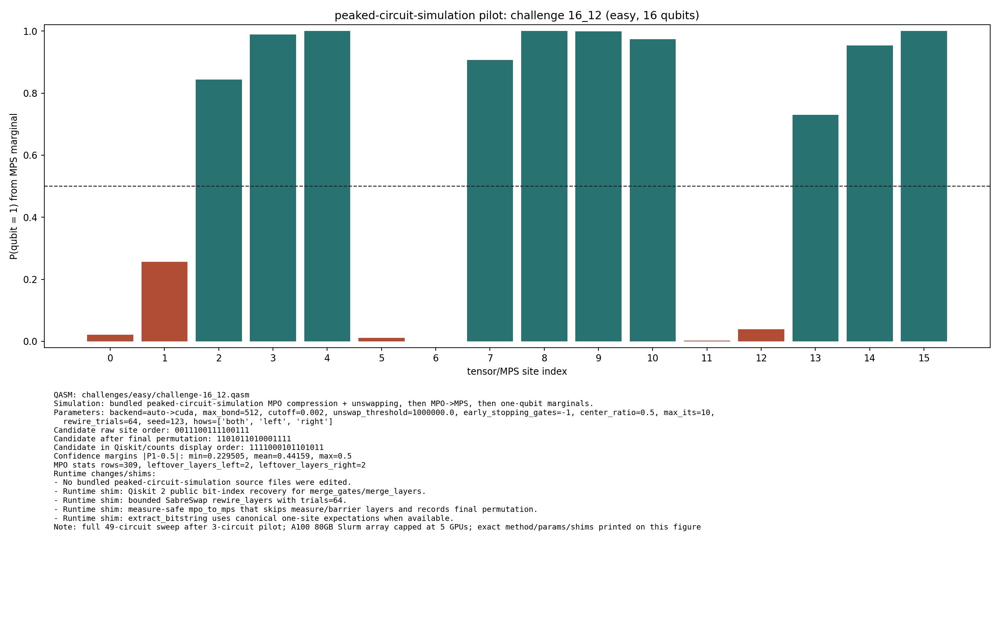

# Challenge 16_12

- Difficulty: easy
- Qubits: 16
- QASM: `challenges/easy/challenge-16_12.qasm`
- Selected answer: `1111000101101011`
- Selected method: `exact_statevector`
- Validation: `exact`
- Evidence rows: 4
- Normalized index page: [16_12](../../results_index/by_challenge/16_12.md)

## Distribution Figures

### peaked MPO/MPS marginal: challenge-16_12.peaked_mpo_mps.png

### peaked MPO/MPS marginal: peaked_16_12.png

## Candidate Rows

| review | selected | method | rank_type | rank | bitstring | score | count | support | fraction | validation | status | source |
|---|---:|---|---|---:|---|---:|---:|---:|---:|---|---|---|
|  | 1 | aer_mps_pilot | aggregate_rank | 1 | `1111000101101011` | 0.4746844951923077 |  | 6319 | 0.4746844951923077 | stable_high_config | stable_high_config | `agent_work/mps_distill/summaries/pilot_summary.json` |
|  | 0 | aer_mps_pilot | aggregate_rank | 2 | `1011000101101011` | 0.06888521634615384 |  | 917 | 0.06888521634615384 | stable_high_config | stable_high_config | `agent_work/mps_distill/summaries/pilot_summary.json` |
|  | 0 | aer_mps_pilot | aggregate_rank | 3 | `1111010101101010` | 0.06715745192307693 |  | 894 | 0.06715745192307693 | stable_high_config | stable_high_config | `agent_work/mps_distill/summaries/pilot_summary.json` |
|  | 0 | aer_mps_pilot | aggregate_rank | 4 | `1111010101101011` | 0.06693209134615384 |  | 891 | 0.06693209134615384 | stable_high_config | stable_high_config | `agent_work/mps_distill/summaries/pilot_summary.json` |
|  | 0 | aer_mps_pilot | aggregate_rank | 5 | `1110010101101011` | 0.04852764423076923 |  | 646 | 0.04852764423076923 | stable_high_config | stable_high_config | `agent_work/mps_distill/summaries/pilot_summary.json` |
|  | 1 | aer_mps_pilot | collector_evidence | 4 | `1111000101101011` | 1.000 |  |  | 1.000 | stable_high_config | stable_high_config | `agent_work/mps_distill/summaries/pilot_candidates.tsv` |
|  | 1 | aer_mps_pilot | top1_vote_rank | 1 | `1111000101101011` | 1.0 |  | 6 | 1.0 | stable_high_config | stable_high_config | `agent_work/mps_distill/summaries/pilot_summary.json` |
|  | 1 | collector_snapshot | collector_selected | 1 | `1111000101101011` | 0.46653673211917734 |  |  | 0.46653673211917734 | exact | exact | `research/quantum_peak_session/results/current_candidates/CANDIDATES.tsv` |
|  | 1 | exact_statevector | collector_evidence | 1 | `1111000101101011` | 0.46653673211917734 |  |  | 0.46653673211917734 | exact | exact | `agent_work/exact_baseline/peaks_exact.csv` |
|  | 1 | exact_statevector | exact_top | 1 | `1111000101101011` | 0.46653673211917734 |  |  | 0.46653673211917734 | exact | ok | `agent_work/exact_baseline/peaks_exact.jsonl` |
|  | 0 | exact_statevector | exact_top | 2 | `1111010101101011` | 0.07296457899843241 |  |  | 0.07296457899843241 | exact | ok | `agent_work/exact_baseline/peaks_exact.jsonl` |
|  | 0 | exact_statevector | exact_top | 3 | `1011000101101011` | 0.0682217107174549 |  |  | 0.0682217107174549 | exact | ok | `agent_work/exact_baseline/peaks_exact.jsonl` |
|  | 0 | exact_statevector | exact_top | 4 | `1111010101101010` | 0.06509952861088839 |  |  | 0.06509952861088839 | exact | ok | `agent_work/exact_baseline/peaks_exact.jsonl` |
|  | 0 | exact_statevector | exact_top | 5 | `1110010101101011` | 0.05080725879547651 |  |  | 0.05080725879547651 | exact | ok | `agent_work/exact_baseline/peaks_exact.jsonl` |
|  | 0 | exact_statevector | exact_top | 6 | `1111000101101010` | 0.03917749621229463 |  |  | 0.03917749621229463 | exact | ok | `agent_work/exact_baseline/peaks_exact.jsonl` |
|  | 0 | exact_statevector | exact_top | 7 | `1011000100101011` | 0.023175598161996828 |  |  | 0.023175598161996828 | exact | ok | `agent_work/exact_baseline/peaks_exact.jsonl` |
|  | 0 | exact_statevector | exact_top | 8 | `1010000101101010` | 0.023129985760818338 |  |  | 0.023129985760818338 | exact | ok | `agent_work/exact_baseline/peaks_exact.jsonl` |
|  | 1 | peaked_mpo_mps | marginal_candidate | 1 | `1111000101101011` | 0.22950455473781894 |  |  |  |  | ok | `outputs/peaked_circuit_sim_all/json/challenge-16_12.peaked_mpo_mps.json` |
|  | 1 | quimb_cpu_all | collector_evidence | 3 | `1111000101101011` | 0.494140625 |  |  | 0.494140625 | correct | correct | `outputs/tree_tensor_sim/all_cpu/json/challenge-16_12.quimb_tree_graph_mps.json` |
|  | 1 | quimb_gpu_all | collector_evidence | 2 | `1111000101101011` | 0.494140625 |  |  | 0.494140625 | correct | correct | `outputs/tree_tensor_sim/all/json/challenge-16_12.quimb_tree_graph_mps.json` |
