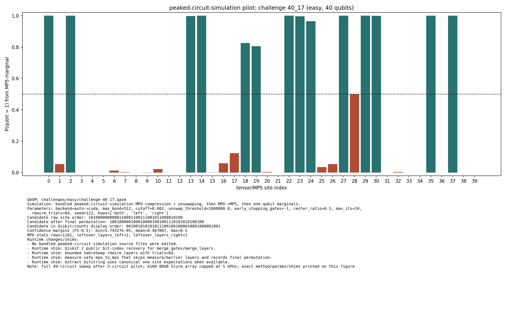

# Challenge 40_17

- Difficulty: easy
- Qubits: 40
- QASM: `challenges/easy/challenge-40_17.qasm`
- Selected answer: `0010010101010111001001000010001000001001`
- Selected method: `quimb_gpu_all`
- Validation: `unknown`
- Evidence rows: 4
- Normalized index page: [40_17](../../results_index/by_challenge/40_17.md)

## Distribution Figures

### peaked MPO/MPS marginal: challenge-40_17.peaked_mpo_mps.png

## Candidate Rows

| review | selected | method | rank_type | rank | bitstring | score | count | support | fraction | validation | status | source |
|---|---:|---|---|---:|---|---:|---:|---:|---:|---|---|---|
|  | 1 | collector_snapshot | collector_selected | 1 | `0010010101010111001001000010001000001001` | 0.5458984375 |  |  | 0.5458984375 | unknown | unknown | `research/quantum_peak_session/results/current_candidates/CANDIDATES.tsv` |
|  | 1 | peaked_mpo_mps | marginal_candidate | 1 | `0010010101010111001001000010001000001001` | 5.743267575619715e-05 |  |  |  |  | ok | `outputs/peaked_circuit_sim_all/json/challenge-40_17.peaked_mpo_mps.json` |
|  | 1 | quimb_cpu_all | collector_evidence | 2 | `0010010101010111001001000010001000001001` | 0.5458984375 |  |  | 0.5458984375 | unknown | unknown | `outputs/tree_tensor_sim/all_cpu/json/challenge-40_17.quimb_tree_graph_mps.json` |
|  | 1 | quimb_fast_cpu | collector_evidence | 4 | `0010010101010111001001000010001000001001` | 0.5546875 |  |  | 0.5546875 | unknown | unknown | `outputs/tree_tensor_sim/fast_cpu/json/challenge-40_17.quimb_tree_graph_mps.json` |
|  | 1 | quimb_gpu_all | collector_evidence | 1 | `0010010101010111001001000010001000001001` | 0.5458984375 |  |  | 0.5458984375 | unknown | unknown | `outputs/tree_tensor_sim/all/json/challenge-40_17.quimb_tree_graph_mps.json` |
|  | 1 | quimb_rcm_cpu | collector_evidence | 3 | `0010010101010111001001000010001000001001` | 0.5234375 |  |  | 0.5234375 | unknown | unknown | `outputs/tree_tensor_sim/rcm_cpu/json/challenge-40_17.quimb_tree_graph_mps.json` |
