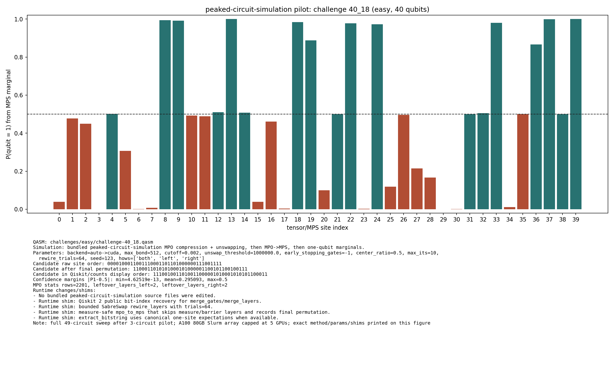

# Challenge 40_18

- Difficulty: easy
- Qubits: 40
- QASM: `challenges/easy/challenge-40_18.qasm`
- Selected answer: `0100000110010010001101111000111111001110`
- Selected method: `quimb_gpu_all`
- Validation: `unknown`
- Evidence rows: 3
- Normalized index page: [40_18](../../results_index/by_challenge/40_18.md)

## Distribution Figures

### peaked MPO/MPS marginal: challenge-40_18.peaked_mpo_mps.png

## Candidate Rows

| review | selected | method | rank_type | rank | bitstring | score | count | support | fraction | validation | status | source |
|---|---:|---|---|---:|---|---:|---:|---:|---:|---|---|---|
|  | 1 | collector_snapshot | collector_selected | 1 | `0100000110010010001101111000111111001110` | 0.439453125 |  |  | 0.439453125 | unknown | unknown | `research/quantum_peak_session/results/current_candidates/CANDIDATES.tsv` |
|  | 0 | peaked_mpo_mps | marginal_candidate | 1 | `1110010011010011000001010001010101100011` | 4.625189120588402e-13 |  |  |  |  | ok | `outputs/peaked_circuit_sim_all/json/challenge-40_18.peaked_mpo_mps.json` |
|  | 1 | quimb_cpu_all | collector_evidence | 2 | `0100000110010010001101111000111111001110` | 0.439453125 |  |  | 0.439453125 | unknown | unknown | `outputs/tree_tensor_sim/all_cpu/json/challenge-40_18.quimb_tree_graph_mps.json` |
|  | 1 | quimb_gpu_all | collector_evidence | 1 | `0100000110010010001101111000111111001110` | 0.439453125 |  |  | 0.439453125 | unknown | unknown | `outputs/tree_tensor_sim/all/json/challenge-40_18.quimb_tree_graph_mps.json` |
|  | 1 | quimb_rcm_cpu | collector_evidence | 3 | `0100000110010010001101111000111111001110` | 0.216796875 |  |  | 0.216796875 | unknown | unknown | `outputs/tree_tensor_sim/rcm_cpu/json/challenge-40_18.quimb_tree_graph_mps.json` |
