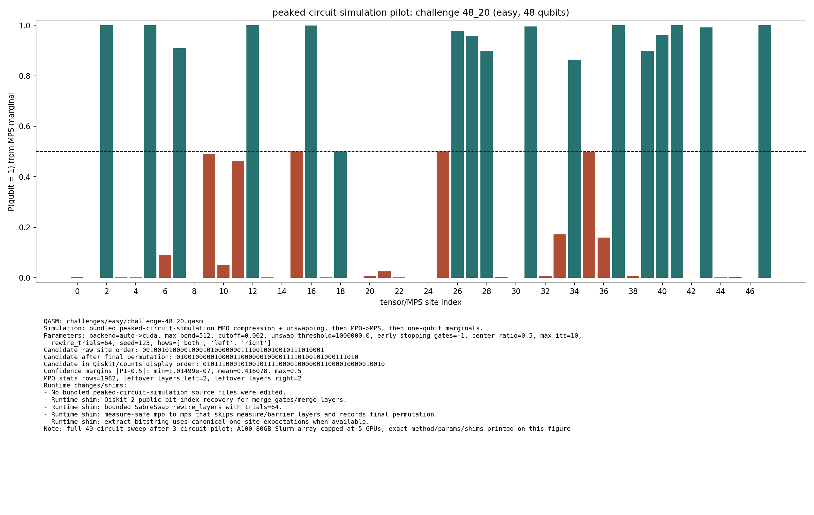

# Challenge 48_20

- Difficulty: easy
- Qubits: 48
- QASM: `challenges/easy/challenge-48_20.qasm`
- Selected answer: `101010100101001010000110101000001011110010000000`
- Selected method: `quimb_gpu_all`
- Validation: `unknown`
- Evidence rows: 3
- Normalized index page: [48_20](../../results_index/by_challenge/48_20.md)

## Distribution Figures

### peaked MPO/MPS marginal: challenge-48_20.peaked_mpo_mps.png

## Candidate Rows

| review | selected | method | rank_type | rank | bitstring | score | count | support | fraction | validation | status | source |
|---|---:|---|---|---:|---|---:|---:|---:|---:|---|---|---|
|  | 1 | collector_snapshot | collector_selected | 1 | `101010100101001010000110101000001011110010000000` | 0.6123046875 |  |  | 0.6123046875 | unknown | unknown | `research/quantum_peak_session/results/current_candidates/CANDIDATES.tsv` |
|  | 0 | peaked_mpo_mps | marginal_candidate | 1 | `010111000101001011110000100000011000010000010010` | 1.0149850948604211e-07 |  |  |  |  | ok | `outputs/peaked_circuit_sim_all/json/challenge-48_20.peaked_mpo_mps.json` |
|  | 1 | quimb_cpu_all | collector_evidence | 2 | `101010100101001010000110101000001011110010000000` | 0.6123046875 |  |  | 0.6123046875 | unknown | unknown | `outputs/tree_tensor_sim/all_cpu/json/challenge-48_20.quimb_tree_graph_mps.json` |
|  | 1 | quimb_fast_cpu | collector_evidence | 3 | `101010100101001010000110101000001011110010000000` | 0.654296875 |  |  | 0.654296875 | unknown | unknown | `outputs/tree_tensor_sim/fast_cpu/json/challenge-48_20.quimb_tree_graph_mps.json` |
|  | 1 | quimb_gpu_all | collector_evidence | 1 | `101010100101001010000110101000001011110010000000` | 0.6123046875 |  |  | 0.6123046875 | unknown | unknown | `outputs/tree_tensor_sim/all/json/challenge-48_20.quimb_tree_graph_mps.json` |
