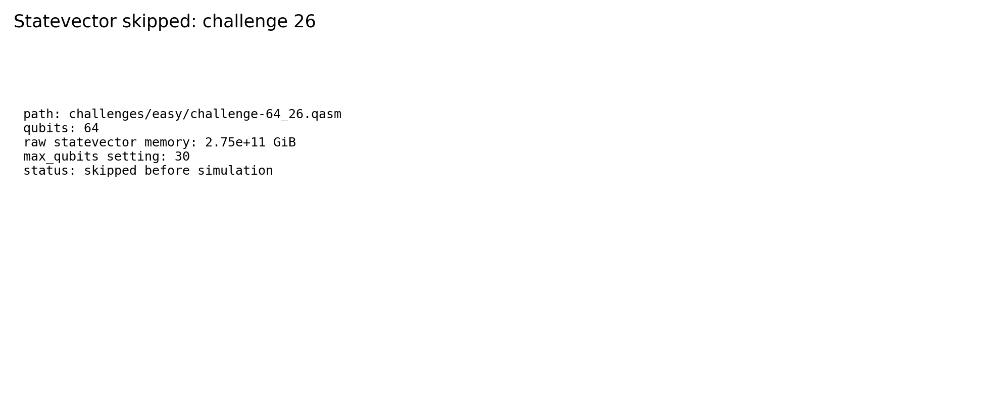

# Challenge 64_26

- Difficulty: easy
- Qubits: 64
- QASM: `challenges/easy/challenge-64_26.qasm`
- Selected answer: `0110101010100011010111011000011100010110110110011100011001100110`
- Selected method: `quimb_gpu_all`
- Validation: `unknown`
- Evidence rows: 3
- Normalized index page: [64_26](../../results_index/by_challenge/64_26.md)

## Distribution Figures

### Aer MPS sample: mps_64_26.png

### distribution figure: mps/challenge-64_26.png

### distribution figure: statevector/challenge-64_26.png

## Candidate Rows

| review | selected | method | rank_type | rank | bitstring | score | count | support | fraction | validation | status | source |
|---|---:|---|---|---:|---|---:|---:|---:|---:|---|---|---|
|  | 1 | aer_mps_selected | sample_top | 1 | `0110101010100011010111011000011100010110110110011100011001100110` | 0.070068359375 | 287 |  | 0.070068359375 |  | ok | `outputs/sim_11_26_34_41_49/json/challenge-64_26.mps.json` |
|  | 0 | aer_mps_selected | sample_top | 2 | `0110101010100011010111011000011100010110110010011100011001100110` | 0.0654296875 | 268 |  | 0.0654296875 |  | ok | `outputs/sim_11_26_34_41_49/json/challenge-64_26.mps.json` |
|  | 0 | aer_mps_selected | sample_top | 3 | `0110111010100011010111011000011101010110110010011100011001100110` | 0.031005859375 | 127 |  | 0.031005859375 |  | ok | `outputs/sim_11_26_34_41_49/json/challenge-64_26.mps.json` |
|  | 0 | aer_mps_selected | sample_top | 4 | `0110111010100011010111011000011101010110110110011100011001100110` | 0.030517578125 | 125 |  | 0.030517578125 |  | ok | `outputs/sim_11_26_34_41_49/json/challenge-64_26.mps.json` |
|  | 0 | aer_mps_selected | sample_top | 5 | `0110101010100011010111011000011100010110110011011100011001100110` | 0.014404296875 | 59 |  | 0.014404296875 |  | ok | `outputs/sim_11_26_34_41_49/json/challenge-64_26.mps.json` |
|  | 0 | aer_mps_selected | sample_top | 6 | `0110101010100011010111011000011100010110110111011100011001100110` | 0.0126953125 | 52 |  | 0.0126953125 |  | ok | `outputs/sim_11_26_34_41_49/json/challenge-64_26.mps.json` |
|  | 0 | aer_mps_selected | sample_top | 7 | `0110101010100011010110011000011100010110110010011100011001100110` | 0.009765625 | 40 |  | 0.009765625 |  | ok | `outputs/sim_11_26_34_41_49/json/challenge-64_26.mps.json` |
|  | 0 | aer_mps_selected | sample_top | 8 | `0010101010100011010111011000011100010110110111011100011001100110` | 0.00927734375 | 38 |  | 0.00927734375 |  | ok | `outputs/sim_11_26_34_41_49/json/challenge-64_26.mps.json` |
|  | 0 | aer_mps_selected | sample_top | 9 | `0110101011100011010111011000011100010110110010011100011001100110` | 0.009033203125 | 37 |  | 0.009033203125 |  | ok | `outputs/sim_11_26_34_41_49/json/challenge-64_26.mps.json` |
|  | 0 | aer_mps_selected | sample_top | 10 | `0110101010100011010110011000011100010110110110011100011001100110` | 0.0087890625 | 36 |  | 0.0087890625 |  | ok | `outputs/sim_11_26_34_41_49/json/challenge-64_26.mps.json` |
|  | 0 | aer_mps_selected | sample_top | 11 | `0010101010100011010111011000011100010110110011011100011001100110` | 0.0078125 | 32 |  | 0.0078125 |  | ok | `outputs/sim_11_26_34_41_49/json/challenge-64_26.mps.json` |
|  | 0 | aer_mps_selected | sample_top | 12 | `0110101011100011010111011000011100010110110110011100011001100110` | 0.007568359375 | 31 |  | 0.007568359375 |  | ok | `outputs/sim_11_26_34_41_49/json/challenge-64_26.mps.json` |
|  | 0 | aer_mps_selected | sample_top | 13 | `0110111011100011010111011000011101010110110010011100011001100110` | 0.0068359375 | 28 |  | 0.0068359375 |  | ok | `outputs/sim_11_26_34_41_49/json/challenge-64_26.mps.json` |
|  | 0 | aer_mps_selected | sample_top | 14 | `0110101010100011010111011000011100010110110110011100111001100110` | 0.006591796875 | 27 |  | 0.006591796875 |  | ok | `outputs/sim_11_26_34_41_49/json/challenge-64_26.mps.json` |
|  | 0 | aer_mps_selected | sample_top | 15 | `0110101010100011010111011000011101010110110110011100011001100110` | 0.00634765625 | 26 |  | 0.00634765625 |  | ok | `outputs/sim_11_26_34_41_49/json/challenge-64_26.mps.json` |
|  | 0 | aer_mps_selected | sample_top | 16 | `0010111010100011010111011000011101010110110011011100011001100110` | 0.00634765625 | 26 |  | 0.00634765625 |  | ok | `outputs/sim_11_26_34_41_49/json/challenge-64_26.mps.json` |
|  | 0 | aer_mps_selected | sample_top | 17 | `0110111010100011010111011000011101010110110011011100011001100110` | 0.006103515625 | 25 |  | 0.006103515625 |  | ok | `outputs/sim_11_26_34_41_49/json/challenge-64_26.mps.json` |
|  | 0 | aer_mps_selected | sample_top | 18 | `0110111010100011010111011000011101010110110111011100011001100110` | 0.006103515625 | 25 |  | 0.006103515625 |  | ok | `outputs/sim_11_26_34_41_49/json/challenge-64_26.mps.json` |
|  | 0 | aer_mps_selected | sample_top | 19 | `0110101000100011010111011000011100010110110010011100011001100110` | 0.005859375 | 24 |  | 0.005859375 |  | ok | `outputs/sim_11_26_34_41_49/json/challenge-64_26.mps.json` |
|  | 0 | aer_mps_selected | sample_top | 20 | `0110101011100011010111011000011110010110110110011100011001100110` | 0.005615234375 | 23 |  | 0.005615234375 |  | ok | `outputs/sim_11_26_34_41_49/json/challenge-64_26.mps.json` |
|  | 0 | aer_mps_selected | sample_top | 21 | `0110101010100011010111011000001100010110110010011100011001100110` | 0.00537109375 | 22 |  | 0.00537109375 |  | ok | `outputs/sim_11_26_34_41_49/json/challenge-64_26.mps.json` |
|  | 0 | aer_mps_selected | sample_top | 22 | `0110101010100011010111011000011100010110110100011100011001100110` | 0.00537109375 | 22 |  | 0.00537109375 |  | ok | `outputs/sim_11_26_34_41_49/json/challenge-64_26.mps.json` |
|  | 0 | aer_mps_selected | sample_top | 23 | `0110101011100011010111011000011110010110110010011100011001100110` | 0.0048828125 | 20 |  | 0.0048828125 |  | ok | `outputs/sim_11_26_34_41_49/json/challenge-64_26.mps.json` |
|  | 0 | aer_mps_selected | sample_top | 24 | `0110101010100011010111011000011100010110110000011100011001100110` | 0.004638671875 | 19 |  | 0.004638671875 |  | ok | `outputs/sim_11_26_34_41_49/json/challenge-64_26.mps.json` |
|  | 0 | aer_mps_selected | sample_top | 25 | `0110101000100011010111011000010100010110110010011100011001100110` | 0.00439453125 | 18 |  | 0.00439453125 |  | ok | `outputs/sim_11_26_34_41_49/json/challenge-64_26.mps.json` |
|  | 1 | collector_snapshot | collector_selected | 1 | `0110101010100011010111011000011100010110110110011100011001100110` | 0.26171875 |  |  | 0.26171875 | unknown | unknown | `research/quantum_peak_session/results/current_candidates/CANDIDATES.tsv` |
|  | 1 | quimb_cpu_all | collector_evidence | 2 | `0110101010100011010111011000011100010110110110011100011001100110` | 0.263671875 |  |  | 0.263671875 | unknown | unknown | `outputs/tree_tensor_sim/all_cpu/json/challenge-64_26.quimb_tree_graph_mps.json` |
|  | 1 | quimb_gpu_all | collector_evidence | 1 | `0110101010100011010111011000011100010110110110011100011001100110` | 0.26171875 |  |  | 0.26171875 | unknown | unknown | `outputs/tree_tensor_sim/all/json/challenge-64_26.quimb_tree_graph_mps.json` |
|  | 0 | quimb_rcm_cpu | collector_evidence | 3 | `0110101010100011010111011000011101010110110010011100011001100110` | 0.01171875 |  |  | 0.01171875 | unknown | unknown | `outputs/tree_tensor_sim/rcm_cpu/json/challenge-64_26.quimb_tree_graph_mps.json` |
