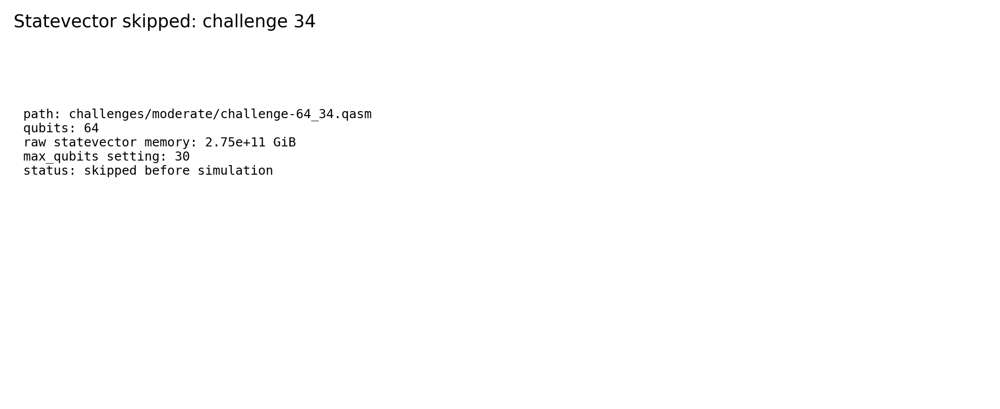

# Challenge 64_34

- Difficulty: moderate
- Qubits: 64
- QASM: `challenges/moderate/challenge-64_34.qasm`
- Selected answer: `0011010100010011001110101110100101001011001011011001111011100110`
- Selected method: `quimb_cpu_all`
- Validation: `unknown`
- Evidence rows: 2
- Normalized index page: [64_34](../../results_index/by_challenge/64_34.md)

## Distribution Figures

### Aer MPS sample: mps_64_34.png

### distribution figure: mps/challenge-64_34.png

### distribution figure: statevector/challenge-64_34.png

## Candidate Rows

| review | selected | method | rank_type | rank | bitstring | score | count | support | fraction | validation | status | source |
|---|---:|---|---|---:|---|---:|---:|---:|---:|---|---|---|
|  | 1 | aer_mps_selected | sample_top | 1 | `0011010100010011001110101110100101001011001011011001111011100110` | 0.134765625 | 552 |  | 0.134765625 |  | ok | `outputs/sim_11_26_34_41_49/json/challenge-64_34.mps.json` |
|  | 0 | aer_mps_selected | sample_top | 2 | `0011010100010011001110101110100101101011001011011001111011100110` | 0.123779296875 | 507 |  | 0.123779296875 |  | ok | `outputs/sim_11_26_34_41_49/json/challenge-64_34.mps.json` |
|  | 0 | aer_mps_selected | sample_top | 3 | `0011010100010011001110101111100101001011001011011001111011100110` | 0.0234375 | 96 |  | 0.0234375 |  | ok | `outputs/sim_11_26_34_41_49/json/challenge-64_34.mps.json` |
|  | 0 | aer_mps_selected | sample_top | 4 | `0011010100010011001110101111100101101011001011011001111011100110` | 0.0224609375 | 92 |  | 0.0224609375 |  | ok | `outputs/sim_11_26_34_41_49/json/challenge-64_34.mps.json` |
|  | 0 | aer_mps_selected | sample_top | 5 | `0011010100010011001110101110100101001011001011011000111011100010` | 0.01953125 | 80 |  | 0.01953125 |  | ok | `outputs/sim_11_26_34_41_49/json/challenge-64_34.mps.json` |
|  | 0 | aer_mps_selected | sample_top | 6 | `0011010100010011001110101110100101101011001011011000111011100010` | 0.01953125 | 80 |  | 0.01953125 |  | ok | `outputs/sim_11_26_34_41_49/json/challenge-64_34.mps.json` |
|  | 0 | aer_mps_selected | sample_top | 7 | `0011010100010011101110101110100101101011001011011001111011100110` | 0.017578125 | 72 |  | 0.017578125 |  | ok | `outputs/sim_11_26_34_41_49/json/challenge-64_34.mps.json` |
|  | 0 | aer_mps_selected | sample_top | 8 | `0011010100010011101110101110100101001011001011011001111011100110` | 0.011962890625 | 49 |  | 0.011962890625 |  | ok | `outputs/sim_11_26_34_41_49/json/challenge-64_34.mps.json` |
|  | 0 | aer_mps_selected | sample_top | 9 | `0011010100011011001110101110100101101011001011011001111011100110` | 0.0107421875 | 44 |  | 0.0107421875 |  | ok | `outputs/sim_11_26_34_41_49/json/challenge-64_34.mps.json` |
|  | 0 | aer_mps_selected | sample_top | 10 | `0011110100010011001110101110100101101011001011011001111011100110` | 0.0107421875 | 44 |  | 0.0107421875 |  | ok | `outputs/sim_11_26_34_41_49/json/challenge-64_34.mps.json` |
|  | 0 | aer_mps_selected | sample_top | 11 | `0011110100010011001110101110100101001011001011011001111011100110` | 0.009765625 | 40 |  | 0.009765625 |  | ok | `outputs/sim_11_26_34_41_49/json/challenge-64_34.mps.json` |
|  | 0 | aer_mps_selected | sample_top | 12 | `0010010100010011001110101110100101101011001011011001111011100110` | 0.00927734375 | 38 |  | 0.00927734375 |  | ok | `outputs/sim_11_26_34_41_49/json/challenge-64_34.mps.json` |
|  | 0 | aer_mps_selected | sample_top | 13 | `0010010100010011001110101110100101001011001011011001111011100110` | 0.0087890625 | 36 |  | 0.0087890625 |  | ok | `outputs/sim_11_26_34_41_49/json/challenge-64_34.mps.json` |
|  | 0 | aer_mps_selected | sample_top | 14 | `0011010100010011011010101110100101001011001011011001111011100110` | 0.0087890625 | 36 |  | 0.0087890625 |  | ok | `outputs/sim_11_26_34_41_49/json/challenge-64_34.mps.json` |
|  | 0 | aer_mps_selected | sample_top | 15 | `0011010100010011001110100110100101001011001011011001011011100110` | 0.008544921875 | 35 |  | 0.008544921875 |  | ok | `outputs/sim_11_26_34_41_49/json/challenge-64_34.mps.json` |
|  | 0 | aer_mps_selected | sample_top | 16 | `0011010100010011001110101110100101101011001011111001111011100110` | 0.007568359375 | 31 |  | 0.007568359375 |  | ok | `outputs/sim_11_26_34_41_49/json/challenge-64_34.mps.json` |
|  | 0 | aer_mps_selected | sample_top | 17 | `0011010100011011001110101110100101001011001011011001111011100110` | 0.007080078125 | 29 |  | 0.007080078125 |  | ok | `outputs/sim_11_26_34_41_49/json/challenge-64_34.mps.json` |
|  | 0 | aer_mps_selected | sample_top | 18 | `0011010100010011001110101110100101001011001011111001111011100110` | 0.0068359375 | 28 |  | 0.0068359375 |  | ok | `outputs/sim_11_26_34_41_49/json/challenge-64_34.mps.json` |
|  | 0 | aer_mps_selected | sample_top | 19 | `0011010100010011001110101110100101001011001001011001111011100110` | 0.006591796875 | 27 |  | 0.006591796875 |  | ok | `outputs/sim_11_26_34_41_49/json/challenge-64_34.mps.json` |
|  | 0 | aer_mps_selected | sample_top | 20 | `0011010100010011011010101110100101101011001011011001111011100110` | 0.006103515625 | 25 |  | 0.006103515625 |  | ok | `outputs/sim_11_26_34_41_49/json/challenge-64_34.mps.json` |
|  | 0 | aer_mps_selected | sample_top | 21 | `0011010100010011001110101110100101101111001011011001111011100110` | 0.006103515625 | 25 |  | 0.006103515625 |  | ok | `outputs/sim_11_26_34_41_49/json/challenge-64_34.mps.json` |
|  | 0 | aer_mps_selected | sample_top | 22 | `0011010100010011001110101110100101001111001011011001111011100110` | 0.005859375 | 24 |  | 0.005859375 |  | ok | `outputs/sim_11_26_34_41_49/json/challenge-64_34.mps.json` |
|  | 0 | aer_mps_selected | sample_top | 23 | `0011010100010011001110101110100101101011001011010001111011100100` | 0.005615234375 | 23 |  | 0.005615234375 |  | ok | `outputs/sim_11_26_34_41_49/json/challenge-64_34.mps.json` |
|  | 0 | aer_mps_selected | sample_top | 24 | `0011010100010011001110101110100101101011001001011001111011100110` | 0.00537109375 | 22 |  | 0.00537109375 |  | ok | `outputs/sim_11_26_34_41_49/json/challenge-64_34.mps.json` |
|  | 0 | aer_mps_selected | sample_top | 25 | `0011010100010011001110100110100101101011001011011001011011100110` | 0.005126953125 | 21 |  | 0.005126953125 |  | ok | `outputs/sim_11_26_34_41_49/json/challenge-64_34.mps.json` |
|  | 1 | collector_snapshot | collector_selected | 1 | `0011010100010011001110101110100101001011001011011001111011100110` | 0.1630859375 |  |  | 0.1630859375 | unknown | unknown | `research/quantum_peak_session/results/current_candidates/CANDIDATES.tsv` |
|  | 1 | quimb_cpu_all | collector_evidence | 1 | `0011010100010011001110101110100101001011001011011001111011100110` | 0.1630859375 |  |  | 0.1630859375 | unknown | unknown | `outputs/tree_tensor_sim/all_cpu/json/challenge-64_34.quimb_tree_graph_mps.json` |
|  | 0 | quimb_rcm_cpu | collector_evidence | 2 | `0011010100010011101110101110100101101011001011011001111011100110` | 0.029296875 |  |  | 0.029296875 | unknown | unknown | `outputs/tree_tensor_sim/rcm_cpu/json/challenge-64_34.quimb_tree_graph_mps.json` |
