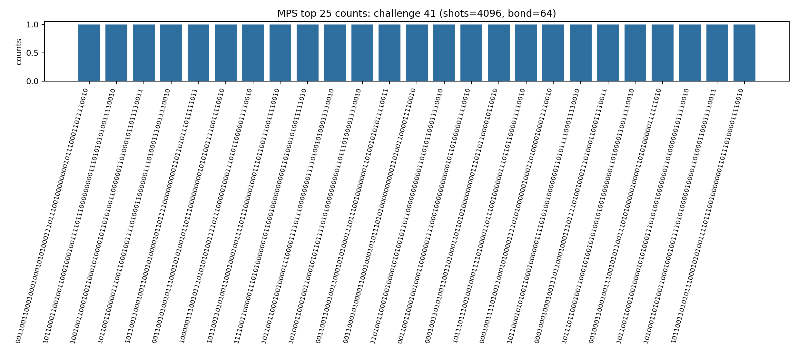

# Challenge 64_41

- Difficulty: hard
- Qubits: 64
- QASM: `challenges/hard/challenge-64_41.qasm`
- Selected answer: `0001000111010011100110010011110111000000100011010001101010110010`
- Selected method: `aer_mps_pilot`
- Validation: `unstable_top1_vs_aggregate`
- Evidence rows: 1
- Normalized index page: [64_41](../../results_index/by_challenge/64_41.md)

## Review Notes

| status | bitstring | note | date | source |
|---|---|---|---|---|
| rejected | `0001000111010011100110010011110111000000100011010001101010110010` | User reported the first 64_41 bitstring is wrong. | 2026-06-06 | user |
| try_next | `0001001100010011000101001011110101000000000011011010100011110010` | User asked to try the second aggregate-rank candidate next. | 2026-06-06 | user |

## Distribution Figures

### Aer MPS sample: mps_64_41.png

### distribution figure: mps/challenge-64_41.png

### distribution figure: statevector/challenge-64_41.png

## Candidate Rows

| review | selected | method | rank_type | rank | bitstring | score | count | support | fraction | validation | status | source |
|---|---:|---|---|---:|---|---:|---:|---:|---:|---|---|---|
| rejected | 1 | aer_mps_pilot | aggregate_rank | 1 | `0001000111010011100110010011110111000000100011010001101010110010` | 0.0016638935108153079 |  | 2 | 0.0016638935108153079 | unstable_top1_vs_aggregate | unstable_top1_vs_aggregate | `agent_work/mps_distill/summaries/pilot_summary.json` |
| try_next | 0 | aer_mps_pilot | aggregate_rank | 2 | `0001001100010011000101001011110101000000000011011010100011110010` | 0.0016638935108153079 |  | 2 | 0.0016638935108153079 | unstable_top1_vs_aggregate | unstable_top1_vs_aggregate | `agent_work/mps_distill/summaries/pilot_summary.json` |
|  | 0 | aer_mps_pilot | aggregate_rank | 3 | `0001001100010011000101011011110101001000001011010101010010110010` | 0.0016638935108153079 |  | 2 | 0.0016638935108153079 | unstable_top1_vs_aggregate | unstable_top1_vs_aggregate | `agent_work/mps_distill/summaries/pilot_summary.json` |
|  | 0 | aer_mps_pilot | aggregate_rank | 4 | `0011001100010011000101011011110101000000000011011000100011110011` | 0.0016638935108153079 |  | 2 | 0.0016638935108153079 | unstable_top1_vs_aggregate | unstable_top1_vs_aggregate | `agent_work/mps_distill/summaries/pilot_summary.json` |
|  | 0 | aer_mps_pilot | aggregate_rank | 5 | `0001001100000011000101011010110111000000000101011000000011010010` | 0.0016638935108153079 |  | 2 | 0.0016638935108153079 | unstable_top1_vs_aggregate | unstable_top1_vs_aggregate | `agent_work/mps_distill/summaries/pilot_summary.json` |
| rejected | 1 | aer_mps_pilot | collector_evidence | 1 | `0001000111010011100110010011110111000000100011010001101010110010` | 0.167 |  |  | 0.167 | unstable_top1_vs_aggregate | unstable_top1_vs_aggregate | `agent_work/mps_distill/summaries/pilot_candidates.tsv` |
|  | 0 | aer_mps_pilot | top1_vote_rank | 1 | `0000000110010011000001000110000100000100001001011110010001110000` | 0.16666666666666666 |  | 1 | 0.16666666666666666 | unstable_top1_vs_aggregate | unstable_top1_vs_aggregate | `agent_work/mps_distill/summaries/pilot_summary.json` |
|  | 0 | aer_mps_pilot | top1_vote_rank | 2 | `0000001101010011000110000110110111000110000111001001010011111010` | 0.16666666666666666 |  | 1 | 0.16666666666666666 | unstable_top1_vs_aggregate | unstable_top1_vs_aggregate | `agent_work/mps_distill/summaries/pilot_summary.json` |
|  | 0 | aer_mps_pilot | top1_vote_rank | 3 | `0000000100000011100101011000110111000000000001011011110011110011` | 0.16666666666666666 |  | 1 | 0.16666666666666666 | unstable_top1_vs_aggregate | unstable_top1_vs_aggregate | `agent_work/mps_distill/summaries/pilot_summary.json` |
|  | 0 | aer_mps_pilot | top1_vote_rank | 4 | `0011001100010011000101011011110101000000000011011000100011110011` | 0.16666666666666666 |  | 1 | 0.16666666666666666 | unstable_top1_vs_aggregate | unstable_top1_vs_aggregate | `agent_work/mps_distill/summaries/pilot_summary.json` |
|  | 0 | aer_mps_pilot | top1_vote_rank | 5 | `1010001100010011000101000010110111001000000011011000100011110010` | 0.16666666666666666 |  | 1 | 0.16666666666666666 | unstable_top1_vs_aggregate | unstable_top1_vs_aggregate | `agent_work/mps_distill/summaries/pilot_summary.json` |
|  | 0 | aer_mps_selected | sample_top | 1 | `0011001100010001000101010001110111001000000001011100011011110010` | 0.000244140625 | 1 |  | 0.000244140625 |  | ok | `outputs/sim_11_26_34_41_49/json/challenge-64_41.mps.json` |
|  | 0 | aer_mps_selected | sample_top | 2 | `1011000110010011000100010011110111000000000111010101010011110010` | 0.000244140625 | 1 |  | 0.000244140625 |  | ok | `outputs/sim_11_26_34_41_49/json/challenge-64_41.mps.json` |
|  | 0 | aer_mps_selected | sample_top | 3 | `1001001100010011000101000010110101001100000011010001011011110011` | 0.000244140625 | 1 |  | 0.000244140625 |  | ok | `outputs/sim_11_26_34_41_49/json/challenge-64_41.mps.json` |
|  | 0 | aer_mps_selected | sample_top | 4 | `1011001100000111001100010011110100011000000111010001110011110010` | 0.000244140625 | 1 |  | 0.000244140625 |  | ok | `outputs/sim_11_26_34_41_49/json/challenge-64_41.mps.json` |
|  | 0 | aer_mps_selected | sample_top | 5 | `1011001100010011000101000010110111100000000011011010111011111011` | 0.000244140625 | 1 |  | 0.000244140625 |  | ok | `outputs/sim_11_26_34_41_49/json/challenge-64_41.mps.json` |
|  | 0 | aer_mps_selected | sample_top | 6 | `0011001010010111000101010010110111000000000101010011110011110010` | 0.000244140625 | 1 |  | 0.000244140625 |  | ok | `outputs/sim_11_26_34_41_49/json/challenge-64_41.mps.json` |
|  | 0 | aer_mps_selected | sample_top | 7 | `1000001110010111010101010011110111000001000111010110000011110010` | 0.000244140625 | 1 |  | 0.000244140625 |  | ok | `outputs/sim_11_26_34_41_49/json/challenge-64_41.mps.json` |
|  | 0 | aer_mps_selected | sample_top | 8 | `1011001101010011000100010011110111000001000111011001110011110010` | 0.000244140625 | 1 |  | 0.000244140625 |  | ok | `outputs/sim_11_26_34_41_49/json/challenge-64_41.mps.json` |
|  | 0 | aer_mps_selected | sample_top | 9 | `1111001100000111010100000010110001000000000011010001010011111010` | 0.000244140625 | 1 |  | 0.000244140625 |  | ok | `outputs/sim_11_26_34_41_49/json/challenge-64_41.mps.json` |
|  | 0 | aer_mps_selected | sample_top | 10 | `1011001100010010000111000011110111000000001111010010100011110010` | 0.000244140625 | 1 |  | 0.000244140625 |  | ok | `outputs/sim_11_26_34_41_49/json/challenge-64_41.mps.json` |
|  | 0 | aer_mps_selected | sample_top | 11 | `1010001100010011000101011011110101000000000011011101000011110010` | 0.000244140625 | 1 |  | 0.000244140625 |  | ok | `outputs/sim_11_26_34_41_49/json/challenge-64_41.mps.json` |
|  | 0 | aer_mps_selected | sample_top | 12 | `0011001100010011000101010001110111001000000011010010101011110011` | 0.000244140625 | 1 |  | 0.000244140625 |  | ok | `outputs/sim_11_26_34_41_49/json/challenge-64_41.mps.json` |
|  | 0 | aer_mps_selected | sample_top | 13 | `0011000101000011000100010101110101000000000011010011000011110010` | 0.000244140625 | 1 |  | 0.000244140625 |  | ok | `outputs/sim_11_26_34_41_49/json/challenge-64_41.mps.json` |
|  | 0 | aer_mps_selected | sample_top | 14 | `1101001100010010000101010010110110000000000011010101100011110010` | 0.000244140625 | 1 |  | 0.000244140625 |  | ok | `outputs/sim_11_26_34_41_49/json/challenge-64_41.mps.json` |
|  | 0 | aer_mps_selected | sample_top | 15 | `0011001100010010001100000011110001000000000001011010000011110010` | 0.000244140625 | 1 |  | 0.000244140625 |  | ok | `outputs/sim_11_26_34_41_49/json/challenge-64_41.mps.json` |
|  | 0 | aer_mps_selected | sample_top | 16 | `0001001101010011001101000110110101000000000111011011000010110010` | 0.000244140625 | 1 |  | 0.000244140625 |  | ok | `outputs/sim_11_26_34_41_49/json/challenge-64_41.mps.json` |
|  | 0 | aer_mps_selected | sample_top | 17 | `1011101110010010001111010000110111001000000111011011000011110010` | 0.000244140625 | 1 |  | 0.000244140625 |  | ok | `outputs/sim_11_26_34_41_49/json/challenge-64_41.mps.json` |
|  | 0 | aer_mps_selected | sample_top | 18 | `0001001111010011000101000011110101000000100011010000100011110010` | 0.000244140625 | 1 |  | 0.000244140625 |  | ok | `outputs/sim_11_26_34_41_49/json/challenge-64_41.mps.json` |
|  | 0 | aer_mps_selected | sample_top | 19 | `1011000101010011000100000011110101001000000011010111100011110010` | 0.000244140625 | 1 |  | 0.000244140625 |  | ok | `outputs/sim_11_26_34_41_49/json/challenge-64_41.mps.json` |
|  | 0 | aer_mps_selected | sample_top | 20 | `0001000100010011101100010001110111101001000111010001100011110011` | 0.000244140625 | 1 |  | 0.000244140625 |  | ok | `outputs/sim_11_26_34_41_49/json/challenge-64_41.mps.json` |
|  | 0 | aer_mps_selected | sample_top | 21 | `1011101100010011000101001010100101001000000011010000110011110010` | 0.000244140625 | 1 |  | 0.000244140625 |  | ok | `outputs/sim_11_26_34_41_49/json/challenge-64_41.mps.json` |
|  | 0 | aer_mps_selected | sample_top | 22 | `0010001100010011100101011001110101000001000011010100000111111010` | 0.000244140625 | 1 |  | 0.000244140625 |  | ok | `outputs/sim_11_26_34_41_49/json/challenge-64_41.mps.json` |
|  | 0 | aer_mps_selected | sample_top | 23 | `1011001100010010000101010001110101001000000011010000001011110010` | 0.000244140625 | 1 |  | 0.000244140625 |  | ok | `outputs/sim_11_26_34_41_49/json/challenge-64_41.mps.json` |
|  | 0 | aer_mps_selected | sample_top | 24 | `1010001101010011000100010011110101000001000011010001100011110011` | 0.000244140625 | 1 |  | 0.000244140625 |  | ok | `outputs/sim_11_26_34_41_49/json/challenge-64_41.mps.json` |
|  | 0 | aer_mps_selected | sample_top | 25 | `1011001101010111000101010011110111001000000011011101000011110010` | 0.000244140625 | 1 |  | 0.000244140625 |  | ok | `outputs/sim_11_26_34_41_49/json/challenge-64_41.mps.json` |
| rejected | 1 | collector_snapshot | collector_selected | 1 | `0001000111010011100110010011110111000000100011010001101010110010` | 0.167 |  |  | 0.167 | unstable_top1_vs_aggregate | unstable_top1_vs_aggregate | `research/quantum_peak_session/results/current_candidates/CANDIDATES.tsv` |
