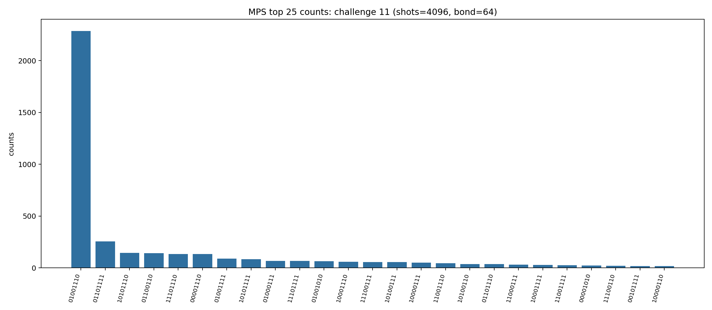
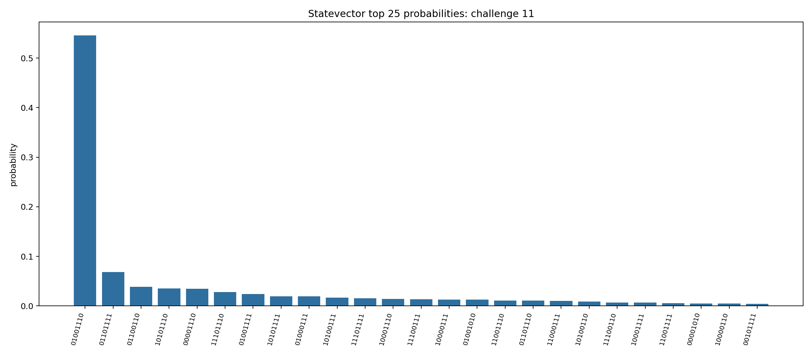

# Challenge 8_1

- Difficulty: very easy
- Qubits: 8
- QASM: `challenges/very easy/challenge-8_1.qasm`
- Selected answer: `10101101`
- Selected method: `exact_statevector`
- Validation: `exact`
- Evidence rows: 2
- Normalized index page: [8_1](../../results_index/by_challenge/8_1.md)

## Distribution Figures

### Aer MPS sample: mps_8_11.png

### distribution figure: mps/challenge-8_11.png

### distribution figure: statevector/challenge-8_11.png

### peaked MPO/MPS marginal: challenge-48_19.peaked_mpo_mps.png

### peaked MPO/MPS marginal: challenge-8_1.peaked_mpo_mps.png

### peaked MPO/MPS marginal: challenge-8_11.peaked_mpo_mps.png

### peaked MPO/MPS marginal: challenge-8_11.peaked_mpo_mps.png

## Candidate Rows

| review | selected | method | rank_type | rank | bitstring | score | count | support | fraction | validation | status | source |
|---|---:|---|---|---:|---|---:|---:|---:|---:|---|---|---|
|  | 1 | collector_snapshot | collector_selected | 1 | `10101101` | 0.9126378477396644 |  |  | 0.9126378477396644 | exact | exact | `research/quantum_peak_session/results/current_candidates/CANDIDATES.tsv` |
|  | 1 | exact_statevector | collector_evidence | 1 | `10101101` | 0.9126378477396644 |  |  | 0.9126378477396644 | exact | exact | `agent_work/exact_baseline/peaks_exact.csv` |
|  | 1 | exact_statevector | exact_top | 1 | `10101101` | 0.9126378477396644 |  |  | 0.9126378477396644 | exact | ok | `agent_work/exact_baseline/peaks_exact.jsonl` |
|  | 0 | exact_statevector | exact_top | 2 | `00101101` | 0.03791185128794029 |  |  | 0.03791185128794029 | exact | ok | `agent_work/exact_baseline/peaks_exact.jsonl` |
|  | 0 | exact_statevector | exact_top | 3 | `10101001` | 0.01183411950021498 |  |  | 0.01183411950021498 | exact | ok | `agent_work/exact_baseline/peaks_exact.jsonl` |
|  | 0 | exact_statevector | exact_top | 4 | `10101111` | 0.011834069610118906 |  |  | 0.011834069610118906 | exact | ok | `agent_work/exact_baseline/peaks_exact.jsonl` |
|  | 0 | exact_statevector | exact_top | 5 | `10101110` | 0.011833411773848073 |  |  | 0.011833411773848073 | exact | ok | `agent_work/exact_baseline/peaks_exact.jsonl` |
|  | 0 | exact_statevector | exact_top | 6 | `10101000` | 0.011833361888252496 |  |  | 0.011833361888252496 | exact | ok | `agent_work/exact_baseline/peaks_exact.jsonl` |
|  | 0 | exact_statevector | exact_top | 7 | `00101001` | 0.0004916006713145274 |  |  | 0.0004916006713145274 | exact | ok | `agent_work/exact_baseline/peaks_exact.jsonl` |
|  | 0 | exact_statevector | exact_top | 8 | `00101111` | 0.0004915985988320991 |  |  | 0.0004915985988320991 | exact | ok | `agent_work/exact_baseline/peaks_exact.jsonl` |
|  | 1 | peaked_mpo_mps | marginal_candidate | 1 | `10101101` | 0.46011586774681057 |  |  |  |  | ok | `outputs/peaked_circuit_sim_pilot/json/challenge-8_1.peaked_mpo_mps.json` |
|  | 1 | quimb_cpu_all | collector_evidence | 2 | `10101101` | 0.9013671875 |  |  | 0.9013671875 | correct | correct | `outputs/tree_tensor_sim/all_cpu/json/challenge-8_1.quimb_tree_graph_mps.json` |
