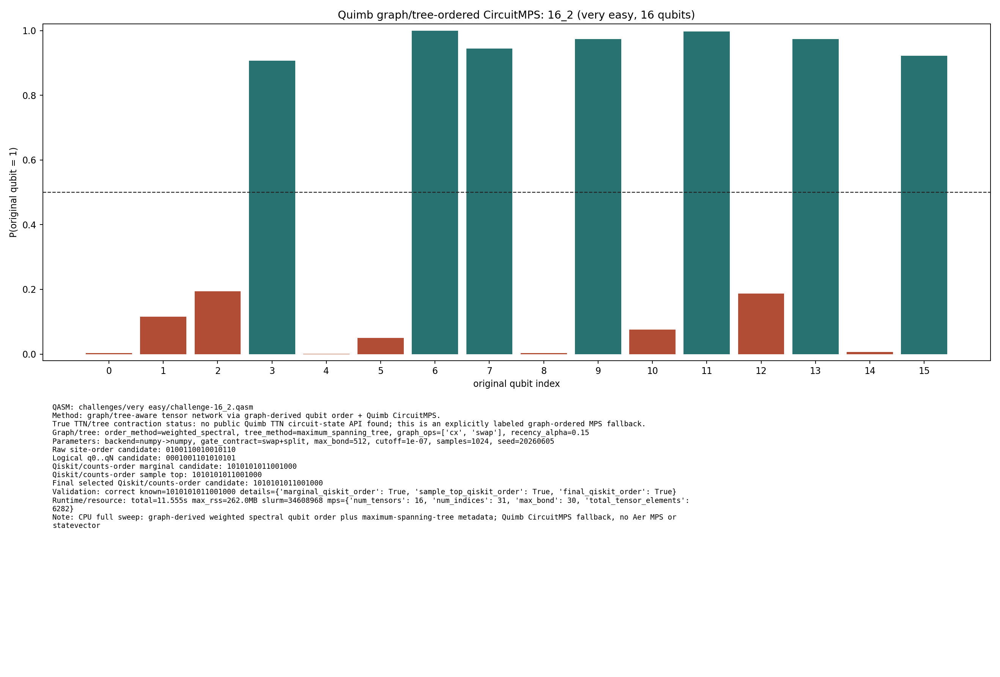
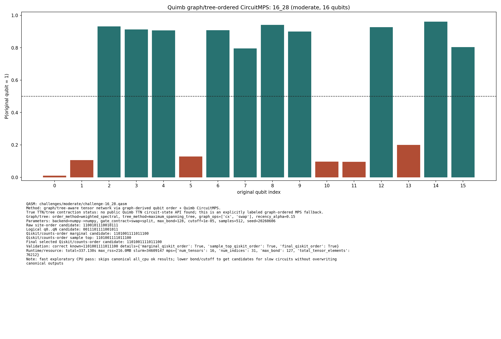
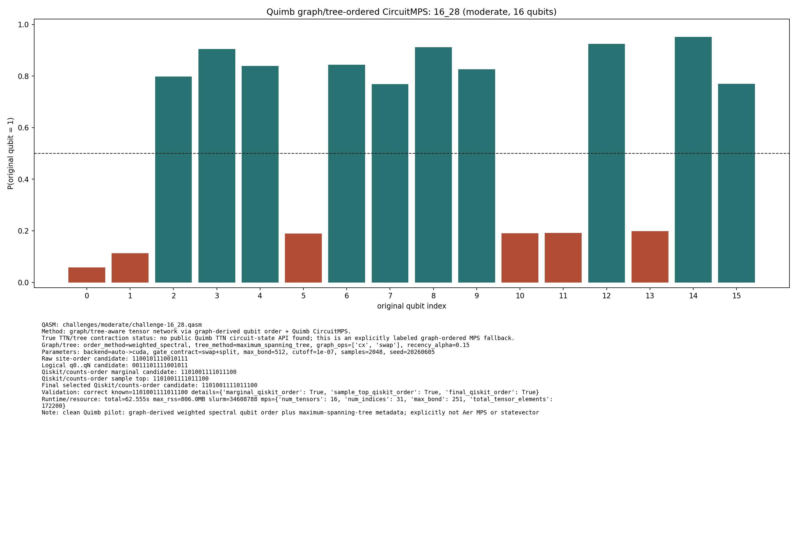
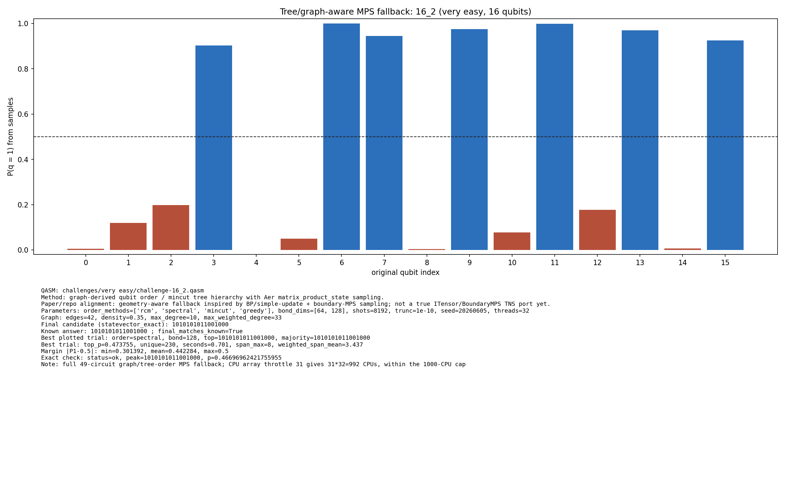
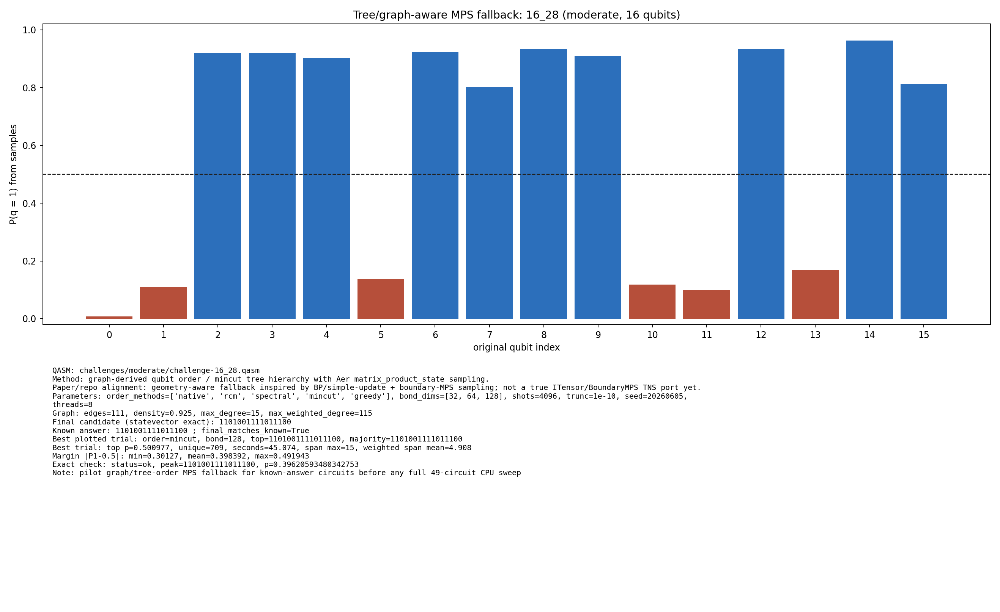

# Challenge 16_2

- Difficulty: very easy
- Qubits: 16
- QASM: `challenges/very easy/challenge-16_2.qasm`
- Selected answer: `1010101011001000`
- Selected method: `exact_statevector`
- Validation: `exact`
- Evidence rows: 2
- Normalized index page: [16_2](../../results_index/by_challenge/16_2.md)

## Distribution Figures

### Quimb graph-ordered MPS: tree_tensor_sim/all/images/challenge-16_28.quimb_tree_graph_mps.png

### Quimb graph-ordered MPS: tree_tensor_sim/all_cpu/images/challenge-16_2.quimb_tree_graph_mps.png

### Quimb graph-ordered MPS: tree_tensor_sim/all_cpu/images/challenge-16_28.quimb_tree_graph_mps.png

### Quimb graph-ordered MPS: tree_tensor_sim/fast_cpu/images/challenge-16_28.quimb_tree_graph_mps.png

### Quimb graph-ordered MPS: tree_tensor_sim/quimb_pilot/images/challenge-16_28.quimb_tree_graph_mps.png

### tree/order MPS sample: tree_tensor_sim/all/images/challenge-16_2.tree_tensor_mps.png

### tree/order MPS sample: tree_tensor_sim/all/images/challenge-16_28.tree_tensor_mps.png

### tree/order MPS sample: tree_tensor_sim/pilot/images/challenge-16_28.tree_tensor_mps.png

## Candidate Rows

| review | selected | method | rank_type | rank | bitstring | score | count | support | fraction | validation | status | source |
|---|---:|---|---|---:|---|---:|---:|---:|---:|---|---|---|
|  | 1 | aer_tree_mps_all | final_candidate | 1 | `1010101011001000` | 0.46696962421755955 |  |  | 0.46696962421755955 | {"bit_order_note":"Right-most bit is qubit 0.","final_matches_known":true,"known_answer":"1010101011001000","known_answers_are_qiskit_counts_order":true} | ok | `../quantum-junction-tree-tensor/outputs/tree_tensor_sim/all/json/challenge-16_2.tree_tensor_mps.json` |
|  | 0 | aer_tree_mps_all | sample_top | 1 | `0010101011001000` | 0.0447998046875 | 367 |  | 0.0447998046875 | {"bit_order_note":"Right-most bit is qubit 0.","final_matches_known":true,"known_answer":"1010101011001000","known_answers_are_qiskit_counts_order":true} | ok | `../quantum-junction-tree-tensor/outputs/tree_tensor_sim/all/json/challenge-16_2.tree_tensor_mps.json` |
|  | 0 | aer_tree_mps_all | sample_top | 1 | `0010101011001000` | 0.0428466796875 | 351 |  | 0.0428466796875 | {"bit_order_note":"Right-most bit is qubit 0.","final_matches_known":true,"known_answer":"1010101011001000","known_answers_are_qiskit_counts_order":true} | ok | `../quantum-junction-tree-tensor/outputs/tree_tensor_sim/all/json/challenge-16_2.tree_tensor_mps.json` |
|  | 0 | aer_tree_mps_all | sample_top | 1 | `0010101011001000` | 0.043701171875 | 358 |  | 0.043701171875 | {"bit_order_note":"Right-most bit is qubit 0.","final_matches_known":true,"known_answer":"1010101011001000","known_answers_are_qiskit_counts_order":true} | ok | `../quantum-junction-tree-tensor/outputs/tree_tensor_sim/all/json/challenge-16_2.tree_tensor_mps.json` |
|  | 0 | aer_tree_mps_all | sample_top | 1 | `0010101011001000` | 0.0384521484375 | 315 |  | 0.0384521484375 | {"bit_order_note":"Right-most bit is qubit 0.","final_matches_known":true,"known_answer":"1010101011001000","known_answers_are_qiskit_counts_order":true} | ok | `../quantum-junction-tree-tensor/outputs/tree_tensor_sim/all/json/challenge-16_2.tree_tensor_mps.json` |
|  | 0 | aer_tree_mps_all | sample_top | 1 | `0010101011001000` | 0.03857421875 | 316 |  | 0.03857421875 | {"bit_order_note":"Right-most bit is qubit 0.","final_matches_known":true,"known_answer":"1010101011001000","known_answers_are_qiskit_counts_order":true} | ok | `../quantum-junction-tree-tensor/outputs/tree_tensor_sim/all/json/challenge-16_2.tree_tensor_mps.json` |
|  | 0 | aer_tree_mps_all | sample_top | 1 | `0010101011001000` | 0.0394287109375 | 323 |  | 0.0394287109375 | {"bit_order_note":"Right-most bit is qubit 0.","final_matches_known":true,"known_answer":"1010101011001000","known_answers_are_qiskit_counts_order":true} | ok | `../quantum-junction-tree-tensor/outputs/tree_tensor_sim/all/json/challenge-16_2.tree_tensor_mps.json` |
|  | 0 | aer_tree_mps_all | sample_top | 1 | `0010101011001000` | 0.038330078125 | 314 |  | 0.038330078125 | {"bit_order_note":"Right-most bit is qubit 0.","final_matches_known":true,"known_answer":"1010101011001000","known_answers_are_qiskit_counts_order":true} | ok | `../quantum-junction-tree-tensor/outputs/tree_tensor_sim/all/json/challenge-16_2.tree_tensor_mps.json` |
|  | 0 | aer_tree_mps_all | sample_top | 1 | `0010101011001000` | 0.0413818359375 | 339 |  | 0.0413818359375 | {"bit_order_note":"Right-most bit is qubit 0.","final_matches_known":true,"known_answer":"1010101011001000","known_answers_are_qiskit_counts_order":true} | ok | `../quantum-junction-tree-tensor/outputs/tree_tensor_sim/all/json/challenge-16_2.tree_tensor_mps.json` |
|  | 0 | aer_tree_mps_all | sample_top | 2 | `0010101011001100` | 0.00537109375 | 44 |  | 0.00537109375 | {"bit_order_note":"Right-most bit is qubit 0.","final_matches_known":true,"known_answer":"1010101011001000","known_answers_are_qiskit_counts_order":true} | ok | `../quantum-junction-tree-tensor/outputs/tree_tensor_sim/all/json/challenge-16_2.tree_tensor_mps.json` |
|  | 0 | aer_tree_mps_all | sample_top | 2 | `0011101011001000` | 0.0089111328125 | 73 |  | 0.0089111328125 | {"bit_order_note":"Right-most bit is qubit 0.","final_matches_known":true,"known_answer":"1010101011001000","known_answers_are_qiskit_counts_order":true} | ok | `../quantum-junction-tree-tensor/outputs/tree_tensor_sim/all/json/challenge-16_2.tree_tensor_mps.json` |
|  | 0 | aer_tree_mps_all | sample_top | 2 | `0011101011001000` | 0.0084228515625 | 69 |  | 0.0084228515625 | {"bit_order_note":"Right-most bit is qubit 0.","final_matches_known":true,"known_answer":"1010101011001000","known_answers_are_qiskit_counts_order":true} | ok | `../quantum-junction-tree-tensor/outputs/tree_tensor_sim/all/json/challenge-16_2.tree_tensor_mps.json` |
|  | 0 | aer_tree_mps_all | sample_top | 2 | `0011101011001000` | 0.008056640625 | 66 |  | 0.008056640625 | {"bit_order_note":"Right-most bit is qubit 0.","final_matches_known":true,"known_answer":"1010101011001000","known_answers_are_qiskit_counts_order":true} | ok | `../quantum-junction-tree-tensor/outputs/tree_tensor_sim/all/json/challenge-16_2.tree_tensor_mps.json` |
|  | 0 | aer_tree_mps_all | sample_top | 2 | `0011101011001000` | 0.0096435546875 | 79 |  | 0.0096435546875 | {"bit_order_note":"Right-most bit is qubit 0.","final_matches_known":true,"known_answer":"1010101011001000","known_answers_are_qiskit_counts_order":true} | ok | `../quantum-junction-tree-tensor/outputs/tree_tensor_sim/all/json/challenge-16_2.tree_tensor_mps.json` |
|  | 0 | aer_tree_mps_all | sample_top | 2 | `0011101011001000` | 0.0078125 | 64 |  | 0.0078125 | {"bit_order_note":"Right-most bit is qubit 0.","final_matches_known":true,"known_answer":"1010101011001000","known_answers_are_qiskit_counts_order":true} | ok | `../quantum-junction-tree-tensor/outputs/tree_tensor_sim/all/json/challenge-16_2.tree_tensor_mps.json` |
|  | 0 | aer_tree_mps_all | sample_top | 2 | `0011101011001000` | 0.0101318359375 | 83 |  | 0.0101318359375 | {"bit_order_note":"Right-most bit is qubit 0.","final_matches_known":true,"known_answer":"1010101011001000","known_answers_are_qiskit_counts_order":true} | ok | `../quantum-junction-tree-tensor/outputs/tree_tensor_sim/all/json/challenge-16_2.tree_tensor_mps.json` |
|  | 0 | aer_tree_mps_all | sample_top | 2 | `0011101011001000` | 0.00830078125 | 68 |  | 0.00830078125 | {"bit_order_note":"Right-most bit is qubit 0.","final_matches_known":true,"known_answer":"1010101011001000","known_answers_are_qiskit_counts_order":true} | ok | `../quantum-junction-tree-tensor/outputs/tree_tensor_sim/all/json/challenge-16_2.tree_tensor_mps.json` |
|  | 0 | aer_tree_mps_all | sample_top | 3 | `0011101011001000` | 0.0106201171875 | 87 |  | 0.0106201171875 | {"bit_order_note":"Right-most bit is qubit 0.","final_matches_known":true,"known_answer":"1010101011001000","known_answers_are_qiskit_counts_order":true} | ok | `../quantum-junction-tree-tensor/outputs/tree_tensor_sim/all/json/challenge-16_2.tree_tensor_mps.json` |
|  | 0 | aer_tree_mps_all | sample_top | 3 | `1000100011101000` | 0.0062255859375 | 51 |  | 0.0062255859375 | {"bit_order_note":"Right-most bit is qubit 0.","final_matches_known":true,"known_answer":"1010101011001000","known_answers_are_qiskit_counts_order":true} | ok | `../quantum-junction-tree-tensor/outputs/tree_tensor_sim/all/json/challenge-16_2.tree_tensor_mps.json` |
|  | 0 | aer_tree_mps_all | sample_top | 3 | `1000100011101000` | 0.005615234375 | 46 |  | 0.005615234375 | {"bit_order_note":"Right-most bit is qubit 0.","final_matches_known":true,"known_answer":"1010101011001000","known_answers_are_qiskit_counts_order":true} | ok | `../quantum-junction-tree-tensor/outputs/tree_tensor_sim/all/json/challenge-16_2.tree_tensor_mps.json` |
|  | 0 | aer_tree_mps_all | sample_top | 3 | `1000100011101000` | 0.0050048828125 | 41 |  | 0.0050048828125 | {"bit_order_note":"Right-most bit is qubit 0.","final_matches_known":true,"known_answer":"1010101011001000","known_answers_are_qiskit_counts_order":true} | ok | `../quantum-junction-tree-tensor/outputs/tree_tensor_sim/all/json/challenge-16_2.tree_tensor_mps.json` |
|  | 0 | aer_tree_mps_all | sample_top | 3 | `1000100011101000` | 0.0048828125 | 40 |  | 0.0048828125 | {"bit_order_note":"Right-most bit is qubit 0.","final_matches_known":true,"known_answer":"1010101011001000","known_answers_are_qiskit_counts_order":true} | ok | `../quantum-junction-tree-tensor/outputs/tree_tensor_sim/all/json/challenge-16_2.tree_tensor_mps.json` |
|  | 0 | aer_tree_mps_all | sample_top | 3 | `1000100011101000` | 0.005615234375 | 46 |  | 0.005615234375 | {"bit_order_note":"Right-most bit is qubit 0.","final_matches_known":true,"known_answer":"1010101011001000","known_answers_are_qiskit_counts_order":true} | ok | `../quantum-junction-tree-tensor/outputs/tree_tensor_sim/all/json/challenge-16_2.tree_tensor_mps.json` |
|  | 0 | aer_tree_mps_all | sample_top | 3 | `1000100011101000` | 0.0062255859375 | 51 |  | 0.0062255859375 | {"bit_order_note":"Right-most bit is qubit 0.","final_matches_known":true,"known_answer":"1010101011001000","known_answers_are_qiskit_counts_order":true} | ok | `../quantum-junction-tree-tensor/outputs/tree_tensor_sim/all/json/challenge-16_2.tree_tensor_mps.json` |
|  | 0 | aer_tree_mps_all | sample_top | 3 | `1000100011101000` | 0.005126953125 | 42 |  | 0.005126953125 | {"bit_order_note":"Right-most bit is qubit 0.","final_matches_known":true,"known_answer":"1010101011001000","known_answers_are_qiskit_counts_order":true} | ok | `../quantum-junction-tree-tensor/outputs/tree_tensor_sim/all/json/challenge-16_2.tree_tensor_mps.json` |
|  | 0 | aer_tree_mps_all | sample_top | 4 | `1000100011101000` | 0.006591796875 | 54 |  | 0.006591796875 | {"bit_order_note":"Right-most bit is qubit 0.","final_matches_known":true,"known_answer":"1010101011001000","known_answers_are_qiskit_counts_order":true} | ok | `../quantum-junction-tree-tensor/outputs/tree_tensor_sim/all/json/challenge-16_2.tree_tensor_mps.json` |
|  | 0 | aer_tree_mps_all | sample_top | 4 | `1000101011101000` | 0.006103515625 | 50 |  | 0.006103515625 | {"bit_order_note":"Right-most bit is qubit 0.","final_matches_known":true,"known_answer":"1010101011001000","known_answers_are_qiskit_counts_order":true} | ok | `../quantum-junction-tree-tensor/outputs/tree_tensor_sim/all/json/challenge-16_2.tree_tensor_mps.json` |
|  | 0 | aer_tree_mps_all | sample_top | 4 | `1000101011101000` | 0.0054931640625 | 45 |  | 0.0054931640625 | {"bit_order_note":"Right-most bit is qubit 0.","final_matches_known":true,"known_answer":"1010101011001000","known_answers_are_qiskit_counts_order":true} | ok | `../quantum-junction-tree-tensor/outputs/tree_tensor_sim/all/json/challenge-16_2.tree_tensor_mps.json` |
|  | 0 | aer_tree_mps_all | sample_top | 4 | `1000101011101000` | 0.005859375 | 48 |  | 0.005859375 | {"bit_order_note":"Right-most bit is qubit 0.","final_matches_known":true,"known_answer":"1010101011001000","known_answers_are_qiskit_counts_order":true} | ok | `../quantum-junction-tree-tensor/outputs/tree_tensor_sim/all/json/challenge-16_2.tree_tensor_mps.json` |
|  | 0 | aer_tree_mps_all | sample_top | 4 | `1000101011101000` | 0.00537109375 | 44 |  | 0.00537109375 | {"bit_order_note":"Right-most bit is qubit 0.","final_matches_known":true,"known_answer":"1010101011001000","known_answers_are_qiskit_counts_order":true} | ok | `../quantum-junction-tree-tensor/outputs/tree_tensor_sim/all/json/challenge-16_2.tree_tensor_mps.json` |
|  | 0 | aer_tree_mps_all | sample_top | 4 | `1000101011101000` | 0.0057373046875 | 47 |  | 0.0057373046875 | {"bit_order_note":"Right-most bit is qubit 0.","final_matches_known":true,"known_answer":"1010101011001000","known_answers_are_qiskit_counts_order":true} | ok | `../quantum-junction-tree-tensor/outputs/tree_tensor_sim/all/json/challenge-16_2.tree_tensor_mps.json` |
|  | 0 | aer_tree_mps_all | sample_top | 4 | `1000101011101000` | 0.00537109375 | 44 |  | 0.00537109375 | {"bit_order_note":"Right-most bit is qubit 0.","final_matches_known":true,"known_answer":"1010101011001000","known_answers_are_qiskit_counts_order":true} | ok | `../quantum-junction-tree-tensor/outputs/tree_tensor_sim/all/json/challenge-16_2.tree_tensor_mps.json` |
|  | 0 | aer_tree_mps_all | sample_top | 4 | `1000101011101000` | 0.0048828125 | 40 |  | 0.0048828125 | {"bit_order_note":"Right-most bit is qubit 0.","final_matches_known":true,"known_answer":"1010101011001000","known_answers_are_qiskit_counts_order":true} | ok | `../quantum-junction-tree-tensor/outputs/tree_tensor_sim/all/json/challenge-16_2.tree_tensor_mps.json` |
|  | 0 | aer_tree_mps_all | sample_top | 5 | `1000101011101000` | 0.0057373046875 | 47 |  | 0.0057373046875 | {"bit_order_note":"Right-most bit is qubit 0.","final_matches_known":true,"known_answer":"1010101011001000","known_answers_are_qiskit_counts_order":true} | ok | `../quantum-junction-tree-tensor/outputs/tree_tensor_sim/all/json/challenge-16_2.tree_tensor_mps.json` |
|  | 0 | aer_tree_mps_all | sample_top | 5 | `1010101001000000` | 0.0106201171875 | 87 |  | 0.0106201171875 | {"bit_order_note":"Right-most bit is qubit 0.","final_matches_known":true,"known_answer":"1010101011001000","known_answers_are_qiskit_counts_order":true} | ok | `../quantum-junction-tree-tensor/outputs/tree_tensor_sim/all/json/challenge-16_2.tree_tensor_mps.json` |
|  | 0 | aer_tree_mps_all | sample_top | 5 | `1010101001000000` | 0.0125732421875 | 103 |  | 0.0125732421875 | {"bit_order_note":"Right-most bit is qubit 0.","final_matches_known":true,"known_answer":"1010101011001000","known_answers_are_qiskit_counts_order":true} | ok | `../quantum-junction-tree-tensor/outputs/tree_tensor_sim/all/json/challenge-16_2.tree_tensor_mps.json` |
|  | 0 | aer_tree_mps_all | sample_top | 5 | `1010101001000000` | 0.01171875 | 96 |  | 0.01171875 | {"bit_order_note":"Right-most bit is qubit 0.","final_matches_known":true,"known_answer":"1010101011001000","known_answers_are_qiskit_counts_order":true} | ok | `../quantum-junction-tree-tensor/outputs/tree_tensor_sim/all/json/challenge-16_2.tree_tensor_mps.json` |
|  | 0 | aer_tree_mps_all | sample_top | 5 | `1010101001000000` | 0.011962890625 | 98 |  | 0.011962890625 | {"bit_order_note":"Right-most bit is qubit 0.","final_matches_known":true,"known_answer":"1010101011001000","known_answers_are_qiskit_counts_order":true} | ok | `../quantum-junction-tree-tensor/outputs/tree_tensor_sim/all/json/challenge-16_2.tree_tensor_mps.json` |
|  | 0 | aer_tree_mps_all | sample_top | 5 | `1010101001000000` | 0.0137939453125 | 113 |  | 0.0137939453125 | {"bit_order_note":"Right-most bit is qubit 0.","final_matches_known":true,"known_answer":"1010101011001000","known_answers_are_qiskit_counts_order":true} | ok | `../quantum-junction-tree-tensor/outputs/tree_tensor_sim/all/json/challenge-16_2.tree_tensor_mps.json` |
|  | 0 | aer_tree_mps_all | sample_top | 5 | `1010101001000000` | 0.0125732421875 | 103 |  | 0.0125732421875 | {"bit_order_note":"Right-most bit is qubit 0.","final_matches_known":true,"known_answer":"1010101011001000","known_answers_are_qiskit_counts_order":true} | ok | `../quantum-junction-tree-tensor/outputs/tree_tensor_sim/all/json/challenge-16_2.tree_tensor_mps.json` |
|  | 0 | aer_tree_mps_all | sample_top | 5 | `1010101001000000` | 0.01220703125 | 100 |  | 0.01220703125 | {"bit_order_note":"Right-most bit is qubit 0.","final_matches_known":true,"known_answer":"1010101011001000","known_answers_are_qiskit_counts_order":true} | ok | `../quantum-junction-tree-tensor/outputs/tree_tensor_sim/all/json/challenge-16_2.tree_tensor_mps.json` |
|  | 0 | aer_tree_mps_all | sample_top | 6 | `1010101001000000` | 0.0130615234375 | 107 |  | 0.0130615234375 | {"bit_order_note":"Right-most bit is qubit 0.","final_matches_known":true,"known_answer":"1010101011001000","known_answers_are_qiskit_counts_order":true} | ok | `../quantum-junction-tree-tensor/outputs/tree_tensor_sim/all/json/challenge-16_2.tree_tensor_mps.json` |
|  | 0 | aer_tree_mps_all | sample_top | 6 | `1010101001001000` | 0.016357421875 | 134 |  | 0.016357421875 | {"bit_order_note":"Right-most bit is qubit 0.","final_matches_known":true,"known_answer":"1010101011001000","known_answers_are_qiskit_counts_order":true} | ok | `../quantum-junction-tree-tensor/outputs/tree_tensor_sim/all/json/challenge-16_2.tree_tensor_mps.json` |
|  | 0 | aer_tree_mps_all | sample_top | 6 | `1010101001001000` | 0.0155029296875 | 127 |  | 0.0155029296875 | {"bit_order_note":"Right-most bit is qubit 0.","final_matches_known":true,"known_answer":"1010101011001000","known_answers_are_qiskit_counts_order":true} | ok | `../quantum-junction-tree-tensor/outputs/tree_tensor_sim/all/json/challenge-16_2.tree_tensor_mps.json` |
|  | 0 | aer_tree_mps_all | sample_top | 6 | `1010101001001000` | 0.0157470703125 | 129 |  | 0.0157470703125 | {"bit_order_note":"Right-most bit is qubit 0.","final_matches_known":true,"known_answer":"1010101011001000","known_answers_are_qiskit_counts_order":true} | ok | `../quantum-junction-tree-tensor/outputs/tree_tensor_sim/all/json/challenge-16_2.tree_tensor_mps.json` |
|  | 0 | aer_tree_mps_all | sample_top | 6 | `1010101001001000` | 0.0174560546875 | 143 |  | 0.0174560546875 | {"bit_order_note":"Right-most bit is qubit 0.","final_matches_known":true,"known_answer":"1010101011001000","known_answers_are_qiskit_counts_order":true} | ok | `../quantum-junction-tree-tensor/outputs/tree_tensor_sim/all/json/challenge-16_2.tree_tensor_mps.json` |
|  | 0 | aer_tree_mps_all | sample_top | 6 | `1010101001001000` | 0.0172119140625 | 141 |  | 0.0172119140625 | {"bit_order_note":"Right-most bit is qubit 0.","final_matches_known":true,"known_answer":"1010101011001000","known_answers_are_qiskit_counts_order":true} | ok | `../quantum-junction-tree-tensor/outputs/tree_tensor_sim/all/json/challenge-16_2.tree_tensor_mps.json` |
|  | 0 | aer_tree_mps_all | sample_top | 6 | `1010101001001000` | 0.0137939453125 | 113 |  | 0.0137939453125 | {"bit_order_note":"Right-most bit is qubit 0.","final_matches_known":true,"known_answer":"1010101011001000","known_answers_are_qiskit_counts_order":true} | ok | `../quantum-junction-tree-tensor/outputs/tree_tensor_sim/all/json/challenge-16_2.tree_tensor_mps.json` |
|  | 0 | aer_tree_mps_all | sample_top | 6 | `1010101001001000` | 0.01806640625 | 148 |  | 0.01806640625 | {"bit_order_note":"Right-most bit is qubit 0.","final_matches_known":true,"known_answer":"1010101011001000","known_answers_are_qiskit_counts_order":true} | ok | `../quantum-junction-tree-tensor/outputs/tree_tensor_sim/all/json/challenge-16_2.tree_tensor_mps.json` |
|  | 0 | aer_tree_mps_all | sample_top | 7 | `1010101001001000` | 0.0162353515625 | 133 |  | 0.0162353515625 | {"bit_order_note":"Right-most bit is qubit 0.","final_matches_known":true,"known_answer":"1010101011001000","known_answers_are_qiskit_counts_order":true} | ok | `../quantum-junction-tree-tensor/outputs/tree_tensor_sim/all/json/challenge-16_2.tree_tensor_mps.json` |
|  | 0 | aer_tree_mps_all | sample_top | 7 | `1010101011000000` | 0.012939453125 | 106 |  | 0.012939453125 | {"bit_order_note":"Right-most bit is qubit 0.","final_matches_known":true,"known_answer":"1010101011001000","known_answers_are_qiskit_counts_order":true} | ok | `../quantum-junction-tree-tensor/outputs/tree_tensor_sim/all/json/challenge-16_2.tree_tensor_mps.json` |
|  | 0 | aer_tree_mps_all | sample_top | 7 | `1010101011000000` | 0.0167236328125 | 137 |  | 0.0167236328125 | {"bit_order_note":"Right-most bit is qubit 0.","final_matches_known":true,"known_answer":"1010101011001000","known_answers_are_qiskit_counts_order":true} | ok | `../quantum-junction-tree-tensor/outputs/tree_tensor_sim/all/json/challenge-16_2.tree_tensor_mps.json` |
|  | 0 | aer_tree_mps_all | sample_top | 7 | `1010101011000000` | 0.0145263671875 | 119 |  | 0.0145263671875 | {"bit_order_note":"Right-most bit is qubit 0.","final_matches_known":true,"known_answer":"1010101011001000","known_answers_are_qiskit_counts_order":true} | ok | `../quantum-junction-tree-tensor/outputs/tree_tensor_sim/all/json/challenge-16_2.tree_tensor_mps.json` |
|  | 0 | aer_tree_mps_all | sample_top | 7 | `1010101011000000` | 0.0142822265625 | 117 |  | 0.0142822265625 | {"bit_order_note":"Right-most bit is qubit 0.","final_matches_known":true,"known_answer":"1010101011001000","known_answers_are_qiskit_counts_order":true} | ok | `../quantum-junction-tree-tensor/outputs/tree_tensor_sim/all/json/challenge-16_2.tree_tensor_mps.json` |
|  | 0 | aer_tree_mps_all | sample_top | 7 | `1010101011000000` | 0.0137939453125 | 113 |  | 0.0137939453125 | {"bit_order_note":"Right-most bit is qubit 0.","final_matches_known":true,"known_answer":"1010101011001000","known_answers_are_qiskit_counts_order":true} | ok | `../quantum-junction-tree-tensor/outputs/tree_tensor_sim/all/json/challenge-16_2.tree_tensor_mps.json` |
|  | 0 | aer_tree_mps_all | sample_top | 7 | `1010101011000000` | 0.0167236328125 | 137 |  | 0.0167236328125 | {"bit_order_note":"Right-most bit is qubit 0.","final_matches_known":true,"known_answer":"1010101011001000","known_answers_are_qiskit_counts_order":true} | ok | `../quantum-junction-tree-tensor/outputs/tree_tensor_sim/all/json/challenge-16_2.tree_tensor_mps.json` |
|  | 0 | aer_tree_mps_all | sample_top | 7 | `1010101011000000` | 0.0159912109375 | 131 |  | 0.0159912109375 | {"bit_order_note":"Right-most bit is qubit 0.","final_matches_known":true,"known_answer":"1010101011001000","known_answers_are_qiskit_counts_order":true} | ok | `../quantum-junction-tree-tensor/outputs/tree_tensor_sim/all/json/challenge-16_2.tree_tensor_mps.json` |
|  | 0 | aer_tree_mps_all | sample_top | 8 | `1010101011000000` | 0.015380859375 | 126 |  | 0.015380859375 | {"bit_order_note":"Right-most bit is qubit 0.","final_matches_known":true,"known_answer":"1010101011001000","known_answers_are_qiskit_counts_order":true} | ok | `../quantum-junction-tree-tensor/outputs/tree_tensor_sim/all/json/challenge-16_2.tree_tensor_mps.json` |
|  | 1 | aer_tree_mps_all | sample_top | 8 | `1010101011001000` | 0.472900390625 | 3874 |  | 0.472900390625 | {"bit_order_note":"Right-most bit is qubit 0.","final_matches_known":true,"known_answer":"1010101011001000","known_answers_are_qiskit_counts_order":true} | ok | `../quantum-junction-tree-tensor/outputs/tree_tensor_sim/all/json/challenge-16_2.tree_tensor_mps.json` |
|  | 1 | aer_tree_mps_all | sample_top | 8 | `1010101011001000` | 0.467529296875 | 3830 |  | 0.467529296875 | {"bit_order_note":"Right-most bit is qubit 0.","final_matches_known":true,"known_answer":"1010101011001000","known_answers_are_qiskit_counts_order":true} | ok | `../quantum-junction-tree-tensor/outputs/tree_tensor_sim/all/json/challenge-16_2.tree_tensor_mps.json` |
|  | 1 | aer_tree_mps_all | sample_top | 8 | `1010101011001000` | 0.4737548828125 | 3881 |  | 0.4737548828125 | {"bit_order_note":"Right-most bit is qubit 0.","final_matches_known":true,"known_answer":"1010101011001000","known_answers_are_qiskit_counts_order":true} | ok | `../quantum-junction-tree-tensor/outputs/tree_tensor_sim/all/json/challenge-16_2.tree_tensor_mps.json` |
|  | 1 | aer_tree_mps_all | sample_top | 8 | `1010101011001000` | 0.4676513671875 | 3831 |  | 0.4676513671875 | {"bit_order_note":"Right-most bit is qubit 0.","final_matches_known":true,"known_answer":"1010101011001000","known_answers_are_qiskit_counts_order":true} | ok | `../quantum-junction-tree-tensor/outputs/tree_tensor_sim/all/json/challenge-16_2.tree_tensor_mps.json` |
|  | 1 | aer_tree_mps_all | sample_top | 8 | `1010101011001000` | 0.4637451171875 | 3799 |  | 0.4637451171875 | {"bit_order_note":"Right-most bit is qubit 0.","final_matches_known":true,"known_answer":"1010101011001000","known_answers_are_qiskit_counts_order":true} | ok | `../quantum-junction-tree-tensor/outputs/tree_tensor_sim/all/json/challenge-16_2.tree_tensor_mps.json` |
|  | 1 | aer_tree_mps_all | sample_top | 8 | `1010101011001000` | 0.4656982421875 | 3815 |  | 0.4656982421875 | {"bit_order_note":"Right-most bit is qubit 0.","final_matches_known":true,"known_answer":"1010101011001000","known_answers_are_qiskit_counts_order":true} | ok | `../quantum-junction-tree-tensor/outputs/tree_tensor_sim/all/json/challenge-16_2.tree_tensor_mps.json` |
|  | 1 | aer_tree_mps_all | sample_top | 8 | `1010101011001000` | 0.46044921875 | 3772 |  | 0.46044921875 | {"bit_order_note":"Right-most bit is qubit 0.","final_matches_known":true,"known_answer":"1010101011001000","known_answers_are_qiskit_counts_order":true} | ok | `../quantum-junction-tree-tensor/outputs/tree_tensor_sim/all/json/challenge-16_2.tree_tensor_mps.json` |
|  | 1 | aer_tree_mps_all | sample_top | 9 | `1010101011001000` | 0.4639892578125 | 3801 |  | 0.4639892578125 | {"bit_order_note":"Right-most bit is qubit 0.","final_matches_known":true,"known_answer":"1010101011001000","known_answers_are_qiskit_counts_order":true} | ok | `../quantum-junction-tree-tensor/outputs/tree_tensor_sim/all/json/challenge-16_2.tree_tensor_mps.json` |
|  | 0 | aer_tree_mps_all | sample_top | 9 | `1010101011001010` | 0.027099609375 | 222 |  | 0.027099609375 | {"bit_order_note":"Right-most bit is qubit 0.","final_matches_known":true,"known_answer":"1010101011001000","known_answers_are_qiskit_counts_order":true} | ok | `../quantum-junction-tree-tensor/outputs/tree_tensor_sim/all/json/challenge-16_2.tree_tensor_mps.json` |
|  | 0 | aer_tree_mps_all | sample_top | 9 | `1010101011001010` | 0.024169921875 | 198 |  | 0.024169921875 | {"bit_order_note":"Right-most bit is qubit 0.","final_matches_known":true,"known_answer":"1010101011001000","known_answers_are_qiskit_counts_order":true} | ok | `../quantum-junction-tree-tensor/outputs/tree_tensor_sim/all/json/challenge-16_2.tree_tensor_mps.json` |
|  | 0 | aer_tree_mps_all | sample_top | 9 | `1010101011001010` | 0.022705078125 | 186 |  | 0.022705078125 | {"bit_order_note":"Right-most bit is qubit 0.","final_matches_known":true,"known_answer":"1010101011001000","known_answers_are_qiskit_counts_order":true} | ok | `../quantum-junction-tree-tensor/outputs/tree_tensor_sim/all/json/challenge-16_2.tree_tensor_mps.json` |
|  | 0 | aer_tree_mps_all | sample_top | 9 | `1010101011001010` | 0.0228271484375 | 187 |  | 0.0228271484375 | {"bit_order_note":"Right-most bit is qubit 0.","final_matches_known":true,"known_answer":"1010101011001000","known_answers_are_qiskit_counts_order":true} | ok | `../quantum-junction-tree-tensor/outputs/tree_tensor_sim/all/json/challenge-16_2.tree_tensor_mps.json` |
|  | 0 | aer_tree_mps_all | sample_top | 9 | `1010101011001010` | 0.024169921875 | 198 |  | 0.024169921875 | {"bit_order_note":"Right-most bit is qubit 0.","final_matches_known":true,"known_answer":"1010101011001000","known_answers_are_qiskit_counts_order":true} | ok | `../quantum-junction-tree-tensor/outputs/tree_tensor_sim/all/json/challenge-16_2.tree_tensor_mps.json` |
|  | 0 | aer_tree_mps_all | sample_top | 9 | `1010101011001010` | 0.0220947265625 | 181 |  | 0.0220947265625 | {"bit_order_note":"Right-most bit is qubit 0.","final_matches_known":true,"known_answer":"1010101011001000","known_answers_are_qiskit_counts_order":true} | ok | `../quantum-junction-tree-tensor/outputs/tree_tensor_sim/all/json/challenge-16_2.tree_tensor_mps.json` |
|  | 0 | aer_tree_mps_all | sample_top | 9 | `1010101011001010` | 0.026611328125 | 218 |  | 0.026611328125 | {"bit_order_note":"Right-most bit is qubit 0.","final_matches_known":true,"known_answer":"1010101011001000","known_answers_are_qiskit_counts_order":true} | ok | `../quantum-junction-tree-tensor/outputs/tree_tensor_sim/all/json/challenge-16_2.tree_tensor_mps.json` |
|  | 0 | aer_tree_mps_all | sample_top | 10 | `1010101011001010` | 0.0218505859375 | 179 |  | 0.0218505859375 | {"bit_order_note":"Right-most bit is qubit 0.","final_matches_known":true,"known_answer":"1010101011001000","known_answers_are_qiskit_counts_order":true} | ok | `../quantum-junction-tree-tensor/outputs/tree_tensor_sim/all/json/challenge-16_2.tree_tensor_mps.json` |
|  | 0 | aer_tree_mps_all | sample_top | 10 | `1010101011001100` | 0.0643310546875 | 527 |  | 0.0643310546875 | {"bit_order_note":"Right-most bit is qubit 0.","final_matches_known":true,"known_answer":"1010101011001000","known_answers_are_qiskit_counts_order":true} | ok | `../quantum-junction-tree-tensor/outputs/tree_tensor_sim/all/json/challenge-16_2.tree_tensor_mps.json` |
|  | 0 | aer_tree_mps_all | sample_top | 10 | `1010101011001100` | 0.0606689453125 | 497 |  | 0.0606689453125 | {"bit_order_note":"Right-most bit is qubit 0.","final_matches_known":true,"known_answer":"1010101011001000","known_answers_are_qiskit_counts_order":true} | ok | `../quantum-junction-tree-tensor/outputs/tree_tensor_sim/all/json/challenge-16_2.tree_tensor_mps.json` |
|  | 0 | aer_tree_mps_all | sample_top | 10 | `1010101011001100` | 0.0631103515625 | 517 |  | 0.0631103515625 | {"bit_order_note":"Right-most bit is qubit 0.","final_matches_known":true,"known_answer":"1010101011001000","known_answers_are_qiskit_counts_order":true} | ok | `../quantum-junction-tree-tensor/outputs/tree_tensor_sim/all/json/challenge-16_2.tree_tensor_mps.json` |
|  | 0 | aer_tree_mps_all | sample_top | 10 | `1010101011001100` | 0.0655517578125 | 537 |  | 0.0655517578125 | {"bit_order_note":"Right-most bit is qubit 0.","final_matches_known":true,"known_answer":"1010101011001000","known_answers_are_qiskit_counts_order":true} | ok | `../quantum-junction-tree-tensor/outputs/tree_tensor_sim/all/json/challenge-16_2.tree_tensor_mps.json` |
|  | 0 | aer_tree_mps_all | sample_top | 10 | `1010101011001100` | 0.0557861328125 | 457 |  | 0.0557861328125 | {"bit_order_note":"Right-most bit is qubit 0.","final_matches_known":true,"known_answer":"1010101011001000","known_answers_are_qiskit_counts_order":true} | ok | `../quantum-junction-tree-tensor/outputs/tree_tensor_sim/all/json/challenge-16_2.tree_tensor_mps.json` |
|  | 0 | aer_tree_mps_all | sample_top | 10 | `1010101011001100` | 0.0648193359375 | 531 |  | 0.0648193359375 | {"bit_order_note":"Right-most bit is qubit 0.","final_matches_known":true,"known_answer":"1010101011001000","known_answers_are_qiskit_counts_order":true} | ok | `../quantum-junction-tree-tensor/outputs/tree_tensor_sim/all/json/challenge-16_2.tree_tensor_mps.json` |
|  | 0 | aer_tree_mps_all | sample_top | 10 | `1010101011001100` | 0.06201171875 | 508 |  | 0.06201171875 | {"bit_order_note":"Right-most bit is qubit 0.","final_matches_known":true,"known_answer":"1010101011001000","known_answers_are_qiskit_counts_order":true} | ok | `../quantum-junction-tree-tensor/outputs/tree_tensor_sim/all/json/challenge-16_2.tree_tensor_mps.json` |
|  | 0 | aer_tree_mps_all | sample_top | 11 | `1010101011001100` | 0.062255859375 | 510 |  | 0.062255859375 | {"bit_order_note":"Right-most bit is qubit 0.","final_matches_known":true,"known_answer":"1010101011001000","known_answers_are_qiskit_counts_order":true} | ok | `../quantum-junction-tree-tensor/outputs/tree_tensor_sim/all/json/challenge-16_2.tree_tensor_mps.json` |
|  | 0 | aer_tree_mps_all | sample_top | 11 | `1010101011001110` | 0.049072265625 | 402 |  | 0.049072265625 | {"bit_order_note":"Right-most bit is qubit 0.","final_matches_known":true,"known_answer":"1010101011001000","known_answers_are_qiskit_counts_order":true} | ok | `../quantum-junction-tree-tensor/outputs/tree_tensor_sim/all/json/challenge-16_2.tree_tensor_mps.json` |
|  | 0 | aer_tree_mps_all | sample_top | 11 | `1010101011001110` | 0.0498046875 | 408 |  | 0.0498046875 | {"bit_order_note":"Right-most bit is qubit 0.","final_matches_known":true,"known_answer":"1010101011001000","known_answers_are_qiskit_counts_order":true} | ok | `../quantum-junction-tree-tensor/outputs/tree_tensor_sim/all/json/challenge-16_2.tree_tensor_mps.json` |
|  | 0 | aer_tree_mps_all | sample_top | 11 | `1010101011001110` | 0.05029296875 | 412 |  | 0.05029296875 | {"bit_order_note":"Right-most bit is qubit 0.","final_matches_known":true,"known_answer":"1010101011001000","known_answers_are_qiskit_counts_order":true} | ok | `../quantum-junction-tree-tensor/outputs/tree_tensor_sim/all/json/challenge-16_2.tree_tensor_mps.json` |
|  | 0 | aer_tree_mps_all | sample_top | 11 | `1010101011001110` | 0.0489501953125 | 401 |  | 0.0489501953125 | {"bit_order_note":"Right-most bit is qubit 0.","final_matches_known":true,"known_answer":"1010101011001000","known_answers_are_qiskit_counts_order":true} | ok | `../quantum-junction-tree-tensor/outputs/tree_tensor_sim/all/json/challenge-16_2.tree_tensor_mps.json` |
|  | 0 | aer_tree_mps_all | sample_top | 11 | `1010101011001110` | 0.0511474609375 | 419 |  | 0.0511474609375 | {"bit_order_note":"Right-most bit is qubit 0.","final_matches_known":true,"known_answer":"1010101011001000","known_answers_are_qiskit_counts_order":true} | ok | `../quantum-junction-tree-tensor/outputs/tree_tensor_sim/all/json/challenge-16_2.tree_tensor_mps.json` |
|  | 0 | aer_tree_mps_all | sample_top | 11 | `1010101011001110` | 0.0506591796875 | 415 |  | 0.0506591796875 | {"bit_order_note":"Right-most bit is qubit 0.","final_matches_known":true,"known_answer":"1010101011001000","known_answers_are_qiskit_counts_order":true} | ok | `../quantum-junction-tree-tensor/outputs/tree_tensor_sim/all/json/challenge-16_2.tree_tensor_mps.json` |
|  | 0 | aer_tree_mps_all | sample_top | 11 | `1010101011001110` | 0.0501708984375 | 411 |  | 0.0501708984375 | {"bit_order_note":"Right-most bit is qubit 0.","final_matches_known":true,"known_answer":"1010101011001000","known_answers_are_qiskit_counts_order":true} | ok | `../quantum-junction-tree-tensor/outputs/tree_tensor_sim/all/json/challenge-16_2.tree_tensor_mps.json` |
|  | 0 | aer_tree_mps_all | sample_top | 12 | `1010101011001110` | 0.0469970703125 | 385 |  | 0.0469970703125 | {"bit_order_note":"Right-most bit is qubit 0.","final_matches_known":true,"known_answer":"1010101011001000","known_answers_are_qiskit_counts_order":true} | ok | `../quantum-junction-tree-tensor/outputs/tree_tensor_sim/all/json/challenge-16_2.tree_tensor_mps.json` |
|  | 0 | aer_tree_mps_all | sample_top | 12 | `1010111011000000` | 0.0057373046875 | 47 |  | 0.0057373046875 | {"bit_order_note":"Right-most bit is qubit 0.","final_matches_known":true,"known_answer":"1010101011001000","known_answers_are_qiskit_counts_order":true} | ok | `../quantum-junction-tree-tensor/outputs/tree_tensor_sim/all/json/challenge-16_2.tree_tensor_mps.json` |
|  | 0 | aer_tree_mps_all | sample_top | 12 | `1010111011000000` | 0.0076904296875 | 63 |  | 0.0076904296875 | {"bit_order_note":"Right-most bit is qubit 0.","final_matches_known":true,"known_answer":"1010101011001000","known_answers_are_qiskit_counts_order":true} | ok | `../quantum-junction-tree-tensor/outputs/tree_tensor_sim/all/json/challenge-16_2.tree_tensor_mps.json` |
|  | 0 | aer_tree_mps_all | sample_top | 12 | `1010111011000000` | 0.0087890625 | 72 |  | 0.0087890625 | {"bit_order_note":"Right-most bit is qubit 0.","final_matches_known":true,"known_answer":"1010101011001000","known_answers_are_qiskit_counts_order":true} | ok | `../quantum-junction-tree-tensor/outputs/tree_tensor_sim/all/json/challenge-16_2.tree_tensor_mps.json` |
|  | 0 | aer_tree_mps_all | sample_top | 12 | `1010111011000000` | 0.0103759765625 | 85 |  | 0.0103759765625 | {"bit_order_note":"Right-most bit is qubit 0.","final_matches_known":true,"known_answer":"1010101011001000","known_answers_are_qiskit_counts_order":true} | ok | `../quantum-junction-tree-tensor/outputs/tree_tensor_sim/all/json/challenge-16_2.tree_tensor_mps.json` |
|  | 0 | aer_tree_mps_all | sample_top | 12 | `1010111011000000` | 0.0078125 | 64 |  | 0.0078125 | {"bit_order_note":"Right-most bit is qubit 0.","final_matches_known":true,"known_answer":"1010101011001000","known_answers_are_qiskit_counts_order":true} | ok | `../quantum-junction-tree-tensor/outputs/tree_tensor_sim/all/json/challenge-16_2.tree_tensor_mps.json` |
|  | 0 | aer_tree_mps_all | sample_top | 12 | `1010111011000000` | 0.010009765625 | 82 |  | 0.010009765625 | {"bit_order_note":"Right-most bit is qubit 0.","final_matches_known":true,"known_answer":"1010101011001000","known_answers_are_qiskit_counts_order":true} | ok | `../quantum-junction-tree-tensor/outputs/tree_tensor_sim/all/json/challenge-16_2.tree_tensor_mps.json` |
|  | 0 | aer_tree_mps_all | sample_top | 12 | `1010111011000000` | 0.009033203125 | 74 |  | 0.009033203125 | {"bit_order_note":"Right-most bit is qubit 0.","final_matches_known":true,"known_answer":"1010101011001000","known_answers_are_qiskit_counts_order":true} | ok | `../quantum-junction-tree-tensor/outputs/tree_tensor_sim/all/json/challenge-16_2.tree_tensor_mps.json` |
|  | 0 | aer_tree_mps_all | sample_top | 13 | `1010111011000000` | 0.006591796875 | 54 |  | 0.006591796875 | {"bit_order_note":"Right-most bit is qubit 0.","final_matches_known":true,"known_answer":"1010101011001000","known_answers_are_qiskit_counts_order":true} | ok | `../quantum-junction-tree-tensor/outputs/tree_tensor_sim/all/json/challenge-16_2.tree_tensor_mps.json` |
|  | 0 | aer_tree_mps_all | sample_top | 13 | `1010111011000100` | 0.0057373046875 | 47 |  | 0.0057373046875 | {"bit_order_note":"Right-most bit is qubit 0.","final_matches_known":true,"known_answer":"1010101011001000","known_answers_are_qiskit_counts_order":true} | ok | `../quantum-junction-tree-tensor/outputs/tree_tensor_sim/all/json/challenge-16_2.tree_tensor_mps.json` |
|  | 0 | aer_tree_mps_all | sample_top | 13 | `1010111011000100` | 0.0068359375 | 56 |  | 0.0068359375 | {"bit_order_note":"Right-most bit is qubit 0.","final_matches_known":true,"known_answer":"1010101011001000","known_answers_are_qiskit_counts_order":true} | ok | `../quantum-junction-tree-tensor/outputs/tree_tensor_sim/all/json/challenge-16_2.tree_tensor_mps.json` |
|  | 0 | aer_tree_mps_all | sample_top | 13 | `1010111011000100` | 0.008544921875 | 70 |  | 0.008544921875 | {"bit_order_note":"Right-most bit is qubit 0.","final_matches_known":true,"known_answer":"1010101011001000","known_answers_are_qiskit_counts_order":true} | ok | `../quantum-junction-tree-tensor/outputs/tree_tensor_sim/all/json/challenge-16_2.tree_tensor_mps.json` |
|  | 0 | aer_tree_mps_all | sample_top | 13 | `1010111011000100` | 0.00732421875 | 60 |  | 0.00732421875 | {"bit_order_note":"Right-most bit is qubit 0.","final_matches_known":true,"known_answer":"1010101011001000","known_answers_are_qiskit_counts_order":true} | ok | `../quantum-junction-tree-tensor/outputs/tree_tensor_sim/all/json/challenge-16_2.tree_tensor_mps.json` |
|  | 0 | aer_tree_mps_all | sample_top | 13 | `1010111011000100` | 0.006591796875 | 54 |  | 0.006591796875 | {"bit_order_note":"Right-most bit is qubit 0.","final_matches_known":true,"known_answer":"1010101011001000","known_answers_are_qiskit_counts_order":true} | ok | `../quantum-junction-tree-tensor/outputs/tree_tensor_sim/all/json/challenge-16_2.tree_tensor_mps.json` |
|  | 0 | aer_tree_mps_all | sample_top | 13 | `1010111011000100` | 0.00537109375 | 44 |  | 0.00537109375 | {"bit_order_note":"Right-most bit is qubit 0.","final_matches_known":true,"known_answer":"1010101011001000","known_answers_are_qiskit_counts_order":true} | ok | `../quantum-junction-tree-tensor/outputs/tree_tensor_sim/all/json/challenge-16_2.tree_tensor_mps.json` |
|  | 0 | aer_tree_mps_all | sample_top | 13 | `1010111011000100` | 0.005126953125 | 42 |  | 0.005126953125 | {"bit_order_note":"Right-most bit is qubit 0.","final_matches_known":true,"known_answer":"1010101011001000","known_answers_are_qiskit_counts_order":true} | ok | `../quantum-junction-tree-tensor/outputs/tree_tensor_sim/all/json/challenge-16_2.tree_tensor_mps.json` |
|  | 0 | aer_tree_mps_all | sample_top | 14 | `1010111011000100` | 0.0062255859375 | 51 |  | 0.0062255859375 | {"bit_order_note":"Right-most bit is qubit 0.","final_matches_known":true,"known_answer":"1010101011001000","known_answers_are_qiskit_counts_order":true} | ok | `../quantum-junction-tree-tensor/outputs/tree_tensor_sim/all/json/challenge-16_2.tree_tensor_mps.json` |
|  | 0 | aer_tree_mps_all | sample_top | 14 | `1010111011001000` | 0.0263671875 | 216 |  | 0.0263671875 | {"bit_order_note":"Right-most bit is qubit 0.","final_matches_known":true,"known_answer":"1010101011001000","known_answers_are_qiskit_counts_order":true} | ok | `../quantum-junction-tree-tensor/outputs/tree_tensor_sim/all/json/challenge-16_2.tree_tensor_mps.json` |
|  | 0 | aer_tree_mps_all | sample_top | 14 | `1010111011001000` | 0.025634765625 | 210 |  | 0.025634765625 | {"bit_order_note":"Right-most bit is qubit 0.","final_matches_known":true,"known_answer":"1010101011001000","known_answers_are_qiskit_counts_order":true} | ok | `../quantum-junction-tree-tensor/outputs/tree_tensor_sim/all/json/challenge-16_2.tree_tensor_mps.json` |
|  | 0 | aer_tree_mps_all | sample_top | 14 | `1010111011001000` | 0.02490234375 | 204 |  | 0.02490234375 | {"bit_order_note":"Right-most bit is qubit 0.","final_matches_known":true,"known_answer":"1010101011001000","known_answers_are_qiskit_counts_order":true} | ok | `../quantum-junction-tree-tensor/outputs/tree_tensor_sim/all/json/challenge-16_2.tree_tensor_mps.json` |
|  | 0 | aer_tree_mps_all | sample_top | 14 | `1010111011001000` | 0.0260009765625 | 213 |  | 0.0260009765625 | {"bit_order_note":"Right-most bit is qubit 0.","final_matches_known":true,"known_answer":"1010101011001000","known_answers_are_qiskit_counts_order":true} | ok | `../quantum-junction-tree-tensor/outputs/tree_tensor_sim/all/json/challenge-16_2.tree_tensor_mps.json` |
|  | 0 | aer_tree_mps_all | sample_top | 14 | `1010111011001000` | 0.026123046875 | 214 |  | 0.026123046875 | {"bit_order_note":"Right-most bit is qubit 0.","final_matches_known":true,"known_answer":"1010101011001000","known_answers_are_qiskit_counts_order":true} | ok | `../quantum-junction-tree-tensor/outputs/tree_tensor_sim/all/json/challenge-16_2.tree_tensor_mps.json` |
|  | 0 | aer_tree_mps_all | sample_top | 14 | `1010111011001000` | 0.0257568359375 | 211 |  | 0.0257568359375 | {"bit_order_note":"Right-most bit is qubit 0.","final_matches_known":true,"known_answer":"1010101011001000","known_answers_are_qiskit_counts_order":true} | ok | `../quantum-junction-tree-tensor/outputs/tree_tensor_sim/all/json/challenge-16_2.tree_tensor_mps.json` |
|  | 0 | aer_tree_mps_all | sample_top | 14 | `1010111011001000` | 0.024169921875 | 198 |  | 0.024169921875 | {"bit_order_note":"Right-most bit is qubit 0.","final_matches_known":true,"known_answer":"1010101011001000","known_answers_are_qiskit_counts_order":true} | ok | `../quantum-junction-tree-tensor/outputs/tree_tensor_sim/all/json/challenge-16_2.tree_tensor_mps.json` |
|  | 0 | aer_tree_mps_all | sample_top | 15 | `1010111011001000` | 0.0284423828125 | 233 |  | 0.0284423828125 | {"bit_order_note":"Right-most bit is qubit 0.","final_matches_known":true,"known_answer":"1010101011001000","known_answers_are_qiskit_counts_order":true} | ok | `../quantum-junction-tree-tensor/outputs/tree_tensor_sim/all/json/challenge-16_2.tree_tensor_mps.json` |
|  | 0 | aer_tree_mps_all | sample_top | 15 | `1011101001001000` | 0.0050048828125 | 41 |  | 0.0050048828125 | {"bit_order_note":"Right-most bit is qubit 0.","final_matches_known":true,"known_answer":"1010101011001000","known_answers_are_qiskit_counts_order":true} | ok | `../quantum-junction-tree-tensor/outputs/tree_tensor_sim/all/json/challenge-16_2.tree_tensor_mps.json` |
|  | 0 | aer_tree_mps_all | sample_top | 15 | `1011101011000000` | 0.0040283203125 | 33 |  | 0.0040283203125 | {"bit_order_note":"Right-most bit is qubit 0.","final_matches_known":true,"known_answer":"1010101011001000","known_answers_are_qiskit_counts_order":true} | ok | `../quantum-junction-tree-tensor/outputs/tree_tensor_sim/all/json/challenge-16_2.tree_tensor_mps.json` |
|  | 0 | aer_tree_mps_all | sample_top | 15 | `1011101011000000` | 0.005615234375 | 46 |  | 0.005615234375 | {"bit_order_note":"Right-most bit is qubit 0.","final_matches_known":true,"known_answer":"1010101011001000","known_answers_are_qiskit_counts_order":true} | ok | `../quantum-junction-tree-tensor/outputs/tree_tensor_sim/all/json/challenge-16_2.tree_tensor_mps.json` |
|  | 0 | aer_tree_mps_all | sample_top | 15 | `1011101011000000` | 0.0045166015625 | 37 |  | 0.0045166015625 | {"bit_order_note":"Right-most bit is qubit 0.","final_matches_known":true,"known_answer":"1010101011001000","known_answers_are_qiskit_counts_order":true} | ok | `../quantum-junction-tree-tensor/outputs/tree_tensor_sim/all/json/challenge-16_2.tree_tensor_mps.json` |
|  | 0 | aer_tree_mps_all | sample_top | 15 | `1011101011000000` | 0.0052490234375 | 43 |  | 0.0052490234375 | {"bit_order_note":"Right-most bit is qubit 0.","final_matches_known":true,"known_answer":"1010101011001000","known_answers_are_qiskit_counts_order":true} | ok | `../quantum-junction-tree-tensor/outputs/tree_tensor_sim/all/json/challenge-16_2.tree_tensor_mps.json` |
|  | 0 | aer_tree_mps_all | sample_top | 15 | `1011101011000100` | 0.0081787109375 | 67 |  | 0.0081787109375 | {"bit_order_note":"Right-most bit is qubit 0.","final_matches_known":true,"known_answer":"1010101011001000","known_answers_are_qiskit_counts_order":true} | ok | `../quantum-junction-tree-tensor/outputs/tree_tensor_sim/all/json/challenge-16_2.tree_tensor_mps.json` |
|  | 0 | aer_tree_mps_all | sample_top | 15 | `1011101011000100` | 0.0069580078125 | 57 |  | 0.0069580078125 | {"bit_order_note":"Right-most bit is qubit 0.","final_matches_known":true,"known_answer":"1010101011001000","known_answers_are_qiskit_counts_order":true} | ok | `../quantum-junction-tree-tensor/outputs/tree_tensor_sim/all/json/challenge-16_2.tree_tensor_mps.json` |
|  | 0 | aer_tree_mps_all | sample_top | 16 | `1011101011000100` | 0.0091552734375 | 75 |  | 0.0091552734375 | {"bit_order_note":"Right-most bit is qubit 0.","final_matches_known":true,"known_answer":"1010101011001000","known_answers_are_qiskit_counts_order":true} | ok | `../quantum-junction-tree-tensor/outputs/tree_tensor_sim/all/json/challenge-16_2.tree_tensor_mps.json` |
|  | 0 | aer_tree_mps_all | sample_top | 16 | `1011101011000100` | 0.007080078125 | 58 |  | 0.007080078125 | {"bit_order_note":"Right-most bit is qubit 0.","final_matches_known":true,"known_answer":"1010101011001000","known_answers_are_qiskit_counts_order":true} | ok | `../quantum-junction-tree-tensor/outputs/tree_tensor_sim/all/json/challenge-16_2.tree_tensor_mps.json` |
|  | 0 | aer_tree_mps_all | sample_top | 16 | `1011101011000100` | 0.0072021484375 | 59 |  | 0.0072021484375 | {"bit_order_note":"Right-most bit is qubit 0.","final_matches_known":true,"known_answer":"1010101011001000","known_answers_are_qiskit_counts_order":true} | ok | `../quantum-junction-tree-tensor/outputs/tree_tensor_sim/all/json/challenge-16_2.tree_tensor_mps.json` |
|  | 0 | aer_tree_mps_all | sample_top | 16 | `1011101011000100` | 0.00830078125 | 68 |  | 0.00830078125 | {"bit_order_note":"Right-most bit is qubit 0.","final_matches_known":true,"known_answer":"1010101011001000","known_answers_are_qiskit_counts_order":true} | ok | `../quantum-junction-tree-tensor/outputs/tree_tensor_sim/all/json/challenge-16_2.tree_tensor_mps.json` |
|  | 0 | aer_tree_mps_all | sample_top | 16 | `1011101011000100` | 0.0096435546875 | 79 |  | 0.0096435546875 | {"bit_order_note":"Right-most bit is qubit 0.","final_matches_known":true,"known_answer":"1010101011001000","known_answers_are_qiskit_counts_order":true} | ok | `../quantum-junction-tree-tensor/outputs/tree_tensor_sim/all/json/challenge-16_2.tree_tensor_mps.json` |
|  | 0 | aer_tree_mps_all | sample_top | 16 | `1011101011000100` | 0.0086669921875 | 71 |  | 0.0086669921875 | {"bit_order_note":"Right-most bit is qubit 0.","final_matches_known":true,"known_answer":"1010101011001000","known_answers_are_qiskit_counts_order":true} | ok | `../quantum-junction-tree-tensor/outputs/tree_tensor_sim/all/json/challenge-16_2.tree_tensor_mps.json` |
|  | 0 | aer_tree_mps_all | sample_top | 16 | `1011101011001000` | 0.0938720703125 | 769 |  | 0.0938720703125 | {"bit_order_note":"Right-most bit is qubit 0.","final_matches_known":true,"known_answer":"1010101011001000","known_answers_are_qiskit_counts_order":true} | ok | `../quantum-junction-tree-tensor/outputs/tree_tensor_sim/all/json/challenge-16_2.tree_tensor_mps.json` |
|  | 0 | aer_tree_mps_all | sample_top | 16 | `1011101011001000` | 0.0977783203125 | 801 |  | 0.0977783203125 | {"bit_order_note":"Right-most bit is qubit 0.","final_matches_known":true,"known_answer":"1010101011001000","known_answers_are_qiskit_counts_order":true} | ok | `../quantum-junction-tree-tensor/outputs/tree_tensor_sim/all/json/challenge-16_2.tree_tensor_mps.json` |
|  | 0 | aer_tree_mps_all | sample_top | 17 | `1011101011001000` | 0.095458984375 | 782 |  | 0.095458984375 | {"bit_order_note":"Right-most bit is qubit 0.","final_matches_known":true,"known_answer":"1010101011001000","known_answers_are_qiskit_counts_order":true} | ok | `../quantum-junction-tree-tensor/outputs/tree_tensor_sim/all/json/challenge-16_2.tree_tensor_mps.json` |
|  | 0 | aer_tree_mps_all | sample_top | 17 | `1011101011001000` | 0.10009765625 | 820 |  | 0.10009765625 | {"bit_order_note":"Right-most bit is qubit 0.","final_matches_known":true,"known_answer":"1010101011001000","known_answers_are_qiskit_counts_order":true} | ok | `../quantum-junction-tree-tensor/outputs/tree_tensor_sim/all/json/challenge-16_2.tree_tensor_mps.json` |
|  | 0 | aer_tree_mps_all | sample_top | 17 | `1011101011001000` | 0.091064453125 | 746 |  | 0.091064453125 | {"bit_order_note":"Right-most bit is qubit 0.","final_matches_known":true,"known_answer":"1010101011001000","known_answers_are_qiskit_counts_order":true} | ok | `../quantum-junction-tree-tensor/outputs/tree_tensor_sim/all/json/challenge-16_2.tree_tensor_mps.json` |
|  | 0 | aer_tree_mps_all | sample_top | 17 | `1011101011001000` | 0.09521484375 | 780 |  | 0.09521484375 | {"bit_order_note":"Right-most bit is qubit 0.","final_matches_known":true,"known_answer":"1010101011001000","known_answers_are_qiskit_counts_order":true} | ok | `../quantum-junction-tree-tensor/outputs/tree_tensor_sim/all/json/challenge-16_2.tree_tensor_mps.json` |
|  | 0 | aer_tree_mps_all | sample_top | 17 | `1011101011001000` | 0.0977783203125 | 801 |  | 0.0977783203125 | {"bit_order_note":"Right-most bit is qubit 0.","final_matches_known":true,"known_answer":"1010101011001000","known_answers_are_qiskit_counts_order":true} | ok | `../quantum-junction-tree-tensor/outputs/tree_tensor_sim/all/json/challenge-16_2.tree_tensor_mps.json` |
|  | 0 | aer_tree_mps_all | sample_top | 17 | `1011101011001000` | 0.0958251953125 | 785 |  | 0.0958251953125 | {"bit_order_note":"Right-most bit is qubit 0.","final_matches_known":true,"known_answer":"1010101011001000","known_answers_are_qiskit_counts_order":true} | ok | `../quantum-junction-tree-tensor/outputs/tree_tensor_sim/all/json/challenge-16_2.tree_tensor_mps.json` |
|  | 0 | aer_tree_mps_all | sample_top | 17 | `1011101011001010` | 0.0052490234375 | 43 |  | 0.0052490234375 | {"bit_order_note":"Right-most bit is qubit 0.","final_matches_known":true,"known_answer":"1010101011001000","known_answers_are_qiskit_counts_order":true} | ok | `../quantum-junction-tree-tensor/outputs/tree_tensor_sim/all/json/challenge-16_2.tree_tensor_mps.json` |
|  | 0 | aer_tree_mps_all | sample_top | 17 | `1011101011001100` | 0.008056640625 | 66 |  | 0.008056640625 | {"bit_order_note":"Right-most bit is qubit 0.","final_matches_known":true,"known_answer":"1010101011001000","known_answers_are_qiskit_counts_order":true} | ok | `../quantum-junction-tree-tensor/outputs/tree_tensor_sim/all/json/challenge-16_2.tree_tensor_mps.json` |
|  | 0 | aer_tree_mps_all | sample_top | 18 | `1011101011001010` | 0.005615234375 | 46 |  | 0.005615234375 | {"bit_order_note":"Right-most bit is qubit 0.","final_matches_known":true,"known_answer":"1010101011001000","known_answers_are_qiskit_counts_order":true} | ok | `../quantum-junction-tree-tensor/outputs/tree_tensor_sim/all/json/challenge-16_2.tree_tensor_mps.json` |
|  | 0 | aer_tree_mps_all | sample_top | 18 | `1011101011001100` | 0.0096435546875 | 79 |  | 0.0096435546875 | {"bit_order_note":"Right-most bit is qubit 0.","final_matches_known":true,"known_answer":"1010101011001000","known_answers_are_qiskit_counts_order":true} | ok | `../quantum-junction-tree-tensor/outputs/tree_tensor_sim/all/json/challenge-16_2.tree_tensor_mps.json` |
|  | 0 | aer_tree_mps_all | sample_top | 18 | `1011101011001100` | 0.0089111328125 | 73 |  | 0.0089111328125 | {"bit_order_note":"Right-most bit is qubit 0.","final_matches_known":true,"known_answer":"1010101011001000","known_answers_are_qiskit_counts_order":true} | ok | `../quantum-junction-tree-tensor/outputs/tree_tensor_sim/all/json/challenge-16_2.tree_tensor_mps.json` |
|  | 0 | aer_tree_mps_all | sample_top | 18 | `1011101011001100` | 0.0086669921875 | 71 |  | 0.0086669921875 | {"bit_order_note":"Right-most bit is qubit 0.","final_matches_known":true,"known_answer":"1010101011001000","known_answers_are_qiskit_counts_order":true} | ok | `../quantum-junction-tree-tensor/outputs/tree_tensor_sim/all/json/challenge-16_2.tree_tensor_mps.json` |
|  | 0 | aer_tree_mps_all | sample_top | 18 | `1011101011001100` | 0.009521484375 | 78 |  | 0.009521484375 | {"bit_order_note":"Right-most bit is qubit 0.","final_matches_known":true,"known_answer":"1010101011001000","known_answers_are_qiskit_counts_order":true} | ok | `../quantum-junction-tree-tensor/outputs/tree_tensor_sim/all/json/challenge-16_2.tree_tensor_mps.json` |
|  | 0 | aer_tree_mps_all | sample_top | 18 | `1011101011001100` | 0.0113525390625 | 93 |  | 0.0113525390625 | {"bit_order_note":"Right-most bit is qubit 0.","final_matches_known":true,"known_answer":"1010101011001000","known_answers_are_qiskit_counts_order":true} | ok | `../quantum-junction-tree-tensor/outputs/tree_tensor_sim/all/json/challenge-16_2.tree_tensor_mps.json` |
|  | 0 | aer_tree_mps_all | sample_top | 18 | `1011101011001100` | 0.010009765625 | 82 |  | 0.010009765625 | {"bit_order_note":"Right-most bit is qubit 0.","final_matches_known":true,"known_answer":"1010101011001000","known_answers_are_qiskit_counts_order":true} | ok | `../quantum-junction-tree-tensor/outputs/tree_tensor_sim/all/json/challenge-16_2.tree_tensor_mps.json` |
|  | 0 | aer_tree_mps_all | sample_top | 18 | `1011101011001110` | 0.0091552734375 | 75 |  | 0.0091552734375 | {"bit_order_note":"Right-most bit is qubit 0.","final_matches_known":true,"known_answer":"1010101011001000","known_answers_are_qiskit_counts_order":true} | ok | `../quantum-junction-tree-tensor/outputs/tree_tensor_sim/all/json/challenge-16_2.tree_tensor_mps.json` |
|  | 0 | aer_tree_mps_all | sample_top | 19 | `1011101011001100` | 0.00927734375 | 76 |  | 0.00927734375 | {"bit_order_note":"Right-most bit is qubit 0.","final_matches_known":true,"known_answer":"1010101011001000","known_answers_are_qiskit_counts_order":true} | ok | `../quantum-junction-tree-tensor/outputs/tree_tensor_sim/all/json/challenge-16_2.tree_tensor_mps.json` |
|  | 0 | aer_tree_mps_all | sample_top | 19 | `1011101011001110` | 0.0086669921875 | 71 |  | 0.0086669921875 | {"bit_order_note":"Right-most bit is qubit 0.","final_matches_known":true,"known_answer":"1010101011001000","known_answers_are_qiskit_counts_order":true} | ok | `../quantum-junction-tree-tensor/outputs/tree_tensor_sim/all/json/challenge-16_2.tree_tensor_mps.json` |
|  | 0 | aer_tree_mps_all | sample_top | 19 | `1011101011001110` | 0.0091552734375 | 75 |  | 0.0091552734375 | {"bit_order_note":"Right-most bit is qubit 0.","final_matches_known":true,"known_answer":"1010101011001000","known_answers_are_qiskit_counts_order":true} | ok | `../quantum-junction-tree-tensor/outputs/tree_tensor_sim/all/json/challenge-16_2.tree_tensor_mps.json` |
|  | 0 | aer_tree_mps_all | sample_top | 19 | `1011101011001110` | 0.009765625 | 80 |  | 0.009765625 | {"bit_order_note":"Right-most bit is qubit 0.","final_matches_known":true,"known_answer":"1010101011001000","known_answers_are_qiskit_counts_order":true} | ok | `../quantum-junction-tree-tensor/outputs/tree_tensor_sim/all/json/challenge-16_2.tree_tensor_mps.json` |
|  | 0 | aer_tree_mps_all | sample_top | 19 | `1011101011001110` | 0.0086669921875 | 71 |  | 0.0086669921875 | {"bit_order_note":"Right-most bit is qubit 0.","final_matches_known":true,"known_answer":"1010101011001000","known_answers_are_qiskit_counts_order":true} | ok | `../quantum-junction-tree-tensor/outputs/tree_tensor_sim/all/json/challenge-16_2.tree_tensor_mps.json` |
|  | 0 | aer_tree_mps_all | sample_top | 19 | `1011101011001110` | 0.0098876953125 | 81 |  | 0.0098876953125 | {"bit_order_note":"Right-most bit is qubit 0.","final_matches_known":true,"known_answer":"1010101011001000","known_answers_are_qiskit_counts_order":true} | ok | `../quantum-junction-tree-tensor/outputs/tree_tensor_sim/all/json/challenge-16_2.tree_tensor_mps.json` |
|  | 0 | aer_tree_mps_all | sample_top | 19 | `1011101011001110` | 0.00830078125 | 68 |  | 0.00830078125 | {"bit_order_note":"Right-most bit is qubit 0.","final_matches_known":true,"known_answer":"1010101011001000","known_answers_are_qiskit_counts_order":true} | ok | `../quantum-junction-tree-tensor/outputs/tree_tensor_sim/all/json/challenge-16_2.tree_tensor_mps.json` |
|  | 0 | aer_tree_mps_all | sample_top | 19 | `1011111011000000` | 0.0062255859375 | 51 |  | 0.0062255859375 | {"bit_order_note":"Right-most bit is qubit 0.","final_matches_known":true,"known_answer":"1010101011001000","known_answers_are_qiskit_counts_order":true} | ok | `../quantum-junction-tree-tensor/outputs/tree_tensor_sim/all/json/challenge-16_2.tree_tensor_mps.json` |
|  | 0 | aer_tree_mps_all | sample_top | 20 | `1011101011001110` | 0.0096435546875 | 79 |  | 0.0096435546875 | {"bit_order_note":"Right-most bit is qubit 0.","final_matches_known":true,"known_answer":"1010101011001000","known_answers_are_qiskit_counts_order":true} | ok | `../quantum-junction-tree-tensor/outputs/tree_tensor_sim/all/json/challenge-16_2.tree_tensor_mps.json` |
|  | 0 | aer_tree_mps_all | sample_top | 20 | `1011111011000000` | 0.005615234375 | 46 |  | 0.005615234375 | {"bit_order_note":"Right-most bit is qubit 0.","final_matches_known":true,"known_answer":"1010101011001000","known_answers_are_qiskit_counts_order":true} | ok | `../quantum-junction-tree-tensor/outputs/tree_tensor_sim/all/json/challenge-16_2.tree_tensor_mps.json` |
|  | 0 | aer_tree_mps_all | sample_top | 20 | `1011111011000000` | 0.0059814453125 | 49 |  | 0.0059814453125 | {"bit_order_note":"Right-most bit is qubit 0.","final_matches_known":true,"known_answer":"1010101011001000","known_answers_are_qiskit_counts_order":true} | ok | `../quantum-junction-tree-tensor/outputs/tree_tensor_sim/all/json/challenge-16_2.tree_tensor_mps.json` |
|  | 0 | aer_tree_mps_all | sample_top | 20 | `1011111011000000` | 0.0050048828125 | 41 |  | 0.0050048828125 | {"bit_order_note":"Right-most bit is qubit 0.","final_matches_known":true,"known_answer":"1010101011001000","known_answers_are_qiskit_counts_order":true} | ok | `../quantum-junction-tree-tensor/outputs/tree_tensor_sim/all/json/challenge-16_2.tree_tensor_mps.json` |
|  | 0 | aer_tree_mps_all | sample_top | 20 | `1011111011000000` | 0.005859375 | 48 |  | 0.005859375 | {"bit_order_note":"Right-most bit is qubit 0.","final_matches_known":true,"known_answer":"1010101011001000","known_answers_are_qiskit_counts_order":true} | ok | `../quantum-junction-tree-tensor/outputs/tree_tensor_sim/all/json/challenge-16_2.tree_tensor_mps.json` |
|  | 0 | aer_tree_mps_all | sample_top | 20 | `1011111011000000` | 0.007080078125 | 58 |  | 0.007080078125 | {"bit_order_note":"Right-most bit is qubit 0.","final_matches_known":true,"known_answer":"1010101011001000","known_answers_are_qiskit_counts_order":true} | ok | `../quantum-junction-tree-tensor/outputs/tree_tensor_sim/all/json/challenge-16_2.tree_tensor_mps.json` |
|  | 0 | aer_tree_mps_all | sample_top | 20 | `1011111011000000` | 0.0079345703125 | 65 |  | 0.0079345703125 | {"bit_order_note":"Right-most bit is qubit 0.","final_matches_known":true,"known_answer":"1010101011001000","known_answers_are_qiskit_counts_order":true} | ok | `../quantum-junction-tree-tensor/outputs/tree_tensor_sim/all/json/challenge-16_2.tree_tensor_mps.json` |
|  | 0 | aer_tree_mps_all | sample_top | 20 | `1011111011001000` | 0.004638671875 | 38 |  | 0.004638671875 | {"bit_order_note":"Right-most bit is qubit 0.","final_matches_known":true,"known_answer":"1010101011001000","known_answers_are_qiskit_counts_order":true} | ok | `../quantum-junction-tree-tensor/outputs/tree_tensor_sim/all/json/challenge-16_2.tree_tensor_mps.json` |
|  | 1 | collector_snapshot | collector_selected | 1 | `1010101011001000` | 0.46696962421756005 |  |  | 0.46696962421756005 | exact | exact | `research/tree_tensor_sim_session/artifacts/collector/CANDIDATES.tsv` |
|  | 1 | exact_statevector | collector_evidence | 1 | `1010101011001000` | 0.46696962421756005 |  |  | 0.46696962421756005 | exact | exact | `agent_work/exact_baseline/peaks_exact.csv` |
|  | 1 | exact_statevector | exact_top | 1 | `1010101011001000` | 0.46696962421756005 |  |  | 0.46696962421756005 | exact | ok | `../quantum-junction-tree-tensor/agent_work/exact_baseline/peaks_exact.jsonl` |
|  | 0 | exact_statevector | exact_top | 2 | `1011101011001000` | 0.0975870441002859 |  |  | 0.0975870441002859 | exact | ok | `../quantum-junction-tree-tensor/agent_work/exact_baseline/peaks_exact.jsonl` |
|  | 0 | exact_statevector | exact_top | 3 | `1010101011001100` | 0.06209106413032871 |  |  | 0.06209106413032871 | exact | ok | `../quantum-junction-tree-tensor/agent_work/exact_baseline/peaks_exact.jsonl` |
|  | 0 | exact_statevector | exact_top | 4 | `1010101011001110` | 0.04911585026001513 |  |  | 0.04911585026001513 | exact | ok | `../quantum-junction-tree-tensor/agent_work/exact_baseline/peaks_exact.jsonl` |
|  | 0 | exact_statevector | exact_top | 5 | `0010101011001000` | 0.040214273324241975 |  |  | 0.040214273324241975 | exact | ok | `../quantum-junction-tree-tensor/agent_work/exact_baseline/peaks_exact.jsonl` |
|  | 0 | exact_statevector | exact_top | 6 | `1010111011001000` | 0.02597125894223926 |  |  | 0.02597125894223926 | exact | ok | `../quantum-junction-tree-tensor/agent_work/exact_baseline/peaks_exact.jsonl` |
|  | 0 | exact_statevector | exact_top | 7 | `1010101011001010` | 0.02304200988889332 |  |  | 0.02304200988889332 | exact | ok | `../quantum-junction-tree-tensor/agent_work/exact_baseline/peaks_exact.jsonl` |
|  | 0 | exact_statevector | exact_top | 8 | `1010101001001000` | 0.016855232759249567 |  |  | 0.016855232759249567 | exact | ok | `../quantum-junction-tree-tensor/agent_work/exact_baseline/peaks_exact.jsonl` |
|  | 1 | quimb_cpu_all | collector_evidence | 2 | `1010101011001000` | 0.4716796875 |  |  | 0.4716796875 | correct | correct | `outputs/tree_tensor_sim/all_cpu/json/challenge-16_2.quimb_tree_graph_mps.json` |
|  | 1 | quimb_cpu_all | final_candidate | 1 | `1010101011001000` | 0.30613191112704397 |  |  |  | {"candidate_results":{"final_qiskit_order":true,"marginal_qiskit_order":true,"sample_top_qiskit_order":true},"known_answer_qiskit_order":"1010101011001000","status":"correct"} | ok | `../quantum-junction-tree-tensor/outputs/tree_tensor_sim/all_cpu/json/challenge-16_2.quimb_tree_graph_mps.json` |
|  | 1 | quimb_cpu_all | marginal_candidate | 1 | `1010101011001000` | 0.30613191112704397 |  |  |  | {"candidate_results":{"final_qiskit_order":true,"marginal_qiskit_order":true,"sample_top_qiskit_order":true},"known_answer_qiskit_order":"1010101011001000","status":"correct"} | ok | `../quantum-junction-tree-tensor/outputs/tree_tensor_sim/all_cpu/json/challenge-16_2.quimb_tree_graph_mps.json` |
|  | 1 | quimb_cpu_all | sample_top | 1 | `1010101011001000` | 0.4716796875 | 483 |  | 0.4716796875 | {"candidate_results":{"final_qiskit_order":true,"marginal_qiskit_order":true,"sample_top_qiskit_order":true},"known_answer_qiskit_order":"1010101011001000","status":"correct"} | ok | `../quantum-junction-tree-tensor/outputs/tree_tensor_sim/all_cpu/json/challenge-16_2.quimb_tree_graph_mps.json` |
|  | 0 | quimb_cpu_all | sample_top | 2 | `1011101011001000` | 0.0908203125 | 93 |  | 0.0908203125 | {"candidate_results":{"final_qiskit_order":true,"marginal_qiskit_order":true,"sample_top_qiskit_order":true},"known_answer_qiskit_order":"1010101011001000","status":"correct"} | ok | `../quantum-junction-tree-tensor/outputs/tree_tensor_sim/all_cpu/json/challenge-16_2.quimb_tree_graph_mps.json` |
|  | 0 | quimb_cpu_all | sample_top | 3 | `1010101011001100` | 0.068359375 | 70 |  | 0.068359375 | {"candidate_results":{"final_qiskit_order":true,"marginal_qiskit_order":true,"sample_top_qiskit_order":true},"known_answer_qiskit_order":"1010101011001000","status":"correct"} | ok | `../quantum-junction-tree-tensor/outputs/tree_tensor_sim/all_cpu/json/challenge-16_2.quimb_tree_graph_mps.json` |
|  | 0 | quimb_cpu_all | sample_top | 4 | `1010101011001110` | 0.0517578125 | 53 |  | 0.0517578125 | {"candidate_results":{"final_qiskit_order":true,"marginal_qiskit_order":true,"sample_top_qiskit_order":true},"known_answer_qiskit_order":"1010101011001000","status":"correct"} | ok | `../quantum-junction-tree-tensor/outputs/tree_tensor_sim/all_cpu/json/challenge-16_2.quimb_tree_graph_mps.json` |
|  | 0 | quimb_cpu_all | sample_top | 5 | `0010101011001000` | 0.0498046875 | 51 |  | 0.0498046875 | {"candidate_results":{"final_qiskit_order":true,"marginal_qiskit_order":true,"sample_top_qiskit_order":true},"known_answer_qiskit_order":"1010101011001000","status":"correct"} | ok | `../quantum-junction-tree-tensor/outputs/tree_tensor_sim/all_cpu/json/challenge-16_2.quimb_tree_graph_mps.json` |
|  | 0 | quimb_cpu_all | sample_top | 6 | `1010111011001000` | 0.0224609375 | 23 |  | 0.0224609375 | {"candidate_results":{"final_qiskit_order":true,"marginal_qiskit_order":true,"sample_top_qiskit_order":true},"known_answer_qiskit_order":"1010101011001000","status":"correct"} | ok | `../quantum-junction-tree-tensor/outputs/tree_tensor_sim/all_cpu/json/challenge-16_2.quimb_tree_graph_mps.json` |
|  | 0 | quimb_cpu_all | sample_top | 7 | `1010101011001010` | 0.0224609375 | 23 |  | 0.0224609375 | {"candidate_results":{"final_qiskit_order":true,"marginal_qiskit_order":true,"sample_top_qiskit_order":true},"known_answer_qiskit_order":"1010101011001000","status":"correct"} | ok | `../quantum-junction-tree-tensor/outputs/tree_tensor_sim/all_cpu/json/challenge-16_2.quimb_tree_graph_mps.json` |
|  | 0 | quimb_cpu_all | sample_top | 8 | `1010101011000000` | 0.015625 | 16 |  | 0.015625 | {"candidate_results":{"final_qiskit_order":true,"marginal_qiskit_order":true,"sample_top_qiskit_order":true},"known_answer_qiskit_order":"1010101011001000","status":"correct"} | ok | `../quantum-junction-tree-tensor/outputs/tree_tensor_sim/all_cpu/json/challenge-16_2.quimb_tree_graph_mps.json` |
|  | 0 | quimb_cpu_all | sample_top | 9 | `1010101001001000` | 0.013671875 | 14 |  | 0.013671875 | {"candidate_results":{"final_qiskit_order":true,"marginal_qiskit_order":true,"sample_top_qiskit_order":true},"known_answer_qiskit_order":"1010101011001000","status":"correct"} | ok | `../quantum-junction-tree-tensor/outputs/tree_tensor_sim/all_cpu/json/challenge-16_2.quimb_tree_graph_mps.json` |
|  | 0 | quimb_cpu_all | sample_top | 10 | `1011101011001100` | 0.0126953125 | 13 |  | 0.0126953125 | {"candidate_results":{"final_qiskit_order":true,"marginal_qiskit_order":true,"sample_top_qiskit_order":true},"known_answer_qiskit_order":"1010101011001000","status":"correct"} | ok | `../quantum-junction-tree-tensor/outputs/tree_tensor_sim/all_cpu/json/challenge-16_2.quimb_tree_graph_mps.json` |
|  | 0 | quimb_cpu_all | sample_top | 11 | `0011101011001000` | 0.0126953125 | 13 |  | 0.0126953125 | {"candidate_results":{"final_qiskit_order":true,"marginal_qiskit_order":true,"sample_top_qiskit_order":true},"known_answer_qiskit_order":"1010101011001000","status":"correct"} | ok | `../quantum-junction-tree-tensor/outputs/tree_tensor_sim/all_cpu/json/challenge-16_2.quimb_tree_graph_mps.json` |
|  | 0 | quimb_cpu_all | sample_top | 12 | `1011101011001110` | 0.0107421875 | 11 |  | 0.0107421875 | {"candidate_results":{"final_qiskit_order":true,"marginal_qiskit_order":true,"sample_top_qiskit_order":true},"known_answer_qiskit_order":"1010101011001000","status":"correct"} | ok | `../quantum-junction-tree-tensor/outputs/tree_tensor_sim/all_cpu/json/challenge-16_2.quimb_tree_graph_mps.json` |
