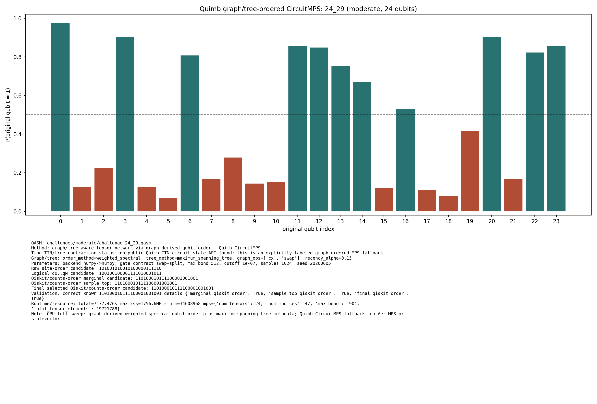
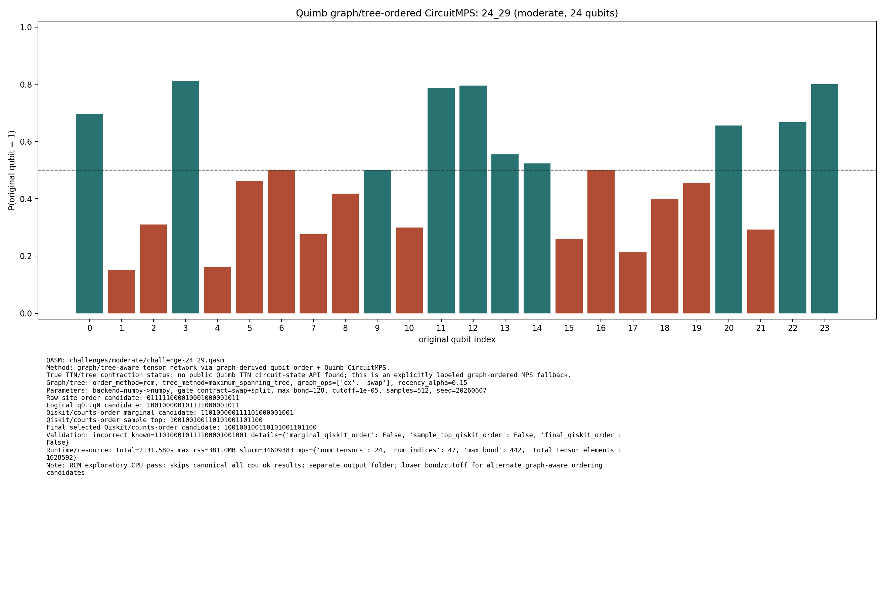

# Challenge 24_29

- Difficulty: moderate
- Qubits: 24
- QASM: `challenges/moderate/challenge-24_29.qasm`
- Selected answer: `110100010111100001001001`
- Selected method: `exact_statevector`
- Validation: `exact`
- Evidence rows: 4
- Normalized index page: [24_29](../../results_index/by_challenge/24_29.md)

## Distribution Figures

### Quimb graph-ordered MPS: tree_tensor_sim/all_cpu/images/challenge-24_29.quimb_tree_graph_mps.png

### Quimb graph-ordered MPS: tree_tensor_sim/rcm_cpu/images/challenge-24_29.quimb_tree_graph_mps.png

## Candidate Rows

| review | selected | method | rank_type | rank | bitstring | score | count | support | fraction | validation | status | source |
|---|---:|---|---|---:|---|---:|---:|---:|---:|---|---|---|
|  | 0 | aer_tree_mps_all | sample_top | 1 | `010100010111100011111011` | 0.000244140625 | 2 |  | 0.000244140625 |  | ok | `../quantum-junction-tree-tensor/outputs/tree_tensor_sim/all/json/challenge-24_29.tree_tensor_mps.json` |
|  | 0 | aer_tree_mps_all | sample_top | 2 | `010110000001101001001101` | 0.0003662109375 | 3 |  | 0.0003662109375 |  | ok | `../quantum-junction-tree-tensor/outputs/tree_tensor_sim/all/json/challenge-24_29.tree_tensor_mps.json` |
|  | 0 | aer_tree_mps_all | sample_top | 3 | `010110010010100010001111` | 0.000244140625 | 2 |  | 0.000244140625 |  | ok | `../quantum-junction-tree-tensor/outputs/tree_tensor_sim/all/json/challenge-24_29.tree_tensor_mps.json` |
|  | 0 | aer_tree_mps_all | sample_top | 4 | `010110010101101101001101` | 0.000244140625 | 2 |  | 0.000244140625 |  | ok | `../quantum-junction-tree-tensor/outputs/tree_tensor_sim/all/json/challenge-24_29.tree_tensor_mps.json` |
|  | 0 | aer_tree_mps_all | sample_top | 5 | `010110010111100001101001` | 0.0003662109375 | 3 |  | 0.0003662109375 |  | ok | `../quantum-junction-tree-tensor/outputs/tree_tensor_sim/all/json/challenge-24_29.tree_tensor_mps.json` |
|  | 0 | aer_tree_mps_all | sample_top | 6 | `010110010111101011101111` | 0.000244140625 | 2 |  | 0.000244140625 |  | ok | `../quantum-junction-tree-tensor/outputs/tree_tensor_sim/all/json/challenge-24_29.tree_tensor_mps.json` |
|  | 0 | aer_tree_mps_all | sample_top | 7 | `010110010111101100101001` | 0.000244140625 | 2 |  | 0.000244140625 |  | ok | `../quantum-junction-tree-tensor/outputs/tree_tensor_sim/all/json/challenge-24_29.tree_tensor_mps.json` |
|  | 0 | aer_tree_mps_all | sample_top | 8 | `100110110100100101101011` | 0.000244140625 | 2 |  | 0.000244140625 |  | ok | `../quantum-junction-tree-tensor/outputs/tree_tensor_sim/all/json/challenge-24_29.tree_tensor_mps.json` |
|  | 0 | aer_tree_mps_all | sample_top | 9 | `101110000111100011001011` | 0.000244140625 | 2 |  | 0.000244140625 |  | ok | `../quantum-junction-tree-tensor/outputs/tree_tensor_sim/all/json/challenge-24_29.tree_tensor_mps.json` |
|  | 0 | aer_tree_mps_all | sample_top | 10 | `110100000011100000001111` | 0.000244140625 | 2 |  | 0.000244140625 |  | ok | `../quantum-junction-tree-tensor/outputs/tree_tensor_sim/all/json/challenge-24_29.tree_tensor_mps.json` |
|  | 0 | aer_tree_mps_all | sample_top | 11 | `110100000111101010111011` | 0.000244140625 | 2 |  | 0.000244140625 |  | ok | `../quantum-junction-tree-tensor/outputs/tree_tensor_sim/all/json/challenge-24_29.tree_tensor_mps.json` |
|  | 0 | aer_tree_mps_all | sample_top | 12 | `110100010010101001011011` | 0.000244140625 | 2 |  | 0.000244140625 |  | ok | `../quantum-junction-tree-tensor/outputs/tree_tensor_sim/all/json/challenge-24_29.tree_tensor_mps.json` |
|  | 0 | aer_tree_mps_all | sample_top | 13 | `110100010011100100001001` | 0.000244140625 | 2 |  | 0.000244140625 |  | ok | `../quantum-junction-tree-tensor/outputs/tree_tensor_sim/all/json/challenge-24_29.tree_tensor_mps.json` |
|  | 0 | aer_tree_mps_all | sample_top | 14 | `110100010011101000001111` | 0.000244140625 | 2 |  | 0.000244140625 |  | ok | `../quantum-junction-tree-tensor/outputs/tree_tensor_sim/all/json/challenge-24_29.tree_tensor_mps.json` |
|  | 0 | aer_tree_mps_all | sample_top | 15 | `110100100011101010001001` | 0.0003662109375 | 3 |  | 0.0003662109375 |  | ok | `../quantum-junction-tree-tensor/outputs/tree_tensor_sim/all/json/challenge-24_29.tree_tensor_mps.json` |
|  | 0 | aer_tree_mps_all | sample_top | 16 | `110110000011101000001011` | 0.0003662109375 | 3 |  | 0.0003662109375 |  | ok | `../quantum-junction-tree-tensor/outputs/tree_tensor_sim/all/json/challenge-24_29.tree_tensor_mps.json` |
|  | 0 | aer_tree_mps_all | sample_top | 17 | `110110000110101000001101` | 0.0003662109375 | 3 |  | 0.0003662109375 |  | ok | `../quantum-junction-tree-tensor/outputs/tree_tensor_sim/all/json/challenge-24_29.tree_tensor_mps.json` |
|  | 0 | aer_tree_mps_all | sample_top | 18 | `110110010000101100011101` | 0.000244140625 | 2 |  | 0.000244140625 |  | ok | `../quantum-junction-tree-tensor/outputs/tree_tensor_sim/all/json/challenge-24_29.tree_tensor_mps.json` |
|  | 0 | aer_tree_mps_all | sample_top | 19 | `110110010111101001101011` | 0.000244140625 | 2 |  | 0.000244140625 |  | ok | `../quantum-junction-tree-tensor/outputs/tree_tensor_sim/all/json/challenge-24_29.tree_tensor_mps.json` |
|  | 0 | aer_tree_mps_all | sample_top | 20 | `110111000101100101001111` | 0.000244140625 | 2 |  | 0.000244140625 |  | ok | `../quantum-junction-tree-tensor/outputs/tree_tensor_sim/all/json/challenge-24_29.tree_tensor_mps.json` |
|  | 1 | collector_snapshot | collector_selected | 1 | `110100010111100001001001` | 0.3900966376778103 |  |  | 0.3900966376778103 | exact | exact | `research/tree_tensor_sim_session/artifacts/collector/CANDIDATES.tsv` |
|  | 1 | exact_statevector | collector_evidence | 1 | `110100010111100001001001` | 0.3900966376778103 |  |  | 0.3900966376778103 | exact | exact | `agent_work/exact_baseline/peaks_exact.csv` |
|  | 1 | exact_statevector | exact_top | 1 | `110100010111100001001001` | 0.3900966376778103 |  |  | 0.3900966376778103 | exact | ok | `../quantum-junction-tree-tensor/agent_work/exact_baseline/peaks_exact.jsonl` |
|  | 0 | exact_statevector | exact_top | 2 | `110100110111000001001001` | 0.013436270064882261 |  |  | 0.013436270064882261 | exact | ok | `../quantum-junction-tree-tensor/agent_work/exact_baseline/peaks_exact.jsonl` |
|  | 0 | exact_statevector | exact_top | 3 | `110100010111100001011001` | 0.011777952787485673 |  |  | 0.011777952787485673 | exact | ok | `../quantum-junction-tree-tensor/agent_work/exact_baseline/peaks_exact.jsonl` |
|  | 0 | exact_statevector | exact_top | 4 | `110100010101100001001001` | 0.009103024648788698 |  |  | 0.009103024648788698 | exact | ok | `../quantum-junction-tree-tensor/agent_work/exact_baseline/peaks_exact.jsonl` |
|  | 0 | exact_statevector | exact_top | 5 | `100100110111100001001001` | 0.006298391257051266 |  |  | 0.006298391257051266 | exact | ok | `../quantum-junction-tree-tensor/agent_work/exact_baseline/peaks_exact.jsonl` |
|  | 0 | exact_statevector | exact_top | 6 | `110101010011110001001001` | 0.005051951620317402 |  |  | 0.005051951620317402 | exact | ok | `../quantum-junction-tree-tensor/agent_work/exact_baseline/peaks_exact.jsonl` |
|  | 0 | exact_statevector | exact_top | 7 | `110101010111110001101001` | 0.004879830325825648 |  |  | 0.004879830325825648 | exact | ok | `../quantum-junction-tree-tensor/agent_work/exact_baseline/peaks_exact.jsonl` |
|  | 0 | exact_statevector | exact_top | 8 | `110101010011110001101001` | 0.004803443787627567 |  |  | 0.004803443787627567 | exact | ok | `../quantum-junction-tree-tensor/agent_work/exact_baseline/peaks_exact.jsonl` |
|  | 1 | quimb_cpu_all | collector_evidence | 2 | `110100010111100001001001` | 0.03125 |  |  | 0.03125 | correct | correct | `outputs/tree_tensor_sim/all_cpu/json/challenge-24_29.quimb_tree_graph_mps.json` |
|  | 1 | quimb_cpu_all | final_candidate | 1 | `110100010111100001001001` | 0.029376349022711135 |  |  |  | {"candidate_results":{"final_qiskit_order":true,"marginal_qiskit_order":true,"sample_top_qiskit_order":true},"known_answer_qiskit_order":"110100010111100001001001","status":"correct"} | ok | `../quantum-junction-tree-tensor/outputs/tree_tensor_sim/all_cpu/json/challenge-24_29.quimb_tree_graph_mps.json` |
|  | 1 | quimb_cpu_all | marginal_candidate | 1 | `110100010111100001001001` | 0.029376349022711135 |  |  |  | {"candidate_results":{"final_qiskit_order":true,"marginal_qiskit_order":true,"sample_top_qiskit_order":true},"known_answer_qiskit_order":"110100010111100001001001","status":"correct"} | ok | `../quantum-junction-tree-tensor/outputs/tree_tensor_sim/all_cpu/json/challenge-24_29.quimb_tree_graph_mps.json` |
|  | 1 | quimb_cpu_all | sample_top | 1 | `110100010111100001001001` | 0.03125 | 32 |  | 0.03125 | {"candidate_results":{"final_qiskit_order":true,"marginal_qiskit_order":true,"sample_top_qiskit_order":true},"known_answer_qiskit_order":"110100010111100001001001","status":"correct"} | ok | `../quantum-junction-tree-tensor/outputs/tree_tensor_sim/all_cpu/json/challenge-24_29.quimb_tree_graph_mps.json` |
|  | 0 | quimb_cpu_all | sample_top | 2 | `110110000111100001001001` | 0.021484375 | 22 |  | 0.021484375 | {"candidate_results":{"final_qiskit_order":true,"marginal_qiskit_order":true,"sample_top_qiskit_order":true},"known_answer_qiskit_order":"110100010111100001001001","status":"correct"} | ok | `../quantum-junction-tree-tensor/outputs/tree_tensor_sim/all_cpu/json/challenge-24_29.quimb_tree_graph_mps.json` |
|  | 0 | quimb_cpu_all | sample_top | 3 | `110100010011100001001001` | 0.0166015625 | 17 |  | 0.0166015625 | {"candidate_results":{"final_qiskit_order":true,"marginal_qiskit_order":true,"sample_top_qiskit_order":true},"known_answer_qiskit_order":"110100010111100001001001","status":"correct"} | ok | `../quantum-junction-tree-tensor/outputs/tree_tensor_sim/all_cpu/json/challenge-24_29.quimb_tree_graph_mps.json` |
|  | 0 | quimb_cpu_all | sample_top | 4 | `110110010111100001001001` | 0.015625 | 16 |  | 0.015625 | {"candidate_results":{"final_qiskit_order":true,"marginal_qiskit_order":true,"sample_top_qiskit_order":true},"known_answer_qiskit_order":"110100010111100001001001","status":"correct"} | ok | `../quantum-junction-tree-tensor/outputs/tree_tensor_sim/all_cpu/json/challenge-24_29.quimb_tree_graph_mps.json` |
|  | 0 | quimb_cpu_all | sample_top | 5 | `110100000111100001001001` | 0.013671875 | 14 |  | 0.013671875 | {"candidate_results":{"final_qiskit_order":true,"marginal_qiskit_order":true,"sample_top_qiskit_order":true},"known_answer_qiskit_order":"110100010111100001001001","status":"correct"} | ok | `../quantum-junction-tree-tensor/outputs/tree_tensor_sim/all_cpu/json/challenge-24_29.quimb_tree_graph_mps.json` |
|  | 0 | quimb_cpu_all | sample_top | 6 | `110100000011100001001001` | 0.0107421875 | 11 |  | 0.0107421875 | {"candidate_results":{"final_qiskit_order":true,"marginal_qiskit_order":true,"sample_top_qiskit_order":true},"known_answer_qiskit_order":"110100010111100001001001","status":"correct"} | ok | `../quantum-junction-tree-tensor/outputs/tree_tensor_sim/all_cpu/json/challenge-24_29.quimb_tree_graph_mps.json` |
|  | 0 | quimb_cpu_all | sample_top | 7 | `110100000101100001001001` | 0.0087890625 | 9 |  | 0.0087890625 | {"candidate_results":{"final_qiskit_order":true,"marginal_qiskit_order":true,"sample_top_qiskit_order":true},"known_answer_qiskit_order":"110100010111100001001001","status":"correct"} | ok | `../quantum-junction-tree-tensor/outputs/tree_tensor_sim/all_cpu/json/challenge-24_29.quimb_tree_graph_mps.json` |
|  | 0 | quimb_cpu_all | sample_top | 8 | `110100010111100101001001` | 0.0087890625 | 9 |  | 0.0087890625 | {"candidate_results":{"final_qiskit_order":true,"marginal_qiskit_order":true,"sample_top_qiskit_order":true},"known_answer_qiskit_order":"110100010111100001001001","status":"correct"} | ok | `../quantum-junction-tree-tensor/outputs/tree_tensor_sim/all_cpu/json/challenge-24_29.quimb_tree_graph_mps.json` |
|  | 0 | quimb_cpu_all | sample_top | 9 | `110110000111100101001001` | 0.0078125 | 8 |  | 0.0078125 | {"candidate_results":{"final_qiskit_order":true,"marginal_qiskit_order":true,"sample_top_qiskit_order":true},"known_answer_qiskit_order":"110100010111100001001001","status":"correct"} | ok | `../quantum-junction-tree-tensor/outputs/tree_tensor_sim/all_cpu/json/challenge-24_29.quimb_tree_graph_mps.json` |
|  | 0 | quimb_cpu_all | sample_top | 10 | `110110000011100001001001` | 0.0068359375 | 7 |  | 0.0068359375 | {"candidate_results":{"final_qiskit_order":true,"marginal_qiskit_order":true,"sample_top_qiskit_order":true},"known_answer_qiskit_order":"110100010111100001001001","status":"correct"} | ok | `../quantum-junction-tree-tensor/outputs/tree_tensor_sim/all_cpu/json/challenge-24_29.quimb_tree_graph_mps.json` |
|  | 0 | quimb_cpu_all | sample_top | 11 | `110110010111100001001101` | 0.0068359375 | 7 |  | 0.0068359375 | {"candidate_results":{"final_qiskit_order":true,"marginal_qiskit_order":true,"sample_top_qiskit_order":true},"known_answer_qiskit_order":"110100010111100001001001","status":"correct"} | ok | `../quantum-junction-tree-tensor/outputs/tree_tensor_sim/all_cpu/json/challenge-24_29.quimb_tree_graph_mps.json` |
|  | 0 | quimb_cpu_all | sample_top | 12 | `110100010101100001001001` | 0.0068359375 | 7 |  | 0.0068359375 | {"candidate_results":{"final_qiskit_order":true,"marginal_qiskit_order":true,"sample_top_qiskit_order":true},"known_answer_qiskit_order":"110100010111100001001001","status":"correct"} | ok | `../quantum-junction-tree-tensor/outputs/tree_tensor_sim/all_cpu/json/challenge-24_29.quimb_tree_graph_mps.json` |
|  | 0 | quimb_rcm_cpu | collector_evidence | 3 | `100100100110101001101100` | 0.001953125 |  |  | 0.001953125 | incorrect | incorrect | `outputs/tree_tensor_sim/rcm_cpu/json/challenge-24_29.quimb_tree_graph_mps.json` |
|  | 0 | quimb_rcm_cpu | final_candidate | 1 | `100100100110101001101100` | 3.746849419616893e-08 |  |  |  | {"candidate_results":{"final_qiskit_order":false,"marginal_qiskit_order":false,"sample_top_qiskit_order":false},"known_answer_qiskit_order":"110100010111100001001001","status":"incorrect"} | ok | `../quantum-junction-tree-tensor/outputs/tree_tensor_sim/rcm_cpu/json/challenge-24_29.quimb_tree_graph_mps.json` |
|  | 0 | quimb_rcm_cpu | marginal_candidate | 1 | `110100000111101000001001` | 3.746849419616893e-08 |  |  |  | {"candidate_results":{"final_qiskit_order":false,"marginal_qiskit_order":false,"sample_top_qiskit_order":false},"known_answer_qiskit_order":"110100010111100001001001","status":"incorrect"} | ok | `../quantum-junction-tree-tensor/outputs/tree_tensor_sim/rcm_cpu/json/challenge-24_29.quimb_tree_graph_mps.json` |
|  | 0 | quimb_rcm_cpu | sample_top | 1 | `100100100110101001101100` | 0.001953125 | 1 |  | 0.001953125 | {"candidate_results":{"final_qiskit_order":false,"marginal_qiskit_order":false,"sample_top_qiskit_order":false},"known_answer_qiskit_order":"110100010111100001001001","status":"incorrect"} | ok | `../quantum-junction-tree-tensor/outputs/tree_tensor_sim/rcm_cpu/json/challenge-24_29.quimb_tree_graph_mps.json` |
|  | 0 | quimb_rcm_cpu | sample_top | 2 | `010000100001100000000001` | 0.001953125 | 1 |  | 0.001953125 | {"candidate_results":{"final_qiskit_order":false,"marginal_qiskit_order":false,"sample_top_qiskit_order":false},"known_answer_qiskit_order":"110100010111100001001001","status":"incorrect"} | ok | `../quantum-junction-tree-tensor/outputs/tree_tensor_sim/rcm_cpu/json/challenge-24_29.quimb_tree_graph_mps.json` |
|  | 0 | quimb_rcm_cpu | sample_top | 3 | `011001010110000110010101` | 0.001953125 | 1 |  | 0.001953125 | {"candidate_results":{"final_qiskit_order":false,"marginal_qiskit_order":false,"sample_top_qiskit_order":false},"known_answer_qiskit_order":"110100010111100001001001","status":"incorrect"} | ok | `../quantum-junction-tree-tensor/outputs/tree_tensor_sim/rcm_cpu/json/challenge-24_29.quimb_tree_graph_mps.json` |
|  | 0 | quimb_rcm_cpu | sample_top | 4 | `110101010001100101001000` | 0.001953125 | 1 |  | 0.001953125 | {"candidate_results":{"final_qiskit_order":false,"marginal_qiskit_order":false,"sample_top_qiskit_order":false},"known_answer_qiskit_order":"110100010111100001001001","status":"incorrect"} | ok | `../quantum-junction-tree-tensor/outputs/tree_tensor_sim/rcm_cpu/json/challenge-24_29.quimb_tree_graph_mps.json` |
|  | 0 | quimb_rcm_cpu | sample_top | 5 | `100100100111010010101000` | 0.001953125 | 1 |  | 0.001953125 | {"candidate_results":{"final_qiskit_order":false,"marginal_qiskit_order":false,"sample_top_qiskit_order":false},"known_answer_qiskit_order":"110100010111100001001001","status":"incorrect"} | ok | `../quantum-junction-tree-tensor/outputs/tree_tensor_sim/rcm_cpu/json/challenge-24_29.quimb_tree_graph_mps.json` |
|  | 0 | quimb_rcm_cpu | sample_top | 6 | `111110010011100110011001` | 0.001953125 | 1 |  | 0.001953125 | {"candidate_results":{"final_qiskit_order":false,"marginal_qiskit_order":false,"sample_top_qiskit_order":false},"known_answer_qiskit_order":"110100010111100001001001","status":"incorrect"} | ok | `../quantum-junction-tree-tensor/outputs/tree_tensor_sim/rcm_cpu/json/challenge-24_29.quimb_tree_graph_mps.json` |
|  | 0 | quimb_rcm_cpu | sample_top | 7 | `111011010111001110101101` | 0.001953125 | 1 |  | 0.001953125 | {"candidate_results":{"final_qiskit_order":false,"marginal_qiskit_order":false,"sample_top_qiskit_order":false},"known_answer_qiskit_order":"110100010111100001001001","status":"incorrect"} | ok | `../quantum-junction-tree-tensor/outputs/tree_tensor_sim/rcm_cpu/json/challenge-24_29.quimb_tree_graph_mps.json` |
|  | 0 | quimb_rcm_cpu | sample_top | 8 | `110010000001100100101001` | 0.001953125 | 1 |  | 0.001953125 | {"candidate_results":{"final_qiskit_order":false,"marginal_qiskit_order":false,"sample_top_qiskit_order":false},"known_answer_qiskit_order":"110100010111100001001001","status":"incorrect"} | ok | `../quantum-junction-tree-tensor/outputs/tree_tensor_sim/rcm_cpu/json/challenge-24_29.quimb_tree_graph_mps.json` |
|  | 0 | quimb_rcm_cpu | sample_top | 9 | `110100011110111100011000` | 0.001953125 | 1 |  | 0.001953125 | {"candidate_results":{"final_qiskit_order":false,"marginal_qiskit_order":false,"sample_top_qiskit_order":false},"known_answer_qiskit_order":"110100010111100001001001","status":"incorrect"} | ok | `../quantum-junction-tree-tensor/outputs/tree_tensor_sim/rcm_cpu/json/challenge-24_29.quimb_tree_graph_mps.json` |
|  | 0 | quimb_rcm_cpu | sample_top | 10 | `110101100010011000101100` | 0.001953125 | 1 |  | 0.001953125 | {"candidate_results":{"final_qiskit_order":false,"marginal_qiskit_order":false,"sample_top_qiskit_order":false},"known_answer_qiskit_order":"110100010111100001001001","status":"incorrect"} | ok | `../quantum-junction-tree-tensor/outputs/tree_tensor_sim/rcm_cpu/json/challenge-24_29.quimb_tree_graph_mps.json` |
|  | 0 | quimb_rcm_cpu | sample_top | 11 | `111110000000110010101011` | 0.001953125 | 1 |  | 0.001953125 | {"candidate_results":{"final_qiskit_order":false,"marginal_qiskit_order":false,"sample_top_qiskit_order":false},"known_answer_qiskit_order":"110100010111100001001001","status":"incorrect"} | ok | `../quantum-junction-tree-tensor/outputs/tree_tensor_sim/rcm_cpu/json/challenge-24_29.quimb_tree_graph_mps.json` |
|  | 0 | quimb_rcm_cpu | sample_top | 12 | `110000000111111001001101` | 0.001953125 | 1 |  | 0.001953125 | {"candidate_results":{"final_qiskit_order":false,"marginal_qiskit_order":false,"sample_top_qiskit_order":false},"known_answer_qiskit_order":"110100010111100001001001","status":"incorrect"} | ok | `../quantum-junction-tree-tensor/outputs/tree_tensor_sim/rcm_cpu/json/challenge-24_29.quimb_tree_graph_mps.json` |
|  | 0 | sparse_beam | collector_evidence | 4 | `100110010001101111011111` | 5.0115220205033214e-05 |  |  | 5.0115220205033214e-05 | unknown | unknown | `outputs/tree_tensor_sim/sparse_beam/json/challenge-24_29.beam20000.json` |
|  | 0 | sparse_beam | sparse_beam | 1 | `100110010001101111011111` | 4.714767187623006e-19 |  |  |  |  | ok | `../quantum-junction-tree-tensor/outputs/tree_tensor_sim/sparse_beam/json/challenge-24_29.beam20000.json` |
|  | 0 | sparse_beam | sparse_beam | 2 | `100110010001101111011101` | 4.714767187623006e-19 |  |  |  |  | ok | `../quantum-junction-tree-tensor/outputs/tree_tensor_sim/sparse_beam/json/challenge-24_29.beam20000.json` |
|  | 0 | sparse_beam | sparse_beam | 3 | `110110010001100111011110` | 4.714767187623005e-19 |  |  |  |  | ok | `../quantum-junction-tree-tensor/outputs/tree_tensor_sim/sparse_beam/json/challenge-24_29.beam20000.json` |
|  | 0 | sparse_beam | sparse_beam | 4 | `110110010001100101011100` | 4.714767187623005e-19 |  |  |  |  | ok | `../quantum-junction-tree-tensor/outputs/tree_tensor_sim/sparse_beam/json/challenge-24_29.beam20000.json` |
|  | 0 | sparse_beam | sparse_beam | 5 | `100110010001101111011110` | 4.714767187623005e-19 |  |  |  |  | ok | `../quantum-junction-tree-tensor/outputs/tree_tensor_sim/sparse_beam/json/challenge-24_29.beam20000.json` |
|  | 0 | sparse_beam | sparse_beam | 6 | `100110010001101111011100` | 4.714767187623005e-19 |  |  |  |  | ok | `../quantum-junction-tree-tensor/outputs/tree_tensor_sim/sparse_beam/json/challenge-24_29.beam20000.json` |
|  | 0 | sparse_beam | sparse_beam | 7 | `100110010001101101011110` | 4.714767187623005e-19 |  |  |  |  | ok | `../quantum-junction-tree-tensor/outputs/tree_tensor_sim/sparse_beam/json/challenge-24_29.beam20000.json` |
|  | 0 | sparse_beam | sparse_beam | 8 | `110110010001101111011110` | 4.714767187623004e-19 |  |  |  |  | ok | `../quantum-junction-tree-tensor/outputs/tree_tensor_sim/sparse_beam/json/challenge-24_29.beam20000.json` |
