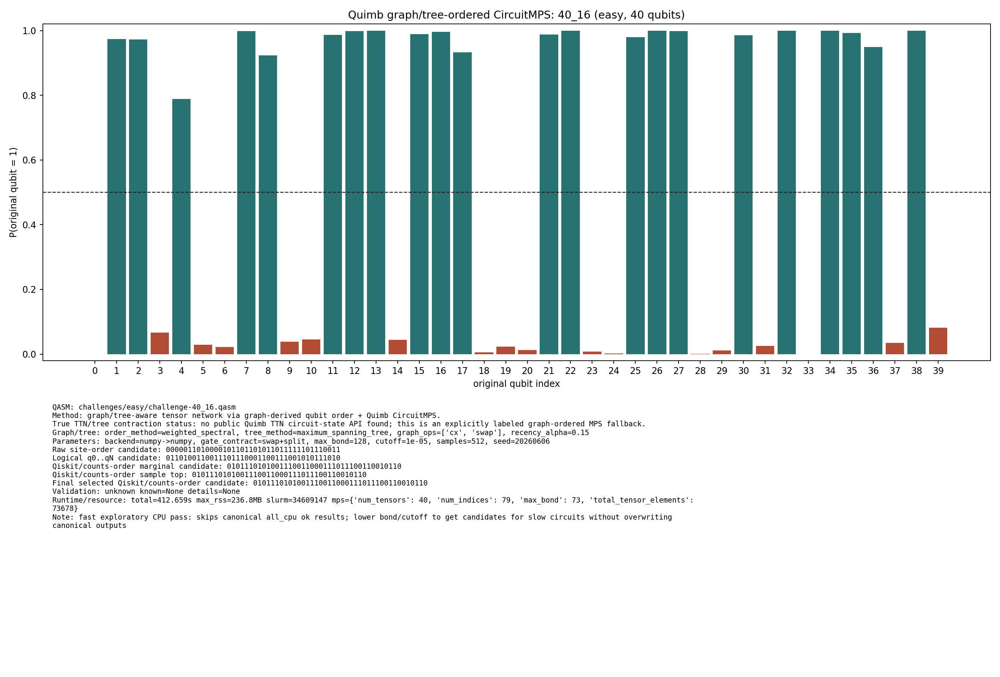

# Challenge 40_16

- Difficulty: easy
- Qubits: 40
- QASM: `challenges/easy/challenge-40_16.qasm`
- Selected answer: `0101110101001110011000111011100110010110`
- Selected method: `quimb_gpu_all`
- Validation: `unknown`
- Evidence rows: 4
- Normalized index page: [40_16](../../results_index/by_challenge/40_16.md)

## Distribution Figures

### Quimb graph-ordered MPS: tree_tensor_sim/all/images/challenge-40_16.quimb_tree_graph_mps.png

### Quimb graph-ordered MPS: tree_tensor_sim/all_cpu/images/challenge-40_16.quimb_tree_graph_mps.png

### Quimb graph-ordered MPS: tree_tensor_sim/fast_cpu/images/challenge-40_16.quimb_tree_graph_mps.png

### peaked MPO/MPS marginal: challenge-40_16.peaked_mpo_mps.png

## Candidate Rows

| review | selected | method | rank_type | rank | bitstring | score | count | support | fraction | validation | status | source |
|---|---:|---|---|---:|---|---:|---:|---:|---:|---|---|---|
|  | 1 | aer_mps_pilot | aggregate_rank | 1 | `0101110101001110011000111011100110010110` | 0.471283255086072 |  | 6023 | 0.471283255086072 | stable_high_config | stable_high_config | `../quantum-junction-tree-tensor/agent_work/mps_distill/summaries/pilot_summary.json` |
|  | 0 | aer_mps_pilot | aggregate_rank | 2 | `0101110101001110011000111011100110000110` | 0.1298904538341158 |  | 1660 | 0.1298904538341158 | stable_high_config | stable_high_config | `../quantum-junction-tree-tensor/agent_work/mps_distill/summaries/pilot_summary.json` |
|  | 0 | aer_mps_pilot | aggregate_rank | 3 | `0101110101001110011000111011100010010110` | 0.030985915492957747 |  | 396 | 0.030985915492957747 | stable_high_config | stable_high_config | `../quantum-junction-tree-tensor/agent_work/mps_distill/summaries/pilot_summary.json` |
|  | 0 | aer_mps_pilot | aggregate_rank | 4 | `1101110101001110011000111011100110011110` | 0.030359937402190923 |  | 388 | 0.030359937402190923 | stable_high_config | stable_high_config | `../quantum-junction-tree-tensor/agent_work/mps_distill/summaries/pilot_summary.json` |
|  | 0 | aer_mps_pilot | aggregate_rank | 5 | `0101110101001110011000111111100110010110` | 0.022065727699530517 |  | 282 | 0.022065727699530517 | stable_high_config | stable_high_config | `../quantum-junction-tree-tensor/agent_work/mps_distill/summaries/pilot_summary.json` |
|  | 1 | aer_mps_pilot | collector_evidence | 4 | `0101110101001110011000111011100110010110` | 1.000 |  |  | 1.000 | stable_high_config | stable_high_config | `agent_work/mps_distill/summaries/pilot_candidates.tsv` |
|  | 1 | aer_mps_pilot | top1_vote_rank | 1 | `0101110101001110011000111011100110010110` | 1.0 |  | 6 | 1.0 | stable_high_config | stable_high_config | `../quantum-junction-tree-tensor/agent_work/mps_distill/summaries/pilot_summary.json` |
|  | 0 | aer_tree_mps_all | sample_top | 1 | `0100110101001110011000011011100110010110` | 0.010986328125 | 90 |  | 0.010986328125 |  | ok | `../quantum-junction-tree-tensor/outputs/tree_tensor_sim/all/json/challenge-40_16.tree_tensor_mps.json` |
|  | 0 | aer_tree_mps_all | sample_top | 1 | `0100110101001110011000011011100110010110` | 0.0111083984375 | 91 |  | 0.0111083984375 |  | ok | `../quantum-junction-tree-tensor/outputs/tree_tensor_sim/all/json/challenge-40_16.tree_tensor_mps.json` |
|  | 0 | aer_tree_mps_all | sample_top | 1 | `0100110101001110011000011011100110010110` | 0.0103759765625 | 85 |  | 0.0103759765625 |  | ok | `../quantum-junction-tree-tensor/outputs/tree_tensor_sim/all/json/challenge-40_16.tree_tensor_mps.json` |
|  | 0 | aer_tree_mps_all | sample_top | 1 | `0100110101001110011000011011100110010110` | 0.0111083984375 | 91 |  | 0.0111083984375 |  | ok | `../quantum-junction-tree-tensor/outputs/tree_tensor_sim/all/json/challenge-40_16.tree_tensor_mps.json` |
|  | 0 | aer_tree_mps_all | sample_top | 1 | `0100110101001110011000011011100110010110` | 0.0107421875 | 88 |  | 0.0107421875 |  | ok | `../quantum-junction-tree-tensor/outputs/tree_tensor_sim/all/json/challenge-40_16.tree_tensor_mps.json` |
|  | 0 | aer_tree_mps_all | sample_top | 1 | `0100110101001110011000011011100110010110` | 0.0098876953125 | 81 |  | 0.0098876953125 |  | ok | `../quantum-junction-tree-tensor/outputs/tree_tensor_sim/all/json/challenge-40_16.tree_tensor_mps.json` |
|  | 0 | aer_tree_mps_all | sample_top | 2 | `0100110101001110011000111011100110000110` | 0.0146484375 | 120 |  | 0.0146484375 |  | ok | `../quantum-junction-tree-tensor/outputs/tree_tensor_sim/all/json/challenge-40_16.tree_tensor_mps.json` |
|  | 0 | aer_tree_mps_all | sample_top | 2 | `0100110101001110011000111011100110000110` | 0.0108642578125 | 89 |  | 0.0108642578125 |  | ok | `../quantum-junction-tree-tensor/outputs/tree_tensor_sim/all/json/challenge-40_16.tree_tensor_mps.json` |
|  | 0 | aer_tree_mps_all | sample_top | 2 | `0100110101001110011000111011100110000110` | 0.011962890625 | 98 |  | 0.011962890625 |  | ok | `../quantum-junction-tree-tensor/outputs/tree_tensor_sim/all/json/challenge-40_16.tree_tensor_mps.json` |
|  | 0 | aer_tree_mps_all | sample_top | 2 | `0100110101001110011000111011100110000110` | 0.01318359375 | 108 |  | 0.01318359375 |  | ok | `../quantum-junction-tree-tensor/outputs/tree_tensor_sim/all/json/challenge-40_16.tree_tensor_mps.json` |
|  | 0 | aer_tree_mps_all | sample_top | 2 | `0100110101001110011000111011100110000110` | 0.010986328125 | 90 |  | 0.010986328125 |  | ok | `../quantum-junction-tree-tensor/outputs/tree_tensor_sim/all/json/challenge-40_16.tree_tensor_mps.json` |
|  | 0 | aer_tree_mps_all | sample_top | 2 | `0100110101001110011000111011100110000110` | 0.0103759765625 | 85 |  | 0.0103759765625 |  | ok | `../quantum-junction-tree-tensor/outputs/tree_tensor_sim/all/json/challenge-40_16.tree_tensor_mps.json` |
|  | 0 | aer_tree_mps_all | sample_top | 3 | `0101010101001100011000111011100110000110` | 0.0130615234375 | 107 |  | 0.0130615234375 |  | ok | `../quantum-junction-tree-tensor/outputs/tree_tensor_sim/all/json/challenge-40_16.tree_tensor_mps.json` |
|  | 0 | aer_tree_mps_all | sample_top | 3 | `0101110101001110010000111011100110010110` | 0.0067138671875 | 55 |  | 0.0067138671875 |  | ok | `../quantum-junction-tree-tensor/outputs/tree_tensor_sim/all/json/challenge-40_16.tree_tensor_mps.json` |
|  | 0 | aer_tree_mps_all | sample_top | 3 | `0101110101001110010000111011100110010110` | 0.0052490234375 | 43 |  | 0.0052490234375 |  | ok | `../quantum-junction-tree-tensor/outputs/tree_tensor_sim/all/json/challenge-40_16.tree_tensor_mps.json` |
|  | 0 | aer_tree_mps_all | sample_top | 3 | `0101110101001110010000111011100110010110` | 0.0062255859375 | 51 |  | 0.0062255859375 |  | ok | `../quantum-junction-tree-tensor/outputs/tree_tensor_sim/all/json/challenge-40_16.tree_tensor_mps.json` |
|  | 0 | aer_tree_mps_all | sample_top | 3 | `0101110101001110010000111011100110010110` | 0.0228271484375 | 187 |  | 0.0228271484375 |  | ok | `../quantum-junction-tree-tensor/outputs/tree_tensor_sim/all/json/challenge-40_16.tree_tensor_mps.json` |
|  | 0 | aer_tree_mps_all | sample_top | 3 | `0101110101001110010000111011100110010110` | 0.0079345703125 | 65 |  | 0.0079345703125 |  | ok | `../quantum-junction-tree-tensor/outputs/tree_tensor_sim/all/json/challenge-40_16.tree_tensor_mps.json` |
|  | 0 | aer_tree_mps_all | sample_top | 4 | `0101010101001100011000111011100110010110` | 0.0084228515625 | 69 |  | 0.0084228515625 |  | ok | `../quantum-junction-tree-tensor/outputs/tree_tensor_sim/all/json/challenge-40_16.tree_tensor_mps.json` |
|  | 0 | aer_tree_mps_all | sample_top | 4 | `0101110101001110011000011011100110000110` | 0.009033203125 | 74 |  | 0.009033203125 |  | ok | `../quantum-junction-tree-tensor/outputs/tree_tensor_sim/all/json/challenge-40_16.tree_tensor_mps.json` |
|  | 0 | aer_tree_mps_all | sample_top | 4 | `0101110101001110011000011011100110000110` | 0.00634765625 | 52 |  | 0.00634765625 |  | ok | `../quantum-junction-tree-tensor/outputs/tree_tensor_sim/all/json/challenge-40_16.tree_tensor_mps.json` |
|  | 0 | aer_tree_mps_all | sample_top | 4 | `0101110101001110011000011011100110000110` | 0.0098876953125 | 81 |  | 0.0098876953125 |  | ok | `../quantum-junction-tree-tensor/outputs/tree_tensor_sim/all/json/challenge-40_16.tree_tensor_mps.json` |
|  | 0 | aer_tree_mps_all | sample_top | 4 | `0101110101001110011000011011100110000110` | 0.0062255859375 | 51 |  | 0.0062255859375 |  | ok | `../quantum-junction-tree-tensor/outputs/tree_tensor_sim/all/json/challenge-40_16.tree_tensor_mps.json` |
|  | 0 | aer_tree_mps_all | sample_top | 4 | `0101110101001110011000011011100110000110` | 0.0074462890625 | 61 |  | 0.0074462890625 |  | ok | `../quantum-junction-tree-tensor/outputs/tree_tensor_sim/all/json/challenge-40_16.tree_tensor_mps.json` |
|  | 0 | aer_tree_mps_all | sample_top | 5 | `0101110101001110010000111011100110010110` | 0.0042724609375 | 35 |  | 0.0042724609375 |  | ok | `../quantum-junction-tree-tensor/outputs/tree_tensor_sim/all/json/challenge-40_16.tree_tensor_mps.json` |
|  | 0 | aer_tree_mps_all | sample_top | 5 | `0101110101001110011000011011100110010110` | 0.0123291015625 | 101 |  | 0.0123291015625 |  | ok | `../quantum-junction-tree-tensor/outputs/tree_tensor_sim/all/json/challenge-40_16.tree_tensor_mps.json` |
|  | 0 | aer_tree_mps_all | sample_top | 5 | `0101110101001110011000011011100110010110` | 0.012451171875 | 102 |  | 0.012451171875 |  | ok | `../quantum-junction-tree-tensor/outputs/tree_tensor_sim/all/json/challenge-40_16.tree_tensor_mps.json` |
|  | 0 | aer_tree_mps_all | sample_top | 5 | `0101110101001110011000011011100110010110` | 0.0123291015625 | 101 |  | 0.0123291015625 |  | ok | `../quantum-junction-tree-tensor/outputs/tree_tensor_sim/all/json/challenge-40_16.tree_tensor_mps.json` |
|  | 0 | aer_tree_mps_all | sample_top | 5 | `0101110101001110011000011011100110010110` | 0.012939453125 | 106 |  | 0.012939453125 |  | ok | `../quantum-junction-tree-tensor/outputs/tree_tensor_sim/all/json/challenge-40_16.tree_tensor_mps.json` |
|  | 0 | aer_tree_mps_all | sample_top | 5 | `0101110101001110011000011011100110010110` | 0.012451171875 | 102 |  | 0.012451171875 |  | ok | `../quantum-junction-tree-tensor/outputs/tree_tensor_sim/all/json/challenge-40_16.tree_tensor_mps.json` |
|  | 0 | aer_tree_mps_all | sample_top | 6 | `0101110101001110011000011011100110000110` | 0.0069580078125 | 57 |  | 0.0069580078125 |  | ok | `../quantum-junction-tree-tensor/outputs/tree_tensor_sim/all/json/challenge-40_16.tree_tensor_mps.json` |
|  | 0 | aer_tree_mps_all | sample_top | 6 | `0101110101001110011000111011010010010110` | 0.0052490234375 | 43 |  | 0.0052490234375 |  | ok | `../quantum-junction-tree-tensor/outputs/tree_tensor_sim/all/json/challenge-40_16.tree_tensor_mps.json` |
|  | 0 | aer_tree_mps_all | sample_top | 6 | `0101110101001110011000111011010010010110` | 0.0048828125 | 40 |  | 0.0048828125 |  | ok | `../quantum-junction-tree-tensor/outputs/tree_tensor_sim/all/json/challenge-40_16.tree_tensor_mps.json` |
|  | 0 | aer_tree_mps_all | sample_top | 6 | `0101110101001110011000111011010010010110` | 0.0048828125 | 40 |  | 0.0048828125 |  | ok | `../quantum-junction-tree-tensor/outputs/tree_tensor_sim/all/json/challenge-40_16.tree_tensor_mps.json` |
|  | 0 | aer_tree_mps_all | sample_top | 6 | `0101110101001110011000111011010010010110` | 0.005126953125 | 42 |  | 0.005126953125 |  | ok | `../quantum-junction-tree-tensor/outputs/tree_tensor_sim/all/json/challenge-40_16.tree_tensor_mps.json` |
|  | 0 | aer_tree_mps_all | sample_top | 6 | `0101110101001110011000111011100010010110` | 0.0328369140625 | 269 |  | 0.0328369140625 |  | ok | `../quantum-junction-tree-tensor/outputs/tree_tensor_sim/all/json/challenge-40_16.tree_tensor_mps.json` |
|  | 0 | aer_tree_mps_all | sample_top | 7 | `0101110101001110011000011011100110010110` | 0.0128173828125 | 105 |  | 0.0128173828125 |  | ok | `../quantum-junction-tree-tensor/outputs/tree_tensor_sim/all/json/challenge-40_16.tree_tensor_mps.json` |
|  | 0 | aer_tree_mps_all | sample_top | 7 | `0101110101001110011000111011100010000110` | 0.0079345703125 | 65 |  | 0.0079345703125 |  | ok | `../quantum-junction-tree-tensor/outputs/tree_tensor_sim/all/json/challenge-40_16.tree_tensor_mps.json` |
|  | 0 | aer_tree_mps_all | sample_top | 7 | `0101110101001110011000111011100010000110` | 0.00732421875 | 60 |  | 0.00732421875 |  | ok | `../quantum-junction-tree-tensor/outputs/tree_tensor_sim/all/json/challenge-40_16.tree_tensor_mps.json` |
|  | 0 | aer_tree_mps_all | sample_top | 7 | `0101110101001110011000111011100010000110` | 0.0059814453125 | 49 |  | 0.0059814453125 |  | ok | `../quantum-junction-tree-tensor/outputs/tree_tensor_sim/all/json/challenge-40_16.tree_tensor_mps.json` |
|  | 0 | aer_tree_mps_all | sample_top | 7 | `0101110101001110011000111011100010000110` | 0.0059814453125 | 49 |  | 0.0059814453125 |  | ok | `../quantum-junction-tree-tensor/outputs/tree_tensor_sim/all/json/challenge-40_16.tree_tensor_mps.json` |
|  | 0 | aer_tree_mps_all | sample_top | 7 | `0101110101001110011000111011100100010110` | 0.00439453125 | 36 |  | 0.00439453125 |  | ok | `../quantum-junction-tree-tensor/outputs/tree_tensor_sim/all/json/challenge-40_16.tree_tensor_mps.json` |
|  | 0 | aer_tree_mps_all | sample_top | 8 | `0101110101001110011000111011100010010110` | 0.03125 | 256 |  | 0.03125 |  | ok | `../quantum-junction-tree-tensor/outputs/tree_tensor_sim/all/json/challenge-40_16.tree_tensor_mps.json` |
|  | 0 | aer_tree_mps_all | sample_top | 8 | `0101110101001110011000111011100010010110` | 0.027099609375 | 222 |  | 0.027099609375 |  | ok | `../quantum-junction-tree-tensor/outputs/tree_tensor_sim/all/json/challenge-40_16.tree_tensor_mps.json` |
|  | 0 | aer_tree_mps_all | sample_top | 8 | `0101110101001110011000111011100010010110` | 0.0321044921875 | 263 |  | 0.0321044921875 |  | ok | `../quantum-junction-tree-tensor/outputs/tree_tensor_sim/all/json/challenge-40_16.tree_tensor_mps.json` |
|  | 0 | aer_tree_mps_all | sample_top | 8 | `0101110101001110011000111011100010010110` | 0.0318603515625 | 261 |  | 0.0318603515625 |  | ok | `../quantum-junction-tree-tensor/outputs/tree_tensor_sim/all/json/challenge-40_16.tree_tensor_mps.json` |
|  | 0 | aer_tree_mps_all | sample_top | 8 | `0101110101001110011000111011100010010110` | 0.0308837890625 | 253 |  | 0.0308837890625 |  | ok | `../quantum-junction-tree-tensor/outputs/tree_tensor_sim/all/json/challenge-40_16.tree_tensor_mps.json` |
|  | 0 | aer_tree_mps_all | sample_top | 8 | `0101110101001110011000111011100110000110` | 0.036865234375 | 302 |  | 0.036865234375 |  | ok | `../quantum-junction-tree-tensor/outputs/tree_tensor_sim/all/json/challenge-40_16.tree_tensor_mps.json` |
|  | 0 | aer_tree_mps_all | sample_top | 9 | `0101110101001110011000111011100110000110` | 0.116455078125 | 954 |  | 0.116455078125 |  | ok | `../quantum-junction-tree-tensor/outputs/tree_tensor_sim/all/json/challenge-40_16.tree_tensor_mps.json` |
|  | 0 | aer_tree_mps_all | sample_top | 9 | `0101110101001110011000111011100110000110` | 0.1064453125 | 872 |  | 0.1064453125 |  | ok | `../quantum-junction-tree-tensor/outputs/tree_tensor_sim/all/json/challenge-40_16.tree_tensor_mps.json` |
|  | 0 | aer_tree_mps_all | sample_top | 9 | `0101110101001110011000111011100110000110` | 0.052734375 | 432 |  | 0.052734375 |  | ok | `../quantum-junction-tree-tensor/outputs/tree_tensor_sim/all/json/challenge-40_16.tree_tensor_mps.json` |
|  | 0 | aer_tree_mps_all | sample_top | 9 | `0101110101001110011000111011100110000110` | 0.1044921875 | 856 |  | 0.1044921875 |  | ok | `../quantum-junction-tree-tensor/outputs/tree_tensor_sim/all/json/challenge-40_16.tree_tensor_mps.json` |
|  | 0 | aer_tree_mps_all | sample_top | 9 | `0101110101001110011000111011100110000110` | 0.10302734375 | 844 |  | 0.10302734375 |  | ok | `../quantum-junction-tree-tensor/outputs/tree_tensor_sim/all/json/challenge-40_16.tree_tensor_mps.json` |
|  | 0 | aer_tree_mps_all | sample_top | 9 | `0101110101001110011000111011100110010100` | 0.0272216796875 | 223 |  | 0.0272216796875 |  | ok | `../quantum-junction-tree-tensor/outputs/tree_tensor_sim/all/json/challenge-40_16.tree_tensor_mps.json` |
|  | 0 | aer_tree_mps_all | sample_top | 10 | `0101110101001110011000111011100110010100` | 0.0140380859375 | 115 |  | 0.0140380859375 |  | ok | `../quantum-junction-tree-tensor/outputs/tree_tensor_sim/all/json/challenge-40_16.tree_tensor_mps.json` |
|  | 0 | aer_tree_mps_all | sample_top | 10 | `0101110101001110011000111011100110010100` | 0.0115966796875 | 95 |  | 0.0115966796875 |  | ok | `../quantum-junction-tree-tensor/outputs/tree_tensor_sim/all/json/challenge-40_16.tree_tensor_mps.json` |
|  | 0 | aer_tree_mps_all | sample_top | 10 | `0101110101001110011000111011100110010100` | 0.0166015625 | 136 |  | 0.0166015625 |  | ok | `../quantum-junction-tree-tensor/outputs/tree_tensor_sim/all/json/challenge-40_16.tree_tensor_mps.json` |
|  | 0 | aer_tree_mps_all | sample_top | 10 | `0101110101001110011000111011100110010100` | 0.0152587890625 | 125 |  | 0.0152587890625 |  | ok | `../quantum-junction-tree-tensor/outputs/tree_tensor_sim/all/json/challenge-40_16.tree_tensor_mps.json` |
|  | 0 | aer_tree_mps_all | sample_top | 10 | `0101110101001110011000111011100110010100` | 0.012451171875 | 102 |  | 0.012451171875 |  | ok | `../quantum-junction-tree-tensor/outputs/tree_tensor_sim/all/json/challenge-40_16.tree_tensor_mps.json` |
|  | 1 | aer_tree_mps_all | sample_top | 10 | `0101110101001110011000111011100110010110` | 0.486572265625 | 3986 |  | 0.486572265625 |  | ok | `../quantum-junction-tree-tensor/outputs/tree_tensor_sim/all/json/challenge-40_16.tree_tensor_mps.json` |
|  | 1 | aer_tree_mps_all | sample_top | 11 | `0101110101001110011000111011100110010110` | 0.4910888671875 | 4023 |  | 0.4910888671875 |  | ok | `../quantum-junction-tree-tensor/outputs/tree_tensor_sim/all/json/challenge-40_16.tree_tensor_mps.json` |
|  | 1 | aer_tree_mps_all | sample_top | 11 | `0101110101001110011000111011100110010110` | 0.46142578125 | 3780 |  | 0.46142578125 |  | ok | `../quantum-junction-tree-tensor/outputs/tree_tensor_sim/all/json/challenge-40_16.tree_tensor_mps.json` |
|  | 1 | aer_tree_mps_all | sample_top | 11 | `0101110101001110011000111011100110010110` | 0.479248046875 | 3926 |  | 0.479248046875 |  | ok | `../quantum-junction-tree-tensor/outputs/tree_tensor_sim/all/json/challenge-40_16.tree_tensor_mps.json` |
|  | 1 | aer_tree_mps_all | sample_top | 11 | `0101110101001110011000111011100110010110` | 0.490966796875 | 4022 |  | 0.490966796875 |  | ok | `../quantum-junction-tree-tensor/outputs/tree_tensor_sim/all/json/challenge-40_16.tree_tensor_mps.json` |
|  | 1 | aer_tree_mps_all | sample_top | 11 | `0101110101001110011000111011100110010110` | 0.4822998046875 | 3951 |  | 0.4822998046875 |  | ok | `../quantum-junction-tree-tensor/outputs/tree_tensor_sim/all/json/challenge-40_16.tree_tensor_mps.json` |
|  | 0 | aer_tree_mps_all | sample_top | 11 | `0101110101001110011000111011101110010010` | 0.013916015625 | 114 |  | 0.013916015625 |  | ok | `../quantum-junction-tree-tensor/outputs/tree_tensor_sim/all/json/challenge-40_16.tree_tensor_mps.json` |
|  | 0 | aer_tree_mps_all | sample_top | 12 | `0101110101001110011000111011100110110110` | 0.0062255859375 | 51 |  | 0.0062255859375 |  | ok | `../quantum-junction-tree-tensor/outputs/tree_tensor_sim/all/json/challenge-40_16.tree_tensor_mps.json` |
|  | 0 | aer_tree_mps_all | sample_top | 12 | `0101110101001110011000111011101110010010` | 0.0069580078125 | 57 |  | 0.0069580078125 |  | ok | `../quantum-junction-tree-tensor/outputs/tree_tensor_sim/all/json/challenge-40_16.tree_tensor_mps.json` |
|  | 0 | aer_tree_mps_all | sample_top | 12 | `0101110101001110011000111011101110010010` | 0.012939453125 | 106 |  | 0.012939453125 |  | ok | `../quantum-junction-tree-tensor/outputs/tree_tensor_sim/all/json/challenge-40_16.tree_tensor_mps.json` |
|  | 0 | aer_tree_mps_all | sample_top | 12 | `0101110101001110011000111011101110010010` | 0.0128173828125 | 105 |  | 0.0128173828125 |  | ok | `../quantum-junction-tree-tensor/outputs/tree_tensor_sim/all/json/challenge-40_16.tree_tensor_mps.json` |
|  | 0 | aer_tree_mps_all | sample_top | 12 | `0101110101001110011000111011101110010010` | 0.0179443359375 | 147 |  | 0.0179443359375 |  | ok | `../quantum-junction-tree-tensor/outputs/tree_tensor_sim/all/json/challenge-40_16.tree_tensor_mps.json` |
|  | 0 | aer_tree_mps_all | sample_top | 12 | `0101110101001110011000111011110110010110` | 0.011474609375 | 94 |  | 0.011474609375 |  | ok | `../quantum-junction-tree-tensor/outputs/tree_tensor_sim/all/json/challenge-40_16.tree_tensor_mps.json` |
|  | 0 | aer_tree_mps_all | sample_top | 13 | `0101110101001110011000111011101110010110` | 0.006103515625 | 50 |  | 0.006103515625 |  | ok | `../quantum-junction-tree-tensor/outputs/tree_tensor_sim/all/json/challenge-40_16.tree_tensor_mps.json` |
|  | 0 | aer_tree_mps_all | sample_top | 13 | `0101110101001110011000111011110010010110` | 0.006103515625 | 50 |  | 0.006103515625 |  | ok | `../quantum-junction-tree-tensor/outputs/tree_tensor_sim/all/json/challenge-40_16.tree_tensor_mps.json` |
|  | 0 | aer_tree_mps_all | sample_top | 13 | `0101110101001110011000111011110010010110` | 0.00927734375 | 76 |  | 0.00927734375 |  | ok | `../quantum-junction-tree-tensor/outputs/tree_tensor_sim/all/json/challenge-40_16.tree_tensor_mps.json` |
|  | 0 | aer_tree_mps_all | sample_top | 13 | `0101110101001110011000111011110010010110` | 0.0054931640625 | 45 |  | 0.0054931640625 |  | ok | `../quantum-junction-tree-tensor/outputs/tree_tensor_sim/all/json/challenge-40_16.tree_tensor_mps.json` |
|  | 0 | aer_tree_mps_all | sample_top | 13 | `0101110101001110011000111011110010010110` | 0.0062255859375 | 51 |  | 0.0062255859375 |  | ok | `../quantum-junction-tree-tensor/outputs/tree_tensor_sim/all/json/challenge-40_16.tree_tensor_mps.json` |
|  | 0 | aer_tree_mps_all | sample_top | 13 | `0101110101001110011000111111100110010110` | 0.0250244140625 | 205 |  | 0.0250244140625 |  | ok | `../quantum-junction-tree-tensor/outputs/tree_tensor_sim/all/json/challenge-40_16.tree_tensor_mps.json` |
|  | 0 | aer_tree_mps_all | sample_top | 14 | `0101110101001110011000111011110110010110` | 0.00830078125 | 68 |  | 0.00830078125 |  | ok | `../quantum-junction-tree-tensor/outputs/tree_tensor_sim/all/json/challenge-40_16.tree_tensor_mps.json` |
|  | 0 | aer_tree_mps_all | sample_top | 14 | `0101110101001110011000111011110110010110` | 0.0067138671875 | 55 |  | 0.0067138671875 |  | ok | `../quantum-junction-tree-tensor/outputs/tree_tensor_sim/all/json/challenge-40_16.tree_tensor_mps.json` |
|  | 0 | aer_tree_mps_all | sample_top | 14 | `0101110101001110011000111011110110010110` | 0.00830078125 | 68 |  | 0.00830078125 |  | ok | `../quantum-junction-tree-tensor/outputs/tree_tensor_sim/all/json/challenge-40_16.tree_tensor_mps.json` |
|  | 0 | aer_tree_mps_all | sample_top | 14 | `0101110101001110011000111011110110010110` | 0.0087890625 | 72 |  | 0.0087890625 |  | ok | `../quantum-junction-tree-tensor/outputs/tree_tensor_sim/all/json/challenge-40_16.tree_tensor_mps.json` |
|  | 0 | aer_tree_mps_all | sample_top | 14 | `0101110101001110011000111011110110010110` | 0.008544921875 | 70 |  | 0.008544921875 |  | ok | `../quantum-junction-tree-tensor/outputs/tree_tensor_sim/all/json/challenge-40_16.tree_tensor_mps.json` |
|  | 0 | aer_tree_mps_all | sample_top | 14 | `0101110101001110011100101011100110010110` | 0.0050048828125 | 41 |  | 0.0050048828125 |  | ok | `../quantum-junction-tree-tensor/outputs/tree_tensor_sim/all/json/challenge-40_16.tree_tensor_mps.json` |
|  | 0 | aer_tree_mps_all | sample_top | 15 | `0101110101001110011000111111100110010110` | 0.0159912109375 | 131 |  | 0.0159912109375 |  | ok | `../quantum-junction-tree-tensor/outputs/tree_tensor_sim/all/json/challenge-40_16.tree_tensor_mps.json` |
|  | 0 | aer_tree_mps_all | sample_top | 15 | `0101110101001110011000111111100110010110` | 0.0198974609375 | 163 |  | 0.0198974609375 |  | ok | `../quantum-junction-tree-tensor/outputs/tree_tensor_sim/all/json/challenge-40_16.tree_tensor_mps.json` |
|  | 0 | aer_tree_mps_all | sample_top | 15 | `0101110101001110011000111111100110010110` | 0.0240478515625 | 197 |  | 0.0240478515625 |  | ok | `../quantum-junction-tree-tensor/outputs/tree_tensor_sim/all/json/challenge-40_16.tree_tensor_mps.json` |
|  | 0 | aer_tree_mps_all | sample_top | 15 | `0101110101001110011000111111100110010110` | 0.0172119140625 | 141 |  | 0.0172119140625 |  | ok | `../quantum-junction-tree-tensor/outputs/tree_tensor_sim/all/json/challenge-40_16.tree_tensor_mps.json` |
|  | 0 | aer_tree_mps_all | sample_top | 15 | `0101110101001110011000111111100110010110` | 0.0177001953125 | 145 |  | 0.0177001953125 |  | ok | `../quantum-junction-tree-tensor/outputs/tree_tensor_sim/all/json/challenge-40_16.tree_tensor_mps.json` |
|  | 0 | aer_tree_mps_all | sample_top | 15 | `0101110101001110111000111011100110010110` | 0.0045166015625 | 37 |  | 0.0045166015625 |  | ok | `../quantum-junction-tree-tensor/outputs/tree_tensor_sim/all/json/challenge-40_16.tree_tensor_mps.json` |
|  | 0 | aer_tree_mps_all | sample_top | 16 | `0101110101001110111000111011100110000110` | 0.005615234375 | 46 |  | 0.005615234375 |  | ok | `../quantum-junction-tree-tensor/outputs/tree_tensor_sim/all/json/challenge-40_16.tree_tensor_mps.json` |
|  | 0 | aer_tree_mps_all | sample_top | 16 | `0101110101001110111000111011100110010110` | 0.004638671875 | 38 |  | 0.004638671875 |  | ok | `../quantum-junction-tree-tensor/outputs/tree_tensor_sim/all/json/challenge-40_16.tree_tensor_mps.json` |
|  | 0 | aer_tree_mps_all | sample_top | 16 | `0101110111001110011000111011100110010110` | 0.013671875 | 112 |  | 0.013671875 |  | ok | `../quantum-junction-tree-tensor/outputs/tree_tensor_sim/all/json/challenge-40_16.tree_tensor_mps.json` |
|  | 0 | aer_tree_mps_all | sample_top | 16 | `0101110111001110011000111011100110010110` | 0.0130615234375 | 107 |  | 0.0130615234375 |  | ok | `../quantum-junction-tree-tensor/outputs/tree_tensor_sim/all/json/challenge-40_16.tree_tensor_mps.json` |
|  | 0 | aer_tree_mps_all | sample_top | 16 | `0101110111001110011000111011100110010110` | 0.0177001953125 | 145 |  | 0.0177001953125 |  | ok | `../quantum-junction-tree-tensor/outputs/tree_tensor_sim/all/json/challenge-40_16.tree_tensor_mps.json` |
|  | 0 | aer_tree_mps_all | sample_top | 16 | `0101110111001110011000111011100110010110` | 0.011962890625 | 98 |  | 0.011962890625 |  | ok | `../quantum-junction-tree-tensor/outputs/tree_tensor_sim/all/json/challenge-40_16.tree_tensor_mps.json` |
|  | 0 | aer_tree_mps_all | sample_top | 17 | `0101110111001110011000111011100110010110` | 0.0150146484375 | 123 |  | 0.0150146484375 |  | ok | `../quantum-junction-tree-tensor/outputs/tree_tensor_sim/all/json/challenge-40_16.tree_tensor_mps.json` |
|  | 0 | aer_tree_mps_all | sample_top | 17 | `0101110111001110011000111011100110010110` | 0.021240234375 | 174 |  | 0.021240234375 |  | ok | `../quantum-junction-tree-tensor/outputs/tree_tensor_sim/all/json/challenge-40_16.tree_tensor_mps.json` |
|  | 0 | aer_tree_mps_all | sample_top | 17 | `0110110101001110011000111011100110000110` | 0.005126953125 | 42 |  | 0.005126953125 |  | ok | `../quantum-junction-tree-tensor/outputs/tree_tensor_sim/all/json/challenge-40_16.tree_tensor_mps.json` |
|  | 0 | aer_tree_mps_all | sample_top | 17 | `0111110101001110011000011011100110010110` | 0.00634765625 | 52 |  | 0.00634765625 |  | ok | `../quantum-junction-tree-tensor/outputs/tree_tensor_sim/all/json/challenge-40_16.tree_tensor_mps.json` |
|  | 0 | aer_tree_mps_all | sample_top | 17 | `0111110101001110011000011011100110010110` | 0.0050048828125 | 41 |  | 0.0050048828125 |  | ok | `../quantum-junction-tree-tensor/outputs/tree_tensor_sim/all/json/challenge-40_16.tree_tensor_mps.json` |
|  | 0 | aer_tree_mps_all | sample_top | 17 | `0111110101001110011000011011100110010110` | 0.00537109375 | 44 |  | 0.00537109375 |  | ok | `../quantum-junction-tree-tensor/outputs/tree_tensor_sim/all/json/challenge-40_16.tree_tensor_mps.json` |
|  | 0 | aer_tree_mps_all | sample_top | 18 | `0110110101001110011000011011100110010110` | 0.0052490234375 | 43 |  | 0.0052490234375 |  | ok | `../quantum-junction-tree-tensor/outputs/tree_tensor_sim/all/json/challenge-40_16.tree_tensor_mps.json` |
|  | 0 | aer_tree_mps_all | sample_top | 18 | `0111110101001110011000011011100110010110` | 0.005615234375 | 46 |  | 0.005615234375 |  | ok | `../quantum-junction-tree-tensor/outputs/tree_tensor_sim/all/json/challenge-40_16.tree_tensor_mps.json` |
|  | 0 | aer_tree_mps_all | sample_top | 18 | `1101110101001110011000111011100110001110` | 0.008056640625 | 66 |  | 0.008056640625 |  | ok | `../quantum-junction-tree-tensor/outputs/tree_tensor_sim/all/json/challenge-40_16.tree_tensor_mps.json` |
|  | 0 | aer_tree_mps_all | sample_top | 18 | `1101110101001110011000111011100110001110` | 0.005615234375 | 46 |  | 0.005615234375 |  | ok | `../quantum-junction-tree-tensor/outputs/tree_tensor_sim/all/json/challenge-40_16.tree_tensor_mps.json` |
|  | 0 | aer_tree_mps_all | sample_top | 18 | `1101110101001110011000111011100110001110` | 0.0072021484375 | 59 |  | 0.0072021484375 |  | ok | `../quantum-junction-tree-tensor/outputs/tree_tensor_sim/all/json/challenge-40_16.tree_tensor_mps.json` |
|  | 0 | aer_tree_mps_all | sample_top | 18 | `1101110101001110011000111011100110001110` | 0.0068359375 | 56 |  | 0.0068359375 |  | ok | `../quantum-junction-tree-tensor/outputs/tree_tensor_sim/all/json/challenge-40_16.tree_tensor_mps.json` |
|  | 0 | aer_tree_mps_all | sample_top | 19 | `1101110101001110011000111011100110011110` | 0.02734375 | 224 |  | 0.02734375 |  | ok | `../quantum-junction-tree-tensor/outputs/tree_tensor_sim/all/json/challenge-40_16.tree_tensor_mps.json` |
|  | 0 | aer_tree_mps_all | sample_top | 19 | `1101110101001110011000111011100110011110` | 0.0303955078125 | 249 |  | 0.0303955078125 |  | ok | `../quantum-junction-tree-tensor/outputs/tree_tensor_sim/all/json/challenge-40_16.tree_tensor_mps.json` |
|  | 0 | aer_tree_mps_all | sample_top | 19 | `1101110101001110011000111011100110011110` | 0.0269775390625 | 221 |  | 0.0269775390625 |  | ok | `../quantum-junction-tree-tensor/outputs/tree_tensor_sim/all/json/challenge-40_16.tree_tensor_mps.json` |
|  | 0 | aer_tree_mps_all | sample_top | 19 | `1101110101001110011000111011100110011110` | 0.0323486328125 | 265 |  | 0.0323486328125 |  | ok | `../quantum-junction-tree-tensor/outputs/tree_tensor_sim/all/json/challenge-40_16.tree_tensor_mps.json` |
|  | 0 | aer_tree_mps_all | sample_top | 19 | `1101110101001110011000111011100110011110` | 0.030517578125 | 250 |  | 0.030517578125 |  | ok | `../quantum-junction-tree-tensor/outputs/tree_tensor_sim/all/json/challenge-40_16.tree_tensor_mps.json` |
|  | 0 | aer_tree_mps_all | sample_top | 19 | `1101110101001110011000111011100110011110` | 0.0313720703125 | 257 |  | 0.0313720703125 |  | ok | `../quantum-junction-tree-tensor/outputs/tree_tensor_sim/all/json/challenge-40_16.tree_tensor_mps.json` |
|  | 0 | aer_tree_mps_all | sample_top | 20 | `1101110101001110011000111011100111010110` | 0.0064697265625 | 53 |  | 0.0064697265625 |  | ok | `../quantum-junction-tree-tensor/outputs/tree_tensor_sim/all/json/challenge-40_16.tree_tensor_mps.json` |
|  | 0 | aer_tree_mps_all | sample_top | 20 | `1101110101001110011000111011100111010110` | 0.006591796875 | 54 |  | 0.006591796875 |  | ok | `../quantum-junction-tree-tensor/outputs/tree_tensor_sim/all/json/challenge-40_16.tree_tensor_mps.json` |
|  | 0 | aer_tree_mps_all | sample_top | 20 | `1101110101001110011000111011100111010110` | 0.00537109375 | 44 |  | 0.00537109375 |  | ok | `../quantum-junction-tree-tensor/outputs/tree_tensor_sim/all/json/challenge-40_16.tree_tensor_mps.json` |
|  | 0 | aer_tree_mps_all | sample_top | 20 | `1101110101001110011000111011100111010110` | 0.0048828125 | 40 |  | 0.0048828125 |  | ok | `../quantum-junction-tree-tensor/outputs/tree_tensor_sim/all/json/challenge-40_16.tree_tensor_mps.json` |
|  | 0 | aer_tree_mps_all | sample_top | 20 | `1101110101001110011000111011100111010110` | 0.0052490234375 | 43 |  | 0.0052490234375 |  | ok | `../quantum-junction-tree-tensor/outputs/tree_tensor_sim/all/json/challenge-40_16.tree_tensor_mps.json` |
|  | 0 | aer_tree_mps_all | sample_top | 20 | `1101110101001110011000111011100111010110` | 0.0067138671875 | 55 |  | 0.0067138671875 |  | ok | `../quantum-junction-tree-tensor/outputs/tree_tensor_sim/all/json/challenge-40_16.tree_tensor_mps.json` |
|  | 1 | collector_snapshot | collector_selected | 1 | `0101110101001110011000111011100110010110` | 0.4423828125 |  |  | 0.4423828125 | unknown | unknown | `research/tree_tensor_sim_session/artifacts/collector/CANDIDATES.tsv` |
|  | 0 | peaked_mpo_mps | marginal_candidate | 1 | `0101110101001110010000110011100110010100` | 2.9976021664879227e-15 |  |  |  |  | ok | `../quantum-junction-tree-tensor/outputs/peaked_circuit_sim_all/json/challenge-40_16.peaked_mpo_mps.json` |
|  | 1 | quimb_cpu_all | collector_evidence | 2 | `0101110101001110011000111011100110010110` | 0.4423828125 |  |  | 0.4423828125 | unknown | unknown | `outputs/tree_tensor_sim/all_cpu/json/challenge-40_16.quimb_tree_graph_mps.json` |
|  | 1 | quimb_cpu_all | final_candidate | 1 | `0101110101001110011000111011100110010110` | 0.2820088226021915 |  |  |  | {"known_answer_qiskit_order":null,"status":"unknown"} | ok | `../quantum-junction-tree-tensor/outputs/tree_tensor_sim/all_cpu/json/challenge-40_16.quimb_tree_graph_mps.json` |
|  | 1 | quimb_cpu_all | marginal_candidate | 1 | `0101110101001110011000111011100110010110` | 0.2820088226021915 |  |  |  | {"known_answer_qiskit_order":null,"status":"unknown"} | ok | `../quantum-junction-tree-tensor/outputs/tree_tensor_sim/all_cpu/json/challenge-40_16.quimb_tree_graph_mps.json` |
|  | 1 | quimb_cpu_all | sample_top | 1 | `0101110101001110011000111011100110010110` | 0.4423828125 | 453 |  | 0.4423828125 | {"known_answer_qiskit_order":null,"status":"unknown"} | ok | `../quantum-junction-tree-tensor/outputs/tree_tensor_sim/all_cpu/json/challenge-40_16.quimb_tree_graph_mps.json` |
|  | 0 | quimb_cpu_all | sample_top | 2 | `0101110101001110011000111011100110000110` | 0.119140625 | 122 |  | 0.119140625 | {"known_answer_qiskit_order":null,"status":"unknown"} | ok | `../quantum-junction-tree-tensor/outputs/tree_tensor_sim/all_cpu/json/challenge-40_16.quimb_tree_graph_mps.json` |
|  | 0 | quimb_cpu_all | sample_top | 3 | `0101110101001110011000111011100010010110` | 0.0361328125 | 37 |  | 0.0361328125 | {"known_answer_qiskit_order":null,"status":"unknown"} | ok | `../quantum-junction-tree-tensor/outputs/tree_tensor_sim/all_cpu/json/challenge-40_16.quimb_tree_graph_mps.json` |
|  | 0 | quimb_cpu_all | sample_top | 4 | `1101110101001110011000111011100110011110` | 0.0302734375 | 31 |  | 0.0302734375 | {"known_answer_qiskit_order":null,"status":"unknown"} | ok | `../quantum-junction-tree-tensor/outputs/tree_tensor_sim/all_cpu/json/challenge-40_16.quimb_tree_graph_mps.json` |
|  | 0 | quimb_cpu_all | sample_top | 5 | `0100110101001110011000011011100110010110` | 0.0185546875 | 19 |  | 0.0185546875 | {"known_answer_qiskit_order":null,"status":"unknown"} | ok | `../quantum-junction-tree-tensor/outputs/tree_tensor_sim/all_cpu/json/challenge-40_16.quimb_tree_graph_mps.json` |
|  | 0 | quimb_cpu_all | sample_top | 6 | `0101110101001110011000111011101110010010` | 0.017578125 | 18 |  | 0.017578125 | {"known_answer_qiskit_order":null,"status":"unknown"} | ok | `../quantum-junction-tree-tensor/outputs/tree_tensor_sim/all_cpu/json/challenge-40_16.quimb_tree_graph_mps.json` |
|  | 0 | quimb_cpu_all | sample_top | 7 | `0101110101001110011000111111100110010110` | 0.017578125 | 18 |  | 0.017578125 | {"known_answer_qiskit_order":null,"status":"unknown"} | ok | `../quantum-junction-tree-tensor/outputs/tree_tensor_sim/all_cpu/json/challenge-40_16.quimb_tree_graph_mps.json` |
|  | 0 | quimb_cpu_all | sample_top | 8 | `0101110101001110011000111011100110010100` | 0.0146484375 | 15 |  | 0.0146484375 | {"known_answer_qiskit_order":null,"status":"unknown"} | ok | `../quantum-junction-tree-tensor/outputs/tree_tensor_sim/all_cpu/json/challenge-40_16.quimb_tree_graph_mps.json` |
|  | 0 | quimb_cpu_all | sample_top | 9 | `0101110101001110011000111011110110010110` | 0.0107421875 | 11 |  | 0.0107421875 | {"known_answer_qiskit_order":null,"status":"unknown"} | ok | `../quantum-junction-tree-tensor/outputs/tree_tensor_sim/all_cpu/json/challenge-40_16.quimb_tree_graph_mps.json` |
|  | 0 | quimb_cpu_all | sample_top | 10 | `0101110101001110011000011011100110000110` | 0.009765625 | 10 |  | 0.009765625 | {"known_answer_qiskit_order":null,"status":"unknown"} | ok | `../quantum-junction-tree-tensor/outputs/tree_tensor_sim/all_cpu/json/challenge-40_16.quimb_tree_graph_mps.json` |
|  | 0 | quimb_cpu_all | sample_top | 11 | `0101110101001110011000111011110010010110` | 0.009765625 | 10 |  | 0.009765625 | {"known_answer_qiskit_order":null,"status":"unknown"} | ok | `../quantum-junction-tree-tensor/outputs/tree_tensor_sim/all_cpu/json/challenge-40_16.quimb_tree_graph_mps.json` |
|  | 0 | quimb_cpu_all | sample_top | 12 | `0101110111001110011000111011100110010110` | 0.0087890625 | 9 |  | 0.0087890625 | {"known_answer_qiskit_order":null,"status":"unknown"} | ok | `../quantum-junction-tree-tensor/outputs/tree_tensor_sim/all_cpu/json/challenge-40_16.quimb_tree_graph_mps.json` |
|  | 1 | quimb_fast_cpu | collector_evidence | 3 | `0101110101001110011000111011100110010110` | 0.50390625 |  |  | 0.50390625 | unknown | unknown | `outputs/tree_tensor_sim/fast_cpu/json/challenge-40_16.quimb_tree_graph_mps.json` |
|  | 1 | quimb_fast_cpu | final_candidate | 1 | `0101110101001110011000111011100110010110` | 0.2881853039521163 |  |  |  | {"known_answer_qiskit_order":null,"status":"unknown"} | ok | `../quantum-junction-tree-tensor/outputs/tree_tensor_sim/fast_cpu/json/challenge-40_16.quimb_tree_graph_mps.json` |
|  | 1 | quimb_fast_cpu | marginal_candidate | 1 | `0101110101001110011000111011100110010110` | 0.2881853039521163 |  |  |  | {"known_answer_qiskit_order":null,"status":"unknown"} | ok | `../quantum-junction-tree-tensor/outputs/tree_tensor_sim/fast_cpu/json/challenge-40_16.quimb_tree_graph_mps.json` |
|  | 1 | quimb_fast_cpu | sample_top | 1 | `0101110101001110011000111011100110010110` | 0.50390625 | 258 |  | 0.50390625 | {"known_answer_qiskit_order":null,"status":"unknown"} | ok | `../quantum-junction-tree-tensor/outputs/tree_tensor_sim/fast_cpu/json/challenge-40_16.quimb_tree_graph_mps.json` |
|  | 0 | quimb_fast_cpu | sample_top | 2 | `0101110101001110011000111011100110000110` | 0.1171875 | 60 |  | 0.1171875 | {"known_answer_qiskit_order":null,"status":"unknown"} | ok | `../quantum-junction-tree-tensor/outputs/tree_tensor_sim/fast_cpu/json/challenge-40_16.quimb_tree_graph_mps.json` |
|  | 0 | quimb_fast_cpu | sample_top | 3 | `0101110101001110011000111011100010010110` | 0.025390625 | 13 |  | 0.025390625 | {"known_answer_qiskit_order":null,"status":"unknown"} | ok | `../quantum-junction-tree-tensor/outputs/tree_tensor_sim/fast_cpu/json/challenge-40_16.quimb_tree_graph_mps.json` |
|  | 0 | quimb_fast_cpu | sample_top | 4 | `1101110101001110011000111011100110011110` | 0.025390625 | 13 |  | 0.025390625 | {"known_answer_qiskit_order":null,"status":"unknown"} | ok | `../quantum-junction-tree-tensor/outputs/tree_tensor_sim/fast_cpu/json/challenge-40_16.quimb_tree_graph_mps.json` |
|  | 0 | quimb_fast_cpu | sample_top | 5 | `0101110101001110011000111111100110010110` | 0.021484375 | 11 |  | 0.021484375 | {"known_answer_qiskit_order":null,"status":"unknown"} | ok | `../quantum-junction-tree-tensor/outputs/tree_tensor_sim/fast_cpu/json/challenge-40_16.quimb_tree_graph_mps.json` |
|  | 0 | quimb_fast_cpu | sample_top | 6 | `0101110101001110011000111011100110010100` | 0.017578125 | 9 |  | 0.017578125 | {"known_answer_qiskit_order":null,"status":"unknown"} | ok | `../quantum-junction-tree-tensor/outputs/tree_tensor_sim/fast_cpu/json/challenge-40_16.quimb_tree_graph_mps.json` |
|  | 0 | quimb_fast_cpu | sample_top | 7 | `0101110101001110011000011011100110010110` | 0.015625 | 8 |  | 0.015625 | {"known_answer_qiskit_order":null,"status":"unknown"} | ok | `../quantum-junction-tree-tensor/outputs/tree_tensor_sim/fast_cpu/json/challenge-40_16.quimb_tree_graph_mps.json` |
|  | 0 | quimb_fast_cpu | sample_top | 8 | `0101110101001110011000111011100010000110` | 0.013671875 | 7 |  | 0.013671875 | {"known_answer_qiskit_order":null,"status":"unknown"} | ok | `../quantum-junction-tree-tensor/outputs/tree_tensor_sim/fast_cpu/json/challenge-40_16.quimb_tree_graph_mps.json` |
|  | 0 | quimb_fast_cpu | sample_top | 9 | `0101110101001110011000111011101110010010` | 0.01171875 | 6 |  | 0.01171875 | {"known_answer_qiskit_order":null,"status":"unknown"} | ok | `../quantum-junction-tree-tensor/outputs/tree_tensor_sim/fast_cpu/json/challenge-40_16.quimb_tree_graph_mps.json` |
|  | 0 | quimb_fast_cpu | sample_top | 10 | `0101110111001110011000111011100110010110` | 0.009765625 | 5 |  | 0.009765625 | {"known_answer_qiskit_order":null,"status":"unknown"} | ok | `../quantum-junction-tree-tensor/outputs/tree_tensor_sim/fast_cpu/json/challenge-40_16.quimb_tree_graph_mps.json` |
|  | 0 | quimb_fast_cpu | sample_top | 11 | `0100110101001110011000111011100110000110` | 0.009765625 | 5 |  | 0.009765625 | {"known_answer_qiskit_order":null,"status":"unknown"} | ok | `../quantum-junction-tree-tensor/outputs/tree_tensor_sim/fast_cpu/json/challenge-40_16.quimb_tree_graph_mps.json` |
|  | 0 | quimb_fast_cpu | sample_top | 12 | `0100110101001110011000011011100110010110` | 0.009765625 | 5 |  | 0.009765625 | {"known_answer_qiskit_order":null,"status":"unknown"} | ok | `../quantum-junction-tree-tensor/outputs/tree_tensor_sim/fast_cpu/json/challenge-40_16.quimb_tree_graph_mps.json` |
|  | 1 | quimb_gpu_all | collector_evidence | 1 | `0101110101001110011000111011100110010110` | 0.4423828125 |  |  | 0.4423828125 | unknown | unknown | `outputs/tree_tensor_sim/all/json/challenge-40_16.quimb_tree_graph_mps.json` |
|  | 1 | quimb_gpu_all | final_candidate | 1 | `0101110101001110011000111011100110010110` | 0.282008822593542 |  |  |  | {"known_answer_qiskit_order":null,"status":"unknown"} | ok | `../quantum-junction-tree-tensor/outputs/tree_tensor_sim/all/json/challenge-40_16.quimb_tree_graph_mps.json` |
|  | 1 | quimb_gpu_all | marginal_candidate | 1 | `0101110101001110011000111011100110010110` | 0.282008822593542 |  |  |  | {"known_answer_qiskit_order":null,"status":"unknown"} | ok | `../quantum-junction-tree-tensor/outputs/tree_tensor_sim/all/json/challenge-40_16.quimb_tree_graph_mps.json` |
|  | 1 | quimb_gpu_all | sample_top | 1 | `0101110101001110011000111011100110010110` | 0.4423828125 | 453 |  | 0.4423828125 | {"known_answer_qiskit_order":null,"status":"unknown"} | ok | `../quantum-junction-tree-tensor/outputs/tree_tensor_sim/all/json/challenge-40_16.quimb_tree_graph_mps.json` |
|  | 0 | quimb_gpu_all | sample_top | 2 | `0101110101001110011000111011100110000110` | 0.119140625 | 122 |  | 0.119140625 | {"known_answer_qiskit_order":null,"status":"unknown"} | ok | `../quantum-junction-tree-tensor/outputs/tree_tensor_sim/all/json/challenge-40_16.quimb_tree_graph_mps.json` |
|  | 0 | quimb_gpu_all | sample_top | 3 | `0101110101001110011000111011100010010110` | 0.0361328125 | 37 |  | 0.0361328125 | {"known_answer_qiskit_order":null,"status":"unknown"} | ok | `../quantum-junction-tree-tensor/outputs/tree_tensor_sim/all/json/challenge-40_16.quimb_tree_graph_mps.json` |
|  | 0 | quimb_gpu_all | sample_top | 4 | `1101110101001110011000111011100110011110` | 0.0302734375 | 31 |  | 0.0302734375 | {"known_answer_qiskit_order":null,"status":"unknown"} | ok | `../quantum-junction-tree-tensor/outputs/tree_tensor_sim/all/json/challenge-40_16.quimb_tree_graph_mps.json` |
|  | 0 | quimb_gpu_all | sample_top | 5 | `0100110101001110011000011011100110010110` | 0.0185546875 | 19 |  | 0.0185546875 | {"known_answer_qiskit_order":null,"status":"unknown"} | ok | `../quantum-junction-tree-tensor/outputs/tree_tensor_sim/all/json/challenge-40_16.quimb_tree_graph_mps.json` |
|  | 0 | quimb_gpu_all | sample_top | 6 | `0101110101001110011000111011101110010010` | 0.017578125 | 18 |  | 0.017578125 | {"known_answer_qiskit_order":null,"status":"unknown"} | ok | `../quantum-junction-tree-tensor/outputs/tree_tensor_sim/all/json/challenge-40_16.quimb_tree_graph_mps.json` |
|  | 0 | quimb_gpu_all | sample_top | 7 | `0101110101001110011000111111100110010110` | 0.017578125 | 18 |  | 0.017578125 | {"known_answer_qiskit_order":null,"status":"unknown"} | ok | `../quantum-junction-tree-tensor/outputs/tree_tensor_sim/all/json/challenge-40_16.quimb_tree_graph_mps.json` |
|  | 0 | quimb_gpu_all | sample_top | 8 | `0101110101001110011000111011100110010100` | 0.0146484375 | 15 |  | 0.0146484375 | {"known_answer_qiskit_order":null,"status":"unknown"} | ok | `../quantum-junction-tree-tensor/outputs/tree_tensor_sim/all/json/challenge-40_16.quimb_tree_graph_mps.json` |
|  | 0 | quimb_gpu_all | sample_top | 9 | `0101110101001110011000111011110110010110` | 0.0107421875 | 11 |  | 0.0107421875 | {"known_answer_qiskit_order":null,"status":"unknown"} | ok | `../quantum-junction-tree-tensor/outputs/tree_tensor_sim/all/json/challenge-40_16.quimb_tree_graph_mps.json` |
|  | 0 | quimb_gpu_all | sample_top | 10 | `0101110101001110011000011011100110000110` | 0.009765625 | 10 |  | 0.009765625 | {"known_answer_qiskit_order":null,"status":"unknown"} | ok | `../quantum-junction-tree-tensor/outputs/tree_tensor_sim/all/json/challenge-40_16.quimb_tree_graph_mps.json` |
|  | 0 | quimb_gpu_all | sample_top | 11 | `0101110101001110011000111011110010010110` | 0.009765625 | 10 |  | 0.009765625 | {"known_answer_qiskit_order":null,"status":"unknown"} | ok | `../quantum-junction-tree-tensor/outputs/tree_tensor_sim/all/json/challenge-40_16.quimb_tree_graph_mps.json` |
|  | 0 | quimb_gpu_all | sample_top | 12 | `0101110111001110011000111011100110010110` | 0.0087890625 | 9 |  | 0.0087890625 | {"known_answer_qiskit_order":null,"status":"unknown"} | ok | `../quantum-junction-tree-tensor/outputs/tree_tensor_sim/all/json/challenge-40_16.quimb_tree_graph_mps.json` |
