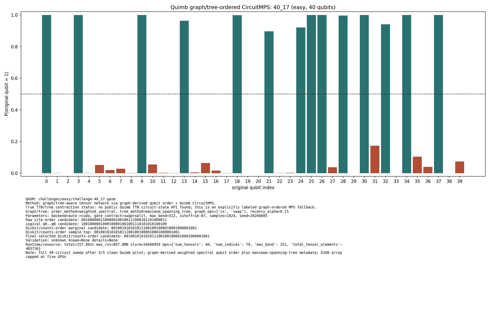
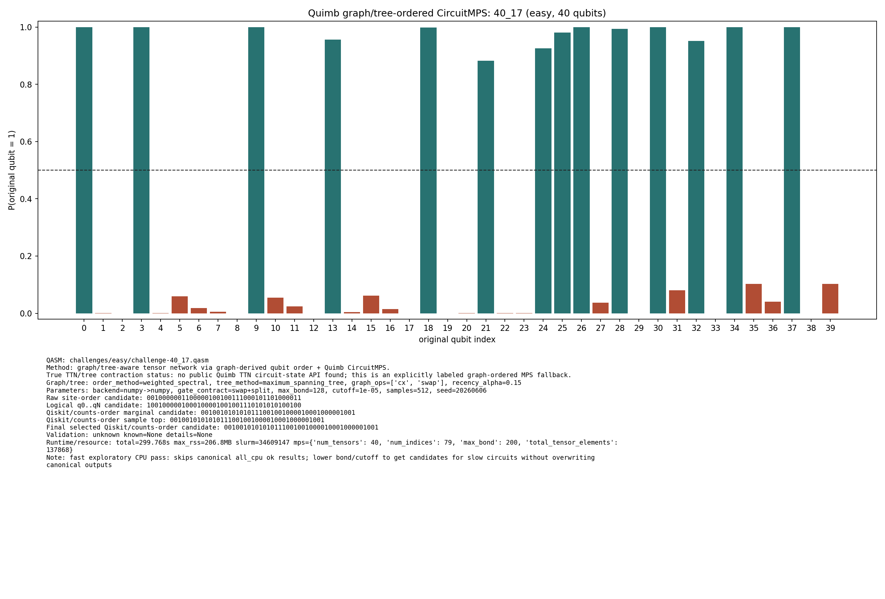
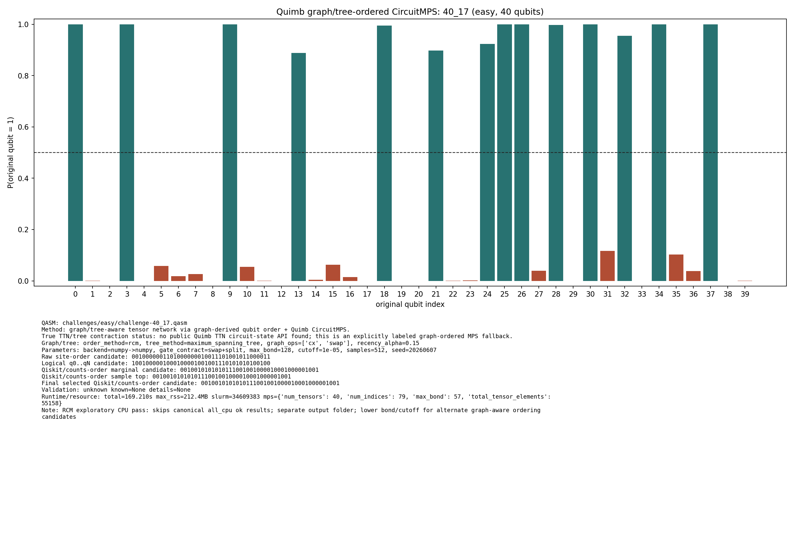
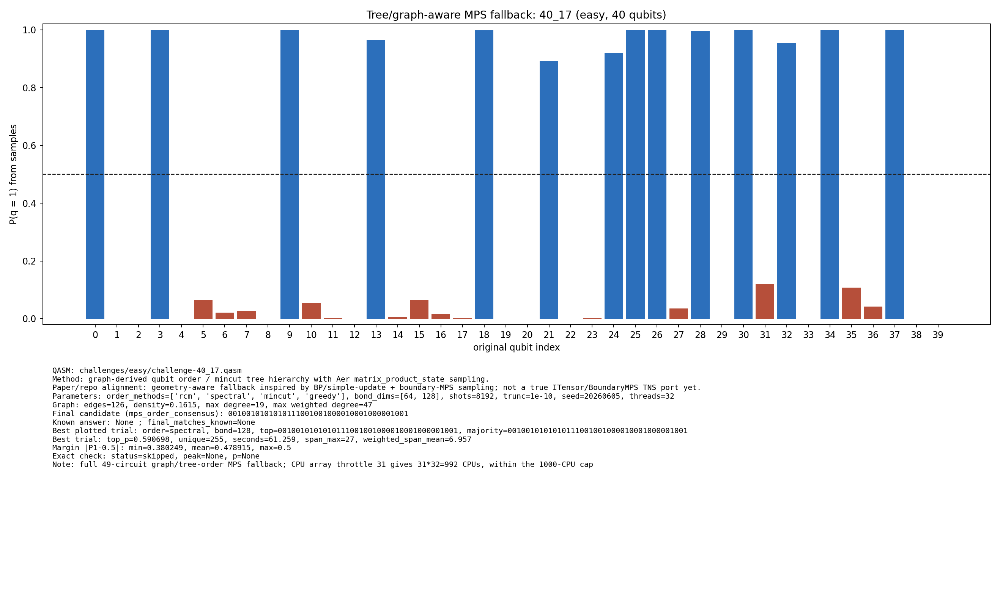

# Challenge 40_17

- Difficulty: easy
- Qubits: 40
- QASM: `challenges/easy/challenge-40_17.qasm`
- Selected answer: `0010010101010111001001000010001000001001`
- Selected method: `quimb_gpu_all`
- Validation: `unknown`
- Evidence rows: 4
- Normalized index page: [40_17](../../results_index/by_challenge/40_17.md)

## Distribution Figures

### Quimb graph-ordered MPS: tree_tensor_sim/all/images/challenge-40_17.quimb_tree_graph_mps.png

### Quimb graph-ordered MPS: tree_tensor_sim/all_cpu/images/challenge-40_17.quimb_tree_graph_mps.png

### Quimb graph-ordered MPS: tree_tensor_sim/fast_cpu/images/challenge-40_17.quimb_tree_graph_mps.png

### Quimb graph-ordered MPS: tree_tensor_sim/rcm_cpu/images/challenge-40_17.quimb_tree_graph_mps.png

### peaked MPO/MPS marginal: challenge-40_17.peaked_mpo_mps.png

### tree/order MPS sample: tree_tensor_sim/all/images/challenge-40_17.tree_tensor_mps.png

## Candidate Rows

| review | selected | method | rank_type | rank | bitstring | score | count | support | fraction | validation | status | source |
|---|---:|---|---|---:|---|---:|---:|---:|---:|---|---|---|
|  | 1 | aer_tree_mps_all | final_candidate | 1 | `0010010101010111001001000010001000001001` | 35.88565673828125 |  |  | 35.88565673828125 | {"bit_order_note":"Right-most bit is qubit 0.","final_matches_known":null,"known_answer":null,"known_answers_are_qiskit_counts_order":true} | ok | `../quantum-junction-tree-tensor/outputs/tree_tensor_sim/all/json/challenge-40_17.tree_tensor_mps.json` |
|  | 0 | aer_tree_mps_all | sample_top | 1 | `0010010001010110001000000010001000001001` | 0.00439453125 | 36 |  | 0.00439453125 | {"bit_order_note":"Right-most bit is qubit 0.","final_matches_known":null,"known_answer":null,"known_answers_are_qiskit_counts_order":true} | ok | `../quantum-junction-tree-tensor/outputs/tree_tensor_sim/all/json/challenge-40_17.tree_tensor_mps.json` |
|  | 0 | aer_tree_mps_all | sample_top | 1 | `0010010001010110001001000010001000001001` | 0.02001953125 | 164 |  | 0.02001953125 | {"bit_order_note":"Right-most bit is qubit 0.","final_matches_known":null,"known_answer":null,"known_answers_are_qiskit_counts_order":true} | ok | `../quantum-junction-tree-tensor/outputs/tree_tensor_sim/all/json/challenge-40_17.tree_tensor_mps.json` |
|  | 0 | aer_tree_mps_all | sample_top | 1 | `0010010001010110001001000010001000001001` | 0.0194091796875 | 159 |  | 0.0194091796875 | {"bit_order_note":"Right-most bit is qubit 0.","final_matches_known":null,"known_answer":null,"known_answers_are_qiskit_counts_order":true} | ok | `../quantum-junction-tree-tensor/outputs/tree_tensor_sim/all/json/challenge-40_17.tree_tensor_mps.json` |
|  | 0 | aer_tree_mps_all | sample_top | 1 | `0010010001010110001001000010001000001001` | 0.0201416015625 | 165 |  | 0.0201416015625 | {"bit_order_note":"Right-most bit is qubit 0.","final_matches_known":null,"known_answer":null,"known_answers_are_qiskit_counts_order":true} | ok | `../quantum-junction-tree-tensor/outputs/tree_tensor_sim/all/json/challenge-40_17.tree_tensor_mps.json` |
|  | 0 | aer_tree_mps_all | sample_top | 1 | `0010010001010110001001000010001000001001` | 0.0225830078125 | 185 |  | 0.0225830078125 | {"bit_order_note":"Right-most bit is qubit 0.","final_matches_known":null,"known_answer":null,"known_answers_are_qiskit_counts_order":true} | ok | `../quantum-junction-tree-tensor/outputs/tree_tensor_sim/all/json/challenge-40_17.tree_tensor_mps.json` |
|  | 0 | aer_tree_mps_all | sample_top | 1 | `0010010001010110001001000010001000001001` | 0.0224609375 | 184 |  | 0.0224609375 | {"bit_order_note":"Right-most bit is qubit 0.","final_matches_known":null,"known_answer":null,"known_answers_are_qiskit_counts_order":true} | ok | `../quantum-junction-tree-tensor/outputs/tree_tensor_sim/all/json/challenge-40_17.tree_tensor_mps.json` |
|  | 0 | aer_tree_mps_all | sample_top | 1 | `0010010001010110001001000010001000001001` | 0.025146484375 | 206 |  | 0.025146484375 | {"bit_order_note":"Right-most bit is qubit 0.","final_matches_known":null,"known_answer":null,"known_answers_are_qiskit_counts_order":true} | ok | `../quantum-junction-tree-tensor/outputs/tree_tensor_sim/all/json/challenge-40_17.tree_tensor_mps.json` |
|  | 0 | aer_tree_mps_all | sample_top | 1 | `0010010001010110001001000010001000001001` | 0.0177001953125 | 145 |  | 0.0177001953125 | {"bit_order_note":"Right-most bit is qubit 0.","final_matches_known":null,"known_answer":null,"known_answers_are_qiskit_counts_order":true} | ok | `../quantum-junction-tree-tensor/outputs/tree_tensor_sim/all/json/challenge-40_17.tree_tensor_mps.json` |
|  | 0 | aer_tree_mps_all | sample_top | 2 | `0010010001010110001001000010001000001001` | 0.017822265625 | 146 |  | 0.017822265625 | {"bit_order_note":"Right-most bit is qubit 0.","final_matches_known":null,"known_answer":null,"known_answers_are_qiskit_counts_order":true} | ok | `../quantum-junction-tree-tensor/outputs/tree_tensor_sim/all/json/challenge-40_17.tree_tensor_mps.json` |
|  | 0 | aer_tree_mps_all | sample_top | 2 | `0010010001010111001001000010001000001001` | 0.0076904296875 | 63 |  | 0.0076904296875 | {"bit_order_note":"Right-most bit is qubit 0.","final_matches_known":null,"known_answer":null,"known_answers_are_qiskit_counts_order":true} | ok | `../quantum-junction-tree-tensor/outputs/tree_tensor_sim/all/json/challenge-40_17.tree_tensor_mps.json` |
|  | 0 | aer_tree_mps_all | sample_top | 2 | `0010010001010111001001000010001000001001` | 0.013671875 | 112 |  | 0.013671875 | {"bit_order_note":"Right-most bit is qubit 0.","final_matches_known":null,"known_answer":null,"known_answers_are_qiskit_counts_order":true} | ok | `../quantum-junction-tree-tensor/outputs/tree_tensor_sim/all/json/challenge-40_17.tree_tensor_mps.json` |
|  | 0 | aer_tree_mps_all | sample_top | 2 | `0010010001010111001001000010001000001001` | 0.00830078125 | 68 |  | 0.00830078125 | {"bit_order_note":"Right-most bit is qubit 0.","final_matches_known":null,"known_answer":null,"known_answers_are_qiskit_counts_order":true} | ok | `../quantum-junction-tree-tensor/outputs/tree_tensor_sim/all/json/challenge-40_17.tree_tensor_mps.json` |
|  | 0 | aer_tree_mps_all | sample_top | 2 | `0010010001010111001001000010001000001001` | 0.0078125 | 64 |  | 0.0078125 | {"bit_order_note":"Right-most bit is qubit 0.","final_matches_known":null,"known_answer":null,"known_answers_are_qiskit_counts_order":true} | ok | `../quantum-junction-tree-tensor/outputs/tree_tensor_sim/all/json/challenge-40_17.tree_tensor_mps.json` |
|  | 0 | aer_tree_mps_all | sample_top | 2 | `0010010001010111001001000010001000001001` | 0.01123046875 | 92 |  | 0.01123046875 | {"bit_order_note":"Right-most bit is qubit 0.","final_matches_known":null,"known_answer":null,"known_answers_are_qiskit_counts_order":true} | ok | `../quantum-junction-tree-tensor/outputs/tree_tensor_sim/all/json/challenge-40_17.tree_tensor_mps.json` |
|  | 0 | aer_tree_mps_all | sample_top | 2 | `0010010001010111001001000010001000001001` | 0.0037841796875 | 31 |  | 0.0037841796875 | {"bit_order_note":"Right-most bit is qubit 0.","final_matches_known":null,"known_answer":null,"known_answers_are_qiskit_counts_order":true} | ok | `../quantum-junction-tree-tensor/outputs/tree_tensor_sim/all/json/challenge-40_17.tree_tensor_mps.json` |
|  | 0 | aer_tree_mps_all | sample_top | 2 | `0010010001010111001001000010001000001001` | 0.0078125 | 64 |  | 0.0078125 | {"bit_order_note":"Right-most bit is qubit 0.","final_matches_known":null,"known_answer":null,"known_answers_are_qiskit_counts_order":true} | ok | `../quantum-junction-tree-tensor/outputs/tree_tensor_sim/all/json/challenge-40_17.tree_tensor_mps.json` |
|  | 0 | aer_tree_mps_all | sample_top | 3 | `0010010001010111001001000010001000001001` | 0.0078125 | 64 |  | 0.0078125 | {"bit_order_note":"Right-most bit is qubit 0.","final_matches_known":null,"known_answer":null,"known_answers_are_qiskit_counts_order":true} | ok | `../quantum-junction-tree-tensor/outputs/tree_tensor_sim/all/json/challenge-40_17.tree_tensor_mps.json` |
|  | 0 | aer_tree_mps_all | sample_top | 3 | `0010010001010111001001000010001000101001` | 0.0029296875 | 24 |  | 0.0029296875 | {"bit_order_note":"Right-most bit is qubit 0.","final_matches_known":null,"known_answer":null,"known_answers_are_qiskit_counts_order":true} | ok | `../quantum-junction-tree-tensor/outputs/tree_tensor_sim/all/json/challenge-40_17.tree_tensor_mps.json` |
|  | 0 | aer_tree_mps_all | sample_top | 3 | `0010010001010111001001000010001000101001` | 0.0032958984375 | 27 |  | 0.0032958984375 | {"bit_order_note":"Right-most bit is qubit 0.","final_matches_known":null,"known_answer":null,"known_answers_are_qiskit_counts_order":true} | ok | `../quantum-junction-tree-tensor/outputs/tree_tensor_sim/all/json/challenge-40_17.tree_tensor_mps.json` |
|  | 0 | aer_tree_mps_all | sample_top | 3 | `0010010101000111001001000010001000001001` | 0.003173828125 | 26 |  | 0.003173828125 | {"bit_order_note":"Right-most bit is qubit 0.","final_matches_known":null,"known_answer":null,"known_answers_are_qiskit_counts_order":true} | ok | `../quantum-junction-tree-tensor/outputs/tree_tensor_sim/all/json/challenge-40_17.tree_tensor_mps.json` |
|  | 0 | aer_tree_mps_all | sample_top | 3 | `0010010101010110001001000010001000001001` | 0.00439453125 | 36 |  | 0.00439453125 | {"bit_order_note":"Right-most bit is qubit 0.","final_matches_known":null,"known_answer":null,"known_answers_are_qiskit_counts_order":true} | ok | `../quantum-junction-tree-tensor/outputs/tree_tensor_sim/all/json/challenge-40_17.tree_tensor_mps.json` |
|  | 0 | aer_tree_mps_all | sample_top | 3 | `0010010101010110001001000010001000001001` | 0.0042724609375 | 35 |  | 0.0042724609375 | {"bit_order_note":"Right-most bit is qubit 0.","final_matches_known":null,"known_answer":null,"known_answers_are_qiskit_counts_order":true} | ok | `../quantum-junction-tree-tensor/outputs/tree_tensor_sim/all/json/challenge-40_17.tree_tensor_mps.json` |
|  | 0 | aer_tree_mps_all | sample_top | 3 | `0010010101010110001001000010001000001001` | 0.007080078125 | 58 |  | 0.007080078125 | {"bit_order_note":"Right-most bit is qubit 0.","final_matches_known":null,"known_answer":null,"known_answers_are_qiskit_counts_order":true} | ok | `../quantum-junction-tree-tensor/outputs/tree_tensor_sim/all/json/challenge-40_17.tree_tensor_mps.json` |
|  | 0 | aer_tree_mps_all | sample_top | 3 | `0010010101010110001001000010001000101001` | 0.0252685546875 | 207 |  | 0.0252685546875 | {"bit_order_note":"Right-most bit is qubit 0.","final_matches_known":null,"known_answer":null,"known_answers_are_qiskit_counts_order":true} | ok | `../quantum-junction-tree-tensor/outputs/tree_tensor_sim/all/json/challenge-40_17.tree_tensor_mps.json` |
|  | 0 | aer_tree_mps_all | sample_top | 4 | `0010010101010110001000000010001000101001` | 0.00439453125 | 36 |  | 0.00439453125 | {"bit_order_note":"Right-most bit is qubit 0.","final_matches_known":null,"known_answer":null,"known_answers_are_qiskit_counts_order":true} | ok | `../quantum-junction-tree-tensor/outputs/tree_tensor_sim/all/json/challenge-40_17.tree_tensor_mps.json` |
|  | 0 | aer_tree_mps_all | sample_top | 4 | `0010010101010110001001000010001000001001` | 0.0047607421875 | 39 |  | 0.0047607421875 | {"bit_order_note":"Right-most bit is qubit 0.","final_matches_known":null,"known_answer":null,"known_answers_are_qiskit_counts_order":true} | ok | `../quantum-junction-tree-tensor/outputs/tree_tensor_sim/all/json/challenge-40_17.tree_tensor_mps.json` |
|  | 0 | aer_tree_mps_all | sample_top | 4 | `0010010101010110001001000010001000001001` | 0.010498046875 | 86 |  | 0.010498046875 | {"bit_order_note":"Right-most bit is qubit 0.","final_matches_known":null,"known_answer":null,"known_answers_are_qiskit_counts_order":true} | ok | `../quantum-junction-tree-tensor/outputs/tree_tensor_sim/all/json/challenge-40_17.tree_tensor_mps.json` |
|  | 0 | aer_tree_mps_all | sample_top | 4 | `0010010101010110001001000010001000001001` | 0.003173828125 | 26 |  | 0.003173828125 | {"bit_order_note":"Right-most bit is qubit 0.","final_matches_known":null,"known_answer":null,"known_answers_are_qiskit_counts_order":true} | ok | `../quantum-junction-tree-tensor/outputs/tree_tensor_sim/all/json/challenge-40_17.tree_tensor_mps.json` |
|  | 0 | aer_tree_mps_all | sample_top | 4 | `0010010101010110001001000010001000101001` | 0.019287109375 | 158 |  | 0.019287109375 | {"bit_order_note":"Right-most bit is qubit 0.","final_matches_known":null,"known_answer":null,"known_answers_are_qiskit_counts_order":true} | ok | `../quantum-junction-tree-tensor/outputs/tree_tensor_sim/all/json/challenge-40_17.tree_tensor_mps.json` |
|  | 0 | aer_tree_mps_all | sample_top | 4 | `0010010101010110001001000010001000101001` | 0.0264892578125 | 217 |  | 0.0264892578125 | {"bit_order_note":"Right-most bit is qubit 0.","final_matches_known":null,"known_answer":null,"known_answers_are_qiskit_counts_order":true} | ok | `../quantum-junction-tree-tensor/outputs/tree_tensor_sim/all/json/challenge-40_17.tree_tensor_mps.json` |
|  | 0 | aer_tree_mps_all | sample_top | 4 | `0010010101010110001001000010001000101001` | 0.0234375 | 192 |  | 0.0234375 | {"bit_order_note":"Right-most bit is qubit 0.","final_matches_known":null,"known_answer":null,"known_answers_are_qiskit_counts_order":true} | ok | `../quantum-junction-tree-tensor/outputs/tree_tensor_sim/all/json/challenge-40_17.tree_tensor_mps.json` |
|  | 0 | aer_tree_mps_all | sample_top | 4 | `0010010101010111001000000010001000001001` | 0.0484619140625 | 397 |  | 0.0484619140625 | {"bit_order_note":"Right-most bit is qubit 0.","final_matches_known":null,"known_answer":null,"known_answers_are_qiskit_counts_order":true} | ok | `../quantum-junction-tree-tensor/outputs/tree_tensor_sim/all/json/challenge-40_17.tree_tensor_mps.json` |
|  | 0 | aer_tree_mps_all | sample_top | 5 | `0010010101010110001001000010001000001001` | 0.0040283203125 | 33 |  | 0.0040283203125 | {"bit_order_note":"Right-most bit is qubit 0.","final_matches_known":null,"known_answer":null,"known_answers_are_qiskit_counts_order":true} | ok | `../quantum-junction-tree-tensor/outputs/tree_tensor_sim/all/json/challenge-40_17.tree_tensor_mps.json` |
|  | 0 | aer_tree_mps_all | sample_top | 5 | `0010010101010110001001000010001000101001` | 0.0203857421875 | 167 |  | 0.0203857421875 | {"bit_order_note":"Right-most bit is qubit 0.","final_matches_known":null,"known_answer":null,"known_answers_are_qiskit_counts_order":true} | ok | `../quantum-junction-tree-tensor/outputs/tree_tensor_sim/all/json/challenge-40_17.tree_tensor_mps.json` |
|  | 0 | aer_tree_mps_all | sample_top | 5 | `0010010101010110001001000010001000101001` | 0.0128173828125 | 105 |  | 0.0128173828125 | {"bit_order_note":"Right-most bit is qubit 0.","final_matches_known":null,"known_answer":null,"known_answers_are_qiskit_counts_order":true} | ok | `../quantum-junction-tree-tensor/outputs/tree_tensor_sim/all/json/challenge-40_17.tree_tensor_mps.json` |
|  | 0 | aer_tree_mps_all | sample_top | 5 | `0010010101010110001001000010001000101001` | 0.0224609375 | 184 |  | 0.0224609375 | {"bit_order_note":"Right-most bit is qubit 0.","final_matches_known":null,"known_answer":null,"known_answers_are_qiskit_counts_order":true} | ok | `../quantum-junction-tree-tensor/outputs/tree_tensor_sim/all/json/challenge-40_17.tree_tensor_mps.json` |
|  | 1 | aer_tree_mps_all | sample_top | 5 | `0010010101010111001001000010001000001001` | 0.56201171875 | 4604 |  | 0.56201171875 | {"bit_order_note":"Right-most bit is qubit 0.","final_matches_known":null,"known_answer":null,"known_answers_are_qiskit_counts_order":true} | ok | `../quantum-junction-tree-tensor/outputs/tree_tensor_sim/all/json/challenge-40_17.tree_tensor_mps.json` |
|  | 1 | aer_tree_mps_all | sample_top | 5 | `0010010101010111001001000010001000001001` | 0.5906982421875 | 4839 |  | 0.5906982421875 | {"bit_order_note":"Right-most bit is qubit 0.","final_matches_known":null,"known_answer":null,"known_answers_are_qiskit_counts_order":true} | ok | `../quantum-junction-tree-tensor/outputs/tree_tensor_sim/all/json/challenge-40_17.tree_tensor_mps.json` |
|  | 1 | aer_tree_mps_all | sample_top | 5 | `0010010101010111001001000010001000001001` | 0.5361328125 | 4392 |  | 0.5361328125 | {"bit_order_note":"Right-most bit is qubit 0.","final_matches_known":null,"known_answer":null,"known_answers_are_qiskit_counts_order":true} | ok | `../quantum-junction-tree-tensor/outputs/tree_tensor_sim/all/json/challenge-40_17.tree_tensor_mps.json` |
|  | 1 | aer_tree_mps_all | sample_top | 5 | `0010010101010111001001000010001000001001` | 0.4471435546875 | 3663 |  | 0.4471435546875 | {"bit_order_note":"Right-most bit is qubit 0.","final_matches_known":null,"known_answer":null,"known_answers_are_qiskit_counts_order":true} | ok | `../quantum-junction-tree-tensor/outputs/tree_tensor_sim/all/json/challenge-40_17.tree_tensor_mps.json` |
|  | 0 | aer_tree_mps_all | sample_top | 6 | `0010010101010110001001000010001000101001` | 0.020263671875 | 166 |  | 0.020263671875 | {"bit_order_note":"Right-most bit is qubit 0.","final_matches_known":null,"known_answer":null,"known_answers_are_qiskit_counts_order":true} | ok | `../quantum-junction-tree-tensor/outputs/tree_tensor_sim/all/json/challenge-40_17.tree_tensor_mps.json` |
|  | 1 | aer_tree_mps_all | sample_top | 6 | `0010010101010111001001000010001000001001` | 0.55322265625 | 4532 |  | 0.55322265625 | {"bit_order_note":"Right-most bit is qubit 0.","final_matches_known":null,"known_answer":null,"known_answers_are_qiskit_counts_order":true} | ok | `../quantum-junction-tree-tensor/outputs/tree_tensor_sim/all/json/challenge-40_17.tree_tensor_mps.json` |
|  | 1 | aer_tree_mps_all | sample_top | 6 | `0010010101010111001001000010001000001001` | 0.555419921875 | 4550 |  | 0.555419921875 | {"bit_order_note":"Right-most bit is qubit 0.","final_matches_known":null,"known_answer":null,"known_answers_are_qiskit_counts_order":true} | ok | `../quantum-junction-tree-tensor/outputs/tree_tensor_sim/all/json/challenge-40_17.tree_tensor_mps.json` |
|  | 1 | aer_tree_mps_all | sample_top | 6 | `0010010101010111001001000010001000001001` | 0.54296875 | 4448 |  | 0.54296875 | {"bit_order_note":"Right-most bit is qubit 0.","final_matches_known":null,"known_answer":null,"known_answers_are_qiskit_counts_order":true} | ok | `../quantum-junction-tree-tensor/outputs/tree_tensor_sim/all/json/challenge-40_17.tree_tensor_mps.json` |
|  | 0 | aer_tree_mps_all | sample_top | 6 | `0010010101010111001001000010001000101001` | 0.0130615234375 | 107 |  | 0.0130615234375 | {"bit_order_note":"Right-most bit is qubit 0.","final_matches_known":null,"known_answer":null,"known_answers_are_qiskit_counts_order":true} | ok | `../quantum-junction-tree-tensor/outputs/tree_tensor_sim/all/json/challenge-40_17.tree_tensor_mps.json` |
|  | 0 | aer_tree_mps_all | sample_top | 6 | `0010010101010111001001000010001000101001` | 0.0096435546875 | 79 |  | 0.0096435546875 | {"bit_order_note":"Right-most bit is qubit 0.","final_matches_known":null,"known_answer":null,"known_answers_are_qiskit_counts_order":true} | ok | `../quantum-junction-tree-tensor/outputs/tree_tensor_sim/all/json/challenge-40_17.tree_tensor_mps.json` |
|  | 0 | aer_tree_mps_all | sample_top | 6 | `0010010101010111001001000010001000101001` | 0.0084228515625 | 69 |  | 0.0084228515625 | {"bit_order_note":"Right-most bit is qubit 0.","final_matches_known":null,"known_answer":null,"known_answers_are_qiskit_counts_order":true} | ok | `../quantum-junction-tree-tensor/outputs/tree_tensor_sim/all/json/challenge-40_17.tree_tensor_mps.json` |
|  | 0 | aer_tree_mps_all | sample_top | 6 | `0010010101010111001001000010001000101001` | 0.0035400390625 | 29 |  | 0.0035400390625 | {"bit_order_note":"Right-most bit is qubit 0.","final_matches_known":null,"known_answer":null,"known_answers_are_qiskit_counts_order":true} | ok | `../quantum-junction-tree-tensor/outputs/tree_tensor_sim/all/json/challenge-40_17.tree_tensor_mps.json` |
|  | 0 | aer_tree_mps_all | sample_top | 7 | `0010010101010111001000000010001000001001` | 0.104248046875 | 854 |  | 0.104248046875 | {"bit_order_note":"Right-most bit is qubit 0.","final_matches_known":null,"known_answer":null,"known_answers_are_qiskit_counts_order":true} | ok | `../quantum-junction-tree-tensor/outputs/tree_tensor_sim/all/json/challenge-40_17.tree_tensor_mps.json` |
|  | 0 | aer_tree_mps_all | sample_top | 7 | `0010010101010111001001000010001000101001` | 0.006591796875 | 54 |  | 0.006591796875 | {"bit_order_note":"Right-most bit is qubit 0.","final_matches_known":null,"known_answer":null,"known_answers_are_qiskit_counts_order":true} | ok | `../quantum-junction-tree-tensor/outputs/tree_tensor_sim/all/json/challenge-40_17.tree_tensor_mps.json` |
|  | 0 | aer_tree_mps_all | sample_top | 7 | `0010010101010111001001000010001000101001` | 0.01123046875 | 92 |  | 0.01123046875 | {"bit_order_note":"Right-most bit is qubit 0.","final_matches_known":null,"known_answer":null,"known_answers_are_qiskit_counts_order":true} | ok | `../quantum-junction-tree-tensor/outputs/tree_tensor_sim/all/json/challenge-40_17.tree_tensor_mps.json` |
|  | 0 | aer_tree_mps_all | sample_top | 7 | `0010010101010111001001000010001000101001` | 0.009033203125 | 74 |  | 0.009033203125 | {"bit_order_note":"Right-most bit is qubit 0.","final_matches_known":null,"known_answer":null,"known_answers_are_qiskit_counts_order":true} | ok | `../quantum-junction-tree-tensor/outputs/tree_tensor_sim/all/json/challenge-40_17.tree_tensor_mps.json` |
|  | 0 | aer_tree_mps_all | sample_top | 7 | `0010010101010111001001000010001001001001` | 0.00439453125 | 36 |  | 0.00439453125 | {"bit_order_note":"Right-most bit is qubit 0.","final_matches_known":null,"known_answer":null,"known_answers_are_qiskit_counts_order":true} | ok | `../quantum-junction-tree-tensor/outputs/tree_tensor_sim/all/json/challenge-40_17.tree_tensor_mps.json` |
|  | 0 | aer_tree_mps_all | sample_top | 7 | `0010010101010111001001000010001001001001` | 0.004150390625 | 34 |  | 0.004150390625 | {"bit_order_note":"Right-most bit is qubit 0.","final_matches_known":null,"known_answer":null,"known_answers_are_qiskit_counts_order":true} | ok | `../quantum-junction-tree-tensor/outputs/tree_tensor_sim/all/json/challenge-40_17.tree_tensor_mps.json` |
|  | 0 | aer_tree_mps_all | sample_top | 7 | `0010010101010111001001000010001001001001` | 0.0037841796875 | 31 |  | 0.0037841796875 | {"bit_order_note":"Right-most bit is qubit 0.","final_matches_known":null,"known_answer":null,"known_answers_are_qiskit_counts_order":true} | ok | `../quantum-junction-tree-tensor/outputs/tree_tensor_sim/all/json/challenge-40_17.tree_tensor_mps.json` |
|  | 0 | aer_tree_mps_all | sample_top | 7 | `0010010101010111001001000010011000001001` | 0.0242919921875 | 199 |  | 0.0242919921875 | {"bit_order_note":"Right-most bit is qubit 0.","final_matches_known":null,"known_answer":null,"known_answers_are_qiskit_counts_order":true} | ok | `../quantum-junction-tree-tensor/outputs/tree_tensor_sim/all/json/challenge-40_17.tree_tensor_mps.json` |
|  | 0 | aer_tree_mps_all | sample_top | 8 | `0010010101010111001000000010011000001001` | 0.0062255859375 | 51 |  | 0.0062255859375 | {"bit_order_note":"Right-most bit is qubit 0.","final_matches_known":null,"known_answer":null,"known_answers_are_qiskit_counts_order":true} | ok | `../quantum-junction-tree-tensor/outputs/tree_tensor_sim/all/json/challenge-40_17.tree_tensor_mps.json` |
|  | 0 | aer_tree_mps_all | sample_top | 8 | `0010010101010111001001000010001001001001` | 0.00341796875 | 28 |  | 0.00341796875 | {"bit_order_note":"Right-most bit is qubit 0.","final_matches_known":null,"known_answer":null,"known_answers_are_qiskit_counts_order":true} | ok | `../quantum-junction-tree-tensor/outputs/tree_tensor_sim/all/json/challenge-40_17.tree_tensor_mps.json` |
|  | 0 | aer_tree_mps_all | sample_top | 8 | `0010010101010111001001000010001001001001` | 0.003173828125 | 26 |  | 0.003173828125 | {"bit_order_note":"Right-most bit is qubit 0.","final_matches_known":null,"known_answer":null,"known_answers_are_qiskit_counts_order":true} | ok | `../quantum-junction-tree-tensor/outputs/tree_tensor_sim/all/json/challenge-40_17.tree_tensor_mps.json` |
|  | 0 | aer_tree_mps_all | sample_top | 8 | `0010010101010111001001000010001001001001` | 0.00390625 | 32 |  | 0.00390625 | {"bit_order_note":"Right-most bit is qubit 0.","final_matches_known":null,"known_answer":null,"known_answers_are_qiskit_counts_order":true} | ok | `../quantum-junction-tree-tensor/outputs/tree_tensor_sim/all/json/challenge-40_17.tree_tensor_mps.json` |
|  | 0 | aer_tree_mps_all | sample_top | 8 | `0010010101010111001001000010011000001001` | 0.033447265625 | 274 |  | 0.033447265625 | {"bit_order_note":"Right-most bit is qubit 0.","final_matches_known":null,"known_answer":null,"known_answers_are_qiskit_counts_order":true} | ok | `../quantum-junction-tree-tensor/outputs/tree_tensor_sim/all/json/challenge-40_17.tree_tensor_mps.json` |
|  | 0 | aer_tree_mps_all | sample_top | 8 | `0010010101010111001001000010011000001001` | 0.033447265625 | 274 |  | 0.033447265625 | {"bit_order_note":"Right-most bit is qubit 0.","final_matches_known":null,"known_answer":null,"known_answers_are_qiskit_counts_order":true} | ok | `../quantum-junction-tree-tensor/outputs/tree_tensor_sim/all/json/challenge-40_17.tree_tensor_mps.json` |
|  | 0 | aer_tree_mps_all | sample_top | 8 | `0010010101010111001001000010011000001001` | 0.0299072265625 | 245 |  | 0.0299072265625 | {"bit_order_note":"Right-most bit is qubit 0.","final_matches_known":null,"known_answer":null,"known_answers_are_qiskit_counts_order":true} | ok | `../quantum-junction-tree-tensor/outputs/tree_tensor_sim/all/json/challenge-40_17.tree_tensor_mps.json` |
|  | 0 | aer_tree_mps_all | sample_top | 8 | `0010010101010111001001010010001001001001` | 0.004150390625 | 34 |  | 0.004150390625 | {"bit_order_note":"Right-most bit is qubit 0.","final_matches_known":null,"known_answer":null,"known_answers_are_qiskit_counts_order":true} | ok | `../quantum-junction-tree-tensor/outputs/tree_tensor_sim/all/json/challenge-40_17.tree_tensor_mps.json` |
|  | 1 | aer_tree_mps_all | sample_top | 9 | `0010010101010111001001000010001000001001` | 0.4925537109375 | 4035 |  | 0.4925537109375 | {"bit_order_note":"Right-most bit is qubit 0.","final_matches_known":null,"known_answer":null,"known_answers_are_qiskit_counts_order":true} | ok | `../quantum-junction-tree-tensor/outputs/tree_tensor_sim/all/json/challenge-40_17.tree_tensor_mps.json` |
|  | 0 | aer_tree_mps_all | sample_top | 9 | `0010010101010111001001000010011000001001` | 0.0316162109375 | 259 |  | 0.0316162109375 | {"bit_order_note":"Right-most bit is qubit 0.","final_matches_known":null,"known_answer":null,"known_answers_are_qiskit_counts_order":true} | ok | `../quantum-junction-tree-tensor/outputs/tree_tensor_sim/all/json/challenge-40_17.tree_tensor_mps.json` |
|  | 0 | aer_tree_mps_all | sample_top | 9 | `0010010101010111001001000010011000001001` | 0.03125 | 256 |  | 0.03125 | {"bit_order_note":"Right-most bit is qubit 0.","final_matches_known":null,"known_answer":null,"known_answers_are_qiskit_counts_order":true} | ok | `../quantum-junction-tree-tensor/outputs/tree_tensor_sim/all/json/challenge-40_17.tree_tensor_mps.json` |
|  | 0 | aer_tree_mps_all | sample_top | 9 | `0010010101010111001001000010011000001001` | 0.0364990234375 | 299 |  | 0.0364990234375 | {"bit_order_note":"Right-most bit is qubit 0.","final_matches_known":null,"known_answer":null,"known_answers_are_qiskit_counts_order":true} | ok | `../quantum-junction-tree-tensor/outputs/tree_tensor_sim/all/json/challenge-40_17.tree_tensor_mps.json` |
|  | 0 | aer_tree_mps_all | sample_top | 9 | `0010010101011111001001000000001000001001` | 0.0230712890625 | 189 |  | 0.0230712890625 | {"bit_order_note":"Right-most bit is qubit 0.","final_matches_known":null,"known_answer":null,"known_answers_are_qiskit_counts_order":true} | ok | `../quantum-junction-tree-tensor/outputs/tree_tensor_sim/all/json/challenge-40_17.tree_tensor_mps.json` |
|  | 0 | aer_tree_mps_all | sample_top | 9 | `0010010101011111001001000000001000001001` | 0.0213623046875 | 175 |  | 0.0213623046875 | {"bit_order_note":"Right-most bit is qubit 0.","final_matches_known":null,"known_answer":null,"known_answers_are_qiskit_counts_order":true} | ok | `../quantum-junction-tree-tensor/outputs/tree_tensor_sim/all/json/challenge-40_17.tree_tensor_mps.json` |
|  | 0 | aer_tree_mps_all | sample_top | 9 | `0010010101011111001001000000001000001001` | 0.0216064453125 | 177 |  | 0.0216064453125 | {"bit_order_note":"Right-most bit is qubit 0.","final_matches_known":null,"known_answer":null,"known_answers_are_qiskit_counts_order":true} | ok | `../quantum-junction-tree-tensor/outputs/tree_tensor_sim/all/json/challenge-40_17.tree_tensor_mps.json` |
|  | 0 | aer_tree_mps_all | sample_top | 9 | `0010010101011111001001000000001000001001` | 0.01708984375 | 140 |  | 0.01708984375 | {"bit_order_note":"Right-most bit is qubit 0.","final_matches_known":null,"known_answer":null,"known_answers_are_qiskit_counts_order":true} | ok | `../quantum-junction-tree-tensor/outputs/tree_tensor_sim/all/json/challenge-40_17.tree_tensor_mps.json` |
|  | 0 | aer_tree_mps_all | sample_top | 10 | `0010010101010111001001000010001000101001` | 0.0093994140625 | 77 |  | 0.0093994140625 | {"bit_order_note":"Right-most bit is qubit 0.","final_matches_known":null,"known_answer":null,"known_answers_are_qiskit_counts_order":true} | ok | `../quantum-junction-tree-tensor/outputs/tree_tensor_sim/all/json/challenge-40_17.tree_tensor_mps.json` |
|  | 0 | aer_tree_mps_all | sample_top | 10 | `0010010101011111001001000000001000001001` | 0.0208740234375 | 171 |  | 0.0208740234375 | {"bit_order_note":"Right-most bit is qubit 0.","final_matches_known":null,"known_answer":null,"known_answers_are_qiskit_counts_order":true} | ok | `../quantum-junction-tree-tensor/outputs/tree_tensor_sim/all/json/challenge-40_17.tree_tensor_mps.json` |
|  | 0 | aer_tree_mps_all | sample_top | 10 | `0010010101011111001001000000001000001001` | 0.0238037109375 | 195 |  | 0.0238037109375 | {"bit_order_note":"Right-most bit is qubit 0.","final_matches_known":null,"known_answer":null,"known_answers_are_qiskit_counts_order":true} | ok | `../quantum-junction-tree-tensor/outputs/tree_tensor_sim/all/json/challenge-40_17.tree_tensor_mps.json` |
|  | 0 | aer_tree_mps_all | sample_top | 10 | `0010010101011111001001000000001000001001` | 0.02294921875 | 188 |  | 0.02294921875 | {"bit_order_note":"Right-most bit is qubit 0.","final_matches_known":null,"known_answer":null,"known_answers_are_qiskit_counts_order":true} | ok | `../quantum-junction-tree-tensor/outputs/tree_tensor_sim/all/json/challenge-40_17.tree_tensor_mps.json` |
|  | 0 | aer_tree_mps_all | sample_top | 10 | `0010010111010110001001001010001000101001` | 0.0030517578125 | 25 |  | 0.0030517578125 | {"bit_order_note":"Right-most bit is qubit 0.","final_matches_known":null,"known_answer":null,"known_answers_are_qiskit_counts_order":true} | ok | `../quantum-junction-tree-tensor/outputs/tree_tensor_sim/all/json/challenge-40_17.tree_tensor_mps.json` |
|  | 0 | aer_tree_mps_all | sample_top | 10 | `0010010111010111001000001010001000001001` | 0.003662109375 | 30 |  | 0.003662109375 | {"bit_order_note":"Right-most bit is qubit 0.","final_matches_known":null,"known_answer":null,"known_answers_are_qiskit_counts_order":true} | ok | `../quantum-junction-tree-tensor/outputs/tree_tensor_sim/all/json/challenge-40_17.tree_tensor_mps.json` |
|  | 0 | aer_tree_mps_all | sample_top | 10 | `0010010111010111001001000010001000001001` | 0.0186767578125 | 153 |  | 0.0186767578125 | {"bit_order_note":"Right-most bit is qubit 0.","final_matches_known":null,"known_answer":null,"known_answers_are_qiskit_counts_order":true} | ok | `../quantum-junction-tree-tensor/outputs/tree_tensor_sim/all/json/challenge-40_17.tree_tensor_mps.json` |
|  | 0 | aer_tree_mps_all | sample_top | 10 | `0010010111010111001001000010001000001001` | 0.0196533203125 | 161 |  | 0.0196533203125 | {"bit_order_note":"Right-most bit is qubit 0.","final_matches_known":null,"known_answer":null,"known_answers_are_qiskit_counts_order":true} | ok | `../quantum-junction-tree-tensor/outputs/tree_tensor_sim/all/json/challenge-40_17.tree_tensor_mps.json` |
|  | 0 | aer_tree_mps_all | sample_top | 11 | `0010010101010111001001000010011000001001` | 0.0302734375 | 248 |  | 0.0302734375 | {"bit_order_note":"Right-most bit is qubit 0.","final_matches_known":null,"known_answer":null,"known_answers_are_qiskit_counts_order":true} | ok | `../quantum-junction-tree-tensor/outputs/tree_tensor_sim/all/json/challenge-40_17.tree_tensor_mps.json` |
|  | 0 | aer_tree_mps_all | sample_top | 11 | `0010010111010111001001000010001000001001` | 0.0198974609375 | 163 |  | 0.0198974609375 | {"bit_order_note":"Right-most bit is qubit 0.","final_matches_known":null,"known_answer":null,"known_answers_are_qiskit_counts_order":true} | ok | `../quantum-junction-tree-tensor/outputs/tree_tensor_sim/all/json/challenge-40_17.tree_tensor_mps.json` |
|  | 0 | aer_tree_mps_all | sample_top | 11 | `0010010111010111001001000010001000001001` | 0.0213623046875 | 175 |  | 0.0213623046875 | {"bit_order_note":"Right-most bit is qubit 0.","final_matches_known":null,"known_answer":null,"known_answers_are_qiskit_counts_order":true} | ok | `../quantum-junction-tree-tensor/outputs/tree_tensor_sim/all/json/challenge-40_17.tree_tensor_mps.json` |
|  | 0 | aer_tree_mps_all | sample_top | 11 | `0010010111010111001001000010001000001001` | 0.0194091796875 | 159 |  | 0.0194091796875 | {"bit_order_note":"Right-most bit is qubit 0.","final_matches_known":null,"known_answer":null,"known_answers_are_qiskit_counts_order":true} | ok | `../quantum-junction-tree-tensor/outputs/tree_tensor_sim/all/json/challenge-40_17.tree_tensor_mps.json` |
|  | 0 | aer_tree_mps_all | sample_top | 11 | `0010010111010111001001000010001000001001` | 0.0198974609375 | 163 |  | 0.0198974609375 | {"bit_order_note":"Right-most bit is qubit 0.","final_matches_known":null,"known_answer":null,"known_answers_are_qiskit_counts_order":true} | ok | `../quantum-junction-tree-tensor/outputs/tree_tensor_sim/all/json/challenge-40_17.tree_tensor_mps.json` |
|  | 0 | aer_tree_mps_all | sample_top | 11 | `0010010111010111001001000010001000001001` | 0.0206298828125 | 169 |  | 0.0206298828125 | {"bit_order_note":"Right-most bit is qubit 0.","final_matches_known":null,"known_answer":null,"known_answers_are_qiskit_counts_order":true} | ok | `../quantum-junction-tree-tensor/outputs/tree_tensor_sim/all/json/challenge-40_17.tree_tensor_mps.json` |
|  | 0 | aer_tree_mps_all | sample_top | 11 | `0010010111010111001001000010001010001001` | 0.01220703125 | 100 |  | 0.01220703125 | {"bit_order_note":"Right-most bit is qubit 0.","final_matches_known":null,"known_answer":null,"known_answers_are_qiskit_counts_order":true} | ok | `../quantum-junction-tree-tensor/outputs/tree_tensor_sim/all/json/challenge-40_17.tree_tensor_mps.json` |
|  | 0 | aer_tree_mps_all | sample_top | 11 | `0010010111010111001001000010001010001001` | 0.018798828125 | 154 |  | 0.018798828125 | {"bit_order_note":"Right-most bit is qubit 0.","final_matches_known":null,"known_answer":null,"known_answers_are_qiskit_counts_order":true} | ok | `../quantum-junction-tree-tensor/outputs/tree_tensor_sim/all/json/challenge-40_17.tree_tensor_mps.json` |
|  | 0 | aer_tree_mps_all | sample_top | 12 | `0010010101011111001001000000001000001001` | 0.0146484375 | 120 |  | 0.0146484375 | {"bit_order_note":"Right-most bit is qubit 0.","final_matches_known":null,"known_answer":null,"known_answers_are_qiskit_counts_order":true} | ok | `../quantum-junction-tree-tensor/outputs/tree_tensor_sim/all/json/challenge-40_17.tree_tensor_mps.json` |
|  | 0 | aer_tree_mps_all | sample_top | 12 | `0010010111010111001001000010001010001001` | 0.01611328125 | 132 |  | 0.01611328125 | {"bit_order_note":"Right-most bit is qubit 0.","final_matches_known":null,"known_answer":null,"known_answers_are_qiskit_counts_order":true} | ok | `../quantum-junction-tree-tensor/outputs/tree_tensor_sim/all/json/challenge-40_17.tree_tensor_mps.json` |
|  | 0 | aer_tree_mps_all | sample_top | 12 | `0010010111010111001001000010001010001001` | 0.017333984375 | 142 |  | 0.017333984375 | {"bit_order_note":"Right-most bit is qubit 0.","final_matches_known":null,"known_answer":null,"known_answers_are_qiskit_counts_order":true} | ok | `../quantum-junction-tree-tensor/outputs/tree_tensor_sim/all/json/challenge-40_17.tree_tensor_mps.json` |
|  | 0 | aer_tree_mps_all | sample_top | 12 | `0010010111010111001001000010001010001001` | 0.0146484375 | 120 |  | 0.0146484375 | {"bit_order_note":"Right-most bit is qubit 0.","final_matches_known":null,"known_answer":null,"known_answers_are_qiskit_counts_order":true} | ok | `../quantum-junction-tree-tensor/outputs/tree_tensor_sim/all/json/challenge-40_17.tree_tensor_mps.json` |
|  | 0 | aer_tree_mps_all | sample_top | 12 | `0010010111010111001001000010001010001001` | 0.0167236328125 | 137 |  | 0.0167236328125 | {"bit_order_note":"Right-most bit is qubit 0.","final_matches_known":null,"known_answer":null,"known_answers_are_qiskit_counts_order":true} | ok | `../quantum-junction-tree-tensor/outputs/tree_tensor_sim/all/json/challenge-40_17.tree_tensor_mps.json` |
|  | 0 | aer_tree_mps_all | sample_top | 12 | `0010010111010111001001001010001000001001` | 0.0360107421875 | 295 |  | 0.0360107421875 | {"bit_order_note":"Right-most bit is qubit 0.","final_matches_known":null,"known_answer":null,"known_answers_are_qiskit_counts_order":true} | ok | `../quantum-junction-tree-tensor/outputs/tree_tensor_sim/all/json/challenge-40_17.tree_tensor_mps.json` |
|  | 0 | aer_tree_mps_all | sample_top | 12 | `0010010111010111001001001010001000001001` | 0.036376953125 | 298 |  | 0.036376953125 | {"bit_order_note":"Right-most bit is qubit 0.","final_matches_known":null,"known_answer":null,"known_answers_are_qiskit_counts_order":true} | ok | `../quantum-junction-tree-tensor/outputs/tree_tensor_sim/all/json/challenge-40_17.tree_tensor_mps.json` |
|  | 0 | aer_tree_mps_all | sample_top | 12 | `0010010111010111001001001010001000001001` | 0.0374755859375 | 307 |  | 0.0374755859375 | {"bit_order_note":"Right-most bit is qubit 0.","final_matches_known":null,"known_answer":null,"known_answers_are_qiskit_counts_order":true} | ok | `../quantum-junction-tree-tensor/outputs/tree_tensor_sim/all/json/challenge-40_17.tree_tensor_mps.json` |
|  | 0 | aer_tree_mps_all | sample_top | 13 | `0010010111010111001000000010001000001001` | 0.00390625 | 32 |  | 0.00390625 | {"bit_order_note":"Right-most bit is qubit 0.","final_matches_known":null,"known_answer":null,"known_answers_are_qiskit_counts_order":true} | ok | `../quantum-junction-tree-tensor/outputs/tree_tensor_sim/all/json/challenge-40_17.tree_tensor_mps.json` |
|  | 0 | aer_tree_mps_all | sample_top | 13 | `0010010111010111001001001010001000001001` | 0.0355224609375 | 291 |  | 0.0355224609375 | {"bit_order_note":"Right-most bit is qubit 0.","final_matches_known":null,"known_answer":null,"known_answers_are_qiskit_counts_order":true} | ok | `../quantum-junction-tree-tensor/outputs/tree_tensor_sim/all/json/challenge-40_17.tree_tensor_mps.json` |
|  | 0 | aer_tree_mps_all | sample_top | 13 | `0010010111010111001001001010001000001001` | 0.0416259765625 | 341 |  | 0.0416259765625 | {"bit_order_note":"Right-most bit is qubit 0.","final_matches_known":null,"known_answer":null,"known_answers_are_qiskit_counts_order":true} | ok | `../quantum-junction-tree-tensor/outputs/tree_tensor_sim/all/json/challenge-40_17.tree_tensor_mps.json` |
|  | 0 | aer_tree_mps_all | sample_top | 13 | `0010010111010111001001001010001000001001` | 0.0418701171875 | 343 |  | 0.0418701171875 | {"bit_order_note":"Right-most bit is qubit 0.","final_matches_known":null,"known_answer":null,"known_answers_are_qiskit_counts_order":true} | ok | `../quantum-junction-tree-tensor/outputs/tree_tensor_sim/all/json/challenge-40_17.tree_tensor_mps.json` |
|  | 0 | aer_tree_mps_all | sample_top | 13 | `0010010111010111001001001010001000001001` | 0.040771484375 | 334 |  | 0.040771484375 | {"bit_order_note":"Right-most bit is qubit 0.","final_matches_known":null,"known_answer":null,"known_answers_are_qiskit_counts_order":true} | ok | `../quantum-junction-tree-tensor/outputs/tree_tensor_sim/all/json/challenge-40_17.tree_tensor_mps.json` |
|  | 0 | aer_tree_mps_all | sample_top | 13 | `0010110001010110000001000010001000001001` | 0.00390625 | 32 |  | 0.00390625 | {"bit_order_note":"Right-most bit is qubit 0.","final_matches_known":null,"known_answer":null,"known_answers_are_qiskit_counts_order":true} | ok | `../quantum-junction-tree-tensor/outputs/tree_tensor_sim/all/json/challenge-40_17.tree_tensor_mps.json` |
|  | 0 | aer_tree_mps_all | sample_top | 13 | `0010110101010111000000000010001000001001` | 0.0047607421875 | 39 |  | 0.0047607421875 | {"bit_order_note":"Right-most bit is qubit 0.","final_matches_known":null,"known_answer":null,"known_answers_are_qiskit_counts_order":true} | ok | `../quantum-junction-tree-tensor/outputs/tree_tensor_sim/all/json/challenge-40_17.tree_tensor_mps.json` |
|  | 0 | aer_tree_mps_all | sample_top | 13 | `0010110101010111000001000010001000001001` | 0.06494140625 | 532 |  | 0.06494140625 | {"bit_order_note":"Right-most bit is qubit 0.","final_matches_known":null,"known_answer":null,"known_answers_are_qiskit_counts_order":true} | ok | `../quantum-junction-tree-tensor/outputs/tree_tensor_sim/all/json/challenge-40_17.tree_tensor_mps.json` |
|  | 0 | aer_tree_mps_all | sample_top | 14 | `0010010111010111001000001010001000001001` | 0.00634765625 | 52 |  | 0.00634765625 | {"bit_order_note":"Right-most bit is qubit 0.","final_matches_known":null,"known_answer":null,"known_answers_are_qiskit_counts_order":true} | ok | `../quantum-junction-tree-tensor/outputs/tree_tensor_sim/all/json/challenge-40_17.tree_tensor_mps.json` |
|  | 0 | aer_tree_mps_all | sample_top | 14 | `0010110101010110000001000010001000101001` | 0.003662109375 | 30 |  | 0.003662109375 | {"bit_order_note":"Right-most bit is qubit 0.","final_matches_known":null,"known_answer":null,"known_answers_are_qiskit_counts_order":true} | ok | `../quantum-junction-tree-tensor/outputs/tree_tensor_sim/all/json/challenge-40_17.tree_tensor_mps.json` |
|  | 0 | aer_tree_mps_all | sample_top | 14 | `0010110101010111000001000010001000001001` | 0.065185546875 | 534 |  | 0.065185546875 | {"bit_order_note":"Right-most bit is qubit 0.","final_matches_known":null,"known_answer":null,"known_answers_are_qiskit_counts_order":true} | ok | `../quantum-junction-tree-tensor/outputs/tree_tensor_sim/all/json/challenge-40_17.tree_tensor_mps.json` |
|  | 0 | aer_tree_mps_all | sample_top | 14 | `0010110101010111000001000010001000001001` | 0.06396484375 | 524 |  | 0.06396484375 | {"bit_order_note":"Right-most bit is qubit 0.","final_matches_known":null,"known_answer":null,"known_answers_are_qiskit_counts_order":true} | ok | `../quantum-junction-tree-tensor/outputs/tree_tensor_sim/all/json/challenge-40_17.tree_tensor_mps.json` |
|  | 0 | aer_tree_mps_all | sample_top | 14 | `0010110101010111000001000010001000001001` | 0.0623779296875 | 511 |  | 0.0623779296875 | {"bit_order_note":"Right-most bit is qubit 0.","final_matches_known":null,"known_answer":null,"known_answers_are_qiskit_counts_order":true} | ok | `../quantum-junction-tree-tensor/outputs/tree_tensor_sim/all/json/challenge-40_17.tree_tensor_mps.json` |
|  | 0 | aer_tree_mps_all | sample_top | 14 | `0010110101010111000001000010001000001001` | 0.045166015625 | 370 |  | 0.045166015625 | {"bit_order_note":"Right-most bit is qubit 0.","final_matches_known":null,"known_answer":null,"known_answers_are_qiskit_counts_order":true} | ok | `../quantum-junction-tree-tensor/outputs/tree_tensor_sim/all/json/challenge-40_17.tree_tensor_mps.json` |
|  | 0 | aer_tree_mps_all | sample_top | 14 | `0010110101010111000001000010001000001001` | 0.065185546875 | 534 |  | 0.065185546875 | {"bit_order_note":"Right-most bit is qubit 0.","final_matches_known":null,"known_answer":null,"known_answers_are_qiskit_counts_order":true} | ok | `../quantum-junction-tree-tensor/outputs/tree_tensor_sim/all/json/challenge-40_17.tree_tensor_mps.json` |
|  | 0 | aer_tree_mps_all | sample_top | 14 | `0010110111010111000001000010001010001001` | 0.0030517578125 | 25 |  | 0.0030517578125 | {"bit_order_note":"Right-most bit is qubit 0.","final_matches_known":null,"known_answer":null,"known_answers_are_qiskit_counts_order":true} | ok | `../quantum-junction-tree-tensor/outputs/tree_tensor_sim/all/json/challenge-40_17.tree_tensor_mps.json` |
|  | 0 | aer_tree_mps_all | sample_top | 15 | `0010010111010111001001000010001000001001` | 0.0179443359375 | 147 |  | 0.0179443359375 | {"bit_order_note":"Right-most bit is qubit 0.","final_matches_known":null,"known_answer":null,"known_answers_are_qiskit_counts_order":true} | ok | `../quantum-junction-tree-tensor/outputs/tree_tensor_sim/all/json/challenge-40_17.tree_tensor_mps.json` |
|  | 0 | aer_tree_mps_all | sample_top | 15 | `0010110101010111000001000010001000001001` | 0.0703125 | 576 |  | 0.0703125 | {"bit_order_note":"Right-most bit is qubit 0.","final_matches_known":null,"known_answer":null,"known_answers_are_qiskit_counts_order":true} | ok | `../quantum-junction-tree-tensor/outputs/tree_tensor_sim/all/json/challenge-40_17.tree_tensor_mps.json` |
|  | 0 | aer_tree_mps_all | sample_top | 15 | `0010110101010111000001000010011000001001` | 0.00341796875 | 28 |  | 0.00341796875 | {"bit_order_note":"Right-most bit is qubit 0.","final_matches_known":null,"known_answer":null,"known_answers_are_qiskit_counts_order":true} | ok | `../quantum-junction-tree-tensor/outputs/tree_tensor_sim/all/json/challenge-40_17.tree_tensor_mps.json` |
|  | 0 | aer_tree_mps_all | sample_top | 15 | `0010110101010111000001000010011000001001` | 0.0037841796875 | 31 |  | 0.0037841796875 | {"bit_order_note":"Right-most bit is qubit 0.","final_matches_known":null,"known_answer":null,"known_answers_are_qiskit_counts_order":true} | ok | `../quantum-junction-tree-tensor/outputs/tree_tensor_sim/all/json/challenge-40_17.tree_tensor_mps.json` |
|  | 0 | aer_tree_mps_all | sample_top | 15 | `0010110101010111000001000010011000001001` | 0.0037841796875 | 31 |  | 0.0037841796875 | {"bit_order_note":"Right-most bit is qubit 0.","final_matches_known":null,"known_answer":null,"known_answers_are_qiskit_counts_order":true} | ok | `../quantum-junction-tree-tensor/outputs/tree_tensor_sim/all/json/challenge-40_17.tree_tensor_mps.json` |
|  | 0 | aer_tree_mps_all | sample_top | 15 | `0010110111010111000001001010001000001001` | 0.004150390625 | 34 |  | 0.004150390625 | {"bit_order_note":"Right-most bit is qubit 0.","final_matches_known":null,"known_answer":null,"known_answers_are_qiskit_counts_order":true} | ok | `../quantum-junction-tree-tensor/outputs/tree_tensor_sim/all/json/challenge-40_17.tree_tensor_mps.json` |
|  | 0 | aer_tree_mps_all | sample_top | 15 | `0011010101010111001001000010001000001001` | 0.0155029296875 | 127 |  | 0.0155029296875 | {"bit_order_note":"Right-most bit is qubit 0.","final_matches_known":null,"known_answer":null,"known_answers_are_qiskit_counts_order":true} | ok | `../quantum-junction-tree-tensor/outputs/tree_tensor_sim/all/json/challenge-40_17.tree_tensor_mps.json` |
|  | 0 | aer_tree_mps_all | sample_top | 15 | `0011010101010111001001000010001000001001` | 0.0113525390625 | 93 |  | 0.0113525390625 | {"bit_order_note":"Right-most bit is qubit 0.","final_matches_known":null,"known_answer":null,"known_answers_are_qiskit_counts_order":true} | ok | `../quantum-junction-tree-tensor/outputs/tree_tensor_sim/all/json/challenge-40_17.tree_tensor_mps.json` |
|  | 0 | aer_tree_mps_all | sample_top | 16 | `0010010111010111001001000010001010001001` | 0.014892578125 | 122 |  | 0.014892578125 | {"bit_order_note":"Right-most bit is qubit 0.","final_matches_known":null,"known_answer":null,"known_answers_are_qiskit_counts_order":true} | ok | `../quantum-junction-tree-tensor/outputs/tree_tensor_sim/all/json/challenge-40_17.tree_tensor_mps.json` |
|  | 0 | aer_tree_mps_all | sample_top | 16 | `0010110101010111000001000010011000001001` | 0.0040283203125 | 33 |  | 0.0040283203125 | {"bit_order_note":"Right-most bit is qubit 0.","final_matches_known":null,"known_answer":null,"known_answers_are_qiskit_counts_order":true} | ok | `../quantum-junction-tree-tensor/outputs/tree_tensor_sim/all/json/challenge-40_17.tree_tensor_mps.json` |
|  | 0 | aer_tree_mps_all | sample_top | 16 | `0010110111010111000001001010001000001001` | 0.00341796875 | 28 |  | 0.00341796875 | {"bit_order_note":"Right-most bit is qubit 0.","final_matches_known":null,"known_answer":null,"known_answers_are_qiskit_counts_order":true} | ok | `../quantum-junction-tree-tensor/outputs/tree_tensor_sim/all/json/challenge-40_17.tree_tensor_mps.json` |
|  | 0 | aer_tree_mps_all | sample_top | 16 | `0010110111010111000001001010001000001001` | 0.004638671875 | 38 |  | 0.004638671875 | {"bit_order_note":"Right-most bit is qubit 0.","final_matches_known":null,"known_answer":null,"known_answers_are_qiskit_counts_order":true} | ok | `../quantum-junction-tree-tensor/outputs/tree_tensor_sim/all/json/challenge-40_17.tree_tensor_mps.json` |
|  | 0 | aer_tree_mps_all | sample_top | 16 | `0010110111010111000001001010001000001001` | 0.0045166015625 | 37 |  | 0.0045166015625 | {"bit_order_note":"Right-most bit is qubit 0.","final_matches_known":null,"known_answer":null,"known_answers_are_qiskit_counts_order":true} | ok | `../quantum-junction-tree-tensor/outputs/tree_tensor_sim/all/json/challenge-40_17.tree_tensor_mps.json` |
|  | 0 | aer_tree_mps_all | sample_top | 16 | `0011010101010111001001000010001000001001` | 0.0140380859375 | 115 |  | 0.0140380859375 | {"bit_order_note":"Right-most bit is qubit 0.","final_matches_known":null,"known_answer":null,"known_answers_are_qiskit_counts_order":true} | ok | `../quantum-junction-tree-tensor/outputs/tree_tensor_sim/all/json/challenge-40_17.tree_tensor_mps.json` |
|  | 0 | aer_tree_mps_all | sample_top | 16 | `0011010101010111001001000010001001001001` | 0.0029296875 | 24 |  | 0.0029296875 | {"bit_order_note":"Right-most bit is qubit 0.","final_matches_known":null,"known_answer":null,"known_answers_are_qiskit_counts_order":true} | ok | `../quantum-junction-tree-tensor/outputs/tree_tensor_sim/all/json/challenge-40_17.tree_tensor_mps.json` |
|  | 0 | aer_tree_mps_all | sample_top | 16 | `0011010101010111001001010010001000001001` | 0.0062255859375 | 51 |  | 0.0062255859375 | {"bit_order_note":"Right-most bit is qubit 0.","final_matches_known":null,"known_answer":null,"known_answers_are_qiskit_counts_order":true} | ok | `../quantum-junction-tree-tensor/outputs/tree_tensor_sim/all/json/challenge-40_17.tree_tensor_mps.json` |
|  | 0 | aer_tree_mps_all | sample_top | 17 | `0010010111010111001001001010001000001001` | 0.033935546875 | 278 |  | 0.033935546875 | {"bit_order_note":"Right-most bit is qubit 0.","final_matches_known":null,"known_answer":null,"known_answers_are_qiskit_counts_order":true} | ok | `../quantum-junction-tree-tensor/outputs/tree_tensor_sim/all/json/challenge-40_17.tree_tensor_mps.json` |
|  | 0 | aer_tree_mps_all | sample_top | 17 | `0010110111010111000001001010001000001001` | 0.0052490234375 | 43 |  | 0.0052490234375 | {"bit_order_note":"Right-most bit is qubit 0.","final_matches_known":null,"known_answer":null,"known_answers_are_qiskit_counts_order":true} | ok | `../quantum-junction-tree-tensor/outputs/tree_tensor_sim/all/json/challenge-40_17.tree_tensor_mps.json` |
|  | 0 | aer_tree_mps_all | sample_top | 17 | `0011010101010111001001000010001000001001` | 0.0186767578125 | 153 |  | 0.0186767578125 | {"bit_order_note":"Right-most bit is qubit 0.","final_matches_known":null,"known_answer":null,"known_answers_are_qiskit_counts_order":true} | ok | `../quantum-junction-tree-tensor/outputs/tree_tensor_sim/all/json/challenge-40_17.tree_tensor_mps.json` |
|  | 0 | aer_tree_mps_all | sample_top | 17 | `0011010101010111001001000010001000001001` | 0.013671875 | 112 |  | 0.013671875 | {"bit_order_note":"Right-most bit is qubit 0.","final_matches_known":null,"known_answer":null,"known_answers_are_qiskit_counts_order":true} | ok | `../quantum-junction-tree-tensor/outputs/tree_tensor_sim/all/json/challenge-40_17.tree_tensor_mps.json` |
|  | 0 | aer_tree_mps_all | sample_top | 17 | `0011010101010111001001000010001000001001` | 0.014892578125 | 122 |  | 0.014892578125 | {"bit_order_note":"Right-most bit is qubit 0.","final_matches_known":null,"known_answer":null,"known_answers_are_qiskit_counts_order":true} | ok | `../quantum-junction-tree-tensor/outputs/tree_tensor_sim/all/json/challenge-40_17.tree_tensor_mps.json` |
|  | 0 | aer_tree_mps_all | sample_top | 17 | `0011010101010111001001010010001000001001` | 0.003662109375 | 30 |  | 0.003662109375 | {"bit_order_note":"Right-most bit is qubit 0.","final_matches_known":null,"known_answer":null,"known_answers_are_qiskit_counts_order":true} | ok | `../quantum-junction-tree-tensor/outputs/tree_tensor_sim/all/json/challenge-40_17.tree_tensor_mps.json` |
|  | 0 | aer_tree_mps_all | sample_top | 17 | `0011010101010111001001010010001001001001` | 0.01416015625 | 116 |  | 0.01416015625 | {"bit_order_note":"Right-most bit is qubit 0.","final_matches_known":null,"known_answer":null,"known_answers_are_qiskit_counts_order":true} | ok | `../quantum-junction-tree-tensor/outputs/tree_tensor_sim/all/json/challenge-40_17.tree_tensor_mps.json` |
|  | 0 | aer_tree_mps_all | sample_top | 17 | `0011010101010111001001010010001001001001` | 0.00341796875 | 28 |  | 0.00341796875 | {"bit_order_note":"Right-most bit is qubit 0.","final_matches_known":null,"known_answer":null,"known_answers_are_qiskit_counts_order":true} | ok | `../quantum-junction-tree-tensor/outputs/tree_tensor_sim/all/json/challenge-40_17.tree_tensor_mps.json` |
|  | 0 | aer_tree_mps_all | sample_top | 18 | `0010110101010111000000000010001000001001` | 0.01171875 | 96 |  | 0.01171875 | {"bit_order_note":"Right-most bit is qubit 0.","final_matches_known":null,"known_answer":null,"known_answers_are_qiskit_counts_order":true} | ok | `../quantum-junction-tree-tensor/outputs/tree_tensor_sim/all/json/challenge-40_17.tree_tensor_mps.json` |
|  | 0 | aer_tree_mps_all | sample_top | 18 | `0011010101010111001001000010001000001001` | 0.01611328125 | 132 |  | 0.01611328125 | {"bit_order_note":"Right-most bit is qubit 0.","final_matches_known":null,"known_answer":null,"known_answers_are_qiskit_counts_order":true} | ok | `../quantum-junction-tree-tensor/outputs/tree_tensor_sim/all/json/challenge-40_17.tree_tensor_mps.json` |
|  | 0 | aer_tree_mps_all | sample_top | 18 | `0011010101010111001001010010001000001001` | 0.0029296875 | 24 |  | 0.0029296875 | {"bit_order_note":"Right-most bit is qubit 0.","final_matches_known":null,"known_answer":null,"known_answers_are_qiskit_counts_order":true} | ok | `../quantum-junction-tree-tensor/outputs/tree_tensor_sim/all/json/challenge-40_17.tree_tensor_mps.json` |
|  | 0 | aer_tree_mps_all | sample_top | 18 | `0011010111010111001001010010001001001001` | 0.0062255859375 | 51 |  | 0.0062255859375 | {"bit_order_note":"Right-most bit is qubit 0.","final_matches_known":null,"known_answer":null,"known_answers_are_qiskit_counts_order":true} | ok | `../quantum-junction-tree-tensor/outputs/tree_tensor_sim/all/json/challenge-40_17.tree_tensor_mps.json` |
|  | 0 | aer_tree_mps_all | sample_top | 18 | `1010010101010111001001001010001000001001` | 0.0035400390625 | 29 |  | 0.0035400390625 | {"bit_order_note":"Right-most bit is qubit 0.","final_matches_known":null,"known_answer":null,"known_answers_are_qiskit_counts_order":true} | ok | `../quantum-junction-tree-tensor/outputs/tree_tensor_sim/all/json/challenge-40_17.tree_tensor_mps.json` |
|  | 0 | aer_tree_mps_all | sample_top | 18 | `1010010101010111001001001010001000001001` | 0.0032958984375 | 27 |  | 0.0032958984375 | {"bit_order_note":"Right-most bit is qubit 0.","final_matches_known":null,"known_answer":null,"known_answers_are_qiskit_counts_order":true} | ok | `../quantum-junction-tree-tensor/outputs/tree_tensor_sim/all/json/challenge-40_17.tree_tensor_mps.json` |
|  | 0 | aer_tree_mps_all | sample_top | 18 | `1010010101010111001001001010001000001001` | 0.0037841796875 | 31 |  | 0.0037841796875 | {"bit_order_note":"Right-most bit is qubit 0.","final_matches_known":null,"known_answer":null,"known_answers_are_qiskit_counts_order":true} | ok | `../quantum-junction-tree-tensor/outputs/tree_tensor_sim/all/json/challenge-40_17.tree_tensor_mps.json` |
|  | 0 | aer_tree_mps_all | sample_top | 18 | `1010010101010111001001001010001000001001` | 0.0042724609375 | 35 |  | 0.0042724609375 | {"bit_order_note":"Right-most bit is qubit 0.","final_matches_known":null,"known_answer":null,"known_answers_are_qiskit_counts_order":true} | ok | `../quantum-junction-tree-tensor/outputs/tree_tensor_sim/all/json/challenge-40_17.tree_tensor_mps.json` |
|  | 0 | aer_tree_mps_all | sample_top | 19 | `0010110101010111000001000010001000001001` | 0.05322265625 | 436 |  | 0.05322265625 | {"bit_order_note":"Right-most bit is qubit 0.","final_matches_known":null,"known_answer":null,"known_answers_are_qiskit_counts_order":true} | ok | `../quantum-junction-tree-tensor/outputs/tree_tensor_sim/all/json/challenge-40_17.tree_tensor_mps.json` |
|  | 0 | aer_tree_mps_all | sample_top | 19 | `0011010101010111001001000010001001001001` | 0.0037841796875 | 31 |  | 0.0037841796875 | {"bit_order_note":"Right-most bit is qubit 0.","final_matches_known":null,"known_answer":null,"known_answers_are_qiskit_counts_order":true} | ok | `../quantum-junction-tree-tensor/outputs/tree_tensor_sim/all/json/challenge-40_17.tree_tensor_mps.json` |
|  | 0 | aer_tree_mps_all | sample_top | 19 | `1010010101010111001001000010001000001001` | 0.0159912109375 | 131 |  | 0.0159912109375 | {"bit_order_note":"Right-most bit is qubit 0.","final_matches_known":null,"known_answer":null,"known_answers_are_qiskit_counts_order":true} | ok | `../quantum-junction-tree-tensor/outputs/tree_tensor_sim/all/json/challenge-40_17.tree_tensor_mps.json` |
|  | 0 | aer_tree_mps_all | sample_top | 19 | `1010010111010111001001000010001000001001` | 0.0430908203125 | 353 |  | 0.0430908203125 | {"bit_order_note":"Right-most bit is qubit 0.","final_matches_known":null,"known_answer":null,"known_answers_are_qiskit_counts_order":true} | ok | `../quantum-junction-tree-tensor/outputs/tree_tensor_sim/all/json/challenge-40_17.tree_tensor_mps.json` |
|  | 0 | aer_tree_mps_all | sample_top | 19 | `1010010111010111001001000010001000001001` | 0.042724609375 | 350 |  | 0.042724609375 | {"bit_order_note":"Right-most bit is qubit 0.","final_matches_known":null,"known_answer":null,"known_answers_are_qiskit_counts_order":true} | ok | `../quantum-junction-tree-tensor/outputs/tree_tensor_sim/all/json/challenge-40_17.tree_tensor_mps.json` |
|  | 0 | aer_tree_mps_all | sample_top | 19 | `1010010111010111001001000010001000001001` | 0.0450439453125 | 369 |  | 0.0450439453125 | {"bit_order_note":"Right-most bit is qubit 0.","final_matches_known":null,"known_answer":null,"known_answers_are_qiskit_counts_order":true} | ok | `../quantum-junction-tree-tensor/outputs/tree_tensor_sim/all/json/challenge-40_17.tree_tensor_mps.json` |
|  | 0 | aer_tree_mps_all | sample_top | 19 | `1010010111010111001001000010001000001001` | 0.0445556640625 | 365 |  | 0.0445556640625 | {"bit_order_note":"Right-most bit is qubit 0.","final_matches_known":null,"known_answer":null,"known_answers_are_qiskit_counts_order":true} | ok | `../quantum-junction-tree-tensor/outputs/tree_tensor_sim/all/json/challenge-40_17.tree_tensor_mps.json` |
|  | 0 | aer_tree_mps_all | sample_top | 19 | `1010010111010111001001000010001000001001` | 0.0467529296875 | 383 |  | 0.0467529296875 | {"bit_order_note":"Right-most bit is qubit 0.","final_matches_known":null,"known_answer":null,"known_answers_are_qiskit_counts_order":true} | ok | `../quantum-junction-tree-tensor/outputs/tree_tensor_sim/all/json/challenge-40_17.tree_tensor_mps.json` |
|  | 0 | aer_tree_mps_all | sample_top | 20 | `0011010101010111001001000010001000001001` | 0.01416015625 | 116 |  | 0.01416015625 | {"bit_order_note":"Right-most bit is qubit 0.","final_matches_known":null,"known_answer":null,"known_answers_are_qiskit_counts_order":true} | ok | `../quantum-junction-tree-tensor/outputs/tree_tensor_sim/all/json/challenge-40_17.tree_tensor_mps.json` |
|  | 0 | aer_tree_mps_all | sample_top | 20 | `0011010101010111001001010010001000001001` | 0.0037841796875 | 31 |  | 0.0037841796875 | {"bit_order_note":"Right-most bit is qubit 0.","final_matches_known":null,"known_answer":null,"known_answers_are_qiskit_counts_order":true} | ok | `../quantum-junction-tree-tensor/outputs/tree_tensor_sim/all/json/challenge-40_17.tree_tensor_mps.json` |
|  | 0 | aer_tree_mps_all | sample_top | 20 | `1010010111010111001001000010001000001001` | 0.01171875 | 96 |  | 0.01171875 | {"bit_order_note":"Right-most bit is qubit 0.","final_matches_known":null,"known_answer":null,"known_answers_are_qiskit_counts_order":true} | ok | `../quantum-junction-tree-tensor/outputs/tree_tensor_sim/all/json/challenge-40_17.tree_tensor_mps.json` |
|  | 0 | aer_tree_mps_all | sample_top | 20 | `1010110111010111000001000010001000001001` | 0.0052490234375 | 43 |  | 0.0052490234375 | {"bit_order_note":"Right-most bit is qubit 0.","final_matches_known":null,"known_answer":null,"known_answers_are_qiskit_counts_order":true} | ok | `../quantum-junction-tree-tensor/outputs/tree_tensor_sim/all/json/challenge-40_17.tree_tensor_mps.json` |
|  | 0 | aer_tree_mps_all | sample_top | 20 | `1010110111010111000001000010001000001001` | 0.0054931640625 | 45 |  | 0.0054931640625 | {"bit_order_note":"Right-most bit is qubit 0.","final_matches_known":null,"known_answer":null,"known_answers_are_qiskit_counts_order":true} | ok | `../quantum-junction-tree-tensor/outputs/tree_tensor_sim/all/json/challenge-40_17.tree_tensor_mps.json` |
|  | 0 | aer_tree_mps_all | sample_top | 20 | `1010110111010111000001000010001000001001` | 0.005126953125 | 42 |  | 0.005126953125 | {"bit_order_note":"Right-most bit is qubit 0.","final_matches_known":null,"known_answer":null,"known_answers_are_qiskit_counts_order":true} | ok | `../quantum-junction-tree-tensor/outputs/tree_tensor_sim/all/json/challenge-40_17.tree_tensor_mps.json` |
|  | 0 | aer_tree_mps_all | sample_top | 20 | `1010110111010111000001000010001000001001` | 0.0032958984375 | 27 |  | 0.0032958984375 | {"bit_order_note":"Right-most bit is qubit 0.","final_matches_known":null,"known_answer":null,"known_answers_are_qiskit_counts_order":true} | ok | `../quantum-junction-tree-tensor/outputs/tree_tensor_sim/all/json/challenge-40_17.tree_tensor_mps.json` |
|  | 0 | aer_tree_mps_all | sample_top | 20 | `1010110111010111000001000010001000001001` | 0.00390625 | 32 |  | 0.00390625 | {"bit_order_note":"Right-most bit is qubit 0.","final_matches_known":null,"known_answer":null,"known_answers_are_qiskit_counts_order":true} | ok | `../quantum-junction-tree-tensor/outputs/tree_tensor_sim/all/json/challenge-40_17.tree_tensor_mps.json` |
|  | 1 | collector_snapshot | collector_selected | 1 | `0010010101010111001001000010001000001001` | 0.5458984375 |  |  | 0.5458984375 | unknown | unknown | `research/tree_tensor_sim_session/artifacts/collector/CANDIDATES.tsv` |
|  | 1 | peaked_mpo_mps | marginal_candidate | 1 | `0010010101010111001001000010001000001001` | 5.743267575619715e-05 |  |  |  |  | ok | `../quantum-junction-tree-tensor/outputs/peaked_circuit_sim_all/json/challenge-40_17.peaked_mpo_mps.json` |
|  | 1 | quimb_cpu_all | collector_evidence | 2 | `0010010101010111001001000010001000001001` | 0.5458984375 |  |  | 0.5458984375 | unknown | unknown | `outputs/tree_tensor_sim/all_cpu/json/challenge-40_17.quimb_tree_graph_mps.json` |
|  | 1 | quimb_cpu_all | final_candidate | 1 | `0010010101010111001001000010001000001001` | 0.32640554910015784 |  |  |  | {"known_answer_qiskit_order":null,"status":"unknown"} | ok | `../quantum-junction-tree-tensor/outputs/tree_tensor_sim/all_cpu/json/challenge-40_17.quimb_tree_graph_mps.json` |
|  | 1 | quimb_cpu_all | marginal_candidate | 1 | `0010010101010111001001000010001000001001` | 0.32640554910015784 |  |  |  | {"known_answer_qiskit_order":null,"status":"unknown"} | ok | `../quantum-junction-tree-tensor/outputs/tree_tensor_sim/all_cpu/json/challenge-40_17.quimb_tree_graph_mps.json` |
|  | 1 | quimb_cpu_all | sample_top | 1 | `0010010101010111001001000010001000001001` | 0.5458984375 | 559 |  | 0.5458984375 | {"known_answer_qiskit_order":null,"status":"unknown"} | ok | `../quantum-junction-tree-tensor/outputs/tree_tensor_sim/all_cpu/json/challenge-40_17.quimb_tree_graph_mps.json` |
|  | 0 | quimb_cpu_all | sample_top | 2 | `0010110101010111000001000010001000001001` | 0.0546875 | 56 |  | 0.0546875 | {"known_answer_qiskit_order":null,"status":"unknown"} | ok | `../quantum-junction-tree-tensor/outputs/tree_tensor_sim/all_cpu/json/challenge-40_17.quimb_tree_graph_mps.json` |
|  | 0 | quimb_cpu_all | sample_top | 3 | `1010010111010111001001000010001000001001` | 0.044921875 | 46 |  | 0.044921875 | {"known_answer_qiskit_order":null,"status":"unknown"} | ok | `../quantum-junction-tree-tensor/outputs/tree_tensor_sim/all_cpu/json/challenge-40_17.quimb_tree_graph_mps.json` |
|  | 0 | quimb_cpu_all | sample_top | 4 | `0010010101010111001001000010011000001001` | 0.0439453125 | 45 |  | 0.0439453125 | {"known_answer_qiskit_order":null,"status":"unknown"} | ok | `../quantum-junction-tree-tensor/outputs/tree_tensor_sim/all_cpu/json/challenge-40_17.quimb_tree_graph_mps.json` |
|  | 0 | quimb_cpu_all | sample_top | 5 | `0010010111010111001001001010001000001001` | 0.0380859375 | 39 |  | 0.0380859375 | {"known_answer_qiskit_order":null,"status":"unknown"} | ok | `../quantum-junction-tree-tensor/outputs/tree_tensor_sim/all_cpu/json/challenge-40_17.quimb_tree_graph_mps.json` |
|  | 0 | quimb_cpu_all | sample_top | 6 | `0010010111010111001001000010001000001001` | 0.0244140625 | 25 |  | 0.0244140625 | {"known_answer_qiskit_order":null,"status":"unknown"} | ok | `../quantum-junction-tree-tensor/outputs/tree_tensor_sim/all_cpu/json/challenge-40_17.quimb_tree_graph_mps.json` |
|  | 0 | quimb_cpu_all | sample_top | 7 | `0010010101010110001001000010001000101001` | 0.0234375 | 24 |  | 0.0234375 | {"known_answer_qiskit_order":null,"status":"unknown"} | ok | `../quantum-junction-tree-tensor/outputs/tree_tensor_sim/all_cpu/json/challenge-40_17.quimb_tree_graph_mps.json` |
|  | 0 | quimb_cpu_all | sample_top | 8 | `0010010001010110001001000010001000001001` | 0.0205078125 | 21 |  | 0.0205078125 | {"known_answer_qiskit_order":null,"status":"unknown"} | ok | `../quantum-junction-tree-tensor/outputs/tree_tensor_sim/all_cpu/json/challenge-40_17.quimb_tree_graph_mps.json` |
|  | 0 | quimb_cpu_all | sample_top | 9 | `0010010101011111001001000000001000001001` | 0.0185546875 | 19 |  | 0.0185546875 | {"known_answer_qiskit_order":null,"status":"unknown"} | ok | `../quantum-junction-tree-tensor/outputs/tree_tensor_sim/all_cpu/json/challenge-40_17.quimb_tree_graph_mps.json` |
|  | 0 | quimb_cpu_all | sample_top | 10 | `0011010101010111001001000010001000001001` | 0.0126953125 | 13 |  | 0.0126953125 | {"known_answer_qiskit_order":null,"status":"unknown"} | ok | `../quantum-junction-tree-tensor/outputs/tree_tensor_sim/all_cpu/json/challenge-40_17.quimb_tree_graph_mps.json` |
|  | 0 | quimb_cpu_all | sample_top | 11 | `0010010111010111001001000010001010001001` | 0.01171875 | 12 |  | 0.01171875 | {"known_answer_qiskit_order":null,"status":"unknown"} | ok | `../quantum-junction-tree-tensor/outputs/tree_tensor_sim/all_cpu/json/challenge-40_17.quimb_tree_graph_mps.json` |
|  | 0 | quimb_cpu_all | sample_top | 12 | `0011010101010111001001010010001000001001` | 0.0048828125 | 5 |  | 0.0048828125 | {"known_answer_qiskit_order":null,"status":"unknown"} | ok | `../quantum-junction-tree-tensor/outputs/tree_tensor_sim/all_cpu/json/challenge-40_17.quimb_tree_graph_mps.json` |
|  | 1 | quimb_fast_cpu | collector_evidence | 4 | `0010010101010111001001000010001000001001` | 0.5546875 |  |  | 0.5546875 | unknown | unknown | `outputs/tree_tensor_sim/fast_cpu/json/challenge-40_17.quimb_tree_graph_mps.json` |
|  | 1 | quimb_fast_cpu | final_candidate | 1 | `0010010101010111001001000010001000001001` | 0.3818784513780553 |  |  |  | {"known_answer_qiskit_order":null,"status":"unknown"} | ok | `../quantum-junction-tree-tensor/outputs/tree_tensor_sim/fast_cpu/json/challenge-40_17.quimb_tree_graph_mps.json` |
|  | 1 | quimb_fast_cpu | marginal_candidate | 1 | `0010010101010111001001000010001000001001` | 0.3818784513780553 |  |  |  | {"known_answer_qiskit_order":null,"status":"unknown"} | ok | `../quantum-junction-tree-tensor/outputs/tree_tensor_sim/fast_cpu/json/challenge-40_17.quimb_tree_graph_mps.json` |
|  | 1 | quimb_fast_cpu | sample_top | 1 | `0010010101010111001001000010001000001001` | 0.5546875 | 284 |  | 0.5546875 | {"known_answer_qiskit_order":null,"status":"unknown"} | ok | `../quantum-junction-tree-tensor/outputs/tree_tensor_sim/fast_cpu/json/challenge-40_17.quimb_tree_graph_mps.json` |
|  | 0 | quimb_fast_cpu | sample_top | 2 | `0010110101010111000001000010001000001001` | 0.0625 | 32 |  | 0.0625 | {"known_answer_qiskit_order":null,"status":"unknown"} | ok | `../quantum-junction-tree-tensor/outputs/tree_tensor_sim/fast_cpu/json/challenge-40_17.quimb_tree_graph_mps.json` |
|  | 0 | quimb_fast_cpu | sample_top | 3 | `1010010101010111001001000010001000001001` | 0.044921875 | 23 |  | 0.044921875 | {"known_answer_qiskit_order":null,"status":"unknown"} | ok | `../quantum-junction-tree-tensor/outputs/tree_tensor_sim/fast_cpu/json/challenge-40_17.quimb_tree_graph_mps.json` |
|  | 0 | quimb_fast_cpu | sample_top | 4 | `0010010101010111001001000010011000001001` | 0.03125 | 16 |  | 0.03125 | {"known_answer_qiskit_order":null,"status":"unknown"} | ok | `../quantum-junction-tree-tensor/outputs/tree_tensor_sim/fast_cpu/json/challenge-40_17.quimb_tree_graph_mps.json` |
|  | 0 | quimb_fast_cpu | sample_top | 5 | `0010010001010110001001000010001000001001` | 0.021484375 | 11 |  | 0.021484375 | {"known_answer_qiskit_order":null,"status":"unknown"} | ok | `../quantum-junction-tree-tensor/outputs/tree_tensor_sim/fast_cpu/json/challenge-40_17.quimb_tree_graph_mps.json` |
|  | 0 | quimb_fast_cpu | sample_top | 6 | `0011010101010111001001000010001000001001` | 0.01953125 | 10 |  | 0.01953125 | {"known_answer_qiskit_order":null,"status":"unknown"} | ok | `../quantum-junction-tree-tensor/outputs/tree_tensor_sim/fast_cpu/json/challenge-40_17.quimb_tree_graph_mps.json` |
|  | 0 | quimb_fast_cpu | sample_top | 7 | `0010010111010111001001000010001000001001` | 0.017578125 | 9 |  | 0.017578125 | {"known_answer_qiskit_order":null,"status":"unknown"} | ok | `../quantum-junction-tree-tensor/outputs/tree_tensor_sim/fast_cpu/json/challenge-40_17.quimb_tree_graph_mps.json` |
|  | 0 | quimb_fast_cpu | sample_top | 8 | `0010010101011111001001000000001000001001` | 0.015625 | 8 |  | 0.015625 | {"known_answer_qiskit_order":null,"status":"unknown"} | ok | `../quantum-junction-tree-tensor/outputs/tree_tensor_sim/fast_cpu/json/challenge-40_17.quimb_tree_graph_mps.json` |
|  | 0 | quimb_fast_cpu | sample_top | 9 | `0010010111010111001001001010001000001001` | 0.013671875 | 7 |  | 0.013671875 | {"known_answer_qiskit_order":null,"status":"unknown"} | ok | `../quantum-junction-tree-tensor/outputs/tree_tensor_sim/fast_cpu/json/challenge-40_17.quimb_tree_graph_mps.json` |
|  | 0 | quimb_fast_cpu | sample_top | 10 | `0010010101010110001001000010001000101001` | 0.013671875 | 7 |  | 0.013671875 | {"known_answer_qiskit_order":null,"status":"unknown"} | ok | `../quantum-junction-tree-tensor/outputs/tree_tensor_sim/fast_cpu/json/challenge-40_17.quimb_tree_graph_mps.json` |
|  | 0 | quimb_fast_cpu | sample_top | 11 | `0010010001010111001001000010001000001001` | 0.013671875 | 7 |  | 0.013671875 | {"known_answer_qiskit_order":null,"status":"unknown"} | ok | `../quantum-junction-tree-tensor/outputs/tree_tensor_sim/fast_cpu/json/challenge-40_17.quimb_tree_graph_mps.json` |
|  | 0 | quimb_fast_cpu | sample_top | 12 | `0010010101010110001001000010001000001001` | 0.009765625 | 5 |  | 0.009765625 | {"known_answer_qiskit_order":null,"status":"unknown"} | ok | `../quantum-junction-tree-tensor/outputs/tree_tensor_sim/fast_cpu/json/challenge-40_17.quimb_tree_graph_mps.json` |
|  | 1 | quimb_gpu_all | collector_evidence | 1 | `0010010101010111001001000010001000001001` | 0.5458984375 |  |  | 0.5458984375 | unknown | unknown | `outputs/tree_tensor_sim/all/json/challenge-40_17.quimb_tree_graph_mps.json` |
|  | 1 | quimb_gpu_all | final_candidate | 1 | `0010010101010111001001000010001000001001` | 0.3264056844334532 |  |  |  | {"known_answer_qiskit_order":null,"status":"unknown"} | ok | `../quantum-junction-tree-tensor/outputs/tree_tensor_sim/all/json/challenge-40_17.quimb_tree_graph_mps.json` |
|  | 1 | quimb_gpu_all | marginal_candidate | 1 | `0010010101010111001001000010001000001001` | 0.3264056844334532 |  |  |  | {"known_answer_qiskit_order":null,"status":"unknown"} | ok | `../quantum-junction-tree-tensor/outputs/tree_tensor_sim/all/json/challenge-40_17.quimb_tree_graph_mps.json` |
|  | 1 | quimb_gpu_all | sample_top | 1 | `0010010101010111001001000010001000001001` | 0.5458984375 | 559 |  | 0.5458984375 | {"known_answer_qiskit_order":null,"status":"unknown"} | ok | `../quantum-junction-tree-tensor/outputs/tree_tensor_sim/all/json/challenge-40_17.quimb_tree_graph_mps.json` |
|  | 0 | quimb_gpu_all | sample_top | 2 | `0010110101010111000001000010001000001001` | 0.0546875 | 56 |  | 0.0546875 | {"known_answer_qiskit_order":null,"status":"unknown"} | ok | `../quantum-junction-tree-tensor/outputs/tree_tensor_sim/all/json/challenge-40_17.quimb_tree_graph_mps.json` |
|  | 0 | quimb_gpu_all | sample_top | 3 | `1010010111010111001001000010001000001001` | 0.044921875 | 46 |  | 0.044921875 | {"known_answer_qiskit_order":null,"status":"unknown"} | ok | `../quantum-junction-tree-tensor/outputs/tree_tensor_sim/all/json/challenge-40_17.quimb_tree_graph_mps.json` |
|  | 0 | quimb_gpu_all | sample_top | 4 | `0010010101010111001001000010011000001001` | 0.0439453125 | 45 |  | 0.0439453125 | {"known_answer_qiskit_order":null,"status":"unknown"} | ok | `../quantum-junction-tree-tensor/outputs/tree_tensor_sim/all/json/challenge-40_17.quimb_tree_graph_mps.json` |
|  | 0 | quimb_gpu_all | sample_top | 5 | `0010010111010111001001001010001000001001` | 0.0380859375 | 39 |  | 0.0380859375 | {"known_answer_qiskit_order":null,"status":"unknown"} | ok | `../quantum-junction-tree-tensor/outputs/tree_tensor_sim/all/json/challenge-40_17.quimb_tree_graph_mps.json` |
|  | 0 | quimb_gpu_all | sample_top | 6 | `0010010111010111001001000010001000001001` | 0.0244140625 | 25 |  | 0.0244140625 | {"known_answer_qiskit_order":null,"status":"unknown"} | ok | `../quantum-junction-tree-tensor/outputs/tree_tensor_sim/all/json/challenge-40_17.quimb_tree_graph_mps.json` |
|  | 0 | quimb_gpu_all | sample_top | 7 | `0010010101010110001001000010001000101001` | 0.0234375 | 24 |  | 0.0234375 | {"known_answer_qiskit_order":null,"status":"unknown"} | ok | `../quantum-junction-tree-tensor/outputs/tree_tensor_sim/all/json/challenge-40_17.quimb_tree_graph_mps.json` |
|  | 0 | quimb_gpu_all | sample_top | 8 | `0010010001010110001001000010001000001001` | 0.0205078125 | 21 |  | 0.0205078125 | {"known_answer_qiskit_order":null,"status":"unknown"} | ok | `../quantum-junction-tree-tensor/outputs/tree_tensor_sim/all/json/challenge-40_17.quimb_tree_graph_mps.json` |
|  | 0 | quimb_gpu_all | sample_top | 9 | `0010010101011111001001000000001000001001` | 0.0185546875 | 19 |  | 0.0185546875 | {"known_answer_qiskit_order":null,"status":"unknown"} | ok | `../quantum-junction-tree-tensor/outputs/tree_tensor_sim/all/json/challenge-40_17.quimb_tree_graph_mps.json` |
|  | 0 | quimb_gpu_all | sample_top | 10 | `0011010101010111001001000010001000001001` | 0.0126953125 | 13 |  | 0.0126953125 | {"known_answer_qiskit_order":null,"status":"unknown"} | ok | `../quantum-junction-tree-tensor/outputs/tree_tensor_sim/all/json/challenge-40_17.quimb_tree_graph_mps.json` |
|  | 0 | quimb_gpu_all | sample_top | 11 | `0010010111010111001001000010001010001001` | 0.01171875 | 12 |  | 0.01171875 | {"known_answer_qiskit_order":null,"status":"unknown"} | ok | `../quantum-junction-tree-tensor/outputs/tree_tensor_sim/all/json/challenge-40_17.quimb_tree_graph_mps.json` |
|  | 0 | quimb_gpu_all | sample_top | 12 | `0011010101010111001001010010001000001001` | 0.0048828125 | 5 |  | 0.0048828125 | {"known_answer_qiskit_order":null,"status":"unknown"} | ok | `../quantum-junction-tree-tensor/outputs/tree_tensor_sim/all/json/challenge-40_17.quimb_tree_graph_mps.json` |
|  | 1 | quimb_rcm_cpu | collector_evidence | 3 | `0010010101010111001001000010001000001001` | 0.5234375 |  |  | 0.5234375 | unknown | unknown | `outputs/tree_tensor_sim/rcm_cpu/json/challenge-40_17.quimb_tree_graph_mps.json` |
|  | 1 | quimb_rcm_cpu | final_candidate | 1 | `0010010101010111001001000010001000001001` | 0.38377992274063366 |  |  |  | {"known_answer_qiskit_order":null,"status":"unknown"} | ok | `../quantum-junction-tree-tensor/outputs/tree_tensor_sim/rcm_cpu/json/challenge-40_17.quimb_tree_graph_mps.json` |
|  | 1 | quimb_rcm_cpu | marginal_candidate | 1 | `0010010101010111001001000010001000001001` | 0.38377992274063366 |  |  |  | {"known_answer_qiskit_order":null,"status":"unknown"} | ok | `../quantum-junction-tree-tensor/outputs/tree_tensor_sim/rcm_cpu/json/challenge-40_17.quimb_tree_graph_mps.json` |
|  | 1 | quimb_rcm_cpu | sample_top | 1 | `0010010101010111001001000010001000001001` | 0.5234375 | 268 |  | 0.5234375 | {"known_answer_qiskit_order":null,"status":"unknown"} | ok | `../quantum-junction-tree-tensor/outputs/tree_tensor_sim/rcm_cpu/json/challenge-40_17.quimb_tree_graph_mps.json` |
|  | 0 | quimb_rcm_cpu | sample_top | 2 | `0010110101010111000001000010001000001001` | 0.076171875 | 39 |  | 0.076171875 | {"known_answer_qiskit_order":null,"status":"unknown"} | ok | `../quantum-junction-tree-tensor/outputs/tree_tensor_sim/rcm_cpu/json/challenge-40_17.quimb_tree_graph_mps.json` |
|  | 0 | quimb_rcm_cpu | sample_top | 3 | `0010010101010111001001000000001000001001` | 0.0546875 | 28 |  | 0.0546875 | {"known_answer_qiskit_order":null,"status":"unknown"} | ok | `../quantum-junction-tree-tensor/outputs/tree_tensor_sim/rcm_cpu/json/challenge-40_17.quimb_tree_graph_mps.json` |
|  | 0 | quimb_rcm_cpu | sample_top | 4 | `0010010111010111001001001010001000001001` | 0.0390625 | 20 |  | 0.0390625 | {"known_answer_qiskit_order":null,"status":"unknown"} | ok | `../quantum-junction-tree-tensor/outputs/tree_tensor_sim/rcm_cpu/json/challenge-40_17.quimb_tree_graph_mps.json` |
|  | 0 | quimb_rcm_cpu | sample_top | 5 | `0010010101010111001001000010011000001001` | 0.033203125 | 17 |  | 0.033203125 | {"known_answer_qiskit_order":null,"status":"unknown"} | ok | `../quantum-junction-tree-tensor/outputs/tree_tensor_sim/rcm_cpu/json/challenge-40_17.quimb_tree_graph_mps.json` |
|  | 0 | quimb_rcm_cpu | sample_top | 6 | `0010010001010110001001000010001000001001` | 0.0234375 | 12 |  | 0.0234375 | {"known_answer_qiskit_order":null,"status":"unknown"} | ok | `../quantum-junction-tree-tensor/outputs/tree_tensor_sim/rcm_cpu/json/challenge-40_17.quimb_tree_graph_mps.json` |
|  | 0 | quimb_rcm_cpu | sample_top | 7 | `0011010101010111001001000010001000001001` | 0.01953125 | 10 |  | 0.01953125 | {"known_answer_qiskit_order":null,"status":"unknown"} | ok | `../quantum-junction-tree-tensor/outputs/tree_tensor_sim/rcm_cpu/json/challenge-40_17.quimb_tree_graph_mps.json` |
|  | 0 | quimb_rcm_cpu | sample_top | 8 | `0010010101011111001001000000001000001001` | 0.01953125 | 10 |  | 0.01953125 | {"known_answer_qiskit_order":null,"status":"unknown"} | ok | `../quantum-junction-tree-tensor/outputs/tree_tensor_sim/rcm_cpu/json/challenge-40_17.quimb_tree_graph_mps.json` |
|  | 0 | quimb_rcm_cpu | sample_top | 9 | `0010010101010110001001000010001000101001` | 0.01953125 | 10 |  | 0.01953125 | {"known_answer_qiskit_order":null,"status":"unknown"} | ok | `../quantum-junction-tree-tensor/outputs/tree_tensor_sim/rcm_cpu/json/challenge-40_17.quimb_tree_graph_mps.json` |
|  | 0 | quimb_rcm_cpu | sample_top | 10 | `0010010111010111001001000010001000001001` | 0.015625 | 8 |  | 0.015625 | {"known_answer_qiskit_order":null,"status":"unknown"} | ok | `../quantum-junction-tree-tensor/outputs/tree_tensor_sim/rcm_cpu/json/challenge-40_17.quimb_tree_graph_mps.json` |
|  | 0 | quimb_rcm_cpu | sample_top | 11 | `0010010101010111001001000010001000101001` | 0.013671875 | 7 |  | 0.013671875 | {"known_answer_qiskit_order":null,"status":"unknown"} | ok | `../quantum-junction-tree-tensor/outputs/tree_tensor_sim/rcm_cpu/json/challenge-40_17.quimb_tree_graph_mps.json` |
|  | 0 | quimb_rcm_cpu | sample_top | 12 | `0010010001010111001001000010001000001001` | 0.009765625 | 5 |  | 0.009765625 | {"known_answer_qiskit_order":null,"status":"unknown"} | ok | `../quantum-junction-tree-tensor/outputs/tree_tensor_sim/rcm_cpu/json/challenge-40_17.quimb_tree_graph_mps.json` |
