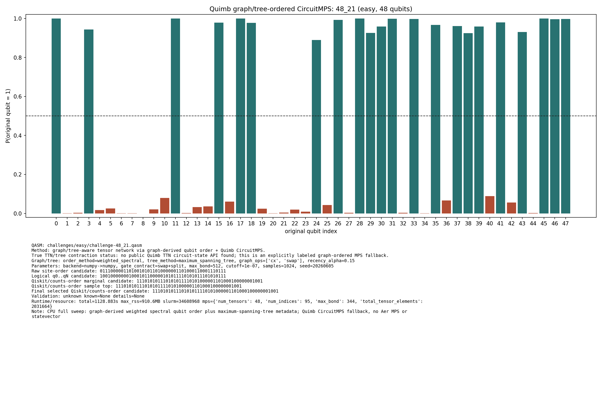

# Challenge 48_21

- Difficulty: easy
- Qubits: 48
- QASM: `challenges/easy/challenge-48_21.qasm`
- Selected answer: `111010101110101011110101000001101000100000001001`
- Selected method: `quimb_gpu_all`
- Validation: `unknown`
- Evidence rows: 3
- Normalized index page: [48_21](../../results_index/by_challenge/48_21.md)

## Distribution Figures

### Quimb graph-ordered MPS: tree_tensor_sim/all/images/challenge-48_21.quimb_tree_graph_mps.png

### Quimb graph-ordered MPS: tree_tensor_sim/all_cpu/images/challenge-48_21.quimb_tree_graph_mps.png

### Quimb graph-ordered MPS: tree_tensor_sim/fast_cpu/images/challenge-48_21.quimb_tree_graph_mps.png

## Candidate Rows

| review | selected | method | rank_type | rank | bitstring | score | count | support | fraction | validation | status | source |
|---|---:|---|---|---:|---|---:|---:|---:|---:|---|---|---|
|  | 0 | aer_tree_mps_all | sample_top | 1 | `111000101110101011010101000001101000100000001001` | 0.0057373046875 | 47 |  | 0.0057373046875 |  | ok | `../quantum-junction-tree-tensor/outputs/tree_tensor_sim/all/json/challenge-48_21.tree_tensor_mps.json` |
|  | 0 | aer_tree_mps_all | sample_top | 1 | `111000101110101011010101000001101000100000001001` | 0.005126953125 | 42 |  | 0.005126953125 |  | ok | `../quantum-junction-tree-tensor/outputs/tree_tensor_sim/all/json/challenge-48_21.tree_tensor_mps.json` |
|  | 0 | aer_tree_mps_all | sample_top | 1 | `111000101110101011010101000001101000100000001001` | 0.00439453125 | 36 |  | 0.00439453125 |  | ok | `../quantum-junction-tree-tensor/outputs/tree_tensor_sim/all/json/challenge-48_21.tree_tensor_mps.json` |
|  | 0 | aer_tree_mps_all | sample_top | 1 | `111000101110101011010101000001101000100000101001` | 0.007080078125 | 58 |  | 0.007080078125 |  | ok | `../quantum-junction-tree-tensor/outputs/tree_tensor_sim/all/json/challenge-48_21.tree_tensor_mps.json` |
|  | 0 | aer_tree_mps_all | sample_top | 1 | `111000101110101011110101000001101000100000001001` | 0.012451171875 | 102 |  | 0.012451171875 |  | ok | `../quantum-junction-tree-tensor/outputs/tree_tensor_sim/all/json/challenge-48_21.tree_tensor_mps.json` |
|  | 0 | aer_tree_mps_all | sample_top | 2 | `111000101110101011110101000001101000100000001001` | 0.015625 | 128 |  | 0.015625 |  | ok | `../quantum-junction-tree-tensor/outputs/tree_tensor_sim/all/json/challenge-48_21.tree_tensor_mps.json` |
|  | 0 | aer_tree_mps_all | sample_top | 2 | `111000101110101011110101000001101000100000001001` | 0.005859375 | 48 |  | 0.005859375 |  | ok | `../quantum-junction-tree-tensor/outputs/tree_tensor_sim/all/json/challenge-48_21.tree_tensor_mps.json` |
|  | 0 | aer_tree_mps_all | sample_top | 2 | `111000101110101011110101000001101000100000001001` | 0.0062255859375 | 51 |  | 0.0062255859375 |  | ok | `../quantum-junction-tree-tensor/outputs/tree_tensor_sim/all/json/challenge-48_21.tree_tensor_mps.json` |
|  | 0 | aer_tree_mps_all | sample_top | 2 | `111000101110101011110101000001101000100000001001` | 0.0264892578125 | 217 |  | 0.0264892578125 |  | ok | `../quantum-junction-tree-tensor/outputs/tree_tensor_sim/all/json/challenge-48_21.tree_tensor_mps.json` |
|  | 0 | aer_tree_mps_all | sample_top | 2 | `111010100110101011110111000001101000100000001001` | 0.005126953125 | 42 |  | 0.005126953125 |  | ok | `../quantum-junction-tree-tensor/outputs/tree_tensor_sim/all/json/challenge-48_21.tree_tensor_mps.json` |
|  | 0 | aer_tree_mps_all | sample_top | 3 | `111000101110101011110101000001111000100000001001` | 0.01953125 | 160 |  | 0.01953125 |  | ok | `../quantum-junction-tree-tensor/outputs/tree_tensor_sim/all/json/challenge-48_21.tree_tensor_mps.json` |
|  | 0 | aer_tree_mps_all | sample_top | 3 | `111010100110101011110111000001101000100000001001` | 0.0068359375 | 56 |  | 0.0068359375 |  | ok | `../quantum-junction-tree-tensor/outputs/tree_tensor_sim/all/json/challenge-48_21.tree_tensor_mps.json` |
|  | 0 | aer_tree_mps_all | sample_top | 3 | `111010100110101011110111000001101000100000001001` | 0.0078125 | 64 |  | 0.0078125 |  | ok | `../quantum-junction-tree-tensor/outputs/tree_tensor_sim/all/json/challenge-48_21.tree_tensor_mps.json` |
|  | 0 | aer_tree_mps_all | sample_top | 3 | `111010100110101011111101000001101000100000001001` | 0.0072021484375 | 59 |  | 0.0072021484375 |  | ok | `../quantum-junction-tree-tensor/outputs/tree_tensor_sim/all/json/challenge-48_21.tree_tensor_mps.json` |
|  | 0 | aer_tree_mps_all | sample_top | 3 | `111010101010101011110101000001101000100000001001` | 0.01611328125 | 132 |  | 0.01611328125 |  | ok | `../quantum-junction-tree-tensor/outputs/tree_tensor_sim/all/json/challenge-48_21.tree_tensor_mps.json` |
|  | 0 | aer_tree_mps_all | sample_top | 4 | `111010100110101011110111000001101000100000001001` | 0.0057373046875 | 47 |  | 0.0057373046875 |  | ok | `../quantum-junction-tree-tensor/outputs/tree_tensor_sim/all/json/challenge-48_21.tree_tensor_mps.json` |
|  | 0 | aer_tree_mps_all | sample_top | 4 | `111010100110101011111101000001101100100000001001` | 0.0115966796875 | 95 |  | 0.0115966796875 |  | ok | `../quantum-junction-tree-tensor/outputs/tree_tensor_sim/all/json/challenge-48_21.tree_tensor_mps.json` |
|  | 0 | aer_tree_mps_all | sample_top | 4 | `111010101010101011110101000001101000100000001001` | 0.019287109375 | 158 |  | 0.019287109375 |  | ok | `../quantum-junction-tree-tensor/outputs/tree_tensor_sim/all/json/challenge-48_21.tree_tensor_mps.json` |
|  | 0 | aer_tree_mps_all | sample_top | 4 | `111010101010101011110101000001101000100000001001` | 0.0074462890625 | 61 |  | 0.0074462890625 |  | ok | `../quantum-junction-tree-tensor/outputs/tree_tensor_sim/all/json/challenge-48_21.tree_tensor_mps.json` |
|  | 0 | aer_tree_mps_all | sample_top | 4 | `111010101110001011110101000001101010100000001001` | 0.0140380859375 | 115 |  | 0.0140380859375 |  | ok | `../quantum-junction-tree-tensor/outputs/tree_tensor_sim/all/json/challenge-48_21.tree_tensor_mps.json` |
|  | 0 | aer_tree_mps_all | sample_top | 5 | `111010100110101111110101000001101000100000001001` | 0.0108642578125 | 89 |  | 0.0108642578125 |  | ok | `../quantum-junction-tree-tensor/outputs/tree_tensor_sim/all/json/challenge-48_21.tree_tensor_mps.json` |
|  | 0 | aer_tree_mps_all | sample_top | 5 | `111010101010101011110101000001101000100000001001` | 0.015380859375 | 126 |  | 0.015380859375 |  | ok | `../quantum-junction-tree-tensor/outputs/tree_tensor_sim/all/json/challenge-48_21.tree_tensor_mps.json` |
|  | 0 | aer_tree_mps_all | sample_top | 5 | `111010101100101011110101000001101000100000001001` | 0.0262451171875 | 215 |  | 0.0262451171875 |  | ok | `../quantum-junction-tree-tensor/outputs/tree_tensor_sim/all/json/challenge-48_21.tree_tensor_mps.json` |
|  | 0 | aer_tree_mps_all | sample_top | 5 | `111010101110101010110101000001101000110000001001` | 0.0228271484375 | 187 |  | 0.0228271484375 |  | ok | `../quantum-junction-tree-tensor/outputs/tree_tensor_sim/all/json/challenge-48_21.tree_tensor_mps.json` |
|  | 0 | aer_tree_mps_all | sample_top | 5 | `111010101110101010110101000001101000110000001001` | 0.0184326171875 | 151 |  | 0.0184326171875 |  | ok | `../quantum-junction-tree-tensor/outputs/tree_tensor_sim/all/json/challenge-48_21.tree_tensor_mps.json` |
|  | 0 | aer_tree_mps_all | sample_top | 6 | `111010101011101011110101000001101000100000001001` | 0.006591796875 | 54 |  | 0.006591796875 |  | ok | `../quantum-junction-tree-tensor/outputs/tree_tensor_sim/all/json/challenge-48_21.tree_tensor_mps.json` |
|  | 0 | aer_tree_mps_all | sample_top | 6 | `111010101110001011110101000001101010100000001001` | 0.0167236328125 | 137 |  | 0.0167236328125 |  | ok | `../quantum-junction-tree-tensor/outputs/tree_tensor_sim/all/json/challenge-48_21.tree_tensor_mps.json` |
|  | 0 | aer_tree_mps_all | sample_top | 6 | `111010101110101010110101000001101000110000001001` | 0.0179443359375 | 147 |  | 0.0179443359375 |  | ok | `../quantum-junction-tree-tensor/outputs/tree_tensor_sim/all/json/challenge-48_21.tree_tensor_mps.json` |
|  | 0 | aer_tree_mps_all | sample_top | 6 | `111010101110101011010101000001101000100000001001` | 0.0123291015625 | 101 |  | 0.0123291015625 |  | ok | `../quantum-junction-tree-tensor/outputs/tree_tensor_sim/all/json/challenge-48_21.tree_tensor_mps.json` |
|  | 0 | aer_tree_mps_all | sample_top | 6 | `111010101110101011010101000001101000100000001001` | 0.011474609375 | 94 |  | 0.011474609375 |  | ok | `../quantum-junction-tree-tensor/outputs/tree_tensor_sim/all/json/challenge-48_21.tree_tensor_mps.json` |
|  | 0 | aer_tree_mps_all | sample_top | 7 | `111010101100101011010101000001101000100000001001` | 0.0086669921875 | 71 |  | 0.0086669921875 |  | ok | `../quantum-junction-tree-tensor/outputs/tree_tensor_sim/all/json/challenge-48_21.tree_tensor_mps.json` |
|  | 0 | aer_tree_mps_all | sample_top | 7 | `111010101110101010110101000001101000110000001001` | 0.0185546875 | 152 |  | 0.0185546875 |  | ok | `../quantum-junction-tree-tensor/outputs/tree_tensor_sim/all/json/challenge-48_21.tree_tensor_mps.json` |
|  | 0 | aer_tree_mps_all | sample_top | 7 | `111010101110101011010101000001101000100000001001` | 0.011474609375 | 94 |  | 0.011474609375 |  | ok | `../quantum-junction-tree-tensor/outputs/tree_tensor_sim/all/json/challenge-48_21.tree_tensor_mps.json` |
|  | 0 | aer_tree_mps_all | sample_top | 7 | `111010101110101011010101000001101000100000101001` | 0.0064697265625 | 53 |  | 0.0064697265625 |  | ok | `../quantum-junction-tree-tensor/outputs/tree_tensor_sim/all/json/challenge-48_21.tree_tensor_mps.json` |
|  | 0 | aer_tree_mps_all | sample_top | 7 | `111010101110101011110100000001101000100000001001` | 0.06005859375 | 492 |  | 0.06005859375 |  | ok | `../quantum-junction-tree-tensor/outputs/tree_tensor_sim/all/json/challenge-48_21.tree_tensor_mps.json` |
|  | 0 | aer_tree_mps_all | sample_top | 8 | `111010101100101011110100000001101000100000001001` | 0.0064697265625 | 53 |  | 0.0064697265625 |  | ok | `../quantum-junction-tree-tensor/outputs/tree_tensor_sim/all/json/challenge-48_21.tree_tensor_mps.json` |
|  | 0 | aer_tree_mps_all | sample_top | 8 | `111010101110101011010101000001101000100000001001` | 0.0101318359375 | 83 |  | 0.0101318359375 |  | ok | `../quantum-junction-tree-tensor/outputs/tree_tensor_sim/all/json/challenge-48_21.tree_tensor_mps.json` |
|  | 0 | aer_tree_mps_all | sample_top | 8 | `111010101110101011110100000001101000100000001001` | 0.0682373046875 | 559 |  | 0.0682373046875 |  | ok | `../quantum-junction-tree-tensor/outputs/tree_tensor_sim/all/json/challenge-48_21.tree_tensor_mps.json` |
|  | 0 | aer_tree_mps_all | sample_top | 8 | `111010101110101011110100000001101000100000001001` | 0.058837890625 | 482 |  | 0.058837890625 |  | ok | `../quantum-junction-tree-tensor/outputs/tree_tensor_sim/all/json/challenge-48_21.tree_tensor_mps.json` |
|  | 0 | aer_tree_mps_all | sample_top | 8 | `111010101110101011110101000000101000100000001001` | 0.0108642578125 | 89 |  | 0.0108642578125 |  | ok | `../quantum-junction-tree-tensor/outputs/tree_tensor_sim/all/json/challenge-48_21.tree_tensor_mps.json` |
|  | 0 | aer_tree_mps_all | sample_top | 9 | `111010101100101011110101000001101000100000001001` | 0.0413818359375 | 339 |  | 0.0413818359375 |  | ok | `../quantum-junction-tree-tensor/outputs/tree_tensor_sim/all/json/challenge-48_21.tree_tensor_mps.json` |
|  | 0 | aer_tree_mps_all | sample_top | 9 | `111010101110101011010101000001101000100000101001` | 0.0052490234375 | 43 |  | 0.0052490234375 |  | ok | `../quantum-junction-tree-tensor/outputs/tree_tensor_sim/all/json/challenge-48_21.tree_tensor_mps.json` |
|  | 0 | aer_tree_mps_all | sample_top | 9 | `111010101110101011110101000000101000100000001001` | 0.0128173828125 | 105 |  | 0.0128173828125 |  | ok | `../quantum-junction-tree-tensor/outputs/tree_tensor_sim/all/json/challenge-48_21.tree_tensor_mps.json` |
|  | 0 | aer_tree_mps_all | sample_top | 9 | `111010101110101011110101000000101000100000001001` | 0.0101318359375 | 83 |  | 0.0101318359375 |  | ok | `../quantum-junction-tree-tensor/outputs/tree_tensor_sim/all/json/challenge-48_21.tree_tensor_mps.json` |
|  | 1 | aer_tree_mps_all | sample_top | 9 | `111010101110101011110101000001101000100000001001` | 0.484375 | 3968 |  | 0.484375 |  | ok | `../quantum-junction-tree-tensor/outputs/tree_tensor_sim/all/json/challenge-48_21.tree_tensor_mps.json` |
|  | 0 | aer_tree_mps_all | sample_top | 10 | `111010101110101010110101000001101000110000001001` | 0.010009765625 | 82 |  | 0.010009765625 |  | ok | `../quantum-junction-tree-tensor/outputs/tree_tensor_sim/all/json/challenge-48_21.tree_tensor_mps.json` |
|  | 0 | aer_tree_mps_all | sample_top | 10 | `111010101110101011110100000001101000100000001001` | 0.0584716796875 | 479 |  | 0.0584716796875 |  | ok | `../quantum-junction-tree-tensor/outputs/tree_tensor_sim/all/json/challenge-48_21.tree_tensor_mps.json` |
|  | 0 | aer_tree_mps_all | sample_top | 10 | `111010101110101011110101000001101000100000000001` | 0.0052490234375 | 43 |  | 0.0052490234375 |  | ok | `../quantum-junction-tree-tensor/outputs/tree_tensor_sim/all/json/challenge-48_21.tree_tensor_mps.json` |
|  | 0 | aer_tree_mps_all | sample_top | 10 | `111010101110101011110101000001101000100000000001` | 0.0062255859375 | 51 |  | 0.0062255859375 |  | ok | `../quantum-junction-tree-tensor/outputs/tree_tensor_sim/all/json/challenge-48_21.tree_tensor_mps.json` |
|  | 0 | aer_tree_mps_all | sample_top | 10 | `111010101110101011110101000001101000100000011001` | 0.01318359375 | 108 |  | 0.01318359375 |  | ok | `../quantum-junction-tree-tensor/outputs/tree_tensor_sim/all/json/challenge-48_21.tree_tensor_mps.json` |
|  | 0 | aer_tree_mps_all | sample_top | 11 | `111010101110101011010100000001101000100000001001` | 0.0069580078125 | 57 |  | 0.0069580078125 |  | ok | `../quantum-junction-tree-tensor/outputs/tree_tensor_sim/all/json/challenge-48_21.tree_tensor_mps.json` |
|  | 0 | aer_tree_mps_all | sample_top | 11 | `111010101110101011110101000000101000100000001001` | 0.0118408203125 | 97 |  | 0.0118408203125 |  | ok | `../quantum-junction-tree-tensor/outputs/tree_tensor_sim/all/json/challenge-48_21.tree_tensor_mps.json` |
|  | 1 | aer_tree_mps_all | sample_top | 11 | `111010101110101011110101000001101000100000001001` | 0.519287109375 | 4254 |  | 0.519287109375 |  | ok | `../quantum-junction-tree-tensor/outputs/tree_tensor_sim/all/json/challenge-48_21.tree_tensor_mps.json` |
|  | 1 | aer_tree_mps_all | sample_top | 11 | `111010101110101011110101000001101000100000001001` | 0.4815673828125 | 3945 |  | 0.4815673828125 |  | ok | `../quantum-junction-tree-tensor/outputs/tree_tensor_sim/all/json/challenge-48_21.tree_tensor_mps.json` |
|  | 0 | aer_tree_mps_all | sample_top | 11 | `111010101110101011110101000001101000100000101001` | 0.00732421875 | 60 |  | 0.00732421875 |  | ok | `../quantum-junction-tree-tensor/outputs/tree_tensor_sim/all/json/challenge-48_21.tree_tensor_mps.json` |
|  | 0 | aer_tree_mps_all | sample_top | 12 | `111010101110101011010101000001101000100000001001` | 0.0452880859375 | 371 |  | 0.0452880859375 |  | ok | `../quantum-junction-tree-tensor/outputs/tree_tensor_sim/all/json/challenge-48_21.tree_tensor_mps.json` |
|  | 1 | aer_tree_mps_all | sample_top | 12 | `111010101110101011110101000001101000100000001001` | 0.477294921875 | 3910 |  | 0.477294921875 |  | ok | `../quantum-junction-tree-tensor/outputs/tree_tensor_sim/all/json/challenge-48_21.tree_tensor_mps.json` |
|  | 0 | aer_tree_mps_all | sample_top | 12 | `111010101110101011110101000001101000100000011001` | 0.009521484375 | 78 |  | 0.009521484375 |  | ok | `../quantum-junction-tree-tensor/outputs/tree_tensor_sim/all/json/challenge-48_21.tree_tensor_mps.json` |
|  | 0 | aer_tree_mps_all | sample_top | 12 | `111010101110101011110101000001101000100000011001` | 0.01123046875 | 92 |  | 0.01123046875 |  | ok | `../quantum-junction-tree-tensor/outputs/tree_tensor_sim/all/json/challenge-48_21.tree_tensor_mps.json` |
|  | 0 | aer_tree_mps_all | sample_top | 12 | `111010101110101011110101000001101000110000001001` | 0.006591796875 | 54 |  | 0.006591796875 |  | ok | `../quantum-junction-tree-tensor/outputs/tree_tensor_sim/all/json/challenge-48_21.tree_tensor_mps.json` |
|  | 0 | aer_tree_mps_all | sample_top | 13 | `111010101110101011010101000001101000100000101001` | 0.0208740234375 | 171 |  | 0.0208740234375 |  | ok | `../quantum-junction-tree-tensor/outputs/tree_tensor_sim/all/json/challenge-48_21.tree_tensor_mps.json` |
|  | 0 | aer_tree_mps_all | sample_top | 13 | `111010101110101011110101000001101000100000011001` | 0.0076904296875 | 63 |  | 0.0076904296875 |  | ok | `../quantum-junction-tree-tensor/outputs/tree_tensor_sim/all/json/challenge-48_21.tree_tensor_mps.json` |
|  | 0 | aer_tree_mps_all | sample_top | 13 | `111010101110101011110101000001101000110000001001` | 0.0072021484375 | 59 |  | 0.0072021484375 |  | ok | `../quantum-junction-tree-tensor/outputs/tree_tensor_sim/all/json/challenge-48_21.tree_tensor_mps.json` |
|  | 0 | aer_tree_mps_all | sample_top | 13 | `111010101110101011110101000001101000110000001001` | 0.005126953125 | 42 |  | 0.005126953125 |  | ok | `../quantum-junction-tree-tensor/outputs/tree_tensor_sim/all/json/challenge-48_21.tree_tensor_mps.json` |
|  | 0 | aer_tree_mps_all | sample_top | 13 | `111010101110101011110101000001101100100000001001` | 0.0164794921875 | 135 |  | 0.0164794921875 |  | ok | `../quantum-junction-tree-tensor/outputs/tree_tensor_sim/all/json/challenge-48_21.tree_tensor_mps.json` |
|  | 0 | aer_tree_mps_all | sample_top | 14 | `111010101110101011110100000001101000100000001001` | 0.0306396484375 | 251 |  | 0.0306396484375 |  | ok | `../quantum-junction-tree-tensor/outputs/tree_tensor_sim/all/json/challenge-48_21.tree_tensor_mps.json` |
|  | 0 | aer_tree_mps_all | sample_top | 14 | `111010101110101011110101000001101000110000001001` | 0.005859375 | 48 |  | 0.005859375 |  | ok | `../quantum-junction-tree-tensor/outputs/tree_tensor_sim/all/json/challenge-48_21.tree_tensor_mps.json` |
|  | 0 | aer_tree_mps_all | sample_top | 14 | `111010101110101011110101000001101100100000001001` | 0.0194091796875 | 159 |  | 0.0194091796875 |  | ok | `../quantum-junction-tree-tensor/outputs/tree_tensor_sim/all/json/challenge-48_21.tree_tensor_mps.json` |
|  | 0 | aer_tree_mps_all | sample_top | 14 | `111010101110101011110101000001101100100000001001` | 0.01513671875 | 124 |  | 0.01513671875 |  | ok | `../quantum-junction-tree-tensor/outputs/tree_tensor_sim/all/json/challenge-48_21.tree_tensor_mps.json` |
|  | 0 | aer_tree_mps_all | sample_top | 14 | `111010101110101011110101000001111000100000001001` | 0.0137939453125 | 113 |  | 0.0137939453125 |  | ok | `../quantum-junction-tree-tensor/outputs/tree_tensor_sim/all/json/challenge-48_21.tree_tensor_mps.json` |
|  | 0 | aer_tree_mps_all | sample_top | 15 | `111010101110101011110101000000101000100000001001` | 0.007080078125 | 58 |  | 0.007080078125 |  | ok | `../quantum-junction-tree-tensor/outputs/tree_tensor_sim/all/json/challenge-48_21.tree_tensor_mps.json` |
|  | 0 | aer_tree_mps_all | sample_top | 15 | `111010101110101011110101000001101100100000001001` | 0.015869140625 | 130 |  | 0.015869140625 |  | ok | `../quantum-junction-tree-tensor/outputs/tree_tensor_sim/all/json/challenge-48_21.tree_tensor_mps.json` |
|  | 0 | aer_tree_mps_all | sample_top | 15 | `111010101110101011110101000001111000100000001001` | 0.0086669921875 | 71 |  | 0.0086669921875 |  | ok | `../quantum-junction-tree-tensor/outputs/tree_tensor_sim/all/json/challenge-48_21.tree_tensor_mps.json` |
|  | 0 | aer_tree_mps_all | sample_top | 15 | `111010101110101011110101000001111000100000001001` | 0.019775390625 | 162 |  | 0.019775390625 |  | ok | `../quantum-junction-tree-tensor/outputs/tree_tensor_sim/all/json/challenge-48_21.tree_tensor_mps.json` |
|  | 0 | aer_tree_mps_all | sample_top | 15 | `111010101111101011110101000001101000100000001001` | 0.01318359375 | 108 |  | 0.01318359375 |  | ok | `../quantum-junction-tree-tensor/outputs/tree_tensor_sim/all/json/challenge-48_21.tree_tensor_mps.json` |
|  | 1 | aer_tree_mps_all | sample_top | 16 | `111010101110101011110101000001101000100000001001` | 0.234375 | 1920 |  | 0.234375 |  | ok | `../quantum-junction-tree-tensor/outputs/tree_tensor_sim/all/json/challenge-48_21.tree_tensor_mps.json` |
|  | 0 | aer_tree_mps_all | sample_top | 16 | `111010101110101011110101000001111000100000001001` | 0.0098876953125 | 81 |  | 0.0098876953125 |  | ok | `../quantum-junction-tree-tensor/outputs/tree_tensor_sim/all/json/challenge-48_21.tree_tensor_mps.json` |
|  | 0 | aer_tree_mps_all | sample_top | 16 | `111010101111101011110101000001101000100000001001` | 0.011962890625 | 98 |  | 0.011962890625 |  | ok | `../quantum-junction-tree-tensor/outputs/tree_tensor_sim/all/json/challenge-48_21.tree_tensor_mps.json` |
|  | 0 | aer_tree_mps_all | sample_top | 16 | `111010101111101011110101000001101000100000001001` | 0.0101318359375 | 83 |  | 0.0101318359375 |  | ok | `../quantum-junction-tree-tensor/outputs/tree_tensor_sim/all/json/challenge-48_21.tree_tensor_mps.json` |
|  | 0 | aer_tree_mps_all | sample_top | 16 | `111010111001101011110101000011101000100000001001` | 0.005126953125 | 42 |  | 0.005126953125 |  | ok | `../quantum-junction-tree-tensor/outputs/tree_tensor_sim/all/json/challenge-48_21.tree_tensor_mps.json` |
|  | 0 | aer_tree_mps_all | sample_top | 17 | `111010101110101011110101000001101000100000011001` | 0.0072021484375 | 59 |  | 0.0072021484375 |  | ok | `../quantum-junction-tree-tensor/outputs/tree_tensor_sim/all/json/challenge-48_21.tree_tensor_mps.json` |
|  | 0 | aer_tree_mps_all | sample_top | 17 | `111010101111101011010101000001101000100000001001` | 0.01123046875 | 92 |  | 0.01123046875 |  | ok | `../quantum-junction-tree-tensor/outputs/tree_tensor_sim/all/json/challenge-48_21.tree_tensor_mps.json` |
|  | 0 | aer_tree_mps_all | sample_top | 17 | `111010111000101011110101000001101000100000001001` | 0.0062255859375 | 51 |  | 0.0062255859375 |  | ok | `../quantum-junction-tree-tensor/outputs/tree_tensor_sim/all/json/challenge-48_21.tree_tensor_mps.json` |
|  | 0 | aer_tree_mps_all | sample_top | 17 | `111010111100101011110101000001101000100000001001` | 0.0048828125 | 40 |  | 0.0048828125 |  | ok | `../quantum-junction-tree-tensor/outputs/tree_tensor_sim/all/json/challenge-48_21.tree_tensor_mps.json` |
|  | 0 | aer_tree_mps_all | sample_top | 17 | `111010111110101011110101000001101000100000001001` | 0.005859375 | 48 |  | 0.005859375 |  | ok | `../quantum-junction-tree-tensor/outputs/tree_tensor_sim/all/json/challenge-48_21.tree_tensor_mps.json` |
|  | 0 | aer_tree_mps_all | sample_top | 18 | `111010101110101011110101000001101000110000001001` | 0.030517578125 | 250 |  | 0.030517578125 |  | ok | `../quantum-junction-tree-tensor/outputs/tree_tensor_sim/all/json/challenge-48_21.tree_tensor_mps.json` |
|  | 0 | aer_tree_mps_all | sample_top | 18 | `111010101111101011110101000001101000100000001001` | 0.0118408203125 | 97 |  | 0.0118408203125 |  | ok | `../quantum-junction-tree-tensor/outputs/tree_tensor_sim/all/json/challenge-48_21.tree_tensor_mps.json` |
|  | 0 | aer_tree_mps_all | sample_top | 18 | `111010111110101011110101000001101000100000001001` | 0.005126953125 | 42 |  | 0.005126953125 |  | ok | `../quantum-junction-tree-tensor/outputs/tree_tensor_sim/all/json/challenge-48_21.tree_tensor_mps.json` |
|  | 0 | aer_tree_mps_all | sample_top | 18 | `111010111110101011110101000001101000100000001001` | 0.006591796875 | 54 |  | 0.006591796875 |  | ok | `../quantum-junction-tree-tensor/outputs/tree_tensor_sim/all/json/challenge-48_21.tree_tensor_mps.json` |
|  | 0 | aer_tree_mps_all | sample_top | 18 | `111010111110101011110111000001101000110000001001` | 0.0054931640625 | 45 |  | 0.0054931640625 |  | ok | `../quantum-junction-tree-tensor/outputs/tree_tensor_sim/all/json/challenge-48_21.tree_tensor_mps.json` |
|  | 0 | aer_tree_mps_all | sample_top | 19 | `111010111001101011110101000001101000100000001001` | 0.00927734375 | 76 |  | 0.00927734375 |  | ok | `../quantum-junction-tree-tensor/outputs/tree_tensor_sim/all/json/challenge-48_21.tree_tensor_mps.json` |
|  | 0 | aer_tree_mps_all | sample_top | 19 | `111010111110101011110101000001101000100000001001` | 0.005859375 | 48 |  | 0.005859375 |  | ok | `../quantum-junction-tree-tensor/outputs/tree_tensor_sim/all/json/challenge-48_21.tree_tensor_mps.json` |
|  | 0 | aer_tree_mps_all | sample_top | 19 | `111011101110101011110101000001101000100000000001` | 0.0233154296875 | 191 |  | 0.0233154296875 |  | ok | `../quantum-junction-tree-tensor/outputs/tree_tensor_sim/all/json/challenge-48_21.tree_tensor_mps.json` |
|  | 0 | aer_tree_mps_all | sample_top | 19 | `111011101110101011110101000001101000100000000001` | 0.028076171875 | 230 |  | 0.028076171875 |  | ok | `../quantum-junction-tree-tensor/outputs/tree_tensor_sim/all/json/challenge-48_21.tree_tensor_mps.json` |
|  | 0 | aer_tree_mps_all | sample_top | 19 | `111011101110101011110101000001101000100000000001` | 0.008056640625 | 66 |  | 0.008056640625 |  | ok | `../quantum-junction-tree-tensor/outputs/tree_tensor_sim/all/json/challenge-48_21.tree_tensor_mps.json` |
|  | 0 | aer_tree_mps_all | sample_top | 20 | `111011101110101011110101000001101000100000000001` | 0.0115966796875 | 95 |  | 0.0115966796875 |  | ok | `../quantum-junction-tree-tensor/outputs/tree_tensor_sim/all/json/challenge-48_21.tree_tensor_mps.json` |
|  | 0 | aer_tree_mps_all | sample_top | 20 | `111011101110101011110101000001101000100000000001` | 0.0264892578125 | 217 |  | 0.0264892578125 |  | ok | `../quantum-junction-tree-tensor/outputs/tree_tensor_sim/all/json/challenge-48_21.tree_tensor_mps.json` |
|  | 0 | aer_tree_mps_all | sample_top | 20 | `111011101110101011110101000001101000100000001001` | 0.0052490234375 | 43 |  | 0.0052490234375 |  | ok | `../quantum-junction-tree-tensor/outputs/tree_tensor_sim/all/json/challenge-48_21.tree_tensor_mps.json` |
|  | 0 | aer_tree_mps_all | sample_top | 20 | `111011101110101011110101000001101000100000001001` | 0.0048828125 | 40 |  | 0.0048828125 |  | ok | `../quantum-junction-tree-tensor/outputs/tree_tensor_sim/all/json/challenge-48_21.tree_tensor_mps.json` |
|  | 0 | aer_tree_mps_all | sample_top | 20 | `111011101110101011110101000001101000100000001001` | 0.006103515625 | 50 |  | 0.006103515625 |  | ok | `../quantum-junction-tree-tensor/outputs/tree_tensor_sim/all/json/challenge-48_21.tree_tensor_mps.json` |
|  | 1 | collector_snapshot | collector_selected | 1 | `111010101110101011110101000001101000100000001001` | 0.44140625 |  |  | 0.44140625 | unknown | unknown | `research/tree_tensor_sim_session/artifacts/collector/CANDIDATES.tsv` |
|  | 1 | quimb_cpu_all | collector_evidence | 2 | `111010101110101011110101000001101000100000001001` | 0.44140625 |  |  | 0.44140625 | unknown | unknown | `outputs/tree_tensor_sim/all_cpu/json/challenge-48_21.quimb_tree_graph_mps.json` |
|  | 1 | quimb_cpu_all | final_candidate | 1 | `111010101110101011110101000001101000100000001001` | 0.3894602879561424 |  |  |  | {"known_answer_qiskit_order":null,"status":"unknown"} | ok | `../quantum-junction-tree-tensor/outputs/tree_tensor_sim/all_cpu/json/challenge-48_21.quimb_tree_graph_mps.json` |
|  | 1 | quimb_cpu_all | marginal_candidate | 1 | `111010101110101011110101000001101000100000001001` | 0.3894602879561424 |  |  |  | {"known_answer_qiskit_order":null,"status":"unknown"} | ok | `../quantum-junction-tree-tensor/outputs/tree_tensor_sim/all_cpu/json/challenge-48_21.quimb_tree_graph_mps.json` |
|  | 1 | quimb_cpu_all | sample_top | 1 | `111010101110101011110101000001101000100000001001` | 0.44140625 | 452 |  | 0.44140625 | {"known_answer_qiskit_order":null,"status":"unknown"} | ok | `../quantum-junction-tree-tensor/outputs/tree_tensor_sim/all_cpu/json/challenge-48_21.quimb_tree_graph_mps.json` |
|  | 0 | quimb_cpu_all | sample_top | 2 | `111010101110101011110100000001101000100000001001` | 0.0595703125 | 61 |  | 0.0595703125 | {"known_answer_qiskit_order":null,"status":"unknown"} | ok | `../quantum-junction-tree-tensor/outputs/tree_tensor_sim/all_cpu/json/challenge-48_21.quimb_tree_graph_mps.json` |
|  | 0 | quimb_cpu_all | sample_top | 3 | `111000101110101011110101000001111000100000001001` | 0.02734375 | 28 |  | 0.02734375 | {"known_answer_qiskit_order":null,"status":"unknown"} | ok | `../quantum-junction-tree-tensor/outputs/tree_tensor_sim/all_cpu/json/challenge-48_21.quimb_tree_graph_mps.json` |
|  | 0 | quimb_cpu_all | sample_top | 4 | `111010101110101010110101000001101000110000001001` | 0.0224609375 | 23 |  | 0.0224609375 | {"known_answer_qiskit_order":null,"status":"unknown"} | ok | `../quantum-junction-tree-tensor/outputs/tree_tensor_sim/all_cpu/json/challenge-48_21.quimb_tree_graph_mps.json` |
|  | 0 | quimb_cpu_all | sample_top | 5 | `111010101110001011110101000001101010100000001001` | 0.021484375 | 22 |  | 0.021484375 | {"known_answer_qiskit_order":null,"status":"unknown"} | ok | `../quantum-junction-tree-tensor/outputs/tree_tensor_sim/all_cpu/json/challenge-48_21.quimb_tree_graph_mps.json` |
|  | 0 | quimb_cpu_all | sample_top | 6 | `111011101110101011110101000001101000100000000001` | 0.0205078125 | 21 |  | 0.0205078125 | {"known_answer_qiskit_order":null,"status":"unknown"} | ok | `../quantum-junction-tree-tensor/outputs/tree_tensor_sim/all_cpu/json/challenge-48_21.quimb_tree_graph_mps.json` |
|  | 0 | quimb_cpu_all | sample_top | 7 | `111010101110101011110101000001101100100000001001` | 0.0166015625 | 17 |  | 0.0166015625 | {"known_answer_qiskit_order":null,"status":"unknown"} | ok | `../quantum-junction-tree-tensor/outputs/tree_tensor_sim/all_cpu/json/challenge-48_21.quimb_tree_graph_mps.json` |
|  | 0 | quimb_cpu_all | sample_top | 8 | `111010101110101011110101000000101000100000001001` | 0.0166015625 | 17 |  | 0.0166015625 | {"known_answer_qiskit_order":null,"status":"unknown"} | ok | `../quantum-junction-tree-tensor/outputs/tree_tensor_sim/all_cpu/json/challenge-48_21.quimb_tree_graph_mps.json` |
|  | 0 | quimb_cpu_all | sample_top | 9 | `111010101111101011110101000001101000100000001001` | 0.015625 | 16 |  | 0.015625 | {"known_answer_qiskit_order":null,"status":"unknown"} | ok | `../quantum-junction-tree-tensor/outputs/tree_tensor_sim/all_cpu/json/challenge-48_21.quimb_tree_graph_mps.json` |
|  | 0 | quimb_cpu_all | sample_top | 10 | `111010101010101011110101000001101000100000001001` | 0.0126953125 | 13 |  | 0.0126953125 | {"known_answer_qiskit_order":null,"status":"unknown"} | ok | `../quantum-junction-tree-tensor/outputs/tree_tensor_sim/all_cpu/json/challenge-48_21.quimb_tree_graph_mps.json` |
|  | 0 | quimb_cpu_all | sample_top | 11 | `111010101110101011110101000001101000100000011001` | 0.0126953125 | 13 |  | 0.0126953125 | {"known_answer_qiskit_order":null,"status":"unknown"} | ok | `../quantum-junction-tree-tensor/outputs/tree_tensor_sim/all_cpu/json/challenge-48_21.quimb_tree_graph_mps.json` |
|  | 0 | quimb_cpu_all | sample_top | 12 | `111010101110101011010101000001101000100000001001` | 0.01171875 | 12 |  | 0.01171875 | {"known_answer_qiskit_order":null,"status":"unknown"} | ok | `../quantum-junction-tree-tensor/outputs/tree_tensor_sim/all_cpu/json/challenge-48_21.quimb_tree_graph_mps.json` |
|  | 1 | quimb_fast_cpu | collector_evidence | 3 | `111010101110101011110101000001101000100000001001` | 0.458984375 |  |  | 0.458984375 | unknown | unknown | `outputs/tree_tensor_sim/fast_cpu/json/challenge-48_21.quimb_tree_graph_mps.json` |
|  | 1 | quimb_fast_cpu | final_candidate | 1 | `111010101110101011110101000001101000100000001001` | 0.39026578943633505 |  |  |  | {"known_answer_qiskit_order":null,"status":"unknown"} | ok | `../quantum-junction-tree-tensor/outputs/tree_tensor_sim/fast_cpu/json/challenge-48_21.quimb_tree_graph_mps.json` |
|  | 1 | quimb_fast_cpu | marginal_candidate | 1 | `111010101110101011110101000001101000100000001001` | 0.39026578943633505 |  |  |  | {"known_answer_qiskit_order":null,"status":"unknown"} | ok | `../quantum-junction-tree-tensor/outputs/tree_tensor_sim/fast_cpu/json/challenge-48_21.quimb_tree_graph_mps.json` |
|  | 1 | quimb_fast_cpu | sample_top | 1 | `111010101110101011110101000001101000100000001001` | 0.458984375 | 235 |  | 0.458984375 | {"known_answer_qiskit_order":null,"status":"unknown"} | ok | `../quantum-junction-tree-tensor/outputs/tree_tensor_sim/fast_cpu/json/challenge-48_21.quimb_tree_graph_mps.json` |
|  | 0 | quimb_fast_cpu | sample_top | 2 | `111010101110101011110100000001101000100000001001` | 0.060546875 | 31 |  | 0.060546875 | {"known_answer_qiskit_order":null,"status":"unknown"} | ok | `../quantum-junction-tree-tensor/outputs/tree_tensor_sim/fast_cpu/json/challenge-48_21.quimb_tree_graph_mps.json` |
|  | 0 | quimb_fast_cpu | sample_top | 3 | `111000101110101011110101000001111000100000001001` | 0.025390625 | 13 |  | 0.025390625 | {"known_answer_qiskit_order":null,"status":"unknown"} | ok | `../quantum-junction-tree-tensor/outputs/tree_tensor_sim/fast_cpu/json/challenge-48_21.quimb_tree_graph_mps.json` |
|  | 0 | quimb_fast_cpu | sample_top | 4 | `111011101110101011110101000001101000100000000001` | 0.0234375 | 12 |  | 0.0234375 | {"known_answer_qiskit_order":null,"status":"unknown"} | ok | `../quantum-junction-tree-tensor/outputs/tree_tensor_sim/fast_cpu/json/challenge-48_21.quimb_tree_graph_mps.json` |
|  | 0 | quimb_fast_cpu | sample_top | 5 | `111010101110101010110101000001101000110000001001` | 0.01953125 | 10 |  | 0.01953125 | {"known_answer_qiskit_order":null,"status":"unknown"} | ok | `../quantum-junction-tree-tensor/outputs/tree_tensor_sim/fast_cpu/json/challenge-48_21.quimb_tree_graph_mps.json` |
|  | 0 | quimb_fast_cpu | sample_top | 6 | `111010101110001011110101000001101010100000001001` | 0.01953125 | 10 |  | 0.01953125 | {"known_answer_qiskit_order":null,"status":"unknown"} | ok | `../quantum-junction-tree-tensor/outputs/tree_tensor_sim/fast_cpu/json/challenge-48_21.quimb_tree_graph_mps.json` |
|  | 0 | quimb_fast_cpu | sample_top | 7 | `111010101111101011110101000001101000100000001001` | 0.017578125 | 9 |  | 0.017578125 | {"known_answer_qiskit_order":null,"status":"unknown"} | ok | `../quantum-junction-tree-tensor/outputs/tree_tensor_sim/fast_cpu/json/challenge-48_21.quimb_tree_graph_mps.json` |
|  | 0 | quimb_fast_cpu | sample_top | 8 | `111010101111101011010101000001101000100000001001` | 0.017578125 | 9 |  | 0.017578125 | {"known_answer_qiskit_order":null,"status":"unknown"} | ok | `../quantum-junction-tree-tensor/outputs/tree_tensor_sim/fast_cpu/json/challenge-48_21.quimb_tree_graph_mps.json` |
|  | 0 | quimb_fast_cpu | sample_top | 9 | `111000101110101011010101000001101000100000001001` | 0.015625 | 8 |  | 0.015625 | {"known_answer_qiskit_order":null,"status":"unknown"} | ok | `../quantum-junction-tree-tensor/outputs/tree_tensor_sim/fast_cpu/json/challenge-48_21.quimb_tree_graph_mps.json` |
|  | 0 | quimb_fast_cpu | sample_top | 10 | `111010101010101011110101000001101000100000001001` | 0.015625 | 8 |  | 0.015625 | {"known_answer_qiskit_order":null,"status":"unknown"} | ok | `../quantum-junction-tree-tensor/outputs/tree_tensor_sim/fast_cpu/json/challenge-48_21.quimb_tree_graph_mps.json` |
|  | 0 | quimb_fast_cpu | sample_top | 11 | `111010101110101011110101000001101100100000001001` | 0.013671875 | 7 |  | 0.013671875 | {"known_answer_qiskit_order":null,"status":"unknown"} | ok | `../quantum-junction-tree-tensor/outputs/tree_tensor_sim/fast_cpu/json/challenge-48_21.quimb_tree_graph_mps.json` |
|  | 0 | quimb_fast_cpu | sample_top | 12 | `111010101110101011010101000001101000100000001001` | 0.01171875 | 6 |  | 0.01171875 | {"known_answer_qiskit_order":null,"status":"unknown"} | ok | `../quantum-junction-tree-tensor/outputs/tree_tensor_sim/fast_cpu/json/challenge-48_21.quimb_tree_graph_mps.json` |
|  | 1 | quimb_gpu_all | collector_evidence | 1 | `111010101110101011110101000001101000100000001001` | 0.44140625 |  |  | 0.44140625 | unknown | unknown | `outputs/tree_tensor_sim/all/json/challenge-48_21.quimb_tree_graph_mps.json` |
|  | 1 | quimb_gpu_all | final_candidate | 1 | `111010101110101011110101000001101000100000001001` | 0.3894589527847633 |  |  |  | {"known_answer_qiskit_order":null,"status":"unknown"} | ok | `../quantum-junction-tree-tensor/outputs/tree_tensor_sim/all/json/challenge-48_21.quimb_tree_graph_mps.json` |
|  | 1 | quimb_gpu_all | marginal_candidate | 1 | `111010101110101011110101000001101000100000001001` | 0.3894589527847633 |  |  |  | {"known_answer_qiskit_order":null,"status":"unknown"} | ok | `../quantum-junction-tree-tensor/outputs/tree_tensor_sim/all/json/challenge-48_21.quimb_tree_graph_mps.json` |
|  | 1 | quimb_gpu_all | sample_top | 1 | `111010101110101011110101000001101000100000001001` | 0.44140625 | 452 |  | 0.44140625 | {"known_answer_qiskit_order":null,"status":"unknown"} | ok | `../quantum-junction-tree-tensor/outputs/tree_tensor_sim/all/json/challenge-48_21.quimb_tree_graph_mps.json` |
|  | 0 | quimb_gpu_all | sample_top | 2 | `111010101110101011110100000001101000100000001001` | 0.0595703125 | 61 |  | 0.0595703125 | {"known_answer_qiskit_order":null,"status":"unknown"} | ok | `../quantum-junction-tree-tensor/outputs/tree_tensor_sim/all/json/challenge-48_21.quimb_tree_graph_mps.json` |
|  | 0 | quimb_gpu_all | sample_top | 3 | `111000101110101011110101000001111000100000001001` | 0.02734375 | 28 |  | 0.02734375 | {"known_answer_qiskit_order":null,"status":"unknown"} | ok | `../quantum-junction-tree-tensor/outputs/tree_tensor_sim/all/json/challenge-48_21.quimb_tree_graph_mps.json` |
|  | 0 | quimb_gpu_all | sample_top | 4 | `111010101110101010110101000001101000110000001001` | 0.0224609375 | 23 |  | 0.0224609375 | {"known_answer_qiskit_order":null,"status":"unknown"} | ok | `../quantum-junction-tree-tensor/outputs/tree_tensor_sim/all/json/challenge-48_21.quimb_tree_graph_mps.json` |
|  | 0 | quimb_gpu_all | sample_top | 5 | `111010101110001011110101000001101010100000001001` | 0.021484375 | 22 |  | 0.021484375 | {"known_answer_qiskit_order":null,"status":"unknown"} | ok | `../quantum-junction-tree-tensor/outputs/tree_tensor_sim/all/json/challenge-48_21.quimb_tree_graph_mps.json` |
|  | 0 | quimb_gpu_all | sample_top | 6 | `111011101110101011110101000001101000100000000001` | 0.0205078125 | 21 |  | 0.0205078125 | {"known_answer_qiskit_order":null,"status":"unknown"} | ok | `../quantum-junction-tree-tensor/outputs/tree_tensor_sim/all/json/challenge-48_21.quimb_tree_graph_mps.json` |
|  | 0 | quimb_gpu_all | sample_top | 7 | `111010101110101011110101000001101100100000001001` | 0.0166015625 | 17 |  | 0.0166015625 | {"known_answer_qiskit_order":null,"status":"unknown"} | ok | `../quantum-junction-tree-tensor/outputs/tree_tensor_sim/all/json/challenge-48_21.quimb_tree_graph_mps.json` |
|  | 0 | quimb_gpu_all | sample_top | 8 | `111010101110101011110101000000101000100000001001` | 0.0166015625 | 17 |  | 0.0166015625 | {"known_answer_qiskit_order":null,"status":"unknown"} | ok | `../quantum-junction-tree-tensor/outputs/tree_tensor_sim/all/json/challenge-48_21.quimb_tree_graph_mps.json` |
|  | 0 | quimb_gpu_all | sample_top | 9 | `111010101111101011110101000001101000100000001001` | 0.015625 | 16 |  | 0.015625 | {"known_answer_qiskit_order":null,"status":"unknown"} | ok | `../quantum-junction-tree-tensor/outputs/tree_tensor_sim/all/json/challenge-48_21.quimb_tree_graph_mps.json` |
|  | 0 | quimb_gpu_all | sample_top | 10 | `111010101010101011110101000001101000100000001001` | 0.0126953125 | 13 |  | 0.0126953125 | {"known_answer_qiskit_order":null,"status":"unknown"} | ok | `../quantum-junction-tree-tensor/outputs/tree_tensor_sim/all/json/challenge-48_21.quimb_tree_graph_mps.json` |
|  | 0 | quimb_gpu_all | sample_top | 11 | `111010101110101011110101000001101000100000011001` | 0.0126953125 | 13 |  | 0.0126953125 | {"known_answer_qiskit_order":null,"status":"unknown"} | ok | `../quantum-junction-tree-tensor/outputs/tree_tensor_sim/all/json/challenge-48_21.quimb_tree_graph_mps.json` |
|  | 0 | quimb_gpu_all | sample_top | 12 | `111010101110101011010101000001101000100000001001` | 0.01171875 | 12 |  | 0.01171875 | {"known_answer_qiskit_order":null,"status":"unknown"} | ok | `../quantum-junction-tree-tensor/outputs/tree_tensor_sim/all/json/challenge-48_21.quimb_tree_graph_mps.json` |
