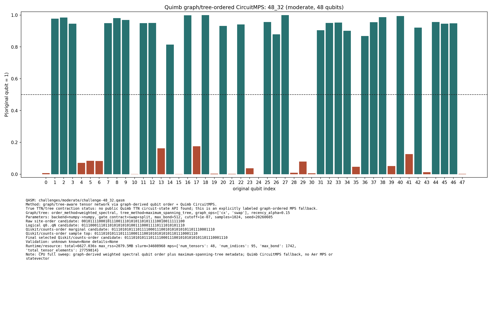

# Challenge 48_32

- Difficulty: moderate
- Qubits: 48
- QASM: `challenges/moderate/challenge-48_32.qasm`
- Selected answer: `011101010111011110001110010101010101101110001110`
- Selected method: `quimb_cpu_all`
- Validation: `unknown`
- Evidence rows: 2
- Normalized index page: [48_32](../../results_index/by_challenge/48_32.md)

## Distribution Figures

### Quimb graph-ordered MPS: tree_tensor_sim/all_cpu/images/challenge-48_32.quimb_tree_graph_mps.png

### Quimb graph-ordered MPS: tree_tensor_sim/rcm_cpu/images/challenge-48_32.quimb_tree_graph_mps.png

## Candidate Rows

| review | selected | method | rank_type | rank | bitstring | score | count | support | fraction | validation | status | source |
|---|---:|---|---|---:|---|---:|---:|---:|---:|---|---|---|
|  | 0 | aer_tree_mps_all | sample_top | 1 | `011001010111011110001110010101010001101110001110` | 0.006103515625 | 50 |  | 0.006103515625 |  | ok | `../quantum-junction-tree-tensor/outputs/tree_tensor_sim/all/json/challenge-48_32.tree_tensor_mps.json` |
|  | 0 | aer_tree_mps_all | sample_top | 2 | `011001010111011110001110010101010101101110001110` | 0.0089111328125 | 73 |  | 0.0089111328125 |  | ok | `../quantum-junction-tree-tensor/outputs/tree_tensor_sim/all/json/challenge-48_32.tree_tensor_mps.json` |
|  | 0 | aer_tree_mps_all | sample_top | 3 | `011001010111011110001110010101110001101110001110` | 0.006103515625 | 50 |  | 0.006103515625 |  | ok | `../quantum-junction-tree-tensor/outputs/tree_tensor_sim/all/json/challenge-48_32.tree_tensor_mps.json` |
|  | 0 | aer_tree_mps_all | sample_top | 4 | `011001010111011110001110010101110101101110001110` | 0.01171875 | 96 |  | 0.01171875 |  | ok | `../quantum-junction-tree-tensor/outputs/tree_tensor_sim/all/json/challenge-48_32.tree_tensor_mps.json` |
|  | 0 | aer_tree_mps_all | sample_top | 5 | `011101010110011110001110010101010101101110001110` | 0.006591796875 | 54 |  | 0.006591796875 |  | ok | `../quantum-junction-tree-tensor/outputs/tree_tensor_sim/all/json/challenge-48_32.tree_tensor_mps.json` |
|  | 0 | aer_tree_mps_all | sample_top | 6 | `011101010110011110001110010101110101101110001110` | 0.0048828125 | 40 |  | 0.0048828125 |  | ok | `../quantum-junction-tree-tensor/outputs/tree_tensor_sim/all/json/challenge-48_32.tree_tensor_mps.json` |
|  | 0 | aer_tree_mps_all | sample_top | 7 | `011101010111011110001110010101010001101110001110` | 0.0169677734375 | 139 |  | 0.0169677734375 |  | ok | `../quantum-junction-tree-tensor/outputs/tree_tensor_sim/all/json/challenge-48_32.tree_tensor_mps.json` |
|  | 0 | aer_tree_mps_all | sample_top | 8 | `011101010111011110001110010101010011101110001110` | 0.0062255859375 | 51 |  | 0.0062255859375 |  | ok | `../quantum-junction-tree-tensor/outputs/tree_tensor_sim/all/json/challenge-48_32.tree_tensor_mps.json` |
|  | 0 | aer_tree_mps_all | sample_top | 9 | `011101010111011110001110010101010101101010001110` | 0.0064697265625 | 53 |  | 0.0064697265625 |  | ok | `../quantum-junction-tree-tensor/outputs/tree_tensor_sim/all/json/challenge-48_32.tree_tensor_mps.json` |
|  | 1 | aer_tree_mps_all | sample_top | 10 | `011101010111011110001110010101010101101110001110` | 0.0325927734375 | 267 |  | 0.0325927734375 |  | ok | `../quantum-junction-tree-tensor/outputs/tree_tensor_sim/all/json/challenge-48_32.tree_tensor_mps.json` |
|  | 0 | aer_tree_mps_all | sample_top | 11 | `011101010111011110001110010101010111101110001110` | 0.012451171875 | 102 |  | 0.012451171875 |  | ok | `../quantum-junction-tree-tensor/outputs/tree_tensor_sim/all/json/challenge-48_32.tree_tensor_mps.json` |
|  | 0 | aer_tree_mps_all | sample_top | 12 | `011101010111011110001110010101011101101110001110` | 0.009521484375 | 78 |  | 0.009521484375 |  | ok | `../quantum-junction-tree-tensor/outputs/tree_tensor_sim/all/json/challenge-48_32.tree_tensor_mps.json` |
|  | 0 | aer_tree_mps_all | sample_top | 13 | `011101010111011110001110010101110001101110001110` | 0.0159912109375 | 131 |  | 0.0159912109375 |  | ok | `../quantum-junction-tree-tensor/outputs/tree_tensor_sim/all/json/challenge-48_32.tree_tensor_mps.json` |
|  | 0 | aer_tree_mps_all | sample_top | 14 | `011101010111011110001110010101110101101010001110` | 0.0064697265625 | 53 |  | 0.0064697265625 |  | ok | `../quantum-junction-tree-tensor/outputs/tree_tensor_sim/all/json/challenge-48_32.tree_tensor_mps.json` |
|  | 0 | aer_tree_mps_all | sample_top | 15 | `011101010111011110001110010101110101101110001110` | 0.0306396484375 | 251 |  | 0.0306396484375 |  | ok | `../quantum-junction-tree-tensor/outputs/tree_tensor_sim/all/json/challenge-48_32.tree_tensor_mps.json` |
|  | 0 | aer_tree_mps_all | sample_top | 16 | `011101010111011110001110010101110111101110001110` | 0.00830078125 | 68 |  | 0.00830078125 |  | ok | `../quantum-junction-tree-tensor/outputs/tree_tensor_sim/all/json/challenge-48_32.tree_tensor_mps.json` |
|  | 0 | aer_tree_mps_all | sample_top | 17 | `011101010111011110001110010101111001101110001110` | 0.0054931640625 | 45 |  | 0.0054931640625 |  | ok | `../quantum-junction-tree-tensor/outputs/tree_tensor_sim/all/json/challenge-48_32.tree_tensor_mps.json` |
|  | 0 | aer_tree_mps_all | sample_top | 18 | `011101010111011110001110010101111101101110001110` | 0.0078125 | 64 |  | 0.0078125 |  | ok | `../quantum-junction-tree-tensor/outputs/tree_tensor_sim/all/json/challenge-48_32.tree_tensor_mps.json` |
|  | 0 | aer_tree_mps_all | sample_top | 19 | `011101110111011110001110010101010101101110001110` | 0.0068359375 | 56 |  | 0.0068359375 |  | ok | `../quantum-junction-tree-tensor/outputs/tree_tensor_sim/all/json/challenge-48_32.tree_tensor_mps.json` |
|  | 0 | aer_tree_mps_all | sample_top | 20 | `011101110111011110001110010101110101101110001110` | 0.004638671875 | 38 |  | 0.004638671875 |  | ok | `../quantum-junction-tree-tensor/outputs/tree_tensor_sim/all/json/challenge-48_32.tree_tensor_mps.json` |
|  | 1 | collector_snapshot | collector_selected | 1 | `011101010111011110001110010101010101101110001110` | 0.265625 |  |  | 0.265625 | unknown | unknown | `research/tree_tensor_sim_session/artifacts/collector/CANDIDATES.tsv` |
|  | 1 | quimb_cpu_all | collector_evidence | 1 | `011101010111011110001110010101010101101110001110` | 0.265625 |  |  | 0.265625 | unknown | unknown | `outputs/tree_tensor_sim/all_cpu/json/challenge-48_32.quimb_tree_graph_mps.json` |
|  | 1 | quimb_cpu_all | final_candidate | 1 | `011101010111011110001110010101010101101110001110` | 0.3136779677207837 |  |  |  | {"known_answer_qiskit_order":null,"status":"unknown"} | ok | `../quantum-junction-tree-tensor/outputs/tree_tensor_sim/all_cpu/json/challenge-48_32.quimb_tree_graph_mps.json` |
|  | 1 | quimb_cpu_all | marginal_candidate | 1 | `011101010111011110001110010101010101101110001110` | 0.3136779677207837 |  |  |  | {"known_answer_qiskit_order":null,"status":"unknown"} | ok | `../quantum-junction-tree-tensor/outputs/tree_tensor_sim/all_cpu/json/challenge-48_32.quimb_tree_graph_mps.json` |
|  | 1 | quimb_cpu_all | sample_top | 1 | `011101010111011110001110010101010101101110001110` | 0.265625 | 272 |  | 0.265625 | {"known_answer_qiskit_order":null,"status":"unknown"} | ok | `../quantum-junction-tree-tensor/outputs/tree_tensor_sim/all_cpu/json/challenge-48_32.quimb_tree_graph_mps.json` |
|  | 0 | quimb_cpu_all | sample_top | 2 | `011101010111011110001110010101110001101110001110` | 0.0546875 | 56 |  | 0.0546875 | {"known_answer_qiskit_order":null,"status":"unknown"} | ok | `../quantum-junction-tree-tensor/outputs/tree_tensor_sim/all_cpu/json/challenge-48_32.quimb_tree_graph_mps.json` |
|  | 0 | quimb_cpu_all | sample_top | 3 | `011101110111011110001110010101010101101110001110` | 0.041015625 | 42 |  | 0.041015625 | {"known_answer_qiskit_order":null,"status":"unknown"} | ok | `../quantum-junction-tree-tensor/outputs/tree_tensor_sim/all_cpu/json/challenge-48_32.quimb_tree_graph_mps.json` |
|  | 0 | quimb_cpu_all | sample_top | 4 | `011101010111011110001110010001010101101110001110` | 0.01953125 | 20 |  | 0.01953125 | {"known_answer_qiskit_order":null,"status":"unknown"} | ok | `../quantum-junction-tree-tensor/outputs/tree_tensor_sim/all_cpu/json/challenge-48_32.quimb_tree_graph_mps.json` |
|  | 0 | quimb_cpu_all | sample_top | 5 | `011101010111111110001110010101010101101111101110` | 0.0185546875 | 19 |  | 0.0185546875 | {"known_answer_qiskit_order":null,"status":"unknown"} | ok | `../quantum-junction-tree-tensor/outputs/tree_tensor_sim/all_cpu/json/challenge-48_32.quimb_tree_graph_mps.json` |
|  | 0 | quimb_cpu_all | sample_top | 6 | `010101011111011110001110010101010100001110001110` | 0.0126953125 | 13 |  | 0.0126953125 | {"known_answer_qiskit_order":null,"status":"unknown"} | ok | `../quantum-junction-tree-tensor/outputs/tree_tensor_sim/all_cpu/json/challenge-48_32.quimb_tree_graph_mps.json` |
|  | 0 | quimb_cpu_all | sample_top | 7 | `011101010110011100101110010101010101101110001110` | 0.0126953125 | 13 |  | 0.0126953125 | {"known_answer_qiskit_order":null,"status":"unknown"} | ok | `../quantum-junction-tree-tensor/outputs/tree_tensor_sim/all_cpu/json/challenge-48_32.quimb_tree_graph_mps.json` |
|  | 0 | quimb_cpu_all | sample_top | 8 | `011101010110011110101110010101010101101110001110` | 0.0126953125 | 13 |  | 0.0126953125 | {"known_answer_qiskit_order":null,"status":"unknown"} | ok | `../quantum-junction-tree-tensor/outputs/tree_tensor_sim/all_cpu/json/challenge-48_32.quimb_tree_graph_mps.json` |
|  | 0 | quimb_cpu_all | sample_top | 9 | `011001010111011110001110010101010101101110001110` | 0.01171875 | 12 |  | 0.01171875 | {"known_answer_qiskit_order":null,"status":"unknown"} | ok | `../quantum-junction-tree-tensor/outputs/tree_tensor_sim/all_cpu/json/challenge-48_32.quimb_tree_graph_mps.json` |
|  | 0 | quimb_cpu_all | sample_top | 10 | `011100010111001110001110010101010101101110001110` | 0.01171875 | 12 |  | 0.01171875 | {"known_answer_qiskit_order":null,"status":"unknown"} | ok | `../quantum-junction-tree-tensor/outputs/tree_tensor_sim/all_cpu/json/challenge-48_32.quimb_tree_graph_mps.json` |
|  | 0 | quimb_cpu_all | sample_top | 11 | `011100010111011110001110010101010101101110001110` | 0.01171875 | 12 |  | 0.01171875 | {"known_answer_qiskit_order":null,"status":"unknown"} | ok | `../quantum-junction-tree-tensor/outputs/tree_tensor_sim/all_cpu/json/challenge-48_32.quimb_tree_graph_mps.json` |
|  | 0 | quimb_cpu_all | sample_top | 12 | `001101010111010110001110010101010001101110001110` | 0.009765625 | 10 |  | 0.009765625 | {"known_answer_qiskit_order":null,"status":"unknown"} | ok | `../quantum-junction-tree-tensor/outputs/tree_tensor_sim/all_cpu/json/challenge-48_32.quimb_tree_graph_mps.json` |
|  | 1 | quimb_rcm_cpu | collector_evidence | 2 | `011101010111011110001110010101010101101110001110` | 0.0234375 |  |  | 0.0234375 | unknown | unknown | `outputs/tree_tensor_sim/rcm_cpu/json/challenge-48_32.quimb_tree_graph_mps.json` |
|  | 1 | quimb_rcm_cpu | final_candidate | 1 | `011101010111011110001110010101010101101110001110` | 0.01430077475291991 |  |  |  | {"known_answer_qiskit_order":null,"status":"unknown"} | ok | `../quantum-junction-tree-tensor/outputs/tree_tensor_sim/rcm_cpu/json/challenge-48_32.quimb_tree_graph_mps.json` |
|  | 0 | quimb_rcm_cpu | marginal_candidate | 1 | `011101010111011110001110010101110101101110001110` | 0.01430077475291991 |  |  |  | {"known_answer_qiskit_order":null,"status":"unknown"} | ok | `../quantum-junction-tree-tensor/outputs/tree_tensor_sim/rcm_cpu/json/challenge-48_32.quimb_tree_graph_mps.json` |
|  | 1 | quimb_rcm_cpu | sample_top | 1 | `011101010111011110001110010101010101101110001110` | 0.0234375 | 12 |  | 0.0234375 | {"known_answer_qiskit_order":null,"status":"unknown"} | ok | `../quantum-junction-tree-tensor/outputs/tree_tensor_sim/rcm_cpu/json/challenge-48_32.quimb_tree_graph_mps.json` |
|  | 0 | quimb_rcm_cpu | sample_top | 2 | `011101010111011110001110010101110101101110001110` | 0.0234375 | 12 |  | 0.0234375 | {"known_answer_qiskit_order":null,"status":"unknown"} | ok | `../quantum-junction-tree-tensor/outputs/tree_tensor_sim/rcm_cpu/json/challenge-48_32.quimb_tree_graph_mps.json` |
|  | 0 | quimb_rcm_cpu | sample_top | 3 | `011001010111011110001110010101110101101110001110` | 0.015625 | 8 |  | 0.015625 | {"known_answer_qiskit_order":null,"status":"unknown"} | ok | `../quantum-junction-tree-tensor/outputs/tree_tensor_sim/rcm_cpu/json/challenge-48_32.quimb_tree_graph_mps.json` |
|  | 0 | quimb_rcm_cpu | sample_top | 4 | `011101010111011110001010010101010111101110001110` | 0.01171875 | 6 |  | 0.01171875 | {"known_answer_qiskit_order":null,"status":"unknown"} | ok | `../quantum-junction-tree-tensor/outputs/tree_tensor_sim/rcm_cpu/json/challenge-48_32.quimb_tree_graph_mps.json` |
|  | 0 | quimb_rcm_cpu | sample_top | 5 | `011101010111011110001010010101110101101110001110` | 0.01171875 | 6 |  | 0.01171875 | {"known_answer_qiskit_order":null,"status":"unknown"} | ok | `../quantum-junction-tree-tensor/outputs/tree_tensor_sim/rcm_cpu/json/challenge-48_32.quimb_tree_graph_mps.json` |
|  | 0 | quimb_rcm_cpu | sample_top | 6 | `011101010111011110001000010101010101101110001110` | 0.01171875 | 6 |  | 0.01171875 | {"known_answer_qiskit_order":null,"status":"unknown"} | ok | `../quantum-junction-tree-tensor/outputs/tree_tensor_sim/rcm_cpu/json/challenge-48_32.quimb_tree_graph_mps.json` |
|  | 0 | quimb_rcm_cpu | sample_top | 7 | `011001010111011110001110010101010101101110001110` | 0.01171875 | 6 |  | 0.01171875 | {"known_answer_qiskit_order":null,"status":"unknown"} | ok | `../quantum-junction-tree-tensor/outputs/tree_tensor_sim/rcm_cpu/json/challenge-48_32.quimb_tree_graph_mps.json` |
|  | 0 | quimb_rcm_cpu | sample_top | 8 | `011101010111011110001010010101010101101110001110` | 0.01171875 | 6 |  | 0.01171875 | {"known_answer_qiskit_order":null,"status":"unknown"} | ok | `../quantum-junction-tree-tensor/outputs/tree_tensor_sim/rcm_cpu/json/challenge-48_32.quimb_tree_graph_mps.json` |
|  | 0 | quimb_rcm_cpu | sample_top | 9 | `011101010111011110001000010101110101101110001110` | 0.01171875 | 6 |  | 0.01171875 | {"known_answer_qiskit_order":null,"status":"unknown"} | ok | `../quantum-junction-tree-tensor/outputs/tree_tensor_sim/rcm_cpu/json/challenge-48_32.quimb_tree_graph_mps.json` |
|  | 0 | quimb_rcm_cpu | sample_top | 10 | `011101010111011110001110010101010111101110001110` | 0.009765625 | 5 |  | 0.009765625 | {"known_answer_qiskit_order":null,"status":"unknown"} | ok | `../quantum-junction-tree-tensor/outputs/tree_tensor_sim/rcm_cpu/json/challenge-48_32.quimb_tree_graph_mps.json` |
|  | 0 | quimb_rcm_cpu | sample_top | 11 | `011101010111011110001110010101110001101110001110` | 0.009765625 | 5 |  | 0.009765625 | {"known_answer_qiskit_order":null,"status":"unknown"} | ok | `../quantum-junction-tree-tensor/outputs/tree_tensor_sim/rcm_cpu/json/challenge-48_32.quimb_tree_graph_mps.json` |
|  | 0 | quimb_rcm_cpu | sample_top | 12 | `011101010111011110001010010101110101101110001100` | 0.009765625 | 5 |  | 0.009765625 | {"known_answer_qiskit_order":null,"status":"unknown"} | ok | `../quantum-junction-tree-tensor/outputs/tree_tensor_sim/rcm_cpu/json/challenge-48_32.quimb_tree_graph_mps.json` |
