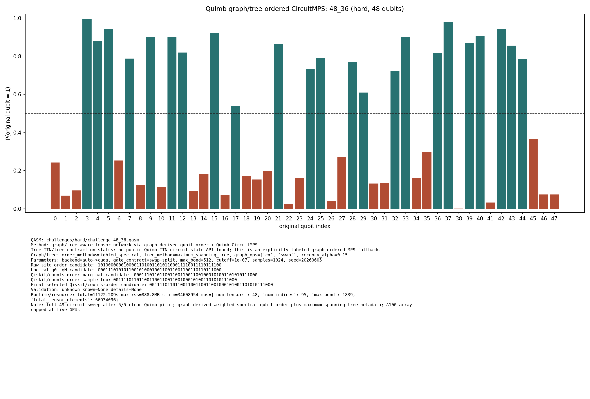

# Challenge 48_36

- Difficulty: hard
- Qubits: 48
- QASM: `challenges/hard/challenge-48_36.qasm`
- Selected answer: `001111011011001100110011001000101001101010111000`
- Selected method: `quimb_gpu_all`
- Validation: `unknown`
- Evidence rows: 3
- Normalized index page: [48_36](../../results_index/by_challenge/48_36.md)

## Distribution Figures

### Quimb graph-ordered MPS: tree_tensor_sim/all/images/challenge-48_36.quimb_tree_graph_mps.png

### Quimb graph-ordered MPS: tree_tensor_sim/rcm_cpu/images/challenge-48_36.quimb_tree_graph_mps.png

## Candidate Rows

| review | selected | method | rank_type | rank | bitstring | score | count | support | fraction | validation | status | source |
|---|---:|---|---|---:|---|---:|---:|---:|---:|---|---|---|
|  | 0 | aer_mps_pilot | aggregate_rank | 1 | `000001001011001100010011101001001000101010110111` | 0.0016666666666666668 |  | 2 | 0.0016666666666666668 | unstable_top1_vs_aggregate | unstable_top1_vs_aggregate | `../quantum-junction-tree-tensor/agent_work/mps_distill/summaries/pilot_summary.json` |
|  | 0 | aer_mps_pilot | aggregate_rank | 2 | `000001011010101000010011100001101001101011101001` | 0.0016666666666666668 |  | 2 | 0.0016666666666666668 | unstable_top1_vs_aggregate | unstable_top1_vs_aggregate | `../quantum-junction-tree-tensor/agent_work/mps_distill/summaries/pilot_summary.json` |
|  | 0 | aer_mps_pilot | aggregate_rank | 3 | `000000001010001100010101000100101001001110101001` | 0.0008333333333333334 |  | 1 | 0.0008333333333333334 | unstable_top1_vs_aggregate | unstable_top1_vs_aggregate | `../quantum-junction-tree-tensor/agent_work/mps_distill/summaries/pilot_summary.json` |
|  | 0 | aer_mps_pilot | aggregate_rank | 4 | `000001001000101000110010100100001001100010111000` | 0.0008333333333333334 |  | 1 | 0.0008333333333333334 | unstable_top1_vs_aggregate | unstable_top1_vs_aggregate | `../quantum-junction-tree-tensor/agent_work/mps_distill/summaries/pilot_summary.json` |
|  | 0 | aer_mps_pilot | aggregate_rank | 5 | `000001001000101100010011110001101001101011101001` | 0.0008333333333333334 |  | 1 | 0.0008333333333333334 | unstable_top1_vs_aggregate | unstable_top1_vs_aggregate | `../quantum-junction-tree-tensor/agent_work/mps_distill/summaries/pilot_summary.json` |
|  | 0 | aer_mps_pilot | collector_evidence | 3 | `000001001011001100010011101001001000101010110111` | 0.167 |  |  | 0.167 | unstable_top1_vs_aggregate | unstable_top1_vs_aggregate | `agent_work/mps_distill/summaries/pilot_candidates.tsv` |
|  | 0 | aer_mps_pilot | top1_vote_rank | 1 | `000000001010001100010101000100101001001110101001` | 0.16666666666666666 |  | 1 | 0.16666666666666666 | unstable_top1_vs_aggregate | unstable_top1_vs_aggregate | `../quantum-junction-tree-tensor/agent_work/mps_distill/summaries/pilot_summary.json` |
|  | 0 | aer_mps_pilot | top1_vote_rank | 2 | `000000101010001100010010000100101001000000101000` | 0.16666666666666666 |  | 1 | 0.16666666666666666 | unstable_top1_vs_aggregate | unstable_top1_vs_aggregate | `../quantum-junction-tree-tensor/agent_work/mps_distill/summaries/pilot_summary.json` |
|  | 0 | aer_mps_pilot | top1_vote_rank | 3 | `000000001010000000011011000000101001101010101100` | 0.16666666666666666 |  | 1 | 0.16666666666666666 | unstable_top1_vs_aggregate | unstable_top1_vs_aggregate | `../quantum-junction-tree-tensor/agent_work/mps_distill/summaries/pilot_summary.json` |
|  | 0 | aer_mps_pilot | top1_vote_rank | 4 | `000000000011001001010011001100001001101010111100` | 0.16666666666666666 |  | 1 | 0.16666666666666666 | unstable_top1_vs_aggregate | unstable_top1_vs_aggregate | `../quantum-junction-tree-tensor/agent_work/mps_distill/summaries/pilot_summary.json` |
|  | 0 | aer_mps_pilot | top1_vote_rank | 5 | `000000000010011000010011001000101001101010111100` | 0.16666666666666666 |  | 1 | 0.16666666666666666 | unstable_top1_vs_aggregate | unstable_top1_vs_aggregate | `../quantum-junction-tree-tensor/agent_work/mps_distill/summaries/pilot_summary.json` |
|  | 0 | aer_tree_mps_all | sample_top | 1 | `000010011010001100110001000000101001101010111000` | 0.000244140625 | 2 |  | 0.000244140625 |  | ok | `../quantum-junction-tree-tensor/outputs/tree_tensor_sim/all/json/challenge-48_36.tree_tensor_mps.json` |
|  | 0 | aer_tree_mps_all | sample_top | 2 | `000101011010001100100011001000101001101010111000` | 0.000244140625 | 2 |  | 0.000244140625 |  | ok | `../quantum-junction-tree-tensor/outputs/tree_tensor_sim/all/json/challenge-48_36.tree_tensor_mps.json` |
|  | 0 | aer_tree_mps_all | sample_top | 3 | `000110011010001100000011001100101001100010101000` | 0.000244140625 | 2 |  | 0.000244140625 |  | ok | `../quantum-junction-tree-tensor/outputs/tree_tensor_sim/all/json/challenge-48_36.tree_tensor_mps.json` |
|  | 0 | aer_tree_mps_all | sample_top | 4 | `000110011011001100010000001000101001101010111000` | 0.000244140625 | 2 |  | 0.000244140625 |  | ok | `../quantum-junction-tree-tensor/outputs/tree_tensor_sim/all/json/challenge-48_36.tree_tensor_mps.json` |
|  | 0 | aer_tree_mps_all | sample_top | 5 | `000110011011001100010001001000101001101010111001` | 0.000244140625 | 2 |  | 0.000244140625 |  | ok | `../quantum-junction-tree-tensor/outputs/tree_tensor_sim/all/json/challenge-48_36.tree_tensor_mps.json` |
|  | 0 | aer_tree_mps_all | sample_top | 6 | `000111011011000100110001001100101001101010101000` | 0.000244140625 | 2 |  | 0.000244140625 |  | ok | `../quantum-junction-tree-tensor/outputs/tree_tensor_sim/all/json/challenge-48_36.tree_tensor_mps.json` |
|  | 0 | aer_tree_mps_all | sample_top | 7 | `000111011011001100010000001000101001100010111000` | 0.000244140625 | 2 |  | 0.000244140625 |  | ok | `../quantum-junction-tree-tensor/outputs/tree_tensor_sim/all/json/challenge-48_36.tree_tensor_mps.json` |
|  | 0 | aer_tree_mps_all | sample_top | 8 | `000111011011001100110001000000101101101000111000` | 0.000244140625 | 2 |  | 0.000244140625 |  | ok | `../quantum-junction-tree-tensor/outputs/tree_tensor_sim/all/json/challenge-48_36.tree_tensor_mps.json` |
|  | 0 | aer_tree_mps_all | sample_top | 9 | `000111011011001100110001001000001001111010111000` | 0.000244140625 | 2 |  | 0.000244140625 |  | ok | `../quantum-junction-tree-tensor/outputs/tree_tensor_sim/all/json/challenge-48_36.tree_tensor_mps.json` |
|  | 0 | aer_tree_mps_all | sample_top | 10 | `000111011011001100110001001000101001100010111000` | 0.000244140625 | 2 |  | 0.000244140625 |  | ok | `../quantum-junction-tree-tensor/outputs/tree_tensor_sim/all/json/challenge-48_36.tree_tensor_mps.json` |
|  | 0 | aer_tree_mps_all | sample_top | 11 | `000111011011001100110011001000101001100001111000` | 0.000244140625 | 2 |  | 0.000244140625 |  | ok | `../quantum-junction-tree-tensor/outputs/tree_tensor_sim/all/json/challenge-48_36.tree_tensor_mps.json` |
|  | 0 | aer_tree_mps_all | sample_top | 12 | `000111011011001100110011001000101001100010111000` | 0.000244140625 | 2 |  | 0.000244140625 |  | ok | `../quantum-junction-tree-tensor/outputs/tree_tensor_sim/all/json/challenge-48_36.tree_tensor_mps.json` |
|  | 0 | aer_tree_mps_all | sample_top | 13 | `001101011011001100110001001000101001101010111000` | 0.000244140625 | 2 |  | 0.000244140625 |  | ok | `../quantum-junction-tree-tensor/outputs/tree_tensor_sim/all/json/challenge-48_36.tree_tensor_mps.json` |
|  | 0 | aer_tree_mps_all | sample_top | 14 | `001111011010001100110001000001101011100010111001` | 0.000244140625 | 2 |  | 0.000244140625 |  | ok | `../quantum-junction-tree-tensor/outputs/tree_tensor_sim/all/json/challenge-48_36.tree_tensor_mps.json` |
|  | 0 | aer_tree_mps_all | sample_top | 15 | `001111011011001100010001001000101001100010111000` | 0.000244140625 | 2 |  | 0.000244140625 |  | ok | `../quantum-junction-tree-tensor/outputs/tree_tensor_sim/all/json/challenge-48_36.tree_tensor_mps.json` |
|  | 0 | aer_tree_mps_all | sample_top | 16 | `100110011011001100010011000100101001101010111001` | 0.000244140625 | 2 |  | 0.000244140625 |  | ok | `../quantum-junction-tree-tensor/outputs/tree_tensor_sim/all/json/challenge-48_36.tree_tensor_mps.json` |
|  | 0 | aer_tree_mps_all | sample_top | 17 | `100111011011000100110011001000101001100010111000` | 0.000244140625 | 2 |  | 0.000244140625 |  | ok | `../quantum-junction-tree-tensor/outputs/tree_tensor_sim/all/json/challenge-48_36.tree_tensor_mps.json` |
|  | 0 | aer_tree_mps_all | sample_top | 18 | `101111011011101100110001001000001001101010111000` | 0.000244140625 | 2 |  | 0.000244140625 |  | ok | `../quantum-junction-tree-tensor/outputs/tree_tensor_sim/all/json/challenge-48_36.tree_tensor_mps.json` |
|  | 0 | aer_tree_mps_all | sample_top | 19 | `110100011010001100110010001101101001101010111000` | 0.000244140625 | 2 |  | 0.000244140625 |  | ok | `../quantum-junction-tree-tensor/outputs/tree_tensor_sim/all/json/challenge-48_36.tree_tensor_mps.json` |
|  | 0 | aer_tree_mps_all | sample_top | 20 | `110111011010001100010011001001101001100010111000` | 0.000244140625 | 2 |  | 0.000244140625 |  | ok | `../quantum-junction-tree-tensor/outputs/tree_tensor_sim/all/json/challenge-48_36.tree_tensor_mps.json` |
|  | 1 | collector_snapshot | collector_selected | 1 | `001111011011001100110011001000101001101010111000` | 0.0078125 |  |  | 0.0078125 | unknown | unknown | `research/tree_tensor_sim_session/artifacts/collector/CANDIDATES.tsv` |
|  | 1 | quimb_gpu_all | collector_evidence | 1 | `001111011011001100110011001000101001101010111000` | 0.0078125 |  |  | 0.0078125 | unknown | unknown | `outputs/tree_tensor_sim/all/json/challenge-48_36.quimb_tree_graph_mps.json` |
|  | 1 | quimb_gpu_all | final_candidate | 1 | `001111011011001100110011001000101001101010111000` | 0.04019502397305619 |  |  |  | {"known_answer_qiskit_order":null,"status":"unknown"} | ok | `../quantum-junction-tree-tensor/outputs/tree_tensor_sim/all/json/challenge-48_36.quimb_tree_graph_mps.json` |
|  | 0 | quimb_gpu_all | marginal_candidate | 1 | `000111011011001100110011001000101001101010111000` | 0.04019502397305619 |  |  |  | {"known_answer_qiskit_order":null,"status":"unknown"} | ok | `../quantum-junction-tree-tensor/outputs/tree_tensor_sim/all/json/challenge-48_36.quimb_tree_graph_mps.json` |
|  | 1 | quimb_gpu_all | sample_top | 1 | `001111011011001100110011001000101001101010111000` | 0.0078125 | 8 |  | 0.0078125 | {"known_answer_qiskit_order":null,"status":"unknown"} | ok | `../quantum-junction-tree-tensor/outputs/tree_tensor_sim/all/json/challenge-48_36.quimb_tree_graph_mps.json` |
|  | 0 | quimb_gpu_all | sample_top | 2 | `000111011011001100110011001000001001101010111000` | 0.0048828125 | 5 |  | 0.0048828125 | {"known_answer_qiskit_order":null,"status":"unknown"} | ok | `../quantum-junction-tree-tensor/outputs/tree_tensor_sim/all/json/challenge-48_36.quimb_tree_graph_mps.json` |
|  | 0 | quimb_gpu_all | sample_top | 3 | `000111011011001100110011001000001001101011111000` | 0.00390625 | 4 |  | 0.00390625 | {"known_answer_qiskit_order":null,"status":"unknown"} | ok | `../quantum-junction-tree-tensor/outputs/tree_tensor_sim/all/json/challenge-48_36.quimb_tree_graph_mps.json` |
|  | 0 | quimb_gpu_all | sample_top | 4 | `000111011011001100110011001000101001101011111000` | 0.0029296875 | 3 |  | 0.0029296875 | {"known_answer_qiskit_order":null,"status":"unknown"} | ok | `../quantum-junction-tree-tensor/outputs/tree_tensor_sim/all/json/challenge-48_36.quimb_tree_graph_mps.json` |
|  | 0 | quimb_gpu_all | sample_top | 5 | `000111011010001100110011001000101001101010111000` | 0.0029296875 | 3 |  | 0.0029296875 | {"known_answer_qiskit_order":null,"status":"unknown"} | ok | `../quantum-junction-tree-tensor/outputs/tree_tensor_sim/all/json/challenge-48_36.quimb_tree_graph_mps.json` |
|  | 0 | quimb_gpu_all | sample_top | 6 | `000111011011001100110011001000101001101010111000` | 0.0029296875 | 3 |  | 0.0029296875 | {"known_answer_qiskit_order":null,"status":"unknown"} | ok | `../quantum-junction-tree-tensor/outputs/tree_tensor_sim/all/json/challenge-48_36.quimb_tree_graph_mps.json` |
|  | 0 | quimb_gpu_all | sample_top | 7 | `000111011011001100110010001000101001101010111000` | 0.0029296875 | 3 |  | 0.0029296875 | {"known_answer_qiskit_order":null,"status":"unknown"} | ok | `../quantum-junction-tree-tensor/outputs/tree_tensor_sim/all/json/challenge-48_36.quimb_tree_graph_mps.json` |
|  | 0 | quimb_gpu_all | sample_top | 8 | `000111011011001000110011001000101001101110111001` | 0.001953125 | 2 |  | 0.001953125 | {"known_answer_qiskit_order":null,"status":"unknown"} | ok | `../quantum-junction-tree-tensor/outputs/tree_tensor_sim/all/json/challenge-48_36.quimb_tree_graph_mps.json` |
|  | 0 | quimb_gpu_all | sample_top | 9 | `000111011011001100110011001000001000101010111000` | 0.001953125 | 2 |  | 0.001953125 | {"known_answer_qiskit_order":null,"status":"unknown"} | ok | `../quantum-junction-tree-tensor/outputs/tree_tensor_sim/all/json/challenge-48_36.quimb_tree_graph_mps.json` |
|  | 0 | quimb_gpu_all | sample_top | 10 | `000111011011001100110011001000101101101000111000` | 0.001953125 | 2 |  | 0.001953125 | {"known_answer_qiskit_order":null,"status":"unknown"} | ok | `../quantum-junction-tree-tensor/outputs/tree_tensor_sim/all/json/challenge-48_36.quimb_tree_graph_mps.json` |
|  | 0 | quimb_gpu_all | sample_top | 11 | `000111011010001100110011001000001001101010111000` | 0.001953125 | 2 |  | 0.001953125 | {"known_answer_qiskit_order":null,"status":"unknown"} | ok | `../quantum-junction-tree-tensor/outputs/tree_tensor_sim/all/json/challenge-48_36.quimb_tree_graph_mps.json` |
|  | 0 | quimb_gpu_all | sample_top | 12 | `000111011011001100100011001000001001101010111000` | 0.001953125 | 2 |  | 0.001953125 | {"known_answer_qiskit_order":null,"status":"unknown"} | ok | `../quantum-junction-tree-tensor/outputs/tree_tensor_sim/all/json/challenge-48_36.quimb_tree_graph_mps.json` |
|  | 0 | quimb_rcm_cpu | collector_evidence | 2 | `001000010010111000010000100001111011011011011001` | 0.001953125 |  |  | 0.001953125 | unknown | unknown | `outputs/tree_tensor_sim/rcm_cpu/json/challenge-48_36.quimb_tree_graph_mps.json` |
|  | 0 | quimb_rcm_cpu | final_candidate | 1 | `001000010010111000010000100001111011011011011001` | 0.0005808994007500123 |  |  |  | {"known_answer_qiskit_order":null,"status":"unknown"} | ok | `../quantum-junction-tree-tensor/outputs/tree_tensor_sim/rcm_cpu/json/challenge-48_36.quimb_tree_graph_mps.json` |
|  | 0 | quimb_rcm_cpu | marginal_candidate | 1 | `100111011010001100010001001000101001101010111000` | 0.0005808994007500123 |  |  |  | {"known_answer_qiskit_order":null,"status":"unknown"} | ok | `../quantum-junction-tree-tensor/outputs/tree_tensor_sim/rcm_cpu/json/challenge-48_36.quimb_tree_graph_mps.json` |
|  | 0 | quimb_rcm_cpu | sample_top | 1 | `001000010010111000010000100001111011011011011001` | 0.001953125 | 1 |  | 0.001953125 | {"known_answer_qiskit_order":null,"status":"unknown"} | ok | `../quantum-junction-tree-tensor/outputs/tree_tensor_sim/rcm_cpu/json/challenge-48_36.quimb_tree_graph_mps.json` |
|  | 0 | quimb_rcm_cpu | sample_top | 2 | `101111001010101101110101100100011011100010111101` | 0.001953125 | 1 |  | 0.001953125 | {"known_answer_qiskit_order":null,"status":"unknown"} | ok | `../quantum-junction-tree-tensor/outputs/tree_tensor_sim/rcm_cpu/json/challenge-48_36.quimb_tree_graph_mps.json` |
|  | 0 | quimb_rcm_cpu | sample_top | 3 | `010011011010100101110101100001100000000110110010` | 0.001953125 | 1 |  | 0.001953125 | {"known_answer_qiskit_order":null,"status":"unknown"} | ok | `../quantum-junction-tree-tensor/outputs/tree_tensor_sim/rcm_cpu/json/challenge-48_36.quimb_tree_graph_mps.json` |
|  | 0 | quimb_rcm_cpu | sample_top | 4 | `101111011010001000010011100100111001000000111101` | 0.001953125 | 1 |  | 0.001953125 | {"known_answer_qiskit_order":null,"status":"unknown"} | ok | `../quantum-junction-tree-tensor/outputs/tree_tensor_sim/rcm_cpu/json/challenge-48_36.quimb_tree_graph_mps.json` |
|  | 0 | quimb_rcm_cpu | sample_top | 5 | `011101011010001100110010001000101011011010111001` | 0.001953125 | 1 |  | 0.001953125 | {"known_answer_qiskit_order":null,"status":"unknown"} | ok | `../quantum-junction-tree-tensor/outputs/tree_tensor_sim/rcm_cpu/json/challenge-48_36.quimb_tree_graph_mps.json` |
|  | 0 | quimb_rcm_cpu | sample_top | 6 | `000111001011001000110001001000110001101010110111` | 0.001953125 | 1 |  | 0.001953125 | {"known_answer_qiskit_order":null,"status":"unknown"} | ok | `../quantum-junction-tree-tensor/outputs/tree_tensor_sim/rcm_cpu/json/challenge-48_36.quimb_tree_graph_mps.json` |
|  | 0 | quimb_rcm_cpu | sample_top | 7 | `000011011010100100110101001000101101001001111000` | 0.001953125 | 1 |  | 0.001953125 | {"known_answer_qiskit_order":null,"status":"unknown"} | ok | `../quantum-junction-tree-tensor/outputs/tree_tensor_sim/rcm_cpu/json/challenge-48_36.quimb_tree_graph_mps.json` |
|  | 0 | quimb_rcm_cpu | sample_top | 8 | `010001011010100100110001101000101000110010111001` | 0.001953125 | 1 |  | 0.001953125 | {"known_answer_qiskit_order":null,"status":"unknown"} | ok | `../quantum-junction-tree-tensor/outputs/tree_tensor_sim/rcm_cpu/json/challenge-48_36.quimb_tree_graph_mps.json` |
|  | 0 | quimb_rcm_cpu | sample_top | 9 | `000111011010001100000011001100101001101011111000` | 0.001953125 | 1 |  | 0.001953125 | {"known_answer_qiskit_order":null,"status":"unknown"} | ok | `../quantum-junction-tree-tensor/outputs/tree_tensor_sim/rcm_cpu/json/challenge-48_36.quimb_tree_graph_mps.json` |
|  | 0 | quimb_rcm_cpu | sample_top | 10 | `000110011011101100010010000110001000101010111101` | 0.001953125 | 1 |  | 0.001953125 | {"known_answer_qiskit_order":null,"status":"unknown"} | ok | `../quantum-junction-tree-tensor/outputs/tree_tensor_sim/rcm_cpu/json/challenge-48_36.quimb_tree_graph_mps.json` |
|  | 0 | quimb_rcm_cpu | sample_top | 11 | `110001001010101100000100000100111001010011111101` | 0.001953125 | 1 |  | 0.001953125 | {"known_answer_qiskit_order":null,"status":"unknown"} | ok | `../quantum-junction-tree-tensor/outputs/tree_tensor_sim/rcm_cpu/json/challenge-48_36.quimb_tree_graph_mps.json` |
|  | 0 | quimb_rcm_cpu | sample_top | 12 | `100111011001100100101001000110011001101011111000` | 0.001953125 | 1 |  | 0.001953125 | {"known_answer_qiskit_order":null,"status":"unknown"} | ok | `../quantum-junction-tree-tensor/outputs/tree_tensor_sim/rcm_cpu/json/challenge-48_36.quimb_tree_graph_mps.json` |
