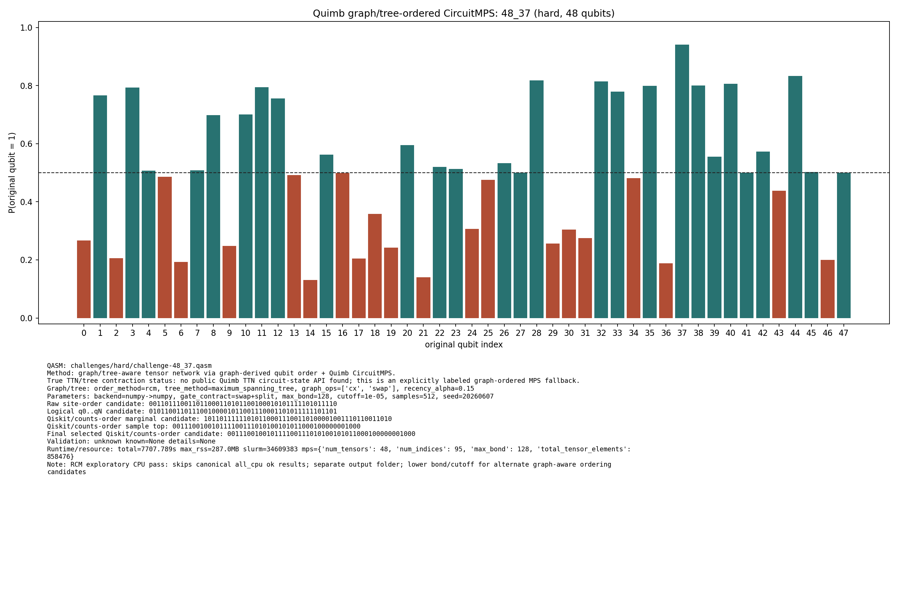

# Challenge 48_37

- Difficulty: hard
- Qubits: 48
- QASM: `challenges/hard/challenge-48_37.qasm`
- Selected answer: `100101001010001101010100100101001001000101010001`
- Selected method: `quimb_gpu_all`
- Validation: `unknown`
- Evidence rows: 3
- Normalized index page: [48_37](../../results_index/by_challenge/48_37.md)

## Distribution Figures

### Quimb graph-ordered MPS: tree_tensor_sim/all/images/challenge-48_37.quimb_tree_graph_mps.png

### Quimb graph-ordered MPS: tree_tensor_sim/all_cpu/images/challenge-48_37.quimb_tree_graph_mps.png

### Quimb graph-ordered MPS: tree_tensor_sim/rcm_cpu/images/challenge-48_37.quimb_tree_graph_mps.png

## Candidate Rows

| review | selected | method | rank_type | rank | bitstring | score | count | support | fraction | validation | status | source |
|---|---:|---|---|---:|---|---:|---:|---:|---:|---|---|---|
|  | 0 | aer_tree_mps_all | sample_top | 1 | `000000111000111001010000110100100001111100000010` | 0.0001220703125 | 1 |  | 0.0001220703125 |  | ok | `../quantum-junction-tree-tensor/outputs/tree_tensor_sim/all/json/challenge-48_37.tree_tensor_mps.json` |
|  | 0 | aer_tree_mps_all | sample_top | 2 | `000001110000001101110010110110000011110101010010` | 0.0001220703125 | 1 |  | 0.0001220703125 |  | ok | `../quantum-junction-tree-tensor/outputs/tree_tensor_sim/all/json/challenge-48_37.tree_tensor_mps.json` |
|  | 0 | aer_tree_mps_all | sample_top | 3 | `000101011010101101000000100110010011111100000010` | 0.0001220703125 | 1 |  | 0.0001220703125 |  | ok | `../quantum-junction-tree-tensor/outputs/tree_tensor_sim/all/json/challenge-48_37.tree_tensor_mps.json` |
|  | 0 | aer_tree_mps_all | sample_top | 4 | `001001110101101100010000110000110111111010011010` | 0.0001220703125 | 1 |  | 0.0001220703125 |  | ok | `../quantum-junction-tree-tensor/outputs/tree_tensor_sim/all/json/challenge-48_37.tree_tensor_mps.json` |
|  | 0 | aer_tree_mps_all | sample_top | 5 | `001101110110001100100010101110111011110100000010` | 0.0001220703125 | 1 |  | 0.0001220703125 |  | ok | `../quantum-junction-tree-tensor/outputs/tree_tensor_sim/all/json/challenge-48_37.tree_tensor_mps.json` |
|  | 0 | aer_tree_mps_all | sample_top | 6 | `001101110111001101000100110111000011111000111011` | 0.0001220703125 | 1 |  | 0.0001220703125 |  | ok | `../quantum-junction-tree-tensor/outputs/tree_tensor_sim/all/json/challenge-48_37.tree_tensor_mps.json` |
|  | 0 | aer_tree_mps_all | sample_top | 7 | `100000010111111101010000101000011000011100110010` | 0.0001220703125 | 1 |  | 0.0001220703125 |  | ok | `../quantum-junction-tree-tensor/outputs/tree_tensor_sim/all/json/challenge-48_37.tree_tensor_mps.json` |
|  | 0 | aer_tree_mps_all | sample_top | 8 | `100101100110101101001100110110000001111100111010` | 0.0001220703125 | 1 |  | 0.0001220703125 |  | ok | `../quantum-junction-tree-tensor/outputs/tree_tensor_sim/all/json/challenge-48_37.tree_tensor_mps.json` |
|  | 0 | aer_tree_mps_all | sample_top | 9 | `100101111110001101000010100100010011010000100010` | 0.0001220703125 | 1 |  | 0.0001220703125 |  | ok | `../quantum-junction-tree-tensor/outputs/tree_tensor_sim/all/json/challenge-48_37.tree_tensor_mps.json` |
|  | 0 | aer_tree_mps_all | sample_top | 10 | `101001011100011100000110110011011101111000111010` | 0.0001220703125 | 1 |  | 0.0001220703125 |  | ok | `../quantum-junction-tree-tensor/outputs/tree_tensor_sim/all/json/challenge-48_37.tree_tensor_mps.json` |
|  | 0 | aer_tree_mps_all | sample_top | 11 | `101001110010011101100110110110010111110100001011` | 0.0001220703125 | 1 |  | 0.0001220703125 |  | ok | `../quantum-junction-tree-tensor/outputs/tree_tensor_sim/all/json/challenge-48_37.tree_tensor_mps.json` |
|  | 0 | aer_tree_mps_all | sample_top | 12 | `101001110110011101100100110000010111111100001011` | 0.0001220703125 | 1 |  | 0.0001220703125 |  | ok | `../quantum-junction-tree-tensor/outputs/tree_tensor_sim/all/json/challenge-48_37.tree_tensor_mps.json` |
|  | 0 | aer_tree_mps_all | sample_top | 13 | `101001111011110101100110110111100011011010000010` | 0.0001220703125 | 1 |  | 0.0001220703125 |  | ok | `../quantum-junction-tree-tensor/outputs/tree_tensor_sim/all/json/challenge-48_37.tree_tensor_mps.json` |
|  | 0 | aer_tree_mps_all | sample_top | 14 | `101001111110000101010100100110001011000000111010` | 0.0001220703125 | 1 |  | 0.0001220703125 |  | ok | `../quantum-junction-tree-tensor/outputs/tree_tensor_sim/all/json/challenge-48_37.tree_tensor_mps.json` |
|  | 0 | aer_tree_mps_all | sample_top | 15 | `101100110111101100010010100110010001000100011001` | 0.0001220703125 | 1 |  | 0.0001220703125 |  | ok | `../quantum-junction-tree-tensor/outputs/tree_tensor_sim/all/json/challenge-48_37.tree_tensor_mps.json` |
|  | 0 | aer_tree_mps_all | sample_top | 16 | `101101010110011101010100110100111001101100011011` | 0.0001220703125 | 1 |  | 0.0001220703125 |  | ok | `../quantum-junction-tree-tensor/outputs/tree_tensor_sim/all/json/challenge-48_37.tree_tensor_mps.json` |
|  | 0 | aer_tree_mps_all | sample_top | 17 | `101101100110101100000000110010101001110100010010` | 0.0001220703125 | 1 |  | 0.0001220703125 |  | ok | `../quantum-junction-tree-tensor/outputs/tree_tensor_sim/all/json/challenge-48_37.tree_tensor_mps.json` |
|  | 0 | aer_tree_mps_all | sample_top | 18 | `110001110010101111100011100010101001110000010010` | 0.0001220703125 | 1 |  | 0.0001220703125 |  | ok | `../quantum-junction-tree-tensor/outputs/tree_tensor_sim/all/json/challenge-48_37.tree_tensor_mps.json` |
|  | 0 | aer_tree_mps_all | sample_top | 19 | `111000110110011001000110100101000011110000000011` | 0.0001220703125 | 1 |  | 0.0001220703125 |  | ok | `../quantum-junction-tree-tensor/outputs/tree_tensor_sim/all/json/challenge-48_37.tree_tensor_mps.json` |
|  | 0 | aer_tree_mps_all | sample_top | 20 | `111101011010011101100100110100100010000100011011` | 0.0001220703125 | 1 |  | 0.0001220703125 |  | ok | `../quantum-junction-tree-tensor/outputs/tree_tensor_sim/all/json/challenge-48_37.tree_tensor_mps.json` |
|  | 1 | collector_snapshot | collector_selected | 1 | `100101001010001101010100100101001001000101010001` | 0.0009765625 |  |  | 0.0009765625 | unknown | unknown | `research/tree_tensor_sim_session/artifacts/collector/CANDIDATES.tsv` |
|  | 1 | quimb_cpu_all | collector_evidence | 2 | `100101001010001101010100100101001001000101010001` | 0.0009765625 |  |  | 0.0009765625 | unknown | unknown | `outputs/tree_tensor_sim/all_cpu/json/challenge-48_37.quimb_tree_graph_mps.json` |
|  | 1 | quimb_cpu_all | final_candidate | 1 | `100101001010001101010100100101001001000101010001` | 4.567438495306497e-05 |  |  |  | {"known_answer_qiskit_order":null,"status":"unknown"} | ok | `../quantum-junction-tree-tensor/outputs/tree_tensor_sim/all_cpu/json/challenge-48_37.quimb_tree_graph_mps.json` |
|  | 0 | quimb_cpu_all | marginal_candidate | 1 | `100101101110101101010100100100001011010100001010` | 4.567438495306497e-05 |  |  |  | {"known_answer_qiskit_order":null,"status":"unknown"} | ok | `../quantum-junction-tree-tensor/outputs/tree_tensor_sim/all_cpu/json/challenge-48_37.quimb_tree_graph_mps.json` |
|  | 1 | quimb_cpu_all | sample_top | 1 | `100101001010001101010100100101001001000101010001` | 0.0009765625 | 1 |  | 0.0009765625 | {"known_answer_qiskit_order":null,"status":"unknown"} | ok | `../quantum-junction-tree-tensor/outputs/tree_tensor_sim/all_cpu/json/challenge-48_37.quimb_tree_graph_mps.json` |
|  | 0 | quimb_cpu_all | sample_top | 2 | `100111111110011111000110101100000001000101001011` | 0.0009765625 | 1 |  | 0.0009765625 | {"known_answer_qiskit_order":null,"status":"unknown"} | ok | `../quantum-junction-tree-tensor/outputs/tree_tensor_sim/all_cpu/json/challenge-48_37.quimb_tree_graph_mps.json` |
|  | 0 | quimb_cpu_all | sample_top | 3 | `101101001010100101011000100100001000000100011001` | 0.0009765625 | 1 |  | 0.0009765625 | {"known_answer_qiskit_order":null,"status":"unknown"} | ok | `../quantum-junction-tree-tensor/outputs/tree_tensor_sim/all_cpu/json/challenge-48_37.quimb_tree_graph_mps.json` |
|  | 0 | quimb_cpu_all | sample_top | 4 | `100101001110111111010100100000000000010100101010` | 0.0009765625 | 1 |  | 0.0009765625 | {"known_answer_qiskit_order":null,"status":"unknown"} | ok | `../quantum-junction-tree-tensor/outputs/tree_tensor_sim/all_cpu/json/challenge-48_37.quimb_tree_graph_mps.json` |
|  | 0 | quimb_cpu_all | sample_top | 5 | `101001110010000111000100100000001111011111001010` | 0.0009765625 | 1 |  | 0.0009765625 | {"known_answer_qiskit_order":null,"status":"unknown"} | ok | `../quantum-junction-tree-tensor/outputs/tree_tensor_sim/all_cpu/json/challenge-48_37.quimb_tree_graph_mps.json` |
|  | 0 | quimb_cpu_all | sample_top | 6 | `100101111110111101010001100100000010111100110000` | 0.0009765625 | 1 |  | 0.0009765625 | {"known_answer_qiskit_order":null,"status":"unknown"} | ok | `../quantum-junction-tree-tensor/outputs/tree_tensor_sim/all_cpu/json/challenge-48_37.quimb_tree_graph_mps.json` |
|  | 0 | quimb_cpu_all | sample_top | 7 | `101101110110111110010100100110000011110100101010` | 0.0009765625 | 1 |  | 0.0009765625 | {"known_answer_qiskit_order":null,"status":"unknown"} | ok | `../quantum-junction-tree-tensor/outputs/tree_tensor_sim/all_cpu/json/challenge-48_37.quimb_tree_graph_mps.json` |
|  | 0 | quimb_cpu_all | sample_top | 8 | `100001011110011110000100100110001011011101001011` | 0.0009765625 | 1 |  | 0.0009765625 | {"known_answer_qiskit_order":null,"status":"unknown"} | ok | `../quantum-junction-tree-tensor/outputs/tree_tensor_sim/all_cpu/json/challenge-48_37.quimb_tree_graph_mps.json` |
|  | 0 | quimb_cpu_all | sample_top | 9 | `101101011110110001010100100111001010000000111010` | 0.0009765625 | 1 |  | 0.0009765625 | {"known_answer_qiskit_order":null,"status":"unknown"} | ok | `../quantum-junction-tree-tensor/outputs/tree_tensor_sim/all_cpu/json/challenge-48_37.quimb_tree_graph_mps.json` |
|  | 0 | quimb_cpu_all | sample_top | 10 | `100101000110110100010000101110000111010100101001` | 0.0009765625 | 1 |  | 0.0009765625 | {"known_answer_qiskit_order":null,"status":"unknown"} | ok | `../quantum-junction-tree-tensor/outputs/tree_tensor_sim/all_cpu/json/challenge-48_37.quimb_tree_graph_mps.json` |
|  | 0 | quimb_cpu_all | sample_top | 11 | `101101101110100100010100100000000101000110111011` | 0.0009765625 | 1 |  | 0.0009765625 | {"known_answer_qiskit_order":null,"status":"unknown"} | ok | `../quantum-junction-tree-tensor/outputs/tree_tensor_sim/all_cpu/json/challenge-48_37.quimb_tree_graph_mps.json` |
|  | 0 | quimb_cpu_all | sample_top | 12 | `100101011110001111000001100110001000010111011001` | 0.0009765625 | 1 |  | 0.0009765625 | {"known_answer_qiskit_order":null,"status":"unknown"} | ok | `../quantum-junction-tree-tensor/outputs/tree_tensor_sim/all_cpu/json/challenge-48_37.quimb_tree_graph_mps.json` |
|  | 1 | quimb_gpu_all | collector_evidence | 1 | `100101001010001101010100100101001001000101010001` | 0.0009765625 |  |  | 0.0009765625 | unknown | unknown | `outputs/tree_tensor_sim/all/json/challenge-48_37.quimb_tree_graph_mps.json` |
|  | 1 | quimb_gpu_all | final_candidate | 1 | `100101001010001101010100100101001001000101010001` | 4.265557269866882e-05 |  |  |  | {"known_answer_qiskit_order":null,"status":"unknown"} | ok | `../quantum-junction-tree-tensor/outputs/tree_tensor_sim/all/json/challenge-48_37.quimb_tree_graph_mps.json` |
|  | 0 | quimb_gpu_all | marginal_candidate | 1 | `100101101110101101010100100100001011010100001010` | 4.265557269866882e-05 |  |  |  | {"known_answer_qiskit_order":null,"status":"unknown"} | ok | `../quantum-junction-tree-tensor/outputs/tree_tensor_sim/all/json/challenge-48_37.quimb_tree_graph_mps.json` |
|  | 1 | quimb_gpu_all | sample_top | 1 | `100101001010001101010100100101001001000101010001` | 0.0009765625 | 1 |  | 0.0009765625 | {"known_answer_qiskit_order":null,"status":"unknown"} | ok | `../quantum-junction-tree-tensor/outputs/tree_tensor_sim/all/json/challenge-48_37.quimb_tree_graph_mps.json` |
|  | 0 | quimb_gpu_all | sample_top | 2 | `100111111110011111000110101100000001000101001011` | 0.0009765625 | 1 |  | 0.0009765625 | {"known_answer_qiskit_order":null,"status":"unknown"} | ok | `../quantum-junction-tree-tensor/outputs/tree_tensor_sim/all/json/challenge-48_37.quimb_tree_graph_mps.json` |
|  | 0 | quimb_gpu_all | sample_top | 3 | `101101001010100101011000100100001000000100011001` | 0.0009765625 | 1 |  | 0.0009765625 | {"known_answer_qiskit_order":null,"status":"unknown"} | ok | `../quantum-junction-tree-tensor/outputs/tree_tensor_sim/all/json/challenge-48_37.quimb_tree_graph_mps.json` |
|  | 0 | quimb_gpu_all | sample_top | 4 | `100101001110111111010100100000000000010100101010` | 0.0009765625 | 1 |  | 0.0009765625 | {"known_answer_qiskit_order":null,"status":"unknown"} | ok | `../quantum-junction-tree-tensor/outputs/tree_tensor_sim/all/json/challenge-48_37.quimb_tree_graph_mps.json` |
|  | 0 | quimb_gpu_all | sample_top | 5 | `101001110010000111010100100000000111011101001010` | 0.0009765625 | 1 |  | 0.0009765625 | {"known_answer_qiskit_order":null,"status":"unknown"} | ok | `../quantum-junction-tree-tensor/outputs/tree_tensor_sim/all/json/challenge-48_37.quimb_tree_graph_mps.json` |
|  | 0 | quimb_gpu_all | sample_top | 6 | `100101111110111101010001100100000010111100110000` | 0.0009765625 | 1 |  | 0.0009765625 | {"known_answer_qiskit_order":null,"status":"unknown"} | ok | `../quantum-junction-tree-tensor/outputs/tree_tensor_sim/all/json/challenge-48_37.quimb_tree_graph_mps.json` |
|  | 0 | quimb_gpu_all | sample_top | 7 | `101101110110111110010100100110000011110100101010` | 0.0009765625 | 1 |  | 0.0009765625 | {"known_answer_qiskit_order":null,"status":"unknown"} | ok | `../quantum-junction-tree-tensor/outputs/tree_tensor_sim/all/json/challenge-48_37.quimb_tree_graph_mps.json` |
|  | 0 | quimb_gpu_all | sample_top | 8 | `100001011110011110000100100110001011011101001011` | 0.0009765625 | 1 |  | 0.0009765625 | {"known_answer_qiskit_order":null,"status":"unknown"} | ok | `../quantum-junction-tree-tensor/outputs/tree_tensor_sim/all/json/challenge-48_37.quimb_tree_graph_mps.json` |
|  | 0 | quimb_gpu_all | sample_top | 9 | `101101011110110001010100100111001010000000111010` | 0.0009765625 | 1 |  | 0.0009765625 | {"known_answer_qiskit_order":null,"status":"unknown"} | ok | `../quantum-junction-tree-tensor/outputs/tree_tensor_sim/all/json/challenge-48_37.quimb_tree_graph_mps.json` |
|  | 0 | quimb_gpu_all | sample_top | 10 | `100101000110110100010000101110000111010100101001` | 0.0009765625 | 1 |  | 0.0009765625 | {"known_answer_qiskit_order":null,"status":"unknown"} | ok | `../quantum-junction-tree-tensor/outputs/tree_tensor_sim/all/json/challenge-48_37.quimb_tree_graph_mps.json` |
|  | 0 | quimb_gpu_all | sample_top | 11 | `101101101110100100010100100000000101000110111011` | 0.0009765625 | 1 |  | 0.0009765625 | {"known_answer_qiskit_order":null,"status":"unknown"} | ok | `../quantum-junction-tree-tensor/outputs/tree_tensor_sim/all/json/challenge-48_37.quimb_tree_graph_mps.json` |
|  | 0 | quimb_gpu_all | sample_top | 12 | `100101011110001111000001100110001000010111011001` | 0.0009765625 | 1 |  | 0.0009765625 | {"known_answer_qiskit_order":null,"status":"unknown"} | ok | `../quantum-junction-tree-tensor/outputs/tree_tensor_sim/all/json/challenge-48_37.quimb_tree_graph_mps.json` |
|  | 0 | quimb_rcm_cpu | collector_evidence | 3 | `001110010010111100111010100101011000100000001000` | 0.001953125 |  |  | 0.001953125 | unknown | unknown | `outputs/tree_tensor_sim/rcm_cpu/json/challenge-48_37.quimb_tree_graph_mps.json` |
|  | 0 | quimb_rcm_cpu | final_candidate | 1 | `001110010010111100111010100101011000100000001000` | 2.220446049250313e-16 |  |  |  | {"known_answer_qiskit_order":null,"status":"unknown"} | ok | `../quantum-junction-tree-tensor/outputs/tree_tensor_sim/rcm_cpu/json/challenge-48_37.quimb_tree_graph_mps.json` |
|  | 0 | quimb_rcm_cpu | marginal_candidate | 1 | `101101111110101100011100110100001001110110011010` | 2.220446049250313e-16 |  |  |  | {"known_answer_qiskit_order":null,"status":"unknown"} | ok | `../quantum-junction-tree-tensor/outputs/tree_tensor_sim/rcm_cpu/json/challenge-48_37.quimb_tree_graph_mps.json` |
|  | 0 | quimb_rcm_cpu | sample_top | 1 | `001110010010111100111010100101011000100000001000` | 0.001953125 | 1 |  | 0.001953125 | {"known_answer_qiskit_order":null,"status":"unknown"} | ok | `../quantum-junction-tree-tensor/outputs/tree_tensor_sim/rcm_cpu/json/challenge-48_37.quimb_tree_graph_mps.json` |
|  | 0 | quimb_rcm_cpu | sample_top | 2 | `111111111110000101110000010100100001110111101010` | 0.001953125 | 1 |  | 0.001953125 | {"known_answer_qiskit_order":null,"status":"unknown"} | ok | `../quantum-junction-tree-tensor/outputs/tree_tensor_sim/rcm_cpu/json/challenge-48_37.quimb_tree_graph_mps.json` |
|  | 0 | quimb_rcm_cpu | sample_top | 3 | `001100001110100101010000100100100001110000111110` | 0.001953125 | 1 |  | 0.001953125 | {"known_answer_qiskit_order":null,"status":"unknown"} | ok | `../quantum-junction-tree-tensor/outputs/tree_tensor_sim/rcm_cpu/json/challenge-48_37.quimb_tree_graph_mps.json` |
|  | 0 | quimb_rcm_cpu | sample_top | 4 | `001011111010010101010110010000101000111010101010` | 0.001953125 | 1 |  | 0.001953125 | {"known_answer_qiskit_order":null,"status":"unknown"} | ok | `../quantum-junction-tree-tensor/outputs/tree_tensor_sim/rcm_cpu/json/challenge-48_37.quimb_tree_graph_mps.json` |
|  | 0 | quimb_rcm_cpu | sample_top | 5 | `111100110010111110010110100100000111110110011010` | 0.001953125 | 1 |  | 0.001953125 | {"known_answer_qiskit_order":null,"status":"unknown"} | ok | `../quantum-junction-tree-tensor/outputs/tree_tensor_sim/rcm_cpu/json/challenge-48_37.quimb_tree_graph_mps.json` |
|  | 0 | quimb_rcm_cpu | sample_top | 6 | `000111111110101100010110110001111000110100110010` | 0.001953125 | 1 |  | 0.001953125 | {"known_answer_qiskit_order":null,"status":"unknown"} | ok | `../quantum-junction-tree-tensor/outputs/tree_tensor_sim/rcm_cpu/json/challenge-48_37.quimb_tree_graph_mps.json` |
|  | 0 | quimb_rcm_cpu | sample_top | 7 | `100100000111111110101001000011001001101010110010` | 0.001953125 | 1 |  | 0.001953125 | {"known_answer_qiskit_order":null,"status":"unknown"} | ok | `../quantum-junction-tree-tensor/outputs/tree_tensor_sim/rcm_cpu/json/challenge-48_37.quimb_tree_graph_mps.json` |
|  | 0 | quimb_rcm_cpu | sample_top | 8 | `010101000110101101010010000000011101110110001010` | 0.001953125 | 1 |  | 0.001953125 | {"known_answer_qiskit_order":null,"status":"unknown"} | ok | `../quantum-junction-tree-tensor/outputs/tree_tensor_sim/rcm_cpu/json/challenge-48_37.quimb_tree_graph_mps.json` |
|  | 0 | quimb_rcm_cpu | sample_top | 9 | `000100101110101111011100000001000001100110011011` | 0.001953125 | 1 |  | 0.001953125 | {"known_answer_qiskit_order":null,"status":"unknown"} | ok | `../quantum-junction-tree-tensor/outputs/tree_tensor_sim/rcm_cpu/json/challenge-48_37.quimb_tree_graph_mps.json` |
|  | 0 | quimb_rcm_cpu | sample_top | 10 | `110011101110111000110100110100011011111100111011` | 0.001953125 | 1 |  | 0.001953125 | {"known_answer_qiskit_order":null,"status":"unknown"} | ok | `../quantum-junction-tree-tensor/outputs/tree_tensor_sim/rcm_cpu/json/challenge-48_37.quimb_tree_graph_mps.json` |
|  | 0 | quimb_rcm_cpu | sample_top | 11 | `000010111110100100111110010000010001100000011010` | 0.001953125 | 1 |  | 0.001953125 | {"known_answer_qiskit_order":null,"status":"unknown"} | ok | `../quantum-junction-tree-tensor/outputs/tree_tensor_sim/rcm_cpu/json/challenge-48_37.quimb_tree_graph_mps.json` |
|  | 0 | quimb_rcm_cpu | sample_top | 12 | `100111111110101110101011000000010011110110011010` | 0.001953125 | 1 |  | 0.001953125 | {"known_answer_qiskit_order":null,"status":"unknown"} | ok | `../quantum-junction-tree-tensor/outputs/tree_tensor_sim/rcm_cpu/json/challenge-48_37.quimb_tree_graph_mps.json` |
