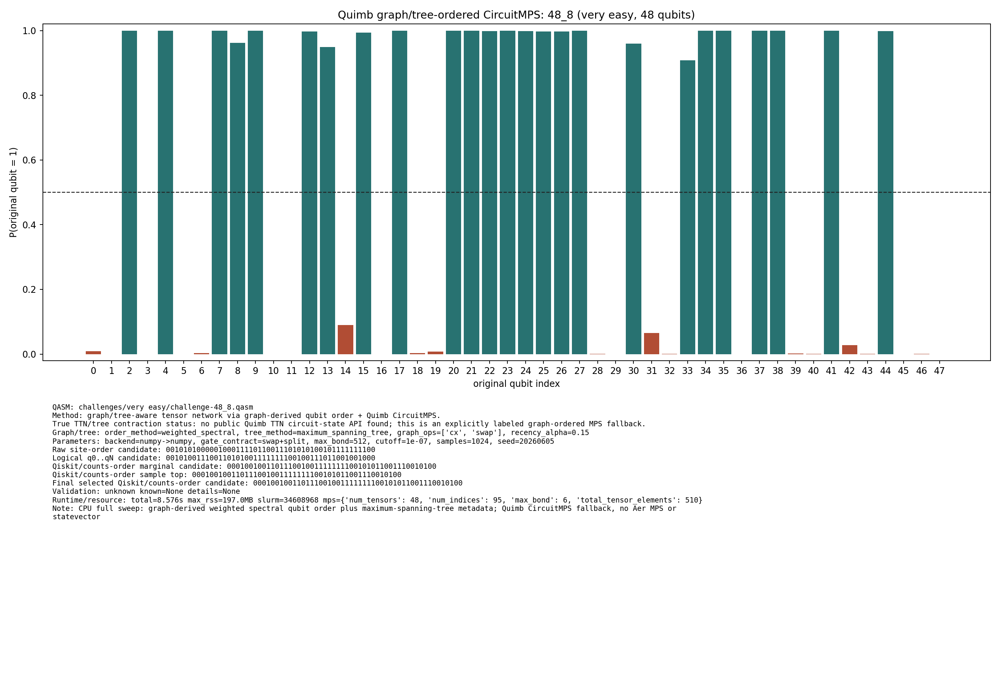

# Challenge 48_8

- Difficulty: very easy
- Qubits: 48
- QASM: `challenges/very easy/challenge-48_8.qasm`
- Selected answer: `000100100110111001001111111100101011001110010100`
- Selected method: `quimb_cpu_all`
- Validation: `unknown`
- Evidence rows: 1
- Normalized index page: [48_8](../../results_index/by_challenge/48_8.md)

## Distribution Figures

### Quimb graph-ordered MPS: tree_tensor_sim/all_cpu/images/challenge-48_8.quimb_tree_graph_mps.png

## Candidate Rows

| review | selected | method | rank_type | rank | bitstring | score | count | support | fraction | validation | status | source |
|---|---:|---|---|---:|---|---:|---:|---:|---:|---|---|---|
|  | 1 | collector_snapshot | collector_selected | 1 | `000100100110111001001111111100101011001110010100` | 0.697265625 |  |  | 0.697265625 | unknown | unknown | `research/tree_tensor_sim_session/artifacts/collector/CANDIDATES.tsv` |
|  | 1 | quimb_cpu_all | collector_evidence | 1 | `000100100110111001001111111100101011001110010100` | 0.697265625 |  |  | 0.697265625 | unknown | unknown | `outputs/tree_tensor_sim/all_cpu/json/challenge-48_8.quimb_tree_graph_mps.json` |
|  | 1 | quimb_cpu_all | final_candidate | 1 | `000100100110111001001111111100101011001110010100` | 0.40832307082269015 |  |  |  | {"known_answer_qiskit_order":null,"status":"unknown"} | ok | `../quantum-junction-tree-tensor/outputs/tree_tensor_sim/all_cpu/json/challenge-48_8.quimb_tree_graph_mps.json` |
|  | 1 | quimb_cpu_all | marginal_candidate | 1 | `000100100110111001001111111100101011001110010100` | 0.40832307082269015 |  |  |  | {"known_answer_qiskit_order":null,"status":"unknown"} | ok | `../quantum-junction-tree-tensor/outputs/tree_tensor_sim/all_cpu/json/challenge-48_8.quimb_tree_graph_mps.json` |
|  | 1 | quimb_cpu_all | sample_top | 1 | `000100100110111001001111111100101011001110010100` | 0.697265625 | 714 |  | 0.697265625 | {"known_answer_qiskit_order":null,"status":"unknown"} | ok | `../quantum-junction-tree-tensor/outputs/tree_tensor_sim/all_cpu/json/challenge-48_8.quimb_tree_graph_mps.json` |
|  | 0 | quimb_cpu_all | sample_top | 2 | `000100100110110001001111111100101111001110010100` | 0.0732421875 | 75 |  | 0.0732421875 | {"known_answer_qiskit_order":null,"status":"unknown"} | ok | `../quantum-junction-tree-tensor/outputs/tree_tensor_sim/all_cpu/json/challenge-48_8.quimb_tree_graph_mps.json` |
|  | 0 | quimb_cpu_all | sample_top | 3 | `000100100110111001001111111100101001001110010100` | 0.0419921875 | 43 |  | 0.0419921875 | {"known_answer_qiskit_order":null,"status":"unknown"} | ok | `../quantum-junction-tree-tensor/outputs/tree_tensor_sim/all_cpu/json/challenge-48_8.quimb_tree_graph_mps.json` |
|  | 0 | quimb_cpu_all | sample_top | 4 | `000100100110111011001111111100101011001110010100` | 0.0400390625 | 41 |  | 0.0400390625 | {"known_answer_qiskit_order":null,"status":"unknown"} | ok | `../quantum-junction-tree-tensor/outputs/tree_tensor_sim/all_cpu/json/challenge-48_8.quimb_tree_graph_mps.json` |
|  | 0 | quimb_cpu_all | sample_top | 5 | `000100100110111000001111111100101011001110010100` | 0.029296875 | 30 |  | 0.029296875 | {"known_answer_qiskit_order":null,"status":"unknown"} | ok | `../quantum-junction-tree-tensor/outputs/tree_tensor_sim/all_cpu/json/challenge-48_8.quimb_tree_graph_mps.json` |
|  | 0 | quimb_cpu_all | sample_top | 6 | `000100100110111001001111111100101011001010010100` | 0.0283203125 | 29 |  | 0.0283203125 | {"known_answer_qiskit_order":null,"status":"unknown"} | ok | `../quantum-junction-tree-tensor/outputs/tree_tensor_sim/all_cpu/json/challenge-48_8.quimb_tree_graph_mps.json` |
|  | 0 | quimb_cpu_all | sample_top | 7 | `000101100110111001001111111100101011001110010100` | 0.0185546875 | 19 |  | 0.0185546875 | {"known_answer_qiskit_order":null,"status":"unknown"} | ok | `../quantum-junction-tree-tensor/outputs/tree_tensor_sim/all_cpu/json/challenge-48_8.quimb_tree_graph_mps.json` |
|  | 0 | quimb_cpu_all | sample_top | 8 | `000100100110110001001111111100101011001110010100` | 0.00390625 | 4 |  | 0.00390625 | {"known_answer_qiskit_order":null,"status":"unknown"} | ok | `../quantum-junction-tree-tensor/outputs/tree_tensor_sim/all_cpu/json/challenge-48_8.quimb_tree_graph_mps.json` |
|  | 0 | quimb_cpu_all | sample_top | 9 | `000100100110110001001111111100101101001110010100` | 0.0029296875 | 3 |  | 0.0029296875 | {"known_answer_qiskit_order":null,"status":"unknown"} | ok | `../quantum-junction-tree-tensor/outputs/tree_tensor_sim/all_cpu/json/challenge-48_8.quimb_tree_graph_mps.json` |
|  | 0 | quimb_cpu_all | sample_top | 10 | `000100100110110001001111111110101011001110010100` | 0.0029296875 | 3 |  | 0.0029296875 | {"known_answer_qiskit_order":null,"status":"unknown"} | ok | `../quantum-junction-tree-tensor/outputs/tree_tensor_sim/all_cpu/json/challenge-48_8.quimb_tree_graph_mps.json` |
|  | 0 | quimb_cpu_all | sample_top | 11 | `000100100110110011001111111100101111001110010100` | 0.0029296875 | 3 |  | 0.0029296875 | {"known_answer_qiskit_order":null,"status":"unknown"} | ok | `../quantum-junction-tree-tensor/outputs/tree_tensor_sim/all_cpu/json/challenge-48_8.quimb_tree_graph_mps.json` |
|  | 0 | quimb_cpu_all | sample_top | 12 | `000100101110111001001111111100101011001110010100` | 0.0029296875 | 3 |  | 0.0029296875 | {"known_answer_qiskit_order":null,"status":"unknown"} | ok | `../quantum-junction-tree-tensor/outputs/tree_tensor_sim/all_cpu/json/challenge-48_8.quimb_tree_graph_mps.json` |
