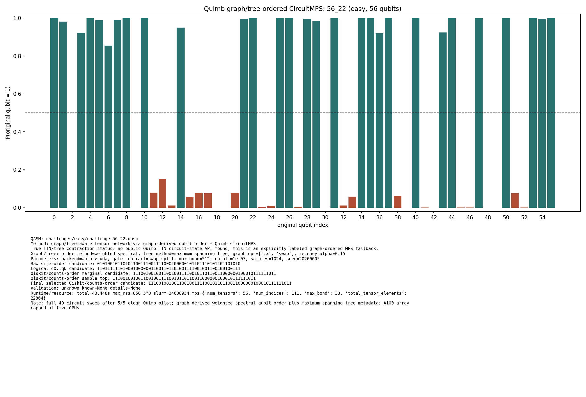
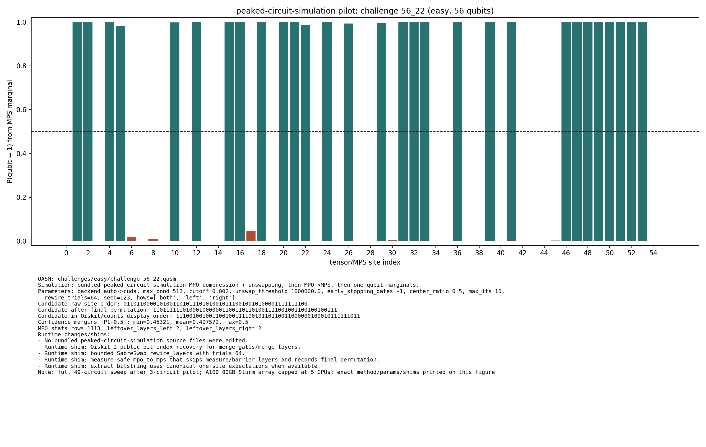
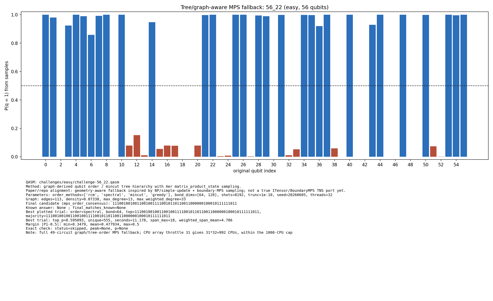

# Challenge 56_22

- Difficulty: easy
- Qubits: 56
- QASM: `challenges/easy/challenge-56_22.qasm`
- Selected answer: `11100100100110010011110010110110011000000100010111111011`
- Selected method: `quimb_gpu_all`
- Validation: `unknown`
- Evidence rows: 2
- Normalized index page: [56_22](../../results_index/by_challenge/56_22.md)

## Distribution Figures

### Quimb graph-ordered MPS: tree_tensor_sim/all/images/challenge-56_22.quimb_tree_graph_mps.png

### Quimb graph-ordered MPS: tree_tensor_sim/all_cpu/images/challenge-56_22.quimb_tree_graph_mps.png

### peaked MPO/MPS marginal: challenge-56_22.peaked_mpo_mps.png

### tree/order MPS sample: tree_tensor_sim/all/images/challenge-56_22.tree_tensor_mps.png

## Candidate Rows

| review | selected | method | rank_type | rank | bitstring | score | count | support | fraction | validation | status | source |
|---|---:|---|---|---:|---|---:|---:|---:|---:|---|---|---|
|  | 1 | aer_tree_mps_all | final_candidate | 1 | `11100100100110010011110010110110011000000100010111111011` | 36.33449881417411 |  |  | 36.33449881417411 | {"bit_order_note":"Right-most bit is qubit 0.","final_matches_known":null,"known_answer":null,"known_answers_are_qiskit_counts_order":true} | ok | `../quantum-junction-tree-tensor/outputs/tree_tensor_sim/all/json/challenge-56_22.tree_tensor_mps.json` |
|  | 0 | aer_tree_mps_all | sample_top | 1 | `11100100100100010010110010110110011000010101110111111011` | 0.0023193359375 | 19 |  | 0.0023193359375 | {"bit_order_note":"Right-most bit is qubit 0.","final_matches_known":null,"known_answer":null,"known_answers_are_qiskit_counts_order":true} | ok | `../quantum-junction-tree-tensor/outputs/tree_tensor_sim/all/json/challenge-56_22.tree_tensor_mps.json` |
|  | 0 | aer_tree_mps_all | sample_top | 1 | `11100100100100010010110010110110011000110101010111111011` | 0.0023193359375 | 19 |  | 0.0023193359375 | {"bit_order_note":"Right-most bit is qubit 0.","final_matches_known":null,"known_answer":null,"known_answers_are_qiskit_counts_order":true} | ok | `../quantum-junction-tree-tensor/outputs/tree_tensor_sim/all/json/challenge-56_22.tree_tensor_mps.json` |
|  | 0 | aer_tree_mps_all | sample_top | 1 | `11100100100100010010110010110110011000110101010111111011` | 0.00244140625 | 20 |  | 0.00244140625 | {"bit_order_note":"Right-most bit is qubit 0.","final_matches_known":null,"known_answer":null,"known_answers_are_qiskit_counts_order":true} | ok | `../quantum-junction-tree-tensor/outputs/tree_tensor_sim/all/json/challenge-56_22.tree_tensor_mps.json` |
|  | 0 | aer_tree_mps_all | sample_top | 1 | `11100100100100010010110010110110011000110101110111111011` | 0.0029296875 | 24 |  | 0.0029296875 | {"bit_order_note":"Right-most bit is qubit 0.","final_matches_known":null,"known_answer":null,"known_answers_are_qiskit_counts_order":true} | ok | `../quantum-junction-tree-tensor/outputs/tree_tensor_sim/all/json/challenge-56_22.tree_tensor_mps.json` |
|  | 0 | aer_tree_mps_all | sample_top | 1 | `11100100100100010011110010110110011100010101110111111011` | 0.0023193359375 | 19 |  | 0.0023193359375 | {"bit_order_note":"Right-most bit is qubit 0.","final_matches_known":null,"known_answer":null,"known_answers_are_qiskit_counts_order":true} | ok | `../quantum-junction-tree-tensor/outputs/tree_tensor_sim/all/json/challenge-56_22.tree_tensor_mps.json` |
|  | 0 | aer_tree_mps_all | sample_top | 1 | `11100100100100010011110010110110011100110101110111110011` | 0.002685546875 | 22 |  | 0.002685546875 | {"bit_order_note":"Right-most bit is qubit 0.","final_matches_known":null,"known_answer":null,"known_answers_are_qiskit_counts_order":true} | ok | `../quantum-junction-tree-tensor/outputs/tree_tensor_sim/all/json/challenge-56_22.tree_tensor_mps.json` |
|  | 0 | aer_tree_mps_all | sample_top | 1 | `11100100100110010010110010110110011000010101110111111011` | 0.00244140625 | 20 |  | 0.00244140625 | {"bit_order_note":"Right-most bit is qubit 0.","final_matches_known":null,"known_answer":null,"known_answers_are_qiskit_counts_order":true} | ok | `../quantum-junction-tree-tensor/outputs/tree_tensor_sim/all/json/challenge-56_22.tree_tensor_mps.json` |
|  | 0 | aer_tree_mps_all | sample_top | 1 | `11100100100110010011110010010110011000000100010111011011` | 0.0035400390625 | 29 |  | 0.0035400390625 | {"bit_order_note":"Right-most bit is qubit 0.","final_matches_known":null,"known_answer":null,"known_answers_are_qiskit_counts_order":true} | ok | `../quantum-junction-tree-tensor/outputs/tree_tensor_sim/all/json/challenge-56_22.tree_tensor_mps.json` |
|  | 0 | aer_tree_mps_all | sample_top | 2 | `11100100100100010010110010110110011000110101010111111011` | 0.00244140625 | 20 |  | 0.00244140625 | {"bit_order_note":"Right-most bit is qubit 0.","final_matches_known":null,"known_answer":null,"known_answers_are_qiskit_counts_order":true} | ok | `../quantum-junction-tree-tensor/outputs/tree_tensor_sim/all/json/challenge-56_22.tree_tensor_mps.json` |
|  | 0 | aer_tree_mps_all | sample_top | 2 | `11100100100100010011110010110110011100010101010111110011` | 0.0025634765625 | 21 |  | 0.0025634765625 | {"bit_order_note":"Right-most bit is qubit 0.","final_matches_known":null,"known_answer":null,"known_answers_are_qiskit_counts_order":true} | ok | `../quantum-junction-tree-tensor/outputs/tree_tensor_sim/all/json/challenge-56_22.tree_tensor_mps.json` |
|  | 0 | aer_tree_mps_all | sample_top | 2 | `11100100100100010011110010110110011100010101110111111011` | 0.002685546875 | 22 |  | 0.002685546875 | {"bit_order_note":"Right-most bit is qubit 0.","final_matches_known":null,"known_answer":null,"known_answers_are_qiskit_counts_order":true} | ok | `../quantum-junction-tree-tensor/outputs/tree_tensor_sim/all/json/challenge-56_22.tree_tensor_mps.json` |
|  | 0 | aer_tree_mps_all | sample_top | 2 | `11100100100100010011110010110110011100110101010111111011` | 0.0023193359375 | 19 |  | 0.0023193359375 | {"bit_order_note":"Right-most bit is qubit 0.","final_matches_known":null,"known_answer":null,"known_answers_are_qiskit_counts_order":true} | ok | `../quantum-junction-tree-tensor/outputs/tree_tensor_sim/all/json/challenge-56_22.tree_tensor_mps.json` |
|  | 0 | aer_tree_mps_all | sample_top | 2 | `11100100100110010010110010110110011000110101010111110011` | 0.002685546875 | 22 |  | 0.002685546875 | {"bit_order_note":"Right-most bit is qubit 0.","final_matches_known":null,"known_answer":null,"known_answers_are_qiskit_counts_order":true} | ok | `../quantum-junction-tree-tensor/outputs/tree_tensor_sim/all/json/challenge-56_22.tree_tensor_mps.json` |
|  | 0 | aer_tree_mps_all | sample_top | 2 | `11100100100110010010110010110110011000110101010111111011` | 0.0025634765625 | 21 |  | 0.0025634765625 | {"bit_order_note":"Right-most bit is qubit 0.","final_matches_known":null,"known_answer":null,"known_answers_are_qiskit_counts_order":true} | ok | `../quantum-junction-tree-tensor/outputs/tree_tensor_sim/all/json/challenge-56_22.tree_tensor_mps.json` |
|  | 0 | aer_tree_mps_all | sample_top | 2 | `11100100100110010011110010010110011000000100010111011011` | 0.004150390625 | 34 |  | 0.004150390625 | {"bit_order_note":"Right-most bit is qubit 0.","final_matches_known":null,"known_answer":null,"known_answers_are_qiskit_counts_order":true} | ok | `../quantum-junction-tree-tensor/outputs/tree_tensor_sim/all/json/challenge-56_22.tree_tensor_mps.json` |
|  | 0 | aer_tree_mps_all | sample_top | 2 | `11100100100110010011110010010110011000000100010111111011` | 0.0035400390625 | 29 |  | 0.0035400390625 | {"bit_order_note":"Right-most bit is qubit 0.","final_matches_known":null,"known_answer":null,"known_answers_are_qiskit_counts_order":true} | ok | `../quantum-junction-tree-tensor/outputs/tree_tensor_sim/all/json/challenge-56_22.tree_tensor_mps.json` |
|  | 0 | aer_tree_mps_all | sample_top | 3 | `11100100100100010010110010110110011000110101110111111011` | 0.0023193359375 | 19 |  | 0.0023193359375 | {"bit_order_note":"Right-most bit is qubit 0.","final_matches_known":null,"known_answer":null,"known_answers_are_qiskit_counts_order":true} | ok | `../quantum-junction-tree-tensor/outputs/tree_tensor_sim/all/json/challenge-56_22.tree_tensor_mps.json` |
|  | 0 | aer_tree_mps_all | sample_top | 3 | `11100100100110010010110010110110011000110101010111111011` | 0.0025634765625 | 21 |  | 0.0025634765625 | {"bit_order_note":"Right-most bit is qubit 0.","final_matches_known":null,"known_answer":null,"known_answers_are_qiskit_counts_order":true} | ok | `../quantum-junction-tree-tensor/outputs/tree_tensor_sim/all/json/challenge-56_22.tree_tensor_mps.json` |
|  | 0 | aer_tree_mps_all | sample_top | 3 | `11100100100110010010110010110110011000110101110111111011` | 0.00244140625 | 20 |  | 0.00244140625 | {"bit_order_note":"Right-most bit is qubit 0.","final_matches_known":null,"known_answer":null,"known_answers_are_qiskit_counts_order":true} | ok | `../quantum-junction-tree-tensor/outputs/tree_tensor_sim/all/json/challenge-56_22.tree_tensor_mps.json` |
|  | 0 | aer_tree_mps_all | sample_top | 3 | `11100100100110010010110010110110011000110101110111111011` | 0.002685546875 | 22 |  | 0.002685546875 | {"bit_order_note":"Right-most bit is qubit 0.","final_matches_known":null,"known_answer":null,"known_answers_are_qiskit_counts_order":true} | ok | `../quantum-junction-tree-tensor/outputs/tree_tensor_sim/all/json/challenge-56_22.tree_tensor_mps.json` |
|  | 0 | aer_tree_mps_all | sample_top | 3 | `11100100100110010011110010010110011000000100010111011011` | 0.0040283203125 | 33 |  | 0.0040283203125 | {"bit_order_note":"Right-most bit is qubit 0.","final_matches_known":null,"known_answer":null,"known_answers_are_qiskit_counts_order":true} | ok | `../quantum-junction-tree-tensor/outputs/tree_tensor_sim/all/json/challenge-56_22.tree_tensor_mps.json` |
|  | 0 | aer_tree_mps_all | sample_top | 3 | `11100100100110010011110010010110011000000100010111011011` | 0.003662109375 | 30 |  | 0.003662109375 | {"bit_order_note":"Right-most bit is qubit 0.","final_matches_known":null,"known_answer":null,"known_answers_are_qiskit_counts_order":true} | ok | `../quantum-junction-tree-tensor/outputs/tree_tensor_sim/all/json/challenge-56_22.tree_tensor_mps.json` |
|  | 0 | aer_tree_mps_all | sample_top | 3 | `11100100100110010011110010010110011000000100010111111011` | 0.00244140625 | 20 |  | 0.00244140625 | {"bit_order_note":"Right-most bit is qubit 0.","final_matches_known":null,"known_answer":null,"known_answers_are_qiskit_counts_order":true} | ok | `../quantum-junction-tree-tensor/outputs/tree_tensor_sim/all/json/challenge-56_22.tree_tensor_mps.json` |
|  | 0 | aer_tree_mps_all | sample_top | 3 | `11100100100110010011110010110110011000000000010110111011` | 0.01611328125 | 132 |  | 0.01611328125 | {"bit_order_note":"Right-most bit is qubit 0.","final_matches_known":null,"known_answer":null,"known_answers_are_qiskit_counts_order":true} | ok | `../quantum-junction-tree-tensor/outputs/tree_tensor_sim/all/json/challenge-56_22.tree_tensor_mps.json` |
|  | 0 | aer_tree_mps_all | sample_top | 4 | `11100100100110010010110010110110011000110101110111111011` | 0.0032958984375 | 27 |  | 0.0032958984375 | {"bit_order_note":"Right-most bit is qubit 0.","final_matches_known":null,"known_answer":null,"known_answers_are_qiskit_counts_order":true} | ok | `../quantum-junction-tree-tensor/outputs/tree_tensor_sim/all/json/challenge-56_22.tree_tensor_mps.json` |
|  | 0 | aer_tree_mps_all | sample_top | 4 | `11100100100110010011110010010110011000000100010111011011` | 0.005126953125 | 42 |  | 0.005126953125 | {"bit_order_note":"Right-most bit is qubit 0.","final_matches_known":null,"known_answer":null,"known_answers_are_qiskit_counts_order":true} | ok | `../quantum-junction-tree-tensor/outputs/tree_tensor_sim/all/json/challenge-56_22.tree_tensor_mps.json` |
|  | 0 | aer_tree_mps_all | sample_top | 4 | `11100100100110010011110010010110011000000100010111011011` | 0.0032958984375 | 27 |  | 0.0032958984375 | {"bit_order_note":"Right-most bit is qubit 0.","final_matches_known":null,"known_answer":null,"known_answers_are_qiskit_counts_order":true} | ok | `../quantum-junction-tree-tensor/outputs/tree_tensor_sim/all/json/challenge-56_22.tree_tensor_mps.json` |
|  | 0 | aer_tree_mps_all | sample_top | 4 | `11100100100110010011110010010110011000000100010111011011` | 0.003662109375 | 30 |  | 0.003662109375 | {"bit_order_note":"Right-most bit is qubit 0.","final_matches_known":null,"known_answer":null,"known_answers_are_qiskit_counts_order":true} | ok | `../quantum-junction-tree-tensor/outputs/tree_tensor_sim/all/json/challenge-56_22.tree_tensor_mps.json` |
|  | 0 | aer_tree_mps_all | sample_top | 4 | `11100100100110010011110010010110011000000100010111111011` | 0.0028076171875 | 23 |  | 0.0028076171875 | {"bit_order_note":"Right-most bit is qubit 0.","final_matches_known":null,"known_answer":null,"known_answers_are_qiskit_counts_order":true} | ok | `../quantum-junction-tree-tensor/outputs/tree_tensor_sim/all/json/challenge-56_22.tree_tensor_mps.json` |
|  | 0 | aer_tree_mps_all | sample_top | 4 | `11100100100110010011110010010110011000000100010111111011` | 0.0030517578125 | 25 |  | 0.0030517578125 | {"bit_order_note":"Right-most bit is qubit 0.","final_matches_known":null,"known_answer":null,"known_answers_are_qiskit_counts_order":true} | ok | `../quantum-junction-tree-tensor/outputs/tree_tensor_sim/all/json/challenge-56_22.tree_tensor_mps.json` |
|  | 0 | aer_tree_mps_all | sample_top | 4 | `11100100100110010011110010110110011000000000010110111011` | 0.0181884765625 | 149 |  | 0.0181884765625 | {"bit_order_note":"Right-most bit is qubit 0.","final_matches_known":null,"known_answer":null,"known_answers_are_qiskit_counts_order":true} | ok | `../quantum-junction-tree-tensor/outputs/tree_tensor_sim/all/json/challenge-56_22.tree_tensor_mps.json` |
|  | 0 | aer_tree_mps_all | sample_top | 4 | `11100100100110010011110010110110011000000100010110111011` | 0.061279296875 | 502 |  | 0.061279296875 | {"bit_order_note":"Right-most bit is qubit 0.","final_matches_known":null,"known_answer":null,"known_answers_are_qiskit_counts_order":true} | ok | `../quantum-junction-tree-tensor/outputs/tree_tensor_sim/all/json/challenge-56_22.tree_tensor_mps.json` |
|  | 0 | aer_tree_mps_all | sample_top | 5 | `11100100100110010011110010010110011000000100010111011011` | 0.0029296875 | 24 |  | 0.0029296875 | {"bit_order_note":"Right-most bit is qubit 0.","final_matches_known":null,"known_answer":null,"known_answers_are_qiskit_counts_order":true} | ok | `../quantum-junction-tree-tensor/outputs/tree_tensor_sim/all/json/challenge-56_22.tree_tensor_mps.json` |
|  | 0 | aer_tree_mps_all | sample_top | 5 | `11100100100110010011110010010110011000000100010111111011` | 0.002685546875 | 22 |  | 0.002685546875 | {"bit_order_note":"Right-most bit is qubit 0.","final_matches_known":null,"known_answer":null,"known_answers_are_qiskit_counts_order":true} | ok | `../quantum-junction-tree-tensor/outputs/tree_tensor_sim/all/json/challenge-56_22.tree_tensor_mps.json` |
|  | 0 | aer_tree_mps_all | sample_top | 5 | `11100100100110010011110010010110011000000100010111111011` | 0.0025634765625 | 21 |  | 0.0025634765625 | {"bit_order_note":"Right-most bit is qubit 0.","final_matches_known":null,"known_answer":null,"known_answers_are_qiskit_counts_order":true} | ok | `../quantum-junction-tree-tensor/outputs/tree_tensor_sim/all/json/challenge-56_22.tree_tensor_mps.json` |
|  | 0 | aer_tree_mps_all | sample_top | 5 | `11100100100110010011110010110110011000000000010110111011` | 0.021484375 | 176 |  | 0.021484375 | {"bit_order_note":"Right-most bit is qubit 0.","final_matches_known":null,"known_answer":null,"known_answers_are_qiskit_counts_order":true} | ok | `../quantum-junction-tree-tensor/outputs/tree_tensor_sim/all/json/challenge-56_22.tree_tensor_mps.json` |
|  | 0 | aer_tree_mps_all | sample_top | 5 | `11100100100110010011110010110110011000000000010110111011` | 0.0177001953125 | 145 |  | 0.0177001953125 | {"bit_order_note":"Right-most bit is qubit 0.","final_matches_known":null,"known_answer":null,"known_answers_are_qiskit_counts_order":true} | ok | `../quantum-junction-tree-tensor/outputs/tree_tensor_sim/all/json/challenge-56_22.tree_tensor_mps.json` |
|  | 0 | aer_tree_mps_all | sample_top | 5 | `11100100100110010011110010110110011000000000010110111011` | 0.01806640625 | 148 |  | 0.01806640625 | {"bit_order_note":"Right-most bit is qubit 0.","final_matches_known":null,"known_answer":null,"known_answers_are_qiskit_counts_order":true} | ok | `../quantum-junction-tree-tensor/outputs/tree_tensor_sim/all/json/challenge-56_22.tree_tensor_mps.json` |
|  | 0 | aer_tree_mps_all | sample_top | 5 | `11100100100110010011110010110110011000000100010110111011` | 0.06005859375 | 492 |  | 0.06005859375 | {"bit_order_note":"Right-most bit is qubit 0.","final_matches_known":null,"known_answer":null,"known_answers_are_qiskit_counts_order":true} | ok | `../quantum-junction-tree-tensor/outputs/tree_tensor_sim/all/json/challenge-56_22.tree_tensor_mps.json` |
|  | 0 | aer_tree_mps_all | sample_top | 5 | `11100100100110010011110010110110011000000100010111011011` | 0.0035400390625 | 29 |  | 0.0035400390625 | {"bit_order_note":"Right-most bit is qubit 0.","final_matches_known":null,"known_answer":null,"known_answers_are_qiskit_counts_order":true} | ok | `../quantum-junction-tree-tensor/outputs/tree_tensor_sim/all/json/challenge-56_22.tree_tensor_mps.json` |
|  | 0 | aer_tree_mps_all | sample_top | 6 | `11100100100110010011110010110110011000000000010110111011` | 0.0186767578125 | 153 |  | 0.0186767578125 | {"bit_order_note":"Right-most bit is qubit 0.","final_matches_known":null,"known_answer":null,"known_answers_are_qiskit_counts_order":true} | ok | `../quantum-junction-tree-tensor/outputs/tree_tensor_sim/all/json/challenge-56_22.tree_tensor_mps.json` |
|  | 0 | aer_tree_mps_all | sample_top | 6 | `11100100100110010011110010110110011000000000010110111011` | 0.016845703125 | 138 |  | 0.016845703125 | {"bit_order_note":"Right-most bit is qubit 0.","final_matches_known":null,"known_answer":null,"known_answers_are_qiskit_counts_order":true} | ok | `../quantum-junction-tree-tensor/outputs/tree_tensor_sim/all/json/challenge-56_22.tree_tensor_mps.json` |
|  | 0 | aer_tree_mps_all | sample_top | 6 | `11100100100110010011110010110110011000000000010110111011` | 0.018310546875 | 150 |  | 0.018310546875 | {"bit_order_note":"Right-most bit is qubit 0.","final_matches_known":null,"known_answer":null,"known_answers_are_qiskit_counts_order":true} | ok | `../quantum-junction-tree-tensor/outputs/tree_tensor_sim/all/json/challenge-56_22.tree_tensor_mps.json` |
|  | 0 | aer_tree_mps_all | sample_top | 6 | `11100100100110010011110010110110011000000100010101111011` | 0.0025634765625 | 21 |  | 0.0025634765625 | {"bit_order_note":"Right-most bit is qubit 0.","final_matches_known":null,"known_answer":null,"known_answers_are_qiskit_counts_order":true} | ok | `../quantum-junction-tree-tensor/outputs/tree_tensor_sim/all/json/challenge-56_22.tree_tensor_mps.json` |
|  | 0 | aer_tree_mps_all | sample_top | 6 | `11100100100110010011110010110110011000000100010110111011` | 0.0640869140625 | 525 |  | 0.0640869140625 | {"bit_order_note":"Right-most bit is qubit 0.","final_matches_known":null,"known_answer":null,"known_answers_are_qiskit_counts_order":true} | ok | `../quantum-junction-tree-tensor/outputs/tree_tensor_sim/all/json/challenge-56_22.tree_tensor_mps.json` |
|  | 0 | aer_tree_mps_all | sample_top | 6 | `11100100100110010011110010110110011000000100010110111011` | 0.0654296875 | 536 |  | 0.0654296875 | {"bit_order_note":"Right-most bit is qubit 0.","final_matches_known":null,"known_answer":null,"known_answers_are_qiskit_counts_order":true} | ok | `../quantum-junction-tree-tensor/outputs/tree_tensor_sim/all/json/challenge-56_22.tree_tensor_mps.json` |
|  | 0 | aer_tree_mps_all | sample_top | 6 | `11100100100110010011110010110110011000000100010111011011` | 0.0035400390625 | 29 |  | 0.0035400390625 | {"bit_order_note":"Right-most bit is qubit 0.","final_matches_known":null,"known_answer":null,"known_answers_are_qiskit_counts_order":true} | ok | `../quantum-junction-tree-tensor/outputs/tree_tensor_sim/all/json/challenge-56_22.tree_tensor_mps.json` |
|  | 1 | aer_tree_mps_all | sample_top | 6 | `11100100100110010011110010110110011000000100010111111011` | 0.58251953125 | 4772 |  | 0.58251953125 | {"bit_order_note":"Right-most bit is qubit 0.","final_matches_known":null,"known_answer":null,"known_answers_are_qiskit_counts_order":true} | ok | `../quantum-junction-tree-tensor/outputs/tree_tensor_sim/all/json/challenge-56_22.tree_tensor_mps.json` |
|  | 0 | aer_tree_mps_all | sample_top | 7 | `11100100100110010011110010110110011000000100010101111011` | 0.002685546875 | 22 |  | 0.002685546875 | {"bit_order_note":"Right-most bit is qubit 0.","final_matches_known":null,"known_answer":null,"known_answers_are_qiskit_counts_order":true} | ok | `../quantum-junction-tree-tensor/outputs/tree_tensor_sim/all/json/challenge-56_22.tree_tensor_mps.json` |
|  | 0 | aer_tree_mps_all | sample_top | 7 | `11100100100110010011110010110110011000000100010110111011` | 0.064697265625 | 530 |  | 0.064697265625 | {"bit_order_note":"Right-most bit is qubit 0.","final_matches_known":null,"known_answer":null,"known_answers_are_qiskit_counts_order":true} | ok | `../quantum-junction-tree-tensor/outputs/tree_tensor_sim/all/json/challenge-56_22.tree_tensor_mps.json` |
|  | 0 | aer_tree_mps_all | sample_top | 7 | `11100100100110010011110010110110011000000100010110111011` | 0.0616455078125 | 505 |  | 0.0616455078125 | {"bit_order_note":"Right-most bit is qubit 0.","final_matches_known":null,"known_answer":null,"known_answers_are_qiskit_counts_order":true} | ok | `../quantum-junction-tree-tensor/outputs/tree_tensor_sim/all/json/challenge-56_22.tree_tensor_mps.json` |
|  | 0 | aer_tree_mps_all | sample_top | 7 | `11100100100110010011110010110110011000000100010110111011` | 0.0614013671875 | 503 |  | 0.0614013671875 | {"bit_order_note":"Right-most bit is qubit 0.","final_matches_known":null,"known_answer":null,"known_answers_are_qiskit_counts_order":true} | ok | `../quantum-junction-tree-tensor/outputs/tree_tensor_sim/all/json/challenge-56_22.tree_tensor_mps.json` |
|  | 0 | aer_tree_mps_all | sample_top | 7 | `11100100100110010011110010110110011000000100010111011011` | 0.005126953125 | 42 |  | 0.005126953125 | {"bit_order_note":"Right-most bit is qubit 0.","final_matches_known":null,"known_answer":null,"known_answers_are_qiskit_counts_order":true} | ok | `../quantum-junction-tree-tensor/outputs/tree_tensor_sim/all/json/challenge-56_22.tree_tensor_mps.json` |
|  | 0 | aer_tree_mps_all | sample_top | 7 | `11100100100110010011110010110110011000000100010111011011` | 0.00439453125 | 36 |  | 0.00439453125 | {"bit_order_note":"Right-most bit is qubit 0.","final_matches_known":null,"known_answer":null,"known_answers_are_qiskit_counts_order":true} | ok | `../quantum-junction-tree-tensor/outputs/tree_tensor_sim/all/json/challenge-56_22.tree_tensor_mps.json` |
|  | 1 | aer_tree_mps_all | sample_top | 7 | `11100100100110010011110010110110011000000100010111111011` | 0.59033203125 | 4836 |  | 0.59033203125 | {"bit_order_note":"Right-most bit is qubit 0.","final_matches_known":null,"known_answer":null,"known_answers_are_qiskit_counts_order":true} | ok | `../quantum-junction-tree-tensor/outputs/tree_tensor_sim/all/json/challenge-56_22.tree_tensor_mps.json` |
|  | 0 | aer_tree_mps_all | sample_top | 7 | `11100100100110010011110010110110011000001000010110111011` | 0.0169677734375 | 139 |  | 0.0169677734375 | {"bit_order_note":"Right-most bit is qubit 0.","final_matches_known":null,"known_answer":null,"known_answers_are_qiskit_counts_order":true} | ok | `../quantum-junction-tree-tensor/outputs/tree_tensor_sim/all/json/challenge-56_22.tree_tensor_mps.json` |
|  | 0 | aer_tree_mps_all | sample_top | 8 | `11100100100110010011110010110110011000000100010110111011` | 0.0562744140625 | 461 |  | 0.0562744140625 | {"bit_order_note":"Right-most bit is qubit 0.","final_matches_known":null,"known_answer":null,"known_answers_are_qiskit_counts_order":true} | ok | `../quantum-junction-tree-tensor/outputs/tree_tensor_sim/all/json/challenge-56_22.tree_tensor_mps.json` |
|  | 0 | aer_tree_mps_all | sample_top | 8 | `11100100100110010011110010110110011000000100010111011011` | 0.0029296875 | 24 |  | 0.0029296875 | {"bit_order_note":"Right-most bit is qubit 0.","final_matches_known":null,"known_answer":null,"known_answers_are_qiskit_counts_order":true} | ok | `../quantum-junction-tree-tensor/outputs/tree_tensor_sim/all/json/challenge-56_22.tree_tensor_mps.json` |
|  | 0 | aer_tree_mps_all | sample_top | 8 | `11100100100110010011110010110110011000000100010111011011` | 0.0047607421875 | 39 |  | 0.0047607421875 | {"bit_order_note":"Right-most bit is qubit 0.","final_matches_known":null,"known_answer":null,"known_answers_are_qiskit_counts_order":true} | ok | `../quantum-junction-tree-tensor/outputs/tree_tensor_sim/all/json/challenge-56_22.tree_tensor_mps.json` |
|  | 0 | aer_tree_mps_all | sample_top | 8 | `11100100100110010011110010110110011000000100010111011011` | 0.0047607421875 | 39 |  | 0.0047607421875 | {"bit_order_note":"Right-most bit is qubit 0.","final_matches_known":null,"known_answer":null,"known_answers_are_qiskit_counts_order":true} | ok | `../quantum-junction-tree-tensor/outputs/tree_tensor_sim/all/json/challenge-56_22.tree_tensor_mps.json` |
|  | 1 | aer_tree_mps_all | sample_top | 8 | `11100100100110010011110010110110011000000100010111111011` | 0.5814208984375 | 4763 |  | 0.5814208984375 | {"bit_order_note":"Right-most bit is qubit 0.","final_matches_known":null,"known_answer":null,"known_answers_are_qiskit_counts_order":true} | ok | `../quantum-junction-tree-tensor/outputs/tree_tensor_sim/all/json/challenge-56_22.tree_tensor_mps.json` |
|  | 1 | aer_tree_mps_all | sample_top | 8 | `11100100100110010011110010110110011000000100010111111011` | 0.5872802734375 | 4811 |  | 0.5872802734375 | {"bit_order_note":"Right-most bit is qubit 0.","final_matches_known":null,"known_answer":null,"known_answers_are_qiskit_counts_order":true} | ok | `../quantum-junction-tree-tensor/outputs/tree_tensor_sim/all/json/challenge-56_22.tree_tensor_mps.json` |
|  | 0 | aer_tree_mps_all | sample_top | 8 | `11100100100110010011110010110110011000001000010110111011` | 0.016357421875 | 134 |  | 0.016357421875 | {"bit_order_note":"Right-most bit is qubit 0.","final_matches_known":null,"known_answer":null,"known_answers_are_qiskit_counts_order":true} | ok | `../quantum-junction-tree-tensor/outputs/tree_tensor_sim/all/json/challenge-56_22.tree_tensor_mps.json` |
|  | 0 | aer_tree_mps_all | sample_top | 8 | `11100100100110010011110010110110011000001100010110111011` | 0.004638671875 | 38 |  | 0.004638671875 | {"bit_order_note":"Right-most bit is qubit 0.","final_matches_known":null,"known_answer":null,"known_answers_are_qiskit_counts_order":true} | ok | `../quantum-junction-tree-tensor/outputs/tree_tensor_sim/all/json/challenge-56_22.tree_tensor_mps.json` |
|  | 0 | aer_tree_mps_all | sample_top | 9 | `11100100100110010011110010110110011000000100010111011011` | 0.00439453125 | 36 |  | 0.00439453125 | {"bit_order_note":"Right-most bit is qubit 0.","final_matches_known":null,"known_answer":null,"known_answers_are_qiskit_counts_order":true} | ok | `../quantum-junction-tree-tensor/outputs/tree_tensor_sim/all/json/challenge-56_22.tree_tensor_mps.json` |
|  | 1 | aer_tree_mps_all | sample_top | 9 | `11100100100110010011110010110110011000000100010111111011` | 0.5802001953125 | 4753 |  | 0.5802001953125 | {"bit_order_note":"Right-most bit is qubit 0.","final_matches_known":null,"known_answer":null,"known_answers_are_qiskit_counts_order":true} | ok | `../quantum-junction-tree-tensor/outputs/tree_tensor_sim/all/json/challenge-56_22.tree_tensor_mps.json` |
|  | 1 | aer_tree_mps_all | sample_top | 9 | `11100100100110010011110010110110011000000100010111111011` | 0.59423828125 | 4868 |  | 0.59423828125 | {"bit_order_note":"Right-most bit is qubit 0.","final_matches_known":null,"known_answer":null,"known_answers_are_qiskit_counts_order":true} | ok | `../quantum-junction-tree-tensor/outputs/tree_tensor_sim/all/json/challenge-56_22.tree_tensor_mps.json` |
|  | 1 | aer_tree_mps_all | sample_top | 9 | `11100100100110010011110010110110011000000100010111111011` | 0.58642578125 | 4804 |  | 0.58642578125 | {"bit_order_note":"Right-most bit is qubit 0.","final_matches_known":null,"known_answer":null,"known_answers_are_qiskit_counts_order":true} | ok | `../quantum-junction-tree-tensor/outputs/tree_tensor_sim/all/json/challenge-56_22.tree_tensor_mps.json` |
|  | 0 | aer_tree_mps_all | sample_top | 9 | `11100100100110010011110010110110011000001000010110111011` | 0.0166015625 | 136 |  | 0.0166015625 | {"bit_order_note":"Right-most bit is qubit 0.","final_matches_known":null,"known_answer":null,"known_answers_are_qiskit_counts_order":true} | ok | `../quantum-junction-tree-tensor/outputs/tree_tensor_sim/all/json/challenge-56_22.tree_tensor_mps.json` |
|  | 0 | aer_tree_mps_all | sample_top | 9 | `11100100100110010011110010110110011000001000010110111011` | 0.01416015625 | 116 |  | 0.01416015625 | {"bit_order_note":"Right-most bit is qubit 0.","final_matches_known":null,"known_answer":null,"known_answers_are_qiskit_counts_order":true} | ok | `../quantum-junction-tree-tensor/outputs/tree_tensor_sim/all/json/challenge-56_22.tree_tensor_mps.json` |
|  | 0 | aer_tree_mps_all | sample_top | 9 | `11100100100110010011110010110110011000001100010110111011` | 0.00439453125 | 36 |  | 0.00439453125 | {"bit_order_note":"Right-most bit is qubit 0.","final_matches_known":null,"known_answer":null,"known_answers_are_qiskit_counts_order":true} | ok | `../quantum-junction-tree-tensor/outputs/tree_tensor_sim/all/json/challenge-56_22.tree_tensor_mps.json` |
|  | 0 | aer_tree_mps_all | sample_top | 9 | `11100100100110010011110010110110011000001100010111111001` | 0.01416015625 | 116 |  | 0.01416015625 | {"bit_order_note":"Right-most bit is qubit 0.","final_matches_known":null,"known_answer":null,"known_answers_are_qiskit_counts_order":true} | ok | `../quantum-junction-tree-tensor/outputs/tree_tensor_sim/all/json/challenge-56_22.tree_tensor_mps.json` |
|  | 1 | aer_tree_mps_all | sample_top | 10 | `11100100100110010011110010110110011000000100010111111011` | 0.5950927734375 | 4875 |  | 0.5950927734375 | {"bit_order_note":"Right-most bit is qubit 0.","final_matches_known":null,"known_answer":null,"known_answers_are_qiskit_counts_order":true} | ok | `../quantum-junction-tree-tensor/outputs/tree_tensor_sim/all/json/challenge-56_22.tree_tensor_mps.json` |
|  | 0 | aer_tree_mps_all | sample_top | 10 | `11100100100110010011110010110110011000001000010110111011` | 0.0179443359375 | 147 |  | 0.0179443359375 | {"bit_order_note":"Right-most bit is qubit 0.","final_matches_known":null,"known_answer":null,"known_answers_are_qiskit_counts_order":true} | ok | `../quantum-junction-tree-tensor/outputs/tree_tensor_sim/all/json/challenge-56_22.tree_tensor_mps.json` |
|  | 0 | aer_tree_mps_all | sample_top | 10 | `11100100100110010011110010110110011000001000010110111011` | 0.016357421875 | 134 |  | 0.016357421875 | {"bit_order_note":"Right-most bit is qubit 0.","final_matches_known":null,"known_answer":null,"known_answers_are_qiskit_counts_order":true} | ok | `../quantum-junction-tree-tensor/outputs/tree_tensor_sim/all/json/challenge-56_22.tree_tensor_mps.json` |
|  | 0 | aer_tree_mps_all | sample_top | 10 | `11100100100110010011110010110110011000001000010110111011` | 0.016357421875 | 134 |  | 0.016357421875 | {"bit_order_note":"Right-most bit is qubit 0.","final_matches_known":null,"known_answer":null,"known_answers_are_qiskit_counts_order":true} | ok | `../quantum-junction-tree-tensor/outputs/tree_tensor_sim/all/json/challenge-56_22.tree_tensor_mps.json` |
|  | 0 | aer_tree_mps_all | sample_top | 10 | `11100100100110010011110010110110011000001100010110111011` | 0.0047607421875 | 39 |  | 0.0047607421875 | {"bit_order_note":"Right-most bit is qubit 0.","final_matches_known":null,"known_answer":null,"known_answers_are_qiskit_counts_order":true} | ok | `../quantum-junction-tree-tensor/outputs/tree_tensor_sim/all/json/challenge-56_22.tree_tensor_mps.json` |
|  | 0 | aer_tree_mps_all | sample_top | 10 | `11100100100110010011110010110110011000001100010110111011` | 0.003662109375 | 30 |  | 0.003662109375 | {"bit_order_note":"Right-most bit is qubit 0.","final_matches_known":null,"known_answer":null,"known_answers_are_qiskit_counts_order":true} | ok | `../quantum-junction-tree-tensor/outputs/tree_tensor_sim/all/json/challenge-56_22.tree_tensor_mps.json` |
|  | 0 | aer_tree_mps_all | sample_top | 10 | `11100100100110010011110010110110011000001100010111111001` | 0.010498046875 | 86 |  | 0.010498046875 | {"bit_order_note":"Right-most bit is qubit 0.","final_matches_known":null,"known_answer":null,"known_answers_are_qiskit_counts_order":true} | ok | `../quantum-junction-tree-tensor/outputs/tree_tensor_sim/all/json/challenge-56_22.tree_tensor_mps.json` |
|  | 0 | aer_tree_mps_all | sample_top | 10 | `11100100100110010011110010110110011100010101110111111011` | 0.00244140625 | 20 |  | 0.00244140625 | {"bit_order_note":"Right-most bit is qubit 0.","final_matches_known":null,"known_answer":null,"known_answers_are_qiskit_counts_order":true} | ok | `../quantum-junction-tree-tensor/outputs/tree_tensor_sim/all/json/challenge-56_22.tree_tensor_mps.json` |
|  | 0 | aer_tree_mps_all | sample_top | 11 | `11100100100110010011110010110110011000001000010110111011` | 0.0155029296875 | 127 |  | 0.0155029296875 | {"bit_order_note":"Right-most bit is qubit 0.","final_matches_known":null,"known_answer":null,"known_answers_are_qiskit_counts_order":true} | ok | `../quantum-junction-tree-tensor/outputs/tree_tensor_sim/all/json/challenge-56_22.tree_tensor_mps.json` |
|  | 0 | aer_tree_mps_all | sample_top | 11 | `11100100100110010011110010110110011000001100010110111011` | 0.0042724609375 | 35 |  | 0.0042724609375 | {"bit_order_note":"Right-most bit is qubit 0.","final_matches_known":null,"known_answer":null,"known_answers_are_qiskit_counts_order":true} | ok | `../quantum-junction-tree-tensor/outputs/tree_tensor_sim/all/json/challenge-56_22.tree_tensor_mps.json` |
|  | 0 | aer_tree_mps_all | sample_top | 11 | `11100100100110010011110010110110011000001100010110111011` | 0.004150390625 | 34 |  | 0.004150390625 | {"bit_order_note":"Right-most bit is qubit 0.","final_matches_known":null,"known_answer":null,"known_answers_are_qiskit_counts_order":true} | ok | `../quantum-junction-tree-tensor/outputs/tree_tensor_sim/all/json/challenge-56_22.tree_tensor_mps.json` |
|  | 0 | aer_tree_mps_all | sample_top | 11 | `11100100100110010011110010110110011000001100010110111011` | 0.00439453125 | 36 |  | 0.00439453125 | {"bit_order_note":"Right-most bit is qubit 0.","final_matches_known":null,"known_answer":null,"known_answers_are_qiskit_counts_order":true} | ok | `../quantum-junction-tree-tensor/outputs/tree_tensor_sim/all/json/challenge-56_22.tree_tensor_mps.json` |
|  | 0 | aer_tree_mps_all | sample_top | 11 | `11100100100110010011110010110110011000001100010111111001` | 0.0123291015625 | 101 |  | 0.0123291015625 | {"bit_order_note":"Right-most bit is qubit 0.","final_matches_known":null,"known_answer":null,"known_answers_are_qiskit_counts_order":true} | ok | `../quantum-junction-tree-tensor/outputs/tree_tensor_sim/all/json/challenge-56_22.tree_tensor_mps.json` |
|  | 0 | aer_tree_mps_all | sample_top | 11 | `11100100100110010011110010110110011000001100010111111001` | 0.01171875 | 96 |  | 0.01171875 | {"bit_order_note":"Right-most bit is qubit 0.","final_matches_known":null,"known_answer":null,"known_answers_are_qiskit_counts_order":true} | ok | `../quantum-junction-tree-tensor/outputs/tree_tensor_sim/all/json/challenge-56_22.tree_tensor_mps.json` |
|  | 0 | aer_tree_mps_all | sample_top | 11 | `11100100100110010011110010110110011100010101110111110011` | 0.00244140625 | 20 |  | 0.00244140625 | {"bit_order_note":"Right-most bit is qubit 0.","final_matches_known":null,"known_answer":null,"known_answers_are_qiskit_counts_order":true} | ok | `../quantum-junction-tree-tensor/outputs/tree_tensor_sim/all/json/challenge-56_22.tree_tensor_mps.json` |
|  | 0 | aer_tree_mps_all | sample_top | 11 | `11100100100110010011110110110110011000000100010111111011` | 0.00244140625 | 20 |  | 0.00244140625 | {"bit_order_note":"Right-most bit is qubit 0.","final_matches_known":null,"known_answer":null,"known_answers_are_qiskit_counts_order":true} | ok | `../quantum-junction-tree-tensor/outputs/tree_tensor_sim/all/json/challenge-56_22.tree_tensor_mps.json` |
|  | 0 | aer_tree_mps_all | sample_top | 12 | `11100100100110010011110010110110011000001100010110111011` | 0.0035400390625 | 29 |  | 0.0035400390625 | {"bit_order_note":"Right-most bit is qubit 0.","final_matches_known":null,"known_answer":null,"known_answers_are_qiskit_counts_order":true} | ok | `../quantum-junction-tree-tensor/outputs/tree_tensor_sim/all/json/challenge-56_22.tree_tensor_mps.json` |
|  | 0 | aer_tree_mps_all | sample_top | 12 | `11100100100110010011110010110110011000001100010111111001` | 0.0101318359375 | 83 |  | 0.0101318359375 | {"bit_order_note":"Right-most bit is qubit 0.","final_matches_known":null,"known_answer":null,"known_answers_are_qiskit_counts_order":true} | ok | `../quantum-junction-tree-tensor/outputs/tree_tensor_sim/all/json/challenge-56_22.tree_tensor_mps.json` |
|  | 0 | aer_tree_mps_all | sample_top | 12 | `11100100100110010011110010110110011000001100010111111001` | 0.012451171875 | 102 |  | 0.012451171875 | {"bit_order_note":"Right-most bit is qubit 0.","final_matches_known":null,"known_answer":null,"known_answers_are_qiskit_counts_order":true} | ok | `../quantum-junction-tree-tensor/outputs/tree_tensor_sim/all/json/challenge-56_22.tree_tensor_mps.json` |
|  | 0 | aer_tree_mps_all | sample_top | 12 | `11100100100110010011110010110110011000001100010111111001` | 0.010498046875 | 86 |  | 0.010498046875 | {"bit_order_note":"Right-most bit is qubit 0.","final_matches_known":null,"known_answer":null,"known_answers_are_qiskit_counts_order":true} | ok | `../quantum-junction-tree-tensor/outputs/tree_tensor_sim/all/json/challenge-56_22.tree_tensor_mps.json` |
|  | 0 | aer_tree_mps_all | sample_top | 12 | `11100100100110010011110010110110011100010101010111111011` | 0.0023193359375 | 19 |  | 0.0023193359375 | {"bit_order_note":"Right-most bit is qubit 0.","final_matches_known":null,"known_answer":null,"known_answers_are_qiskit_counts_order":true} | ok | `../quantum-junction-tree-tensor/outputs/tree_tensor_sim/all/json/challenge-56_22.tree_tensor_mps.json` |
|  | 0 | aer_tree_mps_all | sample_top | 12 | `11100100100110010011110010110110011100110101110111111011` | 0.0023193359375 | 19 |  | 0.0023193359375 | {"bit_order_note":"Right-most bit is qubit 0.","final_matches_known":null,"known_answer":null,"known_answers_are_qiskit_counts_order":true} | ok | `../quantum-junction-tree-tensor/outputs/tree_tensor_sim/all/json/challenge-56_22.tree_tensor_mps.json` |
|  | 0 | aer_tree_mps_all | sample_top | 12 | `11100100100110010011110110110110011000001100010111111011` | 0.00244140625 | 20 |  | 0.00244140625 | {"bit_order_note":"Right-most bit is qubit 0.","final_matches_known":null,"known_answer":null,"known_answers_are_qiskit_counts_order":true} | ok | `../quantum-junction-tree-tensor/outputs/tree_tensor_sim/all/json/challenge-56_22.tree_tensor_mps.json` |
|  | 0 | aer_tree_mps_all | sample_top | 12 | `11100100100110010011110110110110011000001100010111111011` | 0.0028076171875 | 23 |  | 0.0028076171875 | {"bit_order_note":"Right-most bit is qubit 0.","final_matches_known":null,"known_answer":null,"known_answers_are_qiskit_counts_order":true} | ok | `../quantum-junction-tree-tensor/outputs/tree_tensor_sim/all/json/challenge-56_22.tree_tensor_mps.json` |
|  | 0 | aer_tree_mps_all | sample_top | 13 | `11100100100110010011110010110110011000001100010111111001` | 0.0125732421875 | 103 |  | 0.0125732421875 | {"bit_order_note":"Right-most bit is qubit 0.","final_matches_known":null,"known_answer":null,"known_answers_are_qiskit_counts_order":true} | ok | `../quantum-junction-tree-tensor/outputs/tree_tensor_sim/all/json/challenge-56_22.tree_tensor_mps.json` |
|  | 0 | aer_tree_mps_all | sample_top | 13 | `11100100100110010011110010110110011100010101010111110011` | 0.0025634765625 | 21 |  | 0.0025634765625 | {"bit_order_note":"Right-most bit is qubit 0.","final_matches_known":null,"known_answer":null,"known_answers_are_qiskit_counts_order":true} | ok | `../quantum-junction-tree-tensor/outputs/tree_tensor_sim/all/json/challenge-56_22.tree_tensor_mps.json` |
|  | 0 | aer_tree_mps_all | sample_top | 13 | `11100100100110010011110010110110011100010101110111111011` | 0.00244140625 | 20 |  | 0.00244140625 | {"bit_order_note":"Right-most bit is qubit 0.","final_matches_known":null,"known_answer":null,"known_answers_are_qiskit_counts_order":true} | ok | `../quantum-junction-tree-tensor/outputs/tree_tensor_sim/all/json/challenge-56_22.tree_tensor_mps.json` |
|  | 0 | aer_tree_mps_all | sample_top | 13 | `11100100100110010011110010110110011100110101010111111011` | 0.0029296875 | 24 |  | 0.0029296875 | {"bit_order_note":"Right-most bit is qubit 0.","final_matches_known":null,"known_answer":null,"known_answers_are_qiskit_counts_order":true} | ok | `../quantum-junction-tree-tensor/outputs/tree_tensor_sim/all/json/challenge-56_22.tree_tensor_mps.json` |
|  | 0 | aer_tree_mps_all | sample_top | 13 | `11100100100110010011110010110111011000000100010111111011` | 0.0030517578125 | 25 |  | 0.0030517578125 | {"bit_order_note":"Right-most bit is qubit 0.","final_matches_known":null,"known_answer":null,"known_answers_are_qiskit_counts_order":true} | ok | `../quantum-junction-tree-tensor/outputs/tree_tensor_sim/all/json/challenge-56_22.tree_tensor_mps.json` |
|  | 0 | aer_tree_mps_all | sample_top | 13 | `11100100100110010011110110110110011000001100010111111011` | 0.0037841796875 | 31 |  | 0.0037841796875 | {"bit_order_note":"Right-most bit is qubit 0.","final_matches_known":null,"known_answer":null,"known_answers_are_qiskit_counts_order":true} | ok | `../quantum-junction-tree-tensor/outputs/tree_tensor_sim/all/json/challenge-56_22.tree_tensor_mps.json` |
|  | 0 | aer_tree_mps_all | sample_top | 13 | `11100100100110010011111010110110011000000100010110111011` | 0.0035400390625 | 29 |  | 0.0035400390625 | {"bit_order_note":"Right-most bit is qubit 0.","final_matches_known":null,"known_answer":null,"known_answers_are_qiskit_counts_order":true} | ok | `../quantum-junction-tree-tensor/outputs/tree_tensor_sim/all/json/challenge-56_22.tree_tensor_mps.json` |
|  | 0 | aer_tree_mps_all | sample_top | 13 | `11100100100110010011111010110110011000000100010110111011` | 0.003662109375 | 30 |  | 0.003662109375 | {"bit_order_note":"Right-most bit is qubit 0.","final_matches_known":null,"known_answer":null,"known_answers_are_qiskit_counts_order":true} | ok | `../quantum-junction-tree-tensor/outputs/tree_tensor_sim/all/json/challenge-56_22.tree_tensor_mps.json` |
|  | 0 | aer_tree_mps_all | sample_top | 14 | `11100100100110010011110010110110011100010101110111110011` | 0.002685546875 | 22 |  | 0.002685546875 | {"bit_order_note":"Right-most bit is qubit 0.","final_matches_known":null,"known_answer":null,"known_answers_are_qiskit_counts_order":true} | ok | `../quantum-junction-tree-tensor/outputs/tree_tensor_sim/all/json/challenge-56_22.tree_tensor_mps.json` |
|  | 0 | aer_tree_mps_all | sample_top | 14 | `11100100100110010011110010110110111000000100010101111011` | 0.00244140625 | 20 |  | 0.00244140625 | {"bit_order_note":"Right-most bit is qubit 0.","final_matches_known":null,"known_answer":null,"known_answers_are_qiskit_counts_order":true} | ok | `../quantum-junction-tree-tensor/outputs/tree_tensor_sim/all/json/challenge-56_22.tree_tensor_mps.json` |
|  | 0 | aer_tree_mps_all | sample_top | 14 | `11100100100110010011110110110110011000000100010111111011` | 0.0025634765625 | 21 |  | 0.0025634765625 | {"bit_order_note":"Right-most bit is qubit 0.","final_matches_known":null,"known_answer":null,"known_answers_are_qiskit_counts_order":true} | ok | `../quantum-junction-tree-tensor/outputs/tree_tensor_sim/all/json/challenge-56_22.tree_tensor_mps.json` |
|  | 0 | aer_tree_mps_all | sample_top | 14 | `11100100100110010011110110110110011000000100010111111011` | 0.003173828125 | 26 |  | 0.003173828125 | {"bit_order_note":"Right-most bit is qubit 0.","final_matches_known":null,"known_answer":null,"known_answers_are_qiskit_counts_order":true} | ok | `../quantum-junction-tree-tensor/outputs/tree_tensor_sim/all/json/challenge-56_22.tree_tensor_mps.json` |
|  | 0 | aer_tree_mps_all | sample_top | 14 | `11100100100110010011110110110110011000001100010111111011` | 0.0029296875 | 24 |  | 0.0029296875 | {"bit_order_note":"Right-most bit is qubit 0.","final_matches_known":null,"known_answer":null,"known_answers_are_qiskit_counts_order":true} | ok | `../quantum-junction-tree-tensor/outputs/tree_tensor_sim/all/json/challenge-56_22.tree_tensor_mps.json` |
|  | 0 | aer_tree_mps_all | sample_top | 14 | `11100100100110010011111010110110011000000100010110111011` | 0.0037841796875 | 31 |  | 0.0037841796875 | {"bit_order_note":"Right-most bit is qubit 0.","final_matches_known":null,"known_answer":null,"known_answers_are_qiskit_counts_order":true} | ok | `../quantum-junction-tree-tensor/outputs/tree_tensor_sim/all/json/challenge-56_22.tree_tensor_mps.json` |
|  | 0 | aer_tree_mps_all | sample_top | 14 | `11100100100110010011111010110110011000000100010111111011` | 0.025390625 | 208 |  | 0.025390625 | {"bit_order_note":"Right-most bit is qubit 0.","final_matches_known":null,"known_answer":null,"known_answers_are_qiskit_counts_order":true} | ok | `../quantum-junction-tree-tensor/outputs/tree_tensor_sim/all/json/challenge-56_22.tree_tensor_mps.json` |
|  | 0 | aer_tree_mps_all | sample_top | 14 | `11100100100110010011111010110110011000000100010111111011` | 0.0291748046875 | 239 |  | 0.0291748046875 | {"bit_order_note":"Right-most bit is qubit 0.","final_matches_known":null,"known_answer":null,"known_answers_are_qiskit_counts_order":true} | ok | `../quantum-junction-tree-tensor/outputs/tree_tensor_sim/all/json/challenge-56_22.tree_tensor_mps.json` |
|  | 0 | aer_tree_mps_all | sample_top | 15 | `11100100100110010011110110110110011000001100010111111011` | 0.0035400390625 | 29 |  | 0.0035400390625 | {"bit_order_note":"Right-most bit is qubit 0.","final_matches_known":null,"known_answer":null,"known_answers_are_qiskit_counts_order":true} | ok | `../quantum-junction-tree-tensor/outputs/tree_tensor_sim/all/json/challenge-56_22.tree_tensor_mps.json` |
|  | 0 | aer_tree_mps_all | sample_top | 15 | `11100100100110010011110110110110011000001100010111111011` | 0.0025634765625 | 21 |  | 0.0025634765625 | {"bit_order_note":"Right-most bit is qubit 0.","final_matches_known":null,"known_answer":null,"known_answers_are_qiskit_counts_order":true} | ok | `../quantum-junction-tree-tensor/outputs/tree_tensor_sim/all/json/challenge-56_22.tree_tensor_mps.json` |
|  | 0 | aer_tree_mps_all | sample_top | 15 | `11100100100110010011110110110110011000001100010111111011` | 0.0025634765625 | 21 |  | 0.0025634765625 | {"bit_order_note":"Right-most bit is qubit 0.","final_matches_known":null,"known_answer":null,"known_answers_are_qiskit_counts_order":true} | ok | `../quantum-junction-tree-tensor/outputs/tree_tensor_sim/all/json/challenge-56_22.tree_tensor_mps.json` |
|  | 0 | aer_tree_mps_all | sample_top | 15 | `11100100100110010011111010110110011000000100010110111011` | 0.003662109375 | 30 |  | 0.003662109375 | {"bit_order_note":"Right-most bit is qubit 0.","final_matches_known":null,"known_answer":null,"known_answers_are_qiskit_counts_order":true} | ok | `../quantum-junction-tree-tensor/outputs/tree_tensor_sim/all/json/challenge-56_22.tree_tensor_mps.json` |
|  | 0 | aer_tree_mps_all | sample_top | 15 | `11100100100110010011111010110110011000000100010110111011` | 0.00341796875 | 28 |  | 0.00341796875 | {"bit_order_note":"Right-most bit is qubit 0.","final_matches_known":null,"known_answer":null,"known_answers_are_qiskit_counts_order":true} | ok | `../quantum-junction-tree-tensor/outputs/tree_tensor_sim/all/json/challenge-56_22.tree_tensor_mps.json` |
|  | 0 | aer_tree_mps_all | sample_top | 15 | `11100100100110010011111010110110011000000100010111111011` | 0.027099609375 | 222 |  | 0.027099609375 | {"bit_order_note":"Right-most bit is qubit 0.","final_matches_known":null,"known_answer":null,"known_answers_are_qiskit_counts_order":true} | ok | `../quantum-junction-tree-tensor/outputs/tree_tensor_sim/all/json/challenge-56_22.tree_tensor_mps.json` |
|  | 0 | aer_tree_mps_all | sample_top | 15 | `11100100100110010011111010110110011000000110010111111011` | 0.00732421875 | 60 |  | 0.00732421875 | {"bit_order_note":"Right-most bit is qubit 0.","final_matches_known":null,"known_answer":null,"known_answers_are_qiskit_counts_order":true} | ok | `../quantum-junction-tree-tensor/outputs/tree_tensor_sim/all/json/challenge-56_22.tree_tensor_mps.json` |
|  | 0 | aer_tree_mps_all | sample_top | 15 | `11100100100110010011111010110110011000000110010111111011` | 0.0064697265625 | 53 |  | 0.0064697265625 | {"bit_order_note":"Right-most bit is qubit 0.","final_matches_known":null,"known_answer":null,"known_answers_are_qiskit_counts_order":true} | ok | `../quantum-junction-tree-tensor/outputs/tree_tensor_sim/all/json/challenge-56_22.tree_tensor_mps.json` |
|  | 0 | aer_tree_mps_all | sample_top | 16 | `11100100100110010011111010110110011000000100010110111011` | 0.0035400390625 | 29 |  | 0.0035400390625 | {"bit_order_note":"Right-most bit is qubit 0.","final_matches_known":null,"known_answer":null,"known_answers_are_qiskit_counts_order":true} | ok | `../quantum-junction-tree-tensor/outputs/tree_tensor_sim/all/json/challenge-56_22.tree_tensor_mps.json` |
|  | 0 | aer_tree_mps_all | sample_top | 16 | `11100100100110010011111010110110011000000100010110111011` | 0.0030517578125 | 25 |  | 0.0030517578125 | {"bit_order_note":"Right-most bit is qubit 0.","final_matches_known":null,"known_answer":null,"known_answers_are_qiskit_counts_order":true} | ok | `../quantum-junction-tree-tensor/outputs/tree_tensor_sim/all/json/challenge-56_22.tree_tensor_mps.json` |
|  | 0 | aer_tree_mps_all | sample_top | 16 | `11100100100110010011111010110110011000000100010111111011` | 0.0274658203125 | 225 |  | 0.0274658203125 | {"bit_order_note":"Right-most bit is qubit 0.","final_matches_known":null,"known_answer":null,"known_answers_are_qiskit_counts_order":true} | ok | `../quantum-junction-tree-tensor/outputs/tree_tensor_sim/all/json/challenge-56_22.tree_tensor_mps.json` |
|  | 0 | aer_tree_mps_all | sample_top | 16 | `11100100100110010011111010110110011000000100010111111011` | 0.0272216796875 | 223 |  | 0.0272216796875 | {"bit_order_note":"Right-most bit is qubit 0.","final_matches_known":null,"known_answer":null,"known_answers_are_qiskit_counts_order":true} | ok | `../quantum-junction-tree-tensor/outputs/tree_tensor_sim/all/json/challenge-56_22.tree_tensor_mps.json` |
|  | 0 | aer_tree_mps_all | sample_top | 16 | `11100100100110010011111010110110011000000100010111111011` | 0.02587890625 | 212 |  | 0.02587890625 | {"bit_order_note":"Right-most bit is qubit 0.","final_matches_known":null,"known_answer":null,"known_answers_are_qiskit_counts_order":true} | ok | `../quantum-junction-tree-tensor/outputs/tree_tensor_sim/all/json/challenge-56_22.tree_tensor_mps.json` |
|  | 0 | aer_tree_mps_all | sample_top | 16 | `11100100100110010011111010110110011000000110010111111011` | 0.005615234375 | 46 |  | 0.005615234375 | {"bit_order_note":"Right-most bit is qubit 0.","final_matches_known":null,"known_answer":null,"known_answers_are_qiskit_counts_order":true} | ok | `../quantum-junction-tree-tensor/outputs/tree_tensor_sim/all/json/challenge-56_22.tree_tensor_mps.json` |
|  | 0 | aer_tree_mps_all | sample_top | 16 | `11100100100110010111110010110110011000000100010110111011` | 0.0025634765625 | 21 |  | 0.0025634765625 | {"bit_order_note":"Right-most bit is qubit 0.","final_matches_known":null,"known_answer":null,"known_answers_are_qiskit_counts_order":true} | ok | `../quantum-junction-tree-tensor/outputs/tree_tensor_sim/all/json/challenge-56_22.tree_tensor_mps.json` |
|  | 0 | aer_tree_mps_all | sample_top | 16 | `11100100100110010111110010110110011000000100010110111011` | 0.0029296875 | 24 |  | 0.0029296875 | {"bit_order_note":"Right-most bit is qubit 0.","final_matches_known":null,"known_answer":null,"known_answers_are_qiskit_counts_order":true} | ok | `../quantum-junction-tree-tensor/outputs/tree_tensor_sim/all/json/challenge-56_22.tree_tensor_mps.json` |
|  | 0 | aer_tree_mps_all | sample_top | 17 | `11100100100110010011111010110110011000000100010111111011` | 0.0283203125 | 232 |  | 0.0283203125 | {"bit_order_note":"Right-most bit is qubit 0.","final_matches_known":null,"known_answer":null,"known_answers_are_qiskit_counts_order":true} | ok | `../quantum-junction-tree-tensor/outputs/tree_tensor_sim/all/json/challenge-56_22.tree_tensor_mps.json` |
|  | 0 | aer_tree_mps_all | sample_top | 17 | `11100100100110010011111010110110011000000100010111111011` | 0.025390625 | 208 |  | 0.025390625 | {"bit_order_note":"Right-most bit is qubit 0.","final_matches_known":null,"known_answer":null,"known_answers_are_qiskit_counts_order":true} | ok | `../quantum-junction-tree-tensor/outputs/tree_tensor_sim/all/json/challenge-56_22.tree_tensor_mps.json` |
|  | 0 | aer_tree_mps_all | sample_top | 17 | `11100100100110010011111010110110011000000110010111111011` | 0.00634765625 | 52 |  | 0.00634765625 | {"bit_order_note":"Right-most bit is qubit 0.","final_matches_known":null,"known_answer":null,"known_answers_are_qiskit_counts_order":true} | ok | `../quantum-junction-tree-tensor/outputs/tree_tensor_sim/all/json/challenge-56_22.tree_tensor_mps.json` |
|  | 0 | aer_tree_mps_all | sample_top | 17 | `11100100100110010011111010110110011000000110010111111011` | 0.006591796875 | 54 |  | 0.006591796875 | {"bit_order_note":"Right-most bit is qubit 0.","final_matches_known":null,"known_answer":null,"known_answers_are_qiskit_counts_order":true} | ok | `../quantum-junction-tree-tensor/outputs/tree_tensor_sim/all/json/challenge-56_22.tree_tensor_mps.json` |
|  | 0 | aer_tree_mps_all | sample_top | 17 | `11100100100110010011111010110110011000000110010111111011` | 0.007568359375 | 62 |  | 0.007568359375 | {"bit_order_note":"Right-most bit is qubit 0.","final_matches_known":null,"known_answer":null,"known_answers_are_qiskit_counts_order":true} | ok | `../quantum-junction-tree-tensor/outputs/tree_tensor_sim/all/json/challenge-56_22.tree_tensor_mps.json` |
|  | 0 | aer_tree_mps_all | sample_top | 17 | `11100100100110010111110010110110011000000100010110111011` | 0.00390625 | 32 |  | 0.00390625 | {"bit_order_note":"Right-most bit is qubit 0.","final_matches_known":null,"known_answer":null,"known_answers_are_qiskit_counts_order":true} | ok | `../quantum-junction-tree-tensor/outputs/tree_tensor_sim/all/json/challenge-56_22.tree_tensor_mps.json` |
|  | 0 | aer_tree_mps_all | sample_top | 17 | `11100100100110010111110010110110011000000100010111111011` | 0.0341796875 | 280 |  | 0.0341796875 | {"bit_order_note":"Right-most bit is qubit 0.","final_matches_known":null,"known_answer":null,"known_answers_are_qiskit_counts_order":true} | ok | `../quantum-junction-tree-tensor/outputs/tree_tensor_sim/all/json/challenge-56_22.tree_tensor_mps.json` |
|  | 0 | aer_tree_mps_all | sample_top | 17 | `11100100100110010111110010110110011000000100010111111011` | 0.0341796875 | 280 |  | 0.0341796875 | {"bit_order_note":"Right-most bit is qubit 0.","final_matches_known":null,"known_answer":null,"known_answers_are_qiskit_counts_order":true} | ok | `../quantum-junction-tree-tensor/outputs/tree_tensor_sim/all/json/challenge-56_22.tree_tensor_mps.json` |
|  | 0 | aer_tree_mps_all | sample_top | 18 | `11100100100110010011111010110110011000000110010111111011` | 0.0068359375 | 56 |  | 0.0068359375 | {"bit_order_note":"Right-most bit is qubit 0.","final_matches_known":null,"known_answer":null,"known_answers_are_qiskit_counts_order":true} | ok | `../quantum-junction-tree-tensor/outputs/tree_tensor_sim/all/json/challenge-56_22.tree_tensor_mps.json` |
|  | 0 | aer_tree_mps_all | sample_top | 18 | `11100100100110010011111010110110011000000110010111111011` | 0.00537109375 | 44 |  | 0.00537109375 | {"bit_order_note":"Right-most bit is qubit 0.","final_matches_known":null,"known_answer":null,"known_answers_are_qiskit_counts_order":true} | ok | `../quantum-junction-tree-tensor/outputs/tree_tensor_sim/all/json/challenge-56_22.tree_tensor_mps.json` |
|  | 0 | aer_tree_mps_all | sample_top | 18 | `11100100100110010111110010110110011000000100010110111011` | 0.0035400390625 | 29 |  | 0.0035400390625 | {"bit_order_note":"Right-most bit is qubit 0.","final_matches_known":null,"known_answer":null,"known_answers_are_qiskit_counts_order":true} | ok | `../quantum-junction-tree-tensor/outputs/tree_tensor_sim/all/json/challenge-56_22.tree_tensor_mps.json` |
|  | 0 | aer_tree_mps_all | sample_top | 18 | `11100100100110010111110010110110011000000100010110111011` | 0.0035400390625 | 29 |  | 0.0035400390625 | {"bit_order_note":"Right-most bit is qubit 0.","final_matches_known":null,"known_answer":null,"known_answers_are_qiskit_counts_order":true} | ok | `../quantum-junction-tree-tensor/outputs/tree_tensor_sim/all/json/challenge-56_22.tree_tensor_mps.json` |
|  | 0 | aer_tree_mps_all | sample_top | 18 | `11100100100110010111110010110110011000000100010110111011` | 0.00341796875 | 28 |  | 0.00341796875 | {"bit_order_note":"Right-most bit is qubit 0.","final_matches_known":null,"known_answer":null,"known_answers_are_qiskit_counts_order":true} | ok | `../quantum-junction-tree-tensor/outputs/tree_tensor_sim/all/json/challenge-56_22.tree_tensor_mps.json` |
|  | 0 | aer_tree_mps_all | sample_top | 18 | `11100100100110010111110010110110011000000100010111111011` | 0.032958984375 | 270 |  | 0.032958984375 | {"bit_order_note":"Right-most bit is qubit 0.","final_matches_known":null,"known_answer":null,"known_answers_are_qiskit_counts_order":true} | ok | `../quantum-junction-tree-tensor/outputs/tree_tensor_sim/all/json/challenge-56_22.tree_tensor_mps.json` |
|  | 0 | aer_tree_mps_all | sample_top | 18 | `11101100100100010010110010110110011000000101110111111011` | 0.0025634765625 | 21 |  | 0.0025634765625 | {"bit_order_note":"Right-most bit is qubit 0.","final_matches_known":null,"known_answer":null,"known_answers_are_qiskit_counts_order":true} | ok | `../quantum-junction-tree-tensor/outputs/tree_tensor_sim/all/json/challenge-56_22.tree_tensor_mps.json` |
|  | 0 | aer_tree_mps_all | sample_top | 18 | `11101100100100010011110010110110011100000101010111110011` | 0.0030517578125 | 25 |  | 0.0030517578125 | {"bit_order_note":"Right-most bit is qubit 0.","final_matches_known":null,"known_answer":null,"known_answers_are_qiskit_counts_order":true} | ok | `../quantum-junction-tree-tensor/outputs/tree_tensor_sim/all/json/challenge-56_22.tree_tensor_mps.json` |
|  | 0 | aer_tree_mps_all | sample_top | 19 | `11100100100110010111110010110110011000000100010110111011` | 0.0035400390625 | 29 |  | 0.0035400390625 | {"bit_order_note":"Right-most bit is qubit 0.","final_matches_known":null,"known_answer":null,"known_answers_are_qiskit_counts_order":true} | ok | `../quantum-junction-tree-tensor/outputs/tree_tensor_sim/all/json/challenge-56_22.tree_tensor_mps.json` |
|  | 0 | aer_tree_mps_all | sample_top | 19 | `11100100100110010111110010110110011000000100010110111011` | 0.00390625 | 32 |  | 0.00390625 | {"bit_order_note":"Right-most bit is qubit 0.","final_matches_known":null,"known_answer":null,"known_answers_are_qiskit_counts_order":true} | ok | `../quantum-junction-tree-tensor/outputs/tree_tensor_sim/all/json/challenge-56_22.tree_tensor_mps.json` |
|  | 0 | aer_tree_mps_all | sample_top | 19 | `11100100100110010111110010110110011000000100010111111011` | 0.0362548828125 | 297 |  | 0.0362548828125 | {"bit_order_note":"Right-most bit is qubit 0.","final_matches_known":null,"known_answer":null,"known_answers_are_qiskit_counts_order":true} | ok | `../quantum-junction-tree-tensor/outputs/tree_tensor_sim/all/json/challenge-56_22.tree_tensor_mps.json` |
|  | 0 | aer_tree_mps_all | sample_top | 19 | `11100100100110010111110010110110011000000100010111111011` | 0.0355224609375 | 291 |  | 0.0355224609375 | {"bit_order_note":"Right-most bit is qubit 0.","final_matches_known":null,"known_answer":null,"known_answers_are_qiskit_counts_order":true} | ok | `../quantum-junction-tree-tensor/outputs/tree_tensor_sim/all/json/challenge-56_22.tree_tensor_mps.json` |
|  | 0 | aer_tree_mps_all | sample_top | 19 | `11100100100110010111110010110110011000000100010111111011` | 0.031494140625 | 258 |  | 0.031494140625 | {"bit_order_note":"Right-most bit is qubit 0.","final_matches_known":null,"known_answer":null,"known_answers_are_qiskit_counts_order":true} | ok | `../quantum-junction-tree-tensor/outputs/tree_tensor_sim/all/json/challenge-56_22.tree_tensor_mps.json` |
|  | 0 | aer_tree_mps_all | sample_top | 19 | `11101100100100010011110010110110011100000101010111110011` | 0.0025634765625 | 21 |  | 0.0025634765625 | {"bit_order_note":"Right-most bit is qubit 0.","final_matches_known":null,"known_answer":null,"known_answers_are_qiskit_counts_order":true} | ok | `../quantum-junction-tree-tensor/outputs/tree_tensor_sim/all/json/challenge-56_22.tree_tensor_mps.json` |
|  | 0 | aer_tree_mps_all | sample_top | 19 | `11101100100100010011110010110110011100000101110111111011` | 0.00244140625 | 20 |  | 0.00244140625 | {"bit_order_note":"Right-most bit is qubit 0.","final_matches_known":null,"known_answer":null,"known_answers_are_qiskit_counts_order":true} | ok | `../quantum-junction-tree-tensor/outputs/tree_tensor_sim/all/json/challenge-56_22.tree_tensor_mps.json` |
|  | 0 | aer_tree_mps_all | sample_top | 19 | `11101100100110010011110010110110011100000101010111110011` | 0.0029296875 | 24 |  | 0.0029296875 | {"bit_order_note":"Right-most bit is qubit 0.","final_matches_known":null,"known_answer":null,"known_answers_are_qiskit_counts_order":true} | ok | `../quantum-junction-tree-tensor/outputs/tree_tensor_sim/all/json/challenge-56_22.tree_tensor_mps.json` |
|  | 0 | aer_tree_mps_all | sample_top | 20 | `11100100100110010111110010110110011000000100010111111011` | 0.0308837890625 | 253 |  | 0.0308837890625 | {"bit_order_note":"Right-most bit is qubit 0.","final_matches_known":null,"known_answer":null,"known_answers_are_qiskit_counts_order":true} | ok | `../quantum-junction-tree-tensor/outputs/tree_tensor_sim/all/json/challenge-56_22.tree_tensor_mps.json` |
|  | 0 | aer_tree_mps_all | sample_top | 20 | `11100100100110010111110010110110011000000100010111111011` | 0.0325927734375 | 267 |  | 0.0325927734375 | {"bit_order_note":"Right-most bit is qubit 0.","final_matches_known":null,"known_answer":null,"known_answers_are_qiskit_counts_order":true} | ok | `../quantum-junction-tree-tensor/outputs/tree_tensor_sim/all/json/challenge-56_22.tree_tensor_mps.json` |
|  | 0 | aer_tree_mps_all | sample_top | 20 | `11100100100110010111110010110111011000000100010111111011` | 0.0023193359375 | 19 |  | 0.0023193359375 | {"bit_order_note":"Right-most bit is qubit 0.","final_matches_known":null,"known_answer":null,"known_answers_are_qiskit_counts_order":true} | ok | `../quantum-junction-tree-tensor/outputs/tree_tensor_sim/all/json/challenge-56_22.tree_tensor_mps.json` |
|  | 0 | aer_tree_mps_all | sample_top | 20 | `11101100100110010011110010110110011100000101110111110011` | 0.00244140625 | 20 |  | 0.00244140625 | {"bit_order_note":"Right-most bit is qubit 0.","final_matches_known":null,"known_answer":null,"known_answers_are_qiskit_counts_order":true} | ok | `../quantum-junction-tree-tensor/outputs/tree_tensor_sim/all/json/challenge-56_22.tree_tensor_mps.json` |
|  | 0 | aer_tree_mps_all | sample_top | 20 | `11101100100110010011110010110110011100000101110111111011` | 0.0028076171875 | 23 |  | 0.0028076171875 | {"bit_order_note":"Right-most bit is qubit 0.","final_matches_known":null,"known_answer":null,"known_answers_are_qiskit_counts_order":true} | ok | `../quantum-junction-tree-tensor/outputs/tree_tensor_sim/all/json/challenge-56_22.tree_tensor_mps.json` |
|  | 0 | aer_tree_mps_all | sample_top | 20 | `11101100100110010011110010110110011100100101010111111011` | 0.0025634765625 | 21 |  | 0.0025634765625 | {"bit_order_note":"Right-most bit is qubit 0.","final_matches_known":null,"known_answer":null,"known_answers_are_qiskit_counts_order":true} | ok | `../quantum-junction-tree-tensor/outputs/tree_tensor_sim/all/json/challenge-56_22.tree_tensor_mps.json` |
|  | 0 | aer_tree_mps_all | sample_top | 20 | `11101100100110010011110010110110011100100101110111111011` | 0.00244140625 | 20 |  | 0.00244140625 | {"bit_order_note":"Right-most bit is qubit 0.","final_matches_known":null,"known_answer":null,"known_answers_are_qiskit_counts_order":true} | ok | `../quantum-junction-tree-tensor/outputs/tree_tensor_sim/all/json/challenge-56_22.tree_tensor_mps.json` |
|  | 0 | aer_tree_mps_all | sample_top | 20 | `11101100100110010011110010110110011100100101110111111011` | 0.0023193359375 | 19 |  | 0.0023193359375 | {"bit_order_note":"Right-most bit is qubit 0.","final_matches_known":null,"known_answer":null,"known_answers_are_qiskit_counts_order":true} | ok | `../quantum-junction-tree-tensor/outputs/tree_tensor_sim/all/json/challenge-56_22.tree_tensor_mps.json` |
|  | 1 | collector_snapshot | collector_selected | 1 | `11100100100110010011110010110110011000000100010111111011` | 0.58984375 |  |  | 0.58984375 | unknown | unknown | `research/tree_tensor_sim_session/artifacts/collector/CANDIDATES.tsv` |
|  | 1 | peaked_mpo_mps | marginal_candidate | 1 | `11100100100110010011110010110110011000000100010111111011` | 0.45320984643640316 |  |  |  |  | ok | `../quantum-junction-tree-tensor/outputs/peaked_circuit_sim_all/json/challenge-56_22.peaked_mpo_mps.json` |
|  | 1 | quimb_cpu_all | collector_evidence | 2 | `11100100100110010011110010110110011000000100010111111011` | 0.58984375 |  |  | 0.58984375 | unknown | unknown | `outputs/tree_tensor_sim/all_cpu/json/challenge-56_22.quimb_tree_graph_mps.json` |
|  | 1 | quimb_cpu_all | final_candidate | 1 | `11100100100110010011110010110110011000000100010111111011` | 0.34820775753837685 |  |  |  | {"known_answer_qiskit_order":null,"status":"unknown"} | ok | `../quantum-junction-tree-tensor/outputs/tree_tensor_sim/all_cpu/json/challenge-56_22.quimb_tree_graph_mps.json` |
|  | 1 | quimb_cpu_all | marginal_candidate | 1 | `11100100100110010011110010110110011000000100010111111011` | 0.34820775753837685 |  |  |  | {"known_answer_qiskit_order":null,"status":"unknown"} | ok | `../quantum-junction-tree-tensor/outputs/tree_tensor_sim/all_cpu/json/challenge-56_22.quimb_tree_graph_mps.json` |
|  | 1 | quimb_cpu_all | sample_top | 1 | `11100100100110010011110010110110011000000100010111111011` | 0.58984375 | 604 |  | 0.58984375 | {"known_answer_qiskit_order":null,"status":"unknown"} | ok | `../quantum-junction-tree-tensor/outputs/tree_tensor_sim/all_cpu/json/challenge-56_22.quimb_tree_graph_mps.json` |
|  | 0 | quimb_cpu_all | sample_top | 2 | `11100100100110010011110010110110011000000100010110111011` | 0.0673828125 | 69 |  | 0.0673828125 | {"known_answer_qiskit_order":null,"status":"unknown"} | ok | `../quantum-junction-tree-tensor/outputs/tree_tensor_sim/all_cpu/json/challenge-56_22.quimb_tree_graph_mps.json` |
|  | 0 | quimb_cpu_all | sample_top | 3 | `11100100100110010111110010110110011000000100010111111011` | 0.0283203125 | 29 |  | 0.0283203125 | {"known_answer_qiskit_order":null,"status":"unknown"} | ok | `../quantum-junction-tree-tensor/outputs/tree_tensor_sim/all_cpu/json/challenge-56_22.quimb_tree_graph_mps.json` |
|  | 0 | quimb_cpu_all | sample_top | 4 | `11100100100110010011111010110110011000000100010111111011` | 0.0283203125 | 29 |  | 0.0283203125 | {"known_answer_qiskit_order":null,"status":"unknown"} | ok | `../quantum-junction-tree-tensor/outputs/tree_tensor_sim/all_cpu/json/challenge-56_22.quimb_tree_graph_mps.json` |
|  | 0 | quimb_cpu_all | sample_top | 5 | `11100100100110010011110010110110011000001000010110111011` | 0.0185546875 | 19 |  | 0.0185546875 | {"known_answer_qiskit_order":null,"status":"unknown"} | ok | `../quantum-junction-tree-tensor/outputs/tree_tensor_sim/all_cpu/json/challenge-56_22.quimb_tree_graph_mps.json` |
|  | 0 | quimb_cpu_all | sample_top | 6 | `11100100100110010011110010110110011000000000010110111011` | 0.017578125 | 18 |  | 0.017578125 | {"known_answer_qiskit_order":null,"status":"unknown"} | ok | `../quantum-junction-tree-tensor/outputs/tree_tensor_sim/all_cpu/json/challenge-56_22.quimb_tree_graph_mps.json` |
|  | 0 | quimb_cpu_all | sample_top | 7 | `11100100100110010011110010110110011000000100010111011011` | 0.0078125 | 8 |  | 0.0078125 | {"known_answer_qiskit_order":null,"status":"unknown"} | ok | `../quantum-junction-tree-tensor/outputs/tree_tensor_sim/all_cpu/json/challenge-56_22.quimb_tree_graph_mps.json` |
|  | 0 | quimb_cpu_all | sample_top | 8 | `11100100100110010111110010110110011000000100010110111011` | 0.0068359375 | 7 |  | 0.0068359375 | {"known_answer_qiskit_order":null,"status":"unknown"} | ok | `../quantum-junction-tree-tensor/outputs/tree_tensor_sim/all_cpu/json/challenge-56_22.quimb_tree_graph_mps.json` |
|  | 0 | quimb_cpu_all | sample_top | 9 | `11100100100110010011110010110110011000001100010111111001` | 0.0068359375 | 7 |  | 0.0068359375 | {"known_answer_qiskit_order":null,"status":"unknown"} | ok | `../quantum-junction-tree-tensor/outputs/tree_tensor_sim/all_cpu/json/challenge-56_22.quimb_tree_graph_mps.json` |
|  | 0 | quimb_cpu_all | sample_top | 10 | `11100100100110010011111010110110011000000110010111111011` | 0.0048828125 | 5 |  | 0.0048828125 | {"known_answer_qiskit_order":null,"status":"unknown"} | ok | `../quantum-junction-tree-tensor/outputs/tree_tensor_sim/all_cpu/json/challenge-56_22.quimb_tree_graph_mps.json` |
|  | 0 | quimb_cpu_all | sample_top | 11 | `11100100100110010010110010110110011000110101010111111011` | 0.0048828125 | 5 |  | 0.0048828125 | {"known_answer_qiskit_order":null,"status":"unknown"} | ok | `../quantum-junction-tree-tensor/outputs/tree_tensor_sim/all_cpu/json/challenge-56_22.quimb_tree_graph_mps.json` |
|  | 0 | quimb_cpu_all | sample_top | 12 | `11100100100110010011110010110110011100110101110111110011` | 0.0048828125 | 5 |  | 0.0048828125 | {"known_answer_qiskit_order":null,"status":"unknown"} | ok | `../quantum-junction-tree-tensor/outputs/tree_tensor_sim/all_cpu/json/challenge-56_22.quimb_tree_graph_mps.json` |
|  | 1 | quimb_gpu_all | collector_evidence | 1 | `11100100100110010011110010110110011000000100010111111011` | 0.58984375 |  |  | 0.58984375 | unknown | unknown | `outputs/tree_tensor_sim/all/json/challenge-56_22.quimb_tree_graph_mps.json` |
|  | 1 | quimb_gpu_all | final_candidate | 1 | `11100100100110010011110010110110011000000100010111111011` | 0.348207813068923 |  |  |  | {"known_answer_qiskit_order":null,"status":"unknown"} | ok | `../quantum-junction-tree-tensor/outputs/tree_tensor_sim/all/json/challenge-56_22.quimb_tree_graph_mps.json` |
|  | 1 | quimb_gpu_all | marginal_candidate | 1 | `11100100100110010011110010110110011000000100010111111011` | 0.348207813068923 |  |  |  | {"known_answer_qiskit_order":null,"status":"unknown"} | ok | `../quantum-junction-tree-tensor/outputs/tree_tensor_sim/all/json/challenge-56_22.quimb_tree_graph_mps.json` |
|  | 1 | quimb_gpu_all | sample_top | 1 | `11100100100110010011110010110110011000000100010111111011` | 0.58984375 | 604 |  | 0.58984375 | {"known_answer_qiskit_order":null,"status":"unknown"} | ok | `../quantum-junction-tree-tensor/outputs/tree_tensor_sim/all/json/challenge-56_22.quimb_tree_graph_mps.json` |
|  | 0 | quimb_gpu_all | sample_top | 2 | `11100100100110010011110010110110011000000100010110111011` | 0.0673828125 | 69 |  | 0.0673828125 | {"known_answer_qiskit_order":null,"status":"unknown"} | ok | `../quantum-junction-tree-tensor/outputs/tree_tensor_sim/all/json/challenge-56_22.quimb_tree_graph_mps.json` |
|  | 0 | quimb_gpu_all | sample_top | 3 | `11100100100110010111110010110110011000000100010111111011` | 0.0283203125 | 29 |  | 0.0283203125 | {"known_answer_qiskit_order":null,"status":"unknown"} | ok | `../quantum-junction-tree-tensor/outputs/tree_tensor_sim/all/json/challenge-56_22.quimb_tree_graph_mps.json` |
|  | 0 | quimb_gpu_all | sample_top | 4 | `11100100100110010011111010110110011000000100010111111011` | 0.0283203125 | 29 |  | 0.0283203125 | {"known_answer_qiskit_order":null,"status":"unknown"} | ok | `../quantum-junction-tree-tensor/outputs/tree_tensor_sim/all/json/challenge-56_22.quimb_tree_graph_mps.json` |
|  | 0 | quimb_gpu_all | sample_top | 5 | `11100100100110010011110010110110011000001000010110111011` | 0.0185546875 | 19 |  | 0.0185546875 | {"known_answer_qiskit_order":null,"status":"unknown"} | ok | `../quantum-junction-tree-tensor/outputs/tree_tensor_sim/all/json/challenge-56_22.quimb_tree_graph_mps.json` |
|  | 0 | quimb_gpu_all | sample_top | 6 | `11100100100110010011110010110110011000000000010110111011` | 0.017578125 | 18 |  | 0.017578125 | {"known_answer_qiskit_order":null,"status":"unknown"} | ok | `../quantum-junction-tree-tensor/outputs/tree_tensor_sim/all/json/challenge-56_22.quimb_tree_graph_mps.json` |
|  | 0 | quimb_gpu_all | sample_top | 7 | `11100100100110010011110010110110011000000100010111011011` | 0.0078125 | 8 |  | 0.0078125 | {"known_answer_qiskit_order":null,"status":"unknown"} | ok | `../quantum-junction-tree-tensor/outputs/tree_tensor_sim/all/json/challenge-56_22.quimb_tree_graph_mps.json` |
|  | 0 | quimb_gpu_all | sample_top | 8 | `11100100100110010111110010110110011000000100010110111011` | 0.0068359375 | 7 |  | 0.0068359375 | {"known_answer_qiskit_order":null,"status":"unknown"} | ok | `../quantum-junction-tree-tensor/outputs/tree_tensor_sim/all/json/challenge-56_22.quimb_tree_graph_mps.json` |
|  | 0 | quimb_gpu_all | sample_top | 9 | `11100100100110010011110010110110011000001100010111111001` | 0.0068359375 | 7 |  | 0.0068359375 | {"known_answer_qiskit_order":null,"status":"unknown"} | ok | `../quantum-junction-tree-tensor/outputs/tree_tensor_sim/all/json/challenge-56_22.quimb_tree_graph_mps.json` |
|  | 0 | quimb_gpu_all | sample_top | 10 | `11100100100110010011111010110110011000000110010111111011` | 0.0048828125 | 5 |  | 0.0048828125 | {"known_answer_qiskit_order":null,"status":"unknown"} | ok | `../quantum-junction-tree-tensor/outputs/tree_tensor_sim/all/json/challenge-56_22.quimb_tree_graph_mps.json` |
|  | 0 | quimb_gpu_all | sample_top | 11 | `11100100100110010010110010110110011000110101010111111011` | 0.0048828125 | 5 |  | 0.0048828125 | {"known_answer_qiskit_order":null,"status":"unknown"} | ok | `../quantum-junction-tree-tensor/outputs/tree_tensor_sim/all/json/challenge-56_22.quimb_tree_graph_mps.json` |
|  | 0 | quimb_gpu_all | sample_top | 12 | `11100100100110010011110010110110011100110101110111110011` | 0.0048828125 | 5 |  | 0.0048828125 | {"known_answer_qiskit_order":null,"status":"unknown"} | ok | `../quantum-junction-tree-tensor/outputs/tree_tensor_sim/all/json/challenge-56_22.quimb_tree_graph_mps.json` |
