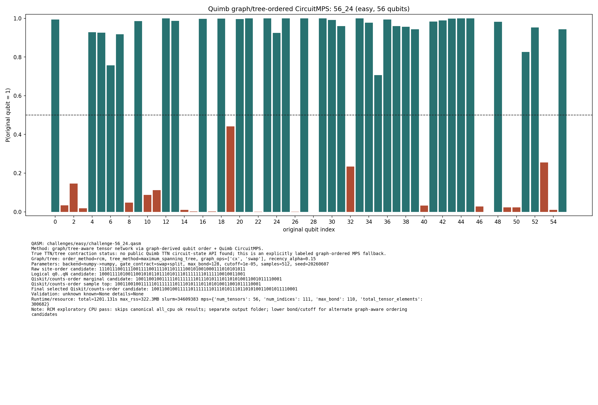

# Challenge 56_24

- Difficulty: easy
- Qubits: 56
- QASM: `challenges/easy/challenge-56_24.qasm`
- Selected answer: `10011001001111101111111011101011101101010011001011110001`
- Selected method: `quimb_gpu_all`
- Validation: `unknown`
- Evidence rows: 4
- Normalized index page: [56_24](../../results_index/by_challenge/56_24.md)

## Distribution Figures

### Quimb graph-ordered MPS: tree_tensor_sim/all/images/challenge-56_24.quimb_tree_graph_mps.png

### Quimb graph-ordered MPS: tree_tensor_sim/all_cpu/images/challenge-56_24.quimb_tree_graph_mps.png

### Quimb graph-ordered MPS: tree_tensor_sim/rcm_cpu/images/challenge-56_24.quimb_tree_graph_mps.png

## Candidate Rows

| review | selected | method | rank_type | rank | bitstring | score | count | support | fraction | validation | status | source |
|---|---:|---|---|---:|---|---:|---:|---:|---:|---|---|---|
|  | 0 | aer_tree_mps_all | sample_top | 1 | `10010001001111101111111011101010101101010011001011110001` | 0.0379638671875 | 311 |  | 0.0379638671875 |  | ok | `../quantum-junction-tree-tensor/outputs/tree_tensor_sim/all/json/challenge-56_24.tree_tensor_mps.json` |
|  | 0 | aer_tree_mps_all | sample_top | 1 | `10010001001111101111111011101010101101010011001011110001` | 0.0550537109375 | 451 |  | 0.0550537109375 |  | ok | `../quantum-junction-tree-tensor/outputs/tree_tensor_sim/all/json/challenge-56_24.tree_tensor_mps.json` |
|  | 0 | aer_tree_mps_all | sample_top | 1 | `10010001001111101111111011101010101101010011001011110001` | 0.0250244140625 | 205 |  | 0.0250244140625 |  | ok | `../quantum-junction-tree-tensor/outputs/tree_tensor_sim/all/json/challenge-56_24.tree_tensor_mps.json` |
|  | 0 | aer_tree_mps_all | sample_top | 2 | `10010011001111100111111011101010101101010011001011110001` | 0.0062255859375 | 51 |  | 0.0062255859375 |  | ok | `../quantum-junction-tree-tensor/outputs/tree_tensor_sim/all/json/challenge-56_24.tree_tensor_mps.json` |
|  | 0 | aer_tree_mps_all | sample_top | 2 | `10011000001111101111111011101011101101010011101011110001` | 0.0076904296875 | 63 |  | 0.0076904296875 |  | ok | `../quantum-junction-tree-tensor/outputs/tree_tensor_sim/all/json/challenge-56_24.tree_tensor_mps.json` |
|  | 0 | aer_tree_mps_all | sample_top | 2 | `10011001001111101011011011101011101101010011001011110001` | 0.046630859375 | 382 |  | 0.046630859375 |  | ok | `../quantum-junction-tree-tensor/outputs/tree_tensor_sim/all/json/challenge-56_24.tree_tensor_mps.json` |
|  | 0 | aer_tree_mps_all | sample_top | 3 | `10011000001111101111111011101011101101010011101011110001` | 0.0047607421875 | 39 |  | 0.0047607421875 |  | ok | `../quantum-junction-tree-tensor/outputs/tree_tensor_sim/all/json/challenge-56_24.tree_tensor_mps.json` |
|  | 0 | aer_tree_mps_all | sample_top | 3 | `10011001001111001111111011101011101101010011001011110001` | 0.00634765625 | 52 |  | 0.00634765625 |  | ok | `../quantum-junction-tree-tensor/outputs/tree_tensor_sim/all/json/challenge-56_24.tree_tensor_mps.json` |
|  | 0 | aer_tree_mps_all | sample_top | 3 | `10011001001111101111110011101011101101000011001011110001` | 0.0120849609375 | 99 |  | 0.0120849609375 |  | ok | `../quantum-junction-tree-tensor/outputs/tree_tensor_sim/all/json/challenge-56_24.tree_tensor_mps.json` |
|  | 0 | aer_tree_mps_all | sample_top | 4 | `10011001001111001111111011101011101101010011001011110001` | 0.0050048828125 | 41 |  | 0.0050048828125 |  | ok | `../quantum-junction-tree-tensor/outputs/tree_tensor_sim/all/json/challenge-56_24.tree_tensor_mps.json` |
|  | 0 | aer_tree_mps_all | sample_top | 4 | `10011001001111101111110011101011101101000011001011110001` | 0.0174560546875 | 143 |  | 0.0174560546875 |  | ok | `../quantum-junction-tree-tensor/outputs/tree_tensor_sim/all/json/challenge-56_24.tree_tensor_mps.json` |
|  | 0 | aer_tree_mps_all | sample_top | 4 | `10011001001111101111111011101011101101010001001011110001` | 0.017578125 | 144 |  | 0.017578125 |  | ok | `../quantum-junction-tree-tensor/outputs/tree_tensor_sim/all/json/challenge-56_24.tree_tensor_mps.json` |
|  | 0 | aer_tree_mps_all | sample_top | 5 | `10011001001111101111111011101011101101010001001011110011` | 0.0052490234375 | 43 |  | 0.0052490234375 |  | ok | `../quantum-junction-tree-tensor/outputs/tree_tensor_sim/all/json/challenge-56_24.tree_tensor_mps.json` |
|  | 0 | aer_tree_mps_all | sample_top | 5 | `10011001001111101111111011101011101101010011000011110001` | 0.0048828125 | 40 |  | 0.0048828125 |  | ok | `../quantum-junction-tree-tensor/outputs/tree_tensor_sim/all/json/challenge-56_24.tree_tensor_mps.json` |
|  | 0 | aer_tree_mps_all | sample_top | 5 | `10011001001111101111111011101011101101010011000011110001` | 0.0091552734375 | 75 |  | 0.0091552734375 |  | ok | `../quantum-junction-tree-tensor/outputs/tree_tensor_sim/all/json/challenge-56_24.tree_tensor_mps.json` |
|  | 0 | aer_tree_mps_all | sample_top | 6 | `10011001001111101111111011101011101101010011000011110001` | 0.007080078125 | 58 |  | 0.007080078125 |  | ok | `../quantum-junction-tree-tensor/outputs/tree_tensor_sim/all/json/challenge-56_24.tree_tensor_mps.json` |
|  | 0 | aer_tree_mps_all | sample_top | 6 | `10011001001111101111111011101011101101010011001010110001` | 0.0452880859375 | 371 |  | 0.0452880859375 |  | ok | `../quantum-junction-tree-tensor/outputs/tree_tensor_sim/all/json/challenge-56_24.tree_tensor_mps.json` |
|  | 0 | aer_tree_mps_all | sample_top | 6 | `10011001001111101111111011101011101101010011001010110001` | 0.0294189453125 | 241 |  | 0.0294189453125 |  | ok | `../quantum-junction-tree-tensor/outputs/tree_tensor_sim/all/json/challenge-56_24.tree_tensor_mps.json` |
|  | 0 | aer_tree_mps_all | sample_top | 7 | `10011001001111101111111011101011101101010011001010110001` | 0.0341796875 | 280 |  | 0.0341796875 |  | ok | `../quantum-junction-tree-tensor/outputs/tree_tensor_sim/all/json/challenge-56_24.tree_tensor_mps.json` |
|  | 1 | aer_tree_mps_all | sample_top | 7 | `10011001001111101111111011101011101101010011001011110001` | 0.4180908203125 | 3425 |  | 0.4180908203125 |  | ok | `../quantum-junction-tree-tensor/outputs/tree_tensor_sim/all/json/challenge-56_24.tree_tensor_mps.json` |
|  | 1 | aer_tree_mps_all | sample_top | 7 | `10011001001111101111111011101011101101010011001011110001` | 0.2601318359375 | 2131 |  | 0.2601318359375 |  | ok | `../quantum-junction-tree-tensor/outputs/tree_tensor_sim/all/json/challenge-56_24.tree_tensor_mps.json` |
|  | 1 | aer_tree_mps_all | sample_top | 8 | `10011001001111101111111011101011101101010011001011110001` | 0.5311279296875 | 4351 |  | 0.5311279296875 |  | ok | `../quantum-junction-tree-tensor/outputs/tree_tensor_sim/all/json/challenge-56_24.tree_tensor_mps.json` |
|  | 0 | aer_tree_mps_all | sample_top | 8 | `10011001001111101111111011101011101101010011001011110101` | 0.018310546875 | 150 |  | 0.018310546875 |  | ok | `../quantum-junction-tree-tensor/outputs/tree_tensor_sim/all/json/challenge-56_24.tree_tensor_mps.json` |
|  | 0 | aer_tree_mps_all | sample_top | 8 | `10011001001111101111111011101011101101010011001011110101` | 0.01123046875 | 92 |  | 0.01123046875 |  | ok | `../quantum-junction-tree-tensor/outputs/tree_tensor_sim/all/json/challenge-56_24.tree_tensor_mps.json` |
|  | 0 | aer_tree_mps_all | sample_top | 9 | `10011001001111101111111011101011101101010011001011110101` | 0.014892578125 | 122 |  | 0.014892578125 |  | ok | `../quantum-junction-tree-tensor/outputs/tree_tensor_sim/all/json/challenge-56_24.tree_tensor_mps.json` |
|  | 0 | aer_tree_mps_all | sample_top | 9 | `10011001001111101111111011101011101101010011001111110001` | 0.0177001953125 | 145 |  | 0.0177001953125 |  | ok | `../quantum-junction-tree-tensor/outputs/tree_tensor_sim/all/json/challenge-56_24.tree_tensor_mps.json` |
|  | 0 | aer_tree_mps_all | sample_top | 9 | `10011001001111101111111011101011101101010011001111110001` | 0.009765625 | 80 |  | 0.009765625 |  | ok | `../quantum-junction-tree-tensor/outputs/tree_tensor_sim/all/json/challenge-56_24.tree_tensor_mps.json` |
|  | 0 | aer_tree_mps_all | sample_top | 10 | `10011001001111101111111011101011101101010011001111110001` | 0.0213623046875 | 175 |  | 0.0213623046875 |  | ok | `../quantum-junction-tree-tensor/outputs/tree_tensor_sim/all/json/challenge-56_24.tree_tensor_mps.json` |
|  | 0 | aer_tree_mps_all | sample_top | 10 | `10011001001111101111111011101011101101010011011011110001` | 0.00439453125 | 36 |  | 0.00439453125 |  | ok | `../quantum-junction-tree-tensor/outputs/tree_tensor_sim/all/json/challenge-56_24.tree_tensor_mps.json` |
|  | 0 | aer_tree_mps_all | sample_top | 10 | `10011001001111101111111011101011101101010111001011110001` | 0.00927734375 | 76 |  | 0.00927734375 |  | ok | `../quantum-junction-tree-tensor/outputs/tree_tensor_sim/all/json/challenge-56_24.tree_tensor_mps.json` |
|  | 0 | aer_tree_mps_all | sample_top | 11 | `10011001001111101111111011101011101101010011011011110001` | 0.0098876953125 | 81 |  | 0.0098876953125 |  | ok | `../quantum-junction-tree-tensor/outputs/tree_tensor_sim/all/json/challenge-56_24.tree_tensor_mps.json` |
|  | 0 | aer_tree_mps_all | sample_top | 11 | `10011001001111101111111011101011101101111011001011110001` | 0.016845703125 | 138 |  | 0.016845703125 |  | ok | `../quantum-junction-tree-tensor/outputs/tree_tensor_sim/all/json/challenge-56_24.tree_tensor_mps.json` |
|  | 0 | aer_tree_mps_all | sample_top | 11 | `10011001001111101111111011101011101101111011001011110001` | 0.0118408203125 | 97 |  | 0.0118408203125 |  | ok | `../quantum-junction-tree-tensor/outputs/tree_tensor_sim/all/json/challenge-56_24.tree_tensor_mps.json` |
|  | 0 | aer_tree_mps_all | sample_top | 12 | `10011001001111101111111011101011101101111011001011110001` | 0.0172119140625 | 141 |  | 0.0172119140625 |  | ok | `../quantum-junction-tree-tensor/outputs/tree_tensor_sim/all/json/challenge-56_24.tree_tensor_mps.json` |
|  | 0 | aer_tree_mps_all | sample_top | 12 | `10011001001111101111111011101011101111010011001011111001` | 0.008544921875 | 70 |  | 0.008544921875 |  | ok | `../quantum-junction-tree-tensor/outputs/tree_tensor_sim/all/json/challenge-56_24.tree_tensor_mps.json` |
|  | 0 | aer_tree_mps_all | sample_top | 12 | `10011001001111101111111111101011101101010011001010010001` | 0.00634765625 | 52 |  | 0.00634765625 |  | ok | `../quantum-junction-tree-tensor/outputs/tree_tensor_sim/all/json/challenge-56_24.tree_tensor_mps.json` |
|  | 0 | aer_tree_mps_all | sample_top | 13 | `10011001001111101111111011101011101111010011001011110000` | 0.0069580078125 | 57 |  | 0.0069580078125 |  | ok | `../quantum-junction-tree-tensor/outputs/tree_tensor_sim/all/json/challenge-56_24.tree_tensor_mps.json` |
|  | 0 | aer_tree_mps_all | sample_top | 13 | `10011001001111101111111111101011101101010011001010110001` | 0.0242919921875 | 199 |  | 0.0242919921875 |  | ok | `../quantum-junction-tree-tensor/outputs/tree_tensor_sim/all/json/challenge-56_24.tree_tensor_mps.json` |
|  | 0 | aer_tree_mps_all | sample_top | 13 | `10011011001111100111111011101011101101010011001010110001` | 0.00634765625 | 52 |  | 0.00634765625 |  | ok | `../quantum-junction-tree-tensor/outputs/tree_tensor_sim/all/json/challenge-56_24.tree_tensor_mps.json` |
|  | 0 | aer_tree_mps_all | sample_top | 14 | `10011001001111101111111011101011101111010011001011111001` | 0.00927734375 | 76 |  | 0.00927734375 |  | ok | `../quantum-junction-tree-tensor/outputs/tree_tensor_sim/all/json/challenge-56_24.tree_tensor_mps.json` |
|  | 0 | aer_tree_mps_all | sample_top | 14 | `10011001001111101111111111101011101101010011001011110001` | 0.0194091796875 | 159 |  | 0.0194091796875 |  | ok | `../quantum-junction-tree-tensor/outputs/tree_tensor_sim/all/json/challenge-56_24.tree_tensor_mps.json` |
|  | 0 | aer_tree_mps_all | sample_top | 14 | `10011011001111100111111011101011101101010011001011110001` | 0.0572509765625 | 469 |  | 0.0572509765625 |  | ok | `../quantum-junction-tree-tensor/outputs/tree_tensor_sim/all/json/challenge-56_24.tree_tensor_mps.json` |
|  | 0 | aer_tree_mps_all | sample_top | 15 | `10011011001111100111111011101011101101010011001011110001` | 0.00634765625 | 52 |  | 0.00634765625 |  | ok | `../quantum-junction-tree-tensor/outputs/tree_tensor_sim/all/json/challenge-56_24.tree_tensor_mps.json` |
|  | 0 | aer_tree_mps_all | sample_top | 15 | `10011011001111101111111011101011101101010011001011110001` | 0.0113525390625 | 93 |  | 0.0113525390625 |  | ok | `../quantum-junction-tree-tensor/outputs/tree_tensor_sim/all/json/challenge-56_24.tree_tensor_mps.json` |
|  | 0 | aer_tree_mps_all | sample_top | 15 | `10011101001111101111111011101011101101010011001011110001` | 0.0087890625 | 72 |  | 0.0087890625 |  | ok | `../quantum-junction-tree-tensor/outputs/tree_tensor_sim/all/json/challenge-56_24.tree_tensor_mps.json` |
|  | 0 | aer_tree_mps_all | sample_top | 16 | `10011101001111101111111011101011101101010011001011110001` | 0.011474609375 | 94 |  | 0.011474609375 |  | ok | `../quantum-junction-tree-tensor/outputs/tree_tensor_sim/all/json/challenge-56_24.tree_tensor_mps.json` |
|  | 0 | aer_tree_mps_all | sample_top | 16 | `10110001001111101111111011101010101101010011001010110001` | 0.0042724609375 | 35 |  | 0.0042724609375 |  | ok | `../quantum-junction-tree-tensor/outputs/tree_tensor_sim/all/json/challenge-56_24.tree_tensor_mps.json` |
|  | 0 | aer_tree_mps_all | sample_top | 16 | `10111001001111101111111011101011101101010011001010110001` | 0.0162353515625 | 133 |  | 0.0162353515625 |  | ok | `../quantum-junction-tree-tensor/outputs/tree_tensor_sim/all/json/challenge-56_24.tree_tensor_mps.json` |
|  | 0 | aer_tree_mps_all | sample_top | 17 | `10111001001111101111111011101011101101010011001010110001` | 0.0452880859375 | 371 |  | 0.0452880859375 |  | ok | `../quantum-junction-tree-tensor/outputs/tree_tensor_sim/all/json/challenge-56_24.tree_tensor_mps.json` |
|  | 0 | aer_tree_mps_all | sample_top | 17 | `10111001001111101111111011101011101101010011001010110001` | 0.013427734375 | 110 |  | 0.013427734375 |  | ok | `../quantum-junction-tree-tensor/outputs/tree_tensor_sim/all/json/challenge-56_24.tree_tensor_mps.json` |
|  | 0 | aer_tree_mps_all | sample_top | 17 | `10111001001111101111111011101011101101010011001011110001` | 0.029296875 | 240 |  | 0.029296875 |  | ok | `../quantum-junction-tree-tensor/outputs/tree_tensor_sim/all/json/challenge-56_24.tree_tensor_mps.json` |
|  | 0 | aer_tree_mps_all | sample_top | 18 | `10111001001111101111111011101011101101010011001010110011` | 0.0052490234375 | 43 |  | 0.0052490234375 |  | ok | `../quantum-junction-tree-tensor/outputs/tree_tensor_sim/all/json/challenge-56_24.tree_tensor_mps.json` |
|  | 0 | aer_tree_mps_all | sample_top | 18 | `10111001001111101111111011101011101101010011001011110001` | 0.0294189453125 | 241 |  | 0.0294189453125 |  | ok | `../quantum-junction-tree-tensor/outputs/tree_tensor_sim/all/json/challenge-56_24.tree_tensor_mps.json` |
|  | 0 | aer_tree_mps_all | sample_top | 18 | `10111001001111101111111111101011101101010011001010110001` | 0.023193359375 | 190 |  | 0.023193359375 |  | ok | `../quantum-junction-tree-tensor/outputs/tree_tensor_sim/all/json/challenge-56_24.tree_tensor_mps.json` |
|  | 0 | aer_tree_mps_all | sample_top | 19 | `10111001001111101111111011101011101101010011001011110001` | 0.00634765625 | 52 |  | 0.00634765625 |  | ok | `../quantum-junction-tree-tensor/outputs/tree_tensor_sim/all/json/challenge-56_24.tree_tensor_mps.json` |
|  | 0 | aer_tree_mps_all | sample_top | 19 | `10111001001111101111111111101011101101010011001011010001` | 0.007568359375 | 62 |  | 0.007568359375 |  | ok | `../quantum-junction-tree-tensor/outputs/tree_tensor_sim/all/json/challenge-56_24.tree_tensor_mps.json` |
|  | 0 | aer_tree_mps_all | sample_top | 19 | `10111011001111100111111011101011101101010011001010110001` | 0.0062255859375 | 51 |  | 0.0062255859375 |  | ok | `../quantum-junction-tree-tensor/outputs/tree_tensor_sim/all/json/challenge-56_24.tree_tensor_mps.json` |
|  | 0 | aer_tree_mps_all | sample_top | 20 | `10111001001111101111111111101011101101010011001011110001` | 0.011474609375 | 94 |  | 0.011474609375 |  | ok | `../quantum-junction-tree-tensor/outputs/tree_tensor_sim/all/json/challenge-56_24.tree_tensor_mps.json` |
|  | 0 | aer_tree_mps_all | sample_top | 20 | `10111011001111100111111011101011101101010011001011110001` | 0.0050048828125 | 41 |  | 0.0050048828125 |  | ok | `../quantum-junction-tree-tensor/outputs/tree_tensor_sim/all/json/challenge-56_24.tree_tensor_mps.json` |
|  | 0 | aer_tree_mps_all | sample_top | 20 | `11011001001111101111111011101011101101010011001011110001` | 0.006103515625 | 50 |  | 0.006103515625 |  | ok | `../quantum-junction-tree-tensor/outputs/tree_tensor_sim/all/json/challenge-56_24.tree_tensor_mps.json` |
|  | 1 | collector_snapshot | collector_selected | 1 | `10011001001111101111111011101011101101010011001011110001` | 0.517578125 |  |  | 0.517578125 | unknown | unknown | `research/tree_tensor_sim_session/artifacts/collector/CANDIDATES.tsv` |
|  | 1 | quimb_cpu_all | collector_evidence | 2 | `10011001001111101111111011101011101101010011001011110001` | 0.517578125 |  |  | 0.517578125 | unknown | unknown | `outputs/tree_tensor_sim/all_cpu/json/challenge-56_24.quimb_tree_graph_mps.json` |
|  | 1 | quimb_cpu_all | final_candidate | 1 | `10011001001111101111111011101011101101010011001011110001` | 0.40898453922110356 |  |  |  | {"known_answer_qiskit_order":null,"status":"unknown"} | ok | `../quantum-junction-tree-tensor/outputs/tree_tensor_sim/all_cpu/json/challenge-56_24.quimb_tree_graph_mps.json` |
|  | 1 | quimb_cpu_all | marginal_candidate | 1 | `10011001001111101111111011101011101101010011001011110001` | 0.40898453922110356 |  |  |  | {"known_answer_qiskit_order":null,"status":"unknown"} | ok | `../quantum-junction-tree-tensor/outputs/tree_tensor_sim/all_cpu/json/challenge-56_24.quimb_tree_graph_mps.json` |
|  | 1 | quimb_cpu_all | sample_top | 1 | `10011001001111101111111011101011101101010011001011110001` | 0.517578125 | 530 |  | 0.517578125 | {"known_answer_qiskit_order":null,"status":"unknown"} | ok | `../quantum-junction-tree-tensor/outputs/tree_tensor_sim/all_cpu/json/challenge-56_24.quimb_tree_graph_mps.json` |
|  | 0 | quimb_cpu_all | sample_top | 2 | `10010001001111101111111011101010101101010011001011110001` | 0.0439453125 | 45 |  | 0.0439453125 | {"known_answer_qiskit_order":null,"status":"unknown"} | ok | `../quantum-junction-tree-tensor/outputs/tree_tensor_sim/all_cpu/json/challenge-56_24.quimb_tree_graph_mps.json` |
|  | 0 | quimb_cpu_all | sample_top | 3 | `10011001001111101111111011101011101101010011001010110001` | 0.033203125 | 34 |  | 0.033203125 | {"known_answer_qiskit_order":null,"status":"unknown"} | ok | `../quantum-junction-tree-tensor/outputs/tree_tensor_sim/all_cpu/json/challenge-56_24.quimb_tree_graph_mps.json` |
|  | 0 | quimb_cpu_all | sample_top | 4 | `10011001001111101111110011101011101101000011001011110001` | 0.03125 | 32 |  | 0.03125 | {"known_answer_qiskit_order":null,"status":"unknown"} | ok | `../quantum-junction-tree-tensor/outputs/tree_tensor_sim/all_cpu/json/challenge-56_24.quimb_tree_graph_mps.json` |
|  | 0 | quimb_cpu_all | sample_top | 5 | `10011001001111101111111011101011101101010011001111110001` | 0.02734375 | 28 |  | 0.02734375 | {"known_answer_qiskit_order":null,"status":"unknown"} | ok | `../quantum-junction-tree-tensor/outputs/tree_tensor_sim/all_cpu/json/challenge-56_24.quimb_tree_graph_mps.json` |
|  | 0 | quimb_cpu_all | sample_top | 6 | `10011001001111101111111011101011101101010011001011110101` | 0.0166015625 | 17 |  | 0.0166015625 | {"known_answer_qiskit_order":null,"status":"unknown"} | ok | `../quantum-junction-tree-tensor/outputs/tree_tensor_sim/all_cpu/json/challenge-56_24.quimb_tree_graph_mps.json` |
|  | 0 | quimb_cpu_all | sample_top | 7 | `10011001001111101111111011101011101101111011001011110001` | 0.015625 | 16 |  | 0.015625 | {"known_answer_qiskit_order":null,"status":"unknown"} | ok | `../quantum-junction-tree-tensor/outputs/tree_tensor_sim/all_cpu/json/challenge-56_24.quimb_tree_graph_mps.json` |
|  | 0 | quimb_cpu_all | sample_top | 8 | `10011001001111101111111011101011101111010011001011111001` | 0.0126953125 | 13 |  | 0.0126953125 | {"known_answer_qiskit_order":null,"status":"unknown"} | ok | `../quantum-junction-tree-tensor/outputs/tree_tensor_sim/all_cpu/json/challenge-56_24.quimb_tree_graph_mps.json` |
|  | 0 | quimb_cpu_all | sample_top | 9 | `10011011001111100111111011101011101101010011001011110001` | 0.0126953125 | 13 |  | 0.0126953125 | {"known_answer_qiskit_order":null,"status":"unknown"} | ok | `../quantum-junction-tree-tensor/outputs/tree_tensor_sim/all_cpu/json/challenge-56_24.quimb_tree_graph_mps.json` |
|  | 0 | quimb_cpu_all | sample_top | 10 | `10011001001111101111111011101011101111010011001011110000` | 0.01171875 | 12 |  | 0.01171875 | {"known_answer_qiskit_order":null,"status":"unknown"} | ok | `../quantum-junction-tree-tensor/outputs/tree_tensor_sim/all_cpu/json/challenge-56_24.quimb_tree_graph_mps.json` |
|  | 0 | quimb_cpu_all | sample_top | 11 | `10011001001111101111111011101011101101010011011011110001` | 0.0107421875 | 11 |  | 0.0107421875 | {"known_answer_qiskit_order":null,"status":"unknown"} | ok | `../quantum-junction-tree-tensor/outputs/tree_tensor_sim/all_cpu/json/challenge-56_24.quimb_tree_graph_mps.json` |
|  | 0 | quimb_cpu_all | sample_top | 12 | `10011000001111101111111011101011101101010011101011110001` | 0.0107421875 | 11 |  | 0.0107421875 | {"known_answer_qiskit_order":null,"status":"unknown"} | ok | `../quantum-junction-tree-tensor/outputs/tree_tensor_sim/all_cpu/json/challenge-56_24.quimb_tree_graph_mps.json` |
|  | 1 | quimb_gpu_all | collector_evidence | 1 | `10011001001111101111111011101011101101010011001011110001` | 0.517578125 |  |  | 0.517578125 | unknown | unknown | `outputs/tree_tensor_sim/all/json/challenge-56_24.quimb_tree_graph_mps.json` |
|  | 1 | quimb_gpu_all | final_candidate | 1 | `10011001001111101111111011101011101101010011001011110001` | 0.40896698647328633 |  |  |  | {"known_answer_qiskit_order":null,"status":"unknown"} | ok | `../quantum-junction-tree-tensor/outputs/tree_tensor_sim/all/json/challenge-56_24.quimb_tree_graph_mps.json` |
|  | 1 | quimb_gpu_all | marginal_candidate | 1 | `10011001001111101111111011101011101101010011001011110001` | 0.40896698647328633 |  |  |  | {"known_answer_qiskit_order":null,"status":"unknown"} | ok | `../quantum-junction-tree-tensor/outputs/tree_tensor_sim/all/json/challenge-56_24.quimb_tree_graph_mps.json` |
|  | 1 | quimb_gpu_all | sample_top | 1 | `10011001001111101111111011101011101101010011001011110001` | 0.517578125 | 530 |  | 0.517578125 | {"known_answer_qiskit_order":null,"status":"unknown"} | ok | `../quantum-junction-tree-tensor/outputs/tree_tensor_sim/all/json/challenge-56_24.quimb_tree_graph_mps.json` |
|  | 0 | quimb_gpu_all | sample_top | 2 | `10010001001111101111111011101010101101010011001011110001` | 0.0439453125 | 45 |  | 0.0439453125 | {"known_answer_qiskit_order":null,"status":"unknown"} | ok | `../quantum-junction-tree-tensor/outputs/tree_tensor_sim/all/json/challenge-56_24.quimb_tree_graph_mps.json` |
|  | 0 | quimb_gpu_all | sample_top | 3 | `10011001001111101111111011101011101101010011001010110001` | 0.033203125 | 34 |  | 0.033203125 | {"known_answer_qiskit_order":null,"status":"unknown"} | ok | `../quantum-junction-tree-tensor/outputs/tree_tensor_sim/all/json/challenge-56_24.quimb_tree_graph_mps.json` |
|  | 0 | quimb_gpu_all | sample_top | 4 | `10011001001111101111110011101011101101000011001011110001` | 0.03125 | 32 |  | 0.03125 | {"known_answer_qiskit_order":null,"status":"unknown"} | ok | `../quantum-junction-tree-tensor/outputs/tree_tensor_sim/all/json/challenge-56_24.quimb_tree_graph_mps.json` |
|  | 0 | quimb_gpu_all | sample_top | 5 | `10011001001111101111111011101011101101010011001111110001` | 0.02734375 | 28 |  | 0.02734375 | {"known_answer_qiskit_order":null,"status":"unknown"} | ok | `../quantum-junction-tree-tensor/outputs/tree_tensor_sim/all/json/challenge-56_24.quimb_tree_graph_mps.json` |
|  | 0 | quimb_gpu_all | sample_top | 6 | `10011001001111101111111011101011101101010011001011110101` | 0.0166015625 | 17 |  | 0.0166015625 | {"known_answer_qiskit_order":null,"status":"unknown"} | ok | `../quantum-junction-tree-tensor/outputs/tree_tensor_sim/all/json/challenge-56_24.quimb_tree_graph_mps.json` |
|  | 0 | quimb_gpu_all | sample_top | 7 | `10011001001111101111111011101011101101111011001011110001` | 0.015625 | 16 |  | 0.015625 | {"known_answer_qiskit_order":null,"status":"unknown"} | ok | `../quantum-junction-tree-tensor/outputs/tree_tensor_sim/all/json/challenge-56_24.quimb_tree_graph_mps.json` |
|  | 0 | quimb_gpu_all | sample_top | 8 | `10011001001111101111111011101011101111010011001011111001` | 0.0126953125 | 13 |  | 0.0126953125 | {"known_answer_qiskit_order":null,"status":"unknown"} | ok | `../quantum-junction-tree-tensor/outputs/tree_tensor_sim/all/json/challenge-56_24.quimb_tree_graph_mps.json` |
|  | 0 | quimb_gpu_all | sample_top | 9 | `10011011001111100111111011101011101101010011001011110001` | 0.0126953125 | 13 |  | 0.0126953125 | {"known_answer_qiskit_order":null,"status":"unknown"} | ok | `../quantum-junction-tree-tensor/outputs/tree_tensor_sim/all/json/challenge-56_24.quimb_tree_graph_mps.json` |
|  | 0 | quimb_gpu_all | sample_top | 10 | `10011001001111101111111011101011101111010011001011110000` | 0.01171875 | 12 |  | 0.01171875 | {"known_answer_qiskit_order":null,"status":"unknown"} | ok | `../quantum-junction-tree-tensor/outputs/tree_tensor_sim/all/json/challenge-56_24.quimb_tree_graph_mps.json` |
|  | 0 | quimb_gpu_all | sample_top | 11 | `10011001001111101111111011101011101101010011011011110001` | 0.0107421875 | 11 |  | 0.0107421875 | {"known_answer_qiskit_order":null,"status":"unknown"} | ok | `../quantum-junction-tree-tensor/outputs/tree_tensor_sim/all/json/challenge-56_24.quimb_tree_graph_mps.json` |
|  | 0 | quimb_gpu_all | sample_top | 12 | `10011000001111101111111011101011101101010011101011110001` | 0.0107421875 | 11 |  | 0.0107421875 | {"known_answer_qiskit_order":null,"status":"unknown"} | ok | `../quantum-junction-tree-tensor/outputs/tree_tensor_sim/all/json/challenge-56_24.quimb_tree_graph_mps.json` |
|  | 1 | quimb_rcm_cpu | collector_evidence | 3 | `10011001001111101111111011101011101101010011001011110001` | 0.095703125 |  |  | 0.095703125 | unknown | unknown | `outputs/tree_tensor_sim/rcm_cpu/json/challenge-56_24.quimb_tree_graph_mps.json` |
|  | 1 | quimb_rcm_cpu | final_candidate | 1 | `10011001001111101111111011101011101101010011001011110001` | 0.05870806587013233 |  |  |  | {"known_answer_qiskit_order":null,"status":"unknown"} | ok | `../quantum-junction-tree-tensor/outputs/tree_tensor_sim/rcm_cpu/json/challenge-56_24.quimb_tree_graph_mps.json` |
|  | 1 | quimb_rcm_cpu | marginal_candidate | 1 | `10011001001111101111111011101011101101010011001011110001` | 0.05870806587013233 |  |  |  | {"known_answer_qiskit_order":null,"status":"unknown"} | ok | `../quantum-junction-tree-tensor/outputs/tree_tensor_sim/rcm_cpu/json/challenge-56_24.quimb_tree_graph_mps.json` |
|  | 1 | quimb_rcm_cpu | sample_top | 1 | `10011001001111101111111011101011101101010011001011110001` | 0.095703125 | 49 |  | 0.095703125 | {"known_answer_qiskit_order":null,"status":"unknown"} | ok | `../quantum-junction-tree-tensor/outputs/tree_tensor_sim/rcm_cpu/json/challenge-56_24.quimb_tree_graph_mps.json` |
|  | 0 | quimb_rcm_cpu | sample_top | 2 | `10011001001111101111111011101011101111010011001011110001` | 0.06640625 | 34 |  | 0.06640625 | {"known_answer_qiskit_order":null,"status":"unknown"} | ok | `../quantum-junction-tree-tensor/outputs/tree_tensor_sim/rcm_cpu/json/challenge-56_24.quimb_tree_graph_mps.json` |
|  | 0 | quimb_rcm_cpu | sample_top | 3 | `10011001001111101111011011101011101101010011001011110001` | 0.0390625 | 20 |  | 0.0390625 | {"known_answer_qiskit_order":null,"status":"unknown"} | ok | `../quantum-junction-tree-tensor/outputs/tree_tensor_sim/rcm_cpu/json/challenge-56_24.quimb_tree_graph_mps.json` |
|  | 0 | quimb_rcm_cpu | sample_top | 4 | `10011001001111101111011011101011101111010011001011110001` | 0.029296875 | 15 |  | 0.029296875 | {"known_answer_qiskit_order":null,"status":"unknown"} | ok | `../quantum-junction-tree-tensor/outputs/tree_tensor_sim/rcm_cpu/json/challenge-56_24.quimb_tree_graph_mps.json` |
|  | 0 | quimb_rcm_cpu | sample_top | 5 | `10011001001111101111111011101011101101010011001011110101` | 0.015625 | 8 |  | 0.015625 | {"known_answer_qiskit_order":null,"status":"unknown"} | ok | `../quantum-junction-tree-tensor/outputs/tree_tensor_sim/rcm_cpu/json/challenge-56_24.quimb_tree_graph_mps.json` |
|  | 0 | quimb_rcm_cpu | sample_top | 6 | `10011001001111101111111011101011101111010011011011110001` | 0.01171875 | 6 |  | 0.01171875 | {"known_answer_qiskit_order":null,"status":"unknown"} | ok | `../quantum-junction-tree-tensor/outputs/tree_tensor_sim/rcm_cpu/json/challenge-56_24.quimb_tree_graph_mps.json` |
|  | 0 | quimb_rcm_cpu | sample_top | 7 | `10111001001111101111111111101011101111010011001010110001` | 0.009765625 | 5 |  | 0.009765625 | {"known_answer_qiskit_order":null,"status":"unknown"} | ok | `../quantum-junction-tree-tensor/outputs/tree_tensor_sim/rcm_cpu/json/challenge-56_24.quimb_tree_graph_mps.json` |
|  | 0 | quimb_rcm_cpu | sample_top | 8 | `10111001001111101111111111101011101101010011001010110001` | 0.009765625 | 5 |  | 0.009765625 | {"known_answer_qiskit_order":null,"status":"unknown"} | ok | `../quantum-junction-tree-tensor/outputs/tree_tensor_sim/rcm_cpu/json/challenge-56_24.quimb_tree_graph_mps.json` |
|  | 0 | quimb_rcm_cpu | sample_top | 9 | `10011001001111101111111111101011101111010011001011110001` | 0.0078125 | 4 |  | 0.0078125 | {"known_answer_qiskit_order":null,"status":"unknown"} | ok | `../quantum-junction-tree-tensor/outputs/tree_tensor_sim/rcm_cpu/json/challenge-56_24.quimb_tree_graph_mps.json` |
|  | 0 | quimb_rcm_cpu | sample_top | 10 | `10010001001111101111111011101010101101010011001011110001` | 0.0078125 | 4 |  | 0.0078125 | {"known_answer_qiskit_order":null,"status":"unknown"} | ok | `../quantum-junction-tree-tensor/outputs/tree_tensor_sim/rcm_cpu/json/challenge-56_24.quimb_tree_graph_mps.json` |
|  | 0 | quimb_rcm_cpu | sample_top | 11 | `10111001001111101111011111101011101111010011001010110001` | 0.0078125 | 4 |  | 0.0078125 | {"known_answer_qiskit_order":null,"status":"unknown"} | ok | `../quantum-junction-tree-tensor/outputs/tree_tensor_sim/rcm_cpu/json/challenge-56_24.quimb_tree_graph_mps.json` |
|  | 0 | quimb_rcm_cpu | sample_top | 12 | `10011001001111101111111111101011101101010011001011110001` | 0.005859375 | 3 |  | 0.005859375 | {"known_answer_qiskit_order":null,"status":"unknown"} | ok | `../quantum-junction-tree-tensor/outputs/tree_tensor_sim/rcm_cpu/json/challenge-56_24.quimb_tree_graph_mps.json` |
|  | 0 | sparse_beam | collector_evidence | 4 | `01011011111110101100100010101111111101111011100110101010` | 0.00014517357410813328 |  |  | 0.00014517357410813328 | unknown | unknown | `outputs/tree_tensor_sim/sparse_beam/json/challenge-56_24.beam20000.json` |
|  | 0 | sparse_beam | sparse_beam | 1 | `01011011111110101100100010101111111101111011100110101010` | 8.767640275004183e-44 |  |  |  |  | ok | `../quantum-junction-tree-tensor/outputs/tree_tensor_sim/sparse_beam/json/challenge-56_24.beam20000.json` |
|  | 0 | sparse_beam | sparse_beam | 2 | `01010011111110101100100010101111111101011011100110100011` | 8.767640275004183e-44 |  |  |  |  | ok | `../quantum-junction-tree-tensor/outputs/tree_tensor_sim/sparse_beam/json/challenge-56_24.beam20000.json` |
|  | 0 | sparse_beam | sparse_beam | 3 | `01011011111110101100100010101111111101011011100110101010` | 8.767640275004179e-44 |  |  |  |  | ok | `../quantum-junction-tree-tensor/outputs/tree_tensor_sim/sparse_beam/json/challenge-56_24.beam20000.json` |
|  | 0 | sparse_beam | sparse_beam | 4 | `01010011111110101100100010101111111101011011100110101010` | 8.767640275004179e-44 |  |  |  |  | ok | `../quantum-junction-tree-tensor/outputs/tree_tensor_sim/sparse_beam/json/challenge-56_24.beam20000.json` |
|  | 0 | sparse_beam | sparse_beam | 5 | `01011011111110101100100010101111111101111011100110100011` | 8.767640275004177e-44 |  |  |  |  | ok | `../quantum-junction-tree-tensor/outputs/tree_tensor_sim/sparse_beam/json/challenge-56_24.beam20000.json` |
|  | 0 | sparse_beam | sparse_beam | 6 | `01011011111110101100100010101111111101011011100110100011` | 8.767640275004177e-44 |  |  |  |  | ok | `../quantum-junction-tree-tensor/outputs/tree_tensor_sim/sparse_beam/json/challenge-56_24.beam20000.json` |
|  | 0 | sparse_beam | sparse_beam | 7 | `01010011111110101100100010101111111101111011100110101010` | 8.767640275004177e-44 |  |  |  |  | ok | `../quantum-junction-tree-tensor/outputs/tree_tensor_sim/sparse_beam/json/challenge-56_24.beam20000.json` |
|  | 0 | sparse_beam | sparse_beam | 8 | `01010011111110101100100010101111111101111011100110100011` | 8.767640275004169e-44 |  |  |  |  | ok | `../quantum-junction-tree-tensor/outputs/tree_tensor_sim/sparse_beam/json/challenge-56_24.beam20000.json` |
