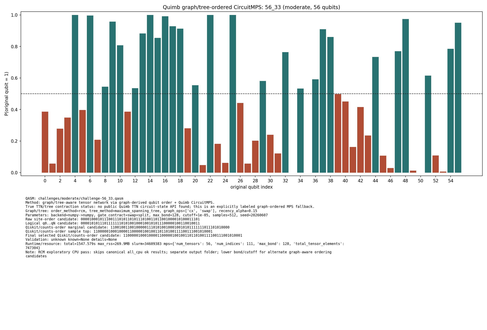

# Challenge 56_33

- Difficulty: moderate
- Qubits: 56
- QASM: `challenges/moderate/challenge-56_33.qasm`
- Selected answer: `11001001100101001111010100100010010101111111011101010000`
- Selected method: `quimb_cpu_all`
- Validation: `unknown`
- Evidence rows: 2
- Normalized index page: [56_33](../../results_index/by_challenge/56_33.md)

## Distribution Figures

### Quimb graph-ordered MPS: tree_tensor_sim/all_cpu/images/challenge-56_33.quimb_tree_graph_mps.png

### Quimb graph-ordered MPS: tree_tensor_sim/rcm_cpu/images/challenge-56_33.quimb_tree_graph_mps.png

## Candidate Rows

| review | selected | method | rank_type | rank | bitstring | score | count | support | fraction | validation | status | source |
|---|---:|---|---|---:|---|---:|---:|---:|---:|---|---|---|
|  | 0 | aer_tree_mps_all | sample_top | 1 | `10001001100100001111010100100010010101110111011101010000` | 0.0032958984375 | 27 |  | 0.0032958984375 |  | ok | `../quantum-junction-tree-tensor/outputs/tree_tensor_sim/all/json/challenge-56_33.tree_tensor_mps.json` |
|  | 0 | aer_tree_mps_all | sample_top | 1 | `10001001100100001111010100100010010101111111011101010000` | 0.00390625 | 32 |  | 0.00390625 |  | ok | `../quantum-junction-tree-tensor/outputs/tree_tensor_sim/all/json/challenge-56_33.tree_tensor_mps.json` |
|  | 0 | aer_tree_mps_all | sample_top | 1 | `10011001100100001111010100100010010101111111011101010000` | 0.001953125 | 16 |  | 0.001953125 |  | ok | `../quantum-junction-tree-tensor/outputs/tree_tensor_sim/all/json/challenge-56_33.tree_tensor_mps.json` |
|  | 0 | aer_tree_mps_all | sample_top | 2 | `10001001100100001111010100100010010101111111011101010000` | 0.015625 | 128 |  | 0.015625 |  | ok | `../quantum-junction-tree-tensor/outputs/tree_tensor_sim/all/json/challenge-56_33.tree_tensor_mps.json` |
|  | 0 | aer_tree_mps_all | sample_top | 2 | `10001001100100001111010100100010010101111111011101110000` | 0.0035400390625 | 29 |  | 0.0035400390625 |  | ok | `../quantum-junction-tree-tensor/outputs/tree_tensor_sim/all/json/challenge-56_33.tree_tensor_mps.json` |
|  | 0 | aer_tree_mps_all | sample_top | 2 | `10011001100100011111010100100010010101111111011101010000` | 0.0020751953125 | 17 |  | 0.0020751953125 |  | ok | `../quantum-junction-tree-tensor/outputs/tree_tensor_sim/all/json/challenge-56_33.tree_tensor_mps.json` |
|  | 0 | aer_tree_mps_all | sample_top | 3 | `10001001100100001111010100100010010101111111011101110000` | 0.0040283203125 | 33 |  | 0.0040283203125 |  | ok | `../quantum-junction-tree-tensor/outputs/tree_tensor_sim/all/json/challenge-56_33.tree_tensor_mps.json` |
|  | 0 | aer_tree_mps_all | sample_top | 3 | `11000001100100001111000100100010010001111111111001010001` | 0.005615234375 | 46 |  | 0.005615234375 |  | ok | `../quantum-junction-tree-tensor/outputs/tree_tensor_sim/all/json/challenge-56_33.tree_tensor_mps.json` |
|  | 0 | aer_tree_mps_all | sample_top | 3 | `11000001100100001111000100100010010001111111111001010001` | 0.0035400390625 | 29 |  | 0.0035400390625 |  | ok | `../quantum-junction-tree-tensor/outputs/tree_tensor_sim/all/json/challenge-56_33.tree_tensor_mps.json` |
|  | 0 | aer_tree_mps_all | sample_top | 4 | `10011001100100001111010100100010010101111111011101010000` | 0.00341796875 | 28 |  | 0.00341796875 |  | ok | `../quantum-junction-tree-tensor/outputs/tree_tensor_sim/all/json/challenge-56_33.tree_tensor_mps.json` |
|  | 0 | aer_tree_mps_all | sample_top | 4 | `11000001100100001111000100100010010001111111111101010001` | 0.002685546875 | 22 |  | 0.002685546875 |  | ok | `../quantum-junction-tree-tensor/outputs/tree_tensor_sim/all/json/challenge-56_33.tree_tensor_mps.json` |
|  | 0 | aer_tree_mps_all | sample_top | 4 | `11001001000100001111010100100010010101111111011101010000` | 0.0032958984375 | 27 |  | 0.0032958984375 |  | ok | `../quantum-junction-tree-tensor/outputs/tree_tensor_sim/all/json/challenge-56_33.tree_tensor_mps.json` |
|  | 0 | aer_tree_mps_all | sample_top | 5 | `11000001100100001111000100100010010001111111111001010000` | 0.0032958984375 | 27 |  | 0.0032958984375 |  | ok | `../quantum-junction-tree-tensor/outputs/tree_tensor_sim/all/json/challenge-56_33.tree_tensor_mps.json` |
|  | 0 | aer_tree_mps_all | sample_top | 5 | `11000001100100001111000100100110010101111111111101010001` | 0.0040283203125 | 33 |  | 0.0040283203125 |  | ok | `../quantum-junction-tree-tensor/outputs/tree_tensor_sim/all/json/challenge-56_33.tree_tensor_mps.json` |
|  | 0 | aer_tree_mps_all | sample_top | 5 | `11001001000100001111010100100010010101111111011101110000` | 0.0028076171875 | 23 |  | 0.0028076171875 |  | ok | `../quantum-junction-tree-tensor/outputs/tree_tensor_sim/all/json/challenge-56_33.tree_tensor_mps.json` |
|  | 0 | aer_tree_mps_all | sample_top | 6 | `11000001100100001111000100100010010001111111111001010001` | 0.0074462890625 | 61 |  | 0.0074462890625 |  | ok | `../quantum-junction-tree-tensor/outputs/tree_tensor_sim/all/json/challenge-56_33.tree_tensor_mps.json` |
|  | 0 | aer_tree_mps_all | sample_top | 6 | `11000001100100011111000100100010010001111111111001010001` | 0.003173828125 | 26 |  | 0.003173828125 |  | ok | `../quantum-junction-tree-tensor/outputs/tree_tensor_sim/all/json/challenge-56_33.tree_tensor_mps.json` |
|  | 0 | aer_tree_mps_all | sample_top | 6 | `11001001100100000111010000100010010101111111011101010000` | 0.0032958984375 | 27 |  | 0.0032958984375 |  | ok | `../quantum-junction-tree-tensor/outputs/tree_tensor_sim/all/json/challenge-56_33.tree_tensor_mps.json` |
|  | 0 | aer_tree_mps_all | sample_top | 7 | `11000001100100001111000100100010010011111111111001010001` | 0.005615234375 | 46 |  | 0.005615234375 |  | ok | `../quantum-junction-tree-tensor/outputs/tree_tensor_sim/all/json/challenge-56_33.tree_tensor_mps.json` |
|  | 0 | aer_tree_mps_all | sample_top | 7 | `11000001100100011111000100100010010001111111111101010001` | 0.003173828125 | 26 |  | 0.003173828125 |  | ok | `../quantum-junction-tree-tensor/outputs/tree_tensor_sim/all/json/challenge-56_33.tree_tensor_mps.json` |
|  | 0 | aer_tree_mps_all | sample_top | 7 | `11001001100100000111010100100010010100111111011101010000` | 0.003173828125 | 26 |  | 0.003173828125 |  | ok | `../quantum-junction-tree-tensor/outputs/tree_tensor_sim/all/json/challenge-56_33.tree_tensor_mps.json` |
|  | 0 | aer_tree_mps_all | sample_top | 8 | `11000001100100011111000100100110010101111111111101010001` | 0.00439453125 | 36 |  | 0.00439453125 |  | ok | `../quantum-junction-tree-tensor/outputs/tree_tensor_sim/all/json/challenge-56_33.tree_tensor_mps.json` |
|  | 0 | aer_tree_mps_all | sample_top | 8 | `11001001100100000111010000100010010101111111011101010000` | 0.003662109375 | 30 |  | 0.003662109375 |  | ok | `../quantum-junction-tree-tensor/outputs/tree_tensor_sim/all/json/challenge-56_33.tree_tensor_mps.json` |
|  | 0 | aer_tree_mps_all | sample_top | 8 | `11001001100100000111010100100010010101111111011101010000` | 0.0035400390625 | 29 |  | 0.0035400390625 |  | ok | `../quantum-junction-tree-tensor/outputs/tree_tensor_sim/all/json/challenge-56_33.tree_tensor_mps.json` |
|  | 0 | aer_tree_mps_all | sample_top | 9 | `11001001000100001111010100100010010101111111011101010000` | 0.00244140625 | 20 |  | 0.00244140625 |  | ok | `../quantum-junction-tree-tensor/outputs/tree_tensor_sim/all/json/challenge-56_33.tree_tensor_mps.json` |
|  | 0 | aer_tree_mps_all | sample_top | 9 | `11001001100100000111010100100010010101111111011101010000` | 0.0079345703125 | 65 |  | 0.0079345703125 |  | ok | `../quantum-junction-tree-tensor/outputs/tree_tensor_sim/all/json/challenge-56_33.tree_tensor_mps.json` |
|  | 0 | aer_tree_mps_all | sample_top | 9 | `11001001100100001111000100100010010101111111011101010000` | 0.0035400390625 | 29 |  | 0.0035400390625 |  | ok | `../quantum-junction-tree-tensor/outputs/tree_tensor_sim/all/json/challenge-56_33.tree_tensor_mps.json` |
|  | 0 | aer_tree_mps_all | sample_top | 10 | `11001001100100000111010100100010010101111111011101010000` | 0.00244140625 | 20 |  | 0.00244140625 |  | ok | `../quantum-junction-tree-tensor/outputs/tree_tensor_sim/all/json/challenge-56_33.tree_tensor_mps.json` |
|  | 0 | aer_tree_mps_all | sample_top | 10 | `11001001100100001111010000100010010101111111011101010000` | 0.0040283203125 | 33 |  | 0.0040283203125 |  | ok | `../quantum-junction-tree-tensor/outputs/tree_tensor_sim/all/json/challenge-56_33.tree_tensor_mps.json` |
|  | 0 | aer_tree_mps_all | sample_top | 10 | `11001001100100001111010100000010010101111111011101010000` | 0.0028076171875 | 23 |  | 0.0028076171875 |  | ok | `../quantum-junction-tree-tensor/outputs/tree_tensor_sim/all/json/challenge-56_33.tree_tensor_mps.json` |
|  | 0 | aer_tree_mps_all | sample_top | 11 | `11001001100100001111000100100010010101111111011101010000` | 0.0029296875 | 24 |  | 0.0029296875 |  | ok | `../quantum-junction-tree-tensor/outputs/tree_tensor_sim/all/json/challenge-56_33.tree_tensor_mps.json` |
|  | 0 | aer_tree_mps_all | sample_top | 11 | `11001001100100001111010100000010010101111111011101010000` | 0.011474609375 | 94 |  | 0.011474609375 |  | ok | `../quantum-junction-tree-tensor/outputs/tree_tensor_sim/all/json/challenge-56_33.tree_tensor_mps.json` |
|  | 0 | aer_tree_mps_all | sample_top | 11 | `11001001100100001111010100000010010101111111011101110000` | 0.003662109375 | 30 |  | 0.003662109375 |  | ok | `../quantum-junction-tree-tensor/outputs/tree_tensor_sim/all/json/challenge-56_33.tree_tensor_mps.json` |
|  | 0 | aer_tree_mps_all | sample_top | 12 | `11001001100100001111010100100010010101110111011101010000` | 0.0045166015625 | 37 |  | 0.0045166015625 |  | ok | `../quantum-junction-tree-tensor/outputs/tree_tensor_sim/all/json/challenge-56_33.tree_tensor_mps.json` |
|  | 0 | aer_tree_mps_all | sample_top | 12 | `11001001100100001111010100100010010101110111011101010000` | 0.010498046875 | 86 |  | 0.010498046875 |  | ok | `../quantum-junction-tree-tensor/outputs/tree_tensor_sim/all/json/challenge-56_33.tree_tensor_mps.json` |
|  | 0 | aer_tree_mps_all | sample_top | 12 | `11001001100100001111010100100010010101111111001101010000` | 0.002197265625 | 18 |  | 0.002197265625 |  | ok | `../quantum-junction-tree-tensor/outputs/tree_tensor_sim/all/json/challenge-56_33.tree_tensor_mps.json` |
|  | 0 | aer_tree_mps_all | sample_top | 13 | `11001001100100001111010100100010010101111111010101010000` | 0.0059814453125 | 49 |  | 0.0059814453125 |  | ok | `../quantum-junction-tree-tensor/outputs/tree_tensor_sim/all/json/challenge-56_33.tree_tensor_mps.json` |
|  | 0 | aer_tree_mps_all | sample_top | 13 | `11001001100100001111010100100010010101111111010101010000` | 0.00439453125 | 36 |  | 0.00439453125 |  | ok | `../quantum-junction-tree-tensor/outputs/tree_tensor_sim/all/json/challenge-56_33.tree_tensor_mps.json` |
|  | 0 | aer_tree_mps_all | sample_top | 13 | `11001001100100001111010100100010010101111111011101010000` | 0.010009765625 | 82 |  | 0.010009765625 |  | ok | `../quantum-junction-tree-tensor/outputs/tree_tensor_sim/all/json/challenge-56_33.tree_tensor_mps.json` |
|  | 0 | aer_tree_mps_all | sample_top | 14 | `11001001100100001111010100100010010101111111011001010000` | 0.0052490234375 | 43 |  | 0.0052490234375 |  | ok | `../quantum-junction-tree-tensor/outputs/tree_tensor_sim/all/json/challenge-56_33.tree_tensor_mps.json` |
|  | 0 | aer_tree_mps_all | sample_top | 14 | `11001001100100001111010100100010010101111111011101010000` | 0.0537109375 | 440 |  | 0.0537109375 |  | ok | `../quantum-junction-tree-tensor/outputs/tree_tensor_sim/all/json/challenge-56_33.tree_tensor_mps.json` |
|  | 0 | aer_tree_mps_all | sample_top | 14 | `11001001100100001111010100100010011101111111011101010000` | 0.001953125 | 16 |  | 0.001953125 |  | ok | `../quantum-junction-tree-tensor/outputs/tree_tensor_sim/all/json/challenge-56_33.tree_tensor_mps.json` |
|  | 0 | aer_tree_mps_all | sample_top | 15 | `11001001100100001111010100100010010101111111011001110000` | 0.0037841796875 | 31 |  | 0.0037841796875 |  | ok | `../quantum-junction-tree-tensor/outputs/tree_tensor_sim/all/json/challenge-56_33.tree_tensor_mps.json` |
|  | 0 | aer_tree_mps_all | sample_top | 15 | `11001001100100001111010100100010010101111111011101110000` | 0.0120849609375 | 99 |  | 0.0120849609375 |  | ok | `../quantum-junction-tree-tensor/outputs/tree_tensor_sim/all/json/challenge-56_33.tree_tensor_mps.json` |
|  | 0 | aer_tree_mps_all | sample_top | 15 | `11001001100100001111010100100110010001111111011101010000` | 0.00537109375 | 44 |  | 0.00537109375 |  | ok | `../quantum-junction-tree-tensor/outputs/tree_tensor_sim/all/json/challenge-56_33.tree_tensor_mps.json` |
|  | 0 | aer_tree_mps_all | sample_top | 16 | `11001001100100001111010100100010010101111111011101010000` | 0.0230712890625 | 189 |  | 0.0230712890625 |  | ok | `../quantum-junction-tree-tensor/outputs/tree_tensor_sim/all/json/challenge-56_33.tree_tensor_mps.json` |
|  | 0 | aer_tree_mps_all | sample_top | 16 | `11001001100100001111010100100010011101111111011101010000` | 0.00341796875 | 28 |  | 0.00341796875 |  | ok | `../quantum-junction-tree-tensor/outputs/tree_tensor_sim/all/json/challenge-56_33.tree_tensor_mps.json` |
|  | 0 | aer_tree_mps_all | sample_top | 16 | `11001001100100010111010100100010010101111111011101010000` | 0.0029296875 | 24 |  | 0.0029296875 |  | ok | `../quantum-junction-tree-tensor/outputs/tree_tensor_sim/all/json/challenge-56_33.tree_tensor_mps.json` |
|  | 0 | aer_tree_mps_all | sample_top | 17 | `11001001100100001111010100100010010101111111011101110000` | 0.015625 | 128 |  | 0.015625 |  | ok | `../quantum-junction-tree-tensor/outputs/tree_tensor_sim/all/json/challenge-56_33.tree_tensor_mps.json` |
|  | 0 | aer_tree_mps_all | sample_top | 17 | `11001001100100011111000100100010010101111111011101010000` | 0.002197265625 | 18 |  | 0.002197265625 |  | ok | `../quantum-junction-tree-tensor/outputs/tree_tensor_sim/all/json/challenge-56_33.tree_tensor_mps.json` |
|  | 0 | aer_tree_mps_all | sample_top | 17 | `11001001100110000111010100100010010101111111011101010000` | 0.0045166015625 | 37 |  | 0.0045166015625 |  | ok | `../quantum-junction-tree-tensor/outputs/tree_tensor_sim/all/json/challenge-56_33.tree_tensor_mps.json` |
|  | 0 | aer_tree_mps_all | sample_top | 18 | `11001001100100001111010100100010011101111111011101010000` | 0.0030517578125 | 25 |  | 0.0030517578125 |  | ok | `../quantum-junction-tree-tensor/outputs/tree_tensor_sim/all/json/challenge-56_33.tree_tensor_mps.json` |
|  | 0 | aer_tree_mps_all | sample_top | 18 | `11001001100100011111010100100010010101111111011101010000` | 0.009765625 | 80 |  | 0.009765625 |  | ok | `../quantum-junction-tree-tensor/outputs/tree_tensor_sim/all/json/challenge-56_33.tree_tensor_mps.json` |
|  | 0 | aer_tree_mps_all | sample_top | 18 | `11001001100110001111010000100010010101111111011101010000` | 0.0081787109375 | 67 |  | 0.0081787109375 |  | ok | `../quantum-junction-tree-tensor/outputs/tree_tensor_sim/all/json/challenge-56_33.tree_tensor_mps.json` |
|  | 0 | aer_tree_mps_all | sample_top | 19 | `11001001100100011111010100100110010001111111011101010000` | 0.00341796875 | 28 |  | 0.00341796875 |  | ok | `../quantum-junction-tree-tensor/outputs/tree_tensor_sim/all/json/challenge-56_33.tree_tensor_mps.json` |
|  | 0 | aer_tree_mps_all | sample_top | 19 | `11001001100110000111010100100010010101111111011101010000` | 0.0029296875 | 24 |  | 0.0029296875 |  | ok | `../quantum-junction-tree-tensor/outputs/tree_tensor_sim/all/json/challenge-56_33.tree_tensor_mps.json` |
|  | 0 | aer_tree_mps_all | sample_top | 19 | `11001001100110001111010100100010010101111111011101010000` | 0.005126953125 | 42 |  | 0.005126953125 |  | ok | `../quantum-junction-tree-tensor/outputs/tree_tensor_sim/all/json/challenge-56_33.tree_tensor_mps.json` |
|  | 0 | aer_tree_mps_all | sample_top | 20 | `11001001100110001111010000100010010101111111011101010000` | 0.0029296875 | 24 |  | 0.0029296875 |  | ok | `../quantum-junction-tree-tensor/outputs/tree_tensor_sim/all/json/challenge-56_33.tree_tensor_mps.json` |
|  | 0 | aer_tree_mps_all | sample_top | 20 | `11001001101100001111010100100010010101111111011101010000` | 0.0025634765625 | 21 |  | 0.0025634765625 |  | ok | `../quantum-junction-tree-tensor/outputs/tree_tensor_sim/all/json/challenge-56_33.tree_tensor_mps.json` |
|  | 0 | aer_tree_mps_all | sample_top | 20 | `11011001100100000111010100100010010100111111011101010000` | 0.0029296875 | 24 |  | 0.0029296875 |  | ok | `../quantum-junction-tree-tensor/outputs/tree_tensor_sim/all/json/challenge-56_33.tree_tensor_mps.json` |
|  | 1 | collector_snapshot | collector_selected | 1 | `11001001100101001111010100100010010101111111011101010000` | 0.041015625 |  |  | 0.041015625 | unknown | unknown | `research/tree_tensor_sim_session/artifacts/collector/CANDIDATES.tsv` |
|  | 1 | quimb_cpu_all | collector_evidence | 1 | `11001001100101001111010100100010010101111111011101010000` | 0.041015625 |  |  | 0.041015625 | unknown | unknown | `outputs/tree_tensor_sim/all_cpu/json/challenge-56_33.quimb_tree_graph_mps.json` |
|  | 1 | quimb_cpu_all | final_candidate | 1 | `11001001100101001111010100100010010101111111011101010000` | 0.00553121906891485 |  |  |  | {"known_answer_qiskit_order":null,"status":"unknown"} | ok | `../quantum-junction-tree-tensor/outputs/tree_tensor_sim/all_cpu/json/challenge-56_33.quimb_tree_graph_mps.json` |
|  | 0 | quimb_cpu_all | marginal_candidate | 1 | `11001001100100001111010100100010010101111111011101010000` | 0.00553121906891485 |  |  |  | {"known_answer_qiskit_order":null,"status":"unknown"} | ok | `../quantum-junction-tree-tensor/outputs/tree_tensor_sim/all_cpu/json/challenge-56_33.quimb_tree_graph_mps.json` |
|  | 1 | quimb_cpu_all | sample_top | 1 | `11001001100101001111010100100010010101111111011101010000` | 0.041015625 | 42 |  | 0.041015625 | {"known_answer_qiskit_order":null,"status":"unknown"} | ok | `../quantum-junction-tree-tensor/outputs/tree_tensor_sim/all_cpu/json/challenge-56_33.quimb_tree_graph_mps.json` |
|  | 0 | quimb_cpu_all | sample_top | 2 | `11001001100100001111010100100010010101111111011101010000` | 0.03125 | 32 |  | 0.03125 | {"known_answer_qiskit_order":null,"status":"unknown"} | ok | `../quantum-junction-tree-tensor/outputs/tree_tensor_sim/all_cpu/json/challenge-56_33.quimb_tree_graph_mps.json` |
|  | 0 | quimb_cpu_all | sample_top | 3 | `11001001100100001111010100100010010101111101011101010000` | 0.009765625 | 10 |  | 0.009765625 | {"known_answer_qiskit_order":null,"status":"unknown"} | ok | `../quantum-junction-tree-tensor/outputs/tree_tensor_sim/all_cpu/json/challenge-56_33.quimb_tree_graph_mps.json` |
|  | 0 | quimb_cpu_all | sample_top | 4 | `11001001100110001111010000100010010101111111011101010000` | 0.009765625 | 10 |  | 0.009765625 | {"known_answer_qiskit_order":null,"status":"unknown"} | ok | `../quantum-junction-tree-tensor/outputs/tree_tensor_sim/all_cpu/json/challenge-56_33.quimb_tree_graph_mps.json` |
|  | 0 | quimb_cpu_all | sample_top | 5 | `10001001100100001111010100100010010101111111011101010000` | 0.0078125 | 8 |  | 0.0078125 | {"known_answer_qiskit_order":null,"status":"unknown"} | ok | `../quantum-junction-tree-tensor/outputs/tree_tensor_sim/all_cpu/json/challenge-56_33.quimb_tree_graph_mps.json` |
|  | 0 | quimb_cpu_all | sample_top | 6 | `11001001100100001111010100100010010101110111011101010000` | 0.0068359375 | 7 |  | 0.0068359375 | {"known_answer_qiskit_order":null,"status":"unknown"} | ok | `../quantum-junction-tree-tensor/outputs/tree_tensor_sim/all_cpu/json/challenge-56_33.quimb_tree_graph_mps.json` |
|  | 0 | quimb_cpu_all | sample_top | 7 | `10011001100101001111010100100010010101111111011101010000` | 0.005859375 | 6 |  | 0.005859375 | {"known_answer_qiskit_order":null,"status":"unknown"} | ok | `../quantum-junction-tree-tensor/outputs/tree_tensor_sim/all_cpu/json/challenge-56_33.quimb_tree_graph_mps.json` |
|  | 0 | quimb_cpu_all | sample_top | 8 | `11001001100101001111010100100010010101111101011101010000` | 0.005859375 | 6 |  | 0.005859375 | {"known_answer_qiskit_order":null,"status":"unknown"} | ok | `../quantum-junction-tree-tensor/outputs/tree_tensor_sim/all_cpu/json/challenge-56_33.quimb_tree_graph_mps.json` |
|  | 0 | quimb_cpu_all | sample_top | 9 | `10001001100101001111010100100010010101111111011101010000` | 0.005859375 | 6 |  | 0.005859375 | {"known_answer_qiskit_order":null,"status":"unknown"} | ok | `../quantum-junction-tree-tensor/outputs/tree_tensor_sim/all_cpu/json/challenge-56_33.quimb_tree_graph_mps.json` |
|  | 0 | quimb_cpu_all | sample_top | 10 | `11000001100100001111000100100010010011111111111101010001` | 0.0048828125 | 5 |  | 0.0048828125 | {"known_answer_qiskit_order":null,"status":"unknown"} | ok | `../quantum-junction-tree-tensor/outputs/tree_tensor_sim/all_cpu/json/challenge-56_33.quimb_tree_graph_mps.json` |
|  | 0 | quimb_cpu_all | sample_top | 11 | `11001001100101001111010100100010010101110111011101010000` | 0.0048828125 | 5 |  | 0.0048828125 | {"known_answer_qiskit_order":null,"status":"unknown"} | ok | `../quantum-junction-tree-tensor/outputs/tree_tensor_sim/all_cpu/json/challenge-56_33.quimb_tree_graph_mps.json` |
|  | 0 | quimb_cpu_all | sample_top | 12 | `10001001100100000111010100100010010100111111011101010000` | 0.00390625 | 4 |  | 0.00390625 | {"known_answer_qiskit_order":null,"status":"unknown"} | ok | `../quantum-junction-tree-tensor/outputs/tree_tensor_sim/all_cpu/json/challenge-56_33.quimb_tree_graph_mps.json` |
|  | 0 | quimb_rcm_cpu | collector_evidence | 2 | `11000001000100001100000100100110110100111100111001010001` | 0.001953125 |  |  | 0.001953125 | unknown | unknown | `outputs/tree_tensor_sim/rcm_cpu/json/challenge-56_33.quimb_tree_graph_mps.json` |
|  | 0 | quimb_rcm_cpu | final_candidate | 1 | `11000001000100001100000100100110110100111100111001010001` | 0.0017272552874290081 |  |  |  | {"known_answer_qiskit_order":null,"status":"unknown"} | ok | `../quantum-junction-tree-tensor/outputs/tree_tensor_sim/rcm_cpu/json/challenge-56_33.quimb_tree_graph_mps.json` |
|  | 0 | quimb_rcm_cpu | marginal_candidate | 1 | `11001001100100000111010100100010010101111111011101010000` | 0.0017272552874290081 |  |  |  | {"known_answer_qiskit_order":null,"status":"unknown"} | ok | `../quantum-junction-tree-tensor/outputs/tree_tensor_sim/rcm_cpu/json/challenge-56_33.quimb_tree_graph_mps.json` |
|  | 0 | quimb_rcm_cpu | sample_top | 1 | `11000001000100001100000100100110110100111100111001010001` | 0.001953125 | 1 |  | 0.001953125 | {"known_answer_qiskit_order":null,"status":"unknown"} | ok | `../quantum-junction-tree-tensor/outputs/tree_tensor_sim/rcm_cpu/json/challenge-56_33.quimb_tree_graph_mps.json` |
|  | 0 | quimb_rcm_cpu | sample_top | 2 | `11001001011101011111010010000010011100111111001111010000` | 0.001953125 | 1 |  | 0.001953125 | {"known_answer_qiskit_order":null,"status":"unknown"} | ok | `../quantum-junction-tree-tensor/outputs/tree_tensor_sim/rcm_cpu/json/challenge-56_33.quimb_tree_graph_mps.json` |
|  | 0 | quimb_rcm_cpu | sample_top | 3 | `11001001000001011111010100000110010101111110011101011000` | 0.001953125 | 1 |  | 0.001953125 | {"known_answer_qiskit_order":null,"status":"unknown"} | ok | `../quantum-junction-tree-tensor/outputs/tree_tensor_sim/rcm_cpu/json/challenge-56_33.quimb_tree_graph_mps.json` |
|  | 0 | quimb_rcm_cpu | sample_top | 4 | `10001001100101000001010100110010010101110110011001111100` | 0.001953125 | 1 |  | 0.001953125 | {"known_answer_qiskit_order":null,"status":"unknown"} | ok | `../quantum-junction-tree-tensor/outputs/tree_tensor_sim/rcm_cpu/json/challenge-56_33.quimb_tree_graph_mps.json` |
|  | 0 | quimb_rcm_cpu | sample_top | 5 | `11000001100101010111000100000110010101111110101001010101` | 0.001953125 | 1 |  | 0.001953125 | {"known_answer_qiskit_order":null,"status":"unknown"} | ok | `../quantum-junction-tree-tensor/outputs/tree_tensor_sim/rcm_cpu/json/challenge-56_33.quimb_tree_graph_mps.json` |
|  | 0 | quimb_rcm_cpu | sample_top | 6 | `11000001000101010111000001100110010001110111101001010000` | 0.001953125 | 1 |  | 0.001953125 | {"known_answer_qiskit_order":null,"status":"unknown"} | ok | `../quantum-junction-tree-tensor/outputs/tree_tensor_sim/rcm_cpu/json/challenge-56_33.quimb_tree_graph_mps.json` |
|  | 0 | quimb_rcm_cpu | sample_top | 7 | `11001001100101000110010100100010110101111111011101010000` | 0.001953125 | 1 |  | 0.001953125 | {"known_answer_qiskit_order":null,"status":"unknown"} | ok | `../quantum-junction-tree-tensor/outputs/tree_tensor_sim/rcm_cpu/json/challenge-56_33.quimb_tree_graph_mps.json` |
|  | 0 | quimb_rcm_cpu | sample_top | 8 | `11001001100100010111000100110010010101110110011001010100` | 0.001953125 | 1 |  | 0.001953125 | {"known_answer_qiskit_order":null,"status":"unknown"} | ok | `../quantum-junction-tree-tensor/outputs/tree_tensor_sim/rcm_cpu/json/challenge-56_33.quimb_tree_graph_mps.json` |
|  | 0 | quimb_rcm_cpu | sample_top | 9 | `10001001100111001011010100100010010011111111011001010010` | 0.001953125 | 1 |  | 0.001953125 | {"known_answer_qiskit_order":null,"status":"unknown"} | ok | `../quantum-junction-tree-tensor/outputs/tree_tensor_sim/rcm_cpu/json/challenge-56_33.quimb_tree_graph_mps.json` |
|  | 0 | quimb_rcm_cpu | sample_top | 10 | `11001001000000001111010001011010010101111110011101110100` | 0.001953125 | 1 |  | 0.001953125 | {"known_answer_qiskit_order":null,"status":"unknown"} | ok | `../quantum-junction-tree-tensor/outputs/tree_tensor_sim/rcm_cpu/json/challenge-56_33.quimb_tree_graph_mps.json` |
|  | 0 | quimb_rcm_cpu | sample_top | 11 | `11000001000101001111000100010110010001111111111001111001` | 0.001953125 | 1 |  | 0.001953125 | {"known_answer_qiskit_order":null,"status":"unknown"} | ok | `../quantum-junction-tree-tensor/outputs/tree_tensor_sim/rcm_cpu/json/challenge-56_33.quimb_tree_graph_mps.json` |
|  | 0 | quimb_rcm_cpu | sample_top | 12 | `11001001100101011111010100100010110101111111011101011000` | 0.001953125 | 1 |  | 0.001953125 | {"known_answer_qiskit_order":null,"status":"unknown"} | ok | `../quantum-junction-tree-tensor/outputs/tree_tensor_sim/rcm_cpu/json/challenge-56_33.quimb_tree_graph_mps.json` |
